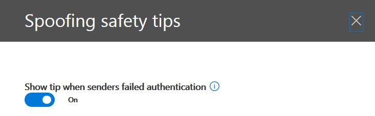
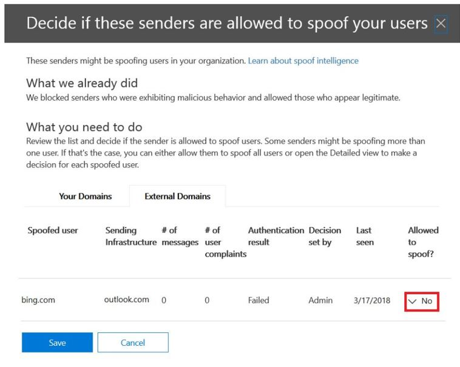
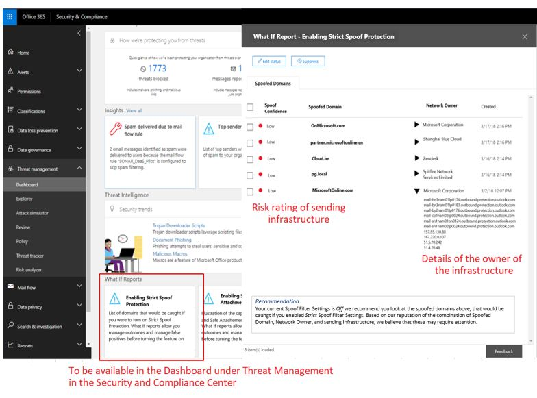

# <a name="anti-spoofing-protection-in-office-365"></a><span data-ttu-id="559e3-105">Protección contra suplantación de identidad en Office 365</span><span class="sxs-lookup"><span data-stu-id="559e3-105">Anti-spoofing protection in Office 365</span></span>

<span data-ttu-id="559e3-p102">Este artículo describe cómo Office 365 mitiga frente a ataques de suplantación de identidad que usa falsificado dominios de remitente, es decir, los dominios que están suplantados. Para ello, analizar los mensajes y el bloqueo de los que no se puede autenticar mediante los métodos de autenticación de correo electrónico estándar, ni otras técnicas de reputación del remitente. Este cambio se que se implementa para reducir el número de ataques de suplantación de identidad se exponen a los clientes a.</span><span class="sxs-lookup"><span data-stu-id="559e3-p102">This article describes how Office 365 mitigates against phishing attacks that uses forged sender domains, that is, domains that are spoofed. It accomplishes this by analyzing the messages and blocking the ones that cannot be authenticated using standard email authentication methods, nor other sender reputation techniques. This change is being implemented to reduce the number of phishing attacks customers are exposed to.</span></span>
  
<span data-ttu-id="559e3-109">En este artículo también se describe por qué se está realizando este cambio, cómo pueden preparar los clientes para que este cambio, cómo ver los mensajes que se verán afectados, cómo informar sobre los mensajes, cómo mitigar falsos positivos, así como cómo deben preparar los remitentes a Microsoft para esto cambiar.</span><span class="sxs-lookup"><span data-stu-id="559e3-109">This article also describes why this change is being made, how customers can prepare for this change, how to view messages that will be affected, how to report on messages, how to mitigate false positives, as well as how senders to Microsoft should prepare for this change.</span></span>
  
<span data-ttu-id="559e3-p103">La tecnología de Microsoft contra la suplantación inicialmente se implementó en sus organizaciones que tenían una suscripción a Office 365 Enterprise E5 o habían comprado el complemento de protección de amenaza avanzada de Office 365 (ATP) para su suscripción. A partir de octubre de 2018, hemos ampliado la protección para las organizaciones que tienen así como Exchange Online Protection (EOP). Además, debido a la forma en que todos nuestros filtros de información sobre cada uno de los otros, Outlook.com a los usuarios pueden verse afectados.</span><span class="sxs-lookup"><span data-stu-id="559e3-p103">Microsoft's anti-spoofing technology was initially deployed to its organizations that had an Office 365 Enterprise E5 subscription or had purchased the Office 365 Advanced Threat Protection (ATP) add-on for their subscription. As of October, 2018 we've extended the protection to organizations that have Exchange Online Protection (EOP) as well. Additionally, because of the way all of our filters learn from each other, Outlook.com users may also be affected.</span></span>
  
## <a name="how-spoofing-is-used-in-phishing-attacks"></a><span data-ttu-id="559e3-113">Cómo se utiliza la suplantación de identidad en los ataques de suplantación de identidad</span><span class="sxs-lookup"><span data-stu-id="559e3-113">How spoofing is used in phishing attacks</span></span>

<span data-ttu-id="559e3-p104">En cuanto a la protección de sus usuarios, Microsoft toma en serio la amenaza de suplantación de identidad. Una de las técnicas que normalmente usan los remitentes de spam y los suplantadores de identidad es suplantación de identidad, que es cuando el remitente está falsificado, y aparece un mensaje que proceden de una persona o en cualquier lugar que no sea el origen real. Esta técnica se usa a menudo en las campañas de suplantación de identidad diseñadas para obtener las credenciales de usuario. Tecnología de protección contra suplantación de Microsoft específicamente examina la falsificación de la ' desde: encabezado ' que es la única que se muestra en un cliente de correo electrónico como Outlook. Cuando Microsoft dispone de alta confianza que desde: encabezado está suplantado, identifica el mensaje como una dirección falsa.</span><span class="sxs-lookup"><span data-stu-id="559e3-p104">When it comes to protecting its users, Microsoft takes the threat of phishing seriously. One of the techniques that spammers and phishers commonly use is spoofing, which is when the sender is forged, and a message appears to originate from someone or somewhere other than the actual source. This technique is often used in phishing campaigns designed to obtain user credentials. Microsoft's Anti-spoof technology specifically examines forgery of the 'From: header' which is the one that shows up in an email client like Outlook. When Microsoft has high confidence that the From: header is spoofed, it identifies the message as a spoof.</span></span>
  
<span data-ttu-id="559e3-119">Los mensajes de suplantación de identidad tienen dos implicaciones negativas para los usuarios de la vida real:</span><span class="sxs-lookup"><span data-stu-id="559e3-119">Spoofing messages have two negative implications for real life users:</span></span>
  
### <a name="1-spoofed-messages-deceive-users"></a><span data-ttu-id="559e3-120">1. falsificados mensajes engañar a los usuarios</span><span class="sxs-lookup"><span data-stu-id="559e3-120">1. Spoofed messages deceive users</span></span>
  
<span data-ttu-id="559e3-p105">En primer lugar, un mensaje falso puede engañar a un usuario para que al hacer clic en un vínculo y renunciar a sus credenciales, descarga malware o responder a un mensaje con contenido confidencial (el último de los cuales se conoce como compromiso de correo electrónico empresarial). Por ejemplo, el siguiente es un mensaje de suplantación de identidad con un remitente falsificado de msoutlook94@service.outlook.com:</span><span class="sxs-lookup"><span data-stu-id="559e3-p105">First, a spoofed message may trick a user into clicking a link and giving up their credentials, downloading malware, or replying to a message with sensitive content (the latter of which is known as Business Email Compromise). For example, the following is a phishing message with a spoofed sender of msoutlook94@service.outlook.com:</span></span>
  

  
<span data-ttu-id="559e3-p106">Lo anterior no proviene realmente de service.outlook.com, pero en su lugar haya sido suplantada por el atacante para facilitar la misma apariencia que. Está intentando engañar a un usuario para que al hacer clic en el vínculo dentro del mensaje.</span><span class="sxs-lookup"><span data-stu-id="559e3-p106">The above did not actually come from service.outlook.com, but instead was spoofed by the phisher to make it look like it did. It is attempting to trick a user into clicking the link within the message.</span></span>
  
<span data-ttu-id="559e3-126">El ejemplo siguiente es la falsificación de contoso.com:</span><span class="sxs-lookup"><span data-stu-id="559e3-126">The next example is spoofing contoso.com:</span></span>
  

  
<span data-ttu-id="559e3-p107">El mensaje parece legítimo, pero en realidad es una dirección falsa. Este mensaje de suplantación de identidad es un tipo de compromiso de correo electrónico empresarial que es una subcategoría de suplantación de identidad.</span><span class="sxs-lookup"><span data-stu-id="559e3-p107">The message looks legitimate, but in fact is a spoof. This phishing message is a type of Business Email Compromise which is a subcategory of phishing.</span></span>
    
### <a name="2-users-confuse-real-messages-for-fake-ones"></a><span data-ttu-id="559e3-130">2. los usuarios se debe confundir los mensajes reales para modificarlos falsos</span><span class="sxs-lookup"><span data-stu-id="559e3-130">2. Users confuse real messages for fake ones</span></span>
  
<span data-ttu-id="559e3-p108">Los mensajes en segundo lugar, falsos crean incertidumbre para los usuarios que saber acerca de los mensajes de suplantación de identidad, pero no puede saber la diferencia entre un mensaje real y uno FALSO. Por ejemplo, el siguiente es un ejemplo de una contraseña real restablecer desde la dirección de correo electrónico de la cuenta de Microsoft Security:</span><span class="sxs-lookup"><span data-stu-id="559e3-p108">Second, spoofed messages create uncertainty for users who know about phishing messages but cannot tell the difference between a real message and spoofed one. For example, the following is an example of an actual password reset from the Microsoft Security account email address:</span></span>
  

  
<span data-ttu-id="559e3-p109">El mensaje anterior ¿proviene de Microsoft, pero al mismo tiempo, los usuarios se utilizan para obtener los mensajes de suplantación de identidad que puede engañar a un usuario al hacer clic en un vínculo y renunciar a sus credenciales, descarga malware o responder a un mensaje con contenido confidencial. Dado que es difícil indicar la diferencia entre un restablecimiento de la contraseña real y una falsificación uno, muchos usuarios omitir estos mensajes, identificarlos como correo no deseado o innecesariamente informar de los mensajes a Microsoft como las estafas de suplantación de identidad perdidas.</span><span class="sxs-lookup"><span data-stu-id="559e3-p109">The above message did come from Microsoft, but at the same time, users are used to getting phishing messages that may trick a user into clicking a link and giving up their credentials, downloading malware, or replying to a message with sensitive content. Because it is difficult to tell the difference between a real password reset and a fake one, many users ignore these messages, report them as spam, or unnecessarily report the messages back to Microsoft as missed phishing scams.</span></span>
    
<span data-ttu-id="559e3-p110">Para detener la suplantación de identidad, el correo electrónico filtrado del sector ha desarrollado protocolos de autenticación de correo electrónico como [SPF](https://docs.microsoft.com/office365/SecurityCompliance/set-up-spf-in-office-365-to-help-prevent-spoofing), [DKIM](https://docs.microsoft.com/office365/SecurityCompliance/use-dkim-to-validate-outbound-email)y [DMARC](https://docs.microsoft.com/office365/SecurityCompliance/use-dmarc-to-validate-email). DMARC evita la suplantación de examen de un remitente mensaje - que el usuario ve en su cliente de correo electrónico (en los ejemplos anteriores, esto es service.outlook.com, outlook.com y accountprotection.microsoft.com) - con el dominio que se pasa SPF o DKIM. Es decir, el dominio que ve el usuario se ha autenticado y, por tanto, no se suplanta. Para obtener una descripción más completa, vea la sección "*Descripción de por qué la autenticación de correo electrónico no siempre es suficiente para detener la suplantación de identidad"* más adelante en este documento.</span><span class="sxs-lookup"><span data-stu-id="559e3-p110">To stop spoofing, the email filtering industry has developed email authentication protocols such as [SPF](https://docs.microsoft.com/office365/SecurityCompliance/set-up-spf-in-office-365-to-help-prevent-spoofing), [DKIM](https://docs.microsoft.com/office365/SecurityCompliance/use-dkim-to-validate-outbound-email), and [DMARC](https://docs.microsoft.com/office365/SecurityCompliance/use-dmarc-to-validate-email). DMARC prevents spoofing examining a message's sender - the one that the user sees in their email client (in the examples above, this is service.outlook.com, outlook.com, and accountprotection.microsoft.com) - with the domain that passed SPF or DKIM. That is, the domain that the user sees has been authenticated and is therefore not spoofed. For a more complete discussion, see the section "*Understanding why email authentication is not always enough to stop spoofing"*  later on in this document.</span></span> 
  
<span data-ttu-id="559e3-p111">Sin embargo, el problema es que la autenticación de correo electrónico registros son opcionales, no es necesario. Por lo tanto, mientras que los dominios con las directivas de autenticación segura, como microsoft.com y skype.com están protegidos contra suplantación de identidad, dominios que publicar las directivas de autenticación más débiles o ninguna directiva en absoluto, son el objetivo de suplantación. A partir de marzo de 2018, sólo un 9% de dominios de las compañías en la lista de Fortune 500 publicar las directivas de autenticación de correo electrónico seguro. El 91% restante puede ser suplantada por un atacante y, a menos que detecte el filtro de correo electrónico, con la directiva de otro, se puede entregar a un usuario final y engañar a ellos:</span><span class="sxs-lookup"><span data-stu-id="559e3-p111">However, the problem is that email authentication records are optional, not required. Therefore, while domains with strong authentication policies like microsoft.com and skype.com are protected from spoofing, domains that publish weaker authentication policies, or no policy at all, are targets for being spoofed.As of March 2018, only 9% of domains of companies in the Fortune 500 publish strong email authentication policies. The remaining 91% may be spoofed by a phisher, and unless the email filter detects it using another policy, may be delivered to an end user and deceive them:</span></span>
  

  
<span data-ttu-id="559e3-144">La proporción de las empresas de tamaño de pequeñas y medianas no son en la lista de Fortune 500 que publicar las directivas de autenticación de correo electrónico seguro es más pequeño y más pequeños aún para dominios que están fuera de Norteamérica y Europa occidental.</span><span class="sxs-lookup"><span data-stu-id="559e3-144">The proportion of small-to-medium sized companies that are not in the Fortune 500 that publish strong email authentication policies is smaller, and smaller still for domains that are outside of North America and western Europe.</span></span>
  
<span data-ttu-id="559e3-145">Esto es un gran problema porque mientras las empresas pueden no ser conscientes de cómo funciona la autenticación de correo electrónico, los suplantadores de identidad comprender y permite aprovechar la falta del mismo.</span><span class="sxs-lookup"><span data-stu-id="559e3-145">This is a big problem because while enterprises may not be aware of how email authentication works, phishers do understand and take advantage of the lack of it.</span></span>
  
<span data-ttu-id="559e3-146">Para obtener información sobre la configuración de SPF, DKIM y DMARC, vea la sección "*a los clientes de Office 365"* más adelante en este documento.</span><span class="sxs-lookup"><span data-stu-id="559e3-146">For information on setting up SPF, DKIM, and DMARC, see the section "*Customers of Office 365"*  later on in this document.</span></span> 
  
## <a name="stopping-spoofing-with-implicit-email-authentication"></a><span data-ttu-id="559e3-147">Detención de suplantación de identidad con la autenticación implícita de correo electrónico</span><span class="sxs-lookup"><span data-stu-id="559e3-147">Stopping spoofing with implicit email authentication</span></span>

<span data-ttu-id="559e3-p112">Debido a que la suplantación de identidad de suplantación de identidad y lanza es este problema y debido a la adopción de directivas de autenticación de correo electrónico seguro limitada, Microsoft continúa invirtiendo en capacidades para proteger a sus clientes. Por lo tanto, Microsoft está moviendo con antelación con *la autenticación implícita de correo electrónico* - si no autentica un dominio, Microsoft se tratará como si haya publicado registros de la autenticación de correo electrónico y tratar adecuadamente si no se pasan.</span><span class="sxs-lookup"><span data-stu-id="559e3-p112">Because phishing and spear phishing is such a problem, and because of the limited adoption of strong email authentication policies, Microsoft continues to invest in capabilities to protect its customers. Therefore, Microsoft is moving ahead with  *implicit email authentication* - if a domain doesn't authenticate, Microsoft will treat it as if it had published email authentication records and treat it accordingly if it doesn't pass.</span></span> 
  
<span data-ttu-id="559e3-p113">Para ello, Microsoft ha creado numerosas extensiones a la autenticación de correo electrónico regular incluidos reputación del remitente, historial de remitentes/destinatarios, análisis de comportamiento y otras técnicas avanzadas. Un mensaje enviado desde un dominio que no publica la autenticación de correo electrónico se marcará como falso a menos que lo contiene otros señales indicar que es legítimo.</span><span class="sxs-lookup"><span data-stu-id="559e3-p113">To accomplish this, Microsoft has built numerous extensions to regular email authentication including sender reputation, sender/recipient history, behavioral analysis, and other advanced techniques. A message sent from a domain that doesn't publish email authentication will be marked as spoof unless it contains other signals to indicate that it is legitimate.</span></span>
  
<span data-ttu-id="559e3-152">Al hacerlo, end pueden tener los usuarios con nivel de confianza que no se ha suplantado un correo electrónico enviado a ellos, los remitentes pueden estar seguros de que nadie está suplantando a su dominio, y los clientes de Office 365 pueden ofrecer protección incluso mejor como protección de suplantación.</span><span class="sxs-lookup"><span data-stu-id="559e3-152">By doing this, end users can have confidence that an email sent to them has not been spoofed, senders can be confident that nobody is impersonating their domain, and customers of Office 365 can offer even better protection such as Impersonation protection.</span></span>
  
<span data-ttu-id="559e3-153">Para ver el anuncio general de Microsoft, vea [un mar de phishing parte 2 - mejorado contra suplantación de identidad en Office 365](https://techcommunity.microsoft.com/t5/Security-Privacy-and-Compliance/Schooling-A-Sea-of-Phish-Part-2-Enhanced-Anti-spoofing/ba-p/176209).</span><span class="sxs-lookup"><span data-stu-id="559e3-153">To see Microsoft's general announcement, see [A Sea of Phish Part 2 - Enhanced Anti-spoofing in Office 365](https://techcommunity.microsoft.com/t5/Security-Privacy-and-Compliance/Schooling-A-Sea-of-Phish-Part-2-Enhanced-Anti-spoofing/ba-p/176209).</span></span>
  
## <a name="identifying-that-a-message-is-classified-as-spoofed"></a><span data-ttu-id="559e3-154">Identificación de que un mensaje se clasifica como suplantada</span><span class="sxs-lookup"><span data-stu-id="559e3-154">Identifying that a message is classified as spoofed</span></span>

### <a name="composite-authentication"></a><span data-ttu-id="559e3-155">Autenticación compuesta</span><span class="sxs-lookup"><span data-stu-id="559e3-155">Composite authentication</span></span>

<span data-ttu-id="559e3-p114">Mientras SPF, DKIM y DMARC pueden ser todos útiles por sí mismos, no comunicar el suficiente estado de la autenticación en el caso de un mensaje no tiene autenticación explícita registros. Por lo tanto, Microsoft ha desarrollado un algoritmo que combina varias señales en un único valor que se denomina autenticación compuesto, o compauth para short. Los clientes de Office 365 tienen los valores de compauth que se mostrará en el encabezado de *Resultados de la autenticación* en los encabezados de mensaje.</span><span class="sxs-lookup"><span data-stu-id="559e3-p114">While SPF, DKIM, and DMARC are all useful by themselves, they don't communicate enough authentication status in the event a message has no explicit authentication records. Therefore, Microsoft has developed an algorithm that combines multiple signals into a single value called Composite Authentication, or compauth for short. Customers in Office 365 have compauth values stamped into the *Authentication-Results* header in the message headers.</span></span> 
  
```
Authentication-Results:
  compauth=<fail|pass|softpass|none> reason=<yyy>

```

|<span data-ttu-id="559e3-159">**Resultado de CompAuth**</span><span class="sxs-lookup"><span data-stu-id="559e3-159">**CompAuth result**</span></span>|<span data-ttu-id="559e3-160">**Descripción**</span><span class="sxs-lookup"><span data-stu-id="559e3-160">**Description**</span></span>|
|:-----|:-----|
|<span data-ttu-id="559e3-161">conmutación por error</span><span class="sxs-lookup"><span data-stu-id="559e3-161">fail</span></span>|<span data-ttu-id="559e3-162">Mensaje de error de autenticación explícita (envío de dominio publicado al registros explícitamente en DNS) o la autenticación implícita (envío de dominio no publica los registros de DNS, por lo que Office 365 interpolan el resultado como si lo hubiera publicado registros).</span><span class="sxs-lookup"><span data-stu-id="559e3-162">Message failed explicit authentication (sending domain published records explicitly in DNS) or implicit authentication (sending domain did not publish records in DNS, so Office 365 interpolated the result as if it had published records).</span></span>|
|<span data-ttu-id="559e3-163">pase</span><span class="sxs-lookup"><span data-stu-id="559e3-163">pass</span></span>|<span data-ttu-id="559e3-164">Mensaje pasa autenticación explícita (mensaje pasa DMARC o [Procedimientos DMARC pasa adivinar](https://blogs.msdn.microsoft.com/tzink/2015/05/06/what-is-dmarc-bestguesspass-in-office-365)) o la autenticación implícita con confianza alta (envío de dominio no publica los registros de la autenticación de correo electrónico, pero Office 365 tiene señales de seguro back-end indicar el mensaje es probable que legítimos).</span><span class="sxs-lookup"><span data-stu-id="559e3-164">Message passed explicit authentication (message passed DMARC, or [Best Guess Passed DMARC](https://blogs.msdn.microsoft.com/tzink/2015/05/06/what-is-dmarc-bestguesspass-in-office-365)) or implicit authentication with high confidence (sending domain does not publish email authentication records, but Office 365 has strong backend signals to indicate the message is likely legitimate).</span></span>|
|<span data-ttu-id="559e3-165">softpass</span><span class="sxs-lookup"><span data-stu-id="559e3-165">softpass</span></span>|<span data-ttu-id="559e3-166">Mensaje que pasa la autenticación implícita con confianza bajo a medio (envío de dominio no publica la autenticación de correo electrónico, pero Office 365 tiene señales de back-end para indicar el mensaje es legítimo pero la fuerza de la señal es más débil).</span><span class="sxs-lookup"><span data-stu-id="559e3-166">Message passed implicit authentication with low-to-medium confidence (sending domain does not publish email authentication, but Office 365 has backend signals to indicate the message is legitimate but the strength of the signal is weaker).</span></span>|
|<span data-ttu-id="559e3-167">Ninguno</span><span class="sxs-lookup"><span data-stu-id="559e3-167">none</span></span>|<span data-ttu-id="559e3-168">Mensaje no se autenticó (o se autenticó pero que no Alinear), pero no se aplican debido a la reputación del remitente o de otros factores de autenticación compuesta.</span><span class="sxs-lookup"><span data-stu-id="559e3-168">Message did not authenticate (or it did authenticate but did not align), but composite authentication not applied due to sender reputation or other factors.</span></span>|
   
|||
|:-----|:-----|
|<span data-ttu-id="559e3-169">**Reason**</span><span class="sxs-lookup"><span data-stu-id="559e3-169">**Reason**</span></span>|<span data-ttu-id="559e3-170">**Descripción**</span><span class="sxs-lookup"><span data-stu-id="559e3-170">**Description**</span></span>|
|<span data-ttu-id="559e3-171">0XX</span><span class="sxs-lookup"><span data-stu-id="559e3-171">0xx</span></span>|<span data-ttu-id="559e3-172">Mensaje de error de autenticación compuesta.</span><span class="sxs-lookup"><span data-stu-id="559e3-172">Message failed composite authentication.</span></span><br/><span data-ttu-id="559e3-p115">**000** significa que el mensaje no pudo DMARC con una acción de rechazar o cuarentena.                    -001 significa que el mensaje de error en la autenticación implícita de correo electrónico. Esto significa que el dominio del remitente no tenía registros de la autenticación de correo electrónico publicados o, si es así, que tenían una directiva de errores más débil (fail suave SPF o neutral, directiva de DMARC de p = none).</span><span class="sxs-lookup"><span data-stu-id="559e3-p115">**000** means the message failed DMARC with an action of reject or quarantine.                    - 001 means the message failed implicit email authentication. This means that the sending domain did not have email authentication records published, or if they did, they had a weaker failure policy (SPF soft fail or neutral, DMARC policy of p=none).  </span></span><br/><span data-ttu-id="559e3-176">**002** significa que la organización tiene una directiva para el par de remitente o dominio que está prohibido explícitamente de envío de correo electrónico falso, esta configuración se establece manualmente por un administrador.</span><span class="sxs-lookup"><span data-stu-id="559e3-176">**002** means the organization has a policy for the sender/domain pair that is explicitly prohibited from sending spoofed email, this setting is manually set by an administrator.</span></span>  <br/><span data-ttu-id="559e3-177">**010** significa que el mensaje no pudo DMARC con una acción de rechazar o cuarentena, y el dominio del remitente es uno de los dominios aceptados de su organización (Esto es parte de self-to-self o dentro de la organización, suplantación de identidad).</span><span class="sxs-lookup"><span data-stu-id="559e3-177">**010** means the message failed DMARC with an action of reject or quarantine, and the sending domain is one of your organization's accepted-domains (this is part of self-to-self, or intra-org, spoofing).</span></span>  <br/><span data-ttu-id="559e3-178">**011** significa que el mensaje de error en la autenticación implícita de correo electrónico y el dominio del remitente es uno de los dominios aceptados de su organización (Esto es parte de self-to-self o dentro de la organización, suplantación de identidad).</span><span class="sxs-lookup"><span data-stu-id="559e3-178">**011** means the message failed implicit email authentication, and the sending domain is one of your organization's accepted domains (this is part of self-to-self, or intra-org, spoofing).</span></span>|
|<span data-ttu-id="559e3-179">Todos los otros códigos (1xx, 2xx, 3xx, 4xx, 5xx)</span><span class="sxs-lookup"><span data-stu-id="559e3-179">All other codes (1xx, 2xx, 3xx, 4xx, 5xx)</span></span>|<span data-ttu-id="559e3-180">Corresponde a diversos códigos internos de por qué un mensaje pasa a la autenticación implícita o no tenía autenticación pero no se aplicó ninguna acción.</span><span class="sxs-lookup"><span data-stu-id="559e3-180">Corresponds to various internal codes for why a message passed implicit authentication, or had no authentication but no action was applied.</span></span>|
   
<span data-ttu-id="559e3-181">Mirando los encabezados de un mensaje, un administrador o incluso un usuario final puede determinar cómo Office 365 llega a la conclusión que el remitente puede ser suplantado.</span><span class="sxs-lookup"><span data-stu-id="559e3-181">By looking at the headers of a message, an administrator or even an end user can determine how Office 365 arrives at the conclusion that the sender may be spoofed.</span></span>
  
### <a name="differentiating-between-different-types-of-spoofing"></a><span data-ttu-id="559e3-182">Diferenciar los distintos tipos de suplantación de identidad</span><span class="sxs-lookup"><span data-stu-id="559e3-182">Differentiating between different types of spoofing</span></span>

<span data-ttu-id="559e3-183">Microsoft distingue entre dos tipos diferentes de los mensajes de suplantación de identidad:</span><span class="sxs-lookup"><span data-stu-id="559e3-183">Microsoft differentiates between two different types of spoofing messages:</span></span>
  
 <span data-ttu-id="559e3-184">**Suplantación de identidad dentro de la organización**</span><span class="sxs-lookup"><span data-stu-id="559e3-184">**Intra-org spoofing**</span></span>
  
<span data-ttu-id="559e3-185">También conocido como self-to-self suplantación de identidad, esto se produce cuando el dominio en el campo de: dirección es la misma que o se alinea con el dominio de destinatario (cuando el dominio de destinatario es uno de los [Dominios aceptados](https://technet.microsoft.com/en-us/library/jj945194%28v=exchg.150%29.aspx)de su organización); o bien, cuando el dominio en el campo de: dirección es parte de la misma organización.</span><span class="sxs-lookup"><span data-stu-id="559e3-185">Also known as self-to-self spoofing, this occurs when the domain in the From: address is the same as, or aligns with, the recipient domain (when recipient domain is one of your organization's [Accepted Domains](https://technet.microsoft.com/en-us/library/jj945194%28v=exchg.150%29.aspx)); or, when the domain in the From: address is part of the same organization.</span></span>
  
<span data-ttu-id="559e3-p116">Por ejemplo, el siguiente tiene remitente y el destinatario desde el mismo dominio (contoso.com). En la dirección de correo electrónico para evitar que el robot electrónico recolección en esta página se insertan espacios):</span><span class="sxs-lookup"><span data-stu-id="559e3-p116">For example, the following has sender and recipient from the same domain (contoso.com). Spaces are inserted into the email address to prevent spambot harvesting on this page):</span></span>
  
<span data-ttu-id="559e3-188">De: remitente @ contoso.com</span><span class="sxs-lookup"><span data-stu-id="559e3-188">From: sender @ contoso.com</span></span>
  
<span data-ttu-id="559e3-189">Para: destinatario @ contoso.com</span><span class="sxs-lookup"><span data-stu-id="559e3-189">To: recipient @ contoso.com</span></span>
  
<span data-ttu-id="559e3-190">El siguiente consta de los dominios de remitente y el destinatario alinear con el dominio organizativo (fabrikam.com):</span><span class="sxs-lookup"><span data-stu-id="559e3-190">The following has the sender and recipient domains aligning with the organizational domain (fabrikam.com):</span></span>
  
<span data-ttu-id="559e3-191">De: remitente @ foo.fabrikam.com</span><span class="sxs-lookup"><span data-stu-id="559e3-191">From: sender @ foo.fabrikam.com</span></span>
  
<span data-ttu-id="559e3-192">Para: destinatario @ bar.fabrikam.com</span><span class="sxs-lookup"><span data-stu-id="559e3-192">To: recipient @ bar.fabrikam.com</span></span>
  
<span data-ttu-id="559e3-193">Los siguientes dominios de remitente y el destinatario son diferentes (microsoft.com y bing.com), pero pertenecen a la misma organización (es decir, ambos forman parte de dominios aceptados de la organización):</span><span class="sxs-lookup"><span data-stu-id="559e3-193">The following sender and recipient domains are different (microsoft.com and bing.com), but they belong to the same organization (that is, both are part of the organization's Accepted Domains):</span></span>
  
<span data-ttu-id="559e3-194">De: remitente @ microsoft.com</span><span class="sxs-lookup"><span data-stu-id="559e3-194">From: sender @ microsoft.com</span></span>
  
<span data-ttu-id="559e3-195">Para: destinatario @ bing.com</span><span class="sxs-lookup"><span data-stu-id="559e3-195">To: recipient @ bing.com</span></span>
  
<span data-ttu-id="559e3-196">Los mensajes que no pasan la suplantación de identidad dentro de la organización contienen los siguientes valores en los encabezados:</span><span class="sxs-lookup"><span data-stu-id="559e3-196">Messages that fail intra-org spoofing contain the following values in the headers:</span></span>
  
<span data-ttu-id="559e3-197">X-Forefront-Antispam-Report:... CAT:SPM/HSPM/PHSH;... SFTY:9.11</span><span class="sxs-lookup"><span data-stu-id="559e3-197">X-Forefront-Antispam-Report: ...CAT:SPM/HSPM/PHSH;...SFTY:9.11</span></span>
  
<span data-ttu-id="559e3-198">El gato es la categoría del mensaje y normalmente se marca como SPM (correo no deseado), pero en ocasiones pueden ser HSPM (correo no deseado de alta confianza) o phishing (suplantación de identidad) dependiendo de qué otros tipos de modelos se producen en el mensaje.</span><span class="sxs-lookup"><span data-stu-id="559e3-198">The CAT is the category of the message, and it is normally stamped as SPM (spam), but occasionally may be HSPM (high confidence spam) or PHISH (phishing) depending upon what other types of patterns occur in the message.</span></span>
  
<span data-ttu-id="559e3-199">El SFTY es el nivel de seguridad del mensaje, el primer medio de dígito (9) del mensaje es suplantación de identidad y segundo conjunto de dígitos después del punto (11) significa que es la suplantación de identidad dentro de la organización.</span><span class="sxs-lookup"><span data-stu-id="559e3-199">The SFTY is the safety level of the message, the first digit (9) means the message is phishing, and second set of digits after the dot (11) means it is intra-org spoofing.</span></span>
  
<span data-ttu-id="559e3-200">No hay ningún código de motivo específico para la autenticación de composición para dentro de suplantación, de la organización, se mostrará más adelante en 2018 (escala de tiempo aún no se ha definido).</span><span class="sxs-lookup"><span data-stu-id="559e3-200">There is no specific reason code for Composite Authentication for intra-org spoofing, that will be stamped later in 2018 (timeline not yet defined).</span></span>
  
 <span data-ttu-id="559e3-201">**Suplantación de identidad entre dominios**</span><span class="sxs-lookup"><span data-stu-id="559e3-201">**Cross-domain spoofing**</span></span>
  
<span data-ttu-id="559e3-p117">Esto se produce cuando el dominio en el campo de envío: dirección es un dominio externo a la organización receptora. Los mensajes que no pasan la autenticación compuesto debido a la suplantación de identidad entre dominios contienen los siguientes valores en los encabezados:</span><span class="sxs-lookup"><span data-stu-id="559e3-p117">This occurs when the sending domain in the From: address is an external domain to the receiving organization. Messages that fail Composite Authentication due to cross-domain spoofing contain the following values in the headers:</span></span>
  
<span data-ttu-id="559e3-p118">Resultados de autenticación:... compauth = fail motivo = 000/001</span><span class="sxs-lookup"><span data-stu-id="559e3-p118">Authentication-Results: … compauth=fail reason=000/001</span></span>
  
<span data-ttu-id="559e3-206">X-Forefront-Antispam-Report:... CAT:SPOOF;... SFTY:9.22</span><span class="sxs-lookup"><span data-stu-id="559e3-206">X-Forefront-Antispam-Report: ...CAT:SPOOF;...SFTY:9.22</span></span>
  
<span data-ttu-id="559e3-207">En ambos casos, se mostrará la sugerencia de color rojo de seguridad siguientes en el mensaje, o un equivalente que se personaliza para el idioma del buzón de destinatarios:</span><span class="sxs-lookup"><span data-stu-id="559e3-207">In both cases, the following red safety tip is stamped in the message, or an equivalent that is customized to the recipient mailbox's language:</span></span>
  

  
<span data-ttu-id="559e3-209">Es solo con mirar desde: de direcciones y saber cuál es su correo electrónico del destinatario o por inspeccionar los encabezados de correo electrónico, que se pueden diferenciar entre dominios de suplantación y dentro de la organización.</span><span class="sxs-lookup"><span data-stu-id="559e3-209">It's only by looking at the From: address and knowing what your recipient email is, or by inspecting the email headers, that you can differentiate between intra-org and cross-domain spoofing.</span></span>
  
## <a name="how-customers-of-office-365-can-prepare-themselves-for-the-new-anti-spoofing-protection"></a><span data-ttu-id="559e3-210">Cómo los clientes de Office 365 pueden prepararse para la nueva protección contra la suplantación</span><span class="sxs-lookup"><span data-stu-id="559e3-210">How customers of Office 365 can prepare themselves for the new anti-spoofing protection</span></span>

### <a name="information-for-administrators"></a><span data-ttu-id="559e3-211">Información para los administradores</span><span class="sxs-lookup"><span data-stu-id="559e3-211">Information for administrators</span></span>

<span data-ttu-id="559e3-212">Como administrador de una organización en Office 365, hay varias partes clave de la información que deben tener en cuenta.</span><span class="sxs-lookup"><span data-stu-id="559e3-212">As an administrator of an organization in Office 365, there are several key pieces of information you should be aware of.</span></span>
  
### <a name="understanding-why-email-authentication-is-not-always-enough-to-stop-spoofing"></a><span data-ttu-id="559e3-213">Descripción de por qué la autenticación de correo electrónico no siempre es suficiente para detener la suplantación de identidad</span><span class="sxs-lookup"><span data-stu-id="559e3-213">Understanding why email authentication is not always enough to stop spoofing</span></span>

<span data-ttu-id="559e3-p119">La protección contra la suplantación nuevo se basa en la autenticación de correo electrónico (SPF, DKIM y DMARC) no marcar un mensaje como suplantación de identidad. Un ejemplo común es cuando un dominio remitente nunca ha publicado los registros de SPF. Si no hay ningún registro SPF o que están configurados correctamente, se marcará un mensaje enviado como suplantar a menos que Microsoft tiene inteligencia de back-end que indica que el mensaje es legítimo.</span><span class="sxs-lookup"><span data-stu-id="559e3-p119">The new anti-spoofing protection relies on email authentication (SPF, DKIM, and DMARC) to not mark a message as spoofing. A common example is when a sending domain has never published SPF records. If there are no SPF records or they are incorrectly set up, a sent message will be marked as spoofed unless Microsoft has back-end intelligence that says the message is legitimate.</span></span>
  
<span data-ttu-id="559e3-217">Por ejemplo, antes de contra la suplantación va a implementar, un mensaje es posible que han consultado como la siguiente con ningún registro de SPF, no hay ningún registro DKIM y ningún registro DMARC:</span><span class="sxs-lookup"><span data-stu-id="559e3-217">For example, prior to anti-spoofing being deployed, a message may have looked like the following with no SPF record, no DKIM record, and no DMARC record:</span></span> 
  
```
Authentication-Results: spf=none (sender IP is 1.2.3.4)
  smtp.mailfrom=example.com; contoso.com; dkim=none
  (message not signed) header.d=none; contoso.com; dmarc=none
  action=none header.from=example.com;
From: sender @ example.com
To: receiver @ contoso.com
```
<span data-ttu-id="559e3-218">Después de contra la suplantación, si tiene Office 365 Enterprise E5, elevación de privilegios o ATP, se mostrará el valor de compauth:</span><span class="sxs-lookup"><span data-stu-id="559e3-218">After anti-spoofing, if you have Office 365 Enterprise E5, EOP, or ATP, the compauth value is stamped:</span></span>
  
```
Authentication-Results: spf=none (sender IP is 1.2.3.4)
  smtp.mailfrom=example.com; contoso.com; dkim=none
  (message not signed) header.d=none; contoso.com; dmarc=none
  action=none header.from=example.com; compauth=fail reason=001
From: sender @ example.com
To: receiver @ contoso.com

```

<span data-ttu-id="559e3-219">Si example.com fijo esto mediante la configuración de un registro SPF pero no es un registro DKIM, esto pasaría autenticación compuesta debido a que el dominio que se pasa SPF se alinea con el dominio en el campo de: dirección:</span><span class="sxs-lookup"><span data-stu-id="559e3-219">If example.com fixed this by setting up an SPF record but not a DKIM record, this would pass composite authentication because the domain that passed SPF aligned with the domain in the From: address:</span></span> 
  
```
Authentication-Results: spf=pass (sender IP is 1.2.3.4)
  smtp.mailfrom=example.com; contoso.com; dkim=none
  (message not signed) header.d=none; contoso.com; dmarc=bestguesspass
  action=none header.from=example.com; compauth=pass reason=109
From: sender @ example.com
To: receiver @ contoso.com
```

<span data-ttu-id="559e3-220">O bien, si ha configurado un registro DKIM pero no un registro SPF, esto también pasaría autenticación compuesta debido a que el dominio en la firma de DKIM que pasa se alinea con el dominio en el campo de: dirección:</span><span class="sxs-lookup"><span data-stu-id="559e3-220">Or, if they set up a DKIM record but not an SPF record, this would also pass composite authentication because the domain in the DKIM-Signature that passed aligned with the domain in the From: address:</span></span> 
  
```
Authentication-Results: spf=none (sender IP is 1.2.3.4)
  smtp.mailfrom=example.com; contoso.com; dkim=pass
  (signature was verified) header.d=outbound.example.com;
  contoso.com; dmarc=bestguesspass action=none
  header.from=example.com; compauth=pass reason=109
From: sender @ example.com
To: receiver @ contoso.com
```

<span data-ttu-id="559e3-p120">Sin embargo, un atacante puede también configurar SPF y DKIM y firmar el mensaje con su propio dominio, pero especificar un dominio diferente en el campo de: dirección. SPF ni DKIM requiere el dominio que se va a alinear con el dominio en el campo de: de direcciones, por lo que, a menos que example.com publicado registros DMARC, esto no está marcado como suplantación mediante DMARC:</span><span class="sxs-lookup"><span data-stu-id="559e3-p120">However, a phisher may also set up SPF and DKIM and sign the message with their own domain, but specify a different domain in the From: address. Neither SPF nor DKIM requires the domain to align with the domain in the From: address, so unless example.com published DMARC records, this would not be marked as a spoof using DMARC:</span></span> 
  
```
Authentication-Results: spf=pass (sender IP is 5.6.7.8)
  smtp.mailfrom=maliciousDomain.com; contoso.com; dkim=pass
  (signature was verified) header.d=maliciousDomain.com;
  contoso.com; dmarc=none action=none header.from=example.com;
From: sender @ example.com
To: receiver @ contoso.com
```

<span data-ttu-id="559e3-223">En el cliente de correo electrónico (Outlook, Outlook en el web, o cualquier otro cliente de correo electrónico), sólo la From: se muestra el dominio, no en el dominio en el SPF o DKIM y que puede engañar al usuario en pensando example.com del que procede el mensaje, pero realmente procede de maliciousDomain.com .</span><span class="sxs-lookup"><span data-stu-id="559e3-223">In the email client (Outlook, Outlook on the web, or any other email client), only the From: domain is displayed, not the domain in the SPF or DKIM, and that can mislead the user into thinking the message came from example.com, but actually came from maliciousDomain.com.</span></span>
  

  
<span data-ttu-id="559e3-p121">Por ese motivo, Office 365 requiere que el dominio en el campo de: dirección se alinea con el dominio en la firma de SPF o DKIM y, si no, contiene otras señales interno que indica que el mensaje es legítimo. De lo contrario, el mensaje sería un error compauth.</span><span class="sxs-lookup"><span data-stu-id="559e3-p121">For that reason, Office 365 requires that the domain in the From: address aligns with the domain in the SPF or DKIM signature, and if it doesn't, contains some other internal signals that indicates that the message is legitimate. Otherwise, the message would be a compauth fail.</span></span> 
  
```
Authentication-Results: spf=none (sender IP is 5.6.7.8)
  smtp.mailfrom=maliciousDomain.com; contoso.com; dkim=pass
  (signature was verified) header.d=maliciousDomain.com;
  contoso.com; dmarc=none action=none header.from=contoso.com;
  compauth=fail reason=001
From: sender@contoso.com
To: someone@example.com
```

<span data-ttu-id="559e3-p122">Por lo tanto, Office 365 contra la suplantación protege contra dominios sin autenticación y contra dominios que ha configurado la autenticación pero el error de coincidencia para el dominio en el campo de: direcciones ya que es el que el usuario ve y se considera que son el remitente del mensaje. Esto es así tanto de dominios externos a su organización, así como dominios dentro de la organización.</span><span class="sxs-lookup"><span data-stu-id="559e3-p122">Thus, Office 365 anti-spoofing protects against domains with no authentication, and against domains who set up authentication but mismatch against the domain in the From: address as that is the one that the user sees and believes is the sender of the message. This is true both of domains external to your organization, as well as domains within your organization.</span></span>
  
<span data-ttu-id="559e3-229">Por lo tanto, si alguna vez recibe un mensaje de error de autenticación compuesta y se marca como suplantada, incluso si el mensaje pasa SPF y DKIM, es debido a que el dominio que se pasa SPF y DKIM no se alinea con el dominio en el campo de: dirección.</span><span class="sxs-lookup"><span data-stu-id="559e3-229">Therefore, if you ever receive a message that failed composite authentication and is marked as spoofed, even though the message passed SPF and DKIM, it's because the domain that passed SPF and DKIM are not aligned with the domain in the From: address.</span></span>
  
### <a name="understanding-changes-in-how-spoofed-emails-are-treated"></a><span data-ttu-id="559e3-230">Se tratan los cambios de descripción en los correos electrónicos de cómo falsos</span><span class="sxs-lookup"><span data-stu-id="559e3-230">Understanding changes in how spoofed emails are treated</span></span>

<span data-ttu-id="559e3-p123">Actualmente, todas las organizaciones de Office 365 - ATP y que no sean-ATP - mensajes que no pasan la DMARC con una directiva de rechazar o cuarentena están marcadas como correo no deseado y normalmente lleve a cabo la acción de spam de alta confianza o, a veces en la acción de spam regular (dependiendo de si otro spam las reglas en primer lugarlo identifican como correo no deseado). Detecciones de falsos dentro de la organización tomar la acción spam regular. Este comportamiento no deben habilitarse ni puede deshabilitarse.</span><span class="sxs-lookup"><span data-stu-id="559e3-p123">Currently, for all organizations in Office 365 - ATP and non-ATP - messages that fail DMARC with a policy of reject or quarantine are marked as spam and usually take the high confidence spam action, or sometimes the regular spam action (depending on whether other spam rules first identify it as spam). Intra-org spoof detections take the regular spam action. This behavior does not need to be enabled, nor can it be disabled.</span></span>
  
<span data-ttu-id="559e3-p124">Sin embargo, para los mensajes de suplantación de identidad de dominios, antes de este cambio debería conducir a través de comprobaciones de correo no deseado, phishing y malware regulares y si otras partes del filtro identifican como sospechosos, ¿marcarlos como malware, phishing o spam respectivamente. Con la protección de suplantación de identidad de dominios nuevo, los mensajes que no se puede autenticar, de forma predeterminada, realizará la acción definida en el Anti-phishing \> directiva de la suplantación de identidad. Si uno no está definida, se moverán a una carpeta de correo electrónico no deseado de los usuarios. En algunos casos, los mensajes sospechosos más también va a tener la sugerencia de seguridad rojo agrega al mensaje.</span><span class="sxs-lookup"><span data-stu-id="559e3-p124">However, for cross-domain spoofing messages, before this change they would go through regular spam, phish, and malware checks and if other parts of the filter identified them as suspicious, would mark them as spam, phish, or malware respectively. With the new cross-domain spoofing protection, any message that can't be authenticated will, by default, take the action defined in the Anti-phishing \> Anti-spoofing policy. If one is not defined, it will be moved to a users Junk Email folder. In some cases, more suspicious messages will also have the red safety tip added to the message.</span></span>
  
<span data-ttu-id="559e3-p125">Esto puede resultar en algunos mensajes que se han marcado anteriormente como correo no deseado aún Introducción marcados como correo no deseado pero ahora tendrá también una sugerencia de color rojo de seguridad; en otros casos, los mensajes que anteriormente se han marcado como que no sean correo no deseado se iniciará Introducción marcados como correo no deseado (CAT:SPOOF) con una sugerencia de color rojo seguridad agregan. En algunos casos, los clientes que se han mover todos los spam y phishing a la cuarentena ahora verían va a la carpeta correo electrónico no deseado (este comportamiento se puede cambiar, vea [cambiar la configuración contra la suplantación](#changing-your-anti-spoofing-settings)).</span><span class="sxs-lookup"><span data-stu-id="559e3-p125">This may result in some messages that were previously marked as spam still getting marked as spam but will now also have a red safety tip; in other cases, messages that were previously marked as non-spam will start getting marked as spam (CAT:SPOOF) with a red safety tip added. In still other cases, customers that were moving all spam and phish to the quarantine would now see them going to the Junk Mail Folder (this behavior can be changed, see [Changing your anti-spoofing settings](#changing-your-anti-spoofing-settings)).</span></span>
  
<span data-ttu-id="559e3-p126">Hay varias maneras diferentes de que un mensaje puede ser suplantado (vea [Differentiating entre los diferentes tipos de suplantación de identidad](#differentiating-between-different-types-of-spoofing) anteriormente en este artículo) pero a partir de marzo de 2018 no está todavía unificada la forma en que Office 365 trata estos mensajes. La tabla siguiente es un resumen rápido, con protección de suplantación de identidad de dominios que se va a nuevo comportamiento:</span><span class="sxs-lookup"><span data-stu-id="559e3-p126">There are multiple different ways a message can be spoofed (see  [Differentiating between different types of spoofing](#differentiating-between-different-types-of-spoofing) earlier in this article) but as of March 2018 the way Office 365 treats these messages is not yet unified. The following table is a quick summary, with Cross-domain spoofing protection being new behavior:</span></span> 
  
|<span data-ttu-id="559e3-242">**Tipo de suplantación**</span><span class="sxs-lookup"><span data-stu-id="559e3-242">**Type of spoof**</span></span>|<span data-ttu-id="559e3-243">**Categoría**</span><span class="sxs-lookup"><span data-stu-id="559e3-243">**Category**</span></span>|<span data-ttu-id="559e3-244">**¿Sugerencia de seguridad agregado?**</span><span class="sxs-lookup"><span data-stu-id="559e3-244">**Safety tip added?**</span></span>|<span data-ttu-id="559e3-245">**Se aplica a**</span><span class="sxs-lookup"><span data-stu-id="559e3-245">**Applies to**</span></span>|
|:-----|:-----|:-----|:-----|
|<span data-ttu-id="559e3-246">Error DMARC (cuarentena o rechazar)</span><span class="sxs-lookup"><span data-stu-id="559e3-246">DMARC fail (quarantine or reject)</span></span>  <br/> |<span data-ttu-id="559e3-247">HSPM (valor predeterminado), también pueden ser SPM o PHSH</span><span class="sxs-lookup"><span data-stu-id="559e3-247">HSPM (default), may also be SPM or PHSH</span></span>  <br/> |<span data-ttu-id="559e3-248">No (no)</span><span class="sxs-lookup"><span data-stu-id="559e3-248">No (not yet)</span></span>  <br/> |<span data-ttu-id="559e3-249">Todos los clientes de Office 365, Outlook.com</span><span class="sxs-lookup"><span data-stu-id="559e3-249">All Office 365 customers, Outlook.com</span></span>  <br/> |
|<span data-ttu-id="559e3-250">Self-to-self</span><span class="sxs-lookup"><span data-stu-id="559e3-250">Self-to-self</span></span>  <br/> |<span data-ttu-id="559e3-251">SPM</span><span class="sxs-lookup"><span data-stu-id="559e3-251">SPM</span></span>  <br/> |<span data-ttu-id="559e3-252">Sí</span><span class="sxs-lookup"><span data-stu-id="559e3-252">Yes</span></span>  <br/> |<span data-ttu-id="559e3-253">Todas las organizaciones de Office 365, Outlook.com</span><span class="sxs-lookup"><span data-stu-id="559e3-253">All Office 365 organizations, Outlook.com</span></span>  <br/> |
|<span data-ttu-id="559e3-254">Entre dominios</span><span class="sxs-lookup"><span data-stu-id="559e3-254">Cross-domain</span></span>  <br/> |<span data-ttu-id="559e3-255">SUPLANTACIÓN DE LA</span><span class="sxs-lookup"><span data-stu-id="559e3-255">SPOOF</span></span>  <br/> |<span data-ttu-id="559e3-256">Sí</span><span class="sxs-lookup"><span data-stu-id="559e3-256">Yes</span></span>  <br/> |<span data-ttu-id="559e3-257">Clientes de Office 365 avanzada protección frente a amenazas y E5</span><span class="sxs-lookup"><span data-stu-id="559e3-257">Office 365 Advanced Threat Protection and E5 customers</span></span>  <br/> |
   
### <a name="changing-your-anti-spoofing-settings"></a><span data-ttu-id="559e3-258">Cambiar la configuración contra la suplantación</span><span class="sxs-lookup"><span data-stu-id="559e3-258">Changing your anti-spoofing settings</span></span>

<span data-ttu-id="559e3-p127">Para crear o actualizar la configuración contra la suplantación de (dominios), navegue hasta el Anti-phishing \> contra la suplantación de la configuración en la administración de amenaza \> ficha Directiva en la seguridad &amp; centro de cumplimiento. Si nunca ha creado cualquier configuración contra suplantación de identidad, debe crear uno:</span><span class="sxs-lookup"><span data-stu-id="559e3-p127">To create or update your (cross-domain) anti-spoofing settings, navigate to the Anti-phishing \> Anti-spoofing settings under the Threat Management \> Policy tab in the Security &amp; Compliance Center. If you have never created any anti-phishing settings, you will need to create one:</span></span>
  

  
<span data-ttu-id="559e3-262">Si ya ha creado, se puede seleccionar para modificarla:</span><span class="sxs-lookup"><span data-stu-id="559e3-262">If you've already created one, you can select it to modify it:</span></span>
  

  
<span data-ttu-id="559e3-264">Seleccione la directiva que acaba de crear y continúe con los pasos tal como se describe en [obtener más información acerca de la suplantación de la inteligencia.](https://support.office.com/article/Learn-more-about-spoof-intelligence-978c3173-3578-4286-aaf4-8a10951978bf)</span><span class="sxs-lookup"><span data-stu-id="559e3-264">Select the policy you just created and proceed through the steps as described on [Learn More about Spoof Intelligence.](https://support.office.com/article/Learn-more-about-spoof-intelligence-978c3173-3578-4286-aaf4-8a10951978bf)</span></span>
  

  

  
<span data-ttu-id="559e3-267">Para crear una nueva directiva a través de PowerShell:</span><span class="sxs-lookup"><span data-stu-id="559e3-267">To create a new policy via PowerShell:</span></span> 
  
```
$org = Get-OrganizationConfig
$name = "My first anti-phishing policy for " + $org.Name
# Note: The name should not exclude 64 characters, including spaces.
# If it does, you will need to pick a smaller name.
# Next, create a new anti-phishing policy with the default values
New-AntiphishPolicy -Name $Name
# Select the domains to scope it to
# Multiple domains are specified in a comma-separated list
$domains = "domain1.com, domain2.com, domain3.com"
# Next, create the anti-phishing rule, scope it to the anti-phishing rule
New-AntiphishRule -Name $name -AntiphishPolicy $name -RecipientDomainIs $domains
```

<span data-ttu-id="559e3-p128">A continuación, puede modificar los parámetros de directiva contra suplantación de identidad con PowerShell, siguiendo la documentación en [Set-AntiphishPolicy](https://docs.microsoft.com/powershell/module/exchange/advanced-threat-protection/Set-AntiPhishPolicy?view=exchange-ps). Puede especificar la $name como un parámetro:</span><span class="sxs-lookup"><span data-stu-id="559e3-p128">You may then modify the anti-phishing policy parameters using PowerShell, following the documentation at [Set-AntiphishPolicy](https://docs.microsoft.com/powershell/module/exchange/advanced-threat-protection/Set-AntiPhishPolicy?view=exchange-ps). You may specify the $name as a parameter:</span></span>
  
```
Set-AntiphishPolicy -Identity $name <fill in rest of parameters>
```

<span data-ttu-id="559e3-270">Más adelante en 2018, en lugar de que tener que crear una directiva predeterminada, se creará para la que se limita a todos los destinatarios de la organización para que no tenga que se especifique manualmente (las capturas de pantalla que aparece a continuación están sujetos a cambios antes de la implementación final).</span><span class="sxs-lookup"><span data-stu-id="559e3-270">Later in 2018, rather than you having to create a default policy, one will be created for you that is scoped to all the recipients in your organization so you don't have to specify it manually (the screenshots below are subject to change before the final implementation).</span></span>
  

  
<span data-ttu-id="559e3-272">A diferencia de una directiva que cree, no se puede eliminar la directiva predeterminada, modificar su prioridad o elegir qué usuarios, dominios o grupos para delimitar.</span><span class="sxs-lookup"><span data-stu-id="559e3-272">Unlike a policy that you create, you cannot delete the default policy, modify its priority, or choose which users, domains, or groups to scope it to.</span></span>
  

  
<span data-ttu-id="559e3-274">Para configurar la protección de forma predeterminada a través de PowerShell:</span><span class="sxs-lookup"><span data-stu-id="559e3-274">To set up your default protection via PowerShell:</span></span>
  
```
$defaultAntiphishPolicy = Get-AntiphishPolicy | ? {$_.IsDefault -eq $true}
Set-AntiphishPolicy -Identity $defaultAntiphishPolicy.Name -EnableAntispoofEnforcement <$true|$false>
```

<span data-ttu-id="559e3-275">Sólo debe deshabilitar protección contra la suplantación si tiene otro servidor de correo o servidores delante de Office 365 (vea los escenarios legítimos para deshabilitar contra suplantación de identidad para obtener más detalles).</span><span class="sxs-lookup"><span data-stu-id="559e3-275">You should only disable anti-spoofing protection if you have another mail server or servers in front of Office 365 (see Legitimate scenarios to disable anti-spoofing for more details).</span></span> 
  
```
$defaultAntiphishPolicy = Get-AntiphishiPolicy | ? {$_.IsDefault $true}
Set-AntiphishPolicy -Identity $defaultAntiphishPolicy.Name -EnableAntispoofEnforcement $false 

```
> [!IMPORTANT]
> <span data-ttu-id="559e3-p129">Si el primer salto en la ruta de acceso de correo electrónico es Office 365 y reciben demasiados mensajes de correo electrónico legítimos marcados como falso, primero debe configurar la lista de remitentes que tienen permiso para enviar correo electrónico simulado a su dominio (vea la sección "Managing remitentes legítimos que va a enviar u \* correo electrónico nauthenticated"\* ). Si aún está recibiendo demasiados falsos positivos (por ejemplo, legítimos mensajes marcados como falso), no se recomienda deshabilitar protección contra la suplantación por completo. En su lugar, se recomienda que elija básica en lugar de protección alta.                    Es mejor trabajar a través de falsos positivos que a exponer la organización para el correo electrónico simulado que puede acabar imponer significativamente mayores costes a largo plazo.</span><span class="sxs-lookup"><span data-stu-id="559e3-p129">If the first hop in your email path is Office 365, and you are getting too many legitimate emails marked as spoof, you should first set up your senders that are allowed to send spoofed email to your domain (see the section  *"Managing legitimate senders who are sending unauthenticated email"*  ). If you are still getting too many false positives (e.g., legitimate messages marked as spoof), we do NOT recommend disabling anti-spoofing protection altogether. Instead, we recommend choosing Basic instead of High protection.                    It is better to work through false positives than to expose your organization to spoofed email which could end up imposing significantly higher costs in the long term.</span></span>

### <a name="managing-legitimate-senders-who-are-sending-unauthenticated-email"></a><span data-ttu-id="559e3-280">Administración de remitentes legítimos que va a enviar correo electrónico sin autenticar</span><span class="sxs-lookup"><span data-stu-id="559e3-280">Managing legitimate senders who are sending unauthenticated email</span></span>

<span data-ttu-id="559e3-p130">Office 365 realiza un seguimiento de quién está enviando correo electrónico sin autenticar a su organización. Si el servicio cree que el remitente no es legítimo, marcará como un error de *compauth* . Esto se clasifica como FALSO aunque depende de la directiva contra la suplantación de que se aplicó al mensaje.</span><span class="sxs-lookup"><span data-stu-id="559e3-p130">Office 365 keeps track of who is sending unauthenticated email to your organization. If the service thinks the sender is not legitimate, it will mark it as a *compauth* failure. This will be classified as SPOOF although it depends on your anti-spoofing policy that was applied to the message.</span></span> 
  
<span data-ttu-id="559e3-284">Sin embargo, como administrador, puede especificar qué remitentes tienen permiso para enviar correo electrónico simulado, invalidación de decisión de Office 365.</span><span class="sxs-lookup"><span data-stu-id="559e3-284">However, as an administrator, you can specify which senders are permitted to send spoofed email, overriding Office 365's decision.</span></span>
  
<span data-ttu-id="559e3-285">**Método 1: si su organización posee el dominio, configurar la autenticación de correo electrónico**</span><span class="sxs-lookup"><span data-stu-id="559e3-285">**Method 1 - If your organization owns the domain, set up email authentication**</span></span>
  
<span data-ttu-id="559e3-p131">Este método se puede usar para resolver entre dominios de suplantación en los casos donde propietario o interactuar con varios inquilinos y suplantación de identidad dentro de la organización. También ayuda a resolver dominios suplantación de identidad en el que enviar a otros clientes dentro de Office 365 y, también de terceros que se hospedan en otros proveedores.</span><span class="sxs-lookup"><span data-stu-id="559e3-p131">This method can be used to resolve intra-org spoofing, and cross-domain spoofing in cases where you own or interact with multiple tenants. It also helps resolve cross-domain spoofing where you send to other customers within Office 365, and also third parties that are hosted in other providers.</span></span>
  
<span data-ttu-id="559e3-288">Para obtener más información, vea [los clientes de Office 365](#customers-of-office-365).</span><span class="sxs-lookup"><span data-stu-id="559e3-288">For more details, see [Customers of Office 365](#customers-of-office-365).</span></span> 
 
<span data-ttu-id="559e3-289">**Método 2: inteligencia de uso simulado para configurar remitentes permitidos de correo electrónico sin autenticar**</span><span class="sxs-lookup"><span data-stu-id="559e3-289">**Method 2 - Use Spoof intelligence to configure permitted senders of unauthenticated email**</span></span>
  
<span data-ttu-id="559e3-290">También puede usar la [Suplantación de la inteligencia](https://support.office.com/article/Learn-more-about-spoof-intelligence-978c3173-3578-4286-aaf4-8a10951978bf) para permitir que los remitentes para transmitir mensajes no autenticados a su organización.</span><span class="sxs-lookup"><span data-stu-id="559e3-290">You can also use [Spoof Intelligence](https://support.office.com/article/Learn-more-about-spoof-intelligence-978c3173-3578-4286-aaf4-8a10951978bf) to permit senders to transmit unauthenticated messages to your organization.</span></span> 
  
<span data-ttu-id="559e3-291">Para dominios externos, el usuario suplantado es el dominio en la dirección, mientras que la infraestructura de envía es la dirección IP remitente (dividido en /24 rangos CIDR), o en el dominio organizativo del registro PTR (en la captura de pantalla que aparece a continuación, la dirección IP remitente es posible que ser 131.107.18.4 cuyo registro PTR es outbound.mail.protection.outlook.com, y esto se mostrará como outlook.com para la infraestructura de envía).</span><span class="sxs-lookup"><span data-stu-id="559e3-291">For external domains, the spoofed user is the domain in the From address, while the sending infrastructure is either the sending IP address (divided up into /24 CIDR ranges), or the organizational domain of the PTR record (in the screenshot below, the sending IP might be 131.107.18.4 whose PTR record is outbound.mail.protection.outlook.com, and this would show up as outlook.com for the sending infrastructure).</span></span>
  
<span data-ttu-id="559e3-292">Para permitir que este remitente para enviar correo electrónico sin autenticar, cambie el **No** a **Sí**.</span><span class="sxs-lookup"><span data-stu-id="559e3-292">To permit this sender to send unauthenticated email, change the **No** to a **Yes**.</span></span>
  

  
<span data-ttu-id="559e3-294">También puede usar PowerShell para permitir que un remitente específico suplantar su dominio:</span><span class="sxs-lookup"><span data-stu-id="559e3-294">You can also use PowerShell to allow specific sender to spoof your domain:</span></span> 
  
```
$file = "C:\My Documents\Summary Spoofed Internal Domains and Senders.csv"
```

```
Get-PhishFilterPolicy -Detailed -SpoofAllowBlockList -SpoofType External | Export-CSV $file
```


  
<span data-ttu-id="559e3-296">En la imagen anterior, se han agregado los saltos de línea adicionales hacer que esta captura de pantalla que se ajuste, pero en realidad, todos los valores aparecería en una sola línea.</span><span class="sxs-lookup"><span data-stu-id="559e3-296">In the previous image, additional line breaks have been added to make this screenshot fit, but in actuality all the values would appear on a single line.</span></span>
  
<span data-ttu-id="559e3-297">Edite el archivo y busque la línea que corresponde a outlook.com y bing.com y cambie la entrada AllowedToSpoof de No a sí:</span><span class="sxs-lookup"><span data-stu-id="559e3-297">Edit the file and look for the line that corresponds to outlook.com and bing.com, and change the AllowedToSpoof Entry from No to Yes:</span></span>
  

  
<span data-ttu-id="559e3-299">Guarde el archivo y, a continuación, ejecute:</span><span class="sxs-lookup"><span data-stu-id="559e3-299">Save the file, and then run:</span></span> 
  
```
$UpdateSpoofedSenders = Get-Content -Raw "C:\My Documents\Spoofed Senders.csv"
Set-PhishFilterPolicy -Identity Default -SpoofAllowBlockList $UpdateSpoofedSenders
```

<span data-ttu-id="559e3-300">Esto le permitirá ahora bing.com enviar correo electrónico sin autenticar desde \*. outlook.com.</span><span class="sxs-lookup"><span data-stu-id="559e3-300">This will now allow bing.com to send unauthenticated email from \*.outlook.com.</span></span>

<span data-ttu-id="559e3-301">**Método 3: crear una entrada de permitir para el par de remitentes/destinatarios**</span><span class="sxs-lookup"><span data-stu-id="559e3-301">**Method 3 - Create an allow entry for the sender/recipient pair**</span></span>
  
<span data-ttu-id="559e3-p132">También puede elegir omitir todo el spam filtrado un remitente específico. Para obtener más información, vea [cómo agregar un remitente a una lista Permitir en Office 365 de forma segura](https://blogs.msdn.microsoft.com/tzink/2017/11/29/how-to-securely-add-a-sender-to-an-allow-list-in-office-365/).</span><span class="sxs-lookup"><span data-stu-id="559e3-p132">You can also choose to bypass all spam filtering for a particular sender. For more details, see [How to securely add a sender to an allow list in Office 365](https://blogs.msdn.microsoft.com/tzink/2017/11/29/how-to-securely-add-a-sender-to-an-allow-list-in-office-365/).</span></span>
  
<span data-ttu-id="559e3-304">Si utiliza este método, omitirá correo no deseado y algunas de filtrado de phishing, pero no el filtrado de malware.</span><span class="sxs-lookup"><span data-stu-id="559e3-304">If you use this method, it will skip spam and some of the phish filtering, but not malware filtering.</span></span>
  
<span data-ttu-id="559e3-305">**Método 4 - póngase en contacto con el remitente y pídales que configurar la autenticación de correo electrónico**</span><span class="sxs-lookup"><span data-stu-id="559e3-305">**Method 4 - Contact the sender and ask them to set up email authentication**</span></span>
  
<span data-ttu-id="559e3-p133">Debido al problema de correo no deseado y suplantación de identidad, Microsoft recomienda configurar la autenticación de correo electrónico de todos los remitentes. Si sabe que un administrador del dominio envío, póngase en contacto con ellos y solicitud que configuración los registros de la autenticación de correo electrónico para que no tenga que agregar cualquier reemplazos. Para obtener más información, vea [los administradores de dominios que son no los clientes de Office 365](#administrators-of-domains-that-are-not-office-365-customers)"más adelante en este artículo.</span><span class="sxs-lookup"><span data-stu-id="559e3-p133">Because of the problem of spam and phishing, Microsoft recommends all senders set up email authentication. If you know an administrator of the sending domain, contact them and request that they set up email authentication records so you do not have to add any overrides. For more information, see [Administrators of domains that are not Office 365 customers](#administrators-of-domains-that-are-not-office-365-customers)" later in this article.</span></span> 
  
<span data-ttu-id="559e3-309">Aunque puede ser difícil en primer lugar obtener envío de dominios para autenticar, con el tiempo, como más filtros de correo electrónico iniciar junking o incluso rechazar su correo electrónico, lo harán configurar los registros adecuados para garantizar la entrega mejor.</span><span class="sxs-lookup"><span data-stu-id="559e3-309">While it may be difficult at first to get sending domains to authenticate, over time, as more and more email filters start junking or even rejecting their email, it will cause them to set up the proper records to ensure better delivery.</span></span>
  
### <a name="viewing-reports-of-how-many-messages-were-marked-as-spoofed"></a><span data-ttu-id="559e3-310">Visualización de informes de cuántos mensajes se han marcado como suplantada</span><span class="sxs-lookup"><span data-stu-id="559e3-310">Viewing reports of how many messages were marked as spoofed</span></span>

<span data-ttu-id="559e3-p134">Una vez que la directiva contra la suplantación está habilitada, puede usar información sobre amenazas para obtener números de alrededor de la cantidad de mensajes se marca como phishing. Para ello, vaya a la seguridad &amp; centro de cumplimiento (SCC) en administración de amenaza \> Explorer, establecer la vista para phishing y grupo mediante el dominio del remitente o el estado de protección:</span><span class="sxs-lookup"><span data-stu-id="559e3-p134">Once your anti-spoofing policy is enabled, you can use Threat Intelligence to get numbers around how many messages are marked as phish. To do this, go into the Security &amp; Compliance Center (SCC) under Threat Management \> Explorer, set the View to Phish, and group by Sender Domain or Protection Status:</span></span>
  

  
<span data-ttu-id="559e3-p135">Puede interactuar con los diversos informes para ver cuántas se han marcado como suplantación de identidad, incluidos los mensajes marcados como falso. Para obtener más información, vea [Introducción a Office 365 amenaza inteligencia](https://support.office.com/article/get-started-with-office-365-threat-intelligence-38e9b67f-d188-490f-bc91-a1ae4b270441).</span><span class="sxs-lookup"><span data-stu-id="559e3-p135">You can interact with the various reports to see how many were marked as phishing, including messages marked as SPOOF. To learn more, see [Get started with Office 365 Threat Intelligence](https://support.office.com/article/get-started-with-office-365-threat-intelligence-38e9b67f-d188-490f-bc91-a1ae4b270441).</span></span>
  
<span data-ttu-id="559e3-p136">Aún no se puede dividir la salida que se han marcado los mensajes debido a la suplantación de identidad frente a otros tipos de suplantación de identidad (phishing general, suplantación de dominio o usuario y así sucesivamente). Sin embargo, más adelante en 2018, podrá hacerlo a través de la seguridad &amp; centro de cumplimiento. Una vez que lo hace, puede usar este informe como punto de partida para identificar dominios envío que pueden ser legítimos que se están marcados como falso debido a error de autenticación.</span><span class="sxs-lookup"><span data-stu-id="559e3-p136">You cannot yet split out which messages were marked due to spoofing vs. other types of phishing (general phishing, domain or user impersonation, and so on). However, later in 2018, you will be able to do this through the Security &amp; Compliance Center. Once you do, you can use this report as a starting place to identify sending domains that may be legitimate that are being marked as spoof due to failing authentication.</span></span>
  
<span data-ttu-id="559e3-319">La siguiente captura de pantalla es una propuesta de cómo buscará estos datos, pero pueden cambiar al soltar:</span><span class="sxs-lookup"><span data-stu-id="559e3-319">The following screenshot is a proposal for how this data will look, but may change when released:</span></span>
  

  
<span data-ttu-id="559e3-p137">Para que no sean de ATP y los clientes E5, estos informes estarán disponibles más adelante en 2018 debajo de los informes de estado de protección de amenaza (TPS), pero se retrasarán por al menos 24 horas. Esta página se actualizará cuando se integran en la seguridad &amp; centro de cumplimiento.</span><span class="sxs-lookup"><span data-stu-id="559e3-p137">For non-ATP and E5 customers, these reports will be available later in 2018 under the Threat Protection Status (TPS) reports, but will be delayed by at least 24 hours. This page will be updated as they are integrated into the Security &amp; Compliance Center.</span></span>
  
### <a name="predicting-how-many-messages-will-be-marked-as-spoof"></a><span data-ttu-id="559e3-323">Predecir cuántos mensajes se marcarán como falso</span><span class="sxs-lookup"><span data-stu-id="559e3-323">Predicting how many messages will be marked as spoof</span></span>

<span data-ttu-id="559e3-p138">Más adelante en 2018, una vez Office 365 actualiza su configuración para permitir que desactivar el cumplimiento contra la suplantación o en con la aplicación de Basic o alta, se le ofrecerá la posibilidad de ver cómo cambia en las diferentes opciones de eliminación de mensaje. Es decir, si contra la suplantación está desactivada, podrá ver cuántos mensajes se detectarán como falso si activar a Basic; o bien, si es Basic, podrá ver cuántos mensajes más se detectarán como falso si activa a alta.</span><span class="sxs-lookup"><span data-stu-id="559e3-p138">Later in 2018, once Office 365 updates its settings to let you turn the anti-spoofing enforcement Off, or on with Basic or High enforcement, you will be given the ability to see how message disposition will change at the various settings. That is, if anti-spoofing is Off, you will be able to see how many messages will be detected as Spoof if you turn to Basic; or, if it's Basic, you will be able to see how many more messages will be detected as Spoof if you turn it to High.</span></span>
  
<span data-ttu-id="559e3-p139">Esta característica está actualmente en desarrollo. Tal y como se definen más detalles, esta página se actualizará con capturas de pantalla de la seguridad y el centro de cumplimiento tanto con ejemplos de PowerShell.</span><span class="sxs-lookup"><span data-stu-id="559e3-p139">This feature is currently under development. As more details are defined, this page will be updated both with screenshots of the Security and Compliance Center, and with PowerShell examples.</span></span>
  

  

  
### <a name="understanding-how-spam-phishing-and-advanced-phishing-detections-are-combined"></a><span data-ttu-id="559e3-330">Comprender cómo contra correo no deseado, suplantación de identidad y suplantación de identidad avanzada se combinan las detecciones</span><span class="sxs-lookup"><span data-stu-id="559e3-330">Understanding how spam, phishing, and advanced phishing detections are combined</span></span>

<span data-ttu-id="559e3-p140">Las organizaciones que utilizan Exchange Online, con o sin ATP, pueden especificar qué acciones llevar a cabo cuando el servicio identifica los mensajes como malware, correo no deseado, spam de alta confianza, suplantación de identidad y masiva. Con las directivas de ATP Anti-phishing para los clientes de ATP y las directivas contra suplantación de identidad para los clientes de EOP y el hecho de que un mensaje puede alcanzado a varios tipos de detección (por ejemplo, malware, suplantación de identidad y suplantación de usuario), que es posible que algunos confusión con respecto a que se aplica la directiva.</span><span class="sxs-lookup"><span data-stu-id="559e3-p140">Organizations that use Exchange Online, with or without ATP, can specify which actions to take when the service identifies messages as malware, spam, high confidence spam, phishing, and bulk. With the ATP Anti-phishing policies for ATP customers, and the Anti-phishing policies for EOP customers, and the fact that a message may hit multiple detection types (for example, malware, phishing, and user-impersonation), there may be some confusion as to which policy applies.</span></span> 
  
<span data-ttu-id="559e3-333">En general, la directiva aplicada a un mensaje se identifica en el encabezado X-Forefront-Antispam-Report en la propiedad CAT (categoría).</span><span class="sxs-lookup"><span data-stu-id="559e3-333">In general, the policy applied to a message is identified in the X-Forefront-Antispam-Report header in the CAT (Category) property.</span></span> 
  
|<span data-ttu-id="559e3-334">**Prioridad**</span><span class="sxs-lookup"><span data-stu-id="559e3-334">**Priority**</span></span>|<span data-ttu-id="559e3-335">**Directiva**</span><span class="sxs-lookup"><span data-stu-id="559e3-335">**Policy**</span></span>|<span data-ttu-id="559e3-336">**Categoría**</span><span class="sxs-lookup"><span data-stu-id="559e3-336">**Category**</span></span>|<span data-ttu-id="559e3-337">**¿Donde administradas?**</span><span class="sxs-lookup"><span data-stu-id="559e3-337">**Where managed?**</span></span>|<span data-ttu-id="559e3-338">**Se aplica a**</span><span class="sxs-lookup"><span data-stu-id="559e3-338">**Applies to**</span></span>|
|:-----|:-----|:-----|:-----|:-----|
|<span data-ttu-id="559e3-339">1 </span><span class="sxs-lookup"><span data-stu-id="559e3-339">1</span></span>  <br/> |<span data-ttu-id="559e3-340">Malware</span><span class="sxs-lookup"><span data-stu-id="559e3-340">Malware</span></span>  <br/> |<span data-ttu-id="559e3-341">MALW</span><span class="sxs-lookup"><span data-stu-id="559e3-341">MALW</span></span>  <br/> |[<span data-ttu-id="559e3-342">Directiva de malware</span><span class="sxs-lookup"><span data-stu-id="559e3-342">Malware policy</span></span>](https://technet.microsoft.com/en-us/library/jj200745%28v=exchg.150%29.aspx) <br/> |<span data-ttu-id="559e3-343">Todas las organizaciones</span><span class="sxs-lookup"><span data-stu-id="559e3-343">All organizations</span></span>  <br/> |
|<span data-ttu-id="559e3-344">2 </span><span class="sxs-lookup"><span data-stu-id="559e3-344">2</span></span>  <br/> |<span data-ttu-id="559e3-345">Suplantación de identidad</span><span class="sxs-lookup"><span data-stu-id="559e3-345">Phishing</span></span>  <br/> |<span data-ttu-id="559e3-346">PHSH</span><span class="sxs-lookup"><span data-stu-id="559e3-346">PHSH</span></span>  <br/> |[<span data-ttu-id="559e3-347">Directiva de filtro de contenido hospedado</span><span class="sxs-lookup"><span data-stu-id="559e3-347">Hosted content filter policy</span></span>](https://technet.microsoft.com/library/jj200684%28v=exchg.150%29.aspx) <br/> |<span data-ttu-id="559e3-348">Todas las organizaciones</span><span class="sxs-lookup"><span data-stu-id="559e3-348">All organizations</span></span>  <br/> |
|<span data-ttu-id="559e3-349">3 </span><span class="sxs-lookup"><span data-stu-id="559e3-349">3</span></span>  <br/> |<span data-ttu-id="559e3-350">Correo no deseado de alta confianza</span><span class="sxs-lookup"><span data-stu-id="559e3-350">High confidence spam</span></span>  <br/> |<span data-ttu-id="559e3-351">HSPM</span><span class="sxs-lookup"><span data-stu-id="559e3-351">HSPM</span></span>  <br/> |[<span data-ttu-id="559e3-352">Directiva de filtro de contenido hospedado</span><span class="sxs-lookup"><span data-stu-id="559e3-352">Hosted content filter policy</span></span>](https://technet.microsoft.com/library/jj200684%28v=exchg.150%29.aspx) <br/> |<span data-ttu-id="559e3-353">Todas las organizaciones</span><span class="sxs-lookup"><span data-stu-id="559e3-353">All organizations</span></span>  <br/> |
|<span data-ttu-id="559e3-354">4 </span><span class="sxs-lookup"><span data-stu-id="559e3-354">4</span></span>  <br/> |<span data-ttu-id="559e3-355">Suplantación de identidad</span><span class="sxs-lookup"><span data-stu-id="559e3-355">Spoofing</span></span>  <br/> |<span data-ttu-id="559e3-356">SUPLANTACIÓN DE LA</span><span class="sxs-lookup"><span data-stu-id="559e3-356">SPOOF</span></span>  <br/> |<span data-ttu-id="559e3-357">[Directiva contra suplantación de identidad](https://go.microsoft.com/fwlink/?linkid=864553), [inteligencia de suplantación](https://support.office.com/article/Learn-more-about-spoof-intelligence-978c3173-3578-4286-aaf4-8a10951978bf)</span><span class="sxs-lookup"><span data-stu-id="559e3-357">[Anti-phishing policy](https://go.microsoft.com/fwlink/?linkid=864553),          [Spoof intelligence](https://support.office.com/article/Learn-more-about-spoof-intelligence-978c3173-3578-4286-aaf4-8a10951978bf)</span></span> <br/> |<span data-ttu-id="559e3-358">Todas las organizaciones</span><span class="sxs-lookup"><span data-stu-id="559e3-358">All organizations</span></span>  <br/> |
|<span data-ttu-id="559e3-359">5 </span><span class="sxs-lookup"><span data-stu-id="559e3-359">5</span></span>  <br/> |<span data-ttu-id="559e3-360">Correo no deseado</span><span class="sxs-lookup"><span data-stu-id="559e3-360">Spam</span></span>  <br/> |<span data-ttu-id="559e3-361">SPM</span><span class="sxs-lookup"><span data-stu-id="559e3-361">SPM</span></span>  <br/> |[<span data-ttu-id="559e3-362">Directiva de filtro de contenido hospedado</span><span class="sxs-lookup"><span data-stu-id="559e3-362">Hosted content filter policy</span></span>](https://technet.microsoft.com/library/jj200684%28v=exchg.150%29.aspx) <br/> |<span data-ttu-id="559e3-363">Todas las organizaciones</span><span class="sxs-lookup"><span data-stu-id="559e3-363">All organizations</span></span>  <br/> |
|<span data-ttu-id="559e3-364">6 </span><span class="sxs-lookup"><span data-stu-id="559e3-364">6</span></span>  <br/> |<span data-ttu-id="559e3-365">Masiva</span><span class="sxs-lookup"><span data-stu-id="559e3-365">Bulk</span></span>  <br/> |<span data-ttu-id="559e3-366">MASIVA</span><span class="sxs-lookup"><span data-stu-id="559e3-366">BULK</span></span>  <br/> |[<span data-ttu-id="559e3-367">Directiva de filtro de contenido hospedado</span><span class="sxs-lookup"><span data-stu-id="559e3-367">Hosted content filter policy</span></span>](https://technet.microsoft.com/library/jj200684%28v=exchg.150%29.aspx) <br/> |<span data-ttu-id="559e3-368">Todas las organizaciones</span><span class="sxs-lookup"><span data-stu-id="559e3-368">All organizations</span></span>  <br/> |
|<span data-ttu-id="559e3-369">7 </span><span class="sxs-lookup"><span data-stu-id="559e3-369">7</span></span>  <br/> |<span data-ttu-id="559e3-370">Suplantación de dominio</span><span class="sxs-lookup"><span data-stu-id="559e3-370">Domain Impersonation</span></span>  <br/> |<span data-ttu-id="559e3-371">DIMP</span><span class="sxs-lookup"><span data-stu-id="559e3-371">DIMP</span></span>  <br/> |[<span data-ttu-id="559e3-372">Directiva contra suplantación de identidad</span><span class="sxs-lookup"><span data-stu-id="559e3-372">Anti-phishing policy</span></span>](https://go.microsoft.com/fwlink/?linkid=864553) <br/> |<span data-ttu-id="559e3-373">Solo para organizaciones con ATP</span><span class="sxs-lookup"><span data-stu-id="559e3-373">Organizations with ATP only</span></span>  <br/> |
|<span data-ttu-id="559e3-374">8 </span><span class="sxs-lookup"><span data-stu-id="559e3-374">8</span></span>  <br/> |<span data-ttu-id="559e3-375">Suplantación de usuario</span><span class="sxs-lookup"><span data-stu-id="559e3-375">User Impersonation</span></span>  <br/> |<span data-ttu-id="559e3-376">UIMP</span><span class="sxs-lookup"><span data-stu-id="559e3-376">UIMP</span></span>  <br/> |[<span data-ttu-id="559e3-377">Directiva contra suplantación de identidad</span><span class="sxs-lookup"><span data-stu-id="559e3-377">Anti-phishing policy</span></span>](https://go.microsoft.com/fwlink/?linkid=864553) <br/> |<span data-ttu-id="559e3-378">Solo para organizaciones con ATP</span><span class="sxs-lookup"><span data-stu-id="559e3-378">Organizations with ATP only</span></span> <br/> |
   
<span data-ttu-id="559e3-p141">Si dispone de varias directivas de Anti-phishing diferentes, se aplicará el uno en la prioridad más alta. Por ejemplo, suponga que tiene dos directivas:</span><span class="sxs-lookup"><span data-stu-id="559e3-p141">If you have multiple different Anti-phishing policies, the one at the highest priority will apply. For example, suppose you have two policies:</span></span>
  
|<span data-ttu-id="559e3-381">**Directiva**</span><span class="sxs-lookup"><span data-stu-id="559e3-381">**Policy**</span></span>|<span data-ttu-id="559e3-382">**Prioridad**</span><span class="sxs-lookup"><span data-stu-id="559e3-382">**Priority**</span></span>|<span data-ttu-id="559e3-383">**Suplantación de usuario o dominio**</span><span class="sxs-lookup"><span data-stu-id="559e3-383">**User/Domain Impersonation**</span></span>|<span data-ttu-id="559e3-384">**Contra la suplantación**</span><span class="sxs-lookup"><span data-stu-id="559e3-384">**Anti-spoofing**</span></span>|
|:-----|:-----|:-----|:-----|
|<span data-ttu-id="559e3-385">A</span><span class="sxs-lookup"><span data-stu-id="559e3-385">A</span></span>  <br/> |<span data-ttu-id="559e3-386">1 </span><span class="sxs-lookup"><span data-stu-id="559e3-386">1</span></span>  <br/> |<span data-ttu-id="559e3-387">Activado</span><span class="sxs-lookup"><span data-stu-id="559e3-387">On</span></span>  <br/> |<span data-ttu-id="559e3-388">Desactivado</span><span class="sxs-lookup"><span data-stu-id="559e3-388">Off</span></span>  <br/> |
|<span data-ttu-id="559e3-389">B</span><span class="sxs-lookup"><span data-stu-id="559e3-389">B</span></span>  <br/> |<span data-ttu-id="559e3-390">2 </span><span class="sxs-lookup"><span data-stu-id="559e3-390">2</span></span>  <br/> |<span data-ttu-id="559e3-391">Off</span><span class="sxs-lookup"><span data-stu-id="559e3-391">Off</span></span>  <br/> |<span data-ttu-id="559e3-392">Activado</span><span class="sxs-lookup"><span data-stu-id="559e3-392">On</span></span>  <br/> |
   
<span data-ttu-id="559e3-393">Si un mensaje se presenta en y se identifica como suplantación de suplantación de identidad y de usuario, el mismo conjunto de usuarios se limita a la directiva de A y B de la directiva y, a continuación, el mensaje se trata como una dirección falsa pero no se aplica ninguna acción con respecto a la suplantación de identidad está desactivado , y SUPLANTACIÓN de la que se ejecuta en una prioridad superior (4) suplantación de usuario (8).</span><span class="sxs-lookup"><span data-stu-id="559e3-393">If a message comes in and is identified as both spoofing and user impersonation, and the same set of users is scoped to Policy A and Policy B, then the message is treated as a spoof but no action is applied since Anti-spoofing is turned off, and SPOOF runs at a higher priority (4) than User Impersonation (8).</span></span>
  
<span data-ttu-id="559e3-394">Para que otros tipos de suplantación de identidad aplicar directiva, deberá ajustar la configuración de la que se aplican las directivas de diversos a.</span><span class="sxs-lookup"><span data-stu-id="559e3-394">To make other types of phishing policy apply, you will need to adjust the settings of who the various policies are applied to.</span></span>
  
### <a name="legitimate-scenarios-to-disable-anti-spoofing"></a><span data-ttu-id="559e3-395">Escenarios legítimos para deshabilitar contra la suplantación</span><span class="sxs-lookup"><span data-stu-id="559e3-395">Legitimate scenarios to disable anti-spoofing</span></span>

<span data-ttu-id="559e3-p142">Mejor contra la suplantación protege a los clientes frente a ataques de suplantación de identidad y, por lo tanto, se recomienda encarecidamente no deshabilitar protección contra la suplantación. Si lo deshabilita, puede resolver algunos falsos positivos a corto plazo, pero a largo plazo que se mostrarán a más riesgo. El costo de la configuración de la autenticación en el lado del remitente, o realizar ajustes en las directivas de suplantación de identidad, son eventos normalmente únicas o requieren mantenimiento periódico, sólo mínima. Sin embargo, el costo para recuperarse de un ataque de suplantación de identidad donde se ha expuesto los datos o los activos que han sido en riesgo es mucho más alta.</span><span class="sxs-lookup"><span data-stu-id="559e3-p142">Anti-spoofing better protects customers from phishing attacks, and therefore disabling anti-spoofing protection is strongly discouraged. By disabling it, you may resolve some short-term false positives, but long term you will be exposed to more risk. The cost for setting up authentication on the sender side, or making adjustments in the phishing policies, are usually one-time events or require only minimal, periodic maintenance. However, the cost to recover from a phishing attack where data has been exposed, or assets have been compromised is much higher.</span></span>
  
<span data-ttu-id="559e3-400">Por este motivo, es mejor funciona a través de contra la suplantación falsos positivos que para deshabilitar la protección contra suplantación.</span><span class="sxs-lookup"><span data-stu-id="559e3-400">For this reason, it is better to work through anti-spoofing false positives than to disable anti-spoof protection.</span></span>
  
<span data-ttu-id="559e3-401">Sin embargo, hay un escenario legítimo donde debe deshabilitarse contra la suplantación, y que es cuando hay adicional filtrado de correo productos en el enrutamiento de mensajes y Office 365 no es el primer salto en la ruta de acceso de correo electrónico:</span><span class="sxs-lookup"><span data-stu-id="559e3-401">However, there is a legitimate scenario where anti-spoofing should be disabled, and that is when there are additional mail-filtering products in the message routing, and Office 365 is not the first hop in the email path:</span></span>
  

  
<span data-ttu-id="559e3-403">El otro servidor puede ser un servidor de correo local de Exchange, un dispositivo como Ironport, el filtrado de correo o servicio hospedado de otra en la nube.</span><span class="sxs-lookup"><span data-stu-id="559e3-403">The other server may be an Exchange on-premise mail server, a mail filtering device such as Ironport, or another cloud hosted service.</span></span>
  
<span data-ttu-id="559e3-p143">Si el registro MX del dominio del destinatario no apunta a Office 365, no es necesario deshabilitar contra la suplantación porque Office 365 busca el registro MX de su dominio receptor y suprime contra la suplantación apunta a otro servicio. Si no sabe si su dominio tiene otro servidor en la parte frontal, puede usar un sitio Web al igual que el cuadro de herramientas de MX para buscar el registro MX. Puede que diga algo parecido a lo siguiente:</span><span class="sxs-lookup"><span data-stu-id="559e3-p143">If the MX record of the recipient domain does not point to Office 365, then there is no need to disable anti-spoofing because Office 365 looks up your receiving domain's MX record and suppresses anti-spoofing if it points to another service. If you don't know if your domain has another server in front, you can use a website like MX Toolbox to look up the MX record. It might say something like the following:</span></span>
  

  
<span data-ttu-id="559e3-408">Este dominio tiene un registro MX que señala a Office 365, por lo que Office 365 no se aplican contra la suplantación de cumplimiento.</span><span class="sxs-lookup"><span data-stu-id="559e3-408">This domain has an MX record that does not point to Office 365, so Office 365 would not apply anti-spoofing enforcement.</span></span>
  
<span data-ttu-id="559e3-p144">Sin embargo, si el registro MX de los destinatarios del dominio *does* apunte a Office 365, incluso aunque haya otro servicio delante de Office 365, a continuación, debe deshabilitar contra la suplantación. El ejemplo más habitual es mediante el uso de una destinatario de reescritura:</span><span class="sxs-lookup"><span data-stu-id="559e3-p144">However, if the MX record of the recipient domain  *does*  point to Office 365, even though there is another service in front of Office 365, then you should disable anti-spoofing. The most common example is through the use of a recipient rewrite:</span></span> 
  

  
<span data-ttu-id="559e3-412">El registro MX del dominio contoso.com apunta al servidor local, mientras que el registro MX del dominio @office365.contoso .net apunta a Office 365 porque contiene \*. protection.outlook.com, o \*. eo.outlook.com en el registro MX:</span><span class="sxs-lookup"><span data-stu-id="559e3-412">The domain contoso.com's MX record points to the on-premise server, while the domain @office365.contoso.net's MX record points to Office 365 because it contains \*.protection.outlook.com, or \*.eo.outlook.com in the MX record:</span></span>
  

  
<span data-ttu-id="559e3-p145">No olvide diferenciar al registro MX de un dominio destinatario no hace referencia a Office 365, y al que se ha sometido a una destinatario de reescritura. Es importante saber la diferencia entre estos dos casos.</span><span class="sxs-lookup"><span data-stu-id="559e3-p145">Be sure to differentiate when a recipient domain's MX record does not point to Office 365, and when it has undergone a recipient rewrite. It is important to tell the difference between these two cases.</span></span>
  
<span data-ttu-id="559e3-416">Si no está seguro de si su dominio receptor ha sufrido una reescritura de destinatario, a veces puede saber mirando los encabezados de mensaje.</span><span class="sxs-lookup"><span data-stu-id="559e3-416">If you are unsure whether or not your receiving domain has undergone a recipient-rewrite, sometimes you can tell by looking at the message headers.</span></span>
  
<span data-ttu-id="559e3-417">un) en primer lugar, mire los encabezados en el mensaje para el dominio de destinatario en el encabezado de resultados de autenticación:</span><span class="sxs-lookup"><span data-stu-id="559e3-417">a) First, look at the headers in the message for the recipient domain in the Authentication-Results header:</span></span> 
  
```
Authentication-Results: spf=fail (sender IP is 1.2.3.4)
  smtp.mailfrom=example.com; office365.contoso.net; dkim=fail
  (body hash did not verify) header.d=simple.example.com;
  office365.contoso.net; dmarc=none action=none
  header.from=example.com; compauth=fail reason=001
```

<span data-ttu-id="559e3-p146">El dominio de destinatario se encuentra en el texto de color rojo negrita anteriormente, en este caso office365.contoso.net. Esto puede ser diferente que el destinatario en la línea para: encabezado:</span><span class="sxs-lookup"><span data-stu-id="559e3-p146">The recipient domain is found in the bold red text above, in this case office365.contoso.net. This may be different that the recipient in the To: header:</span></span>
  
<span data-ttu-id="559e3-420">Para: Destinatario de ejemplo \<destinatarios @ contoso.com\></span><span class="sxs-lookup"><span data-stu-id="559e3-420">To: Example Recipient \<recipient @ contoso.com\></span></span>
  
<span data-ttu-id="559e3-p147">Realizar una búsqueda de registro MX del dominio del destinatario real. Si contiene \*. protection.outlook.com, mail.messaging.microsoft.com, \*. eo.outlook.com o mail.global.frontbridge.com, que significa que la MX apunta a Office 365.</span><span class="sxs-lookup"><span data-stu-id="559e3-p147">Perform an MX-record lookup of the actual recipient domain. If it contains \*.protection.outlook.com, mail.messaging.microsoft.com, \*.eo.outlook.com, or mail.global.frontbridge.com, that means that the MX points to Office 365.</span></span>
  
<span data-ttu-id="559e3-p148">Si no contiene esos valores, a continuación, significa que la MX no señala a Office 365. Una herramienta que puede utilizar para comprobar esto es el cuadro de herramientas de MX.</span><span class="sxs-lookup"><span data-stu-id="559e3-p148">If it does not contain those values, then it means that the MX does not point to Office 365. One tool you can use to verify this is MX Toolbox.</span></span>
  
<span data-ttu-id="559e3-425">Para este ejemplo en particular, lo siguiente dice que contoso.com, el dominio que tiene el aspecto del destinatario ya que era para: encabezado, tiene puntos de registro MX a un servidor en prem:</span><span class="sxs-lookup"><span data-stu-id="559e3-425">For this particular example, the following says that contoso.com, the domain that looks like the recipient since it was the To: header, has MX record points to an on-prem server:</span></span>
  

  
<span data-ttu-id="559e3-427">Sin embargo, el destinatario real es office365.contoso.net cuyo registro MX apuntar a Office 365:</span><span class="sxs-lookup"><span data-stu-id="559e3-427">However, the actual recipient is office365.contoso.net whose MX record does point to Office 365:</span></span>
  

  
<span data-ttu-id="559e3-429">Por lo tanto, este mensaje es probable que ha sufrido una reescritura de destinatario.</span><span class="sxs-lookup"><span data-stu-id="559e3-429">Therefore, this message has likely undergone a recipient-rewrite.</span></span>
  
<span data-ttu-id="559e3-p149">b) en segundo lugar, asegúrese de distinguir entre los casos de uso comunes de destinatario reescribe. Si va a volver a escribir el dominio de destinatario para \*. onmicrosoft.com, en su lugar, vuelva a escribirla para \*. mail.onmicrosoft.com.</span><span class="sxs-lookup"><span data-stu-id="559e3-p149">b) Second, be sure to distinguish between common use cases of recipient rewrites. If you are going to rewrite the recipient domain to \*.onmicrosoft.com, instead rewrite it to \*.mail.onmicrosoft.com.</span></span>
  
<span data-ttu-id="559e3-432">Una vez que haya identificado el dominio de destinatario final que se enruta detrás de otro servidor y el registro MX del dominio de destinatario realmente apunta a Office 365 (como publicado en sus registros DNS), puede continuar para deshabilitar contra la suplantación.</span><span class="sxs-lookup"><span data-stu-id="559e3-432">Once you have identified the final recipient domain that is routed behind another server and the recipient domain's MX record actually points to Office 365 (as published in its DNS records), you may proceed to disable anti-spoofing.</span></span>
  
<span data-ttu-id="559e3-433">Recuerde que no desea deshabilitar contra la suplantación si el primer salto en la ruta de acceso de enrutamiento del dominio es Office 365, sólo cuando está detrás de uno o varios servicios.</span><span class="sxs-lookup"><span data-stu-id="559e3-433">Remember, you don't want to disable anti-spoofing if the domain's first hop in the routing path is Office 365, only when it's behind one or more services.</span></span>
  
### <a name="how-to-disable-anti-spoofing"></a><span data-ttu-id="559e3-434">Cómo deshabilitar contra la suplantación</span><span class="sxs-lookup"><span data-stu-id="559e3-434">How to disable anti-spoofing</span></span>

<span data-ttu-id="559e3-435">Si ya tiene una directiva de Anti-phishing creada, establezca el parámetro EnableAntispoofEnforcement en $false:</span><span class="sxs-lookup"><span data-stu-id="559e3-435">If you already have an Anti-phishing policy created, set the EnableAntispoofEnforcement parameter to $false:</span></span> 
  
```
$name = "<name of policy>"
Set-AntiphishPolicy -Identity $name -EnableAntiSpoofEnforcement $false 

```

<span data-ttu-id="559e3-436">Si no conoce el nombre de la directiva (o directivas) para deshabilitar, puede mostrarlos:</span><span class="sxs-lookup"><span data-stu-id="559e3-436">If you don't know the name of the policy (or policies) to disable, you can display them:</span></span> 
  
```
Get-AntiphishPolicy | fl Name
```

<span data-ttu-id="559e3-p150">Si no dispone de las directivas contra suplantación de identidad existentes, puede crear uno y, a continuación, deshabilitarla (incluso si no tiene una directiva de, contra la suplantación es aún más adelante en 2018; aplicado, se creará una directiva predeterminada para usted y, a continuación, puede deshabilitar en lugar de crear uno) . Debe hacerlo en varios pasos:</span><span class="sxs-lookup"><span data-stu-id="559e3-p150">If you don't have any existing anti-phishing policies, you can create one and then disable it (even if you don't have a policy, anti-spoofing is still applied; later on in 2018, a default policy will be created for you and you can then disable that instead of creating one). You will have to do this in multiple steps:</span></span> 
  
```
$org = Get-OrganizationConfig
$name = "My first anti-phishing policy for " + $org.Name
# Note: If the name is more than 64 characters, you will need to choose a smaller one
```

```
# Next, create a new anti-phishing policy with the default values
New-AntiphishPolicy -Name $Name
# Select the domains to scope it to
# Multiple domains are specified in a comma-separated list
$domains = "domain1.com, domain2.com, domain3.com"
# Next, create the anti-phishing rule, scope it to the anti-phishing rule
New-AntiphishRule -Name $name -AntiphishPolicy -RecipientDomainIs $domains
# Finally, scope the antiphishing policy to the domains
Set-AntiphishPolicy -Identity $name -EnableAntispoofEnforcement $false 

```

<span data-ttu-id="559e3-p151">Deshabilitar contra la suplantación sólo está disponible a través del cmdlet (más adelante en Q2 2018 estará disponible en la seguridad &amp; centro de cumplimiento). Si no tiene acceso a PowerShell, cree un vale de soporte técnico.</span><span class="sxs-lookup"><span data-stu-id="559e3-p151">Disabling anti-spoofing is only available via cmdlet (later in Q2 2018 it will be available in the Security &amp; Compliance Center). If you do not have access to PowerShell, create a support ticket.</span></span>
  
<span data-ttu-id="559e3-p152">Recuerde que esto sólo se puede aplicar a los dominios que se sincronizan enrutamiento indirecto cuando enviados a Office 365. Resista la tentación de deshabilitar contra la suplantación debido a algunos falsos positivos, será mejor a largo plazo trabajar con ellos.</span><span class="sxs-lookup"><span data-stu-id="559e3-p152">Remember, this should only be applied to domains that undergo indirect routing when sent to Office 365. Resist the temptation to disable anti-spoofing because of some false positives, it will be better in the long run to work through them.</span></span>
  
### <a name="information-for-individual-users"></a><span data-ttu-id="559e3-443">Información para usuarios individuales</span><span class="sxs-lookup"><span data-stu-id="559e3-443">Information for individual users</span></span>

<span data-ttu-id="559e3-p153">Los usuarios individuales están limitados en cómo pueden interactuar con la sugerencia de seguridad contra la suplantación. Sin embargo, hay varias cosas que puede hacer para resolver escenarios comunes.</span><span class="sxs-lookup"><span data-stu-id="559e3-p153">Individual users are limited in how they can interact with the anti-spoofing safety tip. However, there are several things you can do to resolve common scenarios.</span></span>
  
### <a name="common-scenario-1---mailbox-forwarding"></a><span data-ttu-id="559e3-446">Escenario común #1: transferencia de buzón de correo</span><span class="sxs-lookup"><span data-stu-id="559e3-446">Common scenario #1 - Mailbox forwarding</span></span>

<span data-ttu-id="559e3-p154">Si usa otro servicio de correo electrónico y reenviar su correo electrónico para Office 365 o Outlook.com, el correo electrónico se pueden marcar como suplantación de identidad y recibir una sugerencia de seguridad de color rojo. Planeación de Office 365 y Outlook.com a solucionar automáticamente cuando el reenviador es uno de los Outlook.com, Office 365, Gmail o cualquier otro servicio que usa el [Protocolo de arco](https://arc-spec.org). Sin embargo, hasta que se haya implementado esa corrección, los usuarios deben usar la característica de las cuentas conectadas para importar sus mensajes directamente, en lugar de usar la opción de reenvío.</span><span class="sxs-lookup"><span data-stu-id="559e3-p154">If you use another email service and forward your email to Office 365 or Outlook.com, your email may be marked as spoofing and receive a red safety tip. Office 365 and Outlook.com plan to address this automatically when the forwarder is one of Outlook.com, Office 365, Gmail, or any other service that uses the [ARC protocol](https://arc-spec.org). However, until that fix is deployed, users should use the Connected Accounts feature to import their messages directly, rather than using the forwarding option.</span></span>
  
<span data-ttu-id="559e3-450">Para configurar cuentas conectadas en Office 365, seleccione el icono del engranaje en la esquina superior derecha de la interfaz web de Office 365 \> correo \> correo \> cuentas \> conectado a las cuentas.</span><span class="sxs-lookup"><span data-stu-id="559e3-450">To set up connected accounts in Office 365, select the Gear icon in the top right corner of the Office 365 web interface \> Mail \> Mail \> Accounts \> Connected accounts.</span></span>
  

  
<span data-ttu-id="559e3-452">En Outlook.com, el proceso es el icono del engranaje \> opciones \> correo \> cuentas \> conectado a las cuentas.</span><span class="sxs-lookup"><span data-stu-id="559e3-452">In Outlook.com, the process is the Gear icon \> Options \> Mail \> Accounts \> Connected accounts.</span></span>
  
### <a name="common-scenario-2---discussion-lists"></a><span data-ttu-id="559e3-453">Listas de discusiones de escenario común #2:</span><span class="sxs-lookup"><span data-stu-id="559e3-453">Common scenario #2 - Discussion lists</span></span>

<span data-ttu-id="559e3-454">Las listas de discusión se sabe que tiene problemas con contra la suplantación debido a la forma en reenviar el mensaje y modificar su contenido aún conserva el original desde: dirección.</span><span class="sxs-lookup"><span data-stu-id="559e3-454">Discussion lists are known to have problems with anti-spoofing due to the way they forward the message and modify its contents yet retain the original From: address.</span></span>
  
<span data-ttu-id="559e3-p155">Por ejemplo, suponga que su dirección de correo electrónico es usuario @ contoso.com, y que está interesados en pájaro mirando y unirse a la birdwatchers de la lista de discusión @ ejemplo.com. Al enviar un mensaje a la lista de discusión, puede enviarla de este modo:</span><span class="sxs-lookup"><span data-stu-id="559e3-p155">For example, suppose your email address is user @ contoso.com, and you are interested in Bird Watching and join the discussion list birdwatchers @ example.com. When you send a message to the discussion list, you might send it this way:</span></span>
  
<span data-ttu-id="559e3-457">**Desde:** Arturo López \<usuario @ contoso.com\></span><span class="sxs-lookup"><span data-stu-id="559e3-457">**From:** John Doe \<user @ contoso.com\></span></span> 
  
<span data-ttu-id="559e3-458">**A:** Lista de discusión de birdwatcher \<birdwatchers @ ejemplo.com\></span><span class="sxs-lookup"><span data-stu-id="559e3-458">**To:** Birdwatcher's Discussion List \<birdwatchers @ example.com\></span></span> 
  
<span data-ttu-id="559e3-p156">**Asunto:** Visión de gran calidad de jays azul en la parte superior de Rainier monte esta semana</span><span class="sxs-lookup"><span data-stu-id="559e3-p156">**Subject:** Great viewing of blue jays at the top of Mt. Rainier this week</span></span> 
  
<span data-ttu-id="559e3-p157">¿Cualquier persona desea desproteger la visualización esta semana de Monte Rainier?</span><span class="sxs-lookup"><span data-stu-id="559e3-p157">Anyone want to check out the viewing this week from Mt. Rainier?</span></span>
  
<span data-ttu-id="559e3-463">Cuando la lista de correo electrónico recibe el mensaje, dar formato al mensaje, modificar su contenido y reproducirlo de nuevo para el resto de los miembros en la lista de discusión que se compone de los participantes de muchos receptores de correo electrónico diferentes.</span><span class="sxs-lookup"><span data-stu-id="559e3-463">When the email list receives the message, they format the message, modify its contents, and replay it to the rest of the members on the discussion list which is made up of participants from many different email receivers.</span></span>
  
<span data-ttu-id="559e3-464">**Desde:** Arturo López \<usuario @ contoso.com\></span><span class="sxs-lookup"><span data-stu-id="559e3-464">**From:** John Doe \<user @ contoso.com\></span></span> 
  
<span data-ttu-id="559e3-465">**A:** Lista de discusión de birdwatcher \<birdwatchers @ ejemplo.com\></span><span class="sxs-lookup"><span data-stu-id="559e3-465">**To:** Birdwatcher's Discussion List \<birdwatchers @ example.com\></span></span> 
  
<span data-ttu-id="559e3-p158">**Asunto:** [BIRDWATCHERS] Visión de gran calidad de jays azul en la parte superior de Rainier monte esta semana</span><span class="sxs-lookup"><span data-stu-id="559e3-p158">**Subject:** [BIRDWATCHERS] Great viewing of blue jays at the top of Mt. Rainier this week</span></span> 
  
<span data-ttu-id="559e3-p159">¿Cualquier persona desea desproteger la visualización esta semana de Monte Rainier?</span><span class="sxs-lookup"><span data-stu-id="559e3-p159">Anyone want to check out the viewing this week from Mt. Rainier?</span></span>
  
---
  
<span data-ttu-id="559e3-p160">Este mensaje se envió a la lista de discusión de Birdwatchers. Puede cancelar su suscripción en cualquier momento.</span><span class="sxs-lookup"><span data-stu-id="559e3-p160">This message was sent to the Birdwatchers Discussion List. You can unsubscribe at any time.</span></span>
  
<span data-ttu-id="559e3-p161">En el anterior, el mensaje reproducido tiene el mismo desde: dirección (usuario @ contoso.com), pero el mensaje original se ha modificado mediante la adición de una etiqueta a la línea de asunto y un pie de página a la parte inferior del mensaje. Este tipo de modificación del mensaje es común en las listas de distribución de correo y puede provocar falsos positivos.</span><span class="sxs-lookup"><span data-stu-id="559e3-p161">In the above, the replayed message has the same From: address (user @ contoso.com) but the original message has been modified by adding a tag to the Subject line, and a footer to the bottom of the message. This type of message modification is common in mailing lists, and may result in false positives.</span></span>
  
<span data-ttu-id="559e3-474">Si usted o alguien de su organización es un administrador de la lista de correo, es posible que pueda configurarlo para pasar comprobaciones contra la suplantación.</span><span class="sxs-lookup"><span data-stu-id="559e3-474">If you or someone in your organization is an administrator of the mailing list, you may be able to configure it to pass anti-spoofing checks.</span></span>
  
- <span data-ttu-id="559e3-475">Compruebe las preguntas más frecuentes en DMARC.org: [operar una lista de correo y quiero interoperar con DMARC, ¿qué debo hacer?](https://dmarc.org/wiki/FAQ#I_operate_a_mailing_list_and_I_want_to_interoperate_with_DMARC.2C_what_should_I_do.3F)</span><span class="sxs-lookup"><span data-stu-id="559e3-475">Check the FAQ at DMARC.org: [I operate a mailing list and I want to interoperate with DMARC, what should I do?](https://dmarc.org/wiki/FAQ#I_operate_a_mailing_list_and_I_want_to_interoperate_with_DMARC.2C_what_should_I_do.3F)</span></span>
    
- <span data-ttu-id="559e3-476">Lea las instrucciones que aparecen en esta entrada de blog: [una sugerencia para los operadores de la lista de correo interoperar con DMARC para evitar errores](https://blogs.msdn.microsoft.com/tzink/2017/03/22/a-tip-for-mailing-list-operators-to-interoperate-with-dmarc-to-avoid-failures/)</span><span class="sxs-lookup"><span data-stu-id="559e3-476">Read the instructions at this blog post: [A tip for mailing list operators to interoperate with DMARC to avoid failures](https://blogs.msdn.microsoft.com/tzink/2017/03/22/a-tip-for-mailing-list-operators-to-interoperate-with-dmarc-to-avoid-failures/)</span></span>
    
- <span data-ttu-id="559e3-477">Considere la posibilidad de instalar actualizaciones en el servidor de la lista de correo para permitir el arco, vea[https://arc-spec.org](https://arc-spec.org/)</span><span class="sxs-lookup"><span data-stu-id="559e3-477">Consider installing updates on your mailing list server to support ARC, see [https://arc-spec.org](https://arc-spec.org/)</span></span>
    
<span data-ttu-id="559e3-478">Si no tiene la propiedad de la lista de correo:</span><span class="sxs-lookup"><span data-stu-id="559e3-478">If you do not have ownership of the mailing list:</span></span>
  
- <span data-ttu-id="559e3-479">Puede solicitar el mantenedor de la lista de correo para implementar una de las opciones anteriores (también deben tener configurado para el dominio de que la lista de correo es la retransmisión desde la autenticación de correo electrónico)</span><span class="sxs-lookup"><span data-stu-id="559e3-479">You can request the maintainer of the mailing list to implement one of the options above (they should also have email authentication set up for the domain the mailing list is relaying from)</span></span>
    
- <span data-ttu-id="559e3-p162">Puede crear reglas de buzón de correo en su cliente de correo electrónico para mover mensajes a la Bandeja de entrada. También puede solicitar las reglas de permitir que los administradores de la organización para configurar o reemplazos como describen en la sección Managing remitentes legítimos que va a enviar correo electrónico sin autenticar</span><span class="sxs-lookup"><span data-stu-id="559e3-p162">You can create mailbox rules in your email client to move messages to the Inbox. You can also request your organization's administrators to set up allow rules, or overrides as discussed in the section Managing legitimate senders who are sending unauthenticated email</span></span>
    
- <span data-ttu-id="559e3-482">Puede crear un vale de soporte técnico con Office 365 para crear un reemplazo de la lista de distribución de correo para tratar como legítimos</span><span class="sxs-lookup"><span data-stu-id="559e3-482">You can create a support ticket with Office 365 to create an override for the mailing list to treat it as legitimate</span></span>
    
### <a name="other-scenarios"></a><span data-ttu-id="559e3-483">Otros escenarios</span><span class="sxs-lookup"><span data-stu-id="559e3-483">Other scenarios</span></span>

1. <span data-ttu-id="559e3-p163">Si ninguno de los escenarios comunes anteriores se aplica a su situación, informar el mensaje como un falso positivo de copia a Microsoft. Para obtener más información, vea la sección [cómo ¿informar de los mensajes de correo no deseado o que no sean de correo no deseado a Microsoft?](#how-can-i-report-spam-or-non-spam-messages-back-to-microsoft) más adelante en este artículo.</span><span class="sxs-lookup"><span data-stu-id="559e3-p163">If neither of the above common scenarios applies to your situation, report the message as a false positive back to Microsoft. For more information, see the section [How can I report spam or non-spam messages back to Microsoft?](#how-can-i-report-spam-or-non-spam-messages-back-to-microsoft) later in this article.</span></span> 
    
2. <span data-ttu-id="559e3-p164">También puede ponerse en contacto con su administrador de correo electrónico que puede provocar como un vale de soporte técnico con Microsoft. El equipo de ingeniería de Microsoft va a investigar por qué el mensaje se marcó como una dirección falsa.</span><span class="sxs-lookup"><span data-stu-id="559e3-p164">You may also contact your email administrator who can raise it as a support ticket with Microsoft. The Microsoft engineering team will investigate why the message was marked as a spoof.</span></span>
    
3. <span data-ttu-id="559e3-p165">Además, si sabe que el remitente es y esté seguro de no están suplantación malintencionada, puede responder al remitente que indica que están enviando mensajes desde un servidor de correo que no se autentica. Esto da como resultado a veces en el remitente original ponerse en contacto con su administrador de TI que va a configurar los registros de correo electrónico requiere autenticación.</span><span class="sxs-lookup"><span data-stu-id="559e3-p165">Additionally, if you know who the sender is and are confident they are not being maliciously spoofed, you may reply back to the sender indicating that they are sending messages from a mail server that does not authenticate. This sometimes results in the original sender contacting their IT administrator who will set up the required email authentication records.</span></span>
  
<span data-ttu-id="559e3-p166">Cuando suficiente remitentes respondan a los propietarios de dominio que deben configurar los registros de autenticación de correo electrónico, lo cual insta ellos en realizar ninguna acción. Mientras Microsoft también funciona con los propietarios de dominios para publicar los registros necesarios, ayuda a incluso más cuando los usuarios individuales lo solicitan.</span><span class="sxs-lookup"><span data-stu-id="559e3-p166">When enough senders reply back to domain owners that they should set up email authentication records, it spurs them into taking action. While Microsoft also works with domain owners to publish the required records, it helps even more when individual users request it.</span></span>
    
4. <span data-ttu-id="559e3-p167">Opcionalmente, puede agregar el remitente a la lista de remitentes seguros. Sin embargo, tenga en cuenta que si un atacante suplanta esa cuenta, se entregarán a su buzón de correo. Por lo tanto, esta opción debe usarse con moderación.</span><span class="sxs-lookup"><span data-stu-id="559e3-p167">Optionally, add the sender to your Safe Senders list. However, be aware that if a phisher spoofs that account, it will be delivered to your mailbox. Therefore, this option should be used sparingly.</span></span>
    
## <a name="how-senders-to-microsoft-should-prepare-for-anti-spoofing-protection"></a><span data-ttu-id="559e3-495">¿Cómo deben preparar los remitentes a Microsoft para la protección contra la suplantación</span><span class="sxs-lookup"><span data-stu-id="559e3-495">How senders to Microsoft should prepare for anti-spoofing protection</span></span>

<span data-ttu-id="559e3-496">Si es un administrador que actualmente se envía mensajes a Microsoft, Office 365 o en Outlook.com, debe asegurarse de que su correo electrónico se ha autenticado correctamente en caso contrario, es posible que estar marcado como spam o phishing.</span><span class="sxs-lookup"><span data-stu-id="559e3-496">If you are an administrator who currently sends messages to Microsoft, either Office 365 or Outlook.com, you should ensure that your email is properly authenticated otherwise it may be marked as spam or phish.</span></span> 
  
### <a name="customers-of-office-365"></a><span data-ttu-id="559e3-497">Clientes de Office 365</span><span class="sxs-lookup"><span data-stu-id="559e3-497">Customers of Office 365</span></span>

<span data-ttu-id="559e3-498">Si usted es un cliente de Office 365 y usar Office 365 para enviar correo electrónico saliente:</span><span class="sxs-lookup"><span data-stu-id="559e3-498">If you are an Office 365 customer and you use Office 365 to send outbound email:</span></span>
  
- <span data-ttu-id="559e3-499">Para los dominios, [Configurar SPF en Office 365 para ayudar a evitar la suplantación de identidad](https://docs.microsoft.com/office365/SecurityCompliance/set-up-spf-in-office-365-to-help-prevent-spoofing)</span><span class="sxs-lookup"><span data-stu-id="559e3-499">For your domains, [Set up SPF in Office 365 to help prevent spoofing](https://docs.microsoft.com/office365/SecurityCompliance/set-up-spf-in-office-365-to-help-prevent-spoofing)</span></span>
    
- <span data-ttu-id="559e3-500">Para los dominios principales, [Use DKIM para validar el correo electrónico saliente enviado desde su dominio personalizado en Office 365](https://docs.microsoft.com/office365/SecurityCompliance/use-dkim-to-validate-outbound-email)</span><span class="sxs-lookup"><span data-stu-id="559e3-500">For your primary domains, [Use DKIM to validate outbound email sent from your custom domain in Office 365](https://docs.microsoft.com/office365/SecurityCompliance/use-dkim-to-validate-outbound-email)</span></span>
    
- <span data-ttu-id="559e3-501">[Considere la posibilidad de configurar registros DMARC](https://docs.microsoft.com/office365/SecurityCompliance/use-dmarc-to-validate-email) para su dominio para determinar quiénes son los remitentes legítimos</span><span class="sxs-lookup"><span data-stu-id="559e3-501">[Consider setting up DMARC records](https://docs.microsoft.com/office365/SecurityCompliance/use-dmarc-to-validate-email) for your domain to determine who are your legitimate senders</span></span> 
    
<span data-ttu-id="559e3-p168">Microsoft no proporciona instrucciones de implementación detallado para cada uno de SPF, DKIM y DMARC. Sin embargo, hay una gran cantidad de información publicada en línea. También hay compañías 3ª dedicada a ayudar a su organización a configurar los registros de la autenticación de correo electrónico.</span><span class="sxs-lookup"><span data-stu-id="559e3-p168">Microsoft does not provide detailed implementation guidelines for each of SPF, DKIM, and DMARC. However, there is a lot of information published online. There are also 3rd party companies dedicated to helping your organization set up email authentication records.</span></span>
  
### <a name="administrators-of-domains-that-are-not-office-365-customers"></a><span data-ttu-id="559e3-505">Administradores de dominios que no son clientes de Office 365</span><span class="sxs-lookup"><span data-stu-id="559e3-505">Administrators of domains that are not Office 365 customers</span></span>

<span data-ttu-id="559e3-506">Si es un administrador de dominio, pero no es un cliente de Office 365:</span><span class="sxs-lookup"><span data-stu-id="559e3-506">If you are a domain administrator but are not an Office 365 customer:</span></span>
  
- <span data-ttu-id="559e3-p169">Debe configurar SPF para publicar direcciones IP de envío de su dominio y también configurar DKIM (si está disponible) para firmar digitalmente los mensajes. También puede considerar la configuración de registros DMARC.</span><span class="sxs-lookup"><span data-stu-id="559e3-p169">You should set up SPF to publish your domain's sending IP addresses, and also set up DKIM (if available) to digitally sign messages. You may also consider setting up DMARC records.</span></span>
    
- <span data-ttu-id="559e3-509">Si tiene masivo que se transmite el correo electrónico en su nombre, debe trabajar con ellos para enviar correo electrónico de forma tal que el dominio en el campo de envío: dirección (si le pertenece) se alinea con el dominio que pasa SPF o DMARC.</span><span class="sxs-lookup"><span data-stu-id="559e3-509">If you have bulk senders who are transmitting email on your behalf, you should work with them to send email in a way such that the sending domain in the From: address (if it belongs to you) aligns with the domain that passes SPF or DMARC.</span></span>
    
- <span data-ttu-id="559e3-510">Si tiene in situ en los servidores de correo o enviar desde un proveedor de Software como servicio, o desde un servicio de hospedaje en la nube como Microsoft Azure, GoDaddy, Rackspace, servicios Web de Amazon o similar, debe asegurarse de que se agregan a su registro SPF.</span><span class="sxs-lookup"><span data-stu-id="559e3-510">If you have on-premise mail servers, or send from a Software-as-a-service provider, or from a cloud-hosting service like Microsoft Azure, GoDaddy, Rackspace, Amazon Web Services, or similar, you should ensure that they are added to your SPF record.</span></span>
    
- <span data-ttu-id="559e3-p170">Si es un dominio pequeño que está hospedado en un ISP, debe configurar el registro de SPF según las instrucciones que es proporcionado por el ISP. La mayoría de ISP proporcionan estos tipos de instrucciones y pueden encontrarse en las páginas de soporte técnico de la empresa.</span><span class="sxs-lookup"><span data-stu-id="559e3-p170">If you are a small domain that is hosted by an ISP, you should set up your SPF record according to the instructions that is provided to you by your ISP. Most ISPs provide these types of instructions and can be found on the company's support pages.</span></span>
    
- <span data-ttu-id="559e3-p171">Incluso si no ha mantenido para registros de la autenticación de correo electrónico antes de publicar y ha funcionado correctamente, aún debe publicar registros de la autenticación de correo electrónico para enviar a Microsoft. Al hacerlo, se ayudar en la lucha contra la suplantación de identidad y reduce la posibilidad de que usted, o las organizaciones que enviar a, obtendrá phished.</span><span class="sxs-lookup"><span data-stu-id="559e3-p171">Even if you have not had to publish email authentication records before, and it worked fine, you must still publish email authentication records to send to Microsoft. By doing so, you are helping in the fight against phishing, and reducing the possibility that either you, or organizations you send to, will get phished.</span></span>
    
### <a name="what-if-you-dont-know-who-sends-email-as-your-domain"></a><span data-ttu-id="559e3-515">¿Qué ocurre si no sabe quién envía el correo electrónico como su dominio?</span><span class="sxs-lookup"><span data-stu-id="559e3-515">What if you don't know who sends email as your domain?</span></span>

<span data-ttu-id="559e3-p172">Cuántos dominios no publicar registros de SPF porque no sabe que son sus todos los remitentes. Está bien, no es necesario saber que todos ellos son. En su lugar, debe empezar por publicar un registro SPF para los que se conoce, especialmente donde se encuentra el tráfico corporativo y publicar una directiva de SPF neutra,? todos los:</span><span class="sxs-lookup"><span data-stu-id="559e3-p172">Many domains do not publish SPF records because they do not know who all their senders are. That's okay, you do not need to know who all of them are. Instead, you should get started by publishing an SPF record for the ones you do know of, especially where your corporate traffic is located, and publish a neutral SPF policy, ?all:</span></span>
  
<span data-ttu-id="559e3-519">example.com IN TXT "v = spf1 include:spf.example.com? todos los"</span><span class="sxs-lookup"><span data-stu-id="559e3-519">example.com IN TXT "v=spf1 include:spf.example.com ?all"</span></span>
  
<span data-ttu-id="559e3-p173">La directiva de SPF neutra significa que cualquier correo electrónico que proviene de fuera de la infraestructura corporativa pasará la autenticación de correo electrónico en absoluto otros receptores de correo electrónico. Correo electrónico que provengan de remitentes de que no sabe acerca se revertirá a neutral, que es casi el mismo que ningún registro SPF de publicación en absoluto.</span><span class="sxs-lookup"><span data-stu-id="559e3-p173">The neutral SPF policy means that any email that comes out of your corporate infrastructure will pass email authentication at all other email receivers. Email that comes from senders you don't know about will fall back to neutral, which is almost the same as publishing no SPF record at all.</span></span>
  
<span data-ttu-id="559e3-p174">Cuando se envía a Office 365, correo electrónico que proviene el tráfico de su empresa se marcarán como autenticado, pero el correo electrónico que provengan de orígenes de que no sabe acerca aún se puede marcar como falso (dependiendo de si Office 365 implícitamente puede autenticarlo). Sin embargo, sigue siendo una mejora de todo el correo electrónico que se está marcado como suplantación de Office 365.</span><span class="sxs-lookup"><span data-stu-id="559e3-p174">When sending to Office 365, email that comes from your corporate traffic will be marked as authenticated, but the email that comes from sources you don't know about may still be marked as spoof (depending upon whether or not Office 365 can implicitly authenticate it). However, this is still an improvement from all email being marked as spoof by Office 365.</span></span>
  
<span data-ttu-id="559e3-524">Una vez que ha llegado iniciado con un registro SPF con una directiva de reserva de? todos los puede incluir gradualmente infraestructura más envío y, a continuación, publicar una directiva más estricta.</span><span class="sxs-lookup"><span data-stu-id="559e3-524">Once you've gotten started with an SPF record with a fallback policy of ?all, you can gradually include more and more sending infrastructure and then publish a stricter policy.</span></span> 
  
### <a name="what-if-you-are-the-owner-of-a-mailing-list"></a><span data-ttu-id="559e3-525">¿Qué ocurre si usted es el propietario de una lista de correo?</span><span class="sxs-lookup"><span data-stu-id="559e3-525">What if you are the owner of a mailing list?</span></span>

<span data-ttu-id="559e3-526">Vea la sección [listas de escenario común #2: discusión](#common-scenario-2---discussion-lists).</span><span class="sxs-lookup"><span data-stu-id="559e3-526">See the section [Common scenario #2 - Discussion lists](#common-scenario-2---discussion-lists).</span></span> 
  
### <a name="what-if-you-are-an-infrastructure-provider-such-as-an-internet-service-provider-isp-email-service-provider-esp-or-cloud-hosting-service"></a><span data-ttu-id="559e3-527">¿Qué ocurre si son un proveedor de infraestructura como un proveedor de servicios de Internet (ISP), el proveedor de servicio de correo electrónico (ESP) o la nube que hospeda el servicio?</span><span class="sxs-lookup"><span data-stu-id="559e3-527">What if you are an infrastructure provider such as an Internet Service Provider (ISP), Email Service Provider (ESP), or cloud hosting service?</span></span>

<span data-ttu-id="559e3-528">Si hospedar correo electrónico de un dominio, y envía correo electrónico o proporcionar la infraestructura de hospedaje que puede enviar correo electrónico, haga lo siguiente:</span><span class="sxs-lookup"><span data-stu-id="559e3-528">If you host a domain's email, and it sends email, or provide hosting infrastructure that can send email, you should do the following:</span></span>
  
- <span data-ttu-id="559e3-529">Asegúrese de que los clientes disponen de documentación que detalla qué publicar en sus registros de SPF</span><span class="sxs-lookup"><span data-stu-id="559e3-529">Ensure your customers have documentation detailing what to publish in their SPF records</span></span>
    
- <span data-ttu-id="559e3-p175">Considere la posibilidad de firma DKIM firmas en el correo electrónico saliente, incluso si el cliente no establece explícitamente seguridad (inicio de sesión con un dominio predeterminado). Puede incluso doble inicio de sesión del correo electrónico con las firmas DKIM (una vez con el dominio del cliente si ha configurado y una segunda vez con firma DKIM de su compañía)</span><span class="sxs-lookup"><span data-stu-id="559e3-p175">Consider signing DKIM-signatures on outbound email even if the customer doesn't explicitly set it up (sign with a default domain). You can even double-sign the email with DKIM signatures (once with the customer's domain if they have set it up, and a second time with your company's DKIM signature)</span></span>
    
<span data-ttu-id="559e3-p176">No se garantiza que entregabilidad a Microsoft incluso si autenticar correo electrónico que se originan desde la plataforma, pero al menos garantiza que Microsoft no su correo electrónico no deseado debido a que no se autentica. Para obtener más detalles alrededor de cómo Outlook.com filtros de correo electrónico, vea la [página del Administrador de Outlook.com](https://postmaster.live.com/pm/postmaster.aspx).</span><span class="sxs-lookup"><span data-stu-id="559e3-p176">Deliverability to Microsoft is not guaranteed even if you authenticate email originating from your platform, but at least it ensures that Microsoft does not junk your email because it is not authenticated. For more details around how Outlook.com filters email, see the [Outlook.com Postmaster page](https://postmaster.live.com/pm/postmaster.aspx).</span></span>
  
<span data-ttu-id="559e3-534">Para obtener más detalles sobre los procedimientos recomendados de proveedores de servicio, consulte [M3AAWG Mobile mensajería prácticas recomendadas para los proveedores de servicios](https://www.m3aawg.org/sites/default/files/M3AAWG-Mobile-Messaging-Best-Practices-Service-Providers-2015-08.pdf).</span><span class="sxs-lookup"><span data-stu-id="559e3-534">For more details on service providers best practices, see [M3AAWG Mobile Messaging Best Practices for Service Providers](https://www.m3aawg.org/sites/default/files/M3AAWG-Mobile-Messaging-Best-Practices-Service-Providers-2015-08.pdf).</span></span>
  
## <a name="frequently-asked-questions"></a><span data-ttu-id="559e3-535">Preguntas más frecuentes</span><span class="sxs-lookup"><span data-stu-id="559e3-535">Frequently Asked Questions</span></span>

### <a name="why-is-microsoft-making-this-change"></a><span data-ttu-id="559e3-536">¿Por qué Microsoft está realizando este cambio?</span><span class="sxs-lookup"><span data-stu-id="559e3-536">Why is Microsoft making this change?</span></span>

<span data-ttu-id="559e3-537">Porque el impacto de suplantación de identidad ataques y debido a que la autenticación de correo electrónico ha sido alrededor de más de 15 años, Microsoft cree que el riesgo de continuar permitir que el correo electrónico sin autenticar es mayor que el riesgo de perder correo electrónico legítimo.</span><span class="sxs-lookup"><span data-stu-id="559e3-537">Because of the impact of phishing attacks, and because email authentication has been around for over 15 years, Microsoft believes that the risk of continue to allow unauthenticated email is higher than the risk of losing legitimate email.</span></span>
  
### <a name="will-this-change-cause-legitimate-email-to-be-marked-as-spam"></a><span data-ttu-id="559e3-538">¿Este cambio provocará correo electrónico legítimo que se marcará como correo no deseado?</span><span class="sxs-lookup"><span data-stu-id="559e3-538">Will this change cause legitimate email to be marked as spam?</span></span>

<span data-ttu-id="559e3-p177">En primer lugar, habrá algunos mensajes marcados como correo no deseado. Sin embargo, con el tiempo, se ajustarán los remitentes y, a continuación, la cantidad de mensajes etiquetados como falso será insignificante para la mayoría de las rutas de acceso de correo electrónico.</span><span class="sxs-lookup"><span data-stu-id="559e3-p177">At first, there will be some messages that are marked as spam. However, over time, senders will adjust and then the amount of messages mislabeled as spoofed will be negligible for most email paths.</span></span>
  
<span data-ttu-id="559e3-p178">En primer lugar, Microsoft propio adoptado esta característica varias semanas antes de implementar para el resto de sus clientes. Mientras se ha producido una interrupción en primer lugar, gradualmente rechazada.</span><span class="sxs-lookup"><span data-stu-id="559e3-p178">Microsoft itself first adopted this feature several weeks before deploying it to the rest of its customers. While there was disruption at first, it gradually declined.</span></span>
  
### <a name="will-microsoft-bring-this-feature-to-outlookcom-and-non-advanced-threat-protection-customers-of-office-365"></a><span data-ttu-id="559e3-543">¿Microsoft pondrá esta característica a Outlook.com y que no sean - avanzada protección contra amenazas de los clientes de Office 365?</span><span class="sxs-lookup"><span data-stu-id="559e3-543">Will Microsoft bring this feature to Outlook.com and non-Advanced Threat Protection customers of Office 365?</span></span>

<span data-ttu-id="559e3-p179">La tecnología de Microsoft contra la suplantación inicialmente se implementó en sus organizaciones que tenían una suscripción a Office 365 Enterprise E5 o habían comprado el complemento de protección de amenaza avanzada de Office 365 (ATP) para su suscripción. A partir de octubre de 2018, hemos ampliado la protección para las organizaciones que tienen así como Exchange Online Protection (EOP). En el futuro, nos podemos release para Outlook.com. Sin embargo, en ese caso, es posible que algunas funciones que no se aplican como informes y custom anula.</span><span class="sxs-lookup"><span data-stu-id="559e3-p179">Microsoft's anti-spoofing technology was initially deployed to its organizations that had an Office 365 Enterprise E5 subscription or had purchased the Office 365 Advanced Threat Protection (ATP) add-on for their subscription. As of October, 2018 we've extended the protection to organizations that have Exchange Online Protection (EOP) as well. In the future, we may release it for Outlook.com. However, if we do, there may be some capabilities that are not applied such as reporting and custom overrides.</span></span>
  
### <a name="how-can-i-report-spam-or-non-spam-messages-back-to-microsoft"></a><span data-ttu-id="559e3-548">¿Cómo puedo informar los mensajes de correo no deseado o que no sean de correo no deseado volver a Microsoft?</span><span class="sxs-lookup"><span data-stu-id="559e3-548">How can I report spam or non-spam messages back to Microsoft?</span></span>

<span data-ttu-id="559e3-549">Puede usar el [mensaje de informe de complemento para Outlook](https://support.office.com/article/use-the-report-message-add-in-b5caa9f1-cdf3-4443-af8c-ff724ea719d2), o si no está instalado, [envío de correo no deseado, que no sean de correo no deseado y mensajes de estafas de suplantación de identidad a Microsoft para su análisis](https://technet.microsoft.com/en-us/library/jj200769%28v=exchg.150%29.aspx).</span><span class="sxs-lookup"><span data-stu-id="559e3-549">You can either use the [Report Message Add-in for Outlook](https://support.office.com/article/use-the-report-message-add-in-b5caa9f1-cdf3-4443-af8c-ff724ea719d2), or if it isn't installed, [Submit spam, non-spam, and phishing scam messages to Microsoft for analysis](https://technet.microsoft.com/en-us/library/jj200769%28v=exchg.150%29.aspx).</span></span>
  
### <a name="im-a-domain-administrator-who-doesnt-know-who-all-my-senders-are"></a><span data-ttu-id="559e3-550">Soy un administrador de dominio que no sabe que son de todos los remitentes de Mis!</span><span class="sxs-lookup"><span data-stu-id="559e3-550">I'm a domain administrator who doesn't know who all my senders are!</span></span>

<span data-ttu-id="559e3-551">Consulte [los administradores de dominios que son no los clientes de Office 365](#administrators-of-domains-that-are-not-office-365-customers).</span><span class="sxs-lookup"><span data-stu-id="559e3-551">Please see [Administrators of domains that are not Office 365 customers](#administrators-of-domains-that-are-not-office-365-customers).</span></span>
  
### <a name="what-happens-if-i-disable-anti-spoofing-protection-for-my-organization-even-though-office-365-is-my-primary-filter"></a><span data-ttu-id="559e3-552">¿Qué sucede si desactiva la protección contra la suplantación de mi organización, aunque Office 365 es mi principal filtro?</span><span class="sxs-lookup"><span data-stu-id="559e3-552">What happens if I disable anti-spoofing protection for my organization, even though Office 365 is my primary filter?</span></span>

<span data-ttu-id="559e3-p180">No se recomienda esto porque se mostrarán a la suplantación de identidad más perdida y mensajes seguros. Es la falsificación de suplantación de identidad no todas las y se omitirán todos los no suplantar. Sin embargo, el riesgo será superior a un cliente que permite contra la suplantación.</span><span class="sxs-lookup"><span data-stu-id="559e3-p180">We do not recommend this because you will be exposed to more missed phishing and spam messages. Not all phishing is spoofing, and not all spoofs will be missed. However, your risk will be higher than a customer who enables anti-spoofing.</span></span>
  
### <a name="does-enabling-anti-spoofing-protection-mean-i-will-be-protected-from-all-phishing"></a><span data-ttu-id="559e3-556">¿Habilitación de la protección contra la suplantación significa que estará protegido frente a todos los de la suplantación de identidad?</span><span class="sxs-lookup"><span data-stu-id="559e3-556">Does enabling anti-spoofing protection mean I will be protected from all phishing?</span></span>

<span data-ttu-id="559e3-p181">Desafortunadamente, no, puesto que se adaptan los suplantadores de identidad para usar otras técnicas, como en peligro las cuentas o cómo configurar cuentas de servicios gratuitos. Sin embargo, la protección contra suplantación de identidad mucho mejor funciona para detectar estos otros tipos de métodos de suplantación de identidad debido a que la protección de Office 365 capas están diseñadas trabajo conjuntamente y crear uno encima de otro.</span><span class="sxs-lookup"><span data-stu-id="559e3-p181">Unfortunately, no, because phishers will adapt to use other techniques such as compromised accounts, or setting up accounts of free services. However, anti-phishing protection works much better to detect these other types of phishing methods because Office 365's protection layers are designed work together and build on top of each other.</span></span>
  
### <a name="do-other-large-email-receivers-block-unauthenticated-email"></a><span data-ttu-id="559e3-559">¿Otros receptores de correo electrónico de gran tamaño bloquear correo electrónico no autenticado?</span><span class="sxs-lookup"><span data-stu-id="559e3-559">Do other large email receivers block unauthenticated email?</span></span>

<span data-ttu-id="559e3-p182">Casi todos los receptores de correo electrónico de gran tamaño implementan tradicional SPF, DKIM y DMARC. Algunos receptores tienen otras comprobaciones que son más estrictas que acaba de esos estándares, pero pocos vaya como Office 365 para bloquear no autenticado de correo electrónico y los trata como una dirección falsa. Sin embargo, la mayor parte de la industria es cada vez más estrictos acerca de este tipo concreto de correo electrónico, especialmente debido al problema de suplantación de identidad.</span><span class="sxs-lookup"><span data-stu-id="559e3-p182">Nearly all large email receivers implement traditional SPF, DKIM, and DMARC. Some receivers have other checks that are more strict than just those standards, but few go as far as Office 365 to block unauthenticated email and treat them as a spoof. However, most of the industry is becoming more and more strict about this particular type of email, particularly because of the problem of phishing.</span></span>
  
### <a name="do-i-still-need-the-advanced-spam-filtering-option-enabled-for-spf-hard-fail-if-i-enable-anti-spoofing"></a><span data-ttu-id="559e3-563">¿Necesita la opción avanzada de filtrado de correo no deseado habilitada para "SPF disco duro Fail" si se habilita contra la suplantación?</span><span class="sxs-lookup"><span data-stu-id="559e3-563">Do I still need the Advanced Spam Filtering option enabled for "SPF Hard Fail" if I enable anti-spoofing?</span></span>

<span data-ttu-id="559e3-p183">No, esta opción ya no es necesaria porque la característica contra la suplantación no sólo tiene en cuenta se produce un error al disco duro de SPF, pero un conjunto mucho más amplio de criterios. Si tiene contra la suplantación habilitada y un error de disco duro SPF habilitada la opción, es probable que obtiene más falsos positivos. Se recomienda deshabilitar esta característica, tal y como aparecería no proporcionar casi catch adicional para spam o phishing y en su lugar generar principalmente falsos positivos.</span><span class="sxs-lookup"><span data-stu-id="559e3-p183">No, this option is no longer required because the anti-spoofing feature not only considers SPF hard fails, but a much wider set of criteria. If you have anti-spoofing enabled and the SPF Hard Fail option enabled, you will probably get more false positives. We recommend disabling this feature as it would provide almost no additional catch for spam or phish, and instead generate mostly false positives.</span></span>
  
### <a name="does-sender-rewriting-scheme-srs-help-fix-forwarded-email"></a><span data-ttu-id="559e3-567">¿Combinación de reescritura de direcciones de remitente (SRS) ayuda a corregir el reenvío de correo electrónico?</span><span class="sxs-lookup"><span data-stu-id="559e3-567">Does Sender Rewriting Scheme (SRS) help fix forwarded email?</span></span>

<span data-ttu-id="559e3-p184">SRS sólo parcialmente corrige el problema de correo electrónico reenviados. Al volver a escribir el SMTP MAIL FROM, SRS puede garantizar que las pasadas de mensaje reenviado SPF en el destino siguiente. Sin embargo, debido a que contra la suplantación se basa en el campo de: dirección en combinación con el dominio la MAIL FROM o firma de DKIM (u otras señales), no es suficiente evitar que el correo electrónico reenviados que se marca como suplantación.</span><span class="sxs-lookup"><span data-stu-id="559e3-p184">SRS only partially fixes the problem of forwarded email. By rewriting the SMTP MAIL FROM, SRS can ensure that the forwarded message passes SPF at the next destination. However, because anti-spoofing is based upon the From: address in combination with either the MAIL FROM or DKIM-signing domain (or other signals), it is not enough to prevent forwarded email from being marked as spoofed.</span></span>
  

