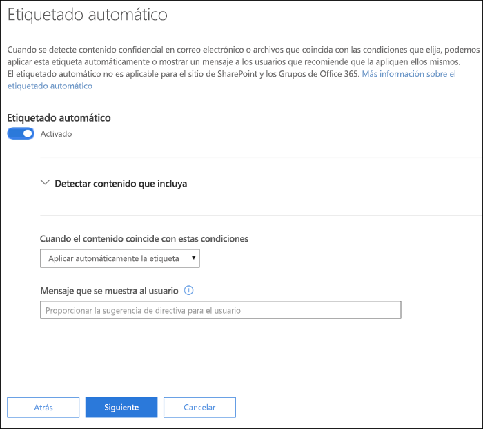
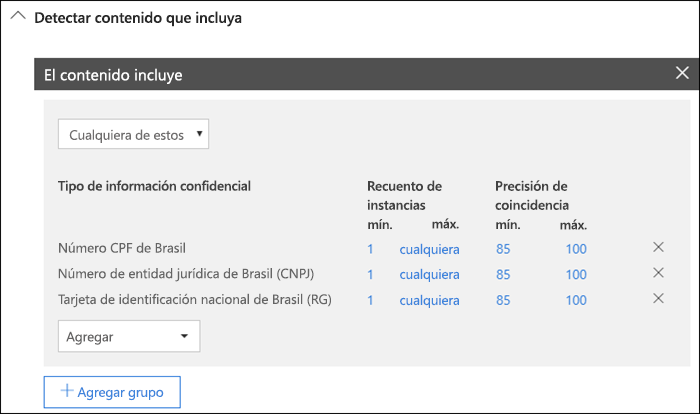
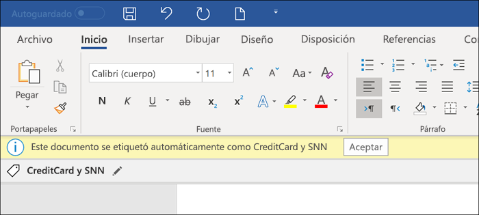
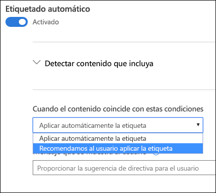
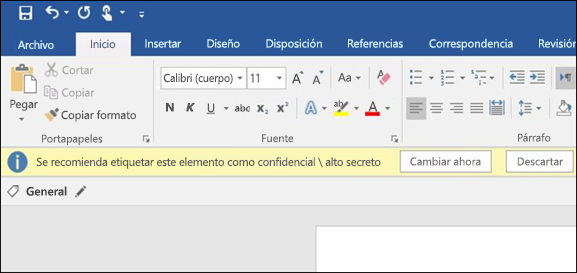

# Aplicar automáticamente una etiqueta de confidencialidad al contenido

Al crear una etiqueta de confidencialidad, puede asignar automáticamente esa etiqueta a contenido con información confidencial, o bien puede solicitar a los usuarios que apliquen la etiqueta recomendada.

La capacidad de aplicar automáticamente etiquetas de confidencialidad al contenido es importante por estos motivos:

- No es necesario proporcionar aprendizaje a los usuarios para que conozcan todas las clasificaciones.

- No es necesario depender de los usuarios para clasificar todo el contenido correctamente.

- Los usuarios ya no necesitan conocer las directivas de gobierno de datos; en su lugar, pueden centrarse en su trabajo.

> [!NOTE]
> Para poder aplicar etiquetas automáticamente, se necesita una suscripción de Azure Information Protection P2. Para usar esta característica, necesita [Descargar e instalar el cliente de etiquetado unificado de Azure Information Protection](https://docs.microsoft.com/es-ES/azure/information-protection/rms-client/install-unifiedlabelingclient-app). Estamos trabajando en la compatibilidad nativa para esta característica en las aplicaciones de Office de forma que no sea necesario usar el cliente de etiquetado unificado de Azure Information Protection. Además, el cliente de etiquetado unificado solo se ejecuta en Windows, por lo que esta característica aún no se admite en equipos Mac ni en dispositivos iOS y Android.

## Aplicar una etiqueta de confidencialidad automáticamente basándose en condiciones específicas

Una de las características más útiles de las etiquetas de confidencialidad es la capacidad de aplicarlas automáticamente a contenido que coincida con determinadas condiciones. En ese caso, los usuarios de su organización no necesitan aplicar las etiquetas de confidencialidad: Office 365 lo hace automáticamente.
   
Puede aplicar etiquetas de confidencialidad a contenido automáticamente cuando ese contenido contenga tipos específicos de información confidencial. Al configurar una etiqueta de confidencialidad para que se aplique automáticamente, verá la misma lista de tipos de información confidencial que al crear una directiva de prevención de pérdida de datos (DLP). Puede, por ejemplo, aplicar automáticamente la etiqueta “Extremadamente confidencial” a cualquier contenido con información de identificación personal (DCP) de clientes, como números de tarjeta de crédito o números del seguro social. 

Después de seleccionar los tipos de información confidencial, puede restringir la condición al cambiar el recuento de instancias o la precisión de coincidencia. Para obtener más información, vea [Ajustar reglas para aumentar o reducir la coincidencia](data-loss-prevention-policies.md#tuning-rules-to-make-them-easier-or-harder-to-match).

Además, puede elegir si una condición tiene que detectar todos los tipos de información confidencial o solo uno de ellos. Para que las condiciones sean más flexibles o complejas, puede agregar grupos y usar operadores lógicos entre los grupos. Para obtener más información, vea [Operadores de agrupación y lógicos](data-loss-prevention-policies.md#grouping-and-logical-operators).

Al aplicar automáticamente una etiqueta de confidencialidad, el usuario verá una notificación en la aplicación de Office. Puede seleccionar **Aceptar** para cerrar la notificación.

## Recomendación para que el usuario aplique una etiqueta de confidencialidad

Si lo prefiere, en lugar de aplicar automáticamente una etiqueta de confidencialidad al contenido, puede recomendar a los usuarios que apliquen la etiqueta. Esta opción proporciona a los usuarios la flexibilidad de aceptar la clasificación y cualquier protección asociada, o bien pueden descartar la recomendación si la etiqueta no es adecuada para el documento o correo electrónico.

Tenga en cuenta que las etiquetas recomendadas se admiten en Word, PowerPoint y Excel (y es necesario que esté instalado el cliente de etiquetado unificado de Azure Information Protection). Estamos trabajando para admitir las etiquetas recomendadas en Outlook.

Este es un ejemplo de un mensaje que se muestra al configurar una condición para aplicar una etiqueta como acción recomendada con una sugerencia de directiva personalizada. Puede elegir el texto que se muestra en la sugerencia de directiva.

## Forma de aplicar etiquetas recomendadas o automáticas

- El etiquetado automático se aplica en Word, Excel y PowerPoint al guardar los documentos, y en Outlook al enviar correos electrónicos. Estas condiciones detectan información confidencial en el texto de cuerpo de documentos y correos electrónicos, así como en encabezados y pies de página, pero no detectan la información de la línea de asunto ni de los datos adjuntos de los correos electrónicos.

- No se puede usar la clasificación automática para documentos y correos electrónicos que se etiquetaron anteriormente de forma manual, ni los que se etiquetaron previamente de forma automática con una clasificación superior. Recuerde que un documento o correo electrónico solo puede tener aplicada una etiqueta de confidencialidad (además de una etiqueta de retención).

- La clasificación recomendada se aplica en Word, Excel y PowerPoint al guardar los documentos. Estamos trabajando para admitir el etiquetado recomendado en Outlook.

- No se puede usar la clasificación recomendada para documentos que se etiquetaron anteriormente con una mayor clasificación. En este caso, si el contenido ya se etiquetó con una mayor clasificación, el usuario no verá el mensaje con la recomendación y la sugerencia de directiva.

## Forma en que se evalúan varias condiciones cuando se aplican en más de una etiqueta

Las etiquetas se ordenan para su evaluación según la posición que especifique en la directiva: la primera etiqueta colocada tiene la posición inferior (menor confidencialidad) y la última etiqueta colocada tiene la posición superior (mayor confidencialidad). Para obtener más información sobre la prioridad, vea [Prioridad de etiqueta (el orden importa)](sensitivity-labels.md#label-priority-order-matters).

## No configure una etiqueta principal para que se aplique o recomiende automáticamente

Recuerde que una etiqueta principal (una etiqueta con subetiquetas) no se puede aplicar al contenido. Asegúrese de no configurar una etiqueta principal para que se aplique o recomiende automáticamente, ya que la etiqueta principal no se aplicará al contenido en las aplicaciones de Office que usan el cliente de etiquetado unificado de Azure Information Protection. Para obtener más información sobre las etiquetas principales y las subetiquetas, consulte [Subetiquetas (agrupación de etiquetas)](sensitivity-labels.md#sublabels-grouping-labels).
