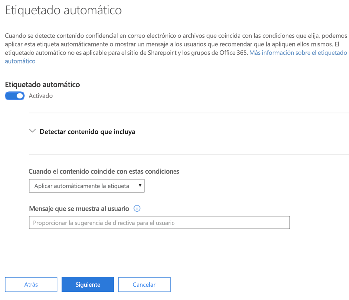
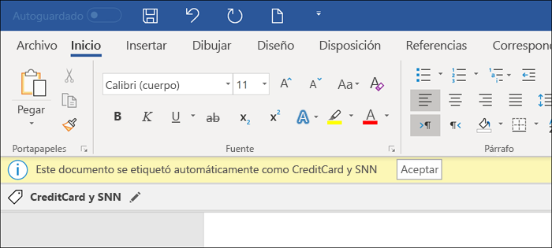
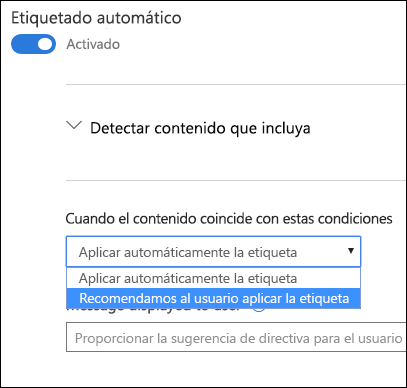

# Aplicar automáticamente una etiqueta de confidencialidad al contenidoApply a sensitivity label to content automatically

Al crear una etiqueta de confidencialidad, puede asignar automáticamente esa etiqueta a contenido con información confidencial, o bien puede solicitar a los usuarios que apliquen la etiqueta recomendada.When you create a sensitivity label, you can automatically assign that label to content containing sensitive information, or you can prompt users to apply the label that you recommend.

La capacidad de aplicar automáticamente etiquetas de confidencialidad al contenido es importante por estos motivos:The ability to apply sensitivity labels to content automatically is important because:

- No es necesario proporcionar aprendizaje a los usuarios para que conozcan todas las clasificaciones.You don't need to train your users on all of your classifications.

- No es necesario depender de los usuarios para clasificar todo el contenido correctamente.You don't need to rely on users to classify all content correctly.

- Los usuarios ya no necesitan conocer las directivas de gobierno de datos; en su lugar, pueden centrarse en su trabajo.Users no longer need to know about your policies - they can instead focus on their work.

> [!NOTE]
> Para poder aplicar etiquetas automáticamente, se necesita una suscripción de Azure Information Protection P2. Para usar esta característica, necesita [Descargar e instalar el cliente de etiquetado unificado de Azure Information Protection](https://docs.microsoft.com/es-ES/azure/information-protection/rms-client/install-unifiedlabelingclient-app). Estamos trabajando en la compatibilidad nativa para esta característica en las aplicaciones de Office de forma que no sea necesario usar el cliente de etiquetado unificado de Azure Information Protection. Además, el cliente de etiquetado unificado solo se ejecuta en Windows, por lo que esta característica aún no se admite en equipos Mac ni en dispositivos iOS y Android.The capability to apply labels automatically requires an Azure Information Protection P2 subscription. To use this feature, you must [Download and install the Azure Information Protection unified labeling client](https://docs.microsoft.com/es-ES/azure/information-protection/rms-client/install-unifiedlabelingclient-app). We're working on native support for this feature in Office apps, so that it won't require the Azure Information Protection unified labeling client. Also, the unified labeling client runs only on Windows, so this feature is not yet supported on Mac, iOS, and Android.

## Aplicar una etiqueta de confidencialidad automáticamente basándose en condiciones específicasApply a sensitivity label automatically based on conditions

Una de las características más útiles de las etiquetas de confidencialidad es la capacidad de aplicarlas automáticamente a contenido que coincida con determinadas condiciones. En ese caso, los usuarios de su organización no necesitan aplicar las etiquetas de confidencialidad: Office 365 lo hace automáticamente.One of the most powerful features of sensitivity labels is the ability to apply them automatically to content that matches certain conditions. In this case, people in your organization don't need to apply the sensitivity labels - Office 365 does the work for them.
   
Puede aplicar etiquetas de confidencialidad a contenido automáticamente cuando ese contenido contenga tipos específicos de información confidencial. Al configurar una etiqueta de confidencialidad para que se aplique automáticamente, verá la misma lista de tipos de información confidencial que al crear una directiva de prevención de pérdida de datos (DLP). Puede, por ejemplo, aplicar automáticamente la etiqueta “Extremadamente confidencial” a cualquier contenido con información de identificación personal (DCP) de clientes, como números de tarjeta de crédito o números del seguro social.You can choose to apply sensitivity labels to content automatically when that content contains specific types of sensitive information. When you configure a sensitivity label to be applied automatically, you see the same list of sensitive information types as when you create a data loss prevention (DLP) policy. So you can, for example, automatically apply a Highly Confidential label to any content that contains customers' personally identifiable information (PII), such as credit card numbers or social security numbers. 

Después de seleccionar los tipos de información confidencial, puede restringir la condición al cambiar el recuento de instancias o la precisión de coincidencia. Para obtener más información, vea [Ajustar reglas para aumentar o reducir la coincidencia](data-loss-prevention-policies.md#tuning-rules-to-make-them-easier-or-harder-to-match).After you choose your sensitive informaton types, you can refine your condition by changing the instance count or match accuracy. For more information, see [Tuning rules to make them easier or harder to match](data-loss-prevention-policies.md#tuning-rules-to-make-them-easier-or-harder-to-match).

Además, puede elegir si una condición tiene que detectar todos los tipos de información confidencial o solo uno de ellos. Para que las condiciones sean más flexibles o complejas, puede agregar grupos y usar operadores lógicos entre los grupos. Para obtener más información, vea [Operadores de agrupación y lógicos](data-loss-prevention-policies.md#grouping-and-logical-operators).Further, you can choose whether a condition must detect all of the sensitive infromation types, or just one of them. And to make your conditions more flexible or complex, you can add groups and use logical operators between the groups. For more information, see [Grouping and logical operators](data-loss-prevention-policies.md#grouping-and-logical-operators).

Al aplicar automáticamente una etiqueta de confidencialidad, el usuario verá una notificación en la aplicación de Office. Puede seleccionar **Aceptar** para cerrar la notificación.When a sensitivity label is automatically applied, the user sees a notification in their Office app. They can choose **OK** to dismiss the notification.

## Recomendación para que el usuario aplique una etiqueta de confidencialidadRecommend that the user apply a sensitivity label

Si lo prefiere, en lugar de aplicar automáticamente una etiqueta de confidencialidad al contenido, puede recomendar a los usuarios que apliquen la etiqueta. Esta opción proporciona a los usuarios la flexibilidad de aceptar la clasificación y cualquier protección asociada, o bien pueden descartar la recomendación si la etiqueta no es adecuada para el documento o correo electrónico.If you prefer, instead of applying a sensitivity label automatically to content, you can recommend to your users that they apply the label. This option provides your users the flexibility of accepting the classification and any associated protection, or dismissing the recommendation if the label is not suitable for their document or email.

Tenga en cuenta que las etiquetas recomendadas se admiten en Word, PowerPoint y Excel (y es necesario que esté instalado el cliente de etiquetado unificado de Azure Information Protection). Estamos trabajando para admitir las etiquetas recomendadas en Outlook.Note that recommended labels are supported in Word, PowerPoint, and Excel (and require that the Azure Information Protection unified labeling client is installed). We're working on support for recommended labels in Outlook.

Este es un ejemplo de un mensaje que se muestra al configurar una condición para aplicar una etiqueta como acción recomendada con una sugerencia de directiva personalizada. Puede elegir el texto que se muestra en la sugerencia de directiva.Here's an example of a prompt when you configure a condition to apply a label as a recommended action, with a custom policy tip. You can choose what text is displayed in the policy tip.

## Forma de aplicar etiquetas recomendadas o automáticasHow automatic or recommended labels are applied

- El etiquetado automático se aplica en Word, Excel y PowerPoint al guardar los documentos, y en Outlook al enviar correos electrónicos. Estas condiciones detectan información confidencial en el texto de cuerpo de documentos y correos electrónicos, así como en encabezados y pies de página, pero no detectan la información de la línea de asunto ni de los datos adjuntos de los correos electrónicos.Automatic labeling applies to Word, Excel, and PowerPoint when documents are saved, and to Outlook when emails are sent. These conditions detect sensitive information in the body text in documents and emails, and to headers and footers -- but not in the subject line or attachments of email.

- No se puede usar la clasificación automática para documentos y correos electrónicos que se etiquetaron anteriormente de forma manual, ni los que se etiquetaron previamente de forma automática con una clasificación superior. Recuerde que un documento o correo electrónico solo puede tener aplicada una etiqueta de confidencialidad (además de una etiqueta de retención).You cannot use automatic classification for documents and emails that were previously manually labeled, or previously automatically labeled with a higher classification. Remember, a document or email can have only a single sensitivity label applied to it (in addition to a single retention label).

- La clasificación recomendada se aplica en Word, Excel y PowerPoint al guardar los documentos. Estamos trabajando para admitir el etiquetado recomendado en Outlook.Recommended classification applies to Word, Excel, and PowerPoint when documents are saved. We're working on support for recommended labeling in Outlook.

- No se puede usar la clasificación recomendada para documentos que se etiquetaron anteriormente con una mayor clasificación. En este caso, si el contenido ya se etiquetó con una mayor clasificación, el usuario no verá el mensaje con la recomendación y la sugerencia de directiva.You cannot use recommended classification for documents that were previously labeled with a higher classification. In this case, when the content's already labeled with a higher classification, the user won't see the prompt with the recommendation and policy tip.

## Forma en que se evalúan varias condiciones cuando se aplican en más de una etiquetaHow multiple conditions are evaluated when they apply to more than one label

Las etiquetas se ordenan para su evaluación según la posición que especifique en la directiva: la primera etiqueta colocada tiene la posición inferior (menor confidencialidad) y la última etiqueta colocada tiene la posición superior (mayor confidencialidad). Para obtener más información sobre la prioridad, vea [Prioridad de etiqueta (el orden importa)](sensitivity-labels.md#label-priority-order-matters).The labels are ordered for evaluation according to their position that you specify in the policy: The label positioned first has the lowest position (least sensitive) and the label positioned last has the highest position (most sensitive). For more information on priority, see [Label priority (order matters)](sensitivity-labels.md#label-priority-order-matters).

## No configure una etiqueta principal para que se aplique o recomiende automáticamenteDon't configure a parent label to be applied automatically or recommended

Recuerde que una etiqueta principal (una etiqueta con subetiquetas) no se puede aplicar al contenido.Remember, a parent label (a label with sublabels) can't be applied to content. Asegúrese de no configurar una etiqueta principal para que se aplique o recomiende automáticamente, ya que la etiqueta principal no se aplicará al contenido en las aplicaciones de Office que usan el cliente de etiquetado unificado de Azure Information Protection.Make sure that you don't configure a parent label to be auto-applied or recommended, because the parent label won't be applied to content in Office apps that use the Azure Information Protection unified labeling client. Para obtener más información sobre las etiquetas principales y las subetiquetas, consulte [Subetiquetas (agrupación de etiquetas)](sensitivity-labels.md#sublabels-grouping-labels).For more information on parent labels and sublabels, see [Sublabels (grouping labels)](sensitivity-labels.md#sublabels-grouping-labels).
