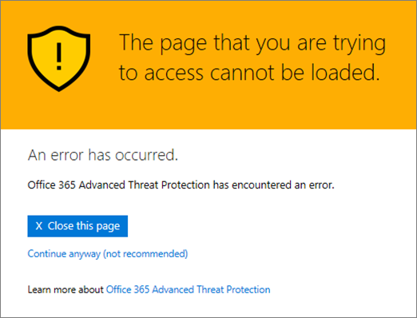
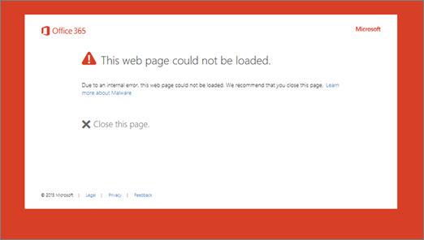

# Páginas de advertencia de vínculos seguros de ATP de Office 365

> [!IMPORTANT]
> Este artículo está destinado a los clientes empresariales que tienen la [protección contra amenazas avanzada de Office 365](office-365-atp.md). Si usa Outlook.com, Office 365 Home o Office 365 personal, y está buscando información sobre vínculos seguros en Outlook, consulte [Advanced Outlook.com Security](https://support.office.com/article/advanced-outlook-com-security-for-office-365-subscribers-882d2243-eab9-4545-a58a-b36fee4a46e2).

[Protección contra amenazas avanzada de Office 365](office-365-atp.md) (ATP) ayuda a proteger la organización de los intentos de suplantación de identidad y malware mediante características como, por ejemplo, [vínculos seguros de ATP](atp-safe-links.md), [datos adjuntos seguros de ATP](atp-safe-attachments.md)y [protección contra la suplantación de identidad](anti-phishing-protection.md). Cuando se realiza la protección, se comprueban los vínculos (direcciones URL) de los mensajes de correo electrónico y documentos de Office. Si una dirección URL se identifica como sospechosa o malintencionada, es posible que se bloquee la apertura de la dirección URL al hacer clic en ella. En lugar de ir directamente al sitio, es posible que vea una página de advertencia en su lugar. 
  
Lea este artículo para ver ejemplos de páginas de advertencias que pueden aparecer, junto con las actualizaciones recientes de las páginas de advertencia.
  
## Ejemplos de páginas de advertencia

### ATP está examinando el vínculo

Vínculos seguros de ATP están examinando una dirección URL. Es posible que tenga que esperar unos minutos para volver a intentar el vínculo.

### Una dirección URL está en un mensaje de correo electrónico sospechoso

La dirección URL se encuentra en un mensaje de correo electrónico que parece similar a otros mensajes de correo electrónico que se consideran sospechosos. Le recomendamos que vuelva a comprobar el mensaje de correo electrónico antes de continuar con el sitio.

### Una dirección URL está en un mensaje identificado como un intento de suplantación de identidad

La dirección URL está en un mensaje de correo electrónico que se ha identificado como un ataque de suplantación de identidad. Como resultado, se bloquean todas las direcciones URL en el mensaje de correo electrónico. Le recomendamos que no continúe con el sitio.

### Un sitio se ha identificado como malintencionado

La dirección URL apunta a un sitio que se ha identificado como malintencionado.    Le recomendamos que no continúe con el sitio.

### Un sitio está bloqueado

La dirección URL está bloqueada para su organización. Hay varias razones por las que se puede bloquear una dirección URL. Le recomendamos que se ponga en contacto con el administrador de Office 365 de su organización.

### Se ha producido un error

Se ha producido algún tipo de error y no se puede abrir la dirección URL.

## Actualizaciones recientes de las páginas de advertencia

Varias páginas de advertencia se han actualizado recientemente para Office 365 ATP. Si aún no está viendo las páginas actualizadas, pronto lo hará. Las actualizaciones incluyen una nueva combinación de colores, más detalles y la posibilidad de continuar a un sitio a pesar de la determinada ADVERTENCIA y las recomendaciones.

### Examen de URL en curso

Página de advertencia original:

Página de advertencia actualizada:

### ADVERTENCIA de sitio malintencionado

Página de advertencia original:

Página de advertencia actualizada:

### ADVERTENCIA de dirección URL bloqueada

Página de advertencia original:

Página de advertencia actualizada:

### Página de advertencia "error producido"

Página de advertencia original:

Página de advertencia actualizada:

   
