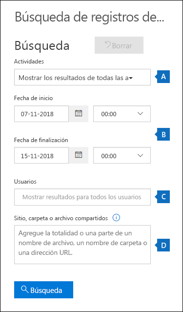
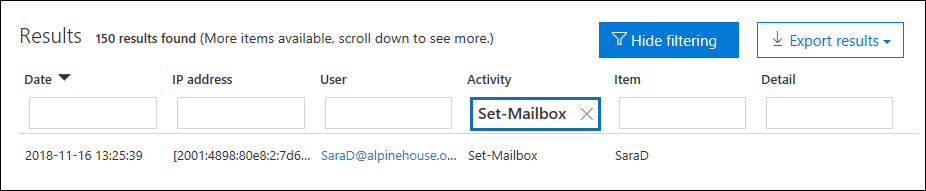

# <a name="search-the-office-365-audit-log-to-troubleshoot-common-scenarios"></a><span data-ttu-id="d6006-103">Buscar en el registro de auditoría de 365 de Office para solucionar escenarios comunes</span><span class="sxs-lookup"><span data-stu-id="d6006-103">Search the Office 365 audit log to troubleshoot common scenarios</span></span>

<span data-ttu-id="d6006-104">En este artículo se describe cómo usar la herramienta de búsqueda de registros de auditoría de Office 365 para ayudarle a solucionar los escenarios de soporte habituales.</span><span class="sxs-lookup"><span data-stu-id="d6006-104">This article describes how to use the Office 365 audit log search tool to help you troubleshoot common support scenarios.</span></span> <span data-ttu-id="d6006-105">Esto incluye el uso del registro de auditoría para:</span><span class="sxs-lookup"><span data-stu-id="d6006-105">This includes using the audit log to:</span></span>

- <span data-ttu-id="d6006-106">Buscar la dirección IP del equipo que se usa para obtener acceso a una cuenta en peligro</span><span class="sxs-lookup"><span data-stu-id="d6006-106">Find the IP address of the computer used to access a compromised account</span></span>
- <span data-ttu-id="d6006-107">Determinar quién ha configurado el reenvío de correo electrónico para un buzón</span><span class="sxs-lookup"><span data-stu-id="d6006-107">Determine who set up email forwarding for a mailbox</span></span>
- <span data-ttu-id="d6006-108">Determinar si un usuario eliminó los elementos de correo electrónico de su buzón</span><span class="sxs-lookup"><span data-stu-id="d6006-108">Determine if a user deleted email items in their mailbox</span></span>
- <span data-ttu-id="d6006-109">Determinar si un usuario creó una regla de bandeja de entrada</span><span class="sxs-lookup"><span data-stu-id="d6006-109">Determine if a user created an inbox rule</span></span>

## <a name="using-the-office-365-audit-log-search-tool"></a><span data-ttu-id="d6006-110">Uso de la herramienta de búsqueda de registros de auditoría de Office 365</span><span class="sxs-lookup"><span data-stu-id="d6006-110">Using the Office 365 audit log search tool</span></span>

<span data-ttu-id="d6006-111">Cada uno de los escenarios de solución de problemas descritos en este artículo se basa en el uso de la herramienta de búsqueda de registros de auditoría en el centro de seguridad y cumplimiento de Office 365.</span><span class="sxs-lookup"><span data-stu-id="d6006-111">Each of the troubleshooting scenarios described in this article are based on using the audit log search tool in the Office 365 security and compliance center.</span></span> <span data-ttu-id="d6006-112">En esta sección se enumeran los permisos necesarios para buscar en el registro de auditoría y se describen los pasos para obtener acceso y ejecutar las búsquedas de registros de auditoría.</span><span class="sxs-lookup"><span data-stu-id="d6006-112">This section lists the permissions required to search the audit log and describes the steps to access and run audit log searches.</span></span> <span data-ttu-id="d6006-113">En cada sección de escenario se proporcionan instrucciones específicas sobre cómo configurar una consulta de búsqueda de registros de auditoría y qué buscar en la información detallada de los registros de auditoría que coinciden con los criterios de búsqueda.</span><span class="sxs-lookup"><span data-stu-id="d6006-113">Each scenario section provides specific guidance about how to configure an audit log search query and what to look for in the detailed information in the audit records that match the search criteria.</span></span>

### <a name="permissions-required-to-use-the-audit-log-search-tool"></a><span data-ttu-id="d6006-114">Permisos necesarios para usar la herramienta de búsqueda de registros de auditoría</span><span class="sxs-lookup"><span data-stu-id="d6006-114">Permissions required to use the audit log search tool</span></span>

<span data-ttu-id="d6006-115">Debe tener asignado el rol registros de auditoría con permiso de vista o registros de auditoría en Exchange Online para buscar en el registro de auditoría de 365 de Office.</span><span class="sxs-lookup"><span data-stu-id="d6006-115">You have to be assigned the View-Only Audit Logs or Audit Logs role in Exchange Online to search the Office 365 audit log.</span></span> <span data-ttu-id="d6006-116">De forma predeterminada, estos roles se asignan a los grupos de roles administración de cumplimiento y administración de la organización en la página **permisos** del centro de administración de Exchange.</span><span class="sxs-lookup"><span data-stu-id="d6006-116">By default, these roles are assigned to the Compliance Management and Organization Management role groups on the **Permissions** page in the Exchange admin center.</span></span> <span data-ttu-id="d6006-117">Tenga en cuenta que los administradores globales de Office 365 y Microsoft 365 se agregan automáticamente como miembros del grupo de funciones de administración de la organización en Exchange Online.</span><span class="sxs-lookup"><span data-stu-id="d6006-117">Note that global administrators in Office 365 and Microsoft 365 are automatically added as members of the Organization Management role group in Exchange Online.</span></span> <span data-ttu-id="d6006-118">Para obtener más información, vea [administrar grupos de roles en Exchange Online](https://go.microsoft.com/fwlink/p/?LinkID=730688).</span><span class="sxs-lookup"><span data-stu-id="d6006-118">For more information, see [Manage role groups in Exchange Online](https://go.microsoft.com/fwlink/p/?LinkID=730688).</span></span>

### <a name="running-audit-log-searches"></a><span data-ttu-id="d6006-119">Ejecución de búsquedas de registro de auditoría</span><span class="sxs-lookup"><span data-stu-id="d6006-119">Running audit log searches</span></span>

<span data-ttu-id="d6006-120">En esta sección se describen los conceptos básicos para crear y ejecutar búsquedas de registros de auditoría.</span><span class="sxs-lookup"><span data-stu-id="d6006-120">This section describes the basics for creating and running audit log searches.</span></span> <span data-ttu-id="d6006-121">Siga estas instrucciones como punto de partida para cada escenario de solución de problemas de este artículo.</span><span class="sxs-lookup"><span data-stu-id="d6006-121">Use these instructions as a starting point for each troubleshooting scenario in this article.</span></span> <span data-ttu-id="d6006-122">Para obtener instrucciones detalladas paso a paso, consulte [Buscar en el registro de auditoría](search-the-audit-log-in-security-and-compliance.md#step-1-run-an-audit-log-search).</span><span class="sxs-lookup"><span data-stu-id="d6006-122">For more detailed step-by-step instructions, see [Search the audit log](search-the-audit-log-in-security-and-compliance.md#step-1-run-an-audit-log-search).</span></span>

1. <span data-ttu-id="d6006-123">Vaya a [https://protection.office.com/unifiedauditlog](https://protection.office.com/unifiedauditlog) e inicie sesión con su cuenta profesional o educativa.</span><span class="sxs-lookup"><span data-stu-id="d6006-123">Go to [https://protection.office.com/unifiedauditlog](https://protection.office.com/unifiedauditlog) and sign in using your work or school account.</span></span>
    
    <span data-ttu-id="d6006-124">Se muestra la página de **búsqueda de registros de auditoría** .</span><span class="sxs-lookup"><span data-stu-id="d6006-124">The **Audit log search** page is displayed.</span></span> 
    
    
  
4. <span data-ttu-id="d6006-126">Puede configurar los siguientes criterios de búsqueda.</span><span class="sxs-lookup"><span data-stu-id="d6006-126">You can configure the following search criteria.</span></span> <span data-ttu-id="d6006-127">Tenga en cuenta que cada escenario de solución de problemas de este artículo le recomendará una guía específica para configurar estos campos.</span><span class="sxs-lookup"><span data-stu-id="d6006-127">Note that each troubleshooting scenario in this article will recommend specific guidance for configuring these fields.</span></span>
    
    <span data-ttu-id="d6006-128">a.</span><span class="sxs-lookup"><span data-stu-id="d6006-128">a.</span></span> <span data-ttu-id="d6006-129">**Actividades** : haga clic en la lista desplegable para mostrar las actividades que puede buscar.</span><span class="sxs-lookup"><span data-stu-id="d6006-129">**Activities** - Click the drop-down list to display the activities that you can search for.</span></span> <span data-ttu-id="d6006-130">Después de ejecutar la búsqueda, solo se muestran los registros de auditoría de las actividades seleccionadas.</span><span class="sxs-lookup"><span data-stu-id="d6006-130">After you run the search, only the audit records for the selected activities are displayed.</span></span> <span data-ttu-id="d6006-131">Al seleccionar **Mostrar resultados para todas las actividades** , se mostrarán los resultados de todas las actividades que cumplan los otros criterios de búsqueda.</span><span class="sxs-lookup"><span data-stu-id="d6006-131">Selecting **Show results for all activities** will display results for all activities that meet the other search criteria.</span></span> <span data-ttu-id="d6006-132">También tendrá que dejar este campo en blanco en algunos de los escenarios de solución de problemas.</span><span class="sxs-lookup"><span data-stu-id="d6006-132">You'll also have to leave this field blank in some of the troubleshooting scenarios.</span></span>
    
    <span data-ttu-id="d6006-133">b.</span><span class="sxs-lookup"><span data-stu-id="d6006-133">b.</span></span> <span data-ttu-id="d6006-134">Fecha de **Inicio** y **fecha** de finalización: Seleccione un intervalo de fechas y horas para mostrar los eventos que se produjeron dentro de ese período.</span><span class="sxs-lookup"><span data-stu-id="d6006-134">**Start date** and **End date** - Select a date and time range to display the events that occurred within that period.</span></span> <span data-ttu-id="d6006-135">Los últimos siete días están seleccionados de forma predeterminada.</span><span class="sxs-lookup"><span data-stu-id="d6006-135">The last seven days are selected by default.</span></span> <span data-ttu-id="d6006-136">La fecha y la hora se presentan en formato de hora universal coordinada (UTC).</span><span class="sxs-lookup"><span data-stu-id="d6006-136">The date and time are presented in Coordinated Universal Time (UTC) format.</span></span> <span data-ttu-id="d6006-137">El intervalo de fechas máximo que puede especificar es de 90 días.</span><span class="sxs-lookup"><span data-stu-id="d6006-137">The maximum date range that you can specify is 90 days.</span></span>

    <span data-ttu-id="d6006-138">c.</span><span class="sxs-lookup"><span data-stu-id="d6006-138">c.</span></span> <span data-ttu-id="d6006-139">**Usuarios** : haga clic en este cuadro y, a continuación, seleccione uno o más usuarios para los que desea mostrar los resultados de la búsqueda.</span><span class="sxs-lookup"><span data-stu-id="d6006-139">**Users** - Click in this box and then select one or more users to display search results for.</span></span> <span data-ttu-id="d6006-140">Los registros de auditoría para la actividad seleccionada realizada por los usuarios que seleccione en este cuadro se muestran en la lista de resultados.</span><span class="sxs-lookup"><span data-stu-id="d6006-140">Audit records for the selected activity performed by the users you select in this box are displayed in the list of results.</span></span> <span data-ttu-id="d6006-141">Deje este cuadro en blanco para devolver las entradas de todos los usuarios (y las cuentas de servicio) de su organización.</span><span class="sxs-lookup"><span data-stu-id="d6006-141">Leave this box blank to return entries for all users (and service accounts) in your organization.</span></span>
    
    <span data-ttu-id="d6006-142">d.</span><span class="sxs-lookup"><span data-stu-id="d6006-142">d.</span></span> <span data-ttu-id="d6006-143">**Archivo, carpeta o** tipo de sitio todo o parte del nombre de un archivo o carpeta para buscar actividades relacionadas con el archivo de la carpeta que contiene la palabra clave especificada.</span><span class="sxs-lookup"><span data-stu-id="d6006-143">**File, folder, or site** - Type some or all of a file or folder name to search for activity related to the file of folder that contains the specified keyword.</span></span> <span data-ttu-id="d6006-144">También puede especificar una dirección URL de un archivo o una carpeta.</span><span class="sxs-lookup"><span data-stu-id="d6006-144">You can also specify a URL of a file or folder.</span></span> <span data-ttu-id="d6006-145">Si usa una dirección URL, asegúrese de escribir la ruta de acceso completa de la dirección URL o, si solo escribe una parte de la dirección URL, no incluya ningún carácter o espacio especial.</span><span class="sxs-lookup"><span data-stu-id="d6006-145">If you use a URL, be sure the type the full URL path or if you just type a portion of the URL, don't include any special characters or spaces.</span></span> <span data-ttu-id="d6006-146">Deje este cuadro en blanco para devolver las entradas de todos los archivos y carpetas de la organización.</span><span class="sxs-lookup"><span data-stu-id="d6006-146">Leave this box blank to return entries for all files and folders in your organization.</span></span> <span data-ttu-id="d6006-147">Tenga en cuenta que este campo se deja en blanco en todos los escenarios de solución de problemas de este artículo.</span><span class="sxs-lookup"><span data-stu-id="d6006-147">Note that this field is left blank in all the troubleshooting scenarios in this article.</span></span>
    
5. <span data-ttu-id="d6006-148">Haga clic en **Buscar** para ejecutar la búsqueda con los criterios de búsqueda.</span><span class="sxs-lookup"><span data-stu-id="d6006-148">Click **Search** to run the search using your search criteria.</span></span> 
    
    <span data-ttu-id="d6006-149">Los resultados de la búsqueda se cargan y, después de unos segundos, se muestran en **resultados** en la página de **búsqueda de registros de auditoría** .</span><span class="sxs-lookup"><span data-stu-id="d6006-149">The search results are loaded, and after a few moments they are displayed under **Results** on the **Audit log search** page.</span></span> <span data-ttu-id="d6006-150">Cada una de las siguientes secciones le proporcionará información sobre las cosas que debe buscar en el escenario de solución de problemas específico.</span><span class="sxs-lookup"><span data-stu-id="d6006-150">Each to the following sections will provide guidance about things to look for the specific troubleshooting scenario.</span></span>

    <span data-ttu-id="d6006-151">Para obtener más información acerca de cómo ver, filtrar o exportar los resultados de la búsqueda de registros de auditoría, vea:</span><span class="sxs-lookup"><span data-stu-id="d6006-151">For more information about viewing, filtering, or exporting audit log search results, see:</span></span>

    - [<span data-ttu-id="d6006-152">Ver los resultados de la búsqueda</span><span class="sxs-lookup"><span data-stu-id="d6006-152">View search results</span></span>](search-the-audit-log-in-security-and-compliance.md#step-2-view-the-search-results)
    - [<span data-ttu-id="d6006-153">Filtrar resultados de la búsqueda</span><span class="sxs-lookup"><span data-stu-id="d6006-153">Filter search results</span></span>](search-the-audit-log-in-security-and-compliance.md#step-3-filter-the-search-results)
    - [<span data-ttu-id="d6006-154">Exportar resultados de búsqueda</span><span class="sxs-lookup"><span data-stu-id="d6006-154">Export search results</span></span>](search-the-audit-log-in-security-and-compliance.md#step-4-export-the-search-results-to-a-file)

## <a name="finding-the-ip-address-of-the-computer-used-to-access-a-compromised-account"></a><span data-ttu-id="d6006-155">Buscar la dirección IP del equipo usado para obtener acceso a una cuenta en peligro</span><span class="sxs-lookup"><span data-stu-id="d6006-155">Finding the IP address of the computer used to access a compromised account</span></span>

<span data-ttu-id="d6006-156">La dirección IP correspondiente a una actividad realizada por cualquier usuario se incluye en la mayoría de los registros de auditoría.</span><span class="sxs-lookup"><span data-stu-id="d6006-156">The IP address corresponding to an activity performed by any user is included in most audit records.</span></span> <span data-ttu-id="d6006-157">La información sobre el cliente usado también se incluye en el registro de auditoría.</span><span class="sxs-lookup"><span data-stu-id="d6006-157">Information about the client used is also included in the audit record.</span></span>

<span data-ttu-id="d6006-158">Esta es la manera de configurar una consulta de búsqueda de registros de auditoría para este escenario:</span><span class="sxs-lookup"><span data-stu-id="d6006-158">Here's how to configure an audit log search query for this scenario:</span></span>

<span data-ttu-id="d6006-159">**Actividades** : si es relevante para su caso, seleccione una actividad específica que desee buscar.</span><span class="sxs-lookup"><span data-stu-id="d6006-159">**Activities** - If relevant to your case, select a specific activity to search for.</span></span> <span data-ttu-id="d6006-160">Para solucionar problemas de cuentas comprometidas, considere la posibilidad de seleccionar la actividad **usuario de sesión iniciada** en el buzón en **actividades de buzón de Exchange**.</span><span class="sxs-lookup"><span data-stu-id="d6006-160">For troubleshooting compromised accounts, consider selecting the **User signed in to mailbox** activity under **Exchange mailbox activities**.</span></span> <span data-ttu-id="d6006-161">Se devolverán registros de auditoría que muestran la dirección IP que se utilizó al iniciar sesión en el buzón.</span><span class="sxs-lookup"><span data-stu-id="d6006-161">This will return auditing records showing the IP address that was use when signing in to the mailbox.</span></span> <span data-ttu-id="d6006-162">De lo contrario, deje este campo en blanco para devolver los registros de auditoría de todas las actividades.</span><span class="sxs-lookup"><span data-stu-id="d6006-162">Otherwise, leave this field blank to return audit records for all activities.</span></span> 

> [!TIP]
> <span data-ttu-id="d6006-163">Si deja este campo en blanco, se devolverá **UserLoggedIn** actividades, que es una actividad de Azure Active Directory que indica que alguien ha iniciado sesión en una cuenta de usuario de Office 365.</span><span class="sxs-lookup"><span data-stu-id="d6006-163">Leaving this field blank will  return **UserLoggedIn** activities, which is an Azure Active Directory activity that indicates that someone has signed in to an Office 365 user account.</span></span> <span data-ttu-id="d6006-164">Use el filtrado en los resultados de la búsqueda para mostrar los registros de auditoría de **UserLoggedIn** .</span><span class="sxs-lookup"><span data-stu-id="d6006-164">Use filtering in the search results to display the **UserLoggedIn** audit records.</span></span>

<span data-ttu-id="d6006-165">Fecha de **Inicio** y **fecha** de finalización: Seleccione un intervalo de fechas que sea aplicable a su investigación.</span><span class="sxs-lookup"><span data-stu-id="d6006-165">**Start date** and **End date** - Select a date range that's applicable to your investigation.</span></span>

<span data-ttu-id="d6006-166">**Usuarios** : Si está investigando una cuenta en peligro, seleccione el usuario cuya cuenta se haya puesto en peligro.</span><span class="sxs-lookup"><span data-stu-id="d6006-166">**Users** - If you're investigating a compromised account, select the user whose account was compromised.</span></span> <span data-ttu-id="d6006-167">Se devolverán registros de auditoría para las actividades realizadas por esa cuenta de usuario.</span><span class="sxs-lookup"><span data-stu-id="d6006-167">This will return audit records for activities performed by that user account.</span></span>

<span data-ttu-id="d6006-168">**Archivo, carpeta o sitio** : Deje este campo en blanco.</span><span class="sxs-lookup"><span data-stu-id="d6006-168">**File, folder, or site** - Leave this field blank.</span></span>

<span data-ttu-id="d6006-169">Después de ejecutar la búsqueda, la dirección IP de cada actividad se muestra en la columna **dirección IP** de los resultados de la búsqueda.</span><span class="sxs-lookup"><span data-stu-id="d6006-169">After you run the search, the IP address for each activity is displayed in the **IP address** column in the search results.</span></span> <span data-ttu-id="d6006-170">Haga clic en el registro de los resultados de la búsqueda para ver información más detallada en la página de flotante.</span><span class="sxs-lookup"><span data-stu-id="d6006-170">Click the record in the search results to view more detailed information on the flyout page.</span></span>

## <a name="determining-who-set-up-email-forwarding-for-a-mailbox"></a><span data-ttu-id="d6006-171">Determinar quién ha configurado el reenvío de correo electrónico para un buzón</span><span class="sxs-lookup"><span data-stu-id="d6006-171">Determining who set up email forwarding for a mailbox</span></span>

<span data-ttu-id="d6006-172">Cuando se configura el reenvío de correo electrónico para un buzón, los mensajes de correo electrónico que se envían al buzón se reenvían a otro buzón.</span><span class="sxs-lookup"><span data-stu-id="d6006-172">When email forwarding is configured for a mailbox, email messages that are sent to the mailbox are forwarded to another mailbox.</span></span> <span data-ttu-id="d6006-173">Los mensajes se pueden desviar a los usuarios dentro o fuera de la organización.</span><span class="sxs-lookup"><span data-stu-id="d6006-173">Messages can be forwarded to users inside or outside of your organization.</span></span> <span data-ttu-id="d6006-174">Cuando se configura el reenvío de correo electrónico en un buzón, el cmdlet de Exchange Online subyacente que se usa es **set-Mailbox**.</span><span class="sxs-lookup"><span data-stu-id="d6006-174">When email forwarding is set up on a mailbox, the underlying Exchange Online cmdlet that's used is **Set-Mailbox**.</span></span>

<span data-ttu-id="d6006-175">Esta es la manera de configurar una consulta de búsqueda de registros de auditoría para este escenario:</span><span class="sxs-lookup"><span data-stu-id="d6006-175">Here's how to configure an audit log search query for this scenario:</span></span>

<span data-ttu-id="d6006-176">**Actividades** : Deje este campo en blanco para que la búsqueda devuelva registros de auditoría para todas las actividades.</span><span class="sxs-lookup"><span data-stu-id="d6006-176">**Activities** - Leave this field blank so that the search returns audit records for all activities.</span></span> <span data-ttu-id="d6006-177">Esto es necesario para devolver los registros de auditoría relacionados con el cmdlet **set-Mailbox** .</span><span class="sxs-lookup"><span data-stu-id="d6006-177">This is necessary to return any audit records related to the **Set-Mailbox** cmdlet.</span></span>

<span data-ttu-id="d6006-178">Fecha de **Inicio** y **fecha** de finalización: Seleccione un intervalo de fechas que sea aplicable a su investigación.</span><span class="sxs-lookup"><span data-stu-id="d6006-178">**Start date** and **End date** - Select a date range that's applicable to your investigation.</span></span>

<span data-ttu-id="d6006-179">**Usuarios** : a menos que esté investigando un problema de reenvío de correo para un usuario específico, deje este campo en blanco.</span><span class="sxs-lookup"><span data-stu-id="d6006-179">**Users** - Unless you're investigating a email forwarding issue for a specific user, leave this field blank.</span></span> <span data-ttu-id="d6006-180">Esto le ayudará a identificar si el reenvío de correo electrónico se ha configurado para cualquier usuario.</span><span class="sxs-lookup"><span data-stu-id="d6006-180">This will help you identify if email forwarding was set up for any user.</span></span>

<span data-ttu-id="d6006-181">**Archivo, carpeta o sitio** : Deje este campo en blanco.</span><span class="sxs-lookup"><span data-stu-id="d6006-181">**File, folder, or site** - Leave this field blank.</span></span>

<span data-ttu-id="d6006-182">Después de ejecutar la búsqueda, haga clic en **filtrar resultados** en la página de resultados de búsqueda.</span><span class="sxs-lookup"><span data-stu-id="d6006-182">After you run the search, click **Filter results** on the search results page.</span></span> <span data-ttu-id="d6006-183">En el cuadro en encabezado de columna **actividad** , escriba **set-Mailbox** para que solo se muestren los registros de auditoría relacionados con el cmdlet **set-Mailbox** .</span><span class="sxs-lookup"><span data-stu-id="d6006-183">In the box under **Activity** column header, type **Set-Mailbox** so that only audit records related to the **Set-Mailbox** cmdlet are displayed.</span></span>



<span data-ttu-id="d6006-185">En este punto, tiene que mirar los detalles de cada registro de auditoría para determinar si la actividad está relacionada con el reenvío de correo electrónico.</span><span class="sxs-lookup"><span data-stu-id="d6006-185">At this point, you have to look at the details of each audit record to determine if the activity is related to email forwarding.</span></span> <span data-ttu-id="d6006-186">Haga clic en el registro de auditoría para mostrar la página flotante de **detalles** y, a continuación, haga clic en **más información**.</span><span class="sxs-lookup"><span data-stu-id="d6006-186">Click the audit record to display the **Details** flyout page, and then click **More information**.</span></span> <span data-ttu-id="d6006-187">En la siguiente captura de pantalla y descripciones se resalta la información que indica el reenvío de correo electrónico que se estableció en el buzón.</span><span class="sxs-lookup"><span data-stu-id="d6006-187">The following screenshot and descriptions highlights the information that indicates email forwarding was set on the mailbox.</span></span>


<span data-ttu-id="d6006-189">a.</span><span class="sxs-lookup"><span data-stu-id="d6006-189">a.</span></span> <span data-ttu-id="d6006-190">En el campo **objectId** , se muestra el alias del buzón de correo en el que se ha configurado el reenvío de correo electrónico.</span><span class="sxs-lookup"><span data-stu-id="d6006-190">In the **ObjectId** field, the alias of the mailbox that email forwarding was set on is displayed.</span></span> <span data-ttu-id="d6006-191">Este buzón también se muestra en la columna de **elementos** de la página de resultados de búsqueda.</span><span class="sxs-lookup"><span data-stu-id="d6006-191">This mailbox is also displayed on the **Item** column in the search results page.</span></span>

<span data-ttu-id="d6006-192">b.</span><span class="sxs-lookup"><span data-stu-id="d6006-192">b.</span></span> <span data-ttu-id="d6006-193">En el campo **parámetros** , el valor *ForwardingSmtpAddress* indica que el correo electrónico reenviado se ha establecido en el buzón.</span><span class="sxs-lookup"><span data-stu-id="d6006-193">In the **Parameters** field, The value *ForwardingSmtpAddress* indicates that email forward has been set on the mailbox.</span></span> <span data-ttu-id="d6006-194">En este ejemplo, el correo se envía a la dirección mike@contoso.comde correo electrónico, que está fuera de la organización alpinehouse.onmicrosoft.com.</span><span class="sxs-lookup"><span data-stu-id="d6006-194">In this example, mail is being forwarded to the email address mike@contoso.com, which is outside of the alpinehouse.onmicrosoft.com organization.</span></span>

<span data-ttu-id="d6006-195">c.</span><span class="sxs-lookup"><span data-stu-id="d6006-195">c.</span></span> <span data-ttu-id="d6006-196">El valor *true* del parámetro *DeliverToMailboxAndForward* indica que una copia del mensaje se entrega a sarad@alpinehouse.onmicrosoft.com *y* se reenvía a la dirección de correo electrónico especificada por el parámetro *ForwardingSmtpAddress* , que en este ejemplo es mike@contoso.com.</span><span class="sxs-lookup"><span data-stu-id="d6006-196">The *True* value for the *DeliverToMailboxAndForward* parameter indicates that a copy of message delivered to sarad@alpinehouse.onmicrosoft.com *and* is forwarded to the email address specified by the *ForwardingSmtpAddress* parameter, which in this example is mike@contoso.com.</span></span> <span data-ttu-id="d6006-197">Si el valor del parámetro *DeliverToMailboxAndForward* está establecido en *false*, el correo electrónico sólo se reenvía a la dirección especificada por el parámetro *ForwardingSmtpAddress* .</span><span class="sxs-lookup"><span data-stu-id="d6006-197">If the value for the *DeliverToMailboxAndForward* parameter is set to *False*, then email is only forwarded to the address specified by the *ForwardingSmtpAddress* parameter.</span></span> <span data-ttu-id="d6006-198">No se entrega al buzón especificado en el campo **objectId** .</span><span class="sxs-lookup"><span data-stu-id="d6006-198">It's not delivered to the mailbox specified in the **ObjectId** field.</span></span>

<span data-ttu-id="d6006-199">d.</span><span class="sxs-lookup"><span data-stu-id="d6006-199">d.</span></span> <span data-ttu-id="d6006-200">El campo **userid** indica el usuario que ha configurado el reenvío de correo electrónico en el buzón especificado en el campo **objectId** .</span><span class="sxs-lookup"><span data-stu-id="d6006-200">The **UserId** field indicates the user who set email forwarding on the mailbox specified in the **ObjectId** field field.</span></span> <span data-ttu-id="d6006-201">Este usuario también se muestra en la columna **usuario** de la página de resultados de búsqueda.</span><span class="sxs-lookup"><span data-stu-id="d6006-201">This user is also displayed in the **User** column on the search results page.</span></span> <span data-ttu-id="d6006-202">En este caso, parece que el propietario del buzón estableció el reenvío de correo electrónico en su buzón.</span><span class="sxs-lookup"><span data-stu-id="d6006-202">In this case, it seems that the owner of the mailbox set email forwarding on her mailbox.</span></span>

<span data-ttu-id="d6006-203">Si determina que no se debe establecer el reenvío de correo electrónico en el buzón, puede quitarlo ejecutando el siguiente comando en Exchange Online PowerShell:</span><span class="sxs-lookup"><span data-stu-id="d6006-203">If you determine that email forwarding shouldn't be set on the mailbox, you can remove it by running the following command in Exchange Online PowerShell:</span></span>

```
Set-Mailbox <mailbox alias> -ForwardingSmtpAddress $null 
```

<span data-ttu-id="d6006-204">Consulte el artículo [set-Mailbox](https://docs.microsoft.com/powershell/module/exchange/mailboxes/set-mailbox) para obtener más información acerca de los parámetros relacionados con el reenvío de correo electrónico.</span><span class="sxs-lookup"><span data-stu-id="d6006-204">See the [Set-Mailbox](https://docs.microsoft.com/powershell/module/exchange/mailboxes/set-mailbox) article for more information about the parameters related to email forwarding.</span></span>

## <a name="determining-if-a-user-deleted-email-items"></a><span data-ttu-id="d6006-205">Determinar si un usuario eliminó elementos de correo electrónico</span><span class="sxs-lookup"><span data-stu-id="d6006-205">Determining if a user deleted email items</span></span>

<span data-ttu-id="d6006-206">A partir de enero de 2019, Microsoft activa el registro de auditoría de buzones de correo de forma predeterminada para todas las organizaciones de Office 365 y Microsoft.</span><span class="sxs-lookup"><span data-stu-id="d6006-206">Starting in January 2019, Microsoft is turning on mailbox audit logging by default for all Office 365 and Microsoft organizations.</span></span> <span data-ttu-id="d6006-207">Esto significa que determinadas acciones realizadas por los propietarios de los buzones de correo se registran automáticamente y que los registros de auditoría de buzón correspondientes estarán disponibles cuando los busque en el registro de auditoría de buzones de correo.</span><span class="sxs-lookup"><span data-stu-id="d6006-207">This means that certain actions performed by mailbox owners are automatically logged, and the corresponding mailbox audit records will be available when you search for them in the mailbox audit log.</span></span> <span data-ttu-id="d6006-208">Antes de que se activara la auditoría de buzones de correo de forma predeterminada, tenía que habilitarla manualmente para cada buzón de usuario de la organización.</span><span class="sxs-lookup"><span data-stu-id="d6006-208">Before mailbox auditing was turned on by default, you had to manually enable it for every user mailbox in your organization.</span></span> 

<span data-ttu-id="d6006-209">Las acciones de buzón de correo registradas de forma predeterminada incluyen las acciones de buzón SoftDelete y HardDelete realizadas por los propietarios de buzones.</span><span class="sxs-lookup"><span data-stu-id="d6006-209">The mailbox actions logged by default include the SoftDelete and HardDelete mailbox actions performed by mailbox owners.</span></span> <span data-ttu-id="d6006-210">Esto significa que puede usar los pasos siguientes para buscar en el registro de auditoría eventos relacionados con elementos de correo electrónico eliminados.</span><span class="sxs-lookup"><span data-stu-id="d6006-210">This means you can use the use the following steps to search the audit log for events related to deleted email items.</span></span> <span data-ttu-id="d6006-211">Para obtener más información acerca de la auditoría de buzones de correo de forma predeterminada, consulte [Manage Mailbox Auditing](enable-mailbox-auditing.md).</span><span class="sxs-lookup"><span data-stu-id="d6006-211">For for more information about mailbox auditing on by default, see [Manage mailbox auditing](enable-mailbox-auditing.md).</span></span>

<span data-ttu-id="d6006-212">Esta es la manera de configurar una consulta de búsqueda de registros de auditoría para este escenario:</span><span class="sxs-lookup"><span data-stu-id="d6006-212">Here's how to configure an audit log search query for this scenario:</span></span>

<span data-ttu-id="d6006-213">**Actividades** -en **actividades de buzón de Exchange**, seleccione una o las dos actividades siguientes:</span><span class="sxs-lookup"><span data-stu-id="d6006-213">**Activities** - Under **Exchange mailbox activities**, select one or both of the following activities:</span></span>

- <span data-ttu-id="d6006-214">**Mensajes eliminados de la carpeta elementos eliminados** : esta actividad corresponde a la acción de auditoría del buzón de **SoftDelete** .</span><span class="sxs-lookup"><span data-stu-id="d6006-214">**Deleted messages from Deleted Items folder** -  This activity corresponds to the **SoftDelete** mailbox auditing action.</span></span> <span data-ttu-id="d6006-215">Esta actividad también se registra cuando un usuario elimina permanentemente un elemento seleccionándolo y presionando **Mayús + Supr**.</span><span class="sxs-lookup"><span data-stu-id="d6006-215">This activity is also logged when a user permanently deletes an item by selecting it and pressing **Shift+Delete**.</span></span> <span data-ttu-id="d6006-216">Una vez que un elemento se elimina de forma permanente, el usuario puede recuperarlo hasta que expire el período de retención de elementos eliminados.</span><span class="sxs-lookup"><span data-stu-id="d6006-216">After an item is permanently deleted, the user can recover it until the deleted item retention period expires.</span></span>

- <span data-ttu-id="d6006-217">**Mensajes purgados del buzón de correo** : esta actividad corresponde a la acción de auditoría del buzón de **HardDelete** .</span><span class="sxs-lookup"><span data-stu-id="d6006-217">**Purged messages from mailbox** - This activity corresponds to the **HardDelete** mailbox auditing action.</span></span> <span data-ttu-id="d6006-218">Este registro se registra cuando un usuario purga un elemento de la carpeta elementos recuperables.</span><span class="sxs-lookup"><span data-stu-id="d6006-218">This is logged when a user purges an item from the Recoverable Items folder.</span></span> <span data-ttu-id="d6006-219">Los administradores pueden usar la herramienta de búsqueda de contenido en el centro de seguridad y cumplimiento para buscar y recuperar los elementos purgados hasta que expire el período de retención de elementos eliminados si el buzón de correo del usuario está en suspensión.</span><span class="sxs-lookup"><span data-stu-id="d6006-219">Admins can use the Content Search tool in the security and compliance center to search for and recover purged items until the deleted item retention period expires or longer if the user's mailbox is on hold.</span></span>

<span data-ttu-id="d6006-220">Fecha de **Inicio** y **fecha** de finalización: Seleccione un intervalo de fechas que sea aplicable a su investigación.</span><span class="sxs-lookup"><span data-stu-id="d6006-220">**Start date** and **End date** - Select a date range that's applicable to your investigation.</span></span>

<span data-ttu-id="d6006-221">**Usuarios** : Si selecciona un usuario en este campo, la herramienta de búsqueda de registros de auditoría devolverá registros de auditoría para los elementos de correo electrónico que el usuario haya eliminado (SoftDeleted o HardDeleted).</span><span class="sxs-lookup"><span data-stu-id="d6006-221">**Users** - If you select a user in this field, the audit log search tool will return audit records for email items that were deleted (SoftDeleted or HardDeleted) by the user you specify.</span></span> <span data-ttu-id="d6006-222">En algunos casos, es posible que el usuario que elimina un correo electrónico no sea el propietario del buzón.</span><span class="sxs-lookup"><span data-stu-id="d6006-222">In some cases, the user who deletes an email might not be the mailbox owner.</span></span>

<span data-ttu-id="d6006-223">**Archivo, carpeta o sitio** : Deje este campo en blanco.</span><span class="sxs-lookup"><span data-stu-id="d6006-223">**File, folder, or site** - Leave this field blank.</span></span>

<span data-ttu-id="d6006-224">Después de ejecutar la búsqueda, puede filtrar los resultados de la búsqueda para mostrar los registros de auditoría de los elementos eliminados temporalmente o de los elementos eliminados permanentemente.</span><span class="sxs-lookup"><span data-stu-id="d6006-224">After you run the search, you can filter the search results to display the audit records for soft-deleted items or for hard-deleted items.</span></span> <span data-ttu-id="d6006-225">Haga clic en el registro de auditoría para mostrar la página flotante de **detalles** y, a continuación, haga clic en **más información**.</span><span class="sxs-lookup"><span data-stu-id="d6006-225">Click the audit record to display the **Details** flyout page, and then click **More information**.</span></span> <span data-ttu-id="d6006-226">La información adicional sobre el elemento eliminado, como la línea de asunto y la ubicación del elemento cuando se elimina, se muestra en el campo **AffectedItems** .</span><span class="sxs-lookup"><span data-stu-id="d6006-226">Additional information about the deleted item, such as the subject line and the location of the item when it was deleted, is displayed in the **AffectedItems** field.</span></span> <span data-ttu-id="d6006-227">En las siguientes capturas de pantalla se muestra un ejemplo del campo **AffectedItems** de un elemento eliminado temporalmente y un elemento eliminado permanentemente.</span><span class="sxs-lookup"><span data-stu-id="d6006-227">The following screenshots show an example of the **AffectedItems** field from a soft-deleted item and a hard-deleted item.</span></span>

**<span data-ttu-id="d6006-228">Ejemplo de campo AffectedItems para un elemento eliminado temporalmente</span><span class="sxs-lookup"><span data-stu-id="d6006-228">Example of AffectedItems field for soft-deleted item</span></span>**


**<span data-ttu-id="d6006-230">Ejemplo de campo AffectedItems para un elemento eliminado permanentemente</span><span class="sxs-lookup"><span data-stu-id="d6006-230">Example of AffectedItems field for hard-deleted item</span></span>**


### <a name="recovering-deleted-email-items"></a><span data-ttu-id="d6006-232">Recuperación de elementos de correo electrónico eliminados</span><span class="sxs-lookup"><span data-stu-id="d6006-232">Recovering deleted email items</span></span>

<span data-ttu-id="d6006-233">Los usuarios pueden recuperar elementos eliminados temporalmente si no ha expirado el período de retención de elementos eliminados.</span><span class="sxs-lookup"><span data-stu-id="d6006-233">Users can recover soft-deleted items if the deleted items retention period has not expired.</span></span> <span data-ttu-id="d6006-234">En Exchange Online, el período de retención predeterminado de elementos eliminados es de 14 días, pero los administradores pueden aumentar esta configuración a un máximo de 30 días.</span><span class="sxs-lookup"><span data-stu-id="d6006-234">In Exchange Online, the default deleted items retention period is 14 days, but admins can increase this setting to a maximum of 30 days.</span></span> <span data-ttu-id="d6006-235">Apunte a los usuarios al artículo [recuperar elementos eliminados o correo electrónico en Outlook en la web](https://support.office.com/article/Recover-deleted-items-or-email-in-Outlook-Web-App-C3D8FC15-EEEF-4F1C-81DF-E27964B7EDD4) para obtener instrucciones sobre cómo recuperar elementos eliminados.</span><span class="sxs-lookup"><span data-stu-id="d6006-235">Point users to the [Recover deleted items or email in Outlook on the web](https://support.office.com/article/Recover-deleted-items-or-email-in-Outlook-Web-App-C3D8FC15-EEEF-4F1C-81DF-E27964B7EDD4) article for instructions on recovering deleted items.</span></span>

<span data-ttu-id="d6006-236">Como se ha explicado anteriormente, los administradores podrían recuperar los elementos eliminados permanentemente si el período de retención de elementos eliminados no ha expirado o si el buzón está en retención, en cuyo caso los elementos se conservan hasta que expira la duración de retención.</span><span class="sxs-lookup"><span data-stu-id="d6006-236">As previously explained, admins might be able to recover hard-deleted items if the deleted item retention period has not expired or if the mailbox is on hold, in which case items are retained until the hold duration expires.</span></span> <span data-ttu-id="d6006-237">Cuando se ejecuta una búsqueda de contenido, los elementos eliminados temporalmente y eliminados permanentemente de la carpeta elementos recuperables se devuelven en los resultados de la búsqueda si coinciden con la consulta de búsqueda.</span><span class="sxs-lookup"><span data-stu-id="d6006-237">When you run a content search, soft-deleted and hard-deleted items in the Recoverable Items folder are returned in the search results if they match the search query.</span></span> <span data-ttu-id="d6006-238">Para obtener más información sobre cómo ejecutar búsquedas de contenido, vea [búsqueda de contenido en Office 365](content-search.md).</span><span class="sxs-lookup"><span data-stu-id="d6006-238">For more information about running content searches, see [Content Search in Office 365](content-search.md).</span></span>

> [!TIP]
> <span data-ttu-id="d6006-239">Para buscar los elementos de correo electrónico eliminados, busque la línea de asunto parcial o la que aparece en el campo **AffectedItems** en el registro de auditoría.</span><span class="sxs-lookup"><span data-stu-id="d6006-239">To search for deleted email items, search for all or part of the subject line that's displayed in the **AffectedItems** field in the audit record.</span></span>

## <a name="determining-if-a-user-created-an-inbox-rule"></a><span data-ttu-id="d6006-240">Determinar si un usuario creó una regla de bandeja de entrada</span><span class="sxs-lookup"><span data-stu-id="d6006-240">Determining if a user created an inbox rule</span></span>

<span data-ttu-id="d6006-241">Cuando los usuarios crean una regla de bandeja de entrada para su buzón de Exchange Online, se guarda un registro de auditoría correspondiente en el registro de auditoría.</span><span class="sxs-lookup"><span data-stu-id="d6006-241">When users create an inbox rule for their Exchange Online mailbox, a corresponding audit record is saved to the audit log.</span></span> <span data-ttu-id="d6006-242">Para obtener más información acerca de las reglas de la bandeja de entrada, consulte:</span><span class="sxs-lookup"><span data-stu-id="d6006-242">For more information about inbox rules, see:</span></span>

- [<span data-ttu-id="d6006-243">Usar reglas de la bandeja de entrada en Outlook en la web</span><span class="sxs-lookup"><span data-stu-id="d6006-243">Use inbox rules in Outlook on the web</span></span>](https://support.office.com/article/use-inbox-rules-in-outlook-on-the-web-8400435c-f14e-4272-9004-1548bb1848f2)
- [<span data-ttu-id="d6006-244">Administrar mensajes de correo electrónico en Outlook mediante reglas</span><span class="sxs-lookup"><span data-stu-id="d6006-244">Manage email messages in Outlook by using rules</span></span>](https://support.office.com/article/Manage-email-messages-by-using-rules-C24F5DEA-9465-4DF4-AD17-A50704D66C59)

<span data-ttu-id="d6006-245">Esta es la manera de configurar una consulta de búsqueda de registros de auditoría para este escenario:</span><span class="sxs-lookup"><span data-stu-id="d6006-245">Here's how to configure an audit log search query for this scenario:</span></span>

<span data-ttu-id="d6006-246">**Actividades** -en **actividades de buzón de Exchange**, seleccione **nueva-InboxRule crear/modificar/habilitar/deshabilitar regla de bandeja de entrada**.</span><span class="sxs-lookup"><span data-stu-id="d6006-246">**Activities** - Under **Exchange mailbox activities**, select **New-InboxRule Create/modify/enable/disable inbox rule**.</span></span>

<span data-ttu-id="d6006-247">Fecha de **Inicio** y **fecha** de finalización: Seleccione un intervalo de fechas que sea aplicable a su investigación.</span><span class="sxs-lookup"><span data-stu-id="d6006-247">**Start date** and **End date** - Select a date range that's applicable to your investigation.</span></span>

<span data-ttu-id="d6006-248">**Usuarios** : a menos que esté investigando un usuario específico, deje este campo en blanco.</span><span class="sxs-lookup"><span data-stu-id="d6006-248">**Users** - Unless you're investigating a specific user, leave this field blank.</span></span> <span data-ttu-id="d6006-249">Esto le ayudará a identificar nuevas reglas de la bandeja de entrada configuradas por cualquier usuario.</span><span class="sxs-lookup"><span data-stu-id="d6006-249">This will help you identify new inbox rules set up by any user.</span></span>

<span data-ttu-id="d6006-250">**Archivo, carpeta o sitio** : Deje este campo en blanco.</span><span class="sxs-lookup"><span data-stu-id="d6006-250">**File, folder, or site** - Leave this field blank.</span></span>

<span data-ttu-id="d6006-251">Después de ejecutar la búsqueda, se muestran todos los registros de auditoría de esta actividad en los resultados de la búsqueda.</span><span class="sxs-lookup"><span data-stu-id="d6006-251">After you run the search, any audit records for this activity are displayed in the search results.</span></span> <span data-ttu-id="d6006-252">Haga clic en un registro de auditoría para mostrar la página flotante de **detalles** y, a continuación, haga clic en **más información**.</span><span class="sxs-lookup"><span data-stu-id="d6006-252">Click an audit record to display the **Details** flyout page, and then click **More information**.</span></span> <span data-ttu-id="d6006-253">La información sobre la configuración de las reglas de la bandeja de entrada se muestra en el campo **parámetros** .</span><span class="sxs-lookup"><span data-stu-id="d6006-253">Information about the inbox rule settings are displayed in the **Parameters** field.</span></span> <span data-ttu-id="d6006-254">La siguiente captura de pantalla y descripciones resalta la información sobre las reglas de la bandeja de entrada.</span><span class="sxs-lookup"><span data-stu-id="d6006-254">The following screenshot and descriptions highlights the information about inbox rules.</span></span>


<span data-ttu-id="d6006-256">a.</span><span class="sxs-lookup"><span data-stu-id="d6006-256">a.</span></span> <span data-ttu-id="d6006-257">En el campo **objectId** , se muestra el nombre completo de la regla de bandeja de entrada.</span><span class="sxs-lookup"><span data-stu-id="d6006-257">In the **ObjectId** field, the full name of the inbox rule is displayed.</span></span> <span data-ttu-id="d6006-258">Este nombre incluye el alias del buzón de correo del usuario (por ejemplo, Sara) y el nombre de la regla de bandeja de entrada (por ejemplo, "mover mensajes desde el administrador").</span><span class="sxs-lookup"><span data-stu-id="d6006-258">This name includes the alias of the user's mailbox (for example, SaraD) and the name of the inbox rule (for example, "Move messages from admin").</span></span>

<span data-ttu-id="d6006-259">b.</span><span class="sxs-lookup"><span data-stu-id="d6006-259">b.</span></span> <span data-ttu-id="d6006-260">En el campo **parámetros** , se muestra la condición de la regla de la bandeja de entrada.</span><span class="sxs-lookup"><span data-stu-id="d6006-260">In the **Parameters** field, the condition of the inbox rule is displayed.</span></span> <span data-ttu-id="d6006-261">En este ejemplo, la condición se especifica mediante el parámetro *from* .</span><span class="sxs-lookup"><span data-stu-id="d6006-261">In this example, the condition is specified by the *From* parameter.</span></span> <span data-ttu-id="d6006-262">El valor definido para el parámetro *from* indica que la regla de la bandeja de entrada actúa admin@alpinehouse.onmicrosoft.comen el correo electrónico enviado por.</span><span class="sxs-lookup"><span data-stu-id="d6006-262">The value defined for the *From* parameter indicates that the inbox rule acts on email sent by admin@alpinehouse.onmicrosoft.com.</span></span> <span data-ttu-id="d6006-263">Para obtener una lista completa de los parámetros que se pueden usar para definir las condiciones de las reglas de la bandeja de entrada, consulte el artículo [New-InboxRule](https://docs.microsoft.com/powershell/module/exchange/mailboxes/new-inboxrule) .</span><span class="sxs-lookup"><span data-stu-id="d6006-263">For a complete list of the parameters that can be used to define conditions of inbox rules, see the [New-InboxRule](https://docs.microsoft.com/powershell/module/exchange/mailboxes/new-inboxrule) article.</span></span>

<span data-ttu-id="d6006-264">c.</span><span class="sxs-lookup"><span data-stu-id="d6006-264">c.</span></span> <span data-ttu-id="d6006-265">El parámetro *MoveToFolder* especifica la acción para la regla de bandeja de entrada; en este ejemplo, los mensajes recibidos admin@alpinehouse.onmicrosoft.com desde se mueven a la carpeta denominada *AdminSearch*.</span><span class="sxs-lookup"><span data-stu-id="d6006-265">The *MoveToFolder* parameter specifies the action for the inbox rule; in this example, messages received from admin@alpinehouse.onmicrosoft.com are moved to the folder named *AdminSearch*.</span></span> <span data-ttu-id="d6006-266">Consulte también el artículo [New-InboxRule](https://docs.microsoft.com/powershell/module/exchange/mailboxes/new-inboxrule) para obtener una lista completa de los parámetros que se pueden usar para definir la acción de una regla de bandeja de entrada.</span><span class="sxs-lookup"><span data-stu-id="d6006-266">Also see the [New-InboxRule](https://docs.microsoft.com/powershell/module/exchange/mailboxes/new-inboxrule) article for a complete list of parameters that can used to define the action of an inbox rule.</span></span>

<span data-ttu-id="d6006-267">d.</span><span class="sxs-lookup"><span data-stu-id="d6006-267">d.</span></span> <span data-ttu-id="d6006-268">El campo **userid** indica el usuario que creó la regla de bandeja de entrada especificada en el campo **objectId** .</span><span class="sxs-lookup"><span data-stu-id="d6006-268">The **UserId** field indicate the user who created the inbox rule specified in the **ObjectId** field.</span></span> <span data-ttu-id="d6006-269">Este usuario también se muestra en la columna **usuario** de la página de resultados de búsqueda.</span><span class="sxs-lookup"><span data-stu-id="d6006-269">This user is also displayed in the **User** column on the search results page.</span></span>