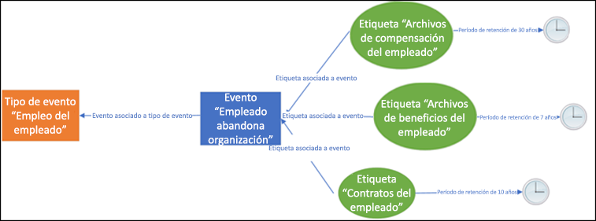
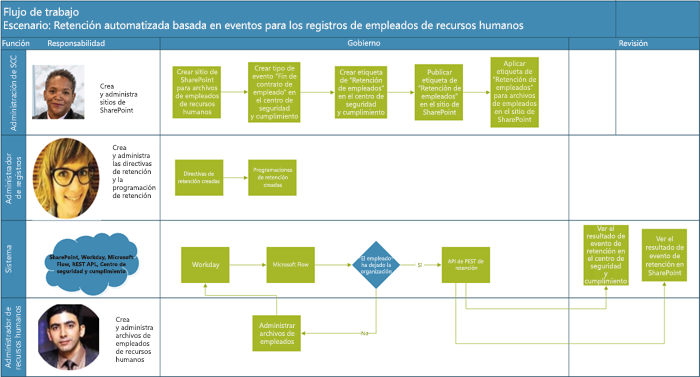
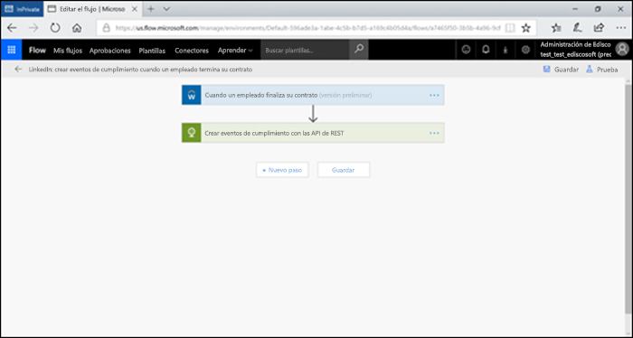
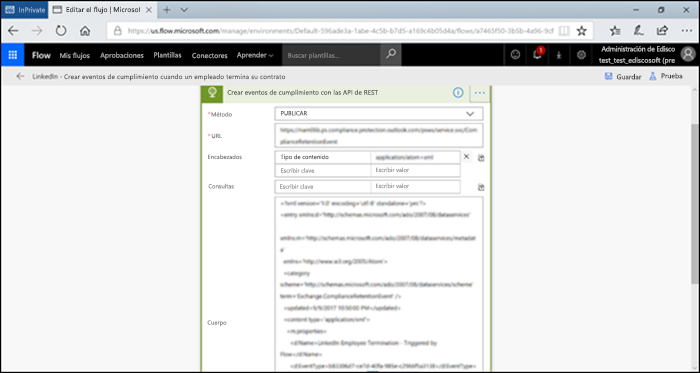
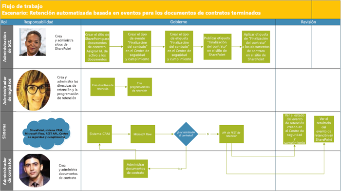
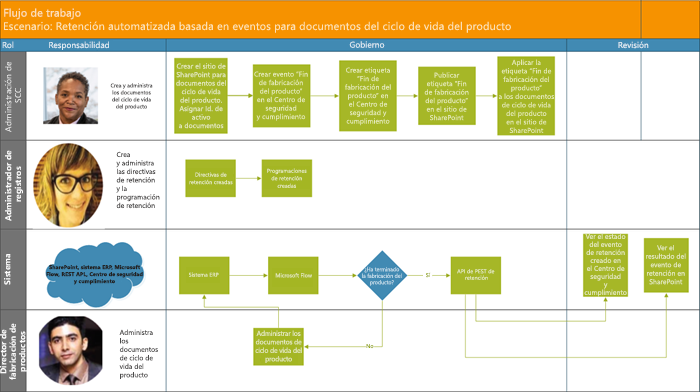

# Retención automática basada en eventosAutomate event-based retention

La explosión de contenido en las organizaciones y la forma en la que se convierte en ROT (redundante obsoleto, trivial) constituye un asunto importante. Para seguir satisfaciendo los desafíos de cumplimiento legal, normativo y empresarial, las empresas deben conservar y proteger la información importante y encontrar rápidamente lo que es relevante. Conservar solo información importante y relevante es clave para el éxito del negocio.The explosion of content in organizations and how it can become ROT (redundant, obsolete, trivial) is serious business. To continue to meet legal, business, and regulatory compliance challenges, businesses must be able to keep and protect important information and quickly find what’s relevant. Retaining only important, pertinent information is key to a business’s success.

Por lo tanto, las organizaciones pueden beneficiarse de las soluciones de retención del Centro de seguridad y cumplimiento de Office 365. La retención puede activarse con [etiquetas de retención](labels.md). Una etiqueta de retención tiene la opción de [basar el período de retención en un evento específico](event-driven-retention.md). Normalmente, el período de retención se basa en una fecha conocida, como la fecha de creación o fecha de última modificación del contenido. Sin embargo, las organizaciones también tienen requisitos para eliminar el contenido en función de la ocurrencia de un evento, como 7 años después de que un empleado deje la organización.Hence organizations can take advantage of retention solutions in the Office 365 Security & Compliance Center. Retention can be triggered by using [retention labels](labels.md). A retention label has the option to [base the retention period on a specific event](event-driven-retention.md). Typically, the retention period is based on a known date, such as the creation date or last modified date for the content. However, organizations also have requirements to dispose of content based on the occurrence of an event, such as 7 years after an employee leaves an organization.

Para garantizar que las normas eliminación de contenido cumplen con las normas, es imprescindible conocer cuándo sucede un evento. Con un volumen de contenido en rápido aumento, se torna cada vez más difícil retener y eliminar contenido de manera oportuna y que cumpla con las normas.In order to ensure compliant disposal of content, it is imperative to know when an event takes place. With the volume of content increasing rapidly, it is becoming challenging to retain and dispose content in a timely and compliant manner.

La retención basada en eventos soluciona este problema. En este tema se explica cómo configurar los flujos de procesos empresariales para automatizar la retención mediante eventos con la API de REST de Microsoft 365.Event-based retention solves this problem. This topic explains how to set up your business process flows to automate retention through events by using the Microsoft 365 REST API.

## Acerca de la retención basada en eventosAbout event-based retention

Una organización puede ser pequeña, mediana o grande. La cantidad de documentos empresariales, documentos legales, archivos de empleados, contratos y documentos de productos que se crean y administran a diario aumenta enormemente.An organization can be small, medium, or large. The number of business documents, legal documents, employee files, contracts, and product documents that get created and managed on a day to day basis is increasing dramatically.

Por ejemplo, cada día, decenas y cientos de empleados se unen a organizaciones y las dejan. El departamento de RR. HH. sigue creando, actualizando o eliminando documentos relacionados con los empleados según los requisitos empresariales. Este proceso está sujeto a las distintas directivas de retención indicadas para la empresa:For example, each day, tens and hundreds of employees are joining and leaving organizations. The HR department continues to create, update, or delete employee-related documents as per business requirements. This process is subject to the different retention policies outlined for the business:

- **El período de retención de contenido puede ser una fecha conocida**, como la fecha en la que se creó, modificó por última vez o etiquetó el contenido. Por ejemplo, puedes retener documentos durante siete años después de su creación y luego eliminarlos.**The period of retention for content can be a known date** such as the date the content was created, last modified or labeled. For example, you might retain documents for seven years after they're created and then delete them.

- **El período de retención de contenido también puede ser una fecha desconocida**. Por ejemplo, con las etiquetas de retención, también puedes basar un período de retención en el momento en el que se produce un tipo de evento específico, como cuando un empleado deja la organización.**The period of retention of content can also be an unknown date**. For example, with retention labels, you can also base a retention period on when a specific type of event occurs, such as an employee leaving the organization.

El evento desencadena el inicio del período de retención y a todo el contenido con una etiqueta aplicada para ese tipo de evento se le aplican las acciones de retención de la etiqueta. Esto se denomina retención basada en eventos: para obtener más información, consulta [Introducción a la retención basada en eventos](event-driven-retention.md).The event triggers the start of the retention period, and all content with a label applied for that type of event get the label's retention actions enforced on them. This is called event-based retention - to learn more, see [Overview of event-driven retention](event-driven-retention.md).

## Configuración de la retención basada en eventosSet up event-based retention

Esta sección describe lo que es necesario realizar antes de retener contenido.This section describes what needs to be done prior to retaining content.

### Identificación de funcionesIdentify roles

Identifica las diferentes funciones en una organización que realizan tareas de administración de registros que serían responsables de una retención eficaz y eficiente de los documentos empresariales.Identify the different roles in an organization that perform Record Management tasks that would be responsible for effective and efficient retention of business documents.

  | **Rol****Persona**| **Función****Role**|
  | - | - |
  | Administración del Centro de seguridad y cumplimientoSecurity & Compliance Center admin | Crea tipos de eventos de retención, etiquetas de retención y repositorios de registros en SharePointCreates Retention Event types, Retention labels and Record repositories in SharePoint |
  | Administrador de registrosRecords Manager                                  | Proporciona detalles de cumplimiento y guías de políticas de retención y programaciones de retenciónProvides Retention Policies and Retention Schedules guidance and compliance details   |
  | Administrador del sistema (empresa)System Admin (business)                          | Configura y administra sistemas externos para que funcionen con Microsoft 365Sets up and manages external systems to work with Microsoft 365                       |
  | Trabajador de informaciónInformation Worker                               | Administra el ciclo de vida de los procesos de su empresa (Recursos Humanos, Finanzas, TI, etc.)Manages the lifecycle of their business process (HR, Finance, IT etc)                 |

### Configuración del Centro de seguridad y cumplimientoSet up the Security & Compliance Center
  
1. La administración del cumplimiento crea un tipo de evento, como el final de una relación laboral, la finalización del contrato o el final de fabricación del producto (consulta el proceso paso a paso en el artículo [Retención de eventos](https://docs.microsoft.com/es-ES/office365/securitycompliance/event-driven-retention)Compliance admin creates an event type – for example, Employee Termination or Contract Expiration or End of Product Manufacturing (Please refer to step by step process in [Event retention article](https://docs.microsoft.com/es-ES/office365/securitycompliance/event-driven-retention)
    
1. La administración de cumplimiento crea una etiqueta de retención basada en un evento y asocia la etiqueta con un tipo de eventoCompliance admin creates a retention label based on an event and associates the label with an event type
    
1. Hay 4 tipos de desencadenadores para las etiquetas de retención:There are 4 types of triggers for retention labels:
            
    1. Fecha de creaciónCreate date
                
    1. Última modificaciónLast modified
                
    1. Fecha de la etiqueta (cuando se etiquetó el contenido)Label date (when the content was labeled)
                
    1. Basado en eventosEvent-based
    
1. La administración del cumplimiento publica la etiquetaCompliance admin publishes the label

### Configurar SharePointSet up SharePoint
   
Para crear un repositorio de registros, la administración del cumplimiento:To create a records repository, the compliance admin:

1. Crea un sitio de SharePoint.Creates a SharePoint site.

1. Realiza una de las siguientes acciones:Does one of the following:
        
    - Crea una biblioteca de SharePoint: establece una etiqueta basada en eventos en el nivel de la biblioteca. Para obtener más información, consulta [Aplicar una etiqueta de retención predeterminada a todo el contenido de una biblioteca, carpeta o conjunto de documentos de SharePoint](labels.md#applying-a-default-retention-label-to-all-content-in-a-sharepoint-library-folder-or-document-set).Creates a SharePoint library: Set event-based label at the library level. For more information, see [Applying a default retention label to all content in a SharePoint library, folder, or document set](labels.md#applying-a-default-retention-label-to-all-content-in-a-sharepoint-library-folder-or-document-set).
          
    - Establece conjunto de documentos en SharePoint. Para obtener más información, consulta [Introducción a los conjuntos de documentos](https://support.office.com/es-ES/article/Introduction-to-Document-Sets-3DBCD93E-0BED-46B7-B1BA-B31DE2BCD234).Sets up a Document set in SharePoint. For more information, see [Introduction to document sets](https://support.office.com/es-ES/article/Introduction-to-Document-Sets-3DBCD93E-0BED-46B7-B1BA-B31DE2BCD234).
      
1. Asigna el Id. de activo (el id. de activo es un nombre o código de producto que usa la organización, por ejemplo, el número de empleado pueden ser un id. de activo) para cada conjunto de documentos del empleado (al asignar el id. de activo a la carpeta, todos los elementos de esa carpeta heredan automáticamente el mismo id de activo. Esto significa que el mismo evento puede desencadenar el período de retención de todos los elementos.Assigns Asset Id (asset ID is a product name or code used by the organization, for example, Employee number can be an asset id) to each employee document set (By assigning the asset ID to the folder, every item in that folder automatically inherits the same asset ID. This means all the items can have their retention period triggered by the same event.

## Formas de desencadenar la retención basada en eventosWays to trigger event-based retention

Existen dos formas de desencadenar la retención basada en eventos:There are two ways in which event-based retention can be triggered:

- **Con la interfaz de usuario del Centro de cumplimiento y seguridad** Este es un proceso que puede usarse para conservar menos contenido por vez o cuando la frecuencia que activa la retención es ocasional (mensual o anual). Para obtener más información sobre este método, consulta [Introducción a la retención basada en eventos](event-driven-retention.md). Sin embargo, esta forma de activar la retención puede requerir demasiado tiempo y ser propensa a errores, por lo que se reduce la escalabilidad. Por lo tanto, una solución perfecta y automatizada para activar la retención puede mejorar la seguridad y el cumplimiento de datos.**Using Security & Compliance Center UI** This is a process that can be used to retain less content at a time or the frequency to trigger retention is not often, such as monthly or yearly. For more information on this method, see [Overview of event-driven retention](event-driven-retention.md). However, this way to trigger retention can be time-consuming and prone to error, thus stunting scalability. Therefore, an automated, seamless solution to trigger retention can enhance the security and compliance of data.

- **Con una API de REST de M365** Este proceso puede usarse cuando se deben retener grandes cantidades de contenido a la vez o cuando la frecuencia para activar la retención es asidua (diaria o semanal). El flujo detecta cuando un evento se ejecuta en el sistema de línea de negocio y crea automáticamente un evento relacionado en el Centro de seguridad y cumplimiento. No es necesario crear manualmente un evento en la interfaz de usuario cada vez que se produce un evento.**Using a M365 REST API** This process can be used when large amounts of content are to be retained at a time and/or the frequency to trigger retention is often such as daily or weekly. The flow detects when an event occurs in your line-of-business system, and then automatically creates a related event in the Security & Compliance Center. You don't need to manually create an event in the UI each time one occurs.

Hay dos opciones para usar la API de REST:There are two options for using the REST API:

- **Microsoft Flow o una aplicación similar** pueden usarse para activar la ocurrencia de un evento de forma automática. Microsoft Flow es un orquestador para conectarse a otros sistemas. Para usar Microsoft Flow no es necesaria una solución personalizada.**Microsoft Flow or a similar application** can be used to trigger the occurrence of an event automatically. Microsoft Flow is an orchestrator for connecting to other systems. Using Microsoft Flow does not require a custom solution.

- **PowerShell o un cliente de HTTP para llamar a la API de REST** Usar PowerShell (versión 6 o posterior) para pedirle a la API de REST de Microsoft 365 que cree eventos.**PowerShell or an HTTP client to call REST API** Using PowerShell (version 6 or higher) to call Microsoft 365 REST API to create events. 

Una API de Rest es un punto de conexión de servicio compatible con conjuntos de operaciones de HTTP (métodos), que aportan acceso para crear, recuperar, actualizar o eliminar a los recursos del servicio: para obtener más información, consulta [Componentes de una solicitud o respuesta de API de REST](https://docs.microsoft.com/es-ES/rest/api/gettingstarted/#components-of-a-rest-api-requestresponse). En este caso, con la API de REST de Microsoft 365, los eventos se pueden crear y recuperar con las operaciones (métodos) POST y GET.A Rest API is a service endpoint that supports sets of HTTP operations (methods), which provide create/retrieve/update/delete access to the service's resources - for more information, see [Components of a REST API request/response](https://docs.microsoft.com/es-ES/rest/api/gettingstarted/#components-of-a-rest-api-requestresponse). In this case, by using the Microsoft 365 REST API, events can be created and retrieved using operations (methods) POST and GET.

## Escenarios de ejemploExample scenarios

Consideremos los siguientes escenarios.Let’s consider the following scenarios.

### Escenario 1: Empleados que dejan la organizaciónScenario 1: Employees leaving the organization 

Una organización crea y almacena numerosos documentos relacionados con los empleados para cada empleado. Estos documentos se administran y conservan mientras dura el vínculo laboral con cada empleado. Sin embargo, cuando el empleado se va de la organización o cuando lo echan, es una obligación legal y un requisito de la empresa conservar los documentos del empleado durante un período establecido.An organization creates and stores numerous employee related documents per employee. These documents are managed and retained during the employment of each employee. However, when the employee leaves the organization or the employment is terminated, the organization is obligated by legal and business requirements to retain the documents of that employee for a stipulated period.

Ahora si varios empleados dejan la organización todos los días, la organización debe activar el reloj de retención de cientos o miles de documentos cada día.Now if multiple employees leave the organization every day, the organization must trigger the retention clock of hundreds if not thousands of documents each day.

Además, se debe calcular el período de retención de cada uno de estos empleados con el siguiente formato: fecha de despido del empleado + número de días, meses o años en función del tipo de registro del empleado. Por ejemplo, es posible que la compensación y la tramitación de beneficios del mismo empleado necesiten retenciones diferentes.In addition to this, the retention period needs to be calculated for each of these employees as Employee termination date + number of days, months or years based on the type of the employee record. For example, worker’s compensation of the employee vs benefits filings of the same employee may need different retention.

El siguiente diagrama muestra cómo puede haber varias etiquetas asociadas a un solo evento. Aquí todos los archivos debajo de la etiqueta de compensación del trabajador y todos los archivos debajo de la etiqueta de beneficios del empleado están asociados con un evento único que es la desvinculación del empleado de la organización. Cada uno de estos archivos tiene un reloj de retención diferente. Por lo tanto, cuando un empleado abandona la organización, los archivos dentro de cada etiqueta tiene un período de retención diferente. Activar todos estos relojes de retención diferentes para cada tipo de archivo o etiqueta de cada empleado es una tarea muy difícil. Imagina realizar esta acción para varios empleados.The diagram below shows how there can be multiple labels that are associated with a single event. Here all the files under Worker’s compensation label and all the files under Employee benefits label are both associated with a single event which is the employee leaving the organization. Each of these different files have different retention clocks. So, when an employee leaves the organization, these files within each label experience a different retention period. To trigger all these different retention clocks for each file type or label for each employee is a very challenging task. Imagine doing this for multiple employees.

Por lo tanto, un proceso automatizado para activar estos relojes de retención diferentes para varios empleados permitirá ahorrar tiempo, evitar errores y lograr una alta eficiencia.Hence an automated process to trigger these different retention clocks for multiple employees will be time-saving, error-free and extremely efficient .

**Configuración de retención automatizada basada en eventos para este escenario:****Configuring Automated Event Based Retention for this scenario:**

  - La administración crea carpetas del empleado en un conjunto de documentos denominado Naiara Padilla, David Pulido.Admin c reates employee folders to the Document set such as Jane Doe, John Smith.

  - La administración agrega archivos del empleado, como los de beneficios, nómina o compensación del trabajador a cada carpeta de empleado.Admin adds employee files such as Benefits, Payroll, Worker’s Compensation to each employee folder

  - La administración asigna el id. de activo a la carpeta de cada empleado.Admin assigns Asset Id to each employee folder. 

  - Administración de SCC iniciaSCC Admin l

  - sesión en el Centro de seguridad y cumplimiento.ogs into the Security & Compliance Center

  - La administración de SCC crea tipos de eventos relacionados con el empleado como “Desvinculación del empleado”, “Contratación del empleados” en el Centro de seguridad y cumplimiento.SCC Admin creates employee related events types such as “Employee Termination”, “Employee Hire” events in Security and Compliance Center.

  - La administración de SCC crea la etiqueta de "Retención de empleados" en el Centro de seguridad y cumplimiento.SCC Admin creates “Employee Retention” label in Security and Compliance Center.

  - Esta etiqueta de "Retención de empleados" se publica y se aplican manual o automáticamente a los archivos de empleado en SharePoint.This “Employee Retention” label is published and applied manually or automatically to the employee files in SharePoint

  - Un sistema de administración de Recursos Humanos como Workday puede trabajar con Microsoft Flow para ejecutarse periódicamente para administrar archivos del empleado.HR Management System like Workday can work with Microsoft Flow to run periodically to manage employee files

  - Cuando un empleado deja la organización, Flow activa la API de REST de retención basada en eventos de M365 que inicia el reloj de retención de archivos específicos del empleado.If an employee has left the organization, the Flow will trigger the M365 Event Based Retention REST API that will begin the retention clock on the specific employee’s files.

#### Usar Microsoft FlowUsing Microsoft Flow

Paso 1: crear un flujo para crear un evento mediante la API de REST de Microsoft 365Step 1- Create a flow to create an event using the Microsoft 365 REST API

##### Crear un eventoCreate an event

Código de ejemplo para llamar a la API de RESTSample code to call the REST API

<table>
<thead>
<tr class="header">
<th>MétodoMethod</th>
<th>POSTPOST</th>
<th></th>
</tr>
</thead>
<tbody>
<tr class="odd">
<td>URLURL</td>
<td>https://ps.compliance.protection.outlook.com/psws/service.svc/ComplianceRetentionEvent)</td>
<td></td>
</tr>
<tr class="even">
<td>EncabezadosHeaders</td>
<td>Tipo de contenidoContent-Type</td>
<td>aplicación/atom+xmlapplication/atom+xml</td>
</tr>
<tr class="odd">
<td>CuerpoBody</td>
<td>
&lt;?xml version='1.0' encoding='utf-8' standalone='yes'?&gt;&lt;?xml version='1.0' encoding='utf-8' standalone='yes'?&gt;

&lt;entry xmlns:d='http://schemas.microsoft.com/ado/2007/08/dataservices'&lt;entry xmlns:d='http://schemas.microsoft.com/ado/2007/08/dataservices'

xmlns:m='http://schemas.microsoft.com/ado/2007/08/dataservices/metadata'xmlns:m='http://schemas.microsoft.com/ado/2007/08/dataservices/metadata'

xmlns='http://www.w3.org/2005/Atom'&gt;xmlns='http://www.w3.org/2005/Atom'&gt;

&lt;category scheme='http://schemas.microsoft.com/ado/2007/08/dataservices/scheme' term='Exchange.ComplianceRetentionEvent' /&gt;&lt;category scheme='http://schemas.microsoft.com/ado/2007/08/dataservices/scheme' term='Exchange.ComplianceRetentionEvent' /&gt;

&lt;updated&gt;9/9/2017 10:50:00 PM&lt;/updated&gt;&lt;updated&gt;9/9/2017 10:50:00 PM&lt;/updated&gt;

&lt;content type='application/xml'&gt;&lt;content type='application/xml'&gt;

&lt;m:properties&gt;&lt;m:properties&gt;

&lt;d:Name&gt;Employee Termination &lt;/d:Name&gt;&lt;d:Name&gt;Employee Termination &lt;/d:Name&gt;

&lt;d:EventType&gt;99e0ae64-a4b8-40bb-82ed-645895610f56&lt;/d:EventType&gt;&lt;d:EventType&gt;99e0ae64-a4b8-40bb-82ed-645895610f56&lt;/d:EventType&gt;

&lt;d:SharePointAssetIdQuery&gt;1234&lt;/d:SharePointAssetIdQuery&gt;&lt;d:SharePointAssetIdQuery&gt;1234&lt;/d:SharePointAssetIdQuery&gt;

&lt;d:EventDateTime&gt;2018-12-01T00:00:00Z &lt;/d:EventDateTime&gt;&lt;d:EventDateTime&gt;2018-12-01T00:00:00Z &lt;/d:EventDateTime&gt;

&lt;/m:properties&gt;&lt;/m:properties&gt;

&lt;/content&gt;&lt;/content&gt;

&lt;/entry&gt;&lt;/entry&gt;
</td>
<td></td>
</tr>
<tr class="even">
<td>AutenticaciónAuthentication</td>
<td>BásicaBasic</td>
<td></td>
</tr>
<tr class="odd">
<td>Nombre de usuarioUsername</td>
<td>“Complianceuser”“Complianceuser”</td>
<td></td>
</tr>
<tr class="even">
<td>ContraseñaPassword</td>
<td>“Compliancepassword”“Compliancepassword”</td>
<td></td>
</tr>
</tbody>
</table>

##### Parámetros disponiblesAvailable parameters

<table>
<thead>
<tr class="header">
<th><strong>Parámetros</strong><strong>Parameters</strong></th>
<th><strong>Descripción</strong><strong>Description</strong></th>
<th><strong>Notas</strong><strong>Notes</strong></th>
</tr>
</thead>
<tbody>
<tr class="odd">
<td>&lt;d:Name&gt;&lt;/d:Name&gt;&lt;d:Name&gt;&lt;/d:Name&gt;</td>
<td>Escribe un nombre único para el evento.Provide a unique name for the event,</td>
<td>No puede contener espacios finales ni los siguientes caracteres: % \* \ &amp; &lt; &gt; | # ? , : ;Cannot contain trailing spaces, and the following characters: % \* \ &amp; &lt; &gt; | # ? , : ;</td>
</tr>
<tr class="even">
<td>&lt;d:eventType&gt;&lt;/d:EventType&gt;&lt;d:EventType&gt;&lt;/d:EventType&gt;</td>
<td>Escribe el nombre del tipo de evento (o Guid)Enter event type name (or Guid),</td>
<td>Ejemplo: "Desvinculación del empleado". El tipo de evento debe estar asociado con una etiqueta de retención.Example: “Employee termination”. Event type has to be associated with a retention label.</td>
</tr>
<tr class="odd">
<td>&lt;d:SharePointAssetIdQuery&gt;&lt;/d:SharePointAssetIdQuery&gt;&lt;d:SharePointAssetIdQuery&gt;&lt;/d:SharePointAssetIdQuery&gt;</td>
<td>Escribe "ComplianceAssetId:" + Id. de empleadoEnter “ComplianceAssetId:” + employee Id</td>
<td>Ejemplo:&quot;ComplianceAssetId:12345&quot;Example:&quot;ComplianceAssetId:12345&quot;</td>
</tr>
<tr class="even">
<td>&lt;d:EventDateTime&gt;&lt;/d:EventDateTime&gt;&lt;d:EventDateTime&gt;&lt;/d:EventDateTime&gt;</td>
<td>Fecha y hora del eventoEvent Date and Time</td>
<td>
Formato: aaaa-MM-ddTHH:mm:ssZ, ejemplo:Format: yyyy-MM-ddTHH:mm:ssZ, Example:

2018-12-01T00:00:00Z2018-12-01T00:00:00Z
</td>
</tr>
</tbody>
</table>

##### Códigos de respuestaResponse codes

| **Código de respuesta****Response Code** | **Descripción****Description**       |
| ----------------- | --------------------- |
| 302302               | RedirigirRedirect              |
| 201201               | Fecha de creaciónCreated               |
| 403403               | Error de autorizaciónAuthorization Failed  |
| 401401               | Error de autenticaciónAuthentication Failed |

##### Obtener eventos según el intervalo de tiempoGet Events based on time range

<table>
<thead>
<tr class="header">
<th>MétodoMethod</th>
<th>GETGET</th>
<th></th>
</tr>
</thead>
<tbody>
<tr class="odd">
<td>URLURL</td>
<td><ol start="4" type="1">
<li>
https://ps.compliance.protection.outlook.com/psws/service.svc/ComplianceRetentionEvent?BeginDateTime=2019-01-11&amp; EndDateTime = 2019-16: 01https://ps.compliance.protection.outlook.com/psws/service.svc/ComplianceRetentionEvent?BeginDateTime=2019-01-11&amp;EndDateTime=2019-01-16
</li>
</ol></td>
<td></td>
</tr>
<tr class="even">
<td>EncabezadosHeaders</td>
<td>Tipo de contenidoContent-Type</td>
<td>aplicación/atom+xmlapplication/atom+xml</td>
</tr>
<tr class="odd">
<td></td>
<td></td>
<td></td>
</tr>
<tr class="even">
<td>AutenticaciónAuthentication</td>
<td>BásicaBasic</td>
<td></td>
</tr>
<tr class="odd">
<td>Nombre de usuarioUsername</td>
<td>“Complianceuser”“Complianceuser”</td>
<td></td>
</tr>
<tr class="even">
<td>ContraseñaPassword</td>
<td>“Compliancepassword”“Compliancepassword”</td>
<td></td>
</tr>
</tbody>
</table>

##### Códigos de respuestaResponse codes

| **Código de respuesta****Response Code** | **Descripción****Description**                   |
| ----------------- | --------------------------------- |
| 200200               | Aceptar, una lista de eventos de atom+ xmlOK, A list of events in atom+ xml |
| 404404               | No encontradoNot found                         |
| 302302               | RedirigirRedirect                          |
| 401401               | Error de autorizaciónAuthorization Failed              |
| 403403               | Error de autenticaciónAuthentication Failed             |

##### Obtén un objeto por id.Get an event by ID

| MétodoMethod         | GETGET   |                      |
| -------------- | ------------------------------------------------------------------------------------------------------------------------------------------------------------------------------------------------------------------------------------------------------------------ | -------------------- |
| URLURL            | [https://ps.compliance.protection.outlook.com/psws/service.svc/ComplianceRetentionEvent(‘174e9a86-74ff-4450-8666-7c11f7730f66’)](https://ps.compliance.protection.outlook.com/psws/service.svc/ComplianceRetentionEvent\('174e9a86-74ff-4450-8666-7c11f7730f66'\))[https://ps.compliance.protection.outlook.com/psws/service.svc/ComplianceRetentionEvent(‘174e9a86-74ff-4450-8666-7c11f7730f66’)](https://ps.compliance.protection.outlook.com/psws/service.svc/ComplianceRetentionEvent\('174e9a86-74ff-4450-8666-7c11f7730f66'\)) |                      |
| EncabezadoHeader         | Tipo de contenidoContent-Type                                                                                                                                                                                                                                                       | aplicación/atom+xmlapplication/atom+xml |
| AutenticaciónAuthentication | BásicaBasic                                                                                                                                                                                                                                                              |                      |
| Nombre de usuarioUsername       | “Complianceuser”“Complianceuser”                                                                                                                                                                                                                                                   |                      |
| ContraseñaPassword       | “Compliancepassword”“Compliancepassword”                                                                                                                                                                                                                                               |                      |

##### Códigos de respuestaResponse codes

| **Código de respuesta****Response Code** | **Descripción****Description**                                      |
| ----------------- | ---------------------------------------------------- |
| 200200               | Aceptar, el cuerpo de la respuesta contiene el evento en atom+ xmlOK, The response body contains the event in atom+xml |
| 404404               | No encontradoNot found                                            |
| 302302               | RedirigirRedirect                                             |
| 401401               | Error de autorizaciónAuthorization Failed                                 |
| 403403               | Error de autenticaciónAuthentication Failed                                |

##### Obtén un evento por nombreGet an event by name

| MétodoMethod         | GETGET       |                      |
| -------------- | -------------------------------------------------------------------------------------------------------------------------------------------- | -------------------- |
| URLURL            | <https://ps.compliance.protection.outlook.com/psws/service.svc/ComplianceRetentionEvent('EventByRESTPost-2226bfebcc2841a8968ba71f9516b763')> |                      |
| EncabezadosHeaders        | Tipo de contenidoContent-Type                                                                                                                                 | aplicación/atom+xmlapplication/atom+xml |
| AutenticaciónAuthentication | BásicaBasic                                                                                                                                        |                      |
| Nombre de usuarioUsername       | “Complianceuser”“Complianceuser”                                                                                                                             |                      |
| ContraseñaPassword       | “Compliancepassword”“Compliancepassword”                                                                                                                         |                      |

##### Códigos de respuestaResponse codes

| **Código de respuesta****Response Code** | **Descripción****Description**                                      |
| ----------------- | ---------------------------------------------------- |
| 200200               | Aceptar, el cuerpo de la respuesta contiene el evento en atom+ xmlOK, The response body contains the event in atom+xml |
| 404404               | No encontradoNot found                                            |
| 302302               | RedirigirRedirect                                             |
| 401401               | Error de autorizaciónAuthorization Failed                                 |
| 403403               | Error de autenticaciónAuthentication Failed                                |

#### Uso de PowerShell (ver.6 o posterior) o cualquier cliente HTTPUsing PowerShell (ver.6 or higher) or any HTTP client

Paso 1: Conéctate a PowerShell.Step 1: Connect to PowerShell.

Paso 2: Ejecuta el siguiente script.Step 2: Run the following script.

<table>
<tbody>
<tr class="odd">
<td>
param([string]$baseUri)param([string]$baseUri)

$userName = &quot;UserName&quot;$userName = &quot;UserName&quot;

$password = &quot;Password&quot;$password = &quot;Password&quot;

$securePassword = ConvertTo-SecureString $password -AsPlainText -Force$securePassword = ConvertTo-SecureString $password -AsPlainText -Force

$credentials = New-Object System.Management.Automation.PSCredential($userName, $securePassword)$credentials = New-Object System.Management.Automation.PSCredential($userName, $securePassword)

$EventName=&quot;EventByRESTPost-$(([Guid]::NewGuid()).ToString('N'))&quot;$EventName=&quot;EventByRESTPost-$(([Guid]::NewGuid()).ToString('N'))&quot;

Write-Host &quot;Comienza a crear un evento con el nombre: $EventName&quot;Write-Host &quot;Start to create an event with name: $EventName&quot;

$body = &quot;&lt;?xml version='1.0' encoding='utf-8' standalone='yes'?&gt;$body = &quot;&lt;?xml version='1.0' encoding='utf-8' standalone='yes'?&gt;

&lt;entry xmlns:d='http://schemas.microsoft.com/ado/2007/08/dataservices'&lt;entry xmlns:d='http://schemas.microsoft.com/ado/2007/08/dataservices'

xmlns:m='http://schemas.microsoft.com/ado/2007/08/dataservices/metadata'xmlns:m='http://schemas.microsoft.com/ado/2007/08/dataservices/metadata'

xmlns='http://www.w3.org/2005/Atom'&gt;xmlns='http://www.w3.org/2005/Atom'&gt;

&lt;category scheme='http://schemas.microsoft.com/ado/2007/08/dataservices/scheme' term='Exchange.ComplianceRetentionEvent' /&gt;&lt;category scheme='http://schemas.microsoft.com/ado/2007/08/dataservices/scheme' term='Exchange.ComplianceRetentionEvent' /&gt;

&lt;actualizado&gt;7/14/2017 2:03:36 PM&lt;/updated&gt;&lt;updated&gt;7/14/2017 2:03:36 PM&lt;/updated&gt;

&lt;content type='application/xml'&gt;&lt;content type='application/xml'&gt;

&lt;m:properties&gt;&lt;m:properties&gt;

&lt;d:Name&gt;$EventName&lt;/d:Name&gt;&lt;d:Name&gt;$EventName&lt;/d:Name&gt;

&lt;d:EventType&gt;e823b782-9a07-4e30-8091-034fc01f9347&lt;/d:EventType&gt;&lt;d:EventType&gt;e823b782-9a07-4e30-8091-034fc01f9347&lt;/d:EventType&gt;

&lt;d:SharePointAssetIdQuery&gt;'ComplianceAssetId:123'&lt;/d:SharePointAssetIdQuery&gt;&lt;d:SharePointAssetIdQuery&gt;'ComplianceAssetId:123'&lt;/d:SharePointAssetIdQuery&gt;

&lt;/m:properties&gt;&lt;/m:properties&gt;

&lt;/content&gt;&lt;/content&gt;

&lt;/entry&gt;&quot;&lt;/entry&gt;&quot;

$event = $null$event = $null

probartry

{{

$event = Invoke-RestMethod -Body $body -Method 'POST' -Uri &quot;$baseUri/ComplianceRetentionEvent&quot; -ContentType &quot;application/atom+xml&quot; -Authentication Basic -Credential $credentials -MaximumRedirection 0$event = Invoke-RestMethod -Body $body -Method 'POST' -Uri &quot;$baseUri/ComplianceRetentionEvent&quot; -ContentType &quot;application/atom+xml&quot; -Authentication Basic -Credential $credentials -MaximumRedirection 0

}}

catchcatch

{{

$response = $_. Exception.Response$response = $_.Exception.Response

if($response.StatusCode -eq &quot;Redirect&quot;)if($response.StatusCode -eq &quot;Redirect&quot;)

{{

$url = $response.Headers.Location$url = $response.Headers.Location

Write-Host &quot;redirected to $url&quot;Write-Host &quot;redirected to $url&quot;

$event = Invoke-RestMethod -Body $body -Method 'POST' -Uri $url -ContentType &quot;application/atom+xml&quot; -Authentication Basic -Credential $credentials -MaximumRedirection 0$event = Invoke-RestMethod -Body $body -Method 'POST' -Uri $url -ContentType &quot;application/atom+xml&quot; -Authentication Basic -Credential $credentials -MaximumRedirection 0

}}

}}

$event | fl \*$event | fl \*
</td>
</tr>
</tbody>
</table>

#### Comprobar el resultado en ambas opciones.Verify the outcome in both options

Paso 1: Ir al Centro de seguridad y cumplimientoStep 1: Go to Security & Compliance Center

Paso 2: Hacer clic en eventos debajo de Gobierno de datosStep 2: Click on Events under Data Governance

Paso 3: Comprobar que se creó el evento.Step 3: Verify Event has been created.

De forma similar, también se pueden usar las opciones anteriores para automatizar la retención basada en eventos para los siguientes escenarios.Similarly, the above options to automate event based retention can be used for the following scenarios as well.

### Escenario 2: Contratos que expiranScenario 2: Contracts Expiring

Una organización puede tener varios registros de un único contrato con clientes, proveedores y partners. Estos documentos pueden encontrarse en una biblioteca de documentos, como SharePoint. La finalización de un contrato determina el inicio del período de retención de los documentos asociados con el contrato. Por ejemplo: todos los registros relacionados con los contratos deben conservarse durante cinco años a partir del momento en el que expira el contrato. El evento que activa el período de retención de cinco años es la expiración del contrato.An organization can have multiple records for a single contract with customers, vendors and partners. These documents can reside in a document library like SharePoint. The ending of a contract determines the start of the retention period of the documents associated with the contract. For example: all records related to contracts need to be retained for five years from the time the contract expires. The event that triggers the five-year retention period is the expiration of the contract.

Un sistema de administración de relaciones de cliente (CRM) puede trabajar con Microsoft 365 y activar la retención de documentos del contrato.A Customer Relationship Management (CRM) system can work with Microsoft 365 and trigger retention of Contract documents

**Configuración de retención automatizada basada en eventos para este escenario:****Configuring Automated Event Based Retention for this scenario:**

  - La administración crea una biblioteca de SharePoint con carpetas diferentes para cada tipo de contrato.Admin creates a SharePoint library with various folders for each contract type.

  - La administración agrega archivos del contrato como contratos de licencia y contratos de desarrollo para cada carpeta del contrato.Admin adds contract files such as License Contracts, Development Contracts to each contract folder

  - La administración asigna el id. de activo a cada carpeta de contrato.Admin assigns Asset Id to each contract folder

  - La administración de SSC inicia sesión en el Centro de seguridad y cumplimiento.SCC Admin logs into the Security & Compliance Center

  - La administración de SCC crea tipos de eventos relacionados con el contrato como eventos de "Creación del contrato" y "Expiración del contrato" en el Centro de seguridad y cumplimiento.SCC Admin creates contract related events types such as “Contract Creation”, “Contract Expiration” events in Security and Compliance Center.

  - La administración de SCC crea la etiqueta "Expiración del contrato" en el Centro de seguridad y cumplimiento.SCC Admin creates “Contract Expiration” label in Security and Compliance Center.

  - Esta etiqueta de "Expiración del contrato" se publica y se aplican de forma manual o automática a los archivos del contrato en SharePoint.This “ Contract Expiration” label is published and applied manually or automatically to the contract files in SharePoint

  - El sistema de administración de contrato puede trabajar con Microsoft Flow o una aplicación similar para ejecutarse periódicamente para administrar archivos de contrato.Contract Management System can work with Microsoft Flow or a similar application to run periodically to manage contract files

  - Si un contrato vence, Microsoft Flow activará la API de REST de retención basada en eventos de M365 que iniciará el reloj de retención de archivos específicos del contrato.If a contract expires, Microsoft Flow will trigger the M365 Event Based Retention REST API that will begin the retention clock on the specific contract’s files.

### Escenario 3: Final de fabricación de productosScenario 3: End of Product Manufacturing

Una empresa de elaboración que fabrica diferentes líneas de productos crea varias especificaciones de elaboración y documentos de precios. Cuando el producto ya no se fabrica, todas las especificaciones y documentos vinculados a este producto deben conservarse durante un período específico después del final de la vida útil del producto.A manufacturing company that produces different lines of products creates many manufacturing specifications and pricing documents. When the product is no longer manufactured, all specifications and documents linked to this product need to be retained for a specific period after the end of the lifetime of the product.

Un sistema de planeación de recursos empresariales (ERP) puede trabajar con Microsoft 365 y Microsoft Flow para activar la retención.An Enterprise Resource Planning (ERP) system can work with Microsoft 365 and Microsoft Flow to trigger retention.

**Configuración de retención automatizada basada en eventos para este escenario:****Configuring Automated Event Based Retention for this scenario:**

  - La administración crea carpetas de productos en el conjunto de documentos como Producto 1, Producto 2, etc.Admin creates product folders in the Document set such as Product 1, Product 2, etc.

  - La administración agrega los archivos de productos como Especificaciones de fabricación, Precio del producto y Licencias del producto a cada carpeta de producto.Admin adds product files such as Manufacturing Specifications, Product Pricing, Product licensing to each product folder

  - La administración le asigna el id. de activo a cada carpeta del producto.Admin assigns Asset Id to each productfolder.

  - La administración de SSC inicia sesión en el Centro de seguridad y cumplimiento.SCC Admin logs into the Security & Compliance Center

  - La administración de SCC crea tipos de eventos relacionados con el empleado como "Inicio de fabricación del producto" y "Final de fabricación del producto" en el Centro de seguridad y cumplimiento.SCC Admin creates employee related events types such as “Start of Product Manufacturing”, “End of Product Manufacturing” events in Security and Compliance Center.

  - La administración de SCC crea la etiqueta "Final de fabricación del producto" en el Centro de seguridad y cumplimiento.SCC Admin creates “End of Product Manufacturing” label in Security and Compliance Center.

  - Esta etiqueta de "Final de fabricación del producto" se publica y se aplica de forma manual o automática a los archivos del producto en SharePointThis “ End of Product Manufacturing” label is published and applied manually or automatically to the product files in SharePoint

  - Los sistemas de ERP pueden funcionar con Microsoft Flow o con aplicaciones similares para ejecutarse periódicamente para administrar archivos del producto.ERP Systems can work with Microsoft Flow or similar applications to run periodically to manage product files

  - Si se termina la fabricación de un producto, Microsoft Flow activará la API de REST de retención basada en eventos de M365 que iniciará el reloj de retención de archivos específicos del producto.If the manufacturing of a product ends, Microsoft Flow will trigger the M365 Event Based Retention REST API that will begin the retention clock on the specific product’s files.

## ApéndiceAppendix

### Cómo usar los resultados de respuesta Redirect 302 para llamar a la API de RESTUsing Redirect 302 response results to call the REST API

1.  Invocar una llamada de evento de retención POST con la URL de la API de REST <https://ps.compliance.protection.outlook.com/psws/service.svc/ComplianceRetentionEvent> (se requieren permisos de administrador global).Invoke a POST retention event call using the REST API URL <https://ps.compliance.protection.outlook.com/psws/service.svc/ComplianceRetentionEvent> (Global Admin permissions are required)

2.  Comprobar el código de respuesta. Si es 302, obtener la dirección URL redirigida de la propiedad de ubicación del encabezado de respuesta.Check the response code. If it’s 302, then get the redirected URL from Location property of the response header

3.  Invocar la llamada al evento de retención POST nuevamente mediante el URL redireccionado.Invoke the POST retention event call again using the redirected URL.

## CréditosCredits

Este tema fue revisado por:This topic was reviewed by:

Antonio MaioAntonio Maio MVP de servicios y aplicaciones de Microsoft OfficeMicrosoft Office Apps and Services MVP  Antonio.Maio@Protiviti.comAntonio.Maio@Protiviti.com
