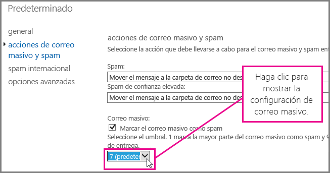
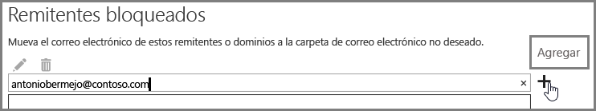

# <a name="block-email-spam-with-the-office-365-spam-filter-to-prevent-false-negative-issues"></a><span data-ttu-id="7b34b-103">Bloquear el correo no deseado con el filtro contra correo no deseado de Office 365 para evitar problemas de falsos negativos</span><span class="sxs-lookup"><span data-stu-id="7b34b-103">Block email spam with the Office 365 spam filter to prevent false negative issues</span></span>

<span data-ttu-id="7b34b-p101">Exchange Online Protection (EOP) es un servicio de filtrado de correo electrónico basado en la nube que protege a su organización contra el correo no deseado y el malware. Si tiene buzones en Office 365, ya están protegidos de forma predeterminada con EOP.</span><span class="sxs-lookup"><span data-stu-id="7b34b-p101">Exchange Online Protection (EOP) is a cloud-based email filtering service that helps protect your organization against spam and malware. If you have mailboxes in Office 365, they are already protected by default with EOP.</span></span> 
  
<span data-ttu-id="7b34b-p102">Para garantizar que los mensajes de correo no deseado y correo masivo estén bloqueados, ajuste el filtro contra correo no deseado de Office 365. Esto ayudará a impedir el problema de falsos negativos, donde se permite que el correo no deseado llegue a la bandeja de entrada del usuario. Como administrador de Exchange Online o Exchange Online Protection (EOP), siga este procedimiento para ajustar el filtro contra correo no deseado de Office 365 e impedir que el correo no deseado se entregue en las bandejas de entrada de los usuarios.</span><span class="sxs-lookup"><span data-stu-id="7b34b-p102">You can help to ensure spam and junk messages are blocked by adjusting your Office 365 spam filter. This helps to prevent the false negative issue, where email spam is allowed through to a user inbox. As an Exchange Online or Exchange Online Protection (EOP) administrator, use the following steps to adjust your Office 365 anti-spam filter and help prevent spam from being delivered to your user's inboxes.</span></span>
  
## <a name="customize-the-office-365-anti-spam-filter-with-these-settings"></a><span data-ttu-id="7b34b-109">Personalizar el filtro contra correo no deseado de Office 365 con estas opciones de configuración</span><span class="sxs-lookup"><span data-stu-id="7b34b-109">Customize the Office 365 anti-spam filter with these settings</span></span>

<span data-ttu-id="7b34b-p103">Un administrador puede usar varias opciones de configuración del filtro contra correo no deseado de Office 365 para impedir que el correo no deseado se envíe a las bandejas de entrada de los usuarios. El filtro contra correo no deseado de Office 365 se mejorará y podrá bloquear el correo no deseado e impedir mensajes de falsos negativos si usa las opciones que se indican aquí. En este contexto, un falso negativo hace referencia a mensajes masivos o de correo no deseado que se envían a la bandeja de entrada de un usuario.</span><span class="sxs-lookup"><span data-stu-id="7b34b-p103">An Admin can use several Office 365 spam filter settings to help prevent email spam from being sent to a user inbox. The Office 365 spam filter will become better able to block email spam and prevent false negative messages if you use the options listed here. In this context, a false negative refers to email spam or junk messages that are getting sent to a user inbox.</span></span>
  
### <a name="block-ip-addresses-with-a-connection-filter"></a><span data-ttu-id="7b34b-113">Bloquear direcciones IP con un filtro de conexión</span><span class="sxs-lookup"><span data-stu-id="7b34b-113">Block IP addresses with a connection filter</span></span>

<span data-ttu-id="7b34b-114">Para personalizar el filtro contra correo no deseado de Office 365, agregue la dirección IP del remitente a la lista de direcciones IP bloqueadas del filtro de conexión:</span><span class="sxs-lookup"><span data-stu-id="7b34b-114">Customize your Office 365 spam filter by adding the sender IP address to the connection filter IP block list:</span></span>
  
1. <span data-ttu-id="7b34b-115">Obtenga los encabezados del mensaje que quiere bloquear en su cliente de correo, como Outlook o Outlook en la Web (anteriormente conocido como Outlook Web App), como se describe en [Analizador de encabezados de mensaje](https://go.microsoft.com/fwlink/p/?LinkId=306583).</span><span class="sxs-lookup"><span data-stu-id="7b34b-115">Obtain the headers for the message you want to block in your mail client such as Outlook or Outlook Web App, as described in [Message Header Analyzer](https://go.microsoft.com/fwlink/p/?LinkId=306583).</span></span>
    
2. <span data-ttu-id="7b34b-116">Busque la dirección IP después de la etiqueta CIP en el encabezado X-Forefront-Antispam-Report con el [Analizador de encabezados de mensaje](https://testconnectivity.microsoft.com/?tabid=mha) o de forma manual.</span><span class="sxs-lookup"><span data-stu-id="7b34b-116">Search for the IP address following the CIP tag in the X-Forefront-Antispam-Report header using the [message header analyzer](https://testconnectivity.microsoft.com/?tabid=mha) or manually.</span></span> 
    
3. <span data-ttu-id="7b34b-117">Para agregar la dirección IP a la lista de direcciones IP bloqueadas, siga los pasos que se indican en “Usar el EAC para editar la directiva de filtro de conexión predeterminada” en [Configurar la directiva de filtro de conexiones](https://technet.microsoft.com/es-ES/library/jj200718%28v=exchg.150%29.aspx).</span><span class="sxs-lookup"><span data-stu-id="7b34b-117">Add the IP address to the IP Block list by following the steps in "Use the EAC to edit the default connection filter policy" in [Configure the Connection Filter Policy](https://technet.microsoft.com/es-ES/library/jj200718%28v=exchg.150%29.aspx).</span></span>
    
### <a name="block-bulk-mail-with-transport-rules-or-the-spam-filter"></a><span data-ttu-id="7b34b-118">Bloquear el correo masivo con regla de transporte o el filtro de correo no deseado</span><span class="sxs-lookup"><span data-stu-id="7b34b-118">Block bulk mail with transport rules or the spam filter</span></span>

<span data-ttu-id="7b34b-p104">¿Es el correo no deseado principalmente correo masivo (por ejemplo, boletines o promociones)? Puede personalizar el filtro de correo no deseado en Office 365 si [usa reglas de transporte para filtrar de forma agresiva mensajes de correo masivo](https://technet.microsoft.com/es-ES/library/dn720438%28v=exchg.150%29.aspx) o activa la opción **Correo masivo** en las [Opciones avanzadas de filtrado de correo no deseado](https://technet.microsoft.com/es-ES/library/jj200750%28v=exchg.150%29.aspx) del filtro de correo no deseado. En el Centro de administración de Exchange, primero haga clic en **Protección** \> **Filtro de contenido** y, después, haga doble clic en la directiva de filtro que quiera ajustar. Haga clic en **Acciones de correo no deseado y correo masivo** para ajustar la configuración, como se muestra aquí.</span><span class="sxs-lookup"><span data-stu-id="7b34b-p104">Is the spam primarily bulk mail, for example, newsletters or promotions? You can customize the spam filter in Office 365 if you [Use transport rules to aggressively filter bulk email messages](https://technet.microsoft.com/es-ES/library/dn720438%28v=exchg.150%29.aspx) or turn on the **Bulk mail** setting in your spam filter's [Advanced Spam Filtering Options](https://technet.microsoft.com/es-ES/library/jj200750%28v=exchg.150%29.aspx). In the Exchange Admin center, get started by clicking **Protection** \> **Content filter** and then double click the filter policy you want to adjust. Click **Spam and bulk mail actions** to adjust the settings, as shown here.</span></span> 
  

  
### <a name="block-email-spam-using-spam-filter-block-lists"></a><span data-ttu-id="7b34b-124">Bloquear el correo no deseado con listas de bloqueados de filtro de correo no deseado</span><span class="sxs-lookup"><span data-stu-id="7b34b-124">Block email spam using spam filter block lists</span></span>

<span data-ttu-id="7b34b-p105">[Configure las directivas de filtro de correo no deseado](https://technet.microsoft.com/es-ES/library/jj200684%28v=exchg.150%29.aspx) para agregar la dirección del remitente a la lista de bloqueados del remitente o agregue el dominio a la lista de bloqueados del dominio en el filtro de correo no deseado. Los correos electrónicos de un remitente o dominio que se encuentre en la lista de bloqueados de filtro de correo no deseado se marcarán como correo no deseado.</span><span class="sxs-lookup"><span data-stu-id="7b34b-p105">[Configure your spam filter policies](https://technet.microsoft.com/es-ES/library/jj200684%28v=exchg.150%29.aspx) to add the sender address to the sender block list or domain to the domain block list in the spam filter. Emails from a sender or domain on a spam filter block list will marked as spam.</span></span> 
  
### <a name="advanced-spam-filtering-options"></a><span data-ttu-id="7b34b-127">Opciones avanzadas de filtrado de correo no deseado</span><span class="sxs-lookup"><span data-stu-id="7b34b-127">Advanced spam filtering options</span></span>

<span data-ttu-id="7b34b-128">[Configure las directivas de filtro de correo no deseado](https://technet.microsoft.com/es-ES/library/jj200684%28v=exchg.150%29.aspx) y active otras [Opciones avanzadas de filtrado de correo no deseado](https://technet.microsoft.com/es-ES/library/jj200750%28v=exchg.150%29.aspx).</span><span class="sxs-lookup"><span data-stu-id="7b34b-128">[Configure your spam filter policies](https://technet.microsoft.com/es-ES/library/jj200684%28v=exchg.150%29.aspx) and turn on additional [Advanced Spam Filtering Options](https://technet.microsoft.com/es-ES/library/jj200750%28v=exchg.150%29.aspx).</span></span>
  
<span data-ttu-id="7b34b-p106">Para obtener más información sobre otras opciones de configuración de correo no deseado que se aplican en toda la organización, vea [Impedir falsos positivos de correo electrónico marcado como correo no deseado con una lista segura u otras técnicas](prevent-email-from-being-marked-as-spam-0.md). Esto resulta útil si tiene control de nivel de administrador y quiere impedir falsos positivos.</span><span class="sxs-lookup"><span data-stu-id="7b34b-p106">For more spam settings that apply to the whole organization, take a look at [Prevent false positive email marked as spam with a safelist or other techniques](prevent-email-from-being-marked-as-spam-0.md). This is helpful if you have administrator-level control and you want to prevent false positives.</span></span>
  
## <a name="email-users-can-also-help-ensure-that-false-negative-and-email-spam-is-blocked-with-office-365-spam-filter"></a><span data-ttu-id="7b34b-131">Los usuarios de correo electrónico también pueden asegurarse de que los falsos negativos y el correo no deseado se bloqueen con un filtro contra correo no deseado de Office 365.</span><span class="sxs-lookup"><span data-stu-id="7b34b-131">Email users can also help ensure that false negative and email spam is blocked with Office 365 spam filter</span></span>

<span data-ttu-id="7b34b-p107">Facilitará los esfuerzos contra correo no deseado de Office 365 para impedir falsos negativos y correo masivo si pide a los usuarios que agreguen la dirección del remitente de correo no deseado a su lista de remitentes bloqueados en [Outlook](https://go.microsoft.com/fwlink/p/?LinkId=270065) o en [Outlook en la Web](https://go.microsoft.com/fwlink/p/?LinkId=294862). En Outlook en la Web, haga clic en **Configuración** \> **Opciones** \> **Bloquear o permitir** y, después, agregue la dirección a la lista de **remitentes bloqueados**, como se muestra aquí.</span><span class="sxs-lookup"><span data-stu-id="7b34b-p107">It will help your Office 365 anti-spam efforts to prevent false negatives and junk mail if you tell your users to add the spam sender address to their blocked sender list in [Outlook](https://go.microsoft.com/fwlink/p/?LinkId=270065) or [Outlook Web App](https://go.microsoft.com/fwlink/p/?LinkId=294862). In Outlook Web App, get started by clicking **Settings** \> **Options** \> **Block or allow**, and then adding the address to the **Blocked senders** list, as shown here.</span></span> 
  

  
> [!NOTE]
> <span data-ttu-id="7b34b-135">Para obtener más información sobre las listas de remitentes seguros, vea [Preguntas frecuentes sobre listas de remitentes seguros y remitentes bloqueados](https://technet.microsoft.com/es-ES/library/dn133608%28v=exchg.150%29.aspx).</span><span class="sxs-lookup"><span data-stu-id="7b34b-135">For more detailed information about safe sender lists, see [Safe Sender and Blocked Sender Lists FAQ](https://technet.microsoft.com/es-ES/library/dn133608%28v=exchg.150%29.aspx).</span></span> 
  
<span data-ttu-id="7b34b-p108">Los párrafos anteriores de esta subsección solo son válidos para clientes que usen EOP como un servicio para proteger los sistemas de correo electrónico locales o como parte de una implementación híbrida de correo electrónico. Para obtener más información sobre EOP, vea la [Página principal de Exchange Online Protection](https://products.office.com/es-ES/exchange/exchange-email-security-spam-protection).</span><span class="sxs-lookup"><span data-stu-id="7b34b-p108">The previous paragraphs in this subsection applies only to customers who use EOP as service to protect on-premises email systems or as part of a hybrid email deployment. Learn more about EOP at the [Exchange Online Protection home page](https://products.office.com/es-ES/exchange/exchange-email-security-spam-protection).</span></span>
  
## <a name="eop-only-customers-set-up-the-office-365-spam-filter-to-block-email-spam"></a><span data-ttu-id="7b34b-138">Solo para clientes de EOP: Configurar el filtro contra correo no deseado de Office 365 para bloquear el correo no deseado</span><span class="sxs-lookup"><span data-stu-id="7b34b-138">EOP-only customers: Set up the Office 365 spam filter to block email spam</span></span>

<span data-ttu-id="7b34b-p109">Solo para clientes de EOP con buzones locales: Si configura un filtro de correo no deseado para la acción predeterminada (Mover el mensaje a la carpeta de correo no deseado), siga los pasos indicados en “Asegurarse de que el correo no deseado se enrute a la carpeta Correo no deseado de cada usuario”. Intentamos facilitar esto al proporcionar comandos del Shell de administración de Exchange en un tema separado, así como un vínculo a información más general sobre cómo empezar a usar el Shell.</span><span class="sxs-lookup"><span data-stu-id="7b34b-p109">For EOP-only customers with on-premises mailboxes: If you setup a spam filter for the default action, Move message to Junk Email folder, follow the required steps provided in Ensure that spam is routed to each user's Junk Email folder. We've tried to make this easy by providing the Exchange Management Shell commands in a separate topic, as well as a link to more general information about how to get started with the shell.</span></span>
  
<span data-ttu-id="7b34b-p110">Para evitar falsos negativos de correo no deseado, sincronice la configuración del usuario con el servicio mediante la sincronización de directorios para asegurarse de que se respeten los remitentes bloqueados. Para obtener más información, vea “Usar la sincronización de directorios para administrar los usuarios de correo” en Administrar usuarios de correo en EOP.</span><span class="sxs-lookup"><span data-stu-id="7b34b-p110">It will help you to avoid false negative email spam if you sync user settings with the service via directory synchronization to ensure that your blocked senders are respected. For more information, see "Use directory synchronization to manage mail users" in Manage mail users in EOP.</span></span>
  
## <a name="eop-only-customers-who-are-not-using-directory-synchronization"></a><span data-ttu-id="7b34b-143">Solo clientes de EOP que no usen la sincronización de directorios</span><span class="sxs-lookup"><span data-stu-id="7b34b-143">EOP-only customers who are not using directory synchronization</span></span>

<span data-ttu-id="7b34b-p111">El servicio EOP se diseñó para respetar las listas de remitentes bloqueados y seguros del usuario (si la información se compartió con el servicio). Si es cliente de EOP y usa Outlook, pero no configuró la sincronización de directorios para sincronizar los usuarios con Office 365, puede impedir que se entreguen los mensajes en las bandejas de entrada de los usuarios con los remitentes bloqueados. Pero puede que tenga que configurar algunas reglas de flujo del correo de Exchange en los casos siguientes:</span><span class="sxs-lookup"><span data-stu-id="7b34b-p111">The EOP service is designed to honor the user's safe and blocked senders, if the information has been shared with the service. If you are an EOP customer using Outlook, but do not have Directory Synchronization configured to sync your users to Office 365, you can still stop messages from being delivered to your users' inbox using blocked senders. However, you may have to set up some Exchange mail flow rules in the following situations:</span></span>
  
- <span data-ttu-id="7b34b-147">Si un mensaje pasa un filtrado de correo no deseado normal mediante EOP y, después, se entrega en un servidor Exchange local y EOP asigna un veredicto de correo no deseado de SCL 1-4 (correo deseado), la lista de remitentes bloqueados local de los usuarios invalidará el veredicto de filtro de correo no deseado de EOP y lo entregará en la carpeta Correo no deseado.</span><span class="sxs-lookup"><span data-stu-id="7b34b-147">If a message goes through regular spam filtering through EOP and then is delivered to a local on-premises Exchange server, and EOP assigns a spam verdict of SCL 1-4 (non-spam), then your users' local blocked senders list will override the EOP spam filter verdict and deliver it to their junk email folder.</span></span>
    
- <span data-ttu-id="7b34b-p112">Si a un mensaje en EOP se le asigna un SCL -1 mediante una regla de flujo del correo de Exchange o porque la dirección IP o dominio se encuentran en la lista de permitidos, el valor de SCL se propagará al servidor Exchange local mediante conectores. En este caso, no se exigirá la lista de remitentes bloqueados del usuario. Para que Outlook exija el uso de la lista de remitentes bloqueados local del usuario, puede crear una regla de flujo del correo local que establezca el valor de SCL a 0.</span><span class="sxs-lookup"><span data-stu-id="7b34b-p112">If a message in EOP is assigned SCL -1 by an Exchange mail flow rule or because the IP address or domain is in your allow list, the SCL is propagated to the on-premises Exchange server using connectors. In this case, your user's blocked senders list will not be enforced. To change this, you can create a local mail flow rule that sets the SCL to 0. This will cause Outlook to enforce your user's local blocked senders list.</span></span>
    
<span data-ttu-id="7b34b-152">**Para configurar una regla de flujo del correo con el fin de impedir que se entreguen mensajes en la bandeja de entrada de los usuarios con la lista de remitentes bloqueados**</span><span class="sxs-lookup"><span data-stu-id="7b34b-152">**To set up a mail flow rule to stop messages from being delivered to your users' inbox by using the blocked senders list**</span></span>
  
1. <span data-ttu-id="7b34b-p113">Abra el Shell de administración de Exchange del servidor local. Para obtener información sobre cómo abrir el Shell en la organización de Exchange local, vea [Abrir el Shell de administración de Exchange](https://technet.microsoft.com/library/dd638134%28v=exchg.160%29.aspx).</span><span class="sxs-lookup"><span data-stu-id="7b34b-p113">Open the Exchange Management Shell on your on-premises server. To learn how to open the Shell in your on-premises Exchange organization, see [Open the Exchange Management Shell](https://technet.microsoft.com/library/dd638134%28v=exchg.160%29.aspx).</span></span>
    
2. <span data-ttu-id="7b34b-155">Ejecute este comando para enrutar los mensajes de correo no deseado filtrados por contenido a la carpeta Correo no deseado para actualizar el valor de SCL en todos los mensajes marcados con SCL -1:</span><span class="sxs-lookup"><span data-stu-id="7b34b-155">Run the following command to route content-filtered spam messages to the Junk Email folder in order to update the SCL on every message that was marked with SCL -1:</span></span>
    
  ```
  New-TransportRule "NameForRule" -HeaderContainsMessageHeader "X-Forefront-Antispam-Report" -HeaderContainsWords "SCL:-1" -SetSCL 0
  ```

    <span data-ttu-id="7b34b-p114">Como el valor de SCL es 0 en el servidor Exchange local, el correo deseado se entregará en las bandejas de entrada de los usuarios, pero se permitirá que la lista de remitentes bloqueados local de los usuarios los envíe a la carpeta Correo no deseado. Si usa una cuarentena de correo no deseado en EOP, aún es posible que los remitentes que se encuentren en la lista segura del usuario se identifiquen como correo no deseado y se envíen a la cuarentena. Si usa la carpeta Correo no deseado en el buzón local, esto permitirá la entrega en la bandeja de entrada para los remitentes seguros.</span><span class="sxs-lookup"><span data-stu-id="7b34b-p114">Because the SCL is 0 in your on-premises Exchange server, non-spam will be delivered to your users' inboxes but still allow for users' local blocked senders list to send them to junk email. If you are using spam quarantine in EOP, it is still possible that senders who are on your user's safe list will be identified as spam and sent to quarantine. If you are using the Junk Mail Folder in your local mailbox, however, this will allow delivery to the Inbox for safe senders.</span></span>

> [!WARNING]
> <span data-ttu-id="7b34b-p115">Si usa una regla de flujo del correo para cambiar el valor de SCL a 0 (o a cualquier valor distinto de -1), se aplicarán en el mensaje todas las opciones de correo no deseado de Outlook. Esto quiere decir que se respetarán las listas seguras y de bloqueados, pero los mensajes que no tengan direcciones en las listas de remitentes seguros o bloqueados podrían marcarse como correo no deseado al procesar el filtro de correo no deseado del lado cliente. Si quiere que Outlook procese las listas seguras y de bloqueados, pero no usa el filtro de correo no deseado de lado cliente, necesita establecer la opción en “Sin filtrado automático” en Opciones de correo no deseado de Outlook. “Sin filtrado automático” es la opción predeterminada en las versiones más recientes de Outlook, pero necesita confirmar que se aplicó esta opción para asegurarse de que el filtro de correo no deseado de lado cliente no se aplique en los mensajes. Como administrador, puede exigir que se deshabilite el filtrado de correo no deseado de Outlook si sigue las instrucciones que se indican en [Outlook: Configuración de directiva para deshabilitar la interfaz de usuario de correo no deseado y el mecanismo de filtrado](https://support.microsoft.com/es-ES/kb/2180568).</span><span class="sxs-lookup"><span data-stu-id="7b34b-p115">If you use a mail flow rule to change the SCL value to 0 (or any value other than -1), then all of the Outlook junk mail options will apply to the message. This means that blocked and safe lists will be honored, but also means that messages that do not have addresses from the blocked or safe lists will potentially be marked as junk by the client side junk mail filter processing. If you want to have Outlook process the blocked and safe lists, but not use the client side junk mail filter, you must set the option to "No Automatic Filtering" in Outlook Junk Mail Options. "No Automatic Filtering" is the default option in the latest versions of Outlook, but you should confirm that the this setting is in place to ensure the client side junk mail filter is not applied to the messages. As an administrator, you can enforce disabling the Outlook Junk Email filtering by following the instructions in [Outlook: Policy setting to disable the Junk E-mail UI and filtering mechanism](https://support.microsoft.com/es-ES/kb/2180568).</span></span>
  
## <a name="see-also"></a><span data-ttu-id="7b34b-164">Vea también</span><span class="sxs-lookup"><span data-stu-id="7b34b-164">See Also</span></span>

[<span data-ttu-id="7b34b-165">Protección contra correo no deseado de Office 365</span><span class="sxs-lookup"><span data-stu-id="7b34b-165">Office 365 Email Anti-Spam Protection</span></span>](anti-spam-protection.md)
  
[<span data-ttu-id="7b34b-166">Impedir falsos positivos de correo electrónico marcado como correo no deseado con una lista segura u otras técnicas</span><span class="sxs-lookup"><span data-stu-id="7b34b-166">Prevent false positive email marked as spam with a safelist or other techniques</span></span>](prevent-email-from-being-marked-as-spam-0.md)
  

