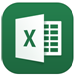

# Capacidades de administración de dispositivos móviles integrada para Office 365

Administración de dispositivos móviles para Office 365 puede ayudar a proteger y administrar dispositivos móviles como iPhone, iPad, Androids y teléfonos de Windows utilizado por los usuarios con licencia de Office 365 en su organización. Puede crear directivas de administración de dispositivos móviles con la configuración que puede ayudar a controlar el acceso a correo electrónico de Office 365 de su organización y documentos para aplicaciones y dispositivos móviles compatibles. Si un dispositivo está perdido o robado, puede borrado el dispositivo para quitar información confidencial de la organización.
    
¿Necesita más funcionalidad que se incluye en MDM para Office 365? Vea si Microsoft Intune tiene lo que necesita: [Elija entre MDM para Office 365 y Microsoft Intune](choose-between-mdm-and-intune.md).
  
## Dispositivos admitidos

Puede usar MDM para Office 365 para proteger y administrar los siguientes tipos de dispositivos.
  
- Windows Phone 8.1 +
    
- iOS 7.1 o versiones posteriores
    
- Android 4 o versiones posteriores
    
- Windows 8.1\*
    
- Windows 8.1 RT\*
    
- 10 de Windows\*\*
    
- Windows 10 Mobile\*\*
    
\*Control de acceso para los dispositivos de Windows 8.1 y Windows 8.1 RT está limitada a Exchange ActiveSync.
  
\*\*Requiere el dispositivo para unirse a Azure Active Directory y se inscriben en el servicio de administración de dispositivos móviles de la organización.
  
Si las personas de su organización usar dispositivos móviles que no son compatibles con la administración de dispositivos móviles para Office 365, es posible que desee bloquear el acceso de la aplicación de Exchange ActiveSync para correo electrónico de Office 365 para esos dispositivos, para ayudar a proteger los datos de la organización. Los pasos para bloquear Exchange ActiveSync: vea [Administrar la configuración de acceso de dispositivo](manage-device-access-settings.md).
  
## Control de acceso para los documentos y el correo electrónico de Office 365

Las aplicaciones compatibles para los diferentes tipos de dispositivos móviles en la tabla siguiente le pedirá a los usuarios inscribirse en MDM para Office 365 donde hay una nueva directiva de administración de dispositivo móvil que se aplica a un dispositivo del usuario y el usuario no ha inscrito previamente el dispositivo. Si el dispositivo del usuario no cumple con una directiva, dependiendo de cómo establecer la directiva de, se podría bloquear un usuario pueda tener acceso a recursos de Office 365 en estas aplicaciones, o es posible que tienen acceso pero Office 365 informará una infracción de la directiva.
  
||**Windows Phone 8.1 +**|**iOS 7.1 +**|**Android 4+**|
|:-----|:-----|:-----|:-----|
|**Exchange**   Exchange ActiveSync incluye integrado de correo y las aplicaciones de terceros, como informativos, que utilizan Exchange ActiveSync versión 14,1 o posterior.    |Exchange ActiveSync    Correo de Exchange    |Exchange ActiveSync    Correo    |Exchange ActiveSync    Correo electrónico    |
|**Office** y **OneDrive para la Empresa**   |Aplicaciones no admitidas    |Outlook    OneDrive    Word    Excel    PowerPoint    |**En teléfonos y tablets:**   Outlook    OneDrive    Word    Excel    PowerPoint    **Solamente en teléfonos:**   Office Mobile    |
   
> [!NOTE]
>  Compatibilidad con iOS 7.1 y versiones posteriores incluye dispositivos iPhone y iPad. > Administración de dispositivos BlackBerry no es compatible con administración de dispositivos móviles para Office 365. Usar BlackBerry Business Cloud Services (BBCS) de BlackBerry para administrar los dispositivos BlackBerry. > No se pedirá a los usuarios inscribirse y que no se bloquee o notificando infracción de la directiva si usan el explorador móvil para tener acceso a sitios de SharePoint de Office 365, documentos en Office Online, o el correo electrónico en Outlook Web App. 
  
El siguiente diagrama muestra lo que sucede cuando un usuario con un nuevo dispositivo inicia sesión en una aplicación que es compatible con control de acceso con MDM para Office 365. El usuario está bloqueado el acceso a recursos de Office 365 en la aplicación hasta que inscribirse en su dispositivo.
  

  
> [!NOTE]
> Directivas y reglas de acceso creadas en MDM para Office 365 invalidará las directivas de buzón de correo de dispositivos móviles de Exchange ActiveSync y las reglas de acceso de dispositivo creado en el centro de administración de Exchange. Después de que un dispositivo está inscrito en MDM para Office 365, cualquier directiva de buzón de Exchange ActiveSync dispositivo móvil o se omitirá la regla de acceso de dispositivo aplicado para el dispositivo. Para obtener más información acerca de Exchange ActiveSync, consulte [Exchange ActiveSync en Exchange Online](https://go.microsoft.com/fwlink/p/?LinkId=524380). 
  
## Configuración de directivas para dispositivos móviles

Si crea una directiva para bloquear el acceso con determinadas opciones de activado, se bloqueará a los usuarios tengan acceso a recursos de Office 365 cuando se usa una aplicación compatible que aparece en el [control de acceso para los documentos y correo electrónico de Office 365](#access-control-for-office-365-email-and-documents). La configuración que puede impedir que los usuarios obtener acceso a recursos de Office 365 se encuentran en estas secciones:
  
- Seguridad
    
- Cifrado
    
- Liberación
    
- Perfil de correo electrónico administrado
    
Por ejemplo, el siguiente diagrama muestra lo que sucede cuando un usuario con un dispositivo inscrito no es compatible con una configuración de seguridad de una directiva de administración de dispositivo móvil que se aplica a su dispositivo. El usuario inicia sesión una aplicación que es compatible con control de acceso con MDM para Office 365. Se impide obtener acceso a recursos de Office 365 en la aplicación hasta que su dispositivo cumple con la configuración de seguridad.
  

  
Las secciones siguientes muestran la configuración de directiva que puede usar para ayudar a proteger y administrar los dispositivos móviles que se conectan a recursos de Office 365 de su organización. 
  
### Configuración de seguridad

|**Nombre de la opción**|**Windows Phone 8.1 +**|**iOS 7.1 +**|**Android 4+**|**Samsung Knox**|
|:-----|:-----|:-----|:-----|:-----|
|Requerir contraseña    |✔    |✔    |✔    |✔    |
|Evitar contraseña sencilla    |✔    |✔    |✖    |✖    |
|Exigir una contraseña alfanumérica    |✔    |✔    |✖    |✖    |
|Longitud mínima de la contraseña    |✔    |✔    |✔    |✔    |
|Número de errores de inicio de sesión antes de que se eliminen datos del dispositivo    |✔    |✔    |✔    |✔    |
|Minutos de inactividad antes de que se bloquee el dispositivo    |✔    |✔    |✔    |✔    |
|Expiración de contraseña (días)    |✔    |✔    |✔    |✔    |
|Recordar el historial de contraseñas y evitar la reutilización    |✔    |✔    |✔    |✔    |
   
### Configuración de cifrado

|**Nombre de la opción**|**Windows Phone 8.1 +**|**iOS 7.1 +**|**Android 4+**|**Samsung Knox**|
|:-----|:-----|:-----|:-----|:-----|
|Requerir cifrado de datos en los dispositivos    |Windows Phone 8.1 ya está cifrado y no se puede descifrar    |✖    |✔    |✔\*    |
   
\*Con Samsung Knox, también puede requerir cifrado en tarjetas de almacenamiento.
  
### Configuración de liberación

|**Nombre de la opción**|**Windows Phone 8.1 +**|**iOS 7.1 +**|**Android 4+**|**Samsung Knox**|
|:-----|:-----|:-----|:-----|:-----|
|El dispositivo no puede liberarse ni tener acceso raíz    |✖    |✔    |✔    |✔    |
   
### Opción de perfil de correo electrónico administrado

La siguiente opción puede impedir que los usuarios obtener acceso a su correo electrónico de Office 365, si está usando un perfil de correo electrónico creada manualmente. Los usuarios de dispositivos iOS deben eliminar su perfil de correo electrónico creada manualmente antes de tener acceso a su correo electrónico. Después de eliminar el perfil, se creará automáticamente un nuevo perfil en el dispositivo.
  
|**Nombre de la opción**|**Windows Phone 8.1 +**|**iOS 7.1 +**|**Android 4+**|**Samsung Knox**|
|:-----|:-----|:-----|:-----|:-----|
|El perfil de correo electrónico es administrado    |✖    |✔    |✖    |✖    |
   
### Configuración de nube

|**Nombre de la opción**|**Windows Phone 8.1 +**|**iOS 7.1 +**|**Android 4+**|**Samsung Knox**|
|:-----|:-----|:-----|:-----|:-----|
|Requerir copia de seguridad cifrada    |✖    |✔    |✖    |✖    |
|Bloquear copia de seguridad de la nube    |✖    |✔    |✖    |✖    |
|Bloquear sincronización de documentos    |✖    |✔    |✖    |✖    |
|Bloquear sincronización de fotos    |✖    |✔    |✖    |✖    |
|Permitir la copia de seguridad de Google    |N/D    |N/D    |✖    |✔    |
|Permitir la sincronización automática de cuenta de Google    |N/D    |N/D    |✖    |✔    |
   
### Configuración del sistema

|**Nombre de la opción**|**Windows Phone 8.1 +**|**iOS 7.1 +**|**Android 4+**|**Samsung Knox**|
|:-----|:-----|:-----|:-----|:-----|
|Bloquear captura de pantalla    |✔    |✔    |✖    |✔    |
|Bloquear el envío de datos de diagnóstico de dispositivos    |✔    |✔    |✖    |✔    |
   
### Configuración de aplicaciones

|**Nombre de la opción**|**Windows Phone 8.1 +**|**iOS 7.1 +**|**Android 4+**|**Samsung Knox**|
|:-----|:-----|:-----|:-----|:-----|
|Bloquear las videoconferencias en el dispositivo    |✖    |✔    |✖    |✖    |
|Bloquear el acceso a la tienda de aplicaciones    |✔    |✔    |✖    |✔    |
|Requerir contraseña al acceder a la tienda de aplicaciones    |✖    |✔    |✖    |✖    |
   
### Configuración de las funcionalidades del dispositivo

|**Nombre de la opción**|**Windows Phone 8.1 +**|**iOS 7.1 +**|**Android 4+**|**Samsung Knox**|
|:-----|:-----|:-----|:-----|:-----|
|Bloquear conexión con almacenamiento extraíble    |✔    |✖    |✖    |✔    |
|Bloquear conexión Bluetooth    |✔    |✖    |✖    |✔    |
   
### Opciones adicionales

Puede establecer la siguiente configuración de directiva adicionales mediante el uso de los cmdlets de PowerShell. Para obtener más información, vea [Office 365 seguridad &amp; centro de cumplimiento cmdlets](https://go.microsoft.com/fwlink/p/?LinkId=827804).
  
|**Nombre de la opción**|**Windows Phone 8.1 +**|**iOS 7.1 +**|**Android 4 + (incluido a Samsung Knox)**|
|:-----|:-----|:-----|:-----|
|CameraEnabled    |✔    |✔    |✔    |
|RegionRatings    |✖    |✔    |✖    |
|MoviesRatings    |✖    |✔    |✖    |
|TVShowsRating    |✖    |✔    |✖    |
|AppsRatings    |✖    |✔    |✖    |
|AllowVoiceDialing    |✖    |✔    |✖    |
|AllowVoiceAssistant    |✖    |✔    |✖    |
|AllowAssistantWhileLocked    |✖    |✔    |✖    |
|AllowPassbookWhileLocked    |✖    |✔    |✖    |
|MaxPasswordGracePeriod    |✖    |✔    |✖    |
|PasswordQuality    |✖    |✖    |✔    |
|SystemSecurityTLS    |✖    |✔    |✖    |
|WLANEnabled    |✔    |✖    |✖    |
   
### Configuración compatibles con Windows

Puede administrar los dispositivos de Windows 8.1 y 10 de Windows al inscribirse a ellos como dispositivos móviles. Una vez se haya implementado una directiva aplicable, los usuarios con los dispositivos de Windows 8.1 RT y Windows 10 RT se necesitará para inscribirse en MDM para Office 365 la primera vez que usen la aplicación de correo electrónico integrada para tener acceso a su correo electrónico de Office 365. 
  
Se admiten las siguientes opciones para dispositivos Windows 8.1 y 10 de Windows que están inscritos como dispositivos móviles. Estos valores de configuración no impida que los usuarios tengan acceso a recursos de Office 365.
  
 **Configuración de seguridad**
  
- Exigir una contraseña alfanumérica
    
- Longitud mínima de la contraseña
    
- Número de errores de inicio de sesión antes de que se eliminen datos del dispositivo
    
- Minutos de inactividad antes de que se bloquee el dispositivo
    
- Expiración de contraseña (días)
    
- Recordar el historial de contraseñas y evitar la reutilización
    
 **Configuración del sistema**
  
Bloquear el envío de datos de diagnóstico de dispositivos
  
 **Configuración adicional**
  
Puede establecer las siguientes opciones de directiva adicionales usando cmdlets de PowerShell:
  
- AllowConvenienceLogon
    
- UserAccountControlStatus
    
- FirewallStatus
    
- AutoUpdateStatus
    
- AntiVirusStatus
    
- AntiVirusSignatureStatus
    
- SmartScreenEnabled
    
- WorkFoldersSyncUrl
    
## Borrar de forma remota un dispositivo móvil

 Si un dispositivo está perdido o robado, puede quitar datos confidenciales de la organización y ayudar a impedir el acceso a recursos de Office 365 de su organización siguiendo un borrado de seguridad ** &amp; centro de cumplimiento\>prevención de pérdida de datos\>dispositivo administración de**. Se puede realizar un borrado selectivo para quitar sólo datos de la organización o un borrado completo para eliminar toda la información desde un dispositivo y restaurar a su configuración de fábrica.
  
Para obtener más información, consulte [Borrar un dispositivo móvil en Office 365](https://go.microsoft.com/fwlink/p/?LinkId=518157).
  
## Vea también

[Introducción a la administración de dispositivos móviles para Office 365](overview-of-mdm.md)
  
[Crear e implementar directivas de seguridad de dispositivos](create-device-security-policies.md)

