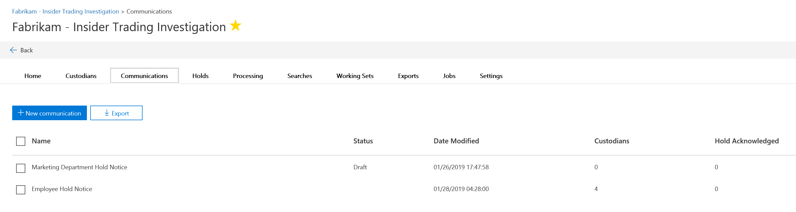

# Crear un aviso de suspensión legal

Mediante el uso de comunicaciones por custodios de eDiscovery avanzado (versión preliminar), las organizaciones pueden administrar su flujo de trabajo a partir de la comunicación con los custodios. Mediante la herramienta de comunicaciones, los equipos legales pueden enviar, recopilar y realizar un seguimiento sistemático de las notificaciones de retención legal. El proceso de creación flexible también permite a Microsoft Teams personalizar el flujo de trabajo de notificaciones de retención y el contenido de los avisos que se envían a los custodios. 

En el artículo se describen los pasos del flujo de trabajo de la notificación de retención.

## Paso 1: especificar detalles de comunicación

El primer paso es especificar los detalles adecuados para los avisos de suspensión legal u otras comunicaciones de custodios. 

1. En el centro de seguridad & cumplimiento, vaya a **eDiscovery _GT_ Advanced eDiscovery (versión preliminar)** para mostrar la lista de casos de su organización.
   
2. Haga clic en la pestaña **comunicaciones** y, a continuación, en **nueva comunicación**.
   
3. En la página **comunicación de nombre** , especifique los siguientes detalles de comunicación (obligatorios).

    - **Name**: nombre de la comunicación.
    
    - **Responsable**de la emisión: la lista desplegable muestra una lista de los miembros de caso. Cada aviso que se envíe a los custodios se enviará en nombre del responsable de la expedición especificado.

4. Haga clic en **Siguiente**.

## Paso 2: definir el contenido del portal

A continuación, puede crear y agregar el contenido del aviso de suspensión. En la página **definir contenido del portal** del Asistente para **crear una comunicación** , especifique el contenido del aviso de retención. Este contenido se anexará automáticamente a los avisos de emisión, reEmisión, aviso y reAsignación de responsabilidades. Además, este contenido aparecerá en el portal de cumplimiento de la custodio. 

Para crear el contenido del portal:

1. Escriba (o corte y pegue desde otro documento) el aviso de suspensión en el cuadro de texto para el contenido del portal. 

2. Inserte las variables de combinación en el aviso para personalizar el aviso y compartir el portal de cumplimiento de custodios.

3. Haga clic en **Siguiente**.

  >[!Tip]
  >Para obtener más información acerca de cómo puede personalizar el contenido y el formato del contenido del portal, consulte [use el editor de comunicaciones](using-communications-editor.md).

## Paso 3: establecer las notificaciones necesarias

Una vez que haya definido el contenido del aviso de retención, puede configurar los flujos de trabajo para enviar y administrar el proceso de notificación. Las notificaciones son mensajes de correo electrónico que se envían a notificar y realizar un seguimiento con custodios. Todos los custodios que se agreguen a la comunicación recibirán la misma notificación. 

Para configurar y enviar un aviso de retención, debe incluir notificaciones de emisión, reEmisión y publicación.

### Notificación de emisión 

Una vez creada la comunicación, la **notificación de emisión** la inicia el responsable de la emisión especificado. La notificación de emisión es la primera comunicación que se envía al custodio para informarles sobre sus obligaciones de conservación. 

Para crear una notificación de emisión:

1. En el icono **emisión** , haga clic en **Editar**.
   
2. Si es necesario, agregue miembros del caso o personal adicional a los campos **CC** y **CCO** . Para agregar varios usuarios a estos campos, separe las direcciones de correo electrónico con un punto y coma.
   
3. Especifique el **asunto** del aviso (obligatorio).
   
4. Especifique el contenido o las instrucciones adicionales que desearía proporcionar al custodio (obligatorio). Tenga en cuenta que el contenido del portal que definió en el paso 2 se agrega al final del aviso de emisión. 
   
5. Haga clic en **Guardar** 

### Notificación de nueva emisión 

A medida que avanza el caso, es posible que se necesiten custodios para conservar más o menos datos de los que se indicó anteriormente. Después de actualizar el contenido del aviso de retención, la notificación de reemisión alerta a los custodios sobre los cambios en sus obligaciones de conservación.

Para crear una notificación de nueva emisión: 

1. En el **** icono de reemisión, haga clic en **Editar**.
   
2. Si es necesario, agregue miembros del caso o personal adicional a los campos **CC** y **CCO** . Para agregar varios usuarios a estos campos, separe las direcciones de correo electrónico con un punto y coma.
   
3. Especifique el **asunto** del aviso (obligatorio).
   
4. Especifique el contenido o las instrucciones adicionales que desearía proporcionar al custodio (obligatorio). Tenga en cuenta que el contenido del portal que definió en el paso 2 se agrega al final del aviso de reemisión.
   
5. Haga clic en **Guardar **.

>[!Note]
>Si se modifica una notificación de retención, se enviará automáticamente la notificación de reemisión a todos los custodios asignados a la notificación. Una vez enviada la notificación, se pedirá a los custodios que vuelvan a confirmar su aviso de suspensión. Si ha configurado un flujo de trabajo de aviso o de escalado, también se reiniciará. 

### Notificación de versiones

Después de resolver una cuestión o si un custodio ya no está sujeto a preservar contenido, puede liberar el custodio de un caso. Si el custodio ha emitido previamente un aviso de retención, la notificación de versión puede usarse para avisar a los custodios de que han sido entregados desde sus obligaciones.

Para crear una notificación de versión: 

1. En el mosaico de **versión** , haga clic en **Editar**.
   
2. Si es necesario, agregue miembros del caso o personal adicional a los campos **CC** y **CCO** . Para agregar varios usuarios a estos campos, separe las direcciones de correo electrónico con un punto y coma.
   
3. Especifique el **asunto** del aviso (obligatorio).
   
4. Especifique el contenido o las instrucciones adicionales que desearía proporcionar al custodio (obligatorio).
   
5. Haga clic en **Guardar** y vaya al paso siguiente. 

## Opcional Paso 4: establecer las notificaciones opcionales

De manera opcional, puede simplificar el flujo de trabajo para seguir con los administradores que no responden mediante la creación y programación de notificaciones automatizadas de reaviso y reasignación de incidencias.

### Avisos

Después de enviar una notificación de retención, puede realizar un seguimiento de los administradores que no responden mediante la definición de un flujo de trabajo de aviso. 

Para programar los avisos:

1. En el icono de **aviso** , haga clic en **Editar**.
   
2. Habilite el flujo de trabajo de **aviso** activando el **Estado** de alternancia (obligatorio).
   
3. Especifique el **intervalo de aviso (en días)** (obligatorio). Es el número de días que se debe esperar antes de enviar las notificaciones de aviso de primer y seguimiento. Por ejemplo, si establece el intervalo de recordatorio en 7 días, el primer aviso se enviaría 7 días después de la emisión inicial de la notificación de retención. Todos los avisos subsiguientes se enviarán también cada 7 días.
   
4. Especifique el **número de avisos** (obligatorios). Este campo especifica cuántos avisos enviar a los custodios que no responden. Por ejemplo, si establece el número de avisos en 3, un custodio recibirá un máximo de 3 avisos. Una vez que un custodio reconoce la notificación de retención, ya no se enviarán avisos a ese usuario.
   
5. Especifique el **asunto** del aviso (obligatorio). 
   
6. Especifique el contenido o las instrucciones adicionales que desearía proporcionar al custodio (obligatorio). Tenga en cuenta que el contenido del portal que definió en el paso 2 se agrega al final de la notificación de aviso.
   
7. Haga clic en **Guardar** y continúe con el paso siguiente.

### Escalaciones 

En algunas situaciones, es posible que necesite otras formas de realizar un seguimiento de los administradores que no responden. Si un custodio no reconoce una notificación de retención después de recibir el número especificado de avisos, el equipo legal puede especificar un flujo de trabajo para enviar automáticamente un aviso de escalado al custodio y a su administrador.

Para programar las escalaciones:

1. En el **** mosaico escalado, haga clic en **Editar**.
   
2. Habilite el **** flujo de trabajo de escalado activando el **Estado** de alternancia.
   
3. Especifique el **intervalo de escalación (en días)** (obligatorio). 
   
4. Especifique el **número de escalaciones** (obligatorio). Este campo especifica cuántas escalaciones se deben enviar a los custodios que no responden. Por ejemplo, si establece el número de escalaciones en 3, se enviará un aviso de remisión a la custodio y a su administrador un máximo de 3 veces. Después de que un custodio reconozca la notificación de retención, las escalaciones ya no se enviarán. 
   
5. Especifique el **asunto** del aviso (obligatorio). 
   
6. Especifique el contenido o las instrucciones adicionales que desearía proporcionar al custodio (obligatorio). Tenga en cuenta que el contenido del portal que definió en el paso 2 se agrega al final de la notificación de escalamiento.
   
7. Haga clic en **Guardar** y continúe con el paso siguiente.
   
## Paso 5: asignar custodios 

Una vez que haya finalizado el contenido de las notificaciones, seleccione los custodios a los que desea enviar las notificaciones. 

Para agregar custodios:

1. Asigne custodios a la comunicación haciendo clic en la casilla situada junto a su nombre.

    Una vez creada la comunicación, el flujo de trabajo de notificaciones se aplicará automáticamente a los custodios seleccionados.
   
2. Haga clic en **siguiente** para revisar la configuración y los detalles de comunicación.
 
>[!NOTE]
>Solo se pueden agregar custodios que se hayan agregado al caso y que no se haya enviado otra notificación en el caso.

## Paso 6: revisar la configuración

Después de revisar la configuración y hacer clic en **Enviar** para completar la comunicación, el sistema iniciará automáticamente el flujo de trabajo de comunicación enviando el aviso de emisión.
