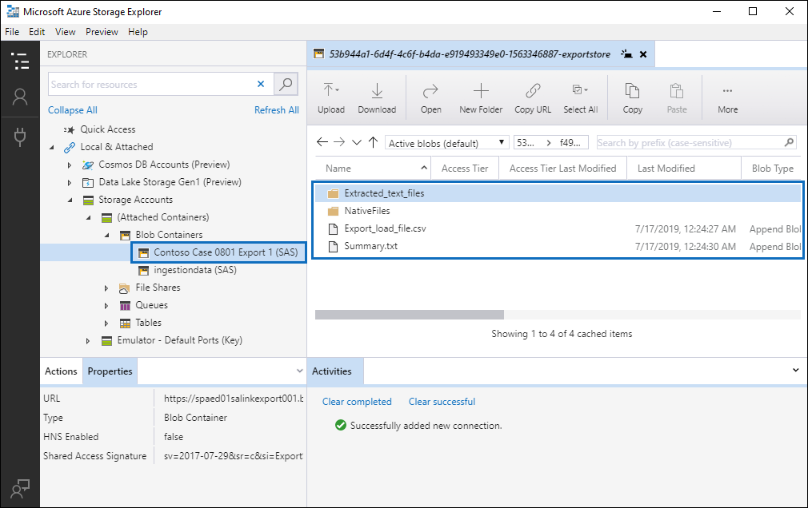

# Descargar trabajos de exportación

Al exportar documentos de un conjunto de revisión en un caso de exhibición avanzada de documentos electrónicos, los documentos se cargan en una ubicación de almacenamiento de Azure proporcionada por Microsoft o en una ubicación de almacenamiento de Azure administrada por la organización. El tipo de ubicación de almacenamiento de Azure que se usa depende de la opción seleccionada al exportar los documentos. 

En este artículo se proporcionan instrucciones sobre cómo usar el explorador de almacenamiento de Microsoft Azure para conectarse a una ubicación de almacenamiento de Azure para examinar y descargar los documentos exportados. Para obtener más información sobre el explorador de almacenamiento de Azure, consulte [QuickStart: Use Azure Storage Explorer](https://docs.microsoft.com/en-us/azure/storage/blobs/storage-quickstart-blobs-storage-explorer).

## Paso 1: instalar el explorador de almacenamiento de Azure

El primer paso es descargar e instalar el explorador de almacenamiento de Azure. Para obtener instrucciones, consulte [Azure Storage Explorer Tool](https://go.microsoft.com/fwlink/p/?LinkId=544842). Use esta herramienta para conectarse y descargar los documentos exportados en el paso 3.

## Paso 2: obtener la dirección URL de SAS del trabajo de exportación

El siguiente paso es obtener la dirección URL de la firma de acceso compartido (SAS) que se genera al crear el trabajo de exportación para [exportar documentos de un conjunto de revisión](export-documents-from-review-set.md). Puede copiar la dirección URL de SAS para los documentos que se cargan en una ubicación de almacenamiento de Azure proporcionada por Microsoft o en una ubicación de almacenamiento de Azure administrada por la organización. En cualquier caso, use la dirección URL de SAS para conectarse a la ubicación de almacenamiento de Azure en el paso 3.

1. En la página **exhibición avanzada** de documentos electrónicos, vaya al caso y, a continuación, haga clic en la pestaña **exportaciones** .

2. En la pestaña **exportaciones** , haga clic en el trabajo de exportación que desea descargar.

3. En la página de flotante, en **ubicaciones**, copie la dirección URL de SAS que se muestra. Si es necesario, puede guardarlo en un archivo para poder tener acceso a él en el paso 3.
 
   

## Paso 3: conectarse a la ubicación de almacenamiento de Azure

El último paso consiste en usar el explorador de almacenamiento de Azure y la dirección URL de SAS para conectarse a la ubicación de almacenamiento de Azure y descargar los documentos que exportó a un equipo local.

1.  Abra el explorador de Azure Storage que instaló en el paso 1.

2. Haga clic en el icono **Agregar cuenta** . Como alternativa, puede hacer clic con el botón secundario en **cuentas de almacenamiento**.

   

3.  En la página **conectar con el almacenamiento de Azure** , haga clic en **usar un URI de firma de acceso compartido (SAS)** y, a continuación, haga clic en **siguiente**.

    

4.  En la página adjuntar **con URI de SAS** , haga clic en el cuadro URI y, a continuación, pegue la dirección URL de SAS que obtuvo en el paso 2. 

    

    Observe que una parte de la dirección URL de SAS se muestra en el cuadro **nombre para mostrar** . Se usará como el nombre para mostrar del contenedor que se crea en las cuentas de **almacenamiento** después de conectarse a la ubicación de almacenamiento. Este nombre consta del identificador del caso de eDiscovery avanzado y un identificador único. Puede conservar el nombre para mostrar predeterminado o cambiarlo. Si lo cambia, el nombre para mostrar debe ser único.

5.  Haga clic en **Siguiente**.

    Se muestra la página de **Resumen de conexión** .
   
    

6. En la página **Resumen de conexión** , revise la información de conexión y, a continuación, haga clic en **conectar**. 

    Se abre el nodo **contenedores** de blobs (en **cuentas** > de almacenamiento **(contenedores adjuntos)** \> . 

    

    Contiene un contenedor denominado con el nombre para mostrar del paso 4. Este contenedor contiene una carpeta para cada trabajo de exportación que haya creado. A estas carpetas se les asigna un identificador que corresponde al identificador del trabajo de exportación. Puede encontrar estos identificadores de exportación (y el nombre de la exportación) en **información de soporte técnico** en la página de control flotante para cada trabajo **de preparación de datos para exportar** que aparecen en la ficha **trabajos** .

7. Haga doble clic en la carpeta exportar trabajo para abrirla.

   Se muestra una lista de carpetas y los informes de exportación.
   
    

   La carpeta exportar trabajo contiene los siguientes elementos. Los elementos reales de la carpeta de exportación se determinan mediante las opciones de exportación configuradas cuando se creó el trabajo de exportación. Para obtener más información, vea [exportar documentos de un conjunto de revisión](export-documents-from-review-set.md).

    - Export_load_file. csv: este archivo CSV es un informe de exportación detallado que contiene información sobre cada documento exportado. El archivo consta de una columna para cada propiedad de metadatos de un documento. Para obtener una lista y una descripción de los metadatos que se incluyen en este informe, consulte la columna **nombre de campo** exportados en la tabla en campos de metadatos del [documento en eDiscovery avanzado](document-metadata-fields.md).
    
    - Summary. txt: un archivo de texto que contiene un resumen de la exportación, incluidas las estadísticas de exportación.
    
    - Extracted_text_files: esta carpeta contiene una versión de archivo de texto de cada documento exportado.
     
    - NativeFiles: esta carpeta contiene una versión de archivo nativa de cada documento exportado.
    
    - Error_files: esta carpeta incluye los siguientes elementos cuando el trabajo de exportación contiene archivos de error: 
        
      - ExtractionError. csv: este archivo CSV contiene los metadatos disponibles para los archivos que no se han extraído correctamente del elemento primario.
        
      - ProcessingError: esta carpeta contiene los documentos con errores de procesamiento. Este contenido se encuentra en un nivel de elemento, lo que significa que si un archivo adjunto presenta un error de procesamiento, el documento que contiene los datos adjuntos también se incluirá en esta carpeta.
 
8. Para exportar todo el contenido de la exportación, seleccione la carpeta exportar y, a continuación, haga clic en **Descargar**.

9. Especifique la ubicación en la que desea descargar los archivos exportados y, a continuación, haga clic en Seleccionar carpeta.

    El explorador de almacenamiento de Azure inicia el proceso de exportación. El estado de la descarga de los elementos exportados se muestra en el panel **actividades** . Se muestra un mensaje cuando la descarga ha finalizado.

    

> [!NOTE]
> En lugar de descargar todo el trabajo de exportación, puede seleccionar elementos específicos para descargarlos. En lugar de descargar elementos, puede hacer doble clic en un elemento para verlo.