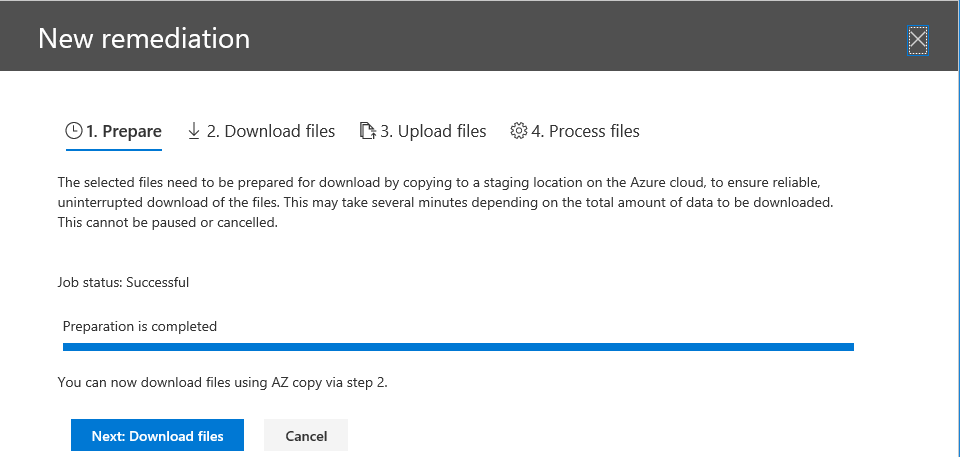
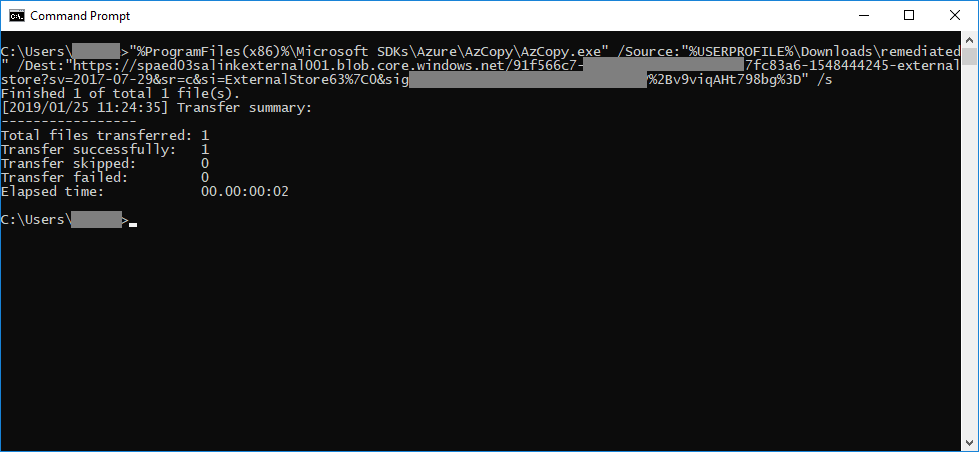

# Corrección de errores al procesar los datos

La corrección de errores permite que los administradores de eDiscovery puedan rectificar problemas de datos que impiden que eDiscovery avanzado procese correctamente el contenido. Por ejemplo, no se pueden procesar archivos protegidos con contraseña, ya que los archivos están bloqueados o cifrados. Mediante la corrección de errores, los administradores de eDiscovery pueden descargar archivos con estos errores, quitar la protección con contraseña y, a continuación, cargar los archivos corregidos.

Use el siguiente flujo de trabajo para corregir los archivos con errores en casos de exhibición avanzada de documentos electrónicos.

## Crear una sesión de corrección de errores para corregir los archivos con errores de procesamiento

>[!NOTE]
>Si el Asistente para la corrección de errores se cierra en cualquier momento durante el siguiente procedimiento, puede volver a la sesión de corrección de errores desde **** la pestaña procesando; para ello, seleccione **corrección de errores** en el menú desplegable **Ver** .

1. En la pestaña **procesamiento** en un caso de exhibición avanzada de documentos electrónicos, seleccione **errores** en el menú desplegable **Ver** .

2. Seleccione los errores que desea corregir haciendo clic en el botón de opción situado junto a tipo de error o tipo de archivo.  En el siguiente ejemplo, estamos corrigiendo un archivo protegido con contraseña.

3. Haga clic en **nueva corrección de errores**.

    

    La sesión de corrección de errores se inicia con una etapa de preparación en la que los archivos con errores se copian en una ubicación de almacenamiento de Azure proporcionada por Microsoft para que pueda descargarlos en el equipo local para corregirlos.

    

4. Una vez completada la preparación, haga clic en **siguiente: descargar archivos** para continuar con la descarga.

    

5. Para descargar archivos, especifique la **ruta de destino de la descarga**. Se trata de una ruta de acceso en el equipo local en la que se ha descargado el archivo.  La ruta de acceso predeterminada,%USERPROFILE%\Downloads\errors, apunta a la carpeta descargas del usuario que ha iniciado sesión. Puede cambiar esta ruta de acceso si es necesario. Si lo cambia, le recomendamos que use una ruta de acceso de archivo local para obtener el mejor rendimiento. No use una ruta de acceso de red remota.

6. Copie el comando predefinido; para ello, haga clic en **copiar al**portapapeles. Inicie un símbolo del sistema de Windows, pegue el comando y, a continuación, presione **entrar**.  

    Los archivos se descargan.

    

    > [!NOTE]
    > Debe usar AzCopy v 8.1 para usar correctamente el comando que se proporciona en la página **descargar archivos** . También debe usar AzCopy v 8.1 para cargar los archivos en el paso 10 siguiente. Para instalar esta versión de AzCopy, consulte [transferir datos con AzCopy v 8.1 en Windows](https://docs.microsoft.com/previous-versions/azure/storage/storage-use-azcopy). Si el comando AzCopy proporcionado no se produce, consulte [solucionar problemas de azcopy en EDiscovery avanzado](troubleshooting-azcopy.md).

7. Después de descargar los archivos, puede corregirlos con una herramienta adecuada. Para archivos protegidos con contraseña, hay varias herramientas de averiguación de contraseñas que puede usar. Si conoce las contraseñas de los archivos, puede abrirlas y quitar la protección con contraseña.
    > [!NOTE]
    > Es importante que conserve la estructura de directorios y los nombres de archivo de los archivos corregidos. Los nombres de ruta de acceso de los archivos y carpetas descargados hacen posible asociar los archivos corregidos con los archivos originales.  Si se cambian la estructura de directorios o los nombres de archivo, recibirá el siguiente `Cannot apply Error Remediation to the current Workingset`error:.

8. Ahora, vuelva a eDiscovery avanzado y haga clic en **siguiente: cargar archivos**.  Se desplazará al siguiente paso en el que ahora puede cargar los archivos.

    

9. Especifique la ubicación de los archivos corregidos en el cuadro **de texto Ruta de acceso a la ubicación del archivo** y, a continuación, haga clic en **copiar al**portapapeles.

10. Pegue el comando en un símbolo del sistema de Windows y presione **entrar** para cargar los archivos.

    

11. Vuelva a eDiscovery avanzado y haga clic en **siguiente: procesar archivos**.

12. Cuando se complete el procesamiento. Puede volver al conjunto de revisiones y ver el archivo corregido.

## Qué sucede cuando se corrigen los archivos

Cuando se cargan los archivos corregidos, se conservan los metadatos originales excepto los campos siguientes: 

- ExtractedTextSize
- HasText
- IsErrorRemediate
- LoadId
- ProcessingErrorMessage
- ProcessingStatus
- Texto
- WordCount
- WorkingsetId

Para obtener una definición de todos los campos de metadatos en eDiscovery avanzado, consulte campos de metadatos del [documento](document-metadata-fields.md).
