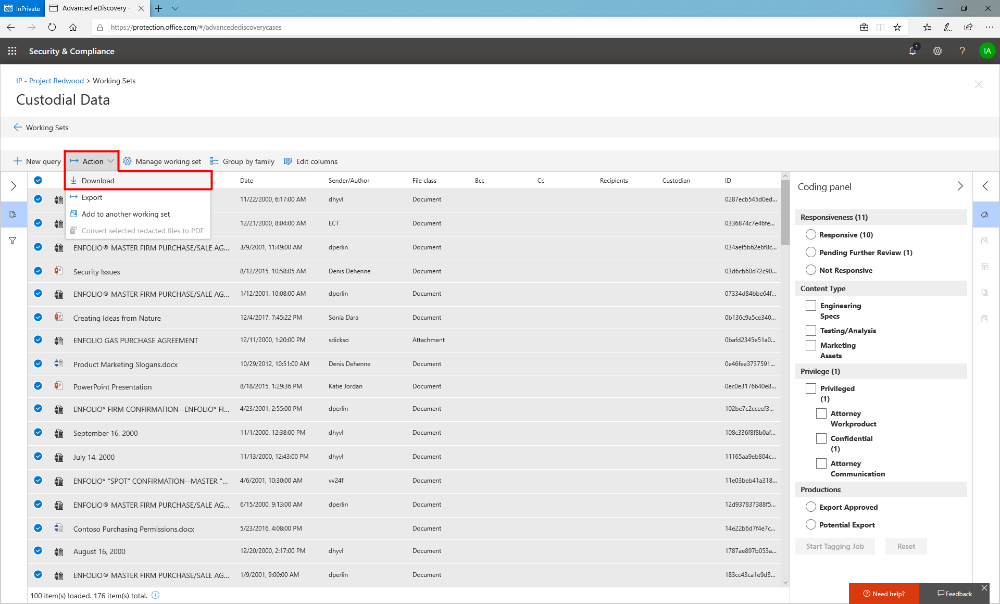

# Exportar documentos de un conjunto de revisiónExport documents from a review set

La exportación de contenido de un conjunto de revisión puede realizarse a través de tres métodos diferentes:Exporting content from a review set can be accomplished via 3 different methods:

## DescargarDownload

La descarga ofrece una forma sencilla de descargar contenido de un conjunto de revisión en formato nativo.Download offers a simple way to download content from a review set in Native format. Aprovecha las características de transferencia de datos del explorador para que aparezca un mensaje del explorador una vez que la descarga esté lista.It leverages the browser’s data transfer features so a browser prompt will appear once a download is ready. Los archivos descargados con este método se comprimen en un archivo contenedor y serán archivos de nivel de elemento.Files downloaded using this method will be zipped into a container file and will be item level files. Esto significa que, si selecciona un archivo adjunto, recibirá automáticamente el correo electrónico con los datos adjuntos incluidos.This means that if you select an attachment, you will automatically receive the email with the attachment included. De forma similar, si selecciona una hoja de cálculo de Excel que estaba incrustada en un documento de Word, recibirá el documento de Word con la hoja de cálculo de Excel incrustada.Similarly, if you select an excel spreadsheet that was embedded in a word document, you will receive the word document with the excel spreadsheet embedded. Los elementos descargados conservarán la fecha de la última modificación, que se puede ver como una propiedad de archivo.Downloaded items will preserve the last modified date which can be viewed as a file property.

Para descargar contenido de un conjunto de revisión, seleccione los archivos que desea descargar y, a continuación, seleccione "Descargar" en el menú acciones.To download content from a review set, start by selecting the files you want to download then select “Download” under the Actions menu.

## ExportarExport

La exportación permite a los usuarios personalizar el contenido que se incluye en el paquete de descarga.Export allows users to customize the content that is included in the download package. Proporciona una página de configuración con la siguiente configuración:It provides a configuration page with the following settings:

### Archivo de metadatosMetadata file

> Esto puede considerarse el "Cargar archivo" que contiene metadatos asociados con los archivos exportados.This can be considered your “load file” that contains metadata associated with the files you exported. Para obtener una lista de los campos disponibles en el archivo de \[metadatos, vea Link\].For a list of fields available in the metadata file, see \[link\]. Por lo general, este archivo puede ser incorporado por las herramientas de terceros de terceras partes.This file can typically be ingested by 3rd party tools downstream.

### Datos de etiquetaTag data

> Este contenido se agregaría como campos en el archivo de metadatos.This content would be added as fields in the metadata file. Contiene toda la información de etiqueta aplicada en los conjuntos de revisión.It contains all of the tag information applied in review sets.

### Archivos de textoText files

> Los archivos de texto se pueden generar para cada archivo exportado de un conjunto de revisión.Text files can be generated for each file exported from a review set. A menudo, los asociados de servicio necesitan estos archivos como parte de la recopilación de datos en herramientas de terceros de terceros.Often times these files are required by service partners as part of ingesting data into 3rd party tools downstream.

### Archivos censuradosRedacted files

> Si se generan documentos PDF censurados durante la revisión, estos archivos están disponibles durante la exportación.If redacted PDFs are generated during review, these files are available during export. Los usuarios pueden decidir si desea exportar solo los archivos nativos o reemplazar los nativos que tienen redacciones con el grabado en documentos PDF.Users can decide whether to export native files only or to replace natives that have redactions with the burned in PDFs.

### Ubicación de exportaciónExport Location

> El contenido exportado se entrega en un BLOB de Azure o el BLOB de un cliente de Microsoft se puede usar si los detalles se proporcionan en la exportación.Exported content is delivered to either a Microsoft provided Azure blob or a customer’s blob can be used if the details are provided at export.

## Exportar estructuraExport Structure

Cuando se exporta contenido desde un conjunto de revisión, el contenido se organiza en la estructura siguiente.When content is exported from a review set, the content is organized in the following structure.

  - Carpeta raíz: identificador de descargaRoot folder – Download ID
    
      - Exportar\_archivo\_de carga. csv = archivo de metadatosExport\_load\_file.csv = metadata file
    
      - Summary. txt = un archivo de resumen con las estadísticas de exportaciónSummary.txt = a summary file with export statistics
    
      - Archivos\_nativos\_o de entrada = contiene todos los archivos nativosInput\_or native\_files = contains all native files
    
      - Archivos\_de errores = contiene los archivos de error incluidos en la exportaciónError\_files = contains any error files included in the export
        
          - ExtractionError: un CSV que contiene los metadatos disponibles de los archivos que no se han extraído correctamente de los archivos principalesExtractionError – a csv that contains any available metadata of files that were not properly extracted from parent files
        
          - ProcessingError: contenido con errores de procesamiento.ProcessingError – content with processing errors. Este contenido es el significado del nivel de elemento si los datos adjuntos experimentan un error de procesamiento, el correo electrónico que contiene los datos adjuntos se incluirá en esta carpeta.This content is item level meaning if an attachment experienced a processing error, the email that contains the attachment will be included in this folder.
    
      - Archivos\_de\_texto extraídos = contiene todos los archivos de texto extraídos generados en el procesamiento.Extracted\_text\_files = contains all of the extracted text files generated at processing.

## conjunto de revisiónreview set

El contenido se puede Agregar a otro conjunto de revisión.Content can be added to another review set.