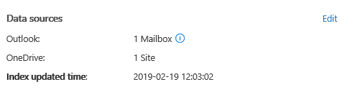

# Administrar los custodios en un caso de eDiscovery avanzado

La ficha custodios de eDiscovery avanzado contiene una lista de todos los custodios que se han agregado al caso. Después de agregar custodios a un caso, los detalles de cada custodio se recopilan automáticamente desde Azure Active Directory y se pueden ver en eDiscovery avanzado.

## Ver detalles del custodio

Para ver los detalles sobre un custodio, haga clic en el custodio en la lista **** de la ficha custodios. Se muestra una página de control flotante que contiene la siguiente información sobre el custodio:

- Información de contacto

  - **Nombre para mostrar** : nombre que se muestra en la libreta de direcciones del custodio. Suele ser la combinación del nombre del custodio, la inicial del segundo nombre y el apellido.
  
   - **Correo/SMTP** : la dirección SMTP principal para el custodio, por ejemplo, brianj@contoso.onmicrosoft.com. Tenga en cuenta que también se muestra el nombre principal del usuario (UPN) del custodio.

  - **Título** : el puesto del custodio.

  - **Department** : el nombre del Departamento en el que trabaja el custodio.

  - **Administrador** : el administrador del custodio. El administrador designado recibirá todas las comunicaciones de escalado para este custodio.
  
- Información de ubicación

  - **City** : la ciudad en la que se encuentra el custodio.

  - **State** -estado o provincia en la dirección del custodio.

  - **País/región** : el país o la región donde se encuentra el custodio.

  - **Oficina** : la ubicación de la oficina en el lugar de trabajo del custodio.

- Información del caso

  - **Estado de retención** : indica si el custodio se ha puesto en retención. 

  - **Estado de comunicación**: indica si el custodio ha emitido un aviso de retenciones. Si se ha emitido un aviso al custodio, se **publica**este valor de esta propiedad. Si no se ha emitido un aviso al custodio, el estado no se **publica**. 

  - **Estado** : el estado del custodio en el caso. Un estado de **activo** indica que el custodio forma parte del caso. Si se ha lanzado un custodio desde un caso, el estado cambia a **lanzado**. 

- Orígenes de datos e información de indización

    - **Orígenes de datos** : muestra el recuento y el tipo de orígenes de datos (buzones, sitios y equipos) que están asociados con el custodio y forman parte del caso.

    - **Tiempo de actualización de índice** : indica la hora y la fecha en que se activó por última vez el trabajo de indización avanzada. Esta propiedad también indicará cuándo está actualmente en curso el proceso de indización avanzada.

## Edición de un custodio

A medida que avanza el caso, es posible que descubra que puede haber orígenes de datos adicionales relacionados con un custodio específico & su caso. En otros escenarios, es posible que desee quitar determinados orígenes de datos que se han revisado y considerados como no relevantes.

Para actualizar los orígenes de datos asociados a un custodio:

1. Vaya a **eDiscovery _GT_ Advanced eDiscovery** y abra el caso.
  
2. Haga clic **** en la ficha custodios.
  
3. Seleccione un custodio de la lista y haga clic en **Editar** en la página de control flotante.

    
  
4. Haga clic en la pestaña **Elegir orígenes de datos** para cambiar la configuración de la cuenta de OneDrive y el buzón de Exchange del custodio, haga clic en **Elegir orígenes de datos**.
  
5. Haga clic en la pestaña **seleccionar orígenes de datos adicionales** para agregar o quitar los buzones de correo de Microsoft Teams, SharePoint o Exchange asociados con el custodio. 

    Para obtener más información acerca de los orígenes de datos asociados a un custodio, consulte "paso 3: asociar orígenes de datos adicionales a un custodio" en [Agregar custodios a un caso](add-custodians-to-case.md#step-3-associate-additional-data-sources-to-a-custodian). 
  
6. Haga clic en **realizar suspensiones de custodia** para habilitar o deshabilitar la retención para el custodio.

## Resolver errores de procesamiento de custodios

En la mayoría de los flujos de trabajo de eDiscovery para investigaciones legales, se busca un subconjunto de los datos de un custodio una vez que se agrega el custodio a un caso legal. Debido a los tamaños de archivo muy grandes o a posibles daños en los datos, algunos elementos de los orígenes de datos asociados con un custodio pueden indizarse parcialmente. Mediante el uso de la funcionalidad de [indización avanzada](indexing-custodian-data.md) en la exhibición avanzada de documentos electrónicos, la mayoría de los elementos indizados parcialmente pueden corregirse automáticamente mediante la reindización de estos elementos a petición.

Cuando se agrega un custodio a un caso, los datos ubicados en los orígenes de datos asociados con el custodio se vuelven a indexar automáticamente (mediante el proceso de indización avanzado). Esto significa que puede dejar los datos en el lugar en lugar de tener que descargarlos y corregirlos y, a continuación, buscar en ellos sin conexión). Sin embargo, durante el ciclo de vida de un caso legal, se pueden asociar nuevos orígenes de datos a un custodio. En este caso, debe volver a indizar los datos del custodio al volver a ejecutar el proceso de indización avanzado para corregir los elementos parcialmente indizados y actualizar el índice de los datos del custodio.

Para desencadenar el proceso de reindización para tratar los elementos parcialmente indizados:

1. Vaya a **eDiscovery _GT_ Advanced eDiscovery** y abra el caso.

2. Haga clic en la **ficha custodios**y, a continuación, seleccione una custodia cuyos datos se deban reindizar. 

3. En la página flotante, haga clic en **Actualizar índice**.

   Se muestra un cuadro de diálogo que indica que se ha creado el trabajo de índice.

La nueva indexación de los datos del custodio es un proceso de ejecución prolongada; el trabajo correspondiente que se crea se denomina **volver a indizar los datos del custodio**. Puede realizar un seguimiento del progreso en la ficha **trabajos** o en la ficha custodios mediante la supervisión del estado en la columna Estado de la **tarea de indización** . ****

Para obtener más información, vea:

- [Trabajar con errores de proceso](processing-data-for-case.md)

- [Administrar trabajos](managing-jobs-ediscovery20.md)

## Liberar un custodio de un caso

Un custodio se publica en situaciones en las que se cierra un caso, el custodio ya no está obligado a preservar el contenido de un caso, o cuando se considera que el custodio ya no es relevante para el caso. 

Si libera un custodio después de que se publique un aviso de retención, se enviará una notificación de publicación al custodio. Además, se quitan las suspensiones colocadas en los orígenes de datos asociados con el custodio. Si el custodio se puso en una *retención silenciosa*, donde no se emitieron notificaciones legales, no se enviará una notificación de la versión, pero se quitarán todas las suspensiones que se hayan colocado en orígenes de datos asociados con el custodio.

Para liberar un custodio: 

1. Vaya a **eDiscovery _GT_ Advanced eDiscovery** y abra el caso.

2.  Vaya a la **** pestaña custodios.

3.  Haga clic en la **ficha custodios**y, a continuación, seleccione el custodio que se está publicando desde el caso.

4. En la página flotante, haga clic en **liberar custodio**.

   Se muestra una página de advertencia que explica que si se coloca una retención en un origen de datos asociado al custodio, se quitará la retención y se seguirá aplicando cualquier otra retención asociada a un caso de exhibición avanzada de documentos electrónicos diferente. Esto incluye otros tipos de características de conservación y retención en Office 365 (como una directiva de retención de Office 365).

5. Haga clic en **sí** para confirmar que desea liberar el custodio. 

    Tenga en cuenta que el estado de este **** usuario en la pestaña de custodios está establecido en **lanzado** y el **Estado de conservación** en la página de control flotante se cambia a **false**. 

> [!NOTE]
> Un custodio puede estar involucrado de forma simultánea en varios casos legales. Cuando se publica un custodio desde un caso, las suspensiones y notificaciones en otros asuntos no se verán afectadas.

## Custodios de edición en masa

Puede usar el editor masivo para editar varios custodios a la vez. Para ello, seleccione dos o más custodios en la ficha **custodios** para mostrar el editor masivo y, a continuación, haga clic en una de las tareas.

