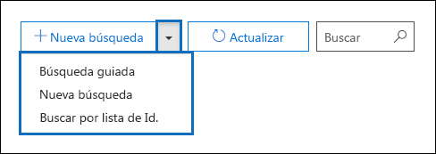
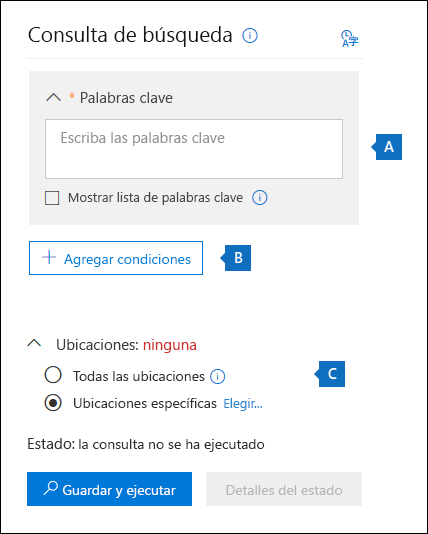
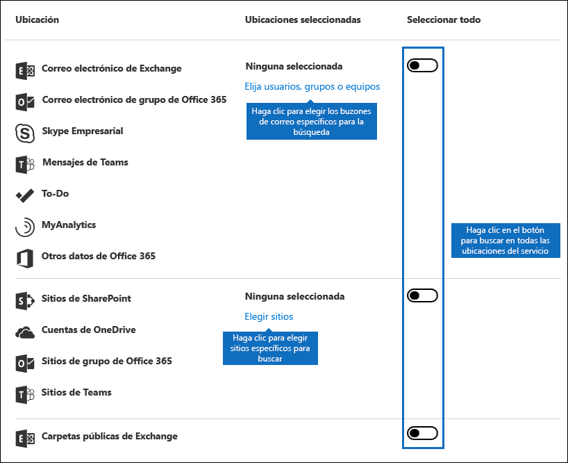
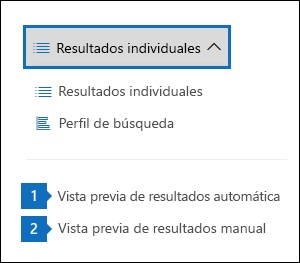
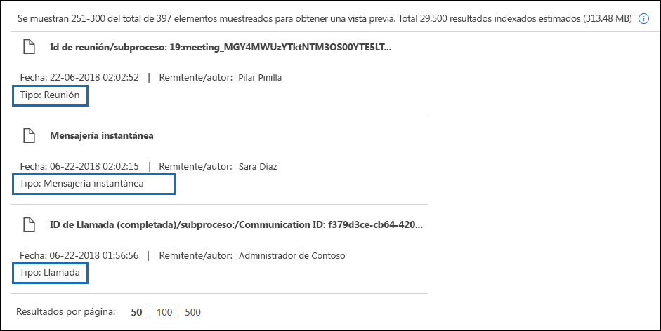
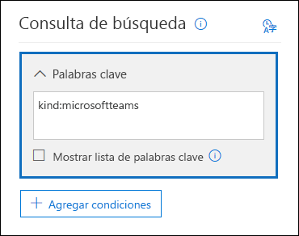
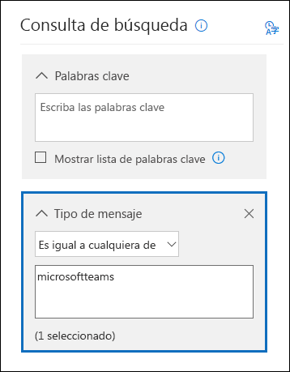

# <a name="content-search-in-office-365"></a><span data-ttu-id="cd7c5-106">Búsqueda de contenido en Office 365</span><span class="sxs-lookup"><span data-stu-id="cd7c5-106">Content Search in Office 365</span></span>

<span data-ttu-id="cd7c5-107">Puede usar la herramienta de búsqueda de contenido eDiscovery en el centro de cumplimiento de Office 365 o Microsoft 365 para buscar elementos locales como correo electrónico, documentos y conversaciones de mensajería instantánea en su organización de Office 365.</span><span class="sxs-lookup"><span data-stu-id="cd7c5-107">You can use the Content Search eDiscovery tool in the compliance center in Office 365 or Microsoft 365 to search for in-place items such as email, documents, and instant messaging conversations in your Office 365 organization.</span></span> <span data-ttu-id="cd7c5-108">Use esta herramienta para buscar elementos en estos servicios de Office 365:</span><span class="sxs-lookup"><span data-stu-id="cd7c5-108">Use this tool to search for items in these Office 365 services:</span></span>
  
- <span data-ttu-id="cd7c5-109">Buzones de correo y carpetas públicas de Exchange Online</span><span class="sxs-lookup"><span data-stu-id="cd7c5-109">Exchange Online mailboxes and public folders</span></span>
    
- <span data-ttu-id="cd7c5-110">Sitios de SharePoint Online y cuentas de OneDrive para la empresa</span><span class="sxs-lookup"><span data-stu-id="cd7c5-110">SharePoint Online sites and OneDrive for Business accounts</span></span>
    
- <span data-ttu-id="cd7c5-111">Conversaciones de Skype empresarial</span><span class="sxs-lookup"><span data-stu-id="cd7c5-111">Skype for Business conversations</span></span>
    
- <span data-ttu-id="cd7c5-112">Microsoft Teams</span><span class="sxs-lookup"><span data-stu-id="cd7c5-112">Microsoft Teams</span></span> 
    
- <span data-ttu-id="cd7c5-113">Grupos de Office 365</span><span class="sxs-lookup"><span data-stu-id="cd7c5-113">Office 365 Groups</span></span>
    
<span data-ttu-id="cd7c5-114">Después de ejecutar una búsqueda de contenido, el número de ubicaciones de contenido y el número estimado de resultados de la búsqueda se muestran en el perfil de búsqueda.</span><span class="sxs-lookup"><span data-stu-id="cd7c5-114">After you run a Content Search, the number of content locations and an estimated number of search results are displayed in the search profile.</span></span> <span data-ttu-id="cd7c5-115">También puede ver rápidamente las estadísticas, como las ubicaciones de contenido que tienen la mayoría de los elementos que coinciden con la consulta de búsqueda.</span><span class="sxs-lookup"><span data-stu-id="cd7c5-115">You can also quickly view statistics, such as the content locations that have the most items that match the search query.</span></span> <span data-ttu-id="cd7c5-116">Después de ejecutar una búsqueda, puede obtener una vista previa de los resultados o exportarlos a un equipo local.</span><span class="sxs-lookup"><span data-stu-id="cd7c5-116">After you run a search, you can preview the results or export them to a local computer.</span></span>


## <a name="create-a-new-search"></a><span data-ttu-id="cd7c5-117">Crear una nueva búsqueda</span><span class="sxs-lookup"><span data-stu-id="cd7c5-117">Create a new search</span></span>

<span data-ttu-id="cd7c5-118">Para tener acceso a la página de **búsqueda de contenido** para ejecutar las búsquedas y obtener una vista previa de los resultados de la búsqueda, el administrador, el responsable de cumplimiento o el administrador de eDiscovery deben ser miembros del grupo de roles eDiscovery Manager en el centro de seguridad & cumplimiento.</span><span class="sxs-lookup"><span data-stu-id="cd7c5-118">To have access to the **Content search** page to run searches and preview and export search results, an administrator, compliance officer, or eDiscovery manager must be a member of the eDiscovery Manager role group in the Security & Compliance Center.</span></span> <span data-ttu-id="cd7c5-119">Para obtener más información, consulte [asignar permisos de exhibición](assign-ediscovery-permissions.md)de documentos electrónicos.</span><span class="sxs-lookup"><span data-stu-id="cd7c5-119">For more information, see [Assign eDiscovery permissions](assign-ediscovery-permissions.md).</span></span>
  
1. <span data-ttu-id="cd7c5-120">Vaya a [https://protection.office.com](https://protection.office.com) e inicie sesión con su dirección de correo electrónico y contraseña de Office 365.</span><span class="sxs-lookup"><span data-stu-id="cd7c5-120">Go to [https://protection.office.com](https://protection.office.com) and sign in using your Office 365 email address and password.</span></span>
    
2. <span data-ttu-id="cd7c5-121">Haga clic en búsqueda de **contenido**de **búsqueda** \> .</span><span class="sxs-lookup"><span data-stu-id="cd7c5-121">Click **Search** \> **Content search**.</span></span>
    
3. <span data-ttu-id="cd7c5-122">En la página **Buscar** , haga clic en la flecha  agregar icono **nueva búsqueda**.</span><span class="sxs-lookup"><span data-stu-id="cd7c5-122">On the **Search** page, click the arrow next to  **New search**.</span></span> 
    
    
  
    <span data-ttu-id="cd7c5-124">Use la pestaña Búsquedas DNS internas para especificar si desea usar los servidores DNS que están configurados en un adaptador de red instalado en este servidor o usar servidores DNS específicos al resolver las direcciones de servidores de correo para la entrega de correo interno. Los servidores DNS internos se usan para resolver direcciones IP para servidores de la organización.</span><span class="sxs-lookup"><span data-stu-id="cd7c5-124">You can choose one of the following options:</span></span>
    
    - <span data-ttu-id="cd7c5-125">**Búsqueda guiada** : esta opción inicia un asistente que le guía a través de la creación de la búsqueda.</span><span class="sxs-lookup"><span data-stu-id="cd7c5-125">**Guided search** - This option starts a wizard that guides you through the creating the search.</span></span> <span data-ttu-id="cd7c5-126">La interfaz de usuario para seleccionar ubicaciones de contenido y crear la consulta de búsqueda son las mismas que las de la nueva opción de **búsqueda** .</span><span class="sxs-lookup"><span data-stu-id="cd7c5-126">The user interface to select content locations and build the search query are the same as the **New search** option.</span></span> 
    
    - <span data-ttu-id="cd7c5-127">**Nueva búsqueda** : esta opción muestra una interfaz de usuario actualizada para crear una nueva búsqueda.</span><span class="sxs-lookup"><span data-stu-id="cd7c5-127">**New search** - This option displays an updated user interface to create a new search.</span></span> <span data-ttu-id="cd7c5-128">Esta es la opción predeterminada si hace clic en **nueva búsqueda**.</span><span class="sxs-lookup"><span data-stu-id="cd7c5-128">This is the default option if you click **New search**.</span></span>
    
    - <span data-ttu-id="cd7c5-129">**Buscar por lista** de identificadores: esta opción permite buscar mensajes de correo electrónico específicos y otros elementos de buzón mediante una lista de identificadores de Exchange.</span><span class="sxs-lookup"><span data-stu-id="cd7c5-129">**Search by ID List** - This option lets you search for specific email messages and other mailbox items using a list of Exchange IDs.</span></span> <span data-ttu-id="cd7c5-130">Para crear una búsqueda de lista de IDENTIFICADOres (anteriormente denominada búsqueda dirigida), envíe un archivo de valores separados por comas (CSV) que identifique los elementos de buzón específicos que se van a buscar.</span><span class="sxs-lookup"><span data-stu-id="cd7c5-130">To create an ID list search (formally called a targeted search), you submit a comma separated value (CSV) file that identifies the specific mailbox items to search for.</span></span> <span data-ttu-id="cd7c5-131">Para obtener instrucciones, vea [preparar un archivo CSV para una búsqueda de contenido de la lista de identificadores en Office 365](csv-file-for-an-id-list-content-search.md).</span><span class="sxs-lookup"><span data-stu-id="cd7c5-131">For instructions, see [Prepare a CSV file for an ID list Content Search in Office 365](csv-file-for-an-id-list-content-search.md).</span></span>
    
    <span data-ttu-id="cd7c5-132">El resto de los pasos de este procedimiento seguirá el nuevo flujo de trabajo de búsqueda predeterminado.</span><span class="sxs-lookup"><span data-stu-id="cd7c5-132">The remainder of the steps in this procedure will follow the default new search workflow.</span></span>
    
4. <span data-ttu-id="cd7c5-133">Haga clic en **nueva búsqueda** en la lista desplegable.</span><span class="sxs-lookup"><span data-stu-id="cd7c5-133">Click **New search** in the drop-down list.</span></span> 
    
5. <span data-ttu-id="cd7c5-134">En **consulta de búsqueda**, especifique las siguientes opciones.</span><span class="sxs-lookup"><span data-stu-id="cd7c5-134">Under **Search query**, specify the following things.</span></span>
    
    
  
   - <span data-ttu-id="cd7c5-136">**Palabras clave para buscar** : escriba una consulta de búsqueda en el cuadro **palabras clave** .</span><span class="sxs-lookup"><span data-stu-id="cd7c5-136">**Keywords to search for** - Type a search query in **Keywords** box.</span></span> <span data-ttu-id="cd7c5-137">Puede especificar palabras clave, propiedades del mensaje como la fecha de envío y de recepción, o propiedades del documento como nombres de archivo o la fecha de la última modificación de un documento.</span><span class="sxs-lookup"><span data-stu-id="cd7c5-137">You can specify keywords, message properties such as sent and received dates, or document properties such as file names or the date that a document was last changed.</span></span> <span data-ttu-id="cd7c5-138">Puede usar consultas más complejas que usen un operador booleano, como **and**, **or**, **Not**y **Near**.</span><span class="sxs-lookup"><span data-stu-id="cd7c5-138">You can use a more complex queries that use a Boolean operator, such as **AND**, **OR**, **NOT**, and **NEAR**.</span></span> <span data-ttu-id="cd7c5-139">También puede buscar información confidencial (por ejemplo, los números de la seguridad social) en documentos o buscar documentos que se han compartido de forma externa.</span><span class="sxs-lookup"><span data-stu-id="cd7c5-139">You can also search for sensitive information (such as social security numbers) in documents, or search for documents that have been shared externally.</span></span> <span data-ttu-id="cd7c5-140">Si deja vacío el cuadro palabra clave, todo el contenido ubicado en las ubicaciones de contenido especificadas se incluirá en los resultados de la búsqueda.</span><span class="sxs-lookup"><span data-stu-id="cd7c5-140">If you leave the keyword box empty, all content located in the specified content locations will be included in the search results.</span></span>
    
      <span data-ttu-id="cd7c5-141">Como alternativa, puede hacer clic en la casilla **Mostrar lista de palabras clave** y escribir una palabra clave en cada fila.</span><span class="sxs-lookup"><span data-stu-id="cd7c5-141">Alternatively, you can click the **Show keyword list** checkbox and the type a keyword in each row.</span></span> <span data-ttu-id="cd7c5-142">Si hace esto, las palabras clave de cada fila están conectadas por un operador lógico ( **c:s**) que es similar en funcionalidad al operador **or** en la consulta de búsqueda que se crea.</span><span class="sxs-lookup"><span data-stu-id="cd7c5-142">If you do this, the keywords on each row are connected by a logical operator ( **c:s**) that is similar in functionality to the **OR** operator in the search query that's created.</span></span> 
    
      <span data-ttu-id="cd7c5-143">¿Por qué usar la lista de palabras clave?</span><span class="sxs-lookup"><span data-stu-id="cd7c5-143">Why use the keyword list?</span></span> <span data-ttu-id="cd7c5-144">Puede obtener estadísticas que muestren cuántos elementos coinciden con cada palabra clave.</span><span class="sxs-lookup"><span data-stu-id="cd7c5-144">You can get statistics that show how many items match each keyword.</span></span> <span data-ttu-id="cd7c5-145">Esto puede ayudarle a identificar rápidamente qué palabras clave son más (y menos) efectivas.</span><span class="sxs-lookup"><span data-stu-id="cd7c5-145">This can help you quickly identify which keywords are the most (and least) effective.</span></span> <span data-ttu-id="cd7c5-146">También puede usar una frase de palabras clave (entre paréntesis) en una fila.</span><span class="sxs-lookup"><span data-stu-id="cd7c5-146">You can also use a keyword phrase (surrounded by parentheses) in a row.</span></span> <span data-ttu-id="cd7c5-147">Para obtener más información acerca de las estadísticas de búsqueda, consulte [View keyword Statistics for Content Search Results](view-keyword-statistics-for-content-search.md).</span><span class="sxs-lookup"><span data-stu-id="cd7c5-147">For more information about search statistics, see [View keyword statistics for Content Search results](view-keyword-statistics-for-content-search.md).</span></span>

    > [!NOTE]
    > <span data-ttu-id="cd7c5-148">Para ayudar a reducir los problemas causados por listas de palabras clave grandes, ahora está limitado a un máximo de 20 filas en la lista de palabras clave.</span><span class="sxs-lookup"><span data-stu-id="cd7c5-148">To help reduce issues caused by large keyword lists, you're now limited to a maximum of 20 rows in the keyword list.</span></span>
    
    - <span data-ttu-id="cd7c5-149">**Condiciones** : puede agregar condiciones de búsqueda para restringir una búsqueda y devolver un conjunto de resultados más refinado.</span><span class="sxs-lookup"><span data-stu-id="cd7c5-149">**Conditions** - You can add search conditions to narrow a search and return a more refined set of results.</span></span> <span data-ttu-id="cd7c5-150">Cada condición agrega una cláusula a la consulta de búsqueda que se crea y se ejecuta cuando se inicia la búsqueda.</span><span class="sxs-lookup"><span data-stu-id="cd7c5-150">Each condition adds a clause to the search query that is created and run when you start the search.</span></span> <span data-ttu-id="cd7c5-151">Una condición está conectada lógicamente a la consulta de palabras clave (especificada en el cuadro palabra clave) por un operador lógico ( **c:c**) que es similar en funcionalidad al operador **and** .</span><span class="sxs-lookup"><span data-stu-id="cd7c5-151">A condition is logically connected to the keyword query (specified in the keyword box) by a logical operator ( **c:c**) that is similar in functionality to the **AND** operator.</span></span> <span data-ttu-id="cd7c5-152">Esto significa que los elementos deben cumplir con la consulta de palabra clave y una o más condiciones que se van a incluir en los resultados.</span><span class="sxs-lookup"><span data-stu-id="cd7c5-152">That means that items have to satisfy both the keyword query and one or more conditions to be included in the results.</span></span> <span data-ttu-id="cd7c5-153">De esta manera, las condiciones permiten restringir los resultados.</span><span class="sxs-lookup"><span data-stu-id="cd7c5-153">This is how conditions help to narrow your results.</span></span> <span data-ttu-id="cd7c5-154">Para obtener una lista y una descripción de las condiciones que puede usar en una consulta de búsqueda, consulte la sección "condiciones de búsqueda" en [consultas de palabras clave y condiciones de búsqueda para la búsqueda de contenido](keyword-queries-and-search-conditions.md#search-conditions).</span><span class="sxs-lookup"><span data-stu-id="cd7c5-154">For a list and description of conditions that you can use in a search query, see the "Search conditions" section in [Keyword queries and search conditions for Content Search](keyword-queries-and-search-conditions.md#search-conditions).</span></span>
    
       - <span data-ttu-id="cd7c5-155">**Ubicaciones** : elija las ubicaciones de contenido en las que desea realizar la búsqueda.</span><span class="sxs-lookup"><span data-stu-id="cd7c5-155">**Locations** - Choose the content locations to search.</span></span>
    
      - <span data-ttu-id="cd7c5-156">**Todas las ubicaciones** : Use esta opción para buscar en todas las ubicaciones de contenido de la organización.</span><span class="sxs-lookup"><span data-stu-id="cd7c5-156">**All locations** - Use this option to search all content locations in your organization.</span></span> <span data-ttu-id="cd7c5-157">Esto incluye el correo electrónico en todos los buzones de Exchange (incluidos todos los buzones inactivos, buzones de todos los grupos de Office 365, buzones para todos los equipos de Microsoft Teams), todas las conversaciones de Skype empresarial, todos los sitios de SharePoint y OneDrive para la empresa (incluidos los sitios para todos los grupos de Office 365 y Microsoft Teams) y los elementos de todas las carpetas públicas de Exchange.</span><span class="sxs-lookup"><span data-stu-id="cd7c5-157">This includes email in all Exchange mailboxes (including all inactive mailboxes, mailboxes for all Office 365 Groups, mailboxes for all Microsoft Teams), all Skype for Business conversations, all SharePoint and OneDrive for Business sites (including the sites for all Office 365 Groups and Microsoft Teams), and items in all Exchange public folders.</span></span>
    
      - <span data-ttu-id="cd7c5-158">**Ubicaciones específicas** : Use esta opción para buscar ubicaciones de contenido específicas.</span><span class="sxs-lookup"><span data-stu-id="cd7c5-158">**Specific locations** - Use this option to search specific content locations.</span></span> <span data-ttu-id="cd7c5-159">Puede buscar en todas las ubicaciones de contenido de un servicio de Office 365 específico (como buscar en todos los buzones de Exchange o buscar en todos los sitios de SharePoint) o puede buscar ubicaciones específicas en cualquiera de los servicios de Office 365 que se muestran.</span><span class="sxs-lookup"><span data-stu-id="cd7c5-159">You can search all content locations for a specific Office 365 service (such as searching all Exchange mailboxes or search all SharePoint sites) or you can search specific locations in any of the Office 365 services that are displayed.</span></span> 
    
        
  
         <span data-ttu-id="cd7c5-161">Tenga en cuenta que también puede agregar grupos de distribución a la lista de buzones de Exchange para realizar búsquedas.</span><span class="sxs-lookup"><span data-stu-id="cd7c5-161">Note that you can also add distribution groups to the list of Exchange mailboxes to search.</span></span> <span data-ttu-id="cd7c5-162">Para los grupos de distribución, se busca en los buzones de los miembros del grupo.</span><span class="sxs-lookup"><span data-stu-id="cd7c5-162">For distribution groups, the mailboxes of group members are searched.</span></span> <span data-ttu-id="cd7c5-163">Tenga en cuenta que no se admiten los grupos de distribución dinámicos.</span><span class="sxs-lookup"><span data-stu-id="cd7c5-163">Note that dynamic distribution groups aren't supported.</span></span>
    
       <span data-ttu-id="cd7c5-164">**Importante:** Cuando se busca en todas las ubicaciones del buzón o solo en determinados buzones, los datos de myanalytics y otras aplicaciones de Office 365 que se guardan en los buzones de usuario se incluirán al exportar los resultados de una búsqueda de contenido.</span><span class="sxs-lookup"><span data-stu-id="cd7c5-164">**Important:** When you search all mailbox locations or just specific mailboxes, data from MyAnalytics and other Office 365 applications that's saved to user mailboxes will be included when you export the results of a Content Search.</span></span> <span data-ttu-id="cd7c5-165">Estos datos no se incluirán en los resultados de búsqueda estimados y no estarán disponibles para la vista previa.</span><span class="sxs-lookup"><span data-stu-id="cd7c5-165">This data will not be included in the estimated search results and it won't be available for preview.</span></span> <span data-ttu-id="cd7c5-166">Solo se incluirá cuando exporte y descargue los resultados de la búsqueda; consulte [exportar datos desde myanalytics y otras aplicaciones de Office 365](#exporting-data-from-myanalytics-and-other-office-365-applications) en la sección "más información acerca de la búsqueda de contenido".</span><span class="sxs-lookup"><span data-stu-id="cd7c5-166">It will only be included when you export and download the search results; see [Exporting data from MyAnalytics and other Office 365 applications](#exporting-data-from-myanalytics-and-other-office-365-applications) in the "More information about content search" section.</span></span> 
    
6. <span data-ttu-id="cd7c5-167">Una vez configurada la consulta de búsqueda, haga clic en **Guardar &amp; ejecución**.</span><span class="sxs-lookup"><span data-stu-id="cd7c5-167">After you've set up your search query, click **Save &amp; run**.</span></span>
    
7. <span data-ttu-id="cd7c5-168">En la página **Guardar búsqueda** , escriba un nombre para la búsqueda y una descripción opcional que le ayude a identificar la búsqueda.</span><span class="sxs-lookup"><span data-stu-id="cd7c5-168">On the **Save search** page, type a name for the search, and an optional description that helps identify the search.</span></span> <span data-ttu-id="cd7c5-169">Tenga en cuenta que el nombre de la búsqueda tiene que ser único en su organización.</span><span class="sxs-lookup"><span data-stu-id="cd7c5-169">Note that the name of the search has to be unique in your organization.</span></span> 
    
8. <span data-ttu-id="cd7c5-170">Haga clic en **Guardar** para iniciar la búsqueda.</span><span class="sxs-lookup"><span data-stu-id="cd7c5-170">Click **Save** to start the search.</span></span> 
    
    <span data-ttu-id="cd7c5-171">Después de guardar y ejecutar la búsqueda, los resultados devueltos por la búsqueda se muestran en el panel de resultados.</span><span class="sxs-lookup"><span data-stu-id="cd7c5-171">After you save and run the search, any results returned by the search are displayed in the results pane.</span></span> <span data-ttu-id="cd7c5-172">En función de la configuración de la vista previa, se mostrarán los resultados de la búsqueda o tendrá que hacer clic en **vista previa de resultados** para verlos.</span><span class="sxs-lookup"><span data-stu-id="cd7c5-172">Depending on how you have the preview setting configured, the search results are display or you have to click **Preview results** to view them.</span></span> <span data-ttu-id="cd7c5-173">Consulte la siguiente sección para obtener más detalles.</span><span class="sxs-lookup"><span data-stu-id="cd7c5-173">See the next section for details.</span></span> 
    
<span data-ttu-id="cd7c5-174">Para tener acceso a esta búsqueda de contenido de nuevo o tener acceso a otras búsquedas de contenido en la página **búsqueda de contenido** , seleccione la búsqueda y, a continuación, haga clic en **abrir**.</span><span class="sxs-lookup"><span data-stu-id="cd7c5-174">To access this content search again or access other content searches listed on the **Content search** page, select the search and then click **Open**.</span></span> 
  
<span data-ttu-id="cd7c5-175">Para borrar los resultados o crear una nueva búsqueda, haga  agregar icono **nueva búsqueda**.</span><span class="sxs-lookup"><span data-stu-id="cd7c5-175">To clear the results or create a new search, click  **New search**.</span></span> 

  
## <a name="preview-search-results"></a><span data-ttu-id="cd7c5-176">Vista previa de los resultados de búsqueda</span><span class="sxs-lookup"><span data-stu-id="cd7c5-176">Preview search results</span></span>

<span data-ttu-id="cd7c5-177">Hay dos opciones de configuración para obtener una vista previa de los resultados de búsqueda.</span><span class="sxs-lookup"><span data-stu-id="cd7c5-177">There are two configuration settings for previewing search results.</span></span> <span data-ttu-id="cd7c5-178">Una vez que haya ejecutado una nueva búsqueda o haya abierto una búsqueda existente, haga clic en \* \* resultados individuales \* \* para ver la siguiente configuración de vista previa:</span><span class="sxs-lookup"><span data-stu-id="cd7c5-178">After you run a new a new search or open an existing search, click \*\* Individual results \*\* to view the following preview settings:</span></span> 
  

  
1. <span data-ttu-id="cd7c5-180">**Obtener vista previa de los resultados automáticamente** : esta configuración muestra los resultados de la búsqueda después de ejecutar una búsqueda.</span><span class="sxs-lookup"><span data-stu-id="cd7c5-180">**Preview results automatically** - This setting displays the search results after you a run a search.</span></span>
    
2. <span data-ttu-id="cd7c5-181">**Vista previa de resultados de forma manual** : esta configuración muestra marcadores de posición en el panel de resultados de búsqueda y muestra el botón **vista previa de resultados** en el que tiene que hacer clic para mostrar los resultados de la búsqueda.</span><span class="sxs-lookup"><span data-stu-id="cd7c5-181">**Preview results manually** - This setting displays placeholders in the search results pane, and displays the **Preview results** button that you have to click to display the search results.</span></span> <span data-ttu-id="cd7c5-182">Esta es la configuración predeterminada; ayuda a mejorar el rendimiento de la búsqueda, ya que no muestra automáticamente los resultados de la búsqueda cuando se abre una búsqueda existente.</span><span class="sxs-lookup"><span data-stu-id="cd7c5-182">This is the default setting; it helps enhance search performance by not automatically displaying the search results when you open an existing search.</span></span> 
    
<span data-ttu-id="cd7c5-183">Hay límites relacionados con el número de elementos disponibles para la vista previa.</span><span class="sxs-lookup"><span data-stu-id="cd7c5-183">There are limits related to how many items are available to be previewed.</span></span> <span data-ttu-id="cd7c5-184">Para obtener más información, consulte [límites de la búsqueda de contenido](limits-for-content-search.md).</span><span class="sxs-lookup"><span data-stu-id="cd7c5-184">For more information, see [Limits for Content Search](limits-for-content-search.md).</span></span> 
  
<span data-ttu-id="cd7c5-185">Para obtener una lista de los tipos de archivo compatibles con los que se puede obtener una vista previa, vea [vista previa de los resultados de búsqueda](#previewing-search-results) en la sección "más información sobre la búsqueda de contenido".</span><span class="sxs-lookup"><span data-stu-id="cd7c5-185">For a list of supported file types that can be previewed, see [Previewing search results](#previewing-search-results) in the "More information about content search" section.</span></span> <span data-ttu-id="cd7c5-186">Si no se admite un tipo de archivo para la vista previa o para descargar una copia de un documento, puede hacer clic en **Descargar archivo original** para descargarlo en el equipo local.</span><span class="sxs-lookup"><span data-stu-id="cd7c5-186">If a file type isn't supported for preview or to download a copy of a document, you can click **Download original file** to download it to your local computer.</span></span> <span data-ttu-id="cd7c5-187">Para las páginas Web. aspx, la dirección URL de la página se incluye aunque es posible que no tenga permisos para obtener acceso a la página.</span><span class="sxs-lookup"><span data-stu-id="cd7c5-187">For .aspx Web pages, the URL for the page is included though you might not have permissions to access the page.</span></span> 
  
<span data-ttu-id="cd7c5-188">Además, tenga en cuenta que los elementos no indexados no están disponibles para la vista previa.</span><span class="sxs-lookup"><span data-stu-id="cd7c5-188">Also note that unindexed items aren't available for previewing.</span></span>
  
## <a name="view-information-and-statistics-about-a-search"></a><span data-ttu-id="cd7c5-189">Ver información y estadísticas sobre una búsqueda</span><span class="sxs-lookup"><span data-stu-id="cd7c5-189">View information and statistics about a search</span></span>

<span data-ttu-id="cd7c5-190">Después de crear y ejecutar una búsqueda de contenido, puede ver estadísticas sobre los resultados de búsqueda estimados.</span><span class="sxs-lookup"><span data-stu-id="cd7c5-190">After you create and run a content search, you can view statistics about the estimated search results.</span></span> <span data-ttu-id="cd7c5-191">Esto incluye un resumen de los resultados de la búsqueda, las estadísticas de consulta, como el número de ubicaciones de contenido con elementos que coinciden con la consulta de búsqueda, y el nombre de las ubicaciones de contenido que tienen más elementos coincidentes.</span><span class="sxs-lookup"><span data-stu-id="cd7c5-191">This includes a summary of the search results, the query statistics such as the number of content locations with items that match the search query, and the name of content locations that have the most matching items.</span></span> <span data-ttu-id="cd7c5-192">Puede mostrar estadísticas de una o más búsquedas de contenido.</span><span class="sxs-lookup"><span data-stu-id="cd7c5-192">You can display statistics for one or more content searches.</span></span> <span data-ttu-id="cd7c5-193">Esto le permite comparar rápidamente los resultados de varias búsquedas y tomar decisiones sobre la eficacia de las consultas de búsqueda.</span><span class="sxs-lookup"><span data-stu-id="cd7c5-193">This lets you to quickly compare the results for multiple searches and make decisions about the effectiveness of your search queries.</span></span>
  
<span data-ttu-id="cd7c5-194">También puede descargar las estadísticas de búsqueda y las estadísticas de palabras clave en un archivo CSV.</span><span class="sxs-lookup"><span data-stu-id="cd7c5-194">You can also download the search statistics and keyword statistics to a CSV file.</span></span> <span data-ttu-id="cd7c5-195">Esto le permite usar las características de filtrado y ordenación de Excel para comparar los resultados y preparar los informes para los resultados de la búsqueda.</span><span class="sxs-lookup"><span data-stu-id="cd7c5-195">This lets you use the filtering and sorting features in Excel to compare results, and prepare reports for your search results.</span></span>
  
<span data-ttu-id="cd7c5-196">Para ver las estadísticas de búsqueda:</span><span class="sxs-lookup"><span data-stu-id="cd7c5-196">To view search statistics:</span></span>
  
1. <span data-ttu-id="cd7c5-197">En la página **búsqueda de contenido** , haga clic en **abrir** y, a continuación, haga clic en la búsqueda para la que desea ver las estadísticas.</span><span class="sxs-lookup"><span data-stu-id="cd7c5-197">On the **Content search** page, click **Open** and then click the search that you want to view the statistic for.</span></span> 
    
2. <span data-ttu-id="cd7c5-198">En la página emergente, haga clic en **abrir consulta**.</span><span class="sxs-lookup"><span data-stu-id="cd7c5-198">On the fly out page, click **Open query**.</span></span> 
    
3. <span data-ttu-id="cd7c5-199">En la lista desplegable **resultados individuales** , haga clic en **Perfil de búsqueda**.</span><span class="sxs-lookup"><span data-stu-id="cd7c5-199">In the **Individual results** drop down list, click **Search profile**.</span></span>
    
4. <span data-ttu-id="cd7c5-200">En la lista desplegable **tipo** , haga clic en una de las siguientes opciones en función de las estadísticas de búsqueda que desee ver.</span><span class="sxs-lookup"><span data-stu-id="cd7c5-200">In the **Type** drop down list, click one of the following options depending on the search statistics you want to view.</span></span> 
    
  - <span data-ttu-id="cd7c5-201">**Resumen** : muestra estadísticas para cada tipo de ubicaciones de contenido que se han buscado.</span><span class="sxs-lookup"><span data-stu-id="cd7c5-201">**Summary** - Displays statistics for each type of content locations searched.</span></span> <span data-ttu-id="cd7c5-202">Este contenido el número de ubicaciones de contenido que contenían los elementos que coincidían con la consulta de búsqueda y el número total y el tamaño de los elementos de resultados de búsqueda.</span><span class="sxs-lookup"><span data-stu-id="cd7c5-202">This contents the number of content locations that contained items that matched the search query, and the total number and size of search result items.</span></span> <span data-ttu-id="cd7c5-203">Esta es la configuración predeterminada.</span><span class="sxs-lookup"><span data-stu-id="cd7c5-203">This is the default setting.</span></span>
    
  - <span data-ttu-id="cd7c5-204">**Consultas** : muestra estadísticas sobre la consulta de búsqueda.</span><span class="sxs-lookup"><span data-stu-id="cd7c5-204">**Queries** - Displays statistics about the search query.</span></span> <span data-ttu-id="cd7c5-205">Esto incluye el tipo de ubicación de contenido a la que se aplican las estadísticas de consulta, parte de la consulta de búsqueda a la \*\*\*\* que se aplican las estadísticas (tenga en cuenta que Primary indica toda la consulta de búsqueda), el número de ubicaciones de contenido que contienen elementos que hacer coincidir la consulta de búsqueda y el número y tamaño totales y los elementos encontrados (en la ubicación de contenido especificada) que coinciden con la consulta de búsqueda.</span><span class="sxs-lookup"><span data-stu-id="cd7c5-205">This includes the type of content location the query statistics are applicable to, part of the search query the statistics are applicable to (note that **Primary** indicates the entire search query), the number of the content locations that contain items that match the search query, and the total number and size and items that were found (in the specified content location) that match the search query.</span></span> <span data-ttu-id="cd7c5-206">Tenga en cuenta que también se muestran las estadísticas de los elementos sin indexar (también denominados elementos parcialmente indizados).</span><span class="sxs-lookup"><span data-stu-id="cd7c5-206">Note that statistics for unindexed items (also called partially indexed items) are also displayed.</span></span> <span data-ttu-id="cd7c5-207">Sin embargo, en las estadísticas solo se incluyen los elementos parcialmente indizados de los buzones.</span><span class="sxs-lookup"><span data-stu-id="cd7c5-207">However, only partially indexed items from mailboxes are included in the statistics.</span></span> <span data-ttu-id="cd7c5-208">Los elementos parcialmente indizados de SharePoint y OneDrive no se incluyen en las estadísticas.</span><span class="sxs-lookup"><span data-stu-id="cd7c5-208">Partially indexed items from SharePoint and OneDrive are not included in the statistics.</span></span>
    
  - <span data-ttu-id="cd7c5-209">**Ubicaciones principales** : muestra estadísticas sobre el número de elementos que coinciden con la consulta de búsqueda en cada ubicación de contenido en la que se ha buscado.</span><span class="sxs-lookup"><span data-stu-id="cd7c5-209">**Top locations** - Displays statistics about the number of items that match the search query in each content location that was searched.</span></span> <span data-ttu-id="cd7c5-210">Se muestran las principales 1.000 ubicaciones.</span><span class="sxs-lookup"><span data-stu-id="cd7c5-210">The top 1,000 locations are displayed.</span></span>
    
<span data-ttu-id="cd7c5-211">Para obtener información más detallada acerca de las estadísticas de búsqueda, consulte [ver las estadísticas de palabras clave para los resultados de búsqueda de contenido](view-keyword-statistics-for-content-search.md).</span><span class="sxs-lookup"><span data-stu-id="cd7c5-211">For more detailed information about search statistics, see [View keyword statistics for Content Search results](view-keyword-statistics-for-content-search.md).</span></span>
  
  
## <a name="export-search-results"></a><span data-ttu-id="cd7c5-212">Exportar resultados de búsqueda</span><span class="sxs-lookup"><span data-stu-id="cd7c5-212">Export search results</span></span>

<span data-ttu-id="cd7c5-213">Una vez ejecutada correctamente la búsqueda, puede exportar los resultados de la búsqueda a un equipo local.</span><span class="sxs-lookup"><span data-stu-id="cd7c5-213">After a search is successfully run, you can export the search results to a local computer.</span></span> <span data-ttu-id="cd7c5-214">Cuando se exportan los resultados del correo electrónico, se pueden descargar en el equipo como archivos PST o como mensajes individuales (archivos. msg).</span><span class="sxs-lookup"><span data-stu-id="cd7c5-214">When you export email results, they can be downloaded to your computer as PST files or as individual messages (.msg files).</span></span> <span data-ttu-id="cd7c5-215">Al exportar contenido desde sitios de SharePoint y OneDrive, se exportan copias de documentos nativos de Office.</span><span class="sxs-lookup"><span data-stu-id="cd7c5-215">When you export content from SharePoint and OneDrive sites, copies of native Office documents are exported.</span></span> <span data-ttu-id="cd7c5-216">También existen documentos e informes adicionales que se incluyen con los resultados de búsqueda exportados.</span><span class="sxs-lookup"><span data-stu-id="cd7c5-216">There are also additional documents and reports that are included with the exported search results.</span></span> <span data-ttu-id="cd7c5-217">También puede exportar el informe de resultados de búsqueda y no los elementos reales.</span><span class="sxs-lookup"><span data-stu-id="cd7c5-217">You can also just export the search results report and not the actual items.</span></span>
  
<span data-ttu-id="cd7c5-218">Para exportar los resultados de la búsqueda:</span><span class="sxs-lookup"><span data-stu-id="cd7c5-218">To export search results:</span></span>
  
1. <span data-ttu-id="cd7c5-219">En la página **búsqueda de contenido** , haga clic en la búsqueda para la que desea exportar los resultados de la búsqueda.</span><span class="sxs-lookup"><span data-stu-id="cd7c5-219">On the **Content search** page, click the search that you want to export the search results for.</span></span> 
    
2. <span data-ttu-id="cd7c5-220">En la página emergente, haga clic  de búsqueda **más**y, a continuación, haga clic en **exportar resultados**.</span><span class="sxs-lookup"><span data-stu-id="cd7c5-220">On the fly out page, click  **More**, and then click **Export results**.</span></span> <span data-ttu-id="cd7c5-221">Tenga en cuenta que también puede exportar un informe de resultados de búsqueda.</span><span class="sxs-lookup"><span data-stu-id="cd7c5-221">Note that you can also export a search results report.</span></span>
    
3. <span data-ttu-id="cd7c5-222">Complete las secciones de la página volar en los resultados de la **exportación** .</span><span class="sxs-lookup"><span data-stu-id="cd7c5-222">Complete the sections on the **Export results** fly out page.</span></span> <span data-ttu-id="cd7c5-223">Asegúrese de usar la barra de desplazamiento para ver todas las opciones de exportación.</span><span class="sxs-lookup"><span data-stu-id="cd7c5-223">Be sure to use the scroll bar to view all export options.</span></span> 
    
<span data-ttu-id="cd7c5-224">Para obtener instrucciones más detalladas y sugerencias para la solución de problemas, consulte:</span><span class="sxs-lookup"><span data-stu-id="cd7c5-224">For more detailed instructions and troubleshooting tips, see:</span></span>
  
- [<span data-ttu-id="cd7c5-225">Exportar resultados de la búsqueda de contenido</span><span class="sxs-lookup"><span data-stu-id="cd7c5-225">Export Content Search results</span></span>](export-search-results.md)
    
- [<span data-ttu-id="cd7c5-226">Exportar un informe de búsqueda de contenido</span><span class="sxs-lookup"><span data-stu-id="cd7c5-226">Export a Content Search report</span></span>](export-a-content-search-report.md)
    
  
## <a name="more-information-about-content-search"></a><span data-ttu-id="cd7c5-227">Más información acerca de la búsqueda de contenido</span><span class="sxs-lookup"><span data-stu-id="cd7c5-227">More information about content search</span></span>

<span data-ttu-id="cd7c5-228">Consulte las siguientes secciones para obtener más información acerca de las búsquedas de contenido.</span><span class="sxs-lookup"><span data-stu-id="cd7c5-228">See the following sections for more information about content searches.</span></span>
  
[<span data-ttu-id="cd7c5-229">Límites de búsqueda de contenido</span><span class="sxs-lookup"><span data-stu-id="cd7c5-229">Content search limits</span></span>](#content-search-limits)
  
[<span data-ttu-id="cd7c5-230">Creación de una consulta de búsqueda</span><span class="sxs-lookup"><span data-stu-id="cd7c5-230">Building a search query</span></span>](#building-a-search-query)
  
[<span data-ttu-id="cd7c5-231">Buscar cuentas de OneDrive</span><span class="sxs-lookup"><span data-stu-id="cd7c5-231">Searching OneDrive accounts</span></span>](#searching-onedrive-accounts)
  
[<span data-ttu-id="cd7c5-232">Búsqueda de grupos de Microsoft Teams y Office 365</span><span class="sxs-lookup"><span data-stu-id="cd7c5-232">Searching Microsoft Teams and Office 365 Groups</span></span>](#searching-microsoft-teams-and-office-365-groups)
  
[<span data-ttu-id="cd7c5-233">Buscar buzones inactivos</span><span class="sxs-lookup"><span data-stu-id="cd7c5-233">Searching inactive mailboxes</span></span>](#searching-inactive-mailboxes)
  
[<span data-ttu-id="cd7c5-234">Vista previa de los resultados de búsqueda</span><span class="sxs-lookup"><span data-stu-id="cd7c5-234">Previewing search results</span></span>](#previewing-search-results)
  
[<span data-ttu-id="cd7c5-235">Elementos parcialmente indizados</span><span class="sxs-lookup"><span data-stu-id="cd7c5-235">Partially indexed items</span></span>](#partially-indexed-items)
  
[<span data-ttu-id="cd7c5-236">Exportar datos de myanalytics y otras aplicaciones de Office 365</span><span class="sxs-lookup"><span data-stu-id="cd7c5-236">Exporting data from MyAnalytics and other Office 365 applications</span></span>](#exporting-data-from-myanalytics-and-other-office-365-applications)
  
### <a name="content-search-limits"></a><span data-ttu-id="cd7c5-237">Límites de búsqueda de contenido</span><span class="sxs-lookup"><span data-stu-id="cd7c5-237">Content search limits</span></span>

- <span data-ttu-id="cd7c5-238">Para obtener una descripción de los límites que se aplican a la característica de búsqueda de contenido, consulte [limits for Content Search](limits-for-content-search.md).</span><span class="sxs-lookup"><span data-stu-id="cd7c5-238">For a description of the limits that are applied to the Content Search feature, see [Limits for Content Search](limits-for-content-search.md).</span></span>
    
- <span data-ttu-id="cd7c5-239">Microsoft recopila información de rendimiento para las búsquedas de contenido ejecutadas por todas las organizaciones de Office 365.</span><span class="sxs-lookup"><span data-stu-id="cd7c5-239">Microsoft collects performance information for Content Searches run by all Office 365 organizations.</span></span> <span data-ttu-id="cd7c5-240">Aunque la complejidad de la consulta de búsqueda puede influir en las horas de búsqueda, el factor más importante que afecta a la duración de las búsquedas es el número de buzones buscados.</span><span class="sxs-lookup"><span data-stu-id="cd7c5-240">While the complexity of the search query can impact search times, the biggest factor that affects how long searches take is the number of mailboxes searched.</span></span> <span data-ttu-id="cd7c5-241">Aunque Microsoft no proporciona un acuerdo de nivel de servicio para los tiempos de búsqueda, en la tabla siguiente se enumeran los tiempos de búsqueda promedio de una búsqueda de contenido basada en el número de buzones que se incluyen en la búsqueda.</span><span class="sxs-lookup"><span data-stu-id="cd7c5-241">Although Microsoft doesn't provide a Service Level Agreement for search times, the following table lists average search times for a Content Search based on the number of mailboxes included in the search.</span></span>
    
|<span data-ttu-id="cd7c5-242">**Número de buzones**</span><span class="sxs-lookup"><span data-stu-id="cd7c5-242">**Number of mailboxes**</span></span>|<span data-ttu-id="cd7c5-243">**Tiempo medio de búsqueda**</span><span class="sxs-lookup"><span data-stu-id="cd7c5-243">**Average search time**</span></span>|
|:-----|:-----|
|<span data-ttu-id="cd7c5-244">100</span><span class="sxs-lookup"><span data-stu-id="cd7c5-244">100</span></span>  <br/> |<span data-ttu-id="cd7c5-245">30 segundos</span><span class="sxs-lookup"><span data-stu-id="cd7c5-245">30 seconds</span></span>  <br/> |
|<span data-ttu-id="cd7c5-246">1,000</span><span class="sxs-lookup"><span data-stu-id="cd7c5-246">1,000</span></span>  <br/> |<span data-ttu-id="cd7c5-247">de 45 segundos</span><span class="sxs-lookup"><span data-stu-id="cd7c5-247">45 seconds</span></span>  <br/> |
|<span data-ttu-id="cd7c5-248">10,000</span><span class="sxs-lookup"><span data-stu-id="cd7c5-248">10,000</span></span>  <br/> |<span data-ttu-id="cd7c5-249">4 minutos</span><span class="sxs-lookup"><span data-stu-id="cd7c5-249">4 minutes</span></span>  <br/> |
|<span data-ttu-id="cd7c5-250">25.000</span><span class="sxs-lookup"><span data-stu-id="cd7c5-250">25,000</span></span>  <br/> |<span data-ttu-id="cd7c5-251">10 minutos</span><span class="sxs-lookup"><span data-stu-id="cd7c5-251">10 minutes</span></span>  <br/> |
|<span data-ttu-id="cd7c5-252">50.000</span><span class="sxs-lookup"><span data-stu-id="cd7c5-252">50,000</span></span>  <br/> |<span data-ttu-id="cd7c5-253">20 minutos</span><span class="sxs-lookup"><span data-stu-id="cd7c5-253">20 minutes</span></span>  <br/> |
|<span data-ttu-id="cd7c5-254">100,000</span><span class="sxs-lookup"><span data-stu-id="cd7c5-254">100,000</span></span>  <br/> |<span data-ttu-id="cd7c5-255">25 minutos</span><span class="sxs-lookup"><span data-stu-id="cd7c5-255">25 minutes</span></span>  <br/> |
  
### <a name="building-a-search-query"></a><span data-ttu-id="cd7c5-256">Creación de una consulta de búsqueda</span><span class="sxs-lookup"><span data-stu-id="cd7c5-256">Building a search query</span></span>

<span data-ttu-id="cd7c5-257">Para obtener información detallada sobre cómo crear una consulta de búsqueda, usar operadores de búsqueda booleanos y condiciones de búsqueda, y buscar tipos de información confidencial y contenido compartido con usuarios externos a la organización, vea [consultas de palabras clave y condiciones de búsqueda para la búsqueda de contenido ](keyword-queries-and-search-conditions.md).</span><span class="sxs-lookup"><span data-stu-id="cd7c5-257">For detailed information about creating a search query, using Boolean search operators and search conditions, and searching for sensitive information types and content shared with users outside your organization, see [Keyword queries and search conditions for Content Search ](keyword-queries-and-search-conditions.md).</span></span>
  
<span data-ttu-id="cd7c5-258">Tenga en cuenta lo siguiente cuando use la lista de palabras clave para crear una consulta de búsqueda.</span><span class="sxs-lookup"><span data-stu-id="cd7c5-258">Keeping the following things in mind when using the keyword list to create a search query.</span></span>
  
- <span data-ttu-id="cd7c5-259">Debe activar la casilla de verificación **Mostrar lista de palabras clave** y, a continuación, escribir cada palabra clave en una fila separada para crear una consulta de búsqueda en la que el operador **or** Conecte las palabras clave (o frases de palabra clave) de cada fila.</span><span class="sxs-lookup"><span data-stu-id="cd7c5-259">You have to select the **Show keyword list** checkbox and then type each keyword in a separate row to create a search query where the keywords (or keyword phrases) in each row are connected by the **OR** operator.</span></span> <span data-ttu-id="cd7c5-260">Si sólo pega una lista de palabras clave en el cuadro palabra clave o presiona la tecla **entrar** después de escribir una palabra clave, no se conectará al operador **or** .</span><span class="sxs-lookup"><span data-stu-id="cd7c5-260">If you just paste a list of keywords in the keyword box or press the **Enter** key after typing a keyword, they won't be connected by the **OR** operator.</span></span> <span data-ttu-id="cd7c5-261">Este es un ejemplo incorrecto y correcto de adición de una lista de palabras clave.</span><span class="sxs-lookup"><span data-stu-id="cd7c5-261">Here are incorrect and correct example of adding a list of keywords.</span></span> 
    
    <span data-ttu-id="cd7c5-262">**Correctas**</span><span class="sxs-lookup"><span data-stu-id="cd7c5-262">**Incorrect**</span></span>
    
    
  
    <span data-ttu-id="cd7c5-264">**Corregi**</span><span class="sxs-lookup"><span data-stu-id="cd7c5-264">**Correct**</span></span>
    
    
  
- <span data-ttu-id="cd7c5-266">También puede preparar una lista de palabras clave o frases de palabras clave en un archivo de Excel o en un archivo de texto sin formato y, a continuación, copiar y pegar la lista en la lista de palabras clave.</span><span class="sxs-lookup"><span data-stu-id="cd7c5-266">You can also prepare a list of keywords or keyword phrases in an Excel file or a plain text file, and then copy and paste your list in to the keyword list.</span></span> <span data-ttu-id="cd7c5-267">Para ello, debe activar la casilla **Mostrar lista de palabras clave** .</span><span class="sxs-lookup"><span data-stu-id="cd7c5-267">To do this, you have to select the **Show keyword list** check box.</span></span> <span data-ttu-id="cd7c5-268">A continuación, haga clic en la primera fila de la lista de palabras clave y pegue la lista.</span><span class="sxs-lookup"><span data-stu-id="cd7c5-268">Then, click the first row in the keyword list and paste your list.</span></span> <span data-ttu-id="cd7c5-269">Cada línea del archivo de texto o Excel se pegará en la fila independiente de la lista de palabras clave.</span><span class="sxs-lookup"><span data-stu-id="cd7c5-269">Each line from the Excel or text file will be pasted in to separate row in the keyword list.</span></span> 
    
- <span data-ttu-id="cd7c5-270">Después de crear una consulta con la lista de palabras clave, es una buena idea comprobar la sintaxis de la consulta de búsqueda para que la consulta de búsqueda sea la deseada.</span><span class="sxs-lookup"><span data-stu-id="cd7c5-270">After you create a query using the keyword list, it's a good idea to verify the search query syntax to make the search query is what you intended.</span></span> <span data-ttu-id="cd7c5-271">En la consulta de búsqueda que se muestra en **consulta** en el panel de detalles, las palabras clave están separadas por el texto **(c:s)**.</span><span class="sxs-lookup"><span data-stu-id="cd7c5-271">In the search query that's displayed under **Query** in the details pane, the keywords are separated by the text **(c:s)**.</span></span> <span data-ttu-id="cd7c5-272">Esto indica que las palabras clave están conectadas por un operador lógico similar en funcionalidad al operador **or** .</span><span class="sxs-lookup"><span data-stu-id="cd7c5-272">This indicates that the keywords are connected by a logical operator similar in functionality to the **OR** operator.</span></span> <span data-ttu-id="cd7c5-273">De forma similar, si la consulta de búsqueda incluye condiciones, las palabras clave y las condiciones están separadas por el texto **(c:c)**.</span><span class="sxs-lookup"><span data-stu-id="cd7c5-273">Similarly, if your search query includes conditions, the keywords and the conditions are separated by the text **(c:c)**.</span></span> <span data-ttu-id="cd7c5-274">Esto indica que las palabras clave están conectadas a las condiciones con un operador lógico similar en funcionalidad al operador **and** .</span><span class="sxs-lookup"><span data-stu-id="cd7c5-274">This indicates that the keywords are connected to the conditions with a logical operator similar in functionality to the **AND** operator.</span></span> <span data-ttu-id="cd7c5-275">Este es un ejemplo de la consulta de búsqueda (que se muestra en el panel de detalles) que se obtiene al usar la lista de palabras clave y una condición.</span><span class="sxs-lookup"><span data-stu-id="cd7c5-275">Here's an example of the search query (displayed in the Details pane) that results when using the keyword list and a condition.</span></span> 
    
    
  
- <span data-ttu-id="cd7c5-277">Cuando se ejecuta una búsqueda de contenido, Office 365 comprueba automáticamente la consulta de búsqueda en busca de caracteres no admitidos y de operadores booleanos que podrían no estar en mayúsculas.</span><span class="sxs-lookup"><span data-stu-id="cd7c5-277">When you run a content search, Office 365 automatically checks your search query for unsupported characters and for Boolean operators that might not be capitalized.</span></span> <span data-ttu-id="cd7c5-278">Los caracteres no admitidos suelen estar ocultos y, por lo general, causan un error de búsqueda o devuelven resultados no deseados.</span><span class="sxs-lookup"><span data-stu-id="cd7c5-278">Unsupported characters are often hidden and typically cause a search error or return unintended results.</span></span> <span data-ttu-id="cd7c5-279">Para obtener más información acerca de los caracteres no admitidos que se comprueban, vea [comprobar si hay errores en la consulta de búsqueda de contenido](check-your-content-search-query-for-errors.md).</span><span class="sxs-lookup"><span data-stu-id="cd7c5-279">For more information about the unsupported characters that are checked, see [Check your Content Search query for errors](check-your-content-search-query-for-errors.md).</span></span>
    
- <span data-ttu-id="cd7c5-280">Si tiene una consulta de búsqueda que contiene palabras clave para caracteres que no son ingleses (como caracteres chinos), puede hacer clic en **idioma de consulta, idioma de consulta de país o región** país o región en búsqueda de contenido y seleccionar un valor del código de referencia cultural del país de idioma para la búsqueda.</span><span class="sxs-lookup"><span data-stu-id="cd7c5-280">If you have a search query that contains keywords for non-English characters (such as Chinese characters), you can click **Query language-country/region** and select a language-country culture code value for the search.</span></span> <span data-ttu-id="cd7c5-281">Tenga en cuenta que el idioma o región predeterminados es neutro.</span><span class="sxs-lookup"><span data-stu-id="cd7c5-281">Note that the default language/region is neutral.</span></span> <span data-ttu-id="cd7c5-282">¿Cómo se puede conocer si es necesario cambiar la configuración de idioma para una búsqueda de contenido?</span><span class="sxs-lookup"><span data-stu-id="cd7c5-282">How can you tell if you need to change the language setting for a content search?</span></span> <span data-ttu-id="cd7c5-283">Si algunas ubicaciones de contenido contienen caracteres que no son del alfabeto inglés que está buscando, pero la búsqueda no devuelve resultados, la configuración de idioma puede ser la causa.</span><span class="sxs-lookup"><span data-stu-id="cd7c5-283">If you're certain content locations contain the non-English characters you're searching for, but the search returns no results, the language setting might be the cause.</span></span> 
  
### <a name="searching-onedrive-accounts"></a><span data-ttu-id="cd7c5-284">Buscar cuentas de OneDrive</span><span class="sxs-lookup"><span data-stu-id="cd7c5-284">Searching OneDrive accounts</span></span>

- <span data-ttu-id="cd7c5-285">Para recopilar una lista de las direcciones URL de los sitios de OneDrive de la organización, vea [crear una lista de todas las ubicaciones de onedrive en la organización](https://support.office.com/article/8e200cb2-c768-49cb-88ec-53493e8ad80a).</span><span class="sxs-lookup"><span data-stu-id="cd7c5-285">To collect a list of the URLs for the OneDrive sites in your organization, see [Create a list of all OneDrive locations in your organization](https://support.office.com/article/8e200cb2-c768-49cb-88ec-53493e8ad80a).</span></span> <span data-ttu-id="cd7c5-286">Este script de este artículo crea un archivo de texto que contiene una lista de todos los sitios de OneDrive.</span><span class="sxs-lookup"><span data-stu-id="cd7c5-286">This script in this article creates a text file that contains a list of all OneDrive sites.</span></span> <span data-ttu-id="cd7c5-287">Para ejecutar este script, tendrá que instalar y usar el shell de administración de SharePoint Online.</span><span class="sxs-lookup"><span data-stu-id="cd7c5-287">To run this script, you'll have to install and use the SharePoint Online Management Shell.</span></span> <span data-ttu-id="cd7c5-288">Asegúrese de anexar la dirección URL para el dominio de mi sitio de la organización en cada sitio de OneDrive que desee buscar.</span><span class="sxs-lookup"><span data-stu-id="cd7c5-288">Be sure to append the URL for your organization's MySite domain to each OneDrive site that you want to search.</span></span> <span data-ttu-id="cd7c5-289">Este es el dominio que contiene todos los OneDrive; por ejemplo, `https://contoso-my.sharepoint.com`.</span><span class="sxs-lookup"><span data-stu-id="cd7c5-289">This is the domain that contains all your OneDrive; for example,  `https://contoso-my.sharepoint.com`.</span></span> <span data-ttu-id="cd7c5-290">Este es un ejemplo de una dirección URL para el sitio de OneDrive de `https://contoso-my.sharepoint.com/personal/sarad_contoso_onmicrosoft.com`un usuario:.</span><span class="sxs-lookup"><span data-stu-id="cd7c5-290">Here's an example of a URL for a user's OneDrive site:  `https://contoso-my.sharepoint.com/personal/sarad_contoso_onmicrosoft.com`.</span></span>
    
    <span data-ttu-id="cd7c5-291">En el caso poco probable de que se cambie el nombre principal de usuario (UPN) de una persona, la dirección URL de su ubicación de OneDrive también se cambiará para incorporar el nuevo UPN.</span><span class="sxs-lookup"><span data-stu-id="cd7c5-291">In the rare case that a person's user principal name (UPN) is changed, the URL for their OneDrive location will also be changed to incorporate the new UPN.</span></span> <span data-ttu-id="cd7c5-292">Si esto ocurre, tendrá que modificar una búsqueda de contenido agregando la nueva dirección URL de OneDrive del usuario y quitando la antigua.</span><span class="sxs-lookup"><span data-stu-id="cd7c5-292">If this happens, you'll have to modify a content search by adding the user's new OneDrive URL and removing the old one.</span></span>
  
### <a name="searching-microsoft-teams-and-office-365-groups"></a><span data-ttu-id="cd7c5-293">Búsqueda de grupos de Microsoft Teams y Office 365</span><span class="sxs-lookup"><span data-stu-id="cd7c5-293">Searching Microsoft Teams and Office 365 Groups</span></span>

<span data-ttu-id="cd7c5-294">Puede buscar en el buzón de correo asociado con un grupo de Office 365 o un equipo de Microsoft.</span><span class="sxs-lookup"><span data-stu-id="cd7c5-294">You can search the mailbox that's associated with an Office 365 Group or a Microsoft Team.</span></span> <span data-ttu-id="cd7c5-295">Debido a que Microsoft Teams se basa en grupos de Office 365, la búsqueda es muy parecida.</span><span class="sxs-lookup"><span data-stu-id="cd7c5-295">Because Microsoft Teams are built on Office 365 Groups, searching them is very similar.</span></span> <span data-ttu-id="cd7c5-296">En ambos casos, solo se busca en el buzón de grupo o de equipo; no se busca en los buzones de los miembros del equipo o del grupo.</span><span class="sxs-lookup"><span data-stu-id="cd7c5-296">In both cases, only the group or team mailbox is searched; the mailboxes of the group or team members aren't searched.</span></span> <span data-ttu-id="cd7c5-297">Para realizar búsquedas, deberá agregarlas específicamente a la búsqueda.</span><span class="sxs-lookup"><span data-stu-id="cd7c5-297">To search them, you have to specifically add them to the search.</span></span>
  
<span data-ttu-id="cd7c5-298">Tenga en cuenta lo siguiente cuando busque contenido en Microsoft Teams y grupos de Office 365.</span><span class="sxs-lookup"><span data-stu-id="cd7c5-298">Keep the following things in mind when searching for content in Microsoft Teams and Office 365 Groups.</span></span>
  
- <span data-ttu-id="cd7c5-299">Para buscar el contenido que se encuentra en grupos de Microsoft Teams y Office 365, tiene que especificar el buzón de correo y el sitio de SharePoint asociados a un equipo o grupo.</span><span class="sxs-lookup"><span data-stu-id="cd7c5-299">To search for content located in Microsoft Teams and Office 365 Groups, you have to specify the mailbox and SharePoint site that are associated with a team or group.</span></span>
    
- <span data-ttu-id="cd7c5-300">Ejecute el cmdlet **Get-UnifiedGroup** en Exchange Online para ver las propiedades de un equipo de Microsoft Teams o un grupo de Office 365.</span><span class="sxs-lookup"><span data-stu-id="cd7c5-300">Run the **Get-UnifiedGroup** cmdlet in Exchange Online to view properties for a Microsoft Team or an Office 365 Group.</span></span> <span data-ttu-id="cd7c5-301">Esta es una buena forma de obtener la dirección URL del sitio que está asociado con un equipo o un grupo.</span><span class="sxs-lookup"><span data-stu-id="cd7c5-301">This is a good way to get the URL for the site that's associated with a team or a group.</span></span> <span data-ttu-id="cd7c5-302">Por ejemplo, el siguiente comando muestra las propiedades seleccionadas de un grupo de Office 365 llamado equipo de liderazgo Senior:</span><span class="sxs-lookup"><span data-stu-id="cd7c5-302">For example, the following command displays selected properties for an Office 365 Group named Senior Leadership Team:</span></span> 
    
  ```
  Get-UnifiedGroup "Senior Leadership Team" | FL DisplayName,Alias,PrimarySmtpAddress,SharePointSiteUrl
  DisplayName            : Senior Leadership Team
  Alias                  : seniorleadershipteam
  PrimarySmtpAddress     : seniorleadershipteam@contoso.onmicrosoft.com
  SharePointSiteUrl      : https://contoso.sharepoint.com/sites/seniorleadershipteam
  
  ```

    > [!NOTE]
    > <span data-ttu-id="cd7c5-303">Para ejecutar el cmdlet **Get-UnifiedGroup** , debe tener asignado el rol destinatarios con permiso de vista en Exchange online o ser miembro de un grupo de roles que tenga asignado el rol destinatarios con permiso de vista.</span><span class="sxs-lookup"><span data-stu-id="cd7c5-303">To run the **Get-UnifiedGroup** cmdlet, you have to be assigned the View-Only Recipients role in Exchange Online or be a member of a role group that's assigned the View-Only Recipients role.</span></span> 
  
- <span data-ttu-id="cd7c5-304">Cuando se realiza una búsqueda en el buzón de un usuario, no se buscará en ningún grupo de Microsoft Teams u Office 365 del que el usuario sea miembro.</span><span class="sxs-lookup"><span data-stu-id="cd7c5-304">When a user's mailbox is searched, any Microsoft Team or Office 365 Group that the user is a member of won't be searched.</span></span> <span data-ttu-id="cd7c5-305">De forma similar, cuando busca un grupo de Microsoft Teams o 365 de Office, solo se busca en el buzón de grupo y en el sitio de grupo que especifique; los buzones y las cuentas de OneDrive para la empresa de los miembros del grupo no se buscan a menos que los agregue explícitamente a la búsqueda.</span><span class="sxs-lookup"><span data-stu-id="cd7c5-305">Similarly, when you search a Microsoft Team or an Office 365 Group, only the group mailbox and group site that you specify is searched; the mailboxes and OneDrive for Business accounts of group members aren't searched unless you explicitly add them to the search.</span></span>
    
- <span data-ttu-id="cd7c5-306">Para obtener una lista de los miembros de un equipo de Microsoft o de un grupo de Office 365, puede ver las propiedades de la página de \*\*grupos principales \> \*\* en el centro de administración de Microsoft 365.</span><span class="sxs-lookup"><span data-stu-id="cd7c5-306">To get a list of the members of a Microsoft Team or an Office 365 Group, you can view the properties on the **Home \> Groups** page in the Microsoft 365 admin center.</span></span> <span data-ttu-id="cd7c5-307">Como alternativa, puede ejecutar el siguiente comando en Exchange Online PowerShell:</span><span class="sxs-lookup"><span data-stu-id="cd7c5-307">Alternatively, you can run the following command in Exchange Online PowerShell:</span></span> 
    
  ```
  Get-UnifiedGroupLinks <group or team name> -LinkType Members | FL DisplayName,PrimarySmtpAddress 
  ```

    > [!NOTE]
    > <span data-ttu-id="cd7c5-308">Para ejecutar el cmdlet **Get-UnifiedGroupLinks** , debe tener asignado el rol destinatarios con permiso de vista en Exchange online o ser miembro de un grupo de roles que tenga asignado el rol destinatarios con permiso de vista.</span><span class="sxs-lookup"><span data-stu-id="cd7c5-308">To run the **Get-UnifiedGroupLinks** cmdlet, you have to be assigned the View-Only Recipients role in Exchange Online or be a member of a role group that's assigned the View-Only Recipients role.</span></span> 
  
- <span data-ttu-id="cd7c5-309">Las conversaciones que forman parte de un canal de Microsoft Teams se almacenan en el buzón de correo asociado con el equipo de Microsoft.</span><span class="sxs-lookup"><span data-stu-id="cd7c5-309">Conversations that are part of a Microsoft Teams channel are stored in the mailbox that's associated with the Microsoft Team.</span></span> <span data-ttu-id="cd7c5-310">De forma similar, los archivos que los miembros del equipo comparten en un canal se almacenan en el sitio de SharePoint del equipo.</span><span class="sxs-lookup"><span data-stu-id="cd7c5-310">Similarly, files that team members share in a channel are stored on the team's SharePoint site.</span></span> <span data-ttu-id="cd7c5-311">Por lo tanto, tiene que agregar el buzón de Microsoft Team y el sitio de SharePoint como ubicación de contenido para buscar conversaciones y archivos en un canal.</span><span class="sxs-lookup"><span data-stu-id="cd7c5-311">Therefore, you have to add the Microsoft Team mailbox and SharePoint site as a content location to search conversations and files in a channel.</span></span>
    
- <span data-ttu-id="cd7c5-312">Como alternativa, las conversaciones que forman parte de la lista de chats en Microsoft Teams se almacenan en el buzón de correo de Exchange online de los usuarios que participan en el chat.</span><span class="sxs-lookup"><span data-stu-id="cd7c5-312">Alternatively, conversations that are part of the Chat list in Microsoft Teams are stored in the Exchange Online mailbox of the users who participate in the chat.</span></span> <span data-ttu-id="cd7c5-313">Y los archivos que un usuario comparte en conversaciones de chat se almacenan en la cuenta de OneDrive para la empresa del usuario que comparte el archivo.</span><span class="sxs-lookup"><span data-stu-id="cd7c5-313">And files that a user shares in Chat conversations are stored in the OneDrive for Business account of the user who shares the file.</span></span> <span data-ttu-id="cd7c5-314">Por lo tanto, tiene que agregar los buzones de usuario individuales y las cuentas de OneDrive para la empresa como ubicaciones de contenido para buscar conversaciones y archivos en la lista de chats.</span><span class="sxs-lookup"><span data-stu-id="cd7c5-314">Therefore, you have to add the individual user mailboxes and OneDrive for Business accounts as content locations to search conversations and files in the Chat list.</span></span>
    
    > [!NOTE]
    > <span data-ttu-id="cd7c5-315">En una implementación híbrida de Exchange, los usuarios con un buzón de correo local pueden participar en conversaciones que forman parte de la lista de chats de Microsoft Teams.</span><span class="sxs-lookup"><span data-stu-id="cd7c5-315">In an Exchange hybrid deployment, users with an on-premises mailbox might participate in conversations that are part of the Chat list in Microsoft Teams.</span></span> <span data-ttu-id="cd7c5-316">En este caso, el contenido de estas conversaciones también se puede buscar porque se guarda en un área de almacenamiento basada en la nube (denominada *buzón basado en la nube para los usuarios locales*) para los usuarios que tienen un buzón local.</span><span class="sxs-lookup"><span data-stu-id="cd7c5-316">In this case, content from these conversations is also searchable because it's saved to a cloud-based storage area (called a *cloud-based mailbox for on-premises users*) for users who have an on-premises mailbox.</span></span> <span data-ttu-id="cd7c5-317">Para obtener más información, vea [Buscar buzones de correo basados en la nube para usuarios locales en Office 365](search-cloud-based-mailboxes-for-on-premises-users.md).</span><span class="sxs-lookup"><span data-stu-id="cd7c5-317">For more information, see [Searching cloud-based mailboxes for on-premises users in Office 365](search-cloud-based-mailboxes-for-on-premises-users.md).</span></span>
  
- <span data-ttu-id="cd7c5-318">Todos los canales de equipo o equipo de Microsoft contienen un wiki para la toma de notas y la colaboración.</span><span class="sxs-lookup"><span data-stu-id="cd7c5-318">Every Microsoft Team or team channel contains a Wiki for note-taking and collaboration.</span></span> <span data-ttu-id="cd7c5-319">El contenido de la wiki se guarda automáticamente en un archivo con formato. mht.</span><span class="sxs-lookup"><span data-stu-id="cd7c5-319">The Wiki content is automatically saved to a file with a .mht format.</span></span> <span data-ttu-id="cd7c5-320">Este archivo se almacena en la biblioteca de documentos de datos wiki de Microsoft Teams en el sitio de SharePoint del equipo.</span><span class="sxs-lookup"><span data-stu-id="cd7c5-320">This file is stored in the Teams Wiki Data document library on the team's SharePoint site.</span></span> <span data-ttu-id="cd7c5-321">Puede usar la herramienta de búsqueda de contenido para buscar en el sitio wiki especificando el sitio de SharePoint del equipo como la ubicación de contenido en la que se va a buscar.</span><span class="sxs-lookup"><span data-stu-id="cd7c5-321">You can use the Content Search tool to search the Wiki by specifying the team's SharePoint site as the content location to search.</span></span> 
    
    > [!NOTE]
    > <span data-ttu-id="cd7c5-322">La capacidad de buscar en el wiki un canal o un equipo de Microsoft (cuando se realiza una búsqueda en el sitio de SharePoint del equipo) se presentó el 22 de junio de 2017.</span><span class="sxs-lookup"><span data-stu-id="cd7c5-322">The capability to search the Wiki for a Microsoft Team or Channel (when you search the team's SharePoint site) was released on June 22, 2017.</span></span> <span data-ttu-id="cd7c5-323">Las páginas wiki que se guardaron o actualizaron en esa fecha o después están disponibles para su búsqueda.</span><span class="sxs-lookup"><span data-stu-id="cd7c5-323">Wiki pages that were saved or updated on that date or after are available to be searched.</span></span> <span data-ttu-id="cd7c5-324">Las páginas wiki que se guardaron o actualizaron por última vez antes de esa fecha no están disponibles para la búsqueda.</span><span class="sxs-lookup"><span data-stu-id="cd7c5-324">Wiki pages last saved or updated before that date aren't available for search.</span></span> 
 
- <span data-ttu-id="cd7c5-325">La información de Resumen de las reuniones y las llamadas de un canal de Microsoft Teams también se almacena en los buzones de correo de los usuarios que marcaron la reunión o la llamada.</span><span class="sxs-lookup"><span data-stu-id="cd7c5-325">Summary information for meetings and calls in a Microsoft Teams channel are also stored in the mailboxes of users who dialed into the meeting or call.</span></span> <span data-ttu-id="cd7c5-326">Esto significa que puede usar la búsqueda de contenido para realizar búsquedas en estos registros de resumen.</span><span class="sxs-lookup"><span data-stu-id="cd7c5-326">This means you can use Content Search to search these summary records.</span></span> <span data-ttu-id="cd7c5-327">La información de resumen incluye:</span><span class="sxs-lookup"><span data-stu-id="cd7c5-327">Summary information includes:</span></span> 
  - <span data-ttu-id="cd7c5-328">Fecha, hora de inicio, hora de finalización y duración de una reunión o llamada</span><span class="sxs-lookup"><span data-stu-id="cd7c5-328">Date, start time, end time, and duration of a meeting or call</span></span>

  - <span data-ttu-id="cd7c5-329">La fecha y la hora en que cada participante se unió o abandonó la reunión o llamada</span><span class="sxs-lookup"><span data-stu-id="cd7c5-329">The date and time when each participant joined or left the meeting or call</span></span>

  - <span data-ttu-id="cd7c5-330">Llamadas enviadas al correo de voz</span><span class="sxs-lookup"><span data-stu-id="cd7c5-330">Calls sent to voice mail</span></span>

  - <span data-ttu-id="cd7c5-331">Llamadas perdidas o no respondidas</span><span class="sxs-lookup"><span data-stu-id="cd7c5-331">Missed or unanswered calls</span></span>

  - <span data-ttu-id="cd7c5-332">Transferencias de llamadas, que se representan como dos llamadas independientes</span><span class="sxs-lookup"><span data-stu-id="cd7c5-332">Call transfers, which are represented as two separate calls</span></span>

  <span data-ttu-id="cd7c5-333">Tenga en cuenta que los registros de Resumen de llamadas y reuniones pueden tardar hasta 8 horas en estar disponibles para su búsqueda.</span><span class="sxs-lookup"><span data-stu-id="cd7c5-333">Note that it can take up to 8 hours for meeting and call summary records to be available to be searched.</span></span>

  <span data-ttu-id="cd7c5-334">En los resultados de la búsqueda, los resúmenes de las reuniones se identifican como **reuniones** en el **campo tipo**; los resúmenes de llamadas se identifican como **llamadas**.</span><span class="sxs-lookup"><span data-stu-id="cd7c5-334">In the search results, meeting summaries are identified as **Meeting** in the **Type field**; call summaries are identified as **Call**.</span></span> <span data-ttu-id="cd7c5-335">Además, las conversaciones que forman parte de un canal de Microsoft Teams y los chats 1xN se identifican como **mensajería instantánea** en el campo **tipo** .</span><span class="sxs-lookup"><span data-stu-id="cd7c5-335">Additionally, conversations that are part of a Teams channel and 1xN chats are identified as **IM** in the **Type** field.</span></span>
  
  

- <span data-ttu-id="cd7c5-337">Puede usar la propiedad email de **Kind** o la condición de búsqueda **tipo de mensaje** para buscar contenido en Microsoft Teams de forma específica.</span><span class="sxs-lookup"><span data-stu-id="cd7c5-337">You can use the **Kind** email property or the **Message kind** search condition to search specifically for content in Microsoft Teams.</span></span> 
  - <span data-ttu-id="cd7c5-338">Para usar la propiedad **Kind** como parte de la consulta de búsqueda de palabras clave, escriba `kind:microsoftteams`en el cuadro **palabras clave** de una consulta de búsqueda.</span><span class="sxs-lookup"><span data-stu-id="cd7c5-338">To use the **Kind** property as part of the keyword search query, in the **Keywords** box of a search query, type `kind:microsoftteams`.</span></span>

    
  
  - <span data-ttu-id="cd7c5-340">Para usar una condición de búsqueda, agregue la condición de **tipo de mensaje** y `microsoftteams`use el valor.</span><span class="sxs-lookup"><span data-stu-id="cd7c5-340">To use a search condition, add the **Message kind** condition and use the value `microsoftteams`.</span></span> 

    

<span data-ttu-id="cd7c5-342">Tenga en cuenta que las condiciones se conectan lógicamente a la consulta de palabra clave por el operador **and** .</span><span class="sxs-lookup"><span data-stu-id="cd7c5-342">Note that conditions are logically connected to the keyword query by the **AND** operator.</span></span> <span data-ttu-id="cd7c5-343">Esto significa que un elemento debe coincidir con la consulta de palabra clave y la condición de búsqueda que se va a devolver en los resultados de la búsqueda.</span><span class="sxs-lookup"><span data-stu-id="cd7c5-343">That means an item must match both the keyword query and the search condition to be returned in the search results.</span></span> <span data-ttu-id="cd7c5-344">Para obtener más información, vea la sección "instrucciones para usar condiciones" en [consultas de palabras clave y condiciones de búsqueda para la búsqueda de contenido.](keyword-queries-and-search-conditions.md#guidelines-for-using-conditions)</span><span class="sxs-lookup"><span data-stu-id="cd7c5-344">For more information, see the "Guidelines for using conditions" section in [Keyword queries and search conditions for Content Search.](keyword-queries-and-search-conditions.md#guidelines-for-using-conditions)</span></span>

  
### <a name="searching-inactive-mailboxes"></a><span data-ttu-id="cd7c5-345">Buscar buzones inactivos</span><span class="sxs-lookup"><span data-stu-id="cd7c5-345">Searching inactive mailboxes</span></span>

<span data-ttu-id="cd7c5-346">Puede buscar buzones inactivos en una búsqueda de contenido.</span><span class="sxs-lookup"><span data-stu-id="cd7c5-346">You can search inactive mailboxes in a content search.</span></span> <span data-ttu-id="cd7c5-347">Para obtener una lista de los buzones inactivos en su organización, ejecute el `Get-Mailbox -InactiveMailboxOnly` comando en Exchange Online PowerShell.</span><span class="sxs-lookup"><span data-stu-id="cd7c5-347">To get a list of the inactive mailboxes in your organization, run the command  `Get-Mailbox -InactiveMailboxOnly` in Exchange Online PowerShell.</span></span> <span data-ttu-id="cd7c5-348">Como alternativa, puede ir a **retención** de **gobierno** \> de datos en el centro de seguridad & cumplimiento y, a continuación, hacer clic](media/9723029d-e5cd-4740-b5b1-2806e4f28208.gif) \> en **más** \> **Inactive mailboxes**.</span></span>
  
<span data-ttu-id="cd7c5-349">Estas son algunas de las cosas que debe tener en cuenta al buscar buzones inactivos.</span><span class="sxs-lookup"><span data-stu-id="cd7c5-349">Here are a few things to keep in mind when searching inactive mailboxes.</span></span>
  
- <span data-ttu-id="cd7c5-350">Si una búsqueda de contenido incluye un buzón de usuario y, a continuación, dicho buzón se convierte en inactivo, la búsqueda de contenido continuará buscando en el buzón inactivo cuando vuelva a ejecutar la búsqueda después de que quede inactiva.</span><span class="sxs-lookup"><span data-stu-id="cd7c5-350">If a content search includes a user mailbox and that mailbox is then made inactive, the content search will continue to search the inactive mailbox when you re-run the search after it becomes inactive.</span></span>
    
- <span data-ttu-id="cd7c5-351">En algunos casos, es posible que un usuario tenga un buzón activo y un buzón inactivo con la misma dirección SMTP.</span><span class="sxs-lookup"><span data-stu-id="cd7c5-351">In some cases, a user may have an active mailbox and an inactive mailbox that have the same SMTP address.</span></span> <span data-ttu-id="cd7c5-352">En este caso, solo se buscará en el buzón específico que seleccione como ubicación para una búsqueda de contenido.</span><span class="sxs-lookup"><span data-stu-id="cd7c5-352">In this case, only the specific mailbox that you select as a location for a content search will be searched.</span></span> <span data-ttu-id="cd7c5-353">Es decir, si agrega el buzón de un usuario a una búsqueda, no puede suponer que se buscará en los buzones activos e inactivos; solo se buscará en el buzón que agregue explícitamente a la búsqueda.</span><span class="sxs-lookup"><span data-stu-id="cd7c5-353">In other words, if you add a user's mailbox to a search, you can't assume that both their active and inactive mailboxes will be searched; only the mailbox that you explicitly add to the search will be searched.</span></span>
    
- <span data-ttu-id="cd7c5-354">Le recomendamos encarecidamente que Evite tener un buzón activo y un buzón inactivo con la misma dirección SMTP.</span><span class="sxs-lookup"><span data-stu-id="cd7c5-354">We strongly recommend that you avoid having an active mailbox and inactive mailbox with the same SMTP address.</span></span> <span data-ttu-id="cd7c5-355">Si necesita volver a usar la dirección SMTP actualmente asignada a un buzón inactivo, se recomienda recuperar el buzón inactivo o restaurar el contenido de un buzón inactivo en un buzón activo (o el archivo de un buzón activo) y, a continuación, eliminar el buzón inactivo.</span><span class="sxs-lookup"><span data-stu-id="cd7c5-355">If you need to reuse the SMTP address that is currently assigned to an inactive mailbox, we recommend that you recover the inactive mailbox or restore the contents of an inactive mailbox to an active mailbox (or the archive of an active mailbox), and then delete the inactive mailbox.</span></span> <span data-ttu-id="cd7c5-356">Para obtener más información, vea uno de los siguientes temas:</span><span class="sxs-lookup"><span data-stu-id="cd7c5-356">For more information, see one of the following topics:</span></span>
    
  - [<span data-ttu-id="cd7c5-357">Recuperar un buzón inactivo en Office 365</span><span class="sxs-lookup"><span data-stu-id="cd7c5-357">Recover an inactive mailbox in Office 365</span></span>](recover-an-inactive-mailbox.md)
    
  - [<span data-ttu-id="cd7c5-358">Restaurar un buzón inactivo en Office 365</span><span class="sxs-lookup"><span data-stu-id="cd7c5-358">Restore an inactive mailbox in Office 365</span></span>](restore-an-inactive-mailbox.md)
    
  - [<span data-ttu-id="cd7c5-359">Eliminar un buzón inactivo en Office 365</span><span class="sxs-lookup"><span data-stu-id="cd7c5-359">Delete an inactive mailbox in Office 365</span></span>](delete-an-inactive-mailbox.md)

  
### <a name="previewing-search-results"></a><span data-ttu-id="cd7c5-360">Vista previa de los resultados de búsqueda</span><span class="sxs-lookup"><span data-stu-id="cd7c5-360">Previewing search results</span></span>

<span data-ttu-id="cd7c5-361">Puede obtener una vista previa de los tipos de archivo compatibles en el panel de vista previa.</span><span class="sxs-lookup"><span data-stu-id="cd7c5-361">You can preview supported file types in the preview pane.</span></span> <span data-ttu-id="cd7c5-362">Si no se admite un tipo de archivo, tendrá que descargar una copia del archivo en el equipo local para verlo.</span><span class="sxs-lookup"><span data-stu-id="cd7c5-362">If a file type isn't supported, you'll have to download a copy of the file to your local computer to view it.</span></span> <span data-ttu-id="cd7c5-363">Se admiten los siguientes tipos de archivo, que se pueden mostrar en la vista previa del panel de resultados de búsqueda.</span><span class="sxs-lookup"><span data-stu-id="cd7c5-363">The following file types are supported and can be previewed in the search results pane.</span></span>
  
- <span data-ttu-id="cd7c5-364">. txt,. html,. MHTML</span><span class="sxs-lookup"><span data-stu-id="cd7c5-364">.txt, .html, .mhtml</span></span>
    
- <span data-ttu-id="cd7c5-365">. eml</span><span class="sxs-lookup"><span data-stu-id="cd7c5-365">.eml</span></span>
    
- <span data-ttu-id="cd7c5-366">. doc,. docx y. docm</span><span class="sxs-lookup"><span data-stu-id="cd7c5-366">.doc, .docx, .docm</span></span>
    
- <span data-ttu-id="cd7c5-367">. pptm,. pptx</span><span class="sxs-lookup"><span data-stu-id="cd7c5-367">.pptm, .pptx</span></span>
    
- <span data-ttu-id="cd7c5-368">.pdf</span><span class="sxs-lookup"><span data-stu-id="cd7c5-368">.pdf</span></span>
    
<span data-ttu-id="cd7c5-369">Además, se admiten los siguientes tipos de contenedor de archivos.</span><span class="sxs-lookup"><span data-stu-id="cd7c5-369">Additionally, the following file container types are supported.</span></span> <span data-ttu-id="cd7c5-370">Puede ver la lista de archivos del contenedor en el panel de vista previa.</span><span class="sxs-lookup"><span data-stu-id="cd7c5-370">You can view the list of files in the container in the preview pane.</span></span>
  
- <span data-ttu-id="cd7c5-371">.zip</span><span class="sxs-lookup"><span data-stu-id="cd7c5-371">.zip</span></span>
    
- <span data-ttu-id="cd7c5-372">. gzip</span><span class="sxs-lookup"><span data-stu-id="cd7c5-372">.gzip</span></span>
    
### <a name="partially-indexed-items"></a><span data-ttu-id="cd7c5-373">Elementos parcialmente indizados</span><span class="sxs-lookup"><span data-stu-id="cd7c5-373">Partially indexed items</span></span>

- <span data-ttu-id="cd7c5-374">Como se ha explicado anteriormente, los elementos parcialmente indizados de los buzones se incluyen en los resultados de búsqueda estimados; los elementos parcialmente indizados de SharePoint y OneDrive no se incluyen en los resultados de búsqueda estimados.</span><span class="sxs-lookup"><span data-stu-id="cd7c5-374">As previously explained, partially indexed items in mailboxes are included in the estimated search results; partially indexed items from SharePoint and OneDrive are not included in the estimated search results.</span></span> 
    
- <span data-ttu-id="cd7c5-375">Si un elemento parcial coincide con la consulta de búsqueda (porque otras propiedades de mensaje o documento cumplen los criterios de búsqueda), no se incluirá en el número estimado de elementos sin indexar.</span><span class="sxs-lookup"><span data-stu-id="cd7c5-375">If a partially item matches the search query (because other message or document properties meet the search criteria), it won't be included in the estimated number of unindexed items.</span></span> <span data-ttu-id="cd7c5-376">Si un elemento parcial se excluye por los criterios de búsqueda, tampoco se incluirá en el número estimado de elementos parcialmente indizados.</span><span class="sxs-lookup"><span data-stu-id="cd7c5-376">If an partially item is excluded by the search criteria, it also won't be included in the estimated number of partially indexed items.</span></span> <span data-ttu-id="cd7c5-377">Para obtener más información, vea [elementos parcialmente indizados en la búsqueda de contenido en Office 365](partially-indexed-items-in-content-search.md).</span><span class="sxs-lookup"><span data-stu-id="cd7c5-377">For more information, see [Partially indexed items in Content Search in Office 365](partially-indexed-items-in-content-search.md).</span></span>
    
### <a name="exporting-data-from-myanalytics-and-other-office-365-applications"></a><span data-ttu-id="cd7c5-378">Exportar datos de myanalytics y otras aplicaciones de Office 365</span><span class="sxs-lookup"><span data-stu-id="cd7c5-378">Exporting data from MyAnalytics and other Office 365 applications</span></span>

- <span data-ttu-id="cd7c5-379">Datos de myanalytics (por ejemplo, información sobre cómo los usuarios gastan su tiempo basándose en los datos de correo y calendario de su buzón) y los datos de otras aplicaciones de Office 365 se guardan en una ubicación oculta (en un subárbol no IPM) en el buzón de correo basado en la nube del usuario.</span><span class="sxs-lookup"><span data-stu-id="cd7c5-379">Data from MyAnalytics (such as insights on how users spend their time based on mail and calendar data in their mailbox) and data from other Office 365 applications is a saved to a hidden location (in a non-IPM subtree) in user's cloud-based mailbox.</span></span> <span data-ttu-id="cd7c5-380">Después de ejecutar una búsqueda de contenido, estos datos no se incluyen en los resultados de búsqueda estimados, las estadísticas de consulta y no están disponibles para la vista previa.</span><span class="sxs-lookup"><span data-stu-id="cd7c5-380">After you run a Content Search, this data isn't included in the estimated search results, the query statistics, and it isn't available for preview.</span></span> <span data-ttu-id="cd7c5-381">Sin embargo, estos datos se exportarán al exportar los resultados de una búsqueda.</span><span class="sxs-lookup"><span data-stu-id="cd7c5-381">However this data will be exported when you export the results of a search.</span></span>
    
- <span data-ttu-id="cd7c5-382">Los datos de myanalytics y los datos de otras aplicaciones de Office 365 se exportan a una carpeta denominada "otros datos de Office 365".</span><span class="sxs-lookup"><span data-stu-id="cd7c5-382">The MyAnalytics data and the data from other Office 365 applications is exported to a folder named "Other Office 365 data".</span></span> <span data-ttu-id="cd7c5-383">Esta carpeta incluye subcarpetas para cada usuario.</span><span class="sxs-lookup"><span data-stu-id="cd7c5-383">This folder includes subfolders for each user.</span></span>
  
