# <a name="create-a-custom-sensitive-information-type-in-security--compliance-center-powershell"></a>Crear un tipo personalizado de información confidencial en PowerShell del Centro de seguridad y cumplimiento

Prevención de pérdida de datos (DLP) de Office 365 incluye muchos [tipos de información confidencial](what-the-sensitive-information-types-look-for.md) integrados preparados para usarlos en las directivas DLP. Estos tipos integrados pueden ayudar a identificar y proteger números de tarjeta de crédito, cuentas bancarias, números de pasaporte y mucho más. 
  
Sin embargo, ¿y si tiene que identificar y proteger otro tipo de información confidencial (por ejemplo, un id. de empleado que usa un formato específico de su organización)? Para ello, puede crear un tipo personalizado de información confidencial definido en un archivo XML denominado *paquete de reglas*.
  
En este tema, se muestra cómo crear un archivo XML donde se define su propio tipo personalizado de información confidencial. Necesita saber cómo crear una expresión regular. Por ejemplo, en este tema se crea un tipo personalizado de información confidencial que identifica un id. de empleado. Puede usar este XML de ejemplo como punto de inicio para crear su propio archivo XML.
  
Después de crear un archivo XML con formato correcto, puede cargarlo en Office 365 mediante PowerShell de Office 365. Después, ya estará listo para usar su propio tipo personalizado de información confidencial en sus directivas DLP y comprobar si detecta la información confidencial del modo previsto.

> [!NOTE]
> También puede crear tipos personalizados de información confidencial menos complejos en la interfaz de usuario del Centro de seguridad y cumplimiento. Para obtener más información, vea [Crear un tipo personalizado de información confidencial](create-a-custom-sensitive-information-type.md).

## <a name="important-disclaimer"></a>Declinación de responsabilidades importante

Debido a las varianzas de los entornos de cliente y los requisitos de coincidencia de contenido, el Soporte técnico de Microsoft no puede ayudar a proporcionar definiciones de contenido coincidente personalizadas: por ejemplo, definir clasificaciones personalizadas o patrones de expresiones regulares (conocidas como “RegEx”). Para el desarrollo, las pruebas y la depuración de contenido coincidente personalizado, los clientes de Office 365 tendrán que basarse en recursos de TI internos o usar un recurso externo de consultoría como los Servicios de Consultoría de Microsoft (MCS). Los ingenieros de soporte técnico pueden proporcionar soporte técnico limitado para la característica, pero no pueden garantizar que cualquier desarrollo personalizado de contenido coincidente cumplirá los requisitos y obligaciones del cliente. Pueden proporcionarse modelos de expresiones regulares de muestra con fines de prueba como ejemplo del tipo de asistencia que se puede proporcionar, o el servicio de soporte técnico puede ayudarle a solucionar problemas de un diseño RegEx existente que no se desencadena como se esperaba con un único ejemplo de contenido específico.

 Para obtener más información sobre el motor Boost.RegEx (anteriormente conocido como RegEx++) que se usa para el procesamiento de texto, vea [Boost.Regex 5.1.3](https://www.boost.org/doc/libs/1_68_0/libs/regex/doc/html/).
    
## <a name="sample-xml-of-a-rule-package"></a>XML de ejemplo de un paquete de reglas

Este es el XML de ejemplo del paquete de reglas que crearemos en este tema. Los elementos y los atributos se explican en las secciones posteriores.
  
```
<?xml version="1.0" encoding="UTF-16"?>
<RulePackage xmlns="http://schemas.microsoft.com/office/2011/mce">
<RulePack id="DAD86A92-AB18-43BB-AB35-96F7C594ADAA">
    <Version build="0" major="1" minor="0" revision="0"/>
    <Publisher id="619DD8C3-7B80-4998-A312-4DF0402BAC04"/>
    <Details defaultLangCode="en-us">
        <LocalizedDetails langcode="en-us">
            <PublisherName>Contoso</PublisherName>
            <Name>Employee ID Custom Rule Pack</Name>
            <Description>
            This rule package contains the custom Employee ID entity.
            </Description>
        </LocalizedDetails>
    </Details>
</RulePack>
<Rules>
<!-- Employee ID -->
    <Entity id="E1CC861E-3FE9-4A58-82DF-4BD259EAB378" patternsProximity="300" recommendedConfidence="70">
        <Pattern confidenceLevel="60">
            <IdMatch idRef="Regex_employee_id"/>
        </Pattern>
        <Pattern confidenceLevel="70">
            <IdMatch idRef="Regex_employee_id"/>
            <Match idRef="Func_us_date"/>
        </Pattern>
        <Pattern confidenceLevel="80">
            <IdMatch idRef="Regex_employee_id"/>
            <Match idRef="Func_us_date"/>
            <Any minMatches="1">
                <Match idRef="Keyword_badge" minCount="2"/>
                <Match idRef="Keyword_employee"/>
            </Any>
            <Any minMatches="0" maxMatches="0">
                <Match idRef="Keyword_false_positives_local"/>
                <Match idRef="Keyword_false_positives_intl"/>
            </Any>
        </Pattern>
    </Entity>
    <Regex id="Regex_employee_id">(\s)(\d{9})(\s)</Regex>
    <Keyword id="Keyword_employee">
        <Group matchStyle="word">
            <Term>Identification</Term>
            <Term>Contoso Employee</Term>
        </Group>
    </Keyword>
    <Keyword id="Keyword_badge">
        <Group matchStyle="string">
            <Term>card</Term>
            <Term>badge</Term>
            <Term caseSensitive="true">ID</Term>
        </Group>
    </Keyword>
    <Keyword id="Keyword_false_positives_local">
        <Group matchStyle="word">
            <Term>credit card</Term>
            <Term>national ID</Term>
        </Group>
    </Keyword>
    <Keyword id="Keyword_false_positives_intl">
        <Group matchStyle="word">
            <Term>identity card</Term>
            <Term>national ID</Term>
            <Term>EU debit card</Term>
        </Group>
    </Keyword>
    <LocalizedStrings>
        <Resource idRef="E1CC861E-3FE9-4A58-82DF-4BD259EAB378">
            <Name default="true" langcode="en-us">Employee ID</Name>
            <Description default="true" langcode="en-us">
            A custom classification for detecting Employee IDs.
            </Description>
            <Name default="true" langcode="de-de">Name for German locale</Name>
            <Description default="true" langcode="de-de">
            Description for German locale.
            </Description>
        </Resource>
    </LocalizedStrings>
</Rules>
</RulePackage>
```

## <a name="what-are-your-key-requirements-rule-entity-pattern-elements"></a>¿Cuáles son sus requisitos clave? [Elementos Rule, Entity y Pattern]

Antes de empezar, resulta útil comprender la estructura básica del esquema XML de una regla y cómo puede usar esta estructura para definir su tipo personalizado de información confidencial de forma que identifique el contenido adecuado.
  
Una regla define una o más entidades (tipos de información confidencial) y, a su vez, cada entidad define uno o más patrones. Un patrón es lo que DLP busca al evaluar contenido, como correos electrónicos y documentos.
  
Nota rápida sobre terminología: Si está familiarizado con las directivas DLP, ya sabrá que una directiva contiene una o más reglas compuestas por condiciones y acciones. Pero, en este tema, en el marcado XML se usa el término "regla" para identificar los patrones que definen una entidad, que también se conoce como tipo de información confidencial. Por lo tanto, cuando vea el término "regla" en este tema, piense en una entidad o un tipo de información confidencial, no en condiciones y acciones.
  
### <a name="simplest-scenario-entity-with-one-pattern"></a>Escenario más sencillo: entidad con un patrón

Este es el escenario más sencillo. Quiere usar una directiva DLP para identificar contenido donde haya presente un id. de empleado de su organización, que tiene un formato de número de nueve dígitos. Por lo tanto, el patrón hace referencia a una expresión regular contenida en la regla que identifica números de nueve dígitos. Cualquier contenido donde haya presente un número de nueve dígitos cumplirá con el patrón.
  
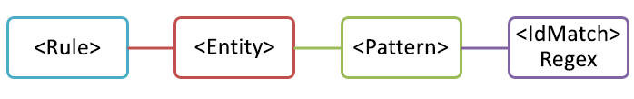
  
Pero, aunque es sencillo, este patrón puede identificar un gran número de falsos positivos si coincide con contenido donde aparezcan números de nueve dígitos que no sean necesariamente id. de empleado.
  
### <a name="more-common-scenario-entity-with-multiple-patterns"></a>Escenario más común: entidad con varios patrones

Por este motivo, es más común definir una entidad con más de un patrón, donde los patrones identifican pruebas complementarias (como una palabra clave o una fecha), además de la entidad (como un número de nueve dígitos).
  
Por ejemplo, para incrementar la probabilidad de identificar contenido donde haya un id. de empleado, puede definir un patrón que también identifique una fecha de contratación y, además, definir otro patrón que identifique una fecha de contratación y una palabra clave (como "Id. de empleado"), además del número de nueve dígitos.
  
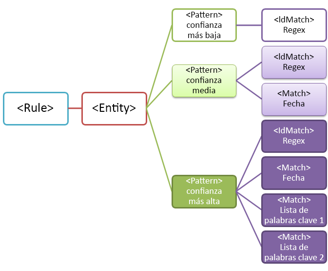
  
Debe tener en cuenta un par de aspectos importantes de esta estructura:
  
- Los patrones que necesitan más pruebas tienen un mayor nivel de confianza. Esto es útil porque, cuando más tarde use este tipo de información confidencial en una directiva DLP, podrá usar acciones más restrictivas (como bloquear contenido) solo con las coincidencias de mayor confianza y, además, podrá usar acciones menos restrictivas (como el envío de notificaciones) con las coincidencias de menor confianza.
    
- Los elementos IdMatch y Match complementarios hacen referencia a expresiones regulares y palabras clave que, en realidad, son elementos secundarios del elemento Rule, no del elemento Pattern. El elemento Pattern hace referencia a estos elementos complementarios, pero se incluye en el elemento Rule. Esto quiere decir que varias entidades y patrones pueden hacer referencia a una única definición de un elemento complementario, como una expresión regular o una lista de palabras clave.
    
## <a name="what-entity-do-you-need-to-identify-entity-element-id-attribute"></a>¿Qué entidad necesita identificar? [elemento Entity, atributo id.]

Una entidad es un tipo de información confidencial (como un número de tarjeta de crédito) que tiene un patrón bien definido. Cada entidad tiene un GUID único como su id.
  
### <a name="name-the-entity-and-generate-its-guid"></a>Asignar un nombre a la entidad y generar su GUID

Agregue los elementos Rules y Entity. Después, agregue un comentario que contenga el nombre de la entidad personalizada (en este ejemplo, "Id. de empleado"). Más tarde, agregará el nombre de la entidad a la sección de cadenas localizadas, y ese nombre es lo que se mostrará en la interfaz de usuario al crear una directiva DLP.
  
Después, genere un GUID para la entidad. Hay varias formas de generar GUID, pero puede hacerlo fácilmente en PowerShell si escribe lo siguiente: [guid]::NewGuid(). Más tarde, también agregará el GUID de la entidad a la sección de cadenas localizadas.
  
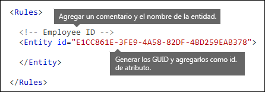
  
## <a name="what-pattern-do-you-want-to-match-pattern-element-idmatch-element-regex-element"></a>¿Qué patrón quiere hacer coincidir? [Elemento Pattern, elemento IdMatch, elemento Regex]

El patrón contiene la lista de lo que busca el tipo de información confidencial. Esta lista puede contener expresiones regulares, palabras clave y funciones integradas (que realizan tareas como ejecutar expresiones regulares para encontrar fechas o direcciones). Los tipos de información confidencial pueden tener varios patrones con confianzas únicas.
  
Lo que tienen en común todos los patrones siguientes es que hacen referencia a la misma expresión regular, que busca un número de nueve dígitos (\d{9}) rodeado de espacios en blanco (\s) … (\s). El elemento IdMatch hace referencia a esta expresión regular y es el requisito común para todos los patrones que buscan la entidad Id. de empleado. IdMatch es el identificador que el patrón intenta hacer coincidir, como un id. de empleado, un número de tarjeta de crédito o un número del seguro social. Un elemento Pattern necesita tener exactamente un elemento IdMatch.
  
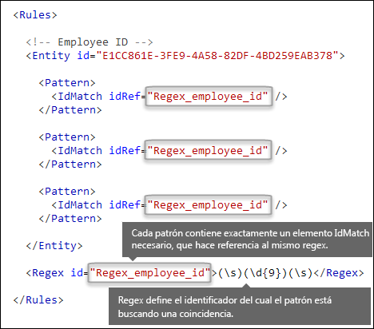
  
Cuando se cumpla un patrón, este devolverá un recuento y un nivel de confianza que puede usar en las condiciones de la directiva DLP. Al agregar a una directiva DLP una condición para detectar un tipo de información confidencial, puede editar el recuento y el nivel de confianza, como se muestra aquí. El nivel de confianza (que también se denomina "precisión de coincidencia") se explica más adelante en este tema.
  

  
Al crear una expresión regular, tenga en cuenta que pueden producirse algunos problemas. Por ejemplo, si escribe y carga una expresión regular que identifica demasiado contenido, esto podría afectar al rendimiento. Para obtener más información sobre estos posibles problemas, vea la sección posterior [Posibles problemas de validación](#potential-validation-issues-to-be-aware-of).
  
## <a name="do-you-want-to-require-additional-evidence-match-element-mincount-attribute"></a>¿Quiere exigir más pruebas? [Elemento Match, atributo minCount]

Además del elemento IdMatch, un patrón puede usar el elemento Match para exigir pruebas complementarias adicionales, como una palabra clave, una expresión regular, una fecha o una dirección.
  
En un elemento Pattern, se pueden incluir varios elementos Match, ya sea directamente en el elemento Pattern, o bien en combinación con el elemento Any. Los elementos Match se combinan mediante un operador AND implícito; todos los elementos Match tienen que cumplirse para que el patrón encuentre una coincidencia. Puede usar el elemento Any para introducir los operadores AND u OR (encontrará más información en una sección posterior).
  
Puede usar el atributo minCount opcional para especificar el número de instancias que necesita encontrar una coincidencia por cada uno de los elementos Match. Por ejemplo, puede especificar que un patrón se cumpla únicamente cuando se encuentren, como mínimo, dos palabras clave de una lista de palabras clave.
  
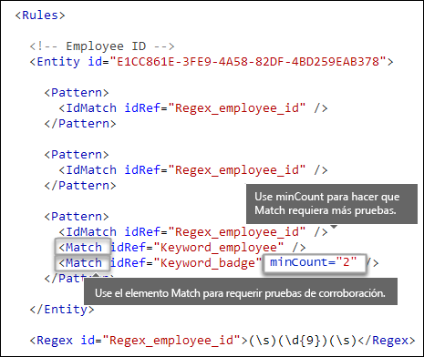
  
### <a name="keywords-keyword-group-and-term-elements-matchstyle-and-casesensitive-attributes"></a>Palabras clave [elementos Keyword, Group y Term, atributos matchStyle y caseSensitive]

Al identificar información confidencial (como un id. de empleado), es habitual exigir palabras clave como pruebas corroboradoras. Por ejemplo, además de hacer coincidir un número de nueve dígitos, puede que quiera buscar palabras como "tarjeta", "identificación" o "id.". Para hacerlo, use el elemento Keyword. El elemento Keyword tiene un atributo "id." al que puede hacerse referencia mediante varios elementos Match en varios patrones o entidades.
  
Las palabras clave se incluyen como una lista de elementos Term en un elemento Group. El elemento Group tiene un atributo matchStyle con dos valores posibles:
  
- **matchStyle="word"** El tipo de coincidencia "word" identifica palabras completas rodeadas por espacios en blanco u otros delimitadores. Siempre tiene que usar "word", excepto si necesita hacer coincidir partes de palabras o hacer coincidir palabras en idiomas asiáticos. 
    
- **matchStyle="string"** El tipo de coincidencia "string" identifica cadenas, sin importar el contenido que aparezca alrededor. Por ejemplo, "as" coincidirá con "asa" y con "alias". Use "string" solo cuando necesite hacer coincidir palabras asiáticas, o bien si la palabra clave puede incluirse como parte de otras cadenas. 
    
Por último, puede usar el atributo caseSensitive del elemento Term para especificar que el contenido tiene que coincidir exactamente con la palabra clave, incluidas las letras en minúscula y mayúscula.
  
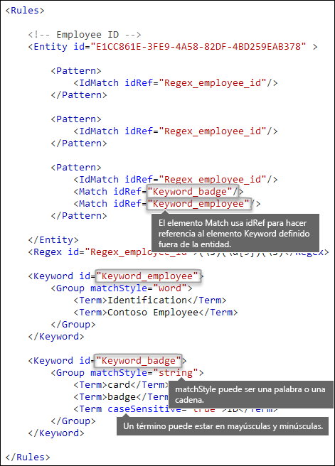
  
### <a name="regular-expressions-regex-element"></a>Expresiones regulares [elemento Regex]

En este ejemplo, la entidad Id. de empleado ya usa el elemento IdMatch para hacer referencia a una expresión regular para el patrón (un número de nueve dígitos rodeado de espacios en blanco). Además, un patrón puede usar un elemento Match para hacer referencia a un elemento Regex adicional con el fin de identificar pruebas corroboradoras, como un número de cinco o nueve dígitos con el formato de un código postal de Estados Unidos.
  
### <a name="additional-patterns-such-as-dates-or-addresses-built-in-functions"></a>Patrones adicionales, como fechas o direcciones [funciones integradas]

Además de los tipos de información confidencial integrados, en DLP también se incluyen funciones integradas que pueden identificar pruebas corroboradoras, como una fecha con formato de Estados Unidos, una fecha con formato de la UE, una fecha de expiración o una dirección de Estados Unidos. DLP no permite cargar sus propias funciones personalizadas; pero, al crear un tipo personalizado de información confidencial, la entidad puede hacer referencia a las funciones integradas.
  
Por ejemplo, una tarjeta de identificación de empleado contiene una fecha de contratación, por lo que esta entidad personalizada puede usar la función integrada `Func_us_date` para identificar una fecha en el formato usado normalmente en Estados Unidos. 
  
Para obtener más información, vea [Qué buscan las funciones de DLP](what-the-dlp-functions-look-for.md).
  
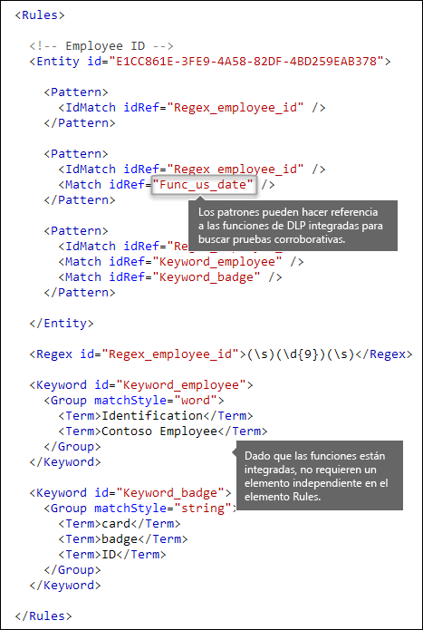
  
## <a name="different-combinations-of-evidence-any-element-minmatches-and-maxmatches-attributes"></a>Diferentes combinaciones de pruebas [elemento Any, atributos minMatches y maxMatches]

En un elemento Pattern, todos los elementos IdMatch y Match se combinan mediante un operador AND implícito (todas las coincidencias tienen que cumplirse para que el patrón se cumpla). Pero puede crear una lógica de coincidencia más flexible mediante el elemento Any para agrupar elementos Match. Por ejemplo, puede usar el elemento Any para que coincida con todos los elementos Match secundarios, con ninguno o con un subconjunto exacto.
  
El elemento Any tiene los atributos opcionales minMatches y maxMatches, que puede usar para definir cuántos de los elementos Match secundarios han de cumplirse para que el patrón coincida. Tenga en cuenta que estos atributos definen el número de elementos Match que han de cumplirse, no el número de instancias de pruebas encontradas para las coincidencias. Para definir un número mínimo de instancias para una coincidencia específica (como dos palabras clave de una lista), use el atributo minCount para un elemento Match (ver arriba).
  
### <a name="match-at-least-one-child-match-element"></a>Coincidir como mínimo con un elemento Match secundario

Si quiere exigir que solo tenga que cumplirse un número mínimo de elementos Match, puede usar el atributo minMatches. En realidad, estos elementos Match se combinan mediante un operador OR implícito. Este elemento Any se cumple si se encuentra una fecha con formato de Estados Unidos o una palabra clave de alguna de las listas.

```
<Any minMatches="1" >
     <Match idRef="Func_us_date" />
     <Match idRef="Keyword_employee" />
     <Match idRef="Keyword_badge" />
</Any>
```
    
### <a name="match-an-exact-subset-of-any-children-match-elements"></a>Coincidir un subconjunto exacto de elementos Match secundarios

Si quiere exigir que se cumpla un número exacto de elementos Match, puede establecer los atributos minMatches y maxMatches en el mismo valor. Este elemento Any solo se cumple si se encuentra exactamente una fecha o palabra clave (si se encuentra más de una, el patrón no coincidirá).

```
<Any minMatches="1" maxMatches="1" >
     <Match idRef="Func_us_date" />
     <Match idRef="Keyword_employee" />
     <Match idRef="Keyword_badge" />
</Any>
```
  
### <a name="match-none-of-children-match-elements"></a>Ninguna coincidencia de elementos Match secundarios

Si quiere exigir la ausencia de pruebas específicas para que se cumpla un patrón, puede establecer los atributos minMatches y maxMatches en 0. Esto puede resultar útil si tiene una lista de palabras clave u otras pruebas que es probable que indiquen un falso positivo.
  
Por ejemplo, la entidad Id. de empleado busca la palabra clave "tarjeta", ya que puede hacer referencia a una "tarjeta de identificación". Pero, si la palabra "tarjeta" solo aparece en la frase "tarjeta de crédito", es poco probable que "tarjeta" en este contenido signifique "tarjeta de identificación". Por lo tanto, puede agregar "tarjeta de crédito" con una palabra clave a una lista de términos que quiera excluir para impedir que se cumpla el patrón.
  
```
<Any minMatches="0" maxMatches="0" >
    <Match idRef="Keyword_false_positives_local" />
    <Match idRef="Keyword_false_positives_intl" />
</Any>
```

### <a name="match-a-number-of-unique-terms"></a>Coincidencia de varios términos únicos

Si quiere hacer coincidir una serie de condiciones únicas, utilice el parámetro *uniqueResults*, establecido en *true*, como se muestra en el siguiente ejemplo:

```
<Pattern confidenceLevel="75">
    <IdMatch idRef="Salary_Revision_terms" />
    <Match idRef=" Salary_Revision_ID " minCount="3" uniqueResults="true" />
</Pattern>
```

En este ejemplo, se define un patrón para la revisión del salario con al menos tres coincidencias únicas. 
  
## <a name="how-close-to-the-entity-must-the-other-evidence-be-patternsproximity-attribute"></a>¿Cuál es la proximidad con que la entidad tiene que aparecer junto a otra prueba? [Atributo patternsProximity]

El tipo de información confidencial busca un patrón que represente un id. de empleado y, como parte de ese patrón, también busca pruebas corroboradoras, como una palabra clave (por ejemplo, "id."). Cuanto más cerca se encuentre esta prueba, más probable es que el patrón sea el id. de empleado adecuado. Puede determinar la proximidad de otras pruebas en el patrón con la entidad mediante el atributo patternsProximity obligatorio del elemento Entity.
  
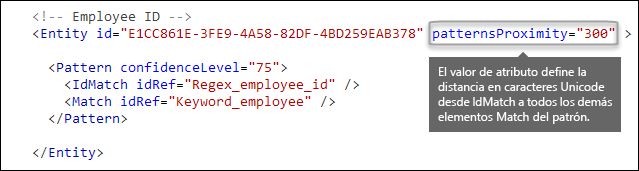
  
Por cada patrón en la entidad, el valor del atributo patternsProximity define la distancia (en caracteres Unicode) desde la ubicación de IdMatch para el resto de las coincidencias especificadas para ese patrón. La ventana de proximidad se ancla mediante la ubicación IdMatch, con la ventana extendiéndose hacia la izquierda y la derecha de la ubicación IdMatch.
  
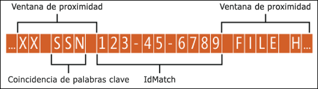
  
En el ejemplo siguiente, se muestra cómo la ventana de proximidad afecta a la coincidencia de patrones donde el elemento IdMatch de la entidad personalizada "Id. de empleado" exige como mínimo una coincidencia corroboradora de una palabra clave o fecha. Solo ID1 coincide porque, en el caso de ID2 e ID3, en la ventana de proximidad no se encuentra ninguna prueba corroboradora, o bien se encuentra una parcial.
  

  
Tenga en cuenta que, en el caso del correo electrónico, el cuerpo del mensaje y los datos adjuntos se consideran elementos independientes. Esto significa que la ventana de proximidad no se extiende más allá del final de cada uno de estos elementos. Por cada elemento (datos adjuntos o cuerpo), tanto idMatch como la prueba corroboradora necesitan residir en ese elemento.
  
## <a name="what-are-the-right-confidence-levels-for-different-patterns-confidencelevel-attribute-recommendedconfidence-attribute"></a>¿Cuáles son los niveles de confianza adecuados para diferentes patrones? [Atributo confidenceLevel, atributo recommendedConfidence]

Cuantas más pruebas necesite un patrón, más seguro estará de que se haya identificado una entidad real (como un id. de empleado) cuando coincida el patrón. Por ejemplo, tendrá más confianza en un patrón que necesite un número de identificación de nueve dígitos, una fecha de contratación y una palabra clave a muy poca distancia, que en un patrón que solo necesite un número de identificación de nueve dígitos.
  
El elemento Pattern tiene un atributo confidenceLevel obligatorio. Piense en el valor de confidenceLevel (un entero entre 1 y 100) como un id. único para cada patrón de una entidad (los patrones de una entidad necesitan tener asignados distintos niveles de confianza). El valor preciso del entero no importa: solo tiene que elegir números que tengan sentido para el equipo de cumplimiento. Después de cargar el tipo personalizado de información confidencial y crear una directiva DLP, puede hacer referencia a esos niveles de confianza en las condiciones de las reglas que cree.
  
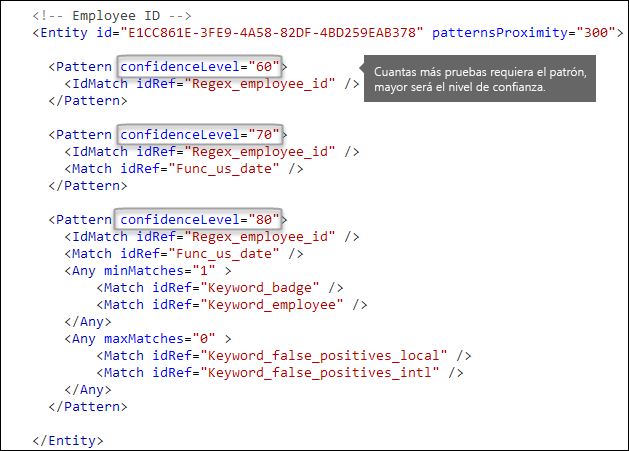
  
Además del atributo confidenceLevel para cada elemento Pattern, el elemento Entity tiene un atributo recommendedConfidence. El atributo de confianza recomendado se puede identificar como el nivel de confianza predeterminado para la regla. Al crear una regla en una directiva DLP, si no especifica un nivel de confianza para la regla que se usará, esa regla coincidirá según el nivel de confianza recomendado para la entidad.
  
## <a name="do-you-want-to-support-other-languages-in-the-ui-of-the-security-amp-compliance-center-localizedstrings-element"></a>¿Quiere admitir otros idiomas en la interfaz de usuario del Centro de seguridad y cumplimiento? [Elemento LocalizedStrings]

Si el equipo de cumplimiento usa el Centro de seguridad y cumplimiento de Office 365 para crear directivas DLP en distintas configuraciones regionales y diferentes idiomas, puede proporcionar versiones localizadas del nombre y la descripción del tipo personalizado de información confidencial. Cuando el equipo de cumplimiento use Office 365 en un idioma admitido, verán el nombre localizado en la interfaz de usuario.
  

  
El elemento Rules necesita contener un elemento LocalizedStrings, que contiene un elemento Resource que hace referencia al GUID de la entidad personalizada. A su vez, cada elemento Resource contiene uno o más elementos Name y Description, y cada uno usa el atributo langcode para especificar una cadena localizada para un idioma específico.
  
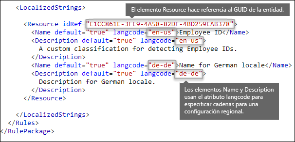
  
Tenga en cuenta que las cadenas localizadas solo se usan para mostrar el tipo personalizado de información confidencial en la interfaz de usuario del Centro de seguridad y cumplimiento. No se pueden usar cadenas localizadas para proporcionar otras versiones localizadas de una lista de palabras clave o una expresión regular.
  
## <a name="other-rule-package-markup-rulepack-guid"></a>Otro marcado de paquete de reglas [GUID de RulePack]

Por último, el principio de cada elemento RulePackage contiene información general que necesita rellenar. Puede usar el siguiente marcado como una plantilla y reemplazar los marcadores de posición "…" con su propia información.
  
Aún más importante, necesita generar un GUID para el elemento RulePack. Anteriormente, ha generado un GUID para la entidad (se trata de un GUID secundario para el elemento RulePack). Hay varias formas de generar GUID, pero puede hacerlo fácilmente en PowerShell si escribe lo siguiente: [guid]::NewGuid().
  
El elemento Version también es importante. Al cargar por primera vez un paquete de reglas, Office 365 anota el número de versión. Si posteriormente actualiza el paquete de reglas y carga una nueva versión, asegúrese de actualizar el número de versión (de lo contrario, Office 365 no implementará el paquete de reglas).
  
```
<?xml version="1.0" encoding="utf-16"?>
<RulePackage xmlns="http://schemas.microsoft.com/office/2011/mce">
  <RulePack id=". . .">
    <Version major="1" minor="0" build="0" revision="0" />
    <Publisher id=". . ." /> 
    <Details defaultLangCode=". . .">
      <LocalizedDetails langcode=" . . . ">
         <PublisherName>. . .</PublisherName>
         <Name>. . .</Name>
         <Description>. . .</Description>
      </LocalizedDetails>
    </Details>
  </RulePack>
  
 <Rules>
    . . .
 </Rules>
</RulePackage>

```

Una vez completado, el elemento RulePack será parecido a este.
  
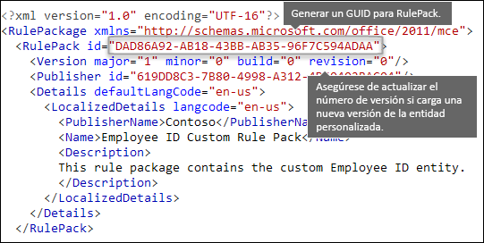
  
## <a name="changes-for-exchange-online"></a>Cambios para Exchange Online

Anteriormente, puede que haya usado PowerShell de Exchange Online para importar tipos personalizados de información confidencial para DLP. Ahora, dichos tipos se pueden usar tanto en el centro de administración de Exchange como en el Centro de seguridad &amp; cumplimiento. Como parte de esta mejora, necesita usar el símbolo del sistema de PowerShell del Centro de seguridad &amp; cumplimiento para importar los tipos personalizados de información confidencial (ya no se pueden importar desde Exchange PowerShell). Los tipos mencionados seguirán funcionando como hasta ahora; pero puede que los cambios realizados en los tipos personalizados de información confidencial del Centro de seguridad &amp; cumplimiento tarden hasta una hora en aparecer en el centro de administración de Exchange.
  
Tenga en cuenta que, en el Centro de seguridad y cumplimiento, se usa el cmdlet **[New-DlpSensitiveInformationTypeRulePackage](https://docs.microsoft.com/powershell/module/exchange/policy-and-compliance-dlp/new-dlpsensitiveinformationtyperulepackage?view=exchange-ps)** para cargar un paquete de reglas (anteriormente, en el Centro de administración de Exchange, se usaba el cmdlet **ClassificationRuleCollection**). 
  
## <a name="upload-your-rule-package"></a>Cargar un paquete de reglas

Para cargar un paquete de reglas, siga este procedimiento:
  
1. Guárdelo como un archivo .xml con codificación Unicode.
    
2. [Conectarse a PowerShell del Centro de seguridad y cumplimiento](http://go.microsoft.com/fwlink/p/?LinkID=799771)
    
3. Utilice la sintaxis siguiente:

    ```
    New-DlpSensitiveInformationTypeRulePackage -FileData (Get-Content -Path "PathToUnicodeXMLFile" -Encoding Byte)
    ```

    En este ejemplo se carga el archivo XML de Unicode denominado MyNewRulePack.xml desde C:\Mis documentos.

    ```
    New-DlpSensitiveInformationTypeRulePackage -FileData (Get-Content -Path "C:\My Documents\MyNewRulePack.xml" -Encoding Byte)
    ```

    Para obtener información detallada sobre la sintaxis y los parámetros, vea [New-DlpSensitiveInformationTypeRulePackage](https://docs.microsoft.com/powershell/module/exchange/policy-and-compliance-dlp/new-dlpsensitiveinformationtyperulepackage).

5. Para comprobar si un tipo de información confidencial se creó correctamente, siga uno de estos procedimientos:

  - Ejecute el cmdlet [Get-DlpSensitiveInformationTypeRulePackage](https://docs.microsoft.com/powershell/module/exchange/policy-and-compliance-dlp/get-dlpsensitiveinformationtyperulepackage?view=exchange-ps) para comprobar que se muestra el nuevo paquete de reglas en la lista:

    ```
    Get-DlpSensitiveInformationTypeRulePackage
    ``` 

  - Ejecute el cmdlet [Get-DlpSensitiveInformationType](https://docs.microsoft.com/powershell/module/exchange/policy-and-compliance-dlp/get-dlpsensitiveinformationtype?view=exchange-ps) para comprobar que se muestra el tipo de información confidencial:

    ```
    Get-DlpSensitiveInformationType
    ``` 

    Para los tipos personalizados de información confidencial, el valor de propiedad de Publisher no será Microsoft Corporation, sino otro.

  - Reemplace \<Nombre\> con el valor de nombre del tipo de información confidencial (por ejemplo, Id. de empleado) y ejecute el cmdlet [Get-DlpSensitiveInformationType](https://docs.microsoft.com/powershell/module/exchange/policy-and-compliance-dlp/get-dlpsensitiveinformationtype?view=exchange-ps):

    ```
    Get-DlpSensitiveInformationType -Identity "<Name>"
    ```
    
## <a name="potential-validation-issues-to-be-aware-of"></a>Posibles problemas de validación

Al cargar un archivo XML de paquete de reglas, el sistema valida el código XML y comprueba si hay patrones incorrectos conocidos y problemas de rendimiento obvios. Estos son algunos de los problemas conocidos (la validación comprueba las expresiones regulares):
  
- No puede empezar ni terminar con el alternador "|", que coincide con todo, ya que se considera una coincidencia vacía.
    
    Por ejemplo, "|a" o "b|" no superarán la validación.
    
- No puede empezar ni terminar con un patrón ".{0,m}", ya que no tiene ninguna finalidad funcional y solo perjudica al rendimiento.
    
    Por ejemplo, ".{0,50}ASDF" o "ASDF.{0,50}" no superarán la validación.
    
- No puede tener ".{0,m}" o "{1,m}" en grupos, ni tampoco ".\*" o ".+" en grupos.
    
    Por ejemplo, "(.{0,50000})" no superará la validación.
    
- No puede tener ningún carácter con los repetidores "{0,m}" o "{1,m}" en grupos.
    
    Por ejemplo, "(a\*)" no superará la validación.
    
- No puede empezar ni terminar con ".{1,m}" (en su lugar, use simplemente ".").
    
    Por ejemplo, ".{1,m}asdf" no superará la validación; en su lugar, use ".asdf".
    
- No puede tener un repetidor no enlazado (como "\*" o "+") en un grupo.
    
    Por ejemplo, "(xx)\*" y "(xx)+" no superarán la validación.
    
Si un tipo personalizado de información confidencial contiene un problema que puede afectar al rendimiento, no se cargará y es posible que se muestre uno de estos mensajes de error:
  
- **Cuantificadores genéricos que coinciden con más de un contenido de lo esperado (por ejemplo, "+", "\*")**
    
- **Aserciones de búsqueda anticipada y posterior**
    
- **Agrupación compleja en conjunto con cuantificadores generales**
    
## <a name="recrawl-your-content-to-identify-the-sensitive-information"></a>Volver a rastrear el contenido para identificar la información confidencial

DLP usa el rastreador de búsqueda para identificar y clasificar información confidencial en el contenido del sitio. El contenido de sitios de OneDrive para la Empresa y SharePoint Online se vuelve a rastrear automáticamente cada vez que se actualiza. Pero, para identificar el nuevo tipo personalizado de información confidencial en todo el contenido existente, es necesario volver a rastrear ese contenido.
  
En Office 365, no se puede solicitar de forma manual un nuevo rastreo de todo un espacio empresarial, pero puede hacerlo para una colección de sitios, una lista o una biblioteca (vea [Solicitar de forma manual un rastreo y volver a indexar un sitio, una biblioteca o una lista](https://docs.microsoft.com/sharepoint/crawl-site-content)).
  
## <a name="remove-a-custom-sensitive-information-type"></a>Eliminación de un tipo personalizado de información confidencial

> [!NOTE]
> Antes de quitar un tipo personalizado de información confidencial, asegúrese de que ninguna de las directivas DLP o reglas de flujo del correo de Exchange (también conocidas como reglas de transporte) hagan referencia al tipo de información confidencial.

En PowerShell del Centro de seguridad y cumplimiento, hay dos métodos para quitar los tipos personalizados de información confidencial:

- **Quite los tipos personalizados de información confidencial individuales**: use el método documentado en [Modificar un tipo personalizado de información confidencial](#modify-a-custom-sensitive-information-type). Exporte el paquete de reglas personalizado que contiene el tipo de información confidencial, quite el tipo de información confidencial del archivo XML e importe el archivo XML actualizado en el paquete de reglas personalizado existente.

- **Quitar un paquete de reglas personalizado y todos los tipos de información confidencial que contiene**: este método se documenta en esta sección.

1. [Conectarse a PowerShell del Centro de seguridad y cumplimiento](http://go.microsoft.com/fwlink/p/?LinkID=799771)

2. Para quitar un paquete de reglas personalizado, use el cmdlet [Remove-DlpSensitiveInformationTypeRulePackage](https://docs.microsoft.com/powershell/module/exchange/policy-and-compliance-dlp/remove-dlpsensitiveinformationtyperulepackage?view=exchange-ps):

    ```
    Remove-DlpSensitiveInformationTypeRulePackage -Identity "RulePackageIdentity"
    ```

    Puede usar el valor de nombre (en cualquier idioma) o el valor (GUID) `RulePack id` para identificar el paquete de reglas.

    En este ejemplo se quita el paquete de reglas denominado "Paquete de reglas personalizado de Id. de empleado".

    ```
       Remove-DlpSensitiveInformationTypeRulePackage -Identity "Employee ID Custom Rule Pack"
    ```

    Para obtener información detallada sobre la sintaxis y los parámetros, vea [Remove-DlpSensitiveInformationTypeRulePackage](https://docs.microsoft.com/powershell/module/exchange/policy-and-compliance-dlp/remove-dlpsensitiveinformationtyperulepackage).

3. Para comprobar que ha quitado correctamente un nuevo tipo personalizado de información confidencial, siga uno de los pasos siguientes:

  - Ejecute el cmdlet [Get-DlpSensitiveInformationTypeRulePackage](https://docs.microsoft.com/powershell/module/exchange/policy-and-compliance-dlp/get-dlpsensitiveinformationtyperulepackage?view=exchange-ps) y compruebe que ya no se muestra el paquete de reglas en la lista:

    ```
    Get-DlpSensitiveInformationTypeRulePackage
    ``` 

  - Ejecute el cmdlet [Get-DlpSensitiveInformationType](https://docs.microsoft.com/powershell/module/exchange/policy-and-compliance-dlp/get-dlpsensitiveinformationtype?view=exchange-ps) para comprobar que ya no aparecen los tipos de información confidencial en el paquete de reglas que ha quitado:

    ```
    Get-DlpSensitiveInformationType
    ``` 

    Para los tipos personalizados de información confidencial, el valor de propiedad de Publisher no será Microsoft Corporation, sino otro.

  - Reemplace \<Nombre\> con el valor de nombre del tipo de información confidencial (por ejemplo, Id. de empleado) y ejecute el cmdlet [Get-DlpSensitiveInformationType](https://docs.microsoft.com/powershell/module/exchange/policy-and-compliance-dlp/get-dlpsensitiveinformationtype?view=exchange-ps) para comprobar que el tipo de información confidencial ya no aparece:

    ```
    Get-DlpSensitiveInformationType -Identity "<Name>"
    ```

## <a name="modify-a-custom-sensitive-information-type"></a>Modificación de un tipo personalizado de información confidencial

Crear un tipo personalizado de información confidencial en PowerShell del Centro de seguridad y cumplimiento requiere lo siguiente:

1. Exporte el paquete de reglas existente que contiene el tipo de información confidencial a un archivo XML (o, si lo tiene, use el archivo XML existente). 

2. Modifique el tipo personalizado de información confidencial en el archivo XML exportado.

3. Importe el archivo XML actualizado en el paquete de reglas existentes.

Para conectarse a PowerShell del Centro de seguridad y cumplimiento, vea [Conectarse a PowerShell del Centro de seguridad y cumplimiento](http://go.microsoft.com/fwlink/p/?LinkID=799771).

#### <a name="step-1-export-the-existing-rule-package-to-an-xml-file"></a>Paso 1: exportar el paquete de reglas existentes a un archivo XML

> [!NOTE]
> Si tiene una copia del archivo XML (si, por ejemplo, lo acaba de crear y de importar), puede saltar al paso siguiente para modificar el archivo XML.

1. Si aún no lo sabe, ejecute el cmdlet [Get-DlpSensitiveInformationTypeRulePackage](https://docs.microsoft.com/powershell/module/exchange/policy-and-compliance-dlp/get-dlpsensitiveinformationtype?view=exchange-ps) para buscar el nombre del paquete de reglas personalizado:

    ```
    Get-DlpSensitiveInformationTypeRulePackage
    ```

    **Nota**: el paquete de reglas integradas que contiene los tipos de información confidencial integrados se denomina paquete de reglas de Microsoft. El paquete de reglas que contiene los tipos personalizados de información confidencial que creó en la interfaz de usuario del Centro de seguridad y cumplimiento se llama Microsoft.SCCManaged.CustomRulePack.

2. Use el cmdlet [Get-DlpSensitiveInformationTypeRulePackage](https://docs.microsoft.com/powershell/module/exchange/policy-and-compliance-dlp/get-dlpsensitiveinformationtyperulepackage?view=exchange-ps) para almacenar el paquete de reglas personalizadas en una variable:

    ```
    $rulepak = Get-DlpSensitiveInformationTypeRulePackage -Identity "RulePackageName"
    ```

   Por ejemplo, si el paquete de reglas se llama "Paquete de reglas personalizado de Id. de empleado", ejecute el cmdlet siguiente:

    ```
    $rulepak = Get-DlpSensitiveInformationTypeRulePackage -Identity "Employee ID Custom Rule Pack"
    ```

3. Use el cmdlet [Set-Content](https://docs.microsoft.com/powershell/module/microsoft.powershell.management/set-content?view=powershell-6) para exportar el paquete de reglas personalizado a un archivo XML:

    ```
    Set-Content -Path "XMLFileAndPath" -Encoding Byte -Value $rulepak.SerializedClassificationRuleCollection
    ```

    En este ejemplo se exporta el paquete de reglas para el archivo denominado ExportedRulePackage.xml en la carpeta C:\Mis documentos.

    ```
    Set-Content -Path "C:\My Documents\ExportedRulePackage.xml" -Encoding Byte -Value $rulepak.SerializedClassificationRuleCollection
    ```

#### <a name="step-2-modify-the-sensitive-information-type-in-the-exported-xml-file"></a>Paso 2: modificar el tipo de información confidencial en el archivo XML exportado

Anteriormente en este tema se describen los tipos de información confidencial en el archivo XML y otros elementos del archivo.

#### <a name="step-3-import-the-updated-xml-file-back-into-the-existing-rule-package"></a>Paso 3: importar el archivo XML actualizado en el paquete de reglas existentes

Para importar el archivo XML actualizado en el paquete de reglas existentes, use el cmdlet [Set-DlpSensitiveInformationTypeRulePackage](https://docs.microsoft.com/powershell/module/exchange/policy-and-compliance-dlp/set-dlpsensitiveinformationtyperulepackage?view=exchange-ps):

```
Set-DlpSensitiveInformationTypeRulePackage -FileData ([Byte[]]$(Get-Content -Path "C:\My Documents\External Sensitive Info Type Rule Collection.xml" -Encoding Byte -ReadCount 0))
```

Para obtener información detallada sobre la sintaxis y los parámetros, vea [Set-DlpSensitiveInformationTypeRulePackage](https://docs.microsoft.com/powershell/module/exchange/policy-and-compliance-dlp/set-dlpsensitiveinformationtyperulepackage).

## <a name="reference-rule-package-xml-schema-definition"></a>Referencia: Definición de esquema XML de paquete de reglas

Puede copiar este marcado, guardarlo como un archivo XSD y usarlo para validar el archivo XML del paquete de reglas.
  
```
<?xml version="1.0" encoding="utf-8"?>
<xs:schema xmlns:mce="http://schemas.microsoft.com/office/2011/mce"
           targetNamespace="http://schemas.microsoft.com/office/2011/mce" 
           xmlns:xs="http://www.w3.org/2001/XMLSchema"
           elementFormDefault="qualified"
           attributeFormDefault="unqualified"
           id="RulePackageSchema">
  <!-- Use include if this schema has the same target namespace as the schema being referenced, otherwise use import -->
  <xs:element name="RulePackage" type="mce:RulePackageType"/>
  <xs:simpleType name="LangType">
    <xs:union memberTypes="xs:language">
      <xs:simpleType>
        <xs:restriction base="xs:string">
          <xs:enumeration value=""/>
        </xs:restriction>
      </xs:simpleType>
    </xs:union>
  </xs:simpleType>
  <xs:simpleType name="GuidType" final="#all">
    <xs:restriction base="xs:token">
      <xs:pattern value="[0-9a-fA-F]{8}\-([0-9a-fA-F]{4}\-){3}[0-9a-fA-F]{12}"/>
    </xs:restriction>
  </xs:simpleType>
  <xs:complexType name="RulePackageType">
    <xs:sequence>
      <xs:element name="RulePack" type="mce:RulePackType"/>
      <xs:element name="Rules" type="mce:RulesType">
        <xs:key name="UniqueRuleId">
          <xs:selector xpath="mce:Entity|mce:Affinity|mce:Version/mce:Entity|mce:Version/mce:Affinity"/>
          <xs:field xpath="@id"/>
        </xs:key>
        <xs:key name="UniqueProcessorId">
          <xs:selector xpath="mce:Regex|mce:Keyword|mce:Fingerprint"></xs:selector>
          <xs:field xpath="@id"/>
        </xs:key>
        <xs:key name="UniqueResourceIdRef">
          <xs:selector xpath="mce:LocalizedStrings/mce:Resource"/>
          <xs:field xpath="@idRef"/>
        </xs:key>        
        <xs:keyref name="ReferencedRuleMustExist" refer="mce:UniqueRuleId">
          <xs:selector xpath="mce:LocalizedStrings/mce:Resource"/>
          <xs:field xpath="@idRef"/>
        </xs:keyref>
        <xs:keyref name="RuleMustHaveResource" refer="mce:UniqueResourceIdRef">
          <xs:selector xpath="mce:Entity|mce:Affinity|mce:Version/mce:Entity|mce:Version/mce:Affinity"/>
          <xs:field xpath="@id"/>
        </xs:keyref>
      </xs:element>
    </xs:sequence>
  </xs:complexType>
  <xs:complexType name="RulePackType">
    <xs:sequence>
      <xs:element name="Version" type="mce:VersionType"/>
      <xs:element name="Publisher" type="mce:PublisherType"/>
      <xs:element name="Details" type="mce:DetailsType">
        <xs:key name="UniqueLangCodeInLocalizedDetails">
          <xs:selector xpath="mce:LocalizedDetails"/>
          <xs:field xpath="@langcode"/>
        </xs:key>
        <xs:keyref name="DefaultLangCodeMustExist" refer="mce:UniqueLangCodeInLocalizedDetails">
          <xs:selector xpath="."/>
          <xs:field xpath="@defaultLangCode"/>
        </xs:keyref>
      </xs:element>
      <xs:element name="Encryption" type="mce:EncryptionType" minOccurs="0" maxOccurs="1"/>
    </xs:sequence>
    <xs:attribute name="id" type="mce:GuidType" use="required"/>
  </xs:complexType>
  <xs:complexType name="VersionType">
    <xs:attribute name="major" type="xs:unsignedShort" use="required"/>
    <xs:attribute name="minor" type="xs:unsignedShort" use="required"/>
    <xs:attribute name="build" type="xs:unsignedShort" use="required"/>
    <xs:attribute name="revision" type="xs:unsignedShort" use="required"/>
  </xs:complexType>
  <xs:complexType name="PublisherType">
    <xs:attribute name="id" type="mce:GuidType" use="required"/>
  </xs:complexType>
  <xs:complexType name="LocalizedDetailsType">
    <xs:sequence>
      <xs:element name="PublisherName" type="mce:NameType"/>
      <xs:element name="Name" type="mce:RulePackNameType"/>
      <xs:element name="Description" type="mce:OptionalNameType"/>
    </xs:sequence>
    <xs:attribute name="langcode" type="mce:LangType" use="required"/>
  </xs:complexType>
  <xs:complexType name="DetailsType">
    <xs:sequence>
      <xs:element name="LocalizedDetails" type="mce:LocalizedDetailsType" maxOccurs="unbounded"/>
    </xs:sequence>
    <xs:attribute name="defaultLangCode" type="mce:LangType" use="required"/>
  </xs:complexType>
  <xs:complexType name="EncryptionType">
    <xs:sequence>
      <xs:element name="Key" type="xs:normalizedString"/>
      <xs:element name="IV" type="xs:normalizedString"/>
    </xs:sequence>
  </xs:complexType>
  <xs:simpleType name="RulePackNameType">
    <xs:restriction base="xs:token">
      <xs:minLength value="1"/>
      <xs:maxLength value="64"/>
    </xs:restriction>
  </xs:simpleType>
  <xs:simpleType name="NameType">
    <xs:restriction base="xs:normalizedString">
      <xs:minLength value="1"/>
      <xs:maxLength value="256"/>
    </xs:restriction>
  </xs:simpleType>
  <xs:simpleType name="OptionalNameType">
    <xs:restriction base="xs:normalizedString">
      <xs:minLength value="0"/>
      <xs:maxLength value="256"/>
    </xs:restriction>
  </xs:simpleType>
  <xs:simpleType name="RestrictedTermType">
    <xs:restriction base="xs:string">
      <xs:minLength value="1"/>
      <xs:maxLength value="100"/>
    </xs:restriction>
  </xs:simpleType>
  <xs:complexType name="RulesType">
    <xs:sequence>
      <xs:choice maxOccurs="unbounded">
        <xs:element name="Entity" type="mce:EntityType"/>
        <xs:element name="Affinity" type="mce:AffinityType"/>
        <xs:element name="Version" type="mce:VersionedRuleType"/>
      </xs:choice>
      <xs:choice minOccurs="0" maxOccurs="unbounded">
        <xs:element name="Regex" type="mce:RegexType"/>
        <xs:element name="Keyword" type="mce:KeywordType"/>
        <xs:element name="Fingerprint" type="mce:FingerprintType"/>
        <xs:element name="ExtendedKeyword" type="mce:ExtendedKeywordType"/>
      </xs:choice>
      <xs:element name="LocalizedStrings" type="mce:LocalizedStringsType"/>
    </xs:sequence>
  </xs:complexType>
  <xs:complexType name="EntityType">
    <xs:sequence>
      <xs:element name="Pattern" type="mce:PatternType" maxOccurs="unbounded"/>
      <xs:element name="Version" type="mce:VersionedPatternType" minOccurs="0" maxOccurs="unbounded" />
    </xs:sequence>
    <xs:attribute name="id" type="mce:GuidType" use="required"/>
    <xs:attribute name="patternsProximity" type="mce:ProximityType" use="required"/>
    <xs:attribute name="recommendedConfidence" type="mce:ProbabilityType"/>
    <xs:attribute name="workload" type="mce:WorkloadType"/>
  </xs:complexType>
  <xs:complexType name="PatternType">
    <xs:sequence>
      <xs:element name="IdMatch" type="mce:IdMatchType"/>
      <xs:choice minOccurs="0" maxOccurs="unbounded">
        <xs:element name="Match" type="mce:MatchType"/>
        <xs:element name="Any" type="mce:AnyType"/>
      </xs:choice>
    </xs:sequence>
    <xs:attribute name="confidenceLevel" type="mce:ProbabilityType" use="required"/>
  </xs:complexType>
  <xs:complexType name="AffinityType">
    <xs:sequence>
      <xs:element name="Evidence" type="mce:EvidenceType" maxOccurs="unbounded"/>
      <xs:element name="Version" type="mce:VersionedEvidenceType" minOccurs="0" maxOccurs="unbounded" />
    </xs:sequence>
    <xs:attribute name="id" type="mce:GuidType" use="required"/>
    <xs:attribute name="evidencesProximity" type="mce:ProximityType" use="required"/>
    <xs:attribute name="thresholdConfidenceLevel" type="mce:ProbabilityType" use="required"/>
    <xs:attribute name="workload" type="mce:WorkloadType"/>
  </xs:complexType>
  <xs:complexType name="EvidenceType">
    <xs:sequence>
      <xs:choice maxOccurs="unbounded">
        <xs:element name="Match" type="mce:MatchType"/>
        <xs:element name="Any" type="mce:AnyType"/>
      </xs:choice>
    </xs:sequence>
    <xs:attribute name="confidenceLevel" type="mce:ProbabilityType" use="required"/>
  </xs:complexType>
  <xs:complexType name="IdMatchType">
    <xs:attribute name="idRef" type="xs:string" use="required"/>
  </xs:complexType>
  <xs:complexType name="MatchType">
    <xs:attribute name="idRef" type="xs:string" use="required"/>
    <xs:attribute name="minCount" type="xs:positiveInteger" use="optional"/>
    <xs:attribute name="uniqueResults" type="xs:boolean" use="optional"/>
  </xs:complexType>
  <xs:complexType name="AnyType">
    <xs:sequence>
      <xs:choice maxOccurs="unbounded">
        <xs:element name="Match" type="mce:MatchType"/>
        <xs:element name="Any" type="mce:AnyType"/>
      </xs:choice>
    </xs:sequence>
    <xs:attribute name="minMatches" type="xs:nonNegativeInteger" default="1"/>
    <xs:attribute name="maxMatches" type="xs:nonNegativeInteger" use="optional"/>
  </xs:complexType>
  <xs:simpleType name="ProximityType">
    <xs:union>
      <xs:simpleType>
        <xs:restriction base='xs:string'>
          <xs:enumeration value="unlimited"/>
        </xs:restriction>
      </xs:simpleType>
      <xs:simpleType>
        <xs:restriction base="xs:positiveInteger">
          <xs:minInclusive value="1"/>
        </xs:restriction>
      </xs:simpleType>
    </xs:union>
  </xs:simpleType>
  <xs:simpleType name="ProbabilityType">
    <xs:restriction base="xs:integer">
      <xs:minInclusive value="1"/>
      <xs:maxInclusive value="100"/>
    </xs:restriction>
  </xs:simpleType>
  <xs:simpleType name="WorkloadType">
    <xs:restriction base="xs:string">
      <xs:enumeration value="Exchange"/>
      <xs:enumeration value="Outlook"/>
    </xs:restriction>
  </xs:simpleType>
  <xs:simpleType name="EngineVersionType">
    <xs:restriction base="xs:token">
      <xs:pattern value="^\d{2}\.01?\.\d{3,4}\.\d{1,3}$"/>
    </xs:restriction>
  </xs:simpleType>
  <xs:complexType name="VersionedRuleType">
    <xs:choice maxOccurs="unbounded">
      <xs:element name="Entity" type="mce:EntityType"/>
      <xs:element name="Affinity" type="mce:AffinityType"/>
    </xs:choice>
    <xs:attribute name="minEngineVersion" type="mce:EngineVersionType" use="required" />
  </xs:complexType>
  <xs:complexType name="VersionedPatternType">
    <xs:sequence>
      <xs:element name="Pattern" type="mce:PatternType" maxOccurs="unbounded"/>
    </xs:sequence>
    <xs:attribute name="minEngineVersion" type="mce:EngineVersionType" use="required" />
  </xs:complexType>
  <xs:complexType name="VersionedEvidenceType">
    <xs:sequence>
      <xs:element name="Evidence" type="mce:EvidenceType" maxOccurs="unbounded"/>
    </xs:sequence>
    <xs:attribute name="minEngineVersion" type="mce:EngineVersionType" use="required" />
  </xs:complexType>
  <xs:simpleType name="FingerprintValueType">
    <xs:restriction base="xs:string">
      <xs:minLength value="2732"/>
      <xs:maxLength value="2732"/>
    </xs:restriction>
  </xs:simpleType>
  <xs:complexType name="FingerprintType">
    <xs:simpleContent>
      <xs:extension base="mce:FingerprintValueType">
        <xs:attribute name="id" type="xs:token" use="required"/>
        <xs:attribute name="threshold" type="mce:ProbabilityType" use="required"/>
        <xs:attribute name="shingleCount" type="xs:positiveInteger" use="required"/>
        <xs:attribute name="description" type="xs:string" use="optional"/>
      </xs:extension>
    </xs:simpleContent>
  </xs:complexType>
  <xs:complexType name="RegexType">
    <xs:simpleContent>
      <xs:extension base="xs:string">
        <xs:attribute name="id" type="xs:token" use="required"/>
      </xs:extension>
    </xs:simpleContent>
  </xs:complexType>
  <xs:complexType name="KeywordType">
    <xs:sequence>
      <xs:element name="Group" type="mce:GroupType" maxOccurs="unbounded"/>
    </xs:sequence>
    <xs:attribute name="id" type="xs:token" use="required"/>
  </xs:complexType>
  <xs:complexType name="GroupType">
    <xs:sequence>
      <xs:choice>
        <xs:element name="Term" type="mce:TermType" maxOccurs="unbounded"/>
      </xs:choice>
    </xs:sequence>
    <xs:attribute name="matchStyle" default="word">
      <xs:simpleType>
        <xs:restriction base="xs:NMTOKEN">
          <xs:enumeration value="word"/>
          <xs:enumeration value="string"/>
        </xs:restriction>
      </xs:simpleType>
    </xs:attribute>
  </xs:complexType>
  <xs:complexType name="TermType">
    <xs:simpleContent>
      <xs:extension base="mce:RestrictedTermType">
        <xs:attribute name="caseSensitive" type="xs:boolean" default="false"/>
      </xs:extension>
    </xs:simpleContent>
  </xs:complexType>
  <xs:complexType name="ExtendedKeywordType">
    <xs:simpleContent>
      <xs:extension base="xs:string">
        <xs:attribute name="id" type="xs:token" use="required"/>
      </xs:extension>
    </xs:simpleContent>
  </xs:complexType>
  <xs:complexType name="LocalizedStringsType">
    <xs:sequence>
      <xs:element name="Resource" type="mce:ResourceType" maxOccurs="unbounded">
      <xs:key name="UniqueLangCodeUsedInNamePerResource">
        <xs:selector xpath="mce:Name"/>
        <xs:field xpath="@langcode"/>
      </xs:key>
      <xs:key name="UniqueLangCodeUsedInDescriptionPerResource">
        <xs:selector xpath="mce:Description"/>
        <xs:field xpath="@langcode"/>
      </xs:key>
    </xs:element>
    </xs:sequence>
  </xs:complexType>
  <xs:complexType name="ResourceType">
    <xs:sequence>
      <xs:element name="Name" type="mce:ResourceNameType" maxOccurs="unbounded"/>
      <xs:element name="Description" type="mce:DescriptionType" minOccurs="0" maxOccurs="unbounded"/>
    </xs:sequence>
    <xs:attribute name="idRef" type="mce:GuidType" use="required"/>
  </xs:complexType>
  <xs:complexType name="ResourceNameType">
    <xs:simpleContent>
      <xs:extension base="xs:string">
        <xs:attribute name="default" type="xs:boolean" default="false"/>
        <xs:attribute name="langcode" type="mce:LangType" use="required"/>
      </xs:extension>
    </xs:simpleContent>
  </xs:complexType>
  <xs:complexType name="DescriptionType">
    <xs:simpleContent>
      <xs:extension base="xs:string">
        <xs:attribute name="default" type="xs:boolean" default="false"/>
        <xs:attribute name="langcode" type="mce:LangType" use="required"/>
      </xs:extension>
    </xs:simpleContent>
  </xs:complexType>
</xs:schema>

```

## <a name="more-information"></a>Más información

- [Información general sobre las directivas de prevención de pérdida de datos](data-loss-prevention-policies.md)
    
- [Información que buscan los tipos de información confidencial](what-the-sensitive-information-types-look-for.md)
    
- [Qué buscan las funciones de DLP](what-the-dlp-functions-look-for.md)
    

