# Crear un tipo personalizado de información confidencial

Prevención de pérdida de datos (DLP) de Office 365 incluye muchos [tipos de información confidencial](what-the-sensitive-information-types-look-for.md) integrados preparados para usarlos en las directivas DLP. Estos tipos integrados pueden ayudar a identificar y proteger números de tarjeta de crédito, cuentas bancarias, números de pasaporte y mucho más. 

Pero, si necesita identificar y proteger otro tipo de información confidencial, como el id. de empleado o números de proyecto que usen un formato específico para su organización, puede crear un tipo personalizado de información confidencial.

Estas son las partes básicas de un tipo personalizado de información confidencial:

- **Patrón principal**: números de id. de empleado, números de proyecto, etc. Suele identificarse mediante una expresión regular (regex), pero también puede ser una lista de palabras clave.

- **Evidencia adicional**: imagine que busca un número de id. de empleado de nueve dígitos. No todos los números de nueve dígitos son números de id. de empleado, pero puede buscar texto adicional (palabras clave como “empleado”, “identificación” o “id.”, o bien otros patrones de texto basados en expresiones regulares). Esta evidencia complementaria (también conocida como _evidencia_ _corroborativa_) incrementa la probabilidad de que el número de nueve dígitos encontrado en el contenido sea realmente un número de id. de empleado.

- **Proximidad de caracteres**: tiene sentido que, cuanto más próximos estén entre sí el patrón principal y la evidencia complementaria, más probabilidades habrá de que el contenido detectado sea lo que busca. Puede especificar la distancia de caracteres entre el patrón principal y la evidencia complementaria (también conocida como _ventana de proximidad_), como se muestra en el diagrama siguiente:

    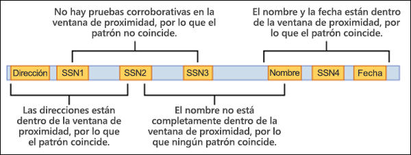

- **Nivel de confianza**: cuantas más evidencias complementarias tenga, mayor será la probabilidad de que una coincidencia contenga la información confidencial que busca. Puede asignar mayores niveles de confianza a las coincidencias detectadas mediante el uso de más evidencias.

  Cuando esté conforme, un patrón devolverá un recuento y un nivel de confianza, que podrá usar en las condiciones de las directivas DLP. Al agregar a una directiva DLP una condición para detectar un tipo de información confidencial, puede editar el recuento y el nivel de confianza, como se muestra en el diagrama siguiente:

    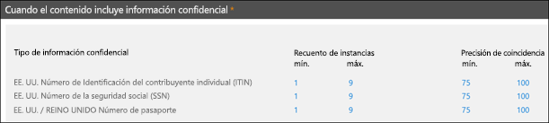

Para crear tipos personalizados de información confidencial en el Centro de seguridad y cumplimiento de Office 365, use una de estas opciones:

- **Interfaz de usuario**: este método es más sencillo y rápido, pero tiene menos opciones de configuración que si usa PowerShell. En el resto de este tema, se describen estos procedimientos.

- **PowerShell**: para usar este método, primero tiene que crear un archivo XML (denominado _paquete de reglas_) que contiene uno o más tipos de información confidencial y, después, usará PowerShell para importar el paquete de reglas (importar el paquete de reglas es complicado en comparación con la creación del paquete de reglas). Este método es mucho más complejo que si se usa la interfaz de usuario, pero ofrece más opciones de configuración. Para obtener instrucciones, vea [Crear un tipo personalizado de información confidencial en PowerShell del Centro de seguridad y cumplimiento de Office 365](create-a-custom-sensitive-information-type-in-scc-powershell.md).

En la tabla siguiente, se describen las principales diferencias:

|**Tipos personalizados de información confidencial en la interfaz de usuario**|**Tipos personalizados de información confidencial en PowerShell**|
|:-----|:-----|
|El nombre y la descripción están en un idioma.|Admite varios idiomas para Nombre y Descripción.|
|Es compatible con un patrón.|Es compatible con varios patrones.|
|Las evidencias complementarias pueden ser:  • Expresiones regulares  • Palabras clave  • Diccionarios de palabras clave|Las evidencias complementarias pueden ser:  • Expresiones regulares  • Palabras clave  • Diccionarios de palabras clave  • [Funciones de DLP integradas](what-the-dlp-functions-look-for.md)|
|Los tipos de información confidencial personalizados se agregan al paquete de reglas denominado Microsoft.SCCManaged.CustomRulePack|Puede crear hasta 10 paquetes de reglas que contengan tipos de información confidencial.|
|La coincidencia de patrones necesita la detección del patrón principal y todas las evidencias complementarias (se usa el operador AND implícito).|La coincidencia de patrones necesita la detección del patrón principal y una cantidad configurable de evidencias complementarias (pueden usarse los operadores AND y OR implícitos).|

## ¿Qué necesita saber antes de empezar?

- Para abrir el Centro de seguridad y cumplimiento, vea [Ir al Centro de seguridad y cumplimiento de Office 365](go-to-the-securitycompliance-center.md).

- Para usar los tipos personalizados de información confidencial, es necesario estar familiarizado con el uso de expresiones regulares (regex). Para obtener más información sobre el motor Boost.RegEx (anteriormente denominado RegEx++) usado para procesar el texto, vea [Boost.Regex 5.1.3](https://www.boost.org/doc/libs/1_68_0/libs/regex/doc/html/).

  Los servicios de soporte técnico y atención al cliente de Microsoft no pueden proporcionarle definiciones personalizadas de coincidencia de contenido (mediante la creación de clasificaciones personalizadas o patrones de expresiones regulares). Los ingenieros de soporte técnico pueden proporcionar soporte limitado para la característica (por ejemplo, pueden proporcionar patrones de expresiones regulares de ejemplo con fines de prueba, o bien ayudarle en la solución de problemas de un patrón de expresión regular existente que no se desencadene del modo previsto), pero no pueden ofrecer garantías de que cualquier desarrollo de coincidencia de contenido personalizado se adapte a sus requisitos u obligaciones.

- DLP usa el rastreador de búsqueda para identificar y clasificar información confidencial en sitios de SharePoint Online OneDrive para la Empresa. Para identificar el nuevo tipo personalizado de información confidencial en contenido existente, es necesario volver a rastrear el contenido. El contenido se vuelve a rastrear basándose en una programación, pero puede volverlo a rastrear de forma manual para una colección de sitios, una lista o una biblioteca. Para obtener más información, vea [Solicitar de forma manual el rastreo y la nueva indexación de un sitio, biblioteca o lista](https://docs.microsoft.com/sharepoint/crawl-site-content).

## Crear tipos personalizados de información confidencial en el Centro de seguridad y cumplimiento

En el Centro de seguridad y cumplimiento, vaya a **Clasificaciones** \> **Tipos de información confidencial** y haga clic en **Crear**.

Las opciones pueden entenderse fácilmente y se explican en la página asociada del asistente:

- **Nombre**

- **Descripción**

- **Proximidad**

- **Nivel de confianza**

- **Elemento de patrón principal** (palabras clave, expresión regular o diccionario)

- Opcional: **elementos de patrón complementarios** (palabras clave, expresión regular o diccionario) y un valor correspondiente de **Costo mínimo**.

Imagine el escenario siguiente: quiere usar un tipo personalizado de información confidencial que detecte números de empleado de nueve dígitos en el contenido, así como las palabras clave “id. de empleado” e “identificación”. Para crear este tipo personalizado de información confidencial, siga este procedimiento:

1. En el Centro de seguridad y cumplimiento, vaya a **Clasificaciones** \> **Tipos de información confidencial** y haga clic en **Crear**.

    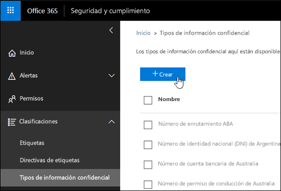

2. En la página **Seleccionar un nombre y una descripción**, escriba los valores siguientes:

  - **Nombre**: id. de empleado.

  - **Descripción**: detectar números de id. de empleados de Contoso de nueve dígitos.

    

    Cuando termine, haga clic en **Siguiente**.

3. En la página **Requisitos de coincidencia**, haga clic en **Agregar un elemento** y configure las opciones siguientes:

    - **Detectar contenido que contenga**:
 
      a. Haga clic en **Cualquiera de estos** y seleccione **Expresión regular**.

      b. En el cuadro de expresión regular, escriba `(\s)(\d{9})(\s)` (números de nueve dígitos rodeados por espacios en blanco).
  
    - **Elementos complementarios**: haga clic en **Agregar elementos complementarios** y seleccione **Contiene esta lista de palabras clave**.

    - En el área **Contiene esta lista de palabras clave**, configure las opciones siguientes:

      - **Lista de palabras clave**: escriba el valor “empleado,id.,identificación”.

      - **Recuento mínimo**: deje el valor predeterminado (1).

    - No modifique el valor predeterminado de **Nivel de confianza** (60). 

    - No modifique el valor predeterminado de **Proximidad de caracteres** (300).

    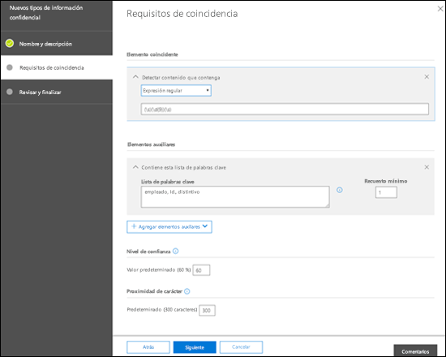

    Cuando termine, haga clic en **Siguiente**.

4. En la página **Revisar y finalizar**, revise la configuración y, después, haga clic en **Finalizar**.

    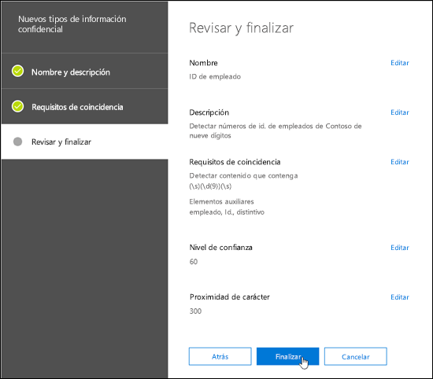

5. En la página siguiente, puede probar el nuevo tipo personalizado de información confidencial haciendo clic en **Sí**. Para obtener más información, vea [Probar tipos personalizados de información confidencial en el Centro de seguridad y cumplimiento](#test-custom-sensitive-information-types-in-the-security--compliance-center). Para probar la regla más tarde, haga clic en **No**.

    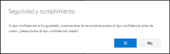

### ¿Cómo saber si el proceso se ha completado correctamente?

Para comprobar si un tipo de información confidencial se creó correctamente, siga uno de estos procedimientos:

  - Vaya a **Clasificaciones** \> **Tipos de información confidencial** y asegúrese de que en la lista se muestre el nuevo tipo personalizado de información confidencial.

  - Pruebe el nuevo tipo personalizado de información confidencial. Para obtener más información, vea [Probar tipos personalizados de información confidencial en el Centro de seguridad y cumplimiento](#test-custom-sensitive-information-types-in-the-security--compliance-center).

## Modificar tipos personalizados de información confidencial en el Centro de seguridad y cumplimiento

**Notas**:

- Solo se pueden modificar los tipos personalizados de información confidencial; no se pueden modificar los tipos de información confidencial integrados. Pero puede usar PowerShell para exportar los tipos personalizados de información confidencial integrados, personalizarlos y, después, importarlos como tipos personalizados de información confidencial. Para obtener más información, vea [Personalizar un tipo de información confidencial integrado](customize-a-built-in-sensitive-information-type.md).

- Solo puede modificar los tipos de información confidencial personalizados que creó en la interfaz de usuario. Si ha usado el [procedimiento de PowerShell](create-a-custom-sensitive-information-type-in-scc-powershell.md) para importar un paquete de reglas de tipo de información confidencial, recibirá un error.

En el Centro de seguridad y cumplimiento, vaya a **Clasificaciones** \> **Tipos de información confidencial**, seleccione el tipo personalizado de información confidencial que quiera modificar y haga clic en **Editar**.

  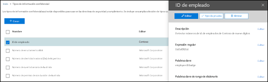

Verá las mismas opciones disponibles que al crear el tipo personalizado de información confidencial en el Centro de seguridad y cumplimiento. Para obtener más información, vea [Crear tipos personalizados de información confidencial en el Centro de seguridad y cumplimiento](#create-custom-sensitive-information-types-in-the-security--compliance-center).

### ¿Cómo saber si el proceso se completó correctamente?

Para comprobar si un tipo de información confidencial se modificó correctamente, siga uno de estos procedimientos:

  - Vaya a **Clasificaciones** \> **Tipos de información confidencial** para comprobar las propiedades del tipo personalizado de información confidencial modificado. 

  - Pruebe el tipo personalizado de información confidencial modificado. Para obtener más información, vea [Probar tipos personalizados de información confidencial en el Centro de seguridad y cumplimiento](#test-custom-sensitive-information-types-in-the-security--compliance-center).

## Quitar tipos personalizados de información confidencial en el Centro de seguridad y cumplimiento 

**Notas**:

- Solo se pueden quitar los tipos personalizados de información confidencial; no se pueden quitar los tipos de información confidencial integrados.

- Antes de quitar un tipo personalizado de información confidencial, asegúrese de que ninguna de las directivas DLP o reglas de flujo del correo de Exchange (también conocidas como reglas de transporte) hagan referencia al tipo de información confidencial.

1. En el Centro de seguridad y cumplimiento, vaya a **Clasificaciones** \> **Tipos de información confidencial** y seleccione uno o más tipos personalizados de información confidencial que quiera quitar.

2. En el control flotante, haga clic en **Eliminar** (o en **Eliminar tipos de información confidencial**, si seleccionó más de uno).

    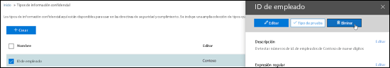

3. Haga clic en **Sí** en el mensaje de advertencia que se muestre.

### ¿Cómo saber si el proceso se completó correctamente?

Para comprobar si un tipo personalizado de información confidencial se quitó correctamente, vaya a **Clasificaciones** \> **Tipos de información confidencial** y asegúrese de que el tipo personalizado de información confidencial ya no se muestre en la lista.

## Probar tipos personalizados de información confidencial en el Centro de seguridad y cumplimiento

1. En el Centro de seguridad y cumplimiento, vaya a **Clasificaciones** \> **Tipos de información confidencial**.

2. Seleccione uno o más tipos personalizados de información confidencial que quiera probar. En el control flotante que se abra, haga clic en **Probar tipo** (o en **Probar tipos de información confidencial**, si seleccionó un más de uno).

    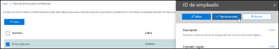

3. En la página **Cargar archivo para probar** que se abre, cargue un documento para realizar la prueba (puede arrastrar y colocar un archivo, o bien puede hacer clic en **Examinar** y seleccionar un archivo).

    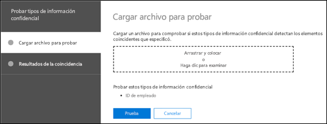

4. Haga clic en el botón **Probar** para probar el documento y ver si hay coincidencias de patrones en el archivo.

5. En la página **Resultados de la coincidencia**, haga clic en **Finalizar**.

    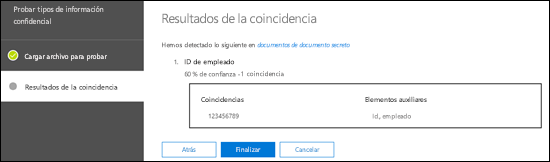