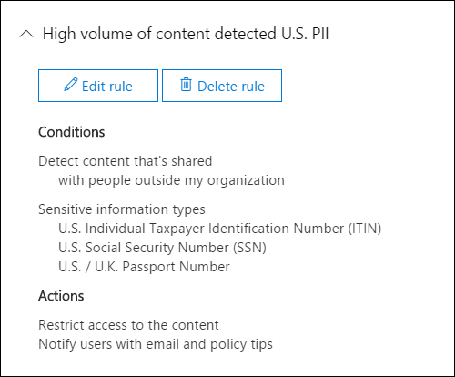
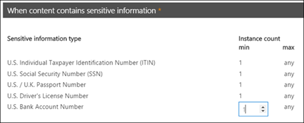

# Crear una directiva DLP a partir de una plantilla

La forma más sencilla y habitual de empezar a trabajar con directivas de DLP es usar una de las plantillas incluidas en Office 365. Puede usar una de estas plantillas como está o personalizar las reglas para cumplir los requisitos de cumplimiento específicos de la organización.
  
Office 365 incluye más de 40 plantillas listas para usar que pueden ayudarle a satisfacer una amplia gama de necesidades comunes de directivas de negocio y reglamentarias. Por ejemplo, hay plantillas de directivas de DLP para:
  
- Ley Gramm-Leach-Bliley (GLBA)
    
- Estándar de seguridad de datos de la industria de las tarjetas de pago (PCI DSS)
    
- Información de identificación personal de Estados Unidos (PII de EE.UU.)
    
- Ley de seguros de salud (HIPAA) de los Estados Unidos
    
Para ajustar una plantilla, modifique cualquiera de las reglas existentes o agregue otras nuevas. Por ejemplo, puede agregar nuevos tipos de información confidencial a una regla, modificar los recuentos de una regla para que sea más difícil o más fácil desencadenar, permitir a los usuarios invalidar las acciones en una regla proporcionando una justificación comercial o cambiar las notificaciones y el incidente. los informes se envían a. Una plantilla de directiva DLP es un punto de partida flexible para muchos escenarios de cumplimiento comunes.
  
También puede elegir la plantilla personalizada, que no tiene reglas predeterminadas, y configurar la Directiva DLP desde cero para cumplir los requisitos de cumplimiento específicos de su organización.
  
## Ejemplo: identificar información confidencial en todos los sitios de OneDrive para la empresa y restringir el acceso de usuarios externos a la organización

Las cuentas de OneDrive para la empresa facilitan a los usuarios de toda la organización colaborar y compartir documentos. Pero una preocupación común para los responsables del cumplimiento de las normas es que la información confidencial que se almacena en OneDrive para la empresa se puede compartir de forma inadvertida con personas de fuera de la organización. Una directiva DLP puede ayudar a mitigar este riesgo.
  
En este ejemplo, creará una directiva DLP que identifique los datos PII de Estados Unidos, que incluyen los números de identificación de los contribuyentes (ÉLEN), los números de la seguridad social y los números de pasaportes de Estados Unidos. Se iniciará con una plantilla y, a continuación, modificará la plantilla para cumplir los requisitos de cumplimiento de la organización (en concreto, puede hacerlo?):
  
- Agregue un par de tipos de información confidencial, números de cuentas bancarias y números de licencia de conducir de Estados Unidos, de modo que la Directiva DLP proteja incluso más los datos confidenciales.
    
- Hacer que la Directiva sea más sensible, de modo que una sola ocurrencia de información confidencial sea suficiente para restringir el acceso a los usuarios externos.
    
- Permita a los usuarios invalidar las acciones proporcionando una justificación empresarial o notificando un falso positivo. De esta forma, la Directiva DLP no impedirá que los usuarios de la organización puedan realizar su trabajo, siempre que tengan una razón empresarial válida para compartir la información confidencial.
    
### Crear una directiva DLP a partir de una plantilla

1. Vaya a [https://protection.office.com](https://protection.office.com).
    
2. Inicie sesión en Office 365 con su cuenta profesional o educativa. Ahora está en el centro de seguridad &amp; y cumplimiento de Office 365.
    
3. En la directiva &amp; \> \> **** \> **** **** de prevención de pérdida de datos de navegación del centro de cumplimiento de seguridad izquierdo + crear una directiva. \>
    
    
  
4. Elija la plantilla de directiva DLP que protege los tipos de información confidencial que necesita \> a **continuación**.
    
    En este ejemplo, seleccionará datos de **privacidad** \> **estadounidense de identificación personal (PII) de Estados Unidos** porque ya incluye la mayoría de los tipos de información confidencial que desea proteger; más adelante agregará un par. 
    
    Al seleccionar una plantilla, puede leer la descripción de la derecha para saber qué tipos de información confidencial protege la plantilla.
    
    
  
5. Asigne un nombre \> a la Directiva a **continuación**.
    
6. Para elegir las ubicaciones que desea que proteja la Directiva DLP, realice una de las siguientes acciones:
    
  - elija **todas las ubicaciones en Office 365** \> **siguiente**.
    
  - Elija **permitirme elegir ubicaciones** \> específicas a **continuación**. Para este ejemplo, elija esta opción.
    
    Para incluir o excluir una ubicación completa, como todos los correos electrónicos de Exchange o todas las cuentas de OneDrive, cambie el **Estado** de dicha ubicación a activado o desactivado. 
    
    Para incluir solo sitios de SharePoint específicos o cuentas de OneDrive para la empresa, cambie el **Estado** a activado y, a continuación, haga clic en los vínculos de **incluir** para elegir sitios o cuentas específicos. Cuando se aplica una directiva a un sitio, las reglas configuradas en dicha directiva se aplican automáticamente a todos los subsitios de ese sitio. 
    
    
  
    En este ejemplo, para proteger la información confidencial almacenada en todas las cuentas de OneDrive para la empresa, desactive el **Estado** para el **correo electrónico de Exchange** y los **sitios de SharePoint**y deje el **Estado** en para **las cuentas de onedrive**.
    
7. Elija **Usar configuración** \> avanzada a **continuación**.
    
8. Una plantilla de directiva DLP contiene reglas predefinidas con condiciones y acciones que detectan y actúan sobre tipos específicos de información confidencial. Puede editar, eliminar o desactivar cualquiera de las reglas existentes o agregar otras nuevas. Cuando haya terminado, haga clic en **siguiente**.
    
    
  
    En este ejemplo, la plantilla de datos PII de Estados Unidos incluye dos reglas predefinidas:
    
  - **Bajo volumen de contenido detectado PII estadounidense** Esta regla busca archivos que contengan entre 1 y 10 ocurrencias de cada uno de los tres tipos de información confidencial (ÉLEN, SSN y números de pasaporte de Estados Unidos), donde los archivos se comparten con personas de fuera de la organización. Si se encuentra, la regla envía una notificación por correo electrónico al administrador de la colección de sitios primaria, al propietario del documento y a la persona que modificó por última vez el documento. 
    
  - **Alto volumen de contenido detectado PII estadounidense** Esta regla busca archivos que contengan 10 o más ocurrencias de cada uno de los mismos tres tipos de información confidencial, donde los archivos se comparten con personas de fuera de la organización. Si se encuentra, esta acción también envía una notificación de correo electrónico, además de restringe el acceso al archivo. Para el contenido de una cuenta de OneDrive para la empresa, esto significa que los permisos para el documento están restringidos para todos excepto el administrador de la colección de sitios primaria, el propietario del documento y la persona que modificó por última vez el documento. 
    
    Para cumplir los requisitos específicos de la organización, es posible que quiera que las reglas se conviertan más fácilmente, de modo que una sola ocurrencia de información confidencial sea suficiente para bloquear el acceso para los usuarios externos. Después de examinar estas reglas, entiende que no necesita reglas de recuento de baja y alta, solo necesita una única regla que bloquee el acceso si se encuentra alguna aparición de información confidencial.
    
    Por lo tanto, expanda la **regla**llamada **bajo volumen de contenido detectada eliminación de PII** \> estadounidense.
    
    
  
9. Ahora, en este ejemplo, necesita agregar dos tipos de información confidencial (números de cuenta bancaria de Estados Unidos y números de licencia de conducir de Estados Unidos), permitir que los usuarios invaliden una regla y cambiar el recuento a cualquier incidencia. Puede hacer todo esto editando una regla, así que seleccione **alto volumen de contenido detectado** \> **regla de edición**de PII estadounidense.
    
    
  
10. Para agregar un tipo de información confidencial, en **** la sección \> condiciones, **agregue o cambie tipos**. A continuación, en **Agregar o cambiar tipos** \> , elija **Agregar** \> Seleccione el **número de cuenta bancaria de Estados Unidos** y el **número** \> de licencia de la conducción de Estados Unidos y **agregue** \> **Done**.
    
    
  
    
  
11. Para cambiar el recuento (el número de instancias de información confidencial necesarias para activar la regla), **** \> en recuento de **** instancias, seleccione el valor \> mínimo para cada tipo escriba 1. El recuento mínimo no puede estar vacío. El recuento máximo puede estar vacío; un valor **máximo** vacío se convierte en **cualquiera**.
    
    Cuando termine, el recuento mínimo de todos los tipos de información confidencial debe ser **1** y el recuento máximo debe ser **cualquiera**. En otras palabras, cualquier ocurrencia de este tipo de información confidencial satisfará esta condición.
    
    
  
12. Para la personalización final, no desea que las directivas de DLP impidan que los usuarios hagan su trabajo cuando tengan una justificación comercial válida o encuentren un falso positivo, por lo que desea que la notificación del usuario incluya opciones para invalidar la acción de bloqueo.
    
    En la sección notificaciones de **usuario** , puede ver que las notificaciones de correo electrónico y las sugerencias de directiva están activadas de forma predeterminada para esta regla en la plantilla. 
    
    En la sección invalidaciones de **usuario** , puede ver que las invalidaciones de una justificación empresarial están activadas, pero los reemplazos para informar de falsos positivos no lo son. Elija **invalidar la regla automáticamente si la notifica como falso positivo**.
    
    
  
13. En la parte superior del editor de reglas, cambie el nombre de esta regla del **volumen alto predeterminado de contenido detectado por PII estadounidense** a **cualquier contenido detectado con PII estadounidense** , ya que ahora se desencadena por cualquier ocurrencia de sus tipos de información confidencial. 
    
14. En la parte inferior del editor \> de reglas, **guarde**.
    
15. A \> **continuación**, revise las condiciones y acciones para esta regla.
    
    En la parte derecha, observe el modificador de **Estado** de la regla. Si desactiva una Directiva completa, todas las reglas incluidas en la Directiva también se desactivan. Sin embargo, aquí puede desactivar una regla específica sin desactivar toda la Directiva. Esto puede ser útil cuando necesite investigar una regla que genera un gran número de falsos positivos. 
    
16. En la página siguiente, lea y comprenda lo siguiente y, a continuación, elija si quiere activar la regla o probarla primero \> ****.
    
     Antes de crear las directivas de DLP, considere la posibilidad de implementarlas gradualmente para valorar su impacto y probar su eficacia antes de que las exija por completo. Por ejemplo, no desea que una nueva Directiva de DLP bloquee involuntariamente el acceso a miles de documentos que los usuarios necesitan para realizar su trabajo. 
    
    Si va a crear directivas de DLP con un gran impacto potencial, le recomendamos seguir esta secuencia:
    
17. Inicie en modo de prueba sin sugerencias de directiva y, a continuación, use los informes DLP para evaluar el impacto. Los informes DLP le sirven para ver el número, la ubicación, el tipo y la gravedad de las coincidencias de directivas. En función de los resultados, puede ajustar las reglas según sea necesario. En el modo de prueba, las directivas DLP no afectarán a la productividad de las personas que trabajan en su organización. 
    
18. Cambie a modo de prueba con notificaciones y sugerencias de directivas para que pueda comenzar a enseñar a los usuarios las directivas de cumplimiento y prepararlos para las reglas que se van a aplicar. En esta fase, también puede solicitar a los usuarios que informen de falsos positivos para que pueda perfeccionar las reglas de los usuarios.
    
19. Active las directivas para que se apliquen las reglas y el contenido esté protegido. Continúe supervisando los informes DLP y los informes de incidentes o las notificaciones para asegurarse de que los resultados sean los deseados. 
    
    
  
20. Revisar la configuración de esta directiva \> elija **crear**.
    
Después de crear y activar una directiva DLP, se implementa en cualquier origen de contenido que incluya, como sitios de SharePoint Online o cuentas de OneDrive para la empresa, donde la Directiva comienza a aplicar automáticamente sus reglas en ese contenido.
  
## Ver el estado de una directiva DLP

En cualquier momento, puede ver el estado de las directivas DLP en la página **Directiva** en la sección **prevención de pérdida de datos** del centro &amp; de seguridad y cumplimiento. Aquí puede encontrar información importante, como si una directiva se habilitó o deshabilitó correctamente, o si la Directiva está en modo de prueba. 
  
Estos son los distintos Estados y su significado.
  
|**Estado**|**Explicación**|
|:-----|:-----|
|**Activando...**   |La directiva se está implementando en los orígenes de contenido que incluye. Aún no se exige la directiva en todos los orígenes.    |
|**Pruebas, con notificaciones**   |La Directiva está en modo de prueba. Las acciones de una regla no se aplican, pero las coincidencias de Directiva se recopilan y se pueden ver mediante los informes de DLP. Las notificaciones sobre coincidencias de directivas se envían a los destinatarios especificados.    |
|**Pruebas, sin notificaciones**   |La Directiva está en modo de prueba. Las acciones de una regla no se aplican, pero las coincidencias de Directiva se recopilan y se pueden ver mediante los informes de DLP. Las notificaciones sobre coincidencias de directivas no se envían a los destinatarios especificados.    |
|**On**   |La directiva está activa y se exige. La directiva se implementó correctamente en todos sus orígenes de contenido.    |
|**Desactivando...**   |La directiva se está quitando de los orígenes de contenido que incluye. La directiva todavía puede estar activa y exigirse en algunos orígenes. La desactivación de una Directiva puede tardar hasta 45 minutos.    |
|**Off**   |La directiva no está activa y no se exige. Se guarda la configuración de la directiva (orígenes, palabras clave, duración, etc.).    |
|**Eliminando...**   |La directiva está en proceso de eliminación. La directiva no está activa y no se exige.    |
   
## Desactivar una directiva DLP

Puede editar o desactivar una directiva DLP en cualquier momento. Si se desactiva una directiva, se deshabilitan todas las reglas de la Directiva.
  
Para editar o desactivar una directiva DLP, en la página **** \> Directiva, seleccione la directiva \> de **edición**de directiva.
  

  
Además, puede desactivar cada regla por separado editando la Directiva y, a continuación, alternando el **Estado** de la regla, como se ha descrito anteriormente. 
  
## Más información

- [Información general sobre las directivas de prevención de pérdida de datos](data-loss-prevention-policies.md)
    
- [Enviar notificaciones y mostrar sugerencias para directivas DLP](use-notifications-and-policy-tips.md)
    
- [Crear una directiva DLP para proteger documentos con FCI u otras propiedades](protect-documents-that-have-fci-or-other-properties.md)
    
- [Qué incluyen las plantillas de directiva DLP](what-the-dlp-policy-templates-include.md)
    
- [Inventario de tipos de información confidencial](what-the-sensitive-information-types-look-for.md)
    

