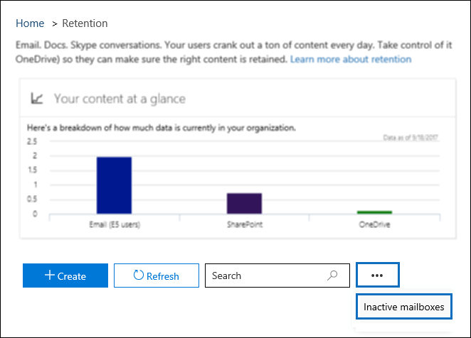

# <a name="create-and-manage-inactive-mailboxes-in-office-365"></a>Crear y administrar buzones inactivos en Office 365

Office 365 hace posible que conserve el contenido de los buzones de correo eliminados. Esta característica se denomina [buzones de correo](inactive-mailboxes-in-office-365.md)inactivos. Los buzones inactivos le permiten conservar el correo electrónico de los antiguos empleados después de que dejen la organización. Un buzón se vuelve inactivo cuando se aplica una retención por juicio o una directiva de retención de Office 365 (creada &amp; en el centro de seguridad y cumplimiento de Office 365) al buzón antes de que se elimine la cuenta de usuario de Office 365 correspondiente. El contenido de un buzón inactivo se conserva durante toda la retención que se colocó en el buzón antes de que se inactivara. Esto permite que los administradores, responsables de cumplimiento normativo y los administradores de registros usen la &amp; búsqueda de contenido en el centro de seguridad y cumplimiento para buscar y exportar el contenido de un buzón inactivo. Los buzones inactivos no pueden recibir correo electrónico y no se muestran en la libreta de direcciones compartida de la organización ni en otras listas.
  
> [!NOTE]
> Hemos pospuesto la fecha límite del 1 de julio de 2017 para crear conservaciones locales con el fin de desactivar buzones, pero más adelante este año o a principios del año que viene ya no podrá crear conservaciones locales en Exchange Online. A partir de ese momento, solo podrán usarse retenciones por juicio y directivas de retención de Office 365 para crear buzones inactivos. Aun así, se seguirán admitiendo los buzones inactivos existentes que estén en conservación local y podrá seguir administrando las conservaciones locales de buzones inactivos. Esto incluye el cambio de la duración de las conservaciones locales y la eliminación de forma permanente de buzones inactivos al quitar la conservación local. 
  
## <a name="before-you-begin"></a>Antes de empezar

- Para convertir un buzón en inactivo, se le debe asignar una licencia de plan 2 de Exchange Online para que se pueda aplicar una retención por juicio o una directiva de retención de Office 365 al buzón antes de eliminarlo. Las licencias del plan 2 de Exchange Online forman parte de las suscripciones de Office 365 Enterprise E3 y E5. Si a un buzón se le asigna una licencia de Exchange Online plan 1 (que forma parte de una suscripción a Office 365 Enterprise E1), tendrá que asignar una licencia de archivado de Exchange Online independiente para que se pueda aplicar una retención al buzón antes de que se elimine. Para obtener más información, vea archivado de [Exchange Online](https://go.microsoft.com/fwlink/p/?LinkId=286153).
    
- La licencia asociada con el buzón de Exchange Online eliminado estará disponible después de eliminar la cuenta de usuario de Office 365 correspondiente. A continuación, puede [asignar licencias a usuarios en Office 365 para empresas](https://support.office.com/article/997596b5-4173-4627-b915-36abac6786dc) a otro usuario. 
    
- Si no se aplica una retención por juicio o una directiva de retención de Office 365 en un buzón antes de eliminarlo, su contenido no se conservará y no podrá detectarse. Aun así, el buzón eliminado se puede recuperar en un plazo de 30 días a partir de su eliminación, pero el buzón junto con su contenido se eliminará permanentemente transcurrido dicho plazo, si no se recupera.
    
- Para obtener más información sobre la retención por juicio, vea conservación [local y retención por juicio](https://go.microsoft.com/fwlink/p/?LinkId=846124). Para obtener más información acerca de las directivas de retención de &amp; Office 365 en el centro de seguridad y cumplimiento, vea [información general sobre las directivas de retención en Office 365](retention-policies.md).
  
## <a name="create-an-inactive-mailbox"></a>Crear un buzón inactivo

El hecho de que un buzón esté inactivo implica dos pasos: 1) colocar el buzón en retención por juicio o aplicarle una directiva de retención de Office 365 y 2 eliminar el buzón o la cuenta de usuario de Office 365 correspondiente. Una vez que el buzón de correo está inactivo, su contenido se conserva hasta que se quite la Directiva de retención o retención.
  
### <a name="step-1-place-a-mailbox-on-litigation-hold-or-apply-an-office-365-retention-policy"></a>Paso 1: poner un buzón en retención por juicio o aplicar una directiva de retención de Office 365

Si se coloca un buzón en retención por juicio o si se aplica una directiva de retención de Office 365, se conserva el contenido del buzón antes de eliminarlo. Ambos tipos de retenciones conservarán todo el contenido del buzón, incluidos los elementos eliminados y las versiones originales de elementos modificados. Los elementos eliminados y modificados se conservan en el buzón inactivo durante un período de tiempo especificado o hasta que se elimine permanentemente el buzón inactivo mediante la eliminación de la retención o la directiva de retención aplicada a los buzones inactivos.
  
Si ya se ha colocado una retención en un buzón, o si ya se le ha aplicado una directiva de retención de Office 365, lo único que hay que hacer es eliminar la cuenta de usuario de Office 365 correspondiente, como se explica en el paso 2.
  
Para consultar los procedimientos detallados para poner un buzón en retención por juicio o aplicar una directiva de retención de Office 365, vea:
  
- [Place a mailbox on Litigation Hold](https://go.microsoft.com/fwlink/?linkid=856286)
    
- [Introducción a las directivas de retención en Office 365](retention-policies.md)
    
> [!NOTE]
> Para las retenciones por juicio y las directivas de retención de Office 365, puede crear una retención indefinida o una retención con duración definida. En una retención indefinida, el contenido del buzón inactivo se conservará siempre, hasta que se elimine la retención o hasta que se cambie la duración de la retención. Una vez quitada la retención o la directiva de retención (y siempre y cuando hayan pasado más de 30 días desde que el buzón se eliminara), el buzón inactivo se marcará para su eliminación permanente y su contenido se dejará de conservar o detectar. En una retención o directiva de retención de Office 365 con duración definida, se especifica lo que va a durar dicha retención. Esta duración se establece para cada elemento, y se calcula a partir de la fecha en que un elemento de buzón se ha recibido o creado. Una vez que ha expirado la retención para un elemento de buzón, y ese elemento se ha movido a la carpeta Elementos recuperables del buzón inactivo o se encuentra en ella, el elemento se elimina permanentemente (purga) del buzón inactivo. 
  
### <a name="step-2-delete-the-mailbox"></a>Paso 2: Eliminar el buzón.

Una vez que el buzón se coloca en retención o se le aplica una directiva de retención de Office 365, el siguiente paso consiste en eliminar el buzón. La mejor forma de eliminar un buzón es eliminar la cuenta de usuario de Office 365 correspondiente en el centro de administración de Office 365. Para obtener información acerca de cómo eliminar cuentas de usuario de Office 365, consulte [eliminar un usuario de la organización](https://support.office.com/article/d5155593-3bac-4d8d-9d8b-f4513a81479e).
  
> [!NOTE]
> También puede eliminar el buzón con el cmdlet **Remove-Mailbox** en Exchange Online PowerShell. Para obtener más información, vea [eliminar o restaurar buzones de usuario en Exchange Online](https://go.microsoft.com/fwlink/?linkid=856287). 
  

## <a name="view-a-list-of-inactive-mailboxes"></a>Ver una lista de buzones inactivos


Para ver una lista de los buzones inactivos en su organización:
  
1. Vaya a [https://protection.office.com/](https://protection.office.com/) e inicie sesión con las credenciales de una cuenta de administrador en la organización de Office 365. 
    
2. En el panel izquierdo del centro de &amp; seguridad y cumplimiento, haga clic en **gobierno** \> de datos * * retención * *.
    
3. En la página **retención** , haga clic en **más**de la barra de navegación y, a continuación, en buzones inactivos. ****
    
    
  
    Se **** muestra la página buzones inactivos. Nota se muestra el número total de buzones inactivos en la organización. 
    
    
  
Como alternativa, puede ejecutar el siguiente comando en Exchange Online PowerShell para mostrar la lista de buzones inactivos.

```
 Get-Mailbox -InactiveMailboxOnly | FT DisplayName,PrimarySMTPAddress,WhenSoftDeleted
```

Puede hacer clic  de la búsqueda para **exportar** para ver o descargar un archivo CSV que contenga información adicional acerca de los buzones inactivos en su organización. 
  
También puede ejecutar el siguiente comando para exportar la lista de buzones inactivos y otra información a un archivo CSV. En este ejemplo, el archivo CSV se crea en el directorio actual.

```
Get-Mailbox -InactiveMailboxOnly | Select Displayname,PrimarySMTPAddress,DistinguishedName,ExchangeGuid,WhenSoftDeleted | Export-Csv InactiveMailboxes.csv -NoType
```
   
> [!NOTE]
> Es posible que un buzón inactivo pueda tener la misma dirección SMTP que un buzón de usuario activo. En este caso, el valor de la propiedad **DistinguishedName** o **ExchangeGuid** puede usarse para identificar de forma exclusiva un buzón inactivo. 
  
## <a name="search-and-export-the-contents-of-an-inactive-mailbox"></a>Buscar y exportar el contenido de un buzón inactivo

Puede tener acceso al contenido del buzón inactivo mediante la herramienta de búsqueda de contenido en el centro &amp; de seguridad y cumplimiento. Cuando busca en un buzón inactivo, puede crear una consulta de búsqueda de palabras clave para buscar elementos específicos o puede devolver todo el contenido del buzón inactivo. Puede obtener una vista previa de los resultados de la búsqueda o exportar los resultados de la búsqueda a un archivo de datos de Outlook (PST) o a mensajes de correo electrónico individuales. Para conocer los procedimientos paso a paso para buscar buzones y exportar resultados de búsqueda, vea los siguientes temas:
  
- [Búsqueda de contenido en Office 365](content-search.md)
    
- [Exportar resultados de búsqueda de contenido desde el centro &amp; de seguridad y cumplimiento de Office 365](export-search-results.md)
    
Estas son algunas de las cosas que debe tener en cuenta al buscar buzones inactivos.
  
- Si una búsqueda de contenido incluye un buzón de usuario y, a continuación, dicho buzón se convierte en inactivo, la búsqueda de contenido continuará buscando en el buzón inactivo cuando vuelva a ejecutar la búsqueda después de que quede inactiva.
    
- En algunos casos, es posible que un usuario tenga un buzón activo y un buzón inactivo con la misma dirección SMTP. En este caso, solo se buscará en el buzón específico que seleccione como ubicación para una búsqueda de contenido. Es decir, si agrega el buzón de un usuario a una búsqueda, no puede suponer que se buscará en los buzones activos e inactivos; solo se buscará en el buzón que agregue explícitamente a la búsqueda.
    
- Le recomendamos encarecidamente que Evite tener un buzón activo y un buzón inactivo con la misma dirección SMTP. Si necesita volver a usar la dirección SMTP actualmente asignada a un buzón inactivo, se recomienda recuperar el buzón inactivo o restaurar el contenido de un buzón inactivo en un buzón activo (o el archivo de un buzón activo) y, a continuación, eliminar el buzón inactivo.
    
## <a name="change-the-hold-duration-for-an-inactive-mailbox"></a>Cambiar la duración de retención para un buzón inactivo

Una vez que un buzón se convierte en inactivo, puede cambiar la duración de la retención o la Directiva de retención de Office 365 aplicada al buzón inactivo. Para conocer los procedimientos paso a paso, vea [cambiar la duración de retención para un buzón inactivo en Office 365](change-the-hold-duration-for-an-inactive-mailbox.md).
  
## <a name="recover-an-inactive-mailbox"></a>Recuperar un buzón inactivo

Si un antiguo empleado vuelve a su organización, o si se contrata a un nuevo empleado para que realice las responsabilidades laborales del empleado que ha finalizado, puede recuperar el contenido del buzón inactivo. Al recuperar un buzón inactivo, el buzón se convierte en un nuevo buzón de correo, se conserva el contenido y la estructura de carpetas del buzón inactivo, y el buzón de correo se vincula a una nueva cuenta de usuario. Una vez recuperado, el buzón inactivo deja de existir. Para conocer los procedimientos paso a paso y obtener más información acerca de Cuándo recuperar un buzón inactivo, vea [recuperar un buzón inactivo en Office 365](recover-an-inactive-mailbox.md).
  
## <a name="restore-the-contents-of-an-inactive-mailbox-to-another-mailbox"></a>Restaurar el contenido de un buzón inactivo en otro buzón de correo

Si otro empleado asume las responsabilidades laborales de un antiguo empleado o si otra persona necesita acceso al contenido del buzón inactivo, puede restaurar (o combinar) el contenido del buzón inactivo en un buzón existente. Cuando se restaura un buzón inactivo, el contenido se copia en otro buzón de correo. El buzón inactivo se conserva y sigue siendo un buzón inactivo. El buzón inactivo todavía se puede buscar mediante la exhibición de documentos electrónicos, su contenido se puede restaurar a otro buzón o se puede recuperar o eliminar en una fecha posterior. Para conocer los procedimientos paso a paso, consulte [restaurar un buzón inactivo en Office 365](restore-an-inactive-mailbox.md).
  
## <a name="delete-an-inactive-mailbox"></a>Eliminar un buzón inactivo

Si ya no necesita conservar el contenido de un buzón inactivo, puede eliminar de forma permanente el buzón inactivo quitando la retención o quitando la Directiva de retención de Office 365 aplicada al buzón inactivo. Si el buzón se eliminó hace más de 30 días, el buzón se marcará para su eliminación permanente después de quitar la retención y el buzón se convertirá en no recuperable. Si el buzón se eliminó en los últimos 30 días, todavía puede recuperar el buzón de correo después de quitar la retención o la Directiva de retención. Para obtener los procedimientos paso a paso para quitar una suspensión o una directiva de retención de Office 365 para eliminar de forma permanente un buzón inactivo, vea [eliminar un buzón inactivo en Office 365](delete-an-inactive-mailbox.md).