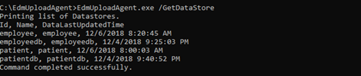
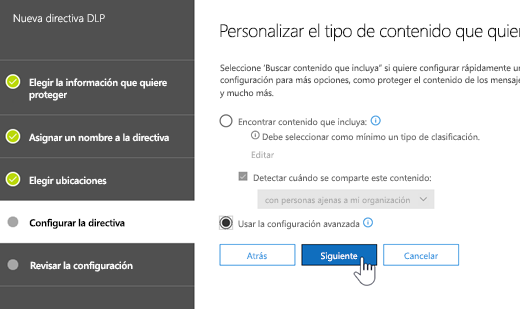
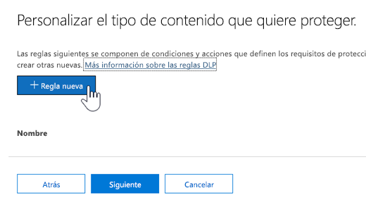
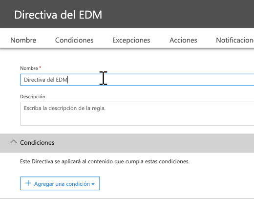
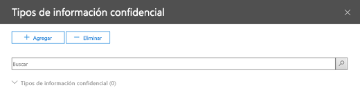

# <a name="create-custom-sensitive-information-types-with-exact-data-match-based-classification-preview"></a>Crear un tipo de información confidencial personalizado con coincidencia exacta de datos (versión preliminar)

## <a name="overview"></a>Información general

Los [tipos de información confidencial](custom-sensitive-info-types.md) se usan para ayudar a evitar el uso compartido accidental o inadecuado de información confidencial. Como administrador, puede usar el [Centro de seguridad y cumplimiento](create-a-custom-sensitive-information-type.md) o [PowerShell](create-a-custom-sensitive-information-type-in-scc-powershell.md) para definir un tipo de información confidencial basado en patrones, evidencia (palabras clave como * empleado*, *insignia*, *ID*, etc.), proximidad de caracteres (la similitud de la evidencia y los caracteres en un patrón determinado) y niveles de confianza. Estos tipos de información confidencial satisfacen las necesidades de negocio para muchas organizaciones.

Pero, ¿qué pasa si quiere un tipo de información confidencial que use valores de datos exactos, en lugar de patrones y proximidad? Con la clasificación basada en coincidencia exacta de datos (EDM), puede crear un tipo de información confidencial personalizado que está diseñado para:
- ser dinámico y actualizable;
- ser más escalable;
- generar menos falsos positivos;
- funcionar con datos confidenciales estructurados;
- trabajar con información confidencial de forma más segura; y
- usarse con varios servicios de nube de Microsoft.


La clasificación basada en EDM le permite crear tipos de información confidencial personalizados que hacen referencia a valores exactos en una base de datos de información confidencial. La base de datos puede ser actualizada diaria o semanalmente, y puede contener hasta 10 millones de filas de datos. Así que mientras los empleados, clientes o pacientes van y vienen y cambian los registros, los tipos de información confidencial se mantienen al día y aplicables. Y puede usar la clasificación basada en EDM con directivas, como [directivas de prevención de pérdida de datos](data-loss-prevention-policies.md) (DLP) o [directivas de archivo de Microsoft Cloud App Security](https://docs.microsoft.com/cloud-app-security/data-protection-policies).

## <a name="required-licenses-and-permissions"></a>Permisos y licencias necesarios

- Debe ser un administrador global, administrador de cumplimiento o administrador de Exchange Online para realizar las tareas descritas en este artículo. Para obtener más información acerca de los permisos de DLP, consulte [Permisos](data-loss-prevention-policies.md#permissions).

- Cuando esté disponible de forma general, la clasificación basada en EDM se incluirá en las siguientes suscripciones:
    - Office 365 E5
    - Microsoft 365 E5
    - Cumplimiento y protección de la información de Microsoft 365
    - Cumplimiento avanzado de Office 365

> [!NOTE]
> **Clasificación basada en EDM está actualmente en versión preliminar** para [DLP en Office 365](data-loss-prevention-policies.md) (con Exchange Online y Microsoft Teams) y [Cloud App Security](https://docs.microsoft.com/cloud-app-security). Si su organización tiene [funciones DLP](https://docs.microsoft.com/office365/servicedescriptions/exchange-online-protection-service-description/messaging-policy-and-compliance-servicedesc#data-loss-prevention-dlp), puede probar la clasificación basada en EDM. Si no está participando aún en la versión preliminar, [póngase en contacto con Microsoft](https://resources.office.com/us-landing-spe-contactus.html?LCID=EN-US) para empezar. 

## <a name="the-work-flow-at-a-glance"></a>El flujo de trabajo de un vistazo

|Fase  |Requisitos  |
|---------|---------|
|[Parte 1: Configurar la clasificación basada en EDM](#part-1-set-up-edm-based-classification)<br/><br/>(Según sea necesario)<br/>- [Editar el esquema de la base de datos](#editing-the-schema-for-edm-based-classification) <br/>- [Quitar el esquema](#removing-the-schema-for-edm-based-classification) |- Acceso de lectura a los datos confidenciales<br/>- Esquema base de datos en formato .xml (ejemplo proporcionado)<br/>- Paquete de reglas en formato .xml (ejemplo proporcionado)<br/>- Permisos de administrador para el Centro de seguridad y cumplimiento (con PowerShell) |
|[Parte 2: Indizar y cargar los datos confidenciales](#part-2-index-and-upload-the-sensitive-data)<br/><br/>(Según sea necesario)<br/>[Actualizar los datos](#refreshing-your-sensitive-information-database) |- Cuenta de usuario y de grupo de seguridad personalizado<br/>- Acceso de administrador local en el equipo con el agente de carga EDM<br/>- Acceso de lectura a los datos confidenciales<br/>- Procesar y programar la actualización de los datos|
|[Parte 3: Usar clasificación basada en EDM con los servicios de nube de Microsoft](#part-3-use-edm-based-classification-with-your-microsoft-cloud-services) |- Suscripción de Office 365 con DLP<br/>- Característica de clasificación basada en EDM habilitada (en versión preliminar) |

## <a name="part-1-set-up-edm-based-classification"></a>Parte 1: Configurar la clasificación basada en EDM

La configuración de la clasificación basada en EDM implica guardar los datos confidenciales en formato .csv, definir un esquema para la base de datos de información confidencial, crear un paquete de reglas y cargar el paquete de reglas y el esquema.

### <a name="define-the-schema-for-your-database-of-sensitive-information"></a>Definir el esquema de la base de datos de información confidencial

1. Identifique la información confidencial que quiera usar. Exporte los datos a una aplicación, como Microsoft Excel, y guarde el archivo en formato .csv. El archivo de datos puede incluir:

    - Hasta 10 millones de filas de datos confidenciales
    - Hasta 32 columnas (campos) por origen de datos

2. Estructure los datos confidenciales en el archivo .csv de forma que la primera fila incluya los nombres de los campos que se usan para la clasificación basada en EDM. En el archivo .csv, puede que tenga nombres de campo, como "NSS", "FechaNacimiento", "Nombre", "Apellido", etc. Por ejemplo, nuestro archivo .csv se llama *RegistrosPacientes.csv* e incluye las columnas *IdPaciente*, *NEM*, *apellidos*, *Nombre*, *NSS*, etc.

3. Defina el esquema de la base de datos de información confidencial en formato .xml (similar al ejemplo siguiente). Nombre este archivo de esquema `edm.xml` y configúrelo para que por cada columna de la base de datos haya una línea que use la sintaxis `<Field name="" unique="" searchable=""/>`. 

    - Use nombres de columna para los valores *Nombre de campo*.
    - Use *unique="true"* para los campos que contienen valores únicos (números de Seguridad Social, números de identificación, etc.); en caso contrario, utilice *unique="false"*.
    - Use *searchable="true"* para los campos que quiere que se puedan buscar. No especifique más de cinco campos que puedan buscarse por base de datos. El resto deben tener *searchable="false"*.  

    Por ejemplo, el siguiente archivo .xml define el esquema para una base de datos de registros de pacientes, con cinco campos especificados para la búsqueda: *IdPaciente*, *NEM*, *NSS*, * Teléfono* y *FechaNacimiento*. 
    
    (Puede copiar, modificar y usar nuestro ejemplo).
    
    ```<?xml version="1.0" encoding="utf-8"?> <EdmSchema xmlns="http://schemas.microsoft.com/office/2018/edm">
        <DataStore name="PatientRecords" description="Esquema de registros de pacientes" version="1">
            <Field name="PatientID" unique="false" searchable="true" /> <Field name="MRN" unique="false" searchable="true" />
            <Field name="FirstName" unique="false" searchable="false" />
            <Field name="LastName" unique="false" searchable="false" />
            <Field name="SSN" unique="false" searchable="true" />
            <Field name="Phone" unique="false" searchable="true" />
            <Field name="DOB" unique="false" searchable="true" />
            <Field name="Gender" unique="false" searchable="false" />
            <Field name="Address" unique="false" searchable="false" />
        </DataStore>
    </EdmSchema>
    ```

4. [Connect to Office 365 Security & Compliance Center PowerShell](https://docs.microsoft.com/powershell/exchange/office-365-scc/connect-to-scc-powershell/connect-to-scc-powershell?view=exchange-ps).

5. To upload the database schema, run the following cmdlets, one at a time:

    `$edmSchemaXml=Get-Content .\edm.xml -Encoding Byte -ReadCount 0`

    `New-DlpEdmSchema -FileData $edmSchemaXml -Confirm:$true`

    You will be prompted to confirm, as follows:

       Confirm
       Are you sure you want to perform this action?
       New EDM Schema for the data store 'patientrecords' will be imported.
       [Y] Yes  [A] Yes to All  [N] No  [L] No to All  [?] Help (default is "Y"):

    > [!TIP]
    > If you want your changes to occur without confirmation, in Step 5, use this cmdlet instead: `New-DlpEdmSchema -FileData $edmSchemaXml`
    
Now that the schema for your database of sensitive information is defined, the next step is to set up a rule package. Proceed to the section [Set up a rule package](#set-up-a-rule-package).

#### Editing the schema for EDM-based classification 

(As needed) If you want to make changes to your edm.xml file, such as changing which fields are used for EDM-based classification, follow these steps:

1. Edit your edm.mxl file (this is the file discussed in the [Define the schema](#define-the-schema-for-your-database-of-sensitive-information) section of this article).

2. [Connect to Office 365 Security & Compliance Center PowerShell](https://docs.microsoft.com/powershell/exchange/office-365-scc/connect-to-scc-powershell/connect-to-scc-powershell?view=exchange-ps).

3. To update your database schema, run the following cmdlets, one at a time:

    `$edmSchemaXml=Get-Content .\edm.xml -Encoding Byte -ReadCount 0`

    `Set-DlpEdmSchema -FileData $edmSchemaXml -Confirm:$true`

    You will be prompted to confirm, as follows:

       Confirm
       Are you sure you want to perform this action?
       EDM Schema for the data store 'patientrecords' will be updated.
       [Y] Yes  [A] Yes to All  [N] No  [L] No to All  [?] Help (default is "Y"):

    > [!TIP]
    > If you want your changes to occur without confirmation, in Step 3, use this cmdlet instead: `Set-DlpEdmSchema -FileData $edmSchemaXml`

#### Removing the schema for EDM-based classification

(As needed) If you want to remove the schema you're using for EDM-based classification, follow these steps:

1. [Connect to Office 365 Security & Compliance Center PowerShell](https://docs.microsoft.com/powershell/exchange/office-365-scc/connect-to-scc-powershell/connect-to-scc-powershell?view=exchange-ps).

2. Run the following PowerShell cmdlet, substituting the data store name of "patientrecords" with the one you want to remove:

    `Remove-DlpEdmSchema -Identity patientrecords`

     You will be prompted to confirm, as follows:
    
       Confirm
       Are you sure you want to perform this action?
       EDM Schema for the data store 'patientrecords' will be removed.
       [Y] Yes  [A] Yes to All  [N] No  [L] No to All  [?] Help (default is "Y"):
    
    > [!TIP]
    > If you want your changes to occur without confirmation, in Step 2, use this cmdlet instead: `Remove-DlpEdmSchema -Identity patientrecords -Confirm:$false`

### Set up a rule package

1. Create a rule package in .xml format (with Unicode encoding), similar to the following example. (You can copy, modify, and use our example.) 

   Recall from the previous procedure that our PatientRecords schema defines five fields as searchable: *PatientID*, *MRN*, *SSN*, *Phone*, and *DOB*. Our example rule package includes those fields and references the database schema file (edm.xml), with one *ExactMatch* items per searchable field. Consider the following ExactMatch item:

   ```
    <ExactMatch id = "E1CC861E-3FE9-4A58-82DF-4BD259EAB371" patternsProximity = "300" dataStore ="PatientRecords" recommendedConfidence = "65" > <Pattern confidenceLevel="65"> <idMatch matches = "SSN" classification = "U.S. Social Security Number (SSN)" /> </Pattern> </ExactMatch>
   ```

    In this example, note the following:

    - The dataStore name references the .csv file we created earlier: **dataStore = "PatientRecords"**.
    - The idMatch value references a searchable field that is listed in the database schema file: **idMatch matches = "SSN"**.
    - The classification value references an existing or custom sensitive information type: **classification = "U.S. Social Security Number (SSN)"**. (In this case, we use the existing sensitive information type of U.S. Social Security Number.)

    When you set up your rule package, make sure to correctly reference your .csv file and edm.xml file. (You can copy, modify, and use our example.) 

    ```<?xml version="1.0" encoding="utf-8"?>
    <RulePackage xmlns="http://schemas.microsoft.com/office/2018/edm">
      <RulePack id="fd098e03-1796-41a5-8ab6-198c93c62b11">
        <Version build="0" major="2" minor="0" revision="0" />
        <Publisher id="eb553734-8306-44b4-9ad5-c388ad970528" />
        <Details defaultLangCode="en-us">
          <LocalizedDetails langcode="en-us">
            <PublisherName>IP DLP</PublisherName>
            <Name>Health Care EDM Rulepack</Name>
            <Description>This rule package contains the EDM sensitive type for health care sensitive types.</Description>
          </LocalizedDetails>
        </Details>
      </RulePack>
      <Rules>
        <ExactMatch id = "E1CC861E-3FE9-4A58-82DF-4BD259EAB371" patternsProximity = "300" dataStore ="PatientRecords" recommendedConfidence = "65" >
          <Pattern confidenceLevel="65">
            <idMatch matches = "SSN" classification = "U.S. Social Security Number (SSN)" />
          </Pattern>
          <Pattern confidenceLevel="75">
            <idMatch matches = "SSN" classification = "U.S. Social Security Number (SSN)" />
            <Any minMatches ="3" maxMatches ="100">
              <match matches="PatientID" />
              <match matches="MRN"/>
              <match matches="FirstName"/>
              <match matches="LastName"/>
              <match matches="Phone"/>
              <match matches="DOB"/>
            </Any>
          </Pattern>
        </ExactMatch>
        <LocalizedStrings>
          <Resource idRef="E1CC861E-3FE9-4A58-82DF-4BD259EAB371">
            <Name default="true" langcode="en-us">Patient SSN Exact Match.</Name>
            <Description default="true" langcode="en-us">EDM Sensitive type for detecting Patient SSN.</Description>
          </Resource>
        </LocalizedStrings>
      </Rules>
    </RulePackage>
    ```
    
2. Cargue el paquete de reglas ejecutando los siguientes cmdlets de PowerShell, uno a uno:

    `$rulepack=Get-Content .\rulepack.xml -Encoding Byte -ReadCount 0`

    `New-DlpSensitiveInformationTypeRulePackage -FileData $rulepack`

Ya tiene configurada la clasificación basada en EDM. El siguiente paso es indexar los datos confidenciales y luego cargar los datos indizados. 

## <a name="part-2-index-and-upload-the-sensitive-data"></a>Parte 2: Indizar y cargar los datos confidenciales

Durante esta fase, configurará una cuenta de usuario y un grupo de seguridad personalizado y configurará la herramienta de agente de carga de EDM. Después, usará la herramienta para indexar los datos confidenciales y luego cargar los datos indizados.

### <a name="set-up-the-security-group-and-user-account"></a>Configuración de la cuenta de usuario y del grupo de seguridad personalizado

1. Como administrador global, vaya al centro de administración ([https://admin.microsoft.com](https://admin.microsoft.com)) y [cree un grupo de seguridad](https://docs.microsoft.com/office365/admin/email/create-edit-or-delete-a-security-group?view=o365-worldwide) denominado `EDM_DataUploaders`. 

2. Agregue uno o más usuarios al grupo de seguridad *EDM_DataUploaders*. (Estos usuarios administrarán la base de datos de información confidencial).

3. Asegúrese de que cada usuario que administra la información confidencial es un administrador local en el equipo que usa para el agente de carga de EDM.

### <a name="set-up-the-edm-upload-agent"></a>Configurar el agente de carga de EDM

> [!NOTE]
> Antes de comenzar este procedimiento, asegúrese de que es miembro del grupo de seguridad *EDM_DataUploaders* y un administrador local en el equipo.

1. Descargue e instale el agente de carga de EDM en [ https://go.microsoft.com/fwlink/?linkid=2088639 ](https://go.microsoft.com/fwlink/?linkid=2088639). De forma predeterminada, la ubicación de instalación debería ser `C:\Program Files\Microsoft\EdmUploadAgent`. 

2. Para autorizar al agente de carga de EDM, abra el símbolo de Windows (como administrador) y ejecute el siguiente comando:

    `EdmUploadAgent.exe /Authorize`

3. Inicie con su cuenta profesional o educativa de Office 365.

El siguiente paso es usar el agente de carga de EDM para indexar los datos confidenciales y luego cargar los datos indizados.

### <a name="index-and-upload-the-sensitive-data"></a>Indizar y cargar los datos confidenciales

1. Guarde el archivo de datos confidenciales (recuerde que nuestro ejemplo es *RegistroPacientes.csv*) en la unidad local en el equipo. (Guardamos nuestro archivo de ejemplo *RegistroPacientes.csv* en `C:\Edm\Data`.)

2. Para indizar los datos confidenciales, ejecute el siguiente comando en el símbolo de Windows:

    `EdmUploadAgent.exe /CreateHash /DataStoreName <DataStoreName> /DataFile <DataFilePath> /HashLocation <HashedFileLocation>`

    Ejemplo: **EdmUploadAgent.exe /CreateHash /DataStoreName PatientRecords /DataFile C:\Edm\Data\RegistroPacientes.csv HashLocation C:\Edm\Hash** 

3. Para cargar los datos indizados, ejecute el siguiente comando en el símbolo de Windows:

    `EdmUploadAgent.exe /UploadHash /DataStoreName <DataStoreName> /HashFile <HashedSourceFilePath>`

    Example: **EdmUploadAgent.exe /UploadHash /DataStoreName RegistroPacientes /HashFile C:\Edm\Hash\RegistroPacientes.EdmHash** 

4. Para comprobar que se han cargado los datos confidenciales, ejecute el siguiente comando en el símbolo de Windows:

    `EdmUploadAgent.exe /GetDataStore`

    Verá una lista de almacenes de datos y la última vez que se actualizaron, como se muestra a continuación: <br/>

5. Continúe con el proceso de configuración y programación para [actualizar la base de datos de información confidencial](#refreshing-your-sensitive-information-database).

En este momento, está listo para usar la clasificación basada en EDM con los servicios de nube de Microsoft. Por ejemplo, puede [configurar una directiva DLP con clasificación basada en EDM](#to-create-a-dlp-policy-with-edm). 

### <a name="refreshing-your-sensitive-information-database"></a>Actualizar la base de datos de información confidencial

Puede actualizar la base de datos de información confidencial de forma diaria o semanal, la herramienta de carga de EDM puede volver a indizar los datos confidenciales y cargar de nuevo los datos indizados. 

1. Determine el proceso y la frecuencia (diaria o semanal) para actualizar la base de datos de información confidencial.

2. Vuelva a exportar los datos confidenciales a una aplicación, como Microsoft Excel, y guarde el archivo en formato .csv. Mantenga el mismo nombre de archivo y la ubicación que usó cuando siguió los pasos descritos en [Indizar y cargar los datos confidenciales](#index-and-upload-the-sensitive-data).

    > [!NOTE]
    > Si no hay ningún cambio en la estructura (nombres de campo) del archivo .csv, no necesita realizar cambios en el archivo de esquema de la base de datos al actualizar los datos. Pero si necesita realizar cambios, asegúrese de editar el [esquema de la base de datos](#editing-the-schema-for-edm-based-classification) y su [paquete de reglas](#set-up-a-rule-package) consecuentemente.        

3. Use el [Programador de tareas](https://docs.microsoft.com/windows/desktop/TaskSchd/task-scheduler-start-page) para automatizar los pasos 2 y 3 en el procedimiento [Indizar y cargar los datos confidenciales](#index-and-upload-the-sensitive-data). Puede programar tareas con varios métodos:
    
    |Método  |Qué hacer  |
    |---------|---------|
    |Windows PowerShell     |Consulte la documentación [TareasProgramadas](https://docs.microsoft.com/powershell/module/scheduledtasks/?view=win10-ps) y [script de PowerShell de ejemplo](#example-powershell-script-for-task-scheduler) de este artículo|
    |API del Programador de tareas |Consulte la documentación del [Programador de tareas](https://docs.microsoft.com/windows/desktop/TaskSchd/using-the-task-scheduler) |
    |Interfaz de usuario de Windows     |En Windows, haga clic en **Inicio** y escriba `Task Scheduler`. A continuación, en la lista de resultados, haga clic en **Programador de tareas** y **Ejecutar como administrador**.          |

#### <a name="example-powershell-script-for-task-scheduler"></a>Script de PowerShell de ejemplo para el Programador de tareas

Esta sección incluye un script de PowerShell de ejemplo que puede usar para programar las tareas de indización de datos y carga de los datos indizados:

```powershell
param([string]$dataStoreName,[string]$fileLocation)
# Assuming current user is also the user context to run the task
$user = "$env:USERDOMAIN\$env:USERNAME"
$edminstallpath = 'C:\Program Files\Microsoft\EdmUploadAgent\'
$edmuploader = $edminstallpath + 'EdmUploadAgent.exe'
$csvext = '.csv'
$edmext = '.EdmHash'
# Assuming CSV file name is same as data store name
$dataFile = "$fileLocation\$dataStoreName$csvext"
$hashFile = "$fileLocation\$dataStoreName$edmext"
# Assuming location to store hash file is same as the location of csv file
$hashLocation = $fileLocation
$createHashArgs = '/CreateHash /DataStoreName ' + $dataStoreName + ' /DataFile ' + $dataFile + ' /HashLocation ' + $hashLocation
$uploadHashArgs = '/UploadHash /DataStoreName ' + $dataStoreName + ' /HashFile ' + $hashFile
# Set up actions associated with the task
$actions = @()
$actions += New-ScheduledTaskAction -Execute $edmuploader -Argument $createHashArgs -WorkingDirectory $edminstallpath
$actions += New-ScheduledTaskAction -Execute $edmuploader -Argument $uploadHashArgs -WorkingDirectory $edminstallpath
# Set up trigger for the task
$trigger = New-ScheduledTaskTrigger -Weekly -DaysOfWeek Sunday -At 2am
# Set up task settings
$principal = New-ScheduledTaskPrincipal -UserId $user -LogonType S4U -RunLevel Highest
$settings = New-ScheduledTaskSettingsSet -RunOnlyIfNetworkAvailable -StartWhenAvailable -WakeToRun
# Create the scheduled task
$scheduledTask = New-ScheduledTask -Action $actions -Principal $principal -Trigger $trigger -Settings $settings
# Get credentials to run the task
$creds = Get-Credential -UserName $user -Message "Enter credentials to run the task"
$password=[Runtime.InteropServices.Marshal]::PtrToStringAuto([Runtime.InteropServices.Marshal]::SecureStringToBSTR($creds.Password))
# Register the scheduled task
$taskName = 'EDMUpload_' + $dataStoreName
Register-ScheduledTask -TaskName $taskName -InputObject $scheduledTask -User $user -Password $password
```
## <a name="part-3-use-edm-based-classification-with-your-microsoft-cloud-services"></a>Parte 3: Usar clasificación basada en EDM con los servicios de nube de Microsoft

Puede usar la clasificación basada en EDM con características de protección de información, como [directivas DLP de Office 365](data-loss-prevention-policies.md) y [directivas de archivo de Microsoft Cloud App Security](https://docs.microsoft.com/cloud-app-security/data-protection-policies). El procedimiento siguiente describe cómo usar EDM con una directiva DLP que se crea en el Centro de seguridad y cumplimiento de Office 365.

### <a name="to-create-a-dlp-policy-with-edm"></a>Para crear una directiva DLP con EDM

1. Vaya al Centro de seguridad y cumplimiento ([https://protection.office.com](https://protection.office.com)).

2. Haga clic en **Prevención de pérdida de datos** > **Directiva**.

3. Elija **Crear una directiva** > **Personalizada** > **Siguiente**.

4. En la pestaña **Nombre de la directiva**, especifique un nombre y una descripción y elija **Siguiente**.

5. En la pestaña **Elegir ubicaciones**, haga clic en **Permitir elegir ubicaciones concretas** y luego en **Siguiente**.<br/><br/>

6. En la columna **Estado**, seleccione **correo electrónico de Exchange ** y luego elija **Siguiente**. <br/><br/>

7. En la pestaña **Configuración de directiva**, elija **Usar la configuración avanzada** y luego elija **Siguiente**.<br/><br/>

8. Elija **+ nueva regla**.<br/><br/>

9. En la sección **Nombre**, especifique un nombre y una descripción para la regla.<br/><br/>

10. En la sección **Condiciones** en la lista **+ Agregar una condición**, elija **El contenido incluye tipo confidencial**.<br/><br/>

11. Busque el tipo de información confidencial que creó al configurar el paquete de reglas y elija **+ Agregar**.<br/><br/>Elija **Hecho**.

12. Termine de seleccionar las opciones para la regla, como **Notificaciones de usuario**, **Invalidaciones de usuario**, **Informes de incidentes**, etc. y luego elija **Guardar**.

13. En la pestaña **Configuración de directiva**, revise las reglas y elija **Siguiente**.

14. Especifique si quiere activar la directiva inmediatamente, probarla o dejarla desactivada. A continuación, elija **Siguiente**.

15. En la pestaña **Revisar la configuración**, revise la directiva. Realice los cambios necesarios. Cuando haya terminado, seleccione **Crear**.

    > [!NOTE]
    > Espere aproximadamente una hora para que la nueva directiva DLP pase por el centro de datos.

## <a name="related-articles"></a>Artículos relacionados

[Tipos de información confidencial integrados y lo que buscan](what-the-sensitive-information-types-look-for.md)

[Tipos de información confidencial personalizados](custom-sensitive-info-types.md)

[Información general de directivas DLP](data-loss-prevention-policies.md)

[Microsoft Cloud App Security](https://docs.microsoft.com/cloud-app-security)
