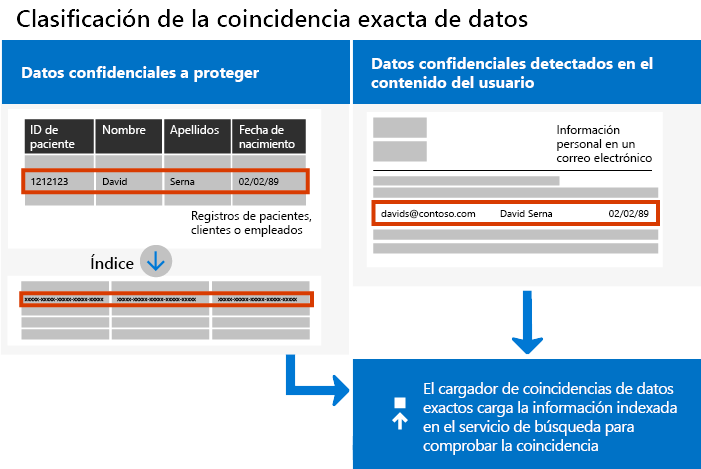
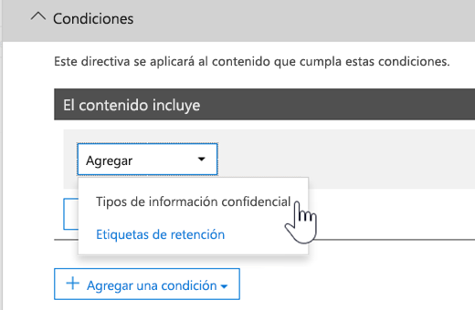

# <a name="create-custom-sensitive-information-types-with-exact-data-match-based-classification"></a><span data-ttu-id="de0f9-103">Crear un tipo de información confidencial personalizado con clasificación basada en coincidencia exacta de datos</span><span class="sxs-lookup"><span data-stu-id="de0f9-103">See Create a custom sensitive information type with Exact Data Match based classification (Preview).</span></span>

## <a name="overview"></a><span data-ttu-id="de0f9-104">Información general</span><span class="sxs-lookup"><span data-stu-id="de0f9-104">Overview</span></span>

<span data-ttu-id="de0f9-105">Los [tipos de información confidencial](https://docs.microsoft.com/es-ES/office365/securitycompliance/custom-sensitive-info-types) se usan para ayudar a evitar el uso compartido accidental o inadecuado de información confidencial.</span><span class="sxs-lookup"><span data-stu-id="de0f9-105">[Custom sensitive information types](https://docs.microsoft.com/en-us/office365/securitycompliance/custom-sensitive-info-types) are used to help prevent inadvertent or inappropriate sharing of sensitive information.</span></span> <span data-ttu-id="de0f9-106">Como administrador, puede usar el  [Centro de seguridad y cumplimiento](https://docs.microsoft.com/es-ES/office365/securitycompliance/create-a-custom-sensitive-information-type) o [PowerShell](https://docs.microsoft.com/es-ES/office365/securitycompliance/create-a-custom-sensitive-information-type-in-scc-powershell) para definir un tipo de información confidencial basado en patrones, evidencia (palabras clave como *empleado*, *insignia*, *id.*, etc.), proximidad de caracteres (la similitud de la evidencia y los caracteres en un patrón determinado) y niveles de confianza.</span><span class="sxs-lookup"><span data-stu-id="de0f9-106">As an administrator, you can use the [Security & Compliance Center](https://docs.microsoft.com/en-us/office365/securitycompliance/create-a-custom-sensitive-information-type) or [PowerShell](https://docs.microsoft.com/en-us/office365/securitycompliance/create-a-custom-sensitive-information-type-in-scc-powershell) to define a custom sensitive information type based on patterns, evidence (keywords such as *employee*, *badge*, *ID*, and so on), character proximity (how close evidence is to characters in a particular pattern), and confidence levels.</span></span> <span data-ttu-id="de0f9-107">Estos tipos de información confidencial satisfacen las necesidades de negocio para muchas organizaciones.</span><span class="sxs-lookup"><span data-stu-id="de0f9-107">Such custom sensitive information types meet business needs for many organizations.</span></span>

<span data-ttu-id="de0f9-108">Pero, ¿qué pasa si quiere un tipo de información confidencial que use valores de datos exactos, en lugar de coincidir solo con patrones genéricos?</span><span class="sxs-lookup"><span data-stu-id="de0f9-108">But what if you wanted a custom sensitive information type that uses exact data values, instead of matching only with generic patterns?</span></span> <span data-ttu-id="de0f9-109">Con la clasificación basada en coincidencia exacta de datos (EDM), puede crear un tipo de información confidencial personalizado que está diseñado para:</span><span class="sxs-lookup"><span data-stu-id="de0f9-109">With Exact Data Match (EDM)-based classification, you can create a custom sensitive information type that is designed to:</span></span>

- <span data-ttu-id="de0f9-110">ser dinámico y actualizable;</span><span class="sxs-lookup"><span data-stu-id="de0f9-110">be dynamic and refreshable;</span></span>
- <span data-ttu-id="de0f9-111">ser más escalable;</span><span class="sxs-lookup"><span data-stu-id="de0f9-111">be more scalable;</span></span>
- <span data-ttu-id="de0f9-112">generar menos falsos positivos;</span><span class="sxs-lookup"><span data-stu-id="de0f9-112">result in fewer false-positives;</span></span>
- <span data-ttu-id="de0f9-113">funcionar con datos confidenciales estructurados;</span><span class="sxs-lookup"><span data-stu-id="de0f9-113">work with structured sensitive data;</span></span>
- <span data-ttu-id="de0f9-114">trabajar con información confidencial de forma más segura; y</span><span class="sxs-lookup"><span data-stu-id="de0f9-114">handle sensitive information more securely; and</span></span>
- <span data-ttu-id="de0f9-115">usarse con varios servicios de nube de Microsoft.</span><span class="sxs-lookup"><span data-stu-id="de0f9-115">be used with several Microsoft cloud services.</span></span>



<span data-ttu-id="de0f9-117">La clasificación basada en EDM le permite crear tipos de información confidencial personalizados que hacen referencia a valores exactos en una base de datos de información confidencial.</span><span class="sxs-lookup"><span data-stu-id="de0f9-117">EDM-based classification enables you to create custom sensitive information types that refer to exact values in a database of sensitive information.</span></span> <span data-ttu-id="de0f9-118">La base de datos puede ser actualizada diaria o semanalmente, y puede contener hasta 10 millones de filas de datos.</span><span class="sxs-lookup"><span data-stu-id="de0f9-118">The database can be refreshed daily or weekly, and it can contain up to 10 million rows of data.</span></span> <span data-ttu-id="de0f9-119">Así que mientras los empleados, clientes o pacientes van y vienen y cambian los registros, los tipos de información confidencial se mantienen al día y aplicables.</span><span class="sxs-lookup"><span data-stu-id="de0f9-119">So as employees, patients, or clients come and go, and records change, your custom sensitive information types remain current and applicable.</span></span> <span data-ttu-id="de0f9-120">Y puede usar la clasificación basada en EDM con directivas, como [directivas de prevención de pérdida de datos](https://docs.microsoft.com/es-ES/office365/securitycompliance/data-loss-prevention-policies) (DLP) o [directivas de archivo de Microsoft Cloud App Security](https://docs.microsoft.com/cloud-app-security/data-protection-policies).</span><span class="sxs-lookup"><span data-stu-id="de0f9-120">And, you can use EDM-based classification with policies, such as [data loss prevention policies](https://docs.microsoft.com/en-us/office365/securitycompliance/data-loss-prevention-policies) (DLP) or [Microsoft Cloud App Security file policies](https://docs.microsoft.com/cloud-app-security/data-protection-policies).</span></span>

## <a name="required-licenses-and-permissions"></a><span data-ttu-id="de0f9-121">Permisos y licencias necesarios</span><span class="sxs-lookup"><span data-stu-id="de0f9-121">Required licenses and permissions</span></span>

<span data-ttu-id="de0f9-122">Debe ser un administrador global, administrador de cumplimiento o administrador de Exchange Online para realizar las tareas descritas en este artículo.</span><span class="sxs-lookup"><span data-stu-id="de0f9-122">You must be a global admin, compliance administrator, or Exchange Online administrator to perform the tasks described in this article.</span></span> <span data-ttu-id="de0f9-123">Para obtener más información acerca de los permisos de DLP, vea [Permisos](https://docs.microsoft.com/es-ES/office365/securitycompliance/data-loss-prevention-policies#permissions).</span><span class="sxs-lookup"><span data-stu-id="de0f9-123">To learn more about DLP permissions, see [Permissions](https://docs.microsoft.com/en-us/office365/securitycompliance/data-loss-prevention-policies#permissions).</span></span>

<span data-ttu-id="de0f9-124">Cuando esté disponible de forma general, la clasificación basada en EDM se incluirá en estas suscripciones:</span><span class="sxs-lookup"><span data-stu-id="de0f9-124">When generally available, EDM-based classification will be included in these subscriptions</span></span>

- <span data-ttu-id="de0f9-125">Office 365 E5</span><span class="sxs-lookup"><span data-stu-id="de0f9-125">Office 365 Enterprise E5</span></span>
- <span data-ttu-id="de0f9-126">Microsoft 365 E5</span><span class="sxs-lookup"><span data-stu-id="de0f9-126">Microsoft 365 E5</span></span>
- <span data-ttu-id="de0f9-127">Cumplimiento y protección de la información de Microsoft 365</span><span class="sxs-lookup"><span data-stu-id="de0f9-127">Microsoft 365 Information Protection and Compliance</span></span>
- <span data-ttu-id="de0f9-128">Cumplimiento avanzado de Office 365</span><span class="sxs-lookup"><span data-stu-id="de0f9-128">Office 365 Advanced Compliance</span></span>

## <a name="the-work-flow-at-a-glance"></a><span data-ttu-id="de0f9-129">El flujo de trabajo de un vistazo</span><span class="sxs-lookup"><span data-stu-id="de0f9-129">The work flow at a glance</span></span>

|<span data-ttu-id="de0f9-130">Fase</span><span class="sxs-lookup"><span data-stu-id="de0f9-130">Phase</span></span>  |<span data-ttu-id="de0f9-131">Requisitos</span><span class="sxs-lookup"><span data-stu-id="de0f9-131">What's needed</span></span>  |
|---------|---------|
|[<span data-ttu-id="de0f9-132">Parte 1: Configurar la clasificación basada en EDM</span><span class="sxs-lookup"><span data-stu-id="de0f9-132">Part 1: Set up EDM-based classification</span></span>](#part-1-set-up-edm-based-classification)<br/><br/><span data-ttu-id="de0f9-133">(Según sea necesario)</span><span class="sxs-lookup"><span data-stu-id="de0f9-133">(As needed)</span></span><br/><span data-ttu-id="de0f9-134">- [Editar el esquema de la base de datos](#editing-the-schema-for-edm-based-classification)</span><span class="sxs-lookup"><span data-stu-id="de0f9-134">- [Edit the database schema](#editing-the-schema-for-edm-based-classification)</span></span> <br/><span data-ttu-id="de0f9-135">- [Quitar el esquema](#removing-the-schema-for-edm-based-classification)</span><span class="sxs-lookup"><span data-stu-id="de0f9-135">- [Remove the schema](#removing-the-schema-for-edm-based-classification)</span></span> |<span data-ttu-id="de0f9-136">- Acceso de lectura a los datos confidenciales</span><span class="sxs-lookup"><span data-stu-id="de0f9-136">- Read access to the sensitive data</span></span><br/><span data-ttu-id="de0f9-137">- Esquema base de datos en formato .xml (ejemplo proporcionado)</span><span class="sxs-lookup"><span data-stu-id="de0f9-137">- Database schema in .xml format (example provided)</span></span><br/><span data-ttu-id="de0f9-138">- Paquete de reglas en formato .xml (ejemplo proporcionado)</span><span class="sxs-lookup"><span data-stu-id="de0f9-138">- Rule package in .xml format (example provided)</span></span><br/><span data-ttu-id="de0f9-139">- Permisos de administrador para el Centro de seguridad y cumplimiento (con PowerShell)</span><span class="sxs-lookup"><span data-stu-id="de0f9-139">- Admin permissions to the Security & Compliance Center (using PowerShell)</span></span> |
|[<span data-ttu-id="de0f9-140">Parte 2: Indizar y cargar los datos confidenciales</span><span class="sxs-lookup"><span data-stu-id="de0f9-140">Part 2: Index and upload the sensitive data</span></span>](#part-2-index-and-upload-the-sensitive-data)<br/><br/><span data-ttu-id="de0f9-141">(Según sea necesario)</span><span class="sxs-lookup"><span data-stu-id="de0f9-141">(As needed)</span></span><br/>[<span data-ttu-id="de0f9-142">Actualizar los datos</span><span class="sxs-lookup"><span data-stu-id="de0f9-142">Refresh the data</span></span>](#refreshing-your-sensitive-information-database) |<span data-ttu-id="de0f9-143">- Cuenta de usuario y de grupo de seguridad personalizado</span><span class="sxs-lookup"><span data-stu-id="de0f9-143">- Custom security group and user account</span></span><br/><span data-ttu-id="de0f9-144">- Acceso de administrador local en el equipo con el agente de carga EDM</span><span class="sxs-lookup"><span data-stu-id="de0f9-144">- Local admin access to machine with EDM Upload Agent</span></span><br/><span data-ttu-id="de0f9-145">- Acceso de lectura a los datos confidenciales</span><span class="sxs-lookup"><span data-stu-id="de0f9-145">- Read access to the sensitive data</span></span><br/><span data-ttu-id="de0f9-146">- Procesar y programar la actualización de los datos</span><span class="sxs-lookup"><span data-stu-id="de0f9-146">- Process and schedule for refreshing the data</span></span>|
|[<span data-ttu-id="de0f9-147">Parte 3: Usar clasificación basada en EDM con los servicios de nube de Microsoft</span><span class="sxs-lookup"><span data-stu-id="de0f9-147">Part 3: Use EDM-based classification with your Microsoft cloud services</span></span>](#part-3-use-edm-based-classification-with-your-microsoft-cloud-services) |<span data-ttu-id="de0f9-148">- Suscripción de Office 365 con DLP</span><span class="sxs-lookup"><span data-stu-id="de0f9-148">- Office 365 subscription with DLP</span></span><br/><span data-ttu-id="de0f9-149">- Característica de clasificación basada en EDM habilitada</span><span class="sxs-lookup"><span data-stu-id="de0f9-149">- EDM-based classification feature enabled</span></span> |

### <a name="part-1-set-up-edm-based-classification"></a><span data-ttu-id="de0f9-150">Parte 1: Configurar la clasificación basada en EDM</span><span class="sxs-lookup"><span data-stu-id="de0f9-150">Part 1: Set up EDM-based classification</span></span>

<span data-ttu-id="de0f9-151">La configuración de la clasificación basada en EDM implica guardar los datos confidenciales en formato .csv, definir un esquema para la base de datos de información confidencial, crear un paquete de reglas y cargar el paquete de reglas y el esquema.</span><span class="sxs-lookup"><span data-stu-id="de0f9-151">Setting up and configuring EDM-based classification involves saving sensitive data in .csv format, defining a schema for your database of sensitive information, creating a rule package, and then uploading the schema and rule package.</span></span>

#### <a name="define-the-schema-for-your-database-of-sensitive-information"></a><span data-ttu-id="de0f9-152">Definir el esquema de la base de datos de información confidencial</span><span class="sxs-lookup"><span data-stu-id="de0f9-152">Define the schema for your database of sensitive information</span></span>

1. <span data-ttu-id="de0f9-153">Identifique la información confidencial que quiera usar.</span><span class="sxs-lookup"><span data-stu-id="de0f9-153">Identify the KPIs that you want to use.</span></span> <span data-ttu-id="de0f9-154">Exporte los datos a una aplicación, como Microsoft Excel, y guarde el archivo en formato .csv.</span><span class="sxs-lookup"><span data-stu-id="de0f9-154">Export the data to an app, such as Microsoft Excel, and save the file in .csv format.</span></span> <span data-ttu-id="de0f9-155">El archivo de datos puede incluir un máximo de:</span><span class="sxs-lookup"><span data-stu-id="de0f9-155">The data file can include a maximum of:</span></span>
      - <span data-ttu-id="de0f9-156">Hasta 10 millones de filas de datos confidenciales</span><span class="sxs-lookup"><span data-stu-id="de0f9-156">Up to 10 million rows of sensitive data</span></span>
      - <span data-ttu-id="de0f9-157">Hasta 32 columnas (campos) por origen de datos</span><span class="sxs-lookup"><span data-stu-id="de0f9-157">Up to 32 columns (fields) per data source</span></span>
      - <span data-ttu-id="de0f9-158">Hasta 5 columnas (campos) marcadas como utilizables en búsquedas</span><span class="sxs-lookup"><span data-stu-id="de0f9-158">Up to 5 columns (fields) marked as searchable</span></span>

2. <span data-ttu-id="de0f9-159">Estructure los datos confidenciales en el archivo .csv de forma que la primera fila incluya los nombres de los campos que se usan para la clasificación basada en EDM.</span><span class="sxs-lookup"><span data-stu-id="de0f9-159">Structure the sensitive data in the .csv file such that the first row includes the names of the fields used for EDM-based classification.</span></span> <span data-ttu-id="de0f9-160">En el archivo .csv, puede que tenga nombres de campo, como "NSS", "FechaNacimiento", "Nombre", "Apellido", etc.</span><span class="sxs-lookup"><span data-stu-id="de0f9-160">In your .csv file, you might have field names, such as "ssn", "birthdate", "firstname", "lastname", and so on.</span></span> <span data-ttu-id="de0f9-161">Por ejemplo, nuestro archivo .csv se llama *RegistrosPacientes.csv* e incluye las columnas *IdPaciente*,  *NEM*, *Apellidos*, *Nombre*, *NSS* , etc.</span><span class="sxs-lookup"><span data-stu-id="de0f9-161">As an example, our .csv file is called *PatientRecords.csv*, and its columns include *PatientID*, *MRN*, *LastName*, *FirstName*, *SSN* and more.</span></span>

3. <span data-ttu-id="de0f9-162">Defina el esquema de la base de datos de información confidencial en formato .xml (similar al ejemplo siguiente).</span><span class="sxs-lookup"><span data-stu-id="de0f9-162">Define the schema for the database of sensitive information in .xml format (similar to our example below).</span></span> <span data-ttu-id="de0f9-163">Nombre este archivo de esquema edm.xml y configúrelo para que por cada columna de la base de datos haya una línea que use la sintaxis \<Field name="" searchable=""/\>.</span><span class="sxs-lookup"><span data-stu-id="de0f9-163">Name this schema file edm.xml, and configure it such that for each column in the database, there is a line that uses the syntax \<Field name="" searchable=""/\>.</span></span>

      - <span data-ttu-id="de0f9-164">Use nombres de columna para los valores *Nombre de campo* .</span><span class="sxs-lookup"><span data-stu-id="de0f9-164">Use column names for *Field name* values.</span></span>
      - <span data-ttu-id="de0f9-165">Use *searchable="true"* para los campos que quiere que se puedan buscar, hasta un máximo de 5 campos.</span><span class="sxs-lookup"><span data-stu-id="de0f9-165">Use *searchable="true"* for the fields that you want to be searchable up to a maximum of 5 fields.</span></span> <span data-ttu-id="de0f9-166">Debe designar un mínimo de un campo como utilizable para búsqueda.</span><span class="sxs-lookup"><span data-stu-id="de0f9-166">You must designate a minimum of one field as searchable.</span></span>

<span data-ttu-id="de0f9-167">Por ejemplo, el siguiente archivo .xml define el esquema para una base de datos de registros de pacientes, con cinco campos especificados para la búsqueda: *IdPaciente*, *NEM*,  *NSS*, *Teléfono* y *FechaNacimiento*.</span><span class="sxs-lookup"><span data-stu-id="de0f9-167">As an example, the following .xml file defines the schema for a patient records database, with five fields specified as searchable: *PatientID*, *MRN*, *SSN*, *Phone*, and *DOB*.</span></span>

<span data-ttu-id="de0f9-168">(Puede copiar, modificar y usar nuestro ejemplo).</span><span class="sxs-lookup"><span data-stu-id="de0f9-168">(You can copy, modify, and use our example.)</span></span>

 ```xml
<EdmSchema xmlns="http://schemas.microsoft.com/office/2018/edm">
      <DataStore name="PatientRecords" description="Schema for patient records" version="1">
            <Field name="PatientID" searchable="true" />
            <Field name="MRN" searchable="true" />
            <Field name="FirstName" />
            <Field name="LastName" />
            <Field name="SSN" searchable="true" />
            <Field name="Phone" searchable="true" />
            <Field name="DOB" searchable="true" />
            <Field name="Gender" />
            <Field name="Address" />
      </DataStore>
</EdmSchema>
```

4. <span data-ttu-id="de0f9-169">[Conéctese a PowerShell del Centro de seguridad y cumplimiento de Office 365](https://docs.microsoft.com/powershell/exchange/office-365-scc/connect-to-scc-powershell/connect-to-scc-powershell?view=exchange-ps).</span><span class="sxs-lookup"><span data-stu-id="de0f9-169">[Connect to Office 365 Security & Compliance Center PowerShell](https://docs.microsoft.com/powershell/exchange/office-365-scc/connect-to-scc-powershell/connect-to-scc-powershell?view=exchange-ps)</span></span>

5. <span data-ttu-id="de0f9-170">Para cargar el esquema de la base de datos, ejecute, uno a la vez, los siguientes cmdlets:</span><span class="sxs-lookup"><span data-stu-id="de0f9-170">To upload the database schema, run the following cmdlets, one at a time:</span></span>

```powershell
$edmSchemaXml=Get-Content .\\edm.xml -Encoding Byte -ReadCount 0
New-DlpEdmSchema -FileData $edmSchemaXml -Confirm:$true
```

<span data-ttu-id="de0f9-171">Se le pedirá que confirme lo siguiente:</span><span class="sxs-lookup"><span data-stu-id="de0f9-171">You will be prompted to confirm, as follows:</span></span>

> <span data-ttu-id="de0f9-172">Confirmar</span><span class="sxs-lookup"><span data-stu-id="de0f9-172">Confirm</span></span>
>
> <span data-ttu-id="de0f9-173">¿Está seguro de que desea realizar esta acción?</span><span class="sxs-lookup"><span data-stu-id="de0f9-173">ConfirmAre you sure you want to perform this action?</span></span>
>
> <span data-ttu-id="de0f9-174">Se importará el nuevo esquema EDM para el almacén de datos "registrospacientes".</span><span class="sxs-lookup"><span data-stu-id="de0f9-174">New EDM Schema for the data store 'patientrecords' will be imported.</span></span>
>
> <span data-ttu-id="de0f9-175">¿\[S\] Sí \[T\] Sí a todo \[N\] No \[A\] No a todo \[?\] Ayuda (el valor predeterminado es "S"):</span><span class="sxs-lookup"><span data-stu-id="de0f9-175">\[Y\] Yes \[A\] Yes to All \[N\] No \[L\] No to All \[?\] Help (default is "Y"):</span></span>

> [!TIP]
> <span data-ttu-id="de0f9-176">Si quiere que los cambios se realicen sin confirmación, en el paso 5, use este cmdlet: New-DlpEdmSchema -FileData $edmSchemaXml</span><span class="sxs-lookup"><span data-stu-id="de0f9-176">If you want your changes to occur without confirmation, in Step 5, use this cmdlet instead: New-DlpEdmSchema -FileData $edmSchemaXml</span></span>

> [!NOTE]
> <span data-ttu-id="de0f9-177">La actualización de EDMSchema con adiciones puede tardar de 10 a 60 minutos.</span><span class="sxs-lookup"><span data-stu-id="de0f9-177">It can take between 10-60 minutes to update the EDMSchema with additions.</span></span> <span data-ttu-id="de0f9-178">La actualización debe completarse antes de ejecutar los pasos que usan las adiciones.</span><span class="sxs-lookup"><span data-stu-id="de0f9-178">The update must complete before you execute steps that use the additions.</span></span>

<span data-ttu-id="de0f9-179">Ahora que se ha definido el esquema de la base de datos de información confidencial, el siguiente paso es configurar un paquete de reglas.</span><span class="sxs-lookup"><span data-stu-id="de0f9-179">Now that the schema for your database of sensitive information is defined, the next step is to set up a rule package.</span></span> <span data-ttu-id="de0f9-180">Vaya a la sección [Configurar un paquete de reglas](#set-up-a-rule-package).</span><span class="sxs-lookup"><span data-stu-id="de0f9-180">Proceed to the section [Set up a rule package](#set-up-a-rule-package).</span></span>

#### <a name="editing-the-schema-for-edm-based-classification"></a><span data-ttu-id="de0f9-181">Editar el esquema de la clasificación basada en EDM</span><span class="sxs-lookup"><span data-stu-id="de0f9-181">Editing the schema for EDM-based classification</span></span>

<span data-ttu-id="de0f9-182">Si quiere realizar cambios en el archivo edm.xml, como cambiar los campos que se usan para la clasificación basada en EDM, siga estos pasos:</span><span class="sxs-lookup"><span data-stu-id="de0f9-182">If you want to make changes to your edm.xml file, such as changing which fields are used for EDM-based classification, follow these steps:</span></span>

1. <span data-ttu-id="de0f9-183">Edite el archivo edm.xml (este es el archivo tratado en la sección [Definir el esquema](#define-the-schema-for-your-database-of-sensitive-information) de este artículo).</span><span class="sxs-lookup"><span data-stu-id="de0f9-183">Edit your edm.xml file (this is the file discussed in the [Define the schema](#define-the-schema-for-your-database-of-sensitive-information) section of this article).</span></span>

2. <span data-ttu-id="de0f9-184">[Conéctese a PowerShell del Centro de seguridad y cumplimiento de Office 365](https://docs.microsoft.com/powershell/exchange/office-365-scc/connect-to-scc-powershell/connect-to-scc-powershell?view=exchange-ps).</span><span class="sxs-lookup"><span data-stu-id="de0f9-184">[Connect to Office 365 Security & Compliance Center PowerShell](https://docs.microsoft.com/powershell/exchange/office-365-scc/connect-to-scc-powershell/connect-to-scc-powershell?view=exchange-ps)</span></span>

3. <span data-ttu-id="de0f9-185">Para actualizar el esquema de la base de datos, ejecute, uno a la vez, los siguientes cmdlets:</span><span class="sxs-lookup"><span data-stu-id="de0f9-185">To update your database schema, run the following cmdlets, one at a time:</span></span>

```powershell
$edmSchemaXml=Get-Content .\\edm.xml -Encoding Byte -ReadCount 0
Set-DlpEdmSchema -FileData $edmSchemaXml -Confirm:$true
```

<span data-ttu-id="de0f9-186">Se le pedirá que confirme lo siguiente:</span><span class="sxs-lookup"><span data-stu-id="de0f9-186">You will be prompted to confirm, as follows:</span></span>

> <span data-ttu-id="de0f9-187">Confirmar</span><span class="sxs-lookup"><span data-stu-id="de0f9-187">Confirm</span></span>
>
> <span data-ttu-id="de0f9-188">¿Está seguro de que desea realizar esta acción?</span><span class="sxs-lookup"><span data-stu-id="de0f9-188">ConfirmAre you sure you want to perform this action?</span></span>
>
> <span data-ttu-id="de0f9-189">Se actualizará el esquema EDM para el almacén de datos "registrospacientes".</span><span class="sxs-lookup"><span data-stu-id="de0f9-189">EDM Schema for the data store 'patientrecords' will be updated.</span></span>
>
> <span data-ttu-id="de0f9-190">¿\[S\] Sí \[T\] Sí a todo \[N\] No \[A\] No a todo \[?\] Ayuda (el valor predeterminado es "S"):</span><span class="sxs-lookup"><span data-stu-id="de0f9-190">\[Y\] Yes \[A\] Yes to All \[N\] No \[L\] No to All \[?\] Help (default is "Y"):</span></span>

> [!TIP]
> <span data-ttu-id="de0f9-191">Si quiere que los cambios se realicen sin confirmación, en el paso 3, use este cmdlet: Set-DlpEdmSchema -FileData $edmSchemaXml</span><span class="sxs-lookup"><span data-stu-id="de0f9-191">If you want your changes to occur without confirmation, in Step 3, use this cmdlet instead: Set-DlpEdmSchema -FileData $edmSchemaXml</span></span>

> [!NOTE]
> <span data-ttu-id="de0f9-192">La actualización de EDMSchema con adiciones puede tardar de 10 a 60 minutos.</span><span class="sxs-lookup"><span data-stu-id="de0f9-192">It can take between 10-60 minutes to update the EDMSchema with additions.</span></span> <span data-ttu-id="de0f9-193">La actualización debe completarse antes de ejecutar los pasos que usan las adiciones.</span><span class="sxs-lookup"><span data-stu-id="de0f9-193">The update must complete before you execute steps that use the additions.</span></span>

## <a name="removing-the-schema-for-edm-based-classification"></a><span data-ttu-id="de0f9-194">Eliminación del esquema de la clasificación basada en EDM</span><span class="sxs-lookup"><span data-stu-id="de0f9-194">Removing the schema for EDM-based classification</span></span>

<span data-ttu-id="de0f9-195">(Según sea necesario) Si quiere quitar el esquema que está usando de la clasificación basada en EDM, siga estos pasos:</span><span class="sxs-lookup"><span data-stu-id="de0f9-195">(As needed) If you want to remove the schema you're using for EDM-based classification, follow these steps:</span></span>

1. <span data-ttu-id="de0f9-196">[Conéctese a PowerShell del Centro de seguridad y cumplimiento de Office 365](https://docs.microsoft.com/powershell/exchange/office-365-scc/connect-to-scc-powershell/connect-to-scc-powershell?view=exchange-ps).</span><span class="sxs-lookup"><span data-stu-id="de0f9-196">[Connect to Office 365 Security & Compliance Center PowerShell](https://docs.microsoft.com/powershell/exchange/office-365-scc/connect-to-scc-powershell/connect-to-scc-powershell?view=exchange-ps)</span></span>

2. <span data-ttu-id="de0f9-197">Ejecute los siguientes cmdlets de PowerShell y sustituya el nombre del almacén de datos "registrospacientes" por el que quiere quitar:</span><span class="sxs-lookup"><span data-stu-id="de0f9-197">Run the following PowerShell cmdlets, substituting the data store name of "patientrecords" with the one you want to remove:</span></span>

```powershell
Remove-DlpEdmSchema -Identity patientrecords
```

<span data-ttu-id="de0f9-198">Se le pedirá que confirme lo siguiente:</span><span class="sxs-lookup"><span data-stu-id="de0f9-198">You will be prompted to confirm, as follows:</span></span>

> <span data-ttu-id="de0f9-199">Confirmar</span><span class="sxs-lookup"><span data-stu-id="de0f9-199">Confirm</span></span>
>
> <span data-ttu-id="de0f9-200">¿Está seguro de que desea realizar esta acción?</span><span class="sxs-lookup"><span data-stu-id="de0f9-200">ConfirmAre you sure you want to perform this action?</span></span>
>
> <span data-ttu-id="de0f9-201">Se quitará el esquema EDM para el almacén de datos "registrospacientes".</span><span class="sxs-lookup"><span data-stu-id="de0f9-201">EDM Schema for the data store 'patientrecords' will be removed.</span></span>
>
> <span data-ttu-id="de0f9-202">¿\[S\] Sí \[T\] Sí a todo \[N\] No \[A\] No a todo \[?\] Ayuda (el valor predeterminado es "S"):</span><span class="sxs-lookup"><span data-stu-id="de0f9-202">\[Y\] Yes \[A\] Yes to All \[N\] No \[L\] No to All \[?\] Help (default is "Y"):</span></span>

> [!TIP]
>  <span data-ttu-id="de0f9-203">Si quiere que los cambios se realicen sin confirmación, en el paso 2, use este cmdlet: Remove-DlpEdmSchema -Identity registrospacientes -Confirm:$false</span><span class="sxs-lookup"><span data-stu-id="de0f9-203">If you want your changes to occur without confirmation, in Step 2, use this cmdlet instead: Remove-DlpEdmSchema -Identity patientrecords -Confirm:$false</span></span>

### <a name="set-up-a-rule-package"></a><span data-ttu-id="de0f9-204">Configuración de un paquete de reglas</span><span class="sxs-lookup"><span data-stu-id="de0f9-204">Set up a rule package</span></span>

1. <span data-ttu-id="de0f9-205">Cree un paquete de reglas en formato .xml (con codificación Unicode), similar al ejemplo siguiente:</span><span class="sxs-lookup"><span data-stu-id="de0f9-205">Create a rule package in .xml format (with Unicode encoding), similar to the following example.</span></span> <span data-ttu-id="de0f9-206">(Puede copiar, modificar y usar nuestro ejemplo).</span><span class="sxs-lookup"><span data-stu-id="de0f9-206">(You can copy, modify, and use our example.)</span></span>

<span data-ttu-id="de0f9-207">Cuando configure el paquete de reglas, asegúrese de hacer referencia correctamente al archivo .csv y al archivo edm.xml.</span><span class="sxs-lookup"><span data-stu-id="de0f9-207">When you set up your rule package, make sure to correctly reference your .csv file and edm.xml file.</span></span> <span data-ttu-id="de0f9-208">Puede copiar, modificar y usar nuestro ejemplo.</span><span class="sxs-lookup"><span data-stu-id="de0f9-208">You can copy, modify, and use our example.</span></span> <span data-ttu-id="de0f9-209">En este XML de ejemplo, debe personalizar los siguientes campos para crear el tipo confidencial de EDM:</span><span class="sxs-lookup"><span data-stu-id="de0f9-209">In this sample xml the following fields needs to be customized to create your EDM sensitive type:</span></span>

- <span data-ttu-id="de0f9-210">
  \*\*RulePack id y ExactMatch id\*\*: use  [New-GUID](https://docs.microsoft.com/es-ES/powershell/module/microsoft.powershell.utility/new-guid?view=powershell-6)  para generar un GUID.</span><span class="sxs-lookup"><span data-stu-id="de0f9-210">**RulePack id & ExactMatch id**: Use [New-GUID](https://docs.microsoft.com/en-us/powershell/module/microsoft.powershell.utility/new-guid?view=powershell-6) to generate a GUID.</span></span>

- <span data-ttu-id="de0f9-211">**Datastore**: este campo especifica el almacén de datos de búsqueda de EDM que se va a usar.</span><span class="sxs-lookup"><span data-stu-id="de0f9-211">**Datastore**: This field specifies EDM lookup data store to be used.</span></span> <span data-ttu-id="de0f9-212">Debe proporcionar un nombre de origen de datos de un esquema EDM configurado.</span><span class="sxs-lookup"><span data-stu-id="de0f9-212">You provide a data source name of a configured EDM Schema.</span></span>

- <span data-ttu-id="de0f9-213">**idMatch**: este campo señala al elemento principal para EDM.</span><span class="sxs-lookup"><span data-stu-id="de0f9-213">**idMatch**: This field points to the primary element for EDM.</span></span>
  - <span data-ttu-id="de0f9-214">Matches: especifica el campo que se usará en la búsqueda exacta.</span><span class="sxs-lookup"><span data-stu-id="de0f9-214">Matches: Specifies the field to be used in exact lookup.</span></span> <span data-ttu-id="de0f9-215">Se proporciona un nombre de campo que se puede buscar en el esquema EDM para DataStore.</span><span class="sxs-lookup"><span data-stu-id="de0f9-215">You provide a searchable field name in EDM Schema for the DataStore.</span></span>
  - <span data-ttu-id="de0f9-216">Classification: este campo especifica la coincidencia de tipo confidencial que desencadena la búsqueda de EDM.</span><span class="sxs-lookup"><span data-stu-id="de0f9-216">Classification: This field specifies the sensitive type match that triggers EDM lookup.</span></span> <span data-ttu-id="de0f9-217">Puede especificar el nombre o el GUID de una clasificación personalizada o integrada existente.</span><span class="sxs-lookup"><span data-stu-id="de0f9-217">You can provide Name or GUID of an existing built-in or custom classification.</span></span>

- <span data-ttu-id="de0f9-218">**Match:** este campo señala a la evidencia adicional que se encuentra cerca de idMatch.</span><span class="sxs-lookup"><span data-stu-id="de0f9-218">**Match:** This field points to additional evidence found in proximity of idMatch.</span></span>
  - <span data-ttu-id="de0f9-219">Matches: se proporciona un nombre de campo en el esquema EDM para DataStore.</span><span class="sxs-lookup"><span data-stu-id="de0f9-219">Matches: You provide any field name in EDM Schema for DataStore.</span></span>
- <span data-ttu-id="de0f9-220">**Resource:** esta sección especifica el nombre y la descripción del tipo confidencial en varias configuraciones regionales.</span><span class="sxs-lookup"><span data-stu-id="de0f9-220">**Resource:** This section specifies the name and description for sensitive type in multiple locales.</span></span>
  - <span data-ttu-id="de0f9-221">idRef: ha proporcionado un GUID para ExactMatch id.</span><span class="sxs-lookup"><span data-stu-id="de0f9-221">idRef: You provide GUID for ExactMatch id.</span></span>
  - <span data-ttu-id="de0f9-222">Asignación del nombre y edición de las descripciones del esquema: personalizar según sea necesario.</span><span class="sxs-lookup"><span data-stu-id="de0f9-222">Name & des Editing the schema criptions: customize as required.</span></span>

```xml
<RulePackage xmlns="http://schemas.microsoft.com/office/2018/edm">
  <RulePack id="fd098e03-1796-41a5-8ab6-198c93c62b11">
    <Version build="0" major="2" minor="0" revision="0" />
    <Publisher id="eb553734-8306-44b4-9ad5-c388ad970528" />
    <Details defaultLangCode="en-us">
      <LocalizedDetails langcode="en-us">
        <PublisherName>IP DLP</PublisherName>
        <Name>Health Care EDM Rulepack</Name>
        <Description>This rule package contains the EDM sensitive type for health care sensitive types.</Description>
      </LocalizedDetails>
    </Details>
  </RulePack>
  <Rules>
    <ExactMatch id = "E1CC861E-3FE9-4A58-82DF-4BD259EAB371" patternsProximity = "300" dataStore ="PatientRecords" recommendedConfidence = "65" >
      <Pattern confidenceLevel="65">
        <idMatch matches = "SSN" classification = "U.S. Social Security Number (SSN)" />
      </Pattern>
      <Pattern confidenceLevel="75">
        <idMatch matches = "SSN" classification = "U.S. Social Security Number (SSN)" />
        <Any minMatches ="3" maxMatches ="100">
          <match matches="PatientID" />
          <match matches="MRN"/>
          <match matches="FirstName"/>
          <match matches="LastName"/>
          <match matches="Phone"/>
          <match matches="DOB"/>
        </Any>
      </Pattern>
    </ExactMatch>
    <LocalizedStrings>
      <Resource idRef="E1CC861E-3FE9-4A58-82DF-4BD259EAB371">
        <Name default="true" langcode="en-us">Patient SSN Exact Match.</Name>
        <Description default="true" langcode="en-us">EDM Sensitive type for detecting Patient SSN.</Description>
      </Resource>
    </LocalizedStrings>
  </Rules>
</RulePackage>
```

1. <span data-ttu-id="de0f9-223">Cargue el paquete de reglas ejecutando, uno a la vez, los siguientes cmdlets de PowerShell:</span><span class="sxs-lookup"><span data-stu-id="de0f9-223">Upload the rule package by running the following PowerShell cmdlets, one at a time:</span></span>

```powershell
$rulepack=Get-Content .\\rulepack.xml -Encoding Byte -ReadCount 0
New-DlpSensitiveInformationTypeRulePackage -FileData $rulepack
```

<span data-ttu-id="de0f9-224">Ya tiene configurada la clasificación basada en EDM.</span><span class="sxs-lookup"><span data-stu-id="de0f9-224">At this point, you have set up EDM-based classification.</span></span> <span data-ttu-id="de0f9-225">El siguiente paso es indexar los datos confidenciales y luego cargar los datos indizados.</span><span class="sxs-lookup"><span data-stu-id="de0f9-225">The next step is to index the sensitive data, and then upload the indexed data.</span></span>

<span data-ttu-id="de0f9-226">Recuerde del procedimiento anterior que nuestro esquema RegistrosPacientes define cinco campos para la búsqueda: *IdPaciente*, *NEM*, *NSS*, *Teléfono* y *FechaNacimiento*.</span><span class="sxs-lookup"><span data-stu-id="de0f9-226">Recall from the previous procedure that our PatientRecords schema defines five fields as searchable: *PatientID*, *MRN*, *SSN*, *Phone*, and *DOB*.</span></span> <span data-ttu-id="de0f9-227">Nuestro paquete de reglas de ejemplo incluye esos campos y hace referencia al archivo de esquema de la base de datos (edm.xml), con un elemento *ExactMatch* por campo de búsqueda.</span><span class="sxs-lookup"><span data-stu-id="de0f9-227">Our example rule package includes those fields and references the database schema file (edm.xml), with one *ExactMatch* items per searchable field.</span></span> <span data-ttu-id="de0f9-228">Considere el siguiente elemento ExactMatch:</span><span class="sxs-lookup"><span data-stu-id="de0f9-228">Consider the following ExactMatch item:</span></span>

```xml
<ExactMatch id = "E1CC861E-3FE9-4A58-82DF-4BD259EAB371" patternsProximity = "300" dataStore ="PatientRecords" recommendedConfidence = "65" >
      <Pattern confidenceLevel="65">
        <idMatch matches = "SSN" classification = "U.S. Social Security Number (SSN)" />
      </Pattern>
      <Pattern confidenceLevel="75">
        <idMatch matches = "SSN" classification = "U.S. Social Security Number (SSN)" />
        <Any minMatches ="3" maxMatches ="100">
          <match matches="PatientID" />
          <match matches="MRN"/>
          <match matches="FirstName"/>
          <match matches="LastName"/>
          <match matches="Phone"/>
          <match matches="DOB"/>
        </Any>
      </Pattern>
    </ExactMatch>
```

<span data-ttu-id="de0f9-229">En este ejemplo, tenga en cuenta lo siguiente:</span><span class="sxs-lookup"><span data-stu-id="de0f9-229">In connection with this point, note the following:</span></span>

- <span data-ttu-id="de0f9-230">El nombre de dataStore hace referencia al archivo .csv que hemos creado anteriormente: **dataStore = "RegistrosPacientes"**.</span><span class="sxs-lookup"><span data-stu-id="de0f9-230">The dataStore name references the .csv file we created earlier: **dataStore = "PatientRecords"**.</span></span>

- <span data-ttu-id="de0f9-231">El valor de idMatch hace referencia a un campo para la búsqueda que aparece en el archivo de esquema de la base de datos: **idMatch matches = "NSS"**.</span><span class="sxs-lookup"><span data-stu-id="de0f9-231">The idMatch value references a searchable field that is listed in the database schema file: **idMatch matches = "SSN"**.</span></span>

- <span data-ttu-id="de0f9-232">El valor classification hace referencia a un tipo de información confidencial existente o personalizada: **classification = "Número de seguridad social de Estados Unidos (NSS)"**.</span><span class="sxs-lookup"><span data-stu-id="de0f9-232">The classification value references an existing or custom sensitive information type: **classification = "U.S. Social Security Number (SSN)"**.</span></span> <span data-ttu-id="de0f9-233">(En este caso, usamos el tipo de información confidencial existente del número de la seguridad social de Estados Unidos).</span><span class="sxs-lookup"><span data-stu-id="de0f9-233">(In this case, we use the existing sensitive information type of U.S. Social Security Number.)</span></span>

> [!NOTE]
> <span data-ttu-id="de0f9-234">La actualización de EDMSchema con adiciones puede tardar de 10 a 60 minutos.</span><span class="sxs-lookup"><span data-stu-id="de0f9-234">It can take between 10-60 minutes to update the EDMSchema with additions.</span></span> <span data-ttu-id="de0f9-235">La actualización debe completarse antes de ejecutar los pasos que usan las adiciones.</span><span class="sxs-lookup"><span data-stu-id="de0f9-235">The update must complete before you execute steps that use the additions.</span></span>

### <a name="part-2-index-and-upload-the-sensitive-data"></a><span data-ttu-id="de0f9-236">Parte 2: Indizar y cargar los datos confidenciales</span><span class="sxs-lookup"><span data-stu-id="de0f9-236">Part 2: Index and upload the sensitive data</span></span>

<span data-ttu-id="de0f9-237">Durante esta fase, configurará una cuenta de usuario y un grupo de seguridad personalizado y configurará la herramienta de agente de carga de EDM.</span><span class="sxs-lookup"><span data-stu-id="de0f9-237">During this phase, you set up a custom security group and user account, and set up the EDM Upload Agent tool.</span></span> <span data-ttu-id="de0f9-238">Después, usará la herramienta para indexar los datos confidenciales y luego cargar los datos indizados.</span><span class="sxs-lookup"><span data-stu-id="de0f9-238">Then, you use the tool to index the sensitive data, and upload the indexed data.</span></span>

#### <a name="set-up-the-security-group-and-user-account"></a><span data-ttu-id="de0f9-239">Configuración de la cuenta de usuario y del grupo de seguridad personalizado</span><span class="sxs-lookup"><span data-stu-id="de0f9-239">Set up the security group and user account</span></span>

1. <span data-ttu-id="de0f9-240">Como administrador global, vaya al centro de administración ([https://admin.microsoft.com](https://admin.microsoft.com/)) y [cree un grupo de seguridad](https://docs.microsoft.com/office365/admin/email/create-edit-or-delete-a-security-group?view=o365-worldwide) denominado EDM\_DataUploaders.</span><span class="sxs-lookup"><span data-stu-id="de0f9-240">As a global administrator, go to the admin center ([https://admin.microsoft.com](https://admin.microsoft.com/)) and [create a security group](https://docs.microsoft.com/office365/admin/email/create-edit-or-delete-a-security-group?view=o365-worldwide) called EDM\_DataUploaders.</span></span>

2. <span data-ttu-id="de0f9-241">Agregue uno o más usuarios al grupo de seguridad *EDM\_DataUploaders* .</span><span class="sxs-lookup"><span data-stu-id="de0f9-241">Add one or more users to the *EDM\_DataUploaders* security group.</span></span> <span data-ttu-id="de0f9-242">(Estos usuarios administrarán la base de datos de información confidencial).</span><span class="sxs-lookup"><span data-stu-id="de0f9-242">(These users will manage the database of sensitive information.)</span></span>

3. <span data-ttu-id="de0f9-243">Asegúrese de que cada usuario que administra la información confidencial es un administrador local en el equipo que usa para el agente de carga de EDM.</span><span class="sxs-lookup"><span data-stu-id="de0f9-243">Make sure each user who is managing the sensitive data is a local admin on the machine used for the EDM Upload Agent.</span></span>

#### <a name="set-up-the-edm-upload-agent"></a><span data-ttu-id="de0f9-244">Configuración del agente de carga de EDM</span><span class="sxs-lookup"><span data-stu-id="de0f9-244">Set up the EDM Upload Agent</span></span>

>[!NOTE]
> <span data-ttu-id="de0f9-245">Antes de comenzar este procedimiento, asegúrese de que es miembro del grupo de seguridad *EDM\_DataUploaders* y un administrador local en el equipo.</span><span class="sxs-lookup"><span data-stu-id="de0f9-245">Before you begin this procedure, make sure that you are a member of the *EDM\_DataUploaders* security group and a local admin on your machine.</span></span>

1. <span data-ttu-id="de0f9-246">Descargue e instale el [Agente de carga de EDM](https://go.microsoft.com/fwlink/?linkid=2088639).</span><span class="sxs-lookup"><span data-stu-id="de0f9-246">Download and install the [EDM Upload Agent](https://go.microsoft.com/fwlink/?linkid=2088639).</span></span> <span data-ttu-id="de0f9-247">De forma predeterminada, la ubicación de la instalación debe ser C:\\Archivos de programa\\Microsoft\\EdmUploadAgent.</span><span class="sxs-lookup"><span data-stu-id="de0f9-247">By default, the installation location should be C:\\Program Files\\Microsoft\\EdmUploadAgent.</span></span>

2. <span data-ttu-id="de0f9-248">Para autorizar al agente de carga de EDM, abra el símbolo de Windows (como administrador) y ejecute el siguiente comando:</span><span class="sxs-lookup"><span data-stu-id="de0f9-248">To authorize the EDM Upload Agent, open Windows Command Prompt (as an administrator), and then run the following command:</span></span>

    `EdmUploadAgent.exe /Authorize`

3. <span data-ttu-id="de0f9-249">Inicie con su cuenta profesional o educativa de Office 365.</span><span class="sxs-lookup"><span data-stu-id="de0f9-249">Sign in to Office 365 for business with your work or school account.</span></span>

<span data-ttu-id="de0f9-250">El siguiente paso es usar el agente de carga de EDM para indexar los datos confidenciales y luego cargar los datos indizados.</span><span class="sxs-lookup"><span data-stu-id="de0f9-250">The next step is to use the EDM Upload Agent to index the sensitive data, and then upload the indexed data.</span></span>

#### <a name="index-and-upload-the-sensitive-data"></a><span data-ttu-id="de0f9-251">Indización y carga de datos confidenciales</span><span class="sxs-lookup"><span data-stu-id="de0f9-251">Index and upload the sensitive data</span></span>

<span data-ttu-id="de0f9-252">Guarde el archivo de datos confidenciales (recuerde que nuestro ejemplo es *RegistrosPacientes.csv*) en la unidad local en el equipo.</span><span class="sxs-lookup"><span data-stu-id="de0f9-252">Save the sensitive data file (recall our example is *PatientRecords.csv*) to the local drive on the machine.</span></span> <span data-ttu-id="de0f9-253">(Hemos guardado nuestro archivo *RegistrosPacientes.csv*  de ejemplo en C:\\Edm\\Data).</span><span class="sxs-lookup"><span data-stu-id="de0f9-253">(We saved our example *PatientRecords.csv* file to C:\\Edm\\Data.)</span></span>

<span data-ttu-id="de0f9-254">Para indizar y cargar los datos confidenciales, ejecute el siguiente comando en el símbolo de Windows:</span><span class="sxs-lookup"><span data-stu-id="de0f9-254">To index and upload the sensitive data, run the following command in Windows Command Prompt:</span></span>

`EdmUploadAgent.exe /UploadData /DataStoreName \<DataStoreName\> /DataFile \<DataFilePath\> /HashLocation \<HashedFileLocation\>`

<span data-ttu-id="de0f9-255">Ejemplo: **EdmUploadAgent.exe /UploadData /DataStoreName PatientRecords /DataFile C:\\Edm\\Hash\\RegistrosPacientes.csv /HashLocation C:\\Edm\\Hash**</span><span class="sxs-lookup"><span data-stu-id="de0f9-255">Example: **EdmUploadAgent.exe /UploadData /DataStoreName PatientRecords /DataFile C:\\Edm\\Hash\\PatientRecords.csv /HashLocation C:\\Edm\\Hash**</span></span>

<span data-ttu-id="de0f9-256">Para separar y ejecutar el índice de datos confidenciales en un entorno aislado, ejecute el índice y cargue los pasos por separado.</span><span class="sxs-lookup"><span data-stu-id="de0f9-256">To separate and execute index of sensitive data in an isolated environment, execute index and upload steps separately.</span></span>

<span data-ttu-id="de0f9-257">Para indizar los datos confidenciales, ejecute el siguiente comando en el símbolo de Windows:</span><span class="sxs-lookup"><span data-stu-id="de0f9-257">To index the sensitive data, run the following command in Windows Command Prompt:</span></span>

`EdmUploadAgent.exe /CreateHash /DataFile \<DataFilePath\> /HashLocation \<HashedFileLocation\>`

<span data-ttu-id="de0f9-258">Ejemplo: **EdmUploadAgent.exe /CreateHash /DataFile C:\\Edm\\Data\\RegistrosPacientes.csv /HashLocation C:\\Edm\\Hash**</span><span class="sxs-lookup"><span data-stu-id="de0f9-258">Example: **EdmUploadAgent.exe /CreateHash /DataFile C:\\Edm\\Data\\PatientRecords.csv /HashLocation C:\\Edm\\Hash**</span></span>

<span data-ttu-id="de0f9-259">Para cargar los datos indizados, ejecute el siguiente comando en el símbolo de Windows:</span><span class="sxs-lookup"><span data-stu-id="de0f9-259">To upload the indexed data, run the following command in Windows Command Prompt:</span></span>

`EdmUploadAgent.exe /UploadHash /DataStoreName \<DataStoreName\> /HashFile \<HashedSourceFilePath\>`

<span data-ttu-id="de0f9-260">Ejemplo: **EdmUploadAgent.exe /UploadHash /DataStoreName PatientRecords /HashFile C:\\Edm\\Hash\\RegistrosPacientes.EdmHash**</span><span class="sxs-lookup"><span data-stu-id="de0f9-260">Example: **EdmUploadAgent.exe /UploadHash /DataStoreName PatientRecords /HashFile C:\\Edm\\Hash\\PatientRecords.EdmHash**</span></span>

<span data-ttu-id="de0f9-261">Para comprobar que se han cargado los datos confidenciales, ejecute el siguiente comando en el Símbolo del sistema de Windows:</span><span class="sxs-lookup"><span data-stu-id="de0f9-261">To verify your sensitive data has been uploaded, run the following command in Windows Command Prompt:</span></span>

`EdmUploadAgent.exe /GetDataStore`

<span data-ttu-id="de0f9-262">Verá una lista de almacenes de datos y la última vez que se actualizaron.</span><span class="sxs-lookup"><span data-stu-id="de0f9-262">You'll see a list of data stores and when they were last updated.</span></span>

<span data-ttu-id="de0f9-263">Continúe con el proceso de configuración y programación para  [Actualizar la base de datos de información confidencial](#refreshing-your-sensitive-information-database).</span><span class="sxs-lookup"><span data-stu-id="de0f9-263">Proceed to set up your process and schedule for [Refreshing your sensitive information database](#refreshing-your-sensitive-information-database).</span></span>

<span data-ttu-id="de0f9-264">En este momento, está listo para usar la clasificación basada en EDM con los servicios de nube de Microsoft.</span><span class="sxs-lookup"><span data-stu-id="de0f9-264">At this point, you are ready to use EDM-based classification with your Microsoft cloud services.</span></span> <span data-ttu-id="de0f9-265">Por ejemplo, puede [configurar una directiva DLP con clasificación basada en EDM](#to-create-a-dlp-policy-with-edm).</span><span class="sxs-lookup"><span data-stu-id="de0f9-265">For example, you can [set up a DLP policy using EDM-based classification](#to-create-a-dlp-policy-with-edm).</span></span>

#### <a name="refreshing-your-sensitive-information-database"></a><span data-ttu-id="de0f9-266">Actualizar la base de datos de información confidencial</span><span class="sxs-lookup"><span data-stu-id="de0f9-266">Refreshing your sensitive information database</span></span>

<span data-ttu-id="de0f9-267">Puede actualizar la base de datos de información confidencial de forma diaria o semanal, la herramienta de carga de EDM puede volver a indizar los datos confidenciales y cargar de nuevo los datos indizados.</span><span class="sxs-lookup"><span data-stu-id="de0f9-267">You can refresh your sensitive information database daily or weekly, and the EDM Upload Tool can reindex the sensitive data and then reupload the indexed data.</span></span>

1. <span data-ttu-id="de0f9-268">Determine el proceso y la frecuencia (diaria o semanal) para actualizar la base de datos de información confidencial.</span><span class="sxs-lookup"><span data-stu-id="de0f9-268">Determine your process and frequency (daily or weekly) for refreshing the database of sensitive information.</span></span>

2. <span data-ttu-id="de0f9-269">Vuelva a exportar los datos confidenciales a una aplicación, como Microsoft Excel, y guarde el archivo en formato .csv.</span><span class="sxs-lookup"><span data-stu-id="de0f9-269">Re-export the sensitive data to an app, such as Microsoft Excel, and save the file in .csv format.</span></span> <span data-ttu-id="de0f9-270">Mantenga el mismo nombre de archivo y la ubicación que usó cuando siguió los pasos descritos en [Indización y carga de datos confidenciales](#index-and-upload-the-sensitive-data).</span><span class="sxs-lookup"><span data-stu-id="de0f9-270">Keep the same file name and location you used when you followed the steps described in [Index and upload the sensitive data](#index-and-upload-the-sensitive-data).</span></span>

> [!NOTE]
> <span data-ttu-id="de0f9-271">Si no hay ningún cambio en la estructura (nombres de campo) del archivo .csv, no necesita realizar cambios en el archivo de esquema de la base de datos al actualizar los datos.</span><span class="sxs-lookup"><span data-stu-id="de0f9-271">If there are no changes to the structure (field names) of the .csv file, you won't need to make any changes to your database schema file when you refresh the data.</span></span> <span data-ttu-id="de0f9-272">Pero si necesita realizar cambios, asegúrese de editar el esquema de la base de datos y su paquete de reglas consecuentemente.</span><span class="sxs-lookup"><span data-stu-id="de0f9-272">But if you must make changes, make sure to edit the database schema and your rule package accordingly.</span></span>

3. <span data-ttu-id="de0f9-273">Use el [Programador de tareas](https://docs.microsoft.com/windows/desktop/TaskSchd/task-scheduler-start-page) para automatizar los pasos 2 y 3 en el procedimiento [Indización y carga de datos confidenciales](#index-and-upload-the-sensitive-data) .</span><span class="sxs-lookup"><span data-stu-id="de0f9-273">Use [Task Scheduler](https://docs.microsoft.com/windows/desktop/TaskSchd/task-scheduler-start-page) to automate steps 2 and 3 in the [Index and upload the sensitive data](#index-and-upload-the-sensitive-data) procedure.</span></span> <span data-ttu-id="de0f9-274">Puede programar tareas con varios métodos:</span><span class="sxs-lookup"><span data-stu-id="de0f9-274">You can schedule tasks using several methods:</span></span>

| <span data-ttu-id="de0f9-275">**Método**</span><span class="sxs-lookup"><span data-stu-id="de0f9-275">**Method**</span></span>             | <span data-ttu-id="de0f9-276">**Qué hacer**</span><span class="sxs-lookup"><span data-stu-id="de0f9-276">**What to do**</span></span>                                                                                                                                                                                                                                                                                                                                                                                                                     |
| ---------------------- | ---------------------------------------------------------------------------------------------------------------------------------------------------------------------------------------------------------------------------------------------------------------------------------------------------------------------------------------------------------------------------------------------------------------------------------- |
| <span data-ttu-id="de0f9-277">Windows PowerShell</span><span class="sxs-lookup"><span data-stu-id="de0f9-277">Windows PowerShell</span></span>     | <span data-ttu-id="de0f9-278">Consulte la documentación [ScheduledTasks](https://docs.microsoft.com/powershell/module/scheduledtasks/?view=win10-ps) y [script de PowerShell de ejemplo](#example-powershell-script-for-task-scheduler) de este artículo</span><span class="sxs-lookup"><span data-stu-id="de0f9-278">See the [ScheduledTasks](https://docs.microsoft.com/powershell/module/scheduledtasks/?view=win10-ps) documentation and the [example PowerShell script](#example-powershell-script-for-task-scheduler) in this article</span></span> |
| <span data-ttu-id="de0f9-279">API del Programador de tareas</span><span class="sxs-lookup"><span data-stu-id="de0f9-279">Task Scheduler API</span></span>     | <span data-ttu-id="de0f9-280">Consulte la documentación del [Programador de tareas](https://docs.microsoft.com/windows/desktop/TaskSchd/using-the-task-scheduler) </span><span class="sxs-lookup"><span data-stu-id="de0f9-280">See the [Task Scheduler](https://docs.microsoft.com/windows/desktop/TaskSchd/using-the-task-scheduler) documentation</span></span>                                                                                                                                                                                                                                                                                |
| <span data-ttu-id="de0f9-281">Interfaz de usuario de Windows</span><span class="sxs-lookup"><span data-stu-id="de0f9-281">Windows user interface</span></span> | <span data-ttu-id="de0f9-282">En Windows, haga clic en **Inicio** y escriba programador de tareas.</span><span class="sxs-lookup"><span data-stu-id="de0f9-282">In Windows, click **Start**, and type Task Scheduler.</span></span> <span data-ttu-id="de0f9-283">A continuación, en la lista de resultados, haga clic en **Programador de tareas** y **Ejecutar como administrador**.</span><span class="sxs-lookup"><span data-stu-id="de0f9-283">Then, in the list of results, right-click **Task Scheduler**, and choose **Run as administrator**.</span></span>                                                                                                                                                                                                                                                                           |

#### <a name="example-powershell-script-for-task-scheduler"></a><span data-ttu-id="de0f9-284">Script de PowerShell de ejemplo para el Programador de tareas</span><span class="sxs-lookup"><span data-stu-id="de0f9-284">Example PowerShell script for Task Scheduler</span></span>

<span data-ttu-id="de0f9-285">Esta sección incluye un script de PowerShell de ejemplo que puede usar para programar las tareas de indización de datos y carga de los datos indizados:</span><span class="sxs-lookup"><span data-stu-id="de0f9-285">This section includes an example PowerShell script you can use to schedule your tasks for indexing data and uploading the indexed data:</span></span>

##### <a name="to-schedule-index-and-upload-in-a-combined-step"></a><span data-ttu-id="de0f9-286">Para programar el índice y la carga en un paso combinado</span><span class="sxs-lookup"><span data-stu-id="de0f9-286">To schedule index and upload in a combined step</span></span>

```powershell
param(\[string\]$dataStoreName,\[string\]$fileLocation)
\# Assuming current user is also the user context to run the task
$user = "$env:USERDOMAIN\\$env:USERNAME"
$edminstallpath = 'C:\\Program Files\\Microsoft\\EdmUploadAgent\\'
$edmuploader = $edminstallpath + 'EdmUploadAgent.exe'
$csvext = '.csv'
\# Assuming CSV file name is same as data store name
$dataFile = "$fileLocation\\$dataStoreName$csvext"
\# Assuming location to store hash file is same as the location of csv file
$hashLocation = $fileLocation
$uploadDataArgs = '/UploadData /DataStoreName ' + $dataStoreName + ' /DataFile ' + $dataFile + ‘ /HashLocation’ + $hashLocation
\# Set up actions associated with the task
$actions = @()
$actions += New-ScheduledTaskAction -Execute $edmuploader -Argument $uploadDataArgs -WorkingDirectory $edminstallpath
\# Set up trigger for the task
$trigger = New-ScheduledTaskTrigger -Weekly -DaysOfWeek Sunday -At 2am
\# Set up task settings
$principal = New-ScheduledTaskPrincipal -UserId $user -LogonType S4U -RunLevel Highest
$settings = New-ScheduledTaskSettingsSet -RunOnlyIfNetworkAvailable -StartWhenAvailable -WakeToRun
\# Create the scheduled task
$scheduledTask = New-ScheduledTask -Action $actions -Principal $principal -Trigger $trigger -Settings $settings
\# Get credentials to run the task
$creds = Get-Credential -UserName $user -Message "Enter credentials to run the task"
$password=\[Runtime.InteropServices.Marshal\]::PtrToStringAuto(\[Runtime.InteropServices.Marshal\]::SecureStringToBSTR($creds.Password))
\# Register the scheduled task
$taskName = 'EDMUpload\_' + $dataStoreName
Register-ScheduledTask -TaskName $taskName -InputObject $scheduledTask -User $user -Password $password
```

#### <a name="to-schedule-index-and-upload-as-separate-steps"></a><span data-ttu-id="de0f9-287">Para programar el índice y la carga en pasos separados</span><span class="sxs-lookup"><span data-stu-id="de0f9-287">To schedule index and upload as separate steps</span></span>

```powershell
param(\[string\]$dataStoreName,\[string\]$fileLocation)
\# Assuming current user is also the user context to run the task
$user = "$env:USERDOMAIN\\$env:USERNAME"
$edminstallpath = 'C:\\Program Files\\Microsoft\\EdmUploadAgent\\'
$edmuploader = $edminstallpath + 'EdmUploadAgent.exe'
$csvext = '.csv'
$edmext = '.EdmHash'
\# Assuming CSV file name is same as data store name
$dataFile = "$fileLocation\\$dataStoreName$csvext"
$hashFile = "$fileLocation\\$dataStoreName$edmext"
\# Assuming location to store hash file is same as the location of csv file
$hashLocation = $fileLocation
$createHashArgs = '/CreateHash' + ' /DataFile ' + $dataFile + ' /HashLocation ' + $hashLocation
$uploadHashArgs = '/UploadHash /DataStoreName ' + $dataStoreName + ' /HashFile ' + $hashFile
\# Set up actions associated with the task
$actions = @()
$actions += New-ScheduledTaskAction -Execute $edmuploader -Argument $createHashArgs -WorkingDirectory $edminstallpath
$actions += New-ScheduledTaskAction -Execute $edmuploader -Argument $uploadHashArgs -WorkingDirectory $edminstallpath
\# Set up trigger for the task
$trigger = New-ScheduledTaskTrigger -Weekly -DaysOfWeek Sunday -At 2am
\# Set up task settings
$principal = New-ScheduledTaskPrincipal -UserId $user -LogonType S4U -RunLevel Highest
$settings = New-ScheduledTaskSettingsSet -RunOnlyIfNetworkAvailable -StartWhenAvailable -WakeToRun
\# Create the scheduled task
$scheduledTask = New-ScheduledTask -Action $actions -Principal $principal -Trigger $trigger -Settings $settings
\# Get credentials to run the task
$creds = Get-Credential -UserName $user -Message "Enter credentials to run the task"
$password=\[Runtime.InteropServices.Marshal\]::PtrToStringAuto(\[Runtime.InteropServices.Marshal\]::SecureStringToBSTR($creds.Password))
\# Register the scheduled task
$taskName = 'EDMUpload\_' + $dataStoreName
Register-ScheduledTask -TaskName $taskName -InputObject $scheduledTask -User $user -Password $password
```

### <a name="part-3-use-edm-based-classification-with-your-microsoft-cloud-services"></a><span data-ttu-id="de0f9-288">Parte 3: Usar clasificación basada en EDM con los servicios de nube de Microsoft</span><span class="sxs-lookup"><span data-stu-id="de0f9-288">Part 3: Use EDM-based classification with your Microsoft cloud services</span></span>

<span data-ttu-id="de0f9-289">Las directivas de Office 365 DLP para Exchange Online (correo electrónico), OneDrive para la Empresa (archivos), Microsoft Teams (conversaciones) y Microsoft Cloud App Security DLP serán compatibles con tipos de información confidencial de EDM.</span><span class="sxs-lookup"><span data-stu-id="de0f9-289">Office 365 DLP for Exchange Online (email), OneDrive for Business (files), Microsoft Teams (conversations) and Microsoft Cloud App Security DLP policies will support EDM sensitive information types.</span></span>

<span data-ttu-id="de0f9-290">Los tipos de información confidencial de EDM para las siguientes situaciones están actualmente en desarrollo, pero todavía no están disponibles:</span><span class="sxs-lookup"><span data-stu-id="de0f9-290">EDM sensitive information types for following scenarios are currently in development, but not yet available:</span></span>

- <span data-ttu-id="de0f9-291">Office 365 DLP para SharePoint (archivos)</span><span class="sxs-lookup"><span data-stu-id="de0f9-291">Office 365 DLP for SharePoint (files)</span></span>
- <span data-ttu-id="de0f9-292">Clasificación automática de las etiquetas de sensibilidad y las etiquetas de retención</span><span class="sxs-lookup"><span data-stu-id="de0f9-292">Auto-classification of sensitivity labels and retention labels</span></span>

#### <a name="to-create-a-dlp-policy-with-edm"></a><span data-ttu-id="de0f9-293">Para crear una directiva DLP con EDM</span><span class="sxs-lookup"><span data-stu-id="de0f9-293">To create a DLP policy with EDM</span></span>

1. <span data-ttu-id="de0f9-294">Vaya al Centro de seguridad y cumplimiento ([https://protection.office.com](https://protection.office.com/)).</span><span class="sxs-lookup"><span data-stu-id="de0f9-294">Go to the Security & Compliance Center</span></span>

2. <span data-ttu-id="de0f9-295">Haga clic en **Prevención de pérdida de datos** \> **Directiva**.</span><span class="sxs-lookup"><span data-stu-id="de0f9-295">Choose **Data loss prevention** \> **Policy**.</span></span>

3. <span data-ttu-id="de0f9-296">Elija **Crear una directiva** \> **Personalizada** \> **Siguiente**.</span><span class="sxs-lookup"><span data-stu-id="de0f9-296">Choose **Create a policy** \> **Custom** \> **Next**.</span></span>

4. <span data-ttu-id="de0f9-297">En la pestaña **Nombre de la directiva** , especifique un nombre y una descripción y elija **Siguiente**.</span><span class="sxs-lookup"><span data-stu-id="de0f9-297">On the **Name your policy** tab, specify a name and description, and then choose **Next**.</span></span>

5. <span data-ttu-id="de0f9-298">En la pestaña **Elegir ubicaciones** , haga clic en **Permitir elegir ubicaciones concretas** y luego en **Siguiente**.</span><span class="sxs-lookup"><span data-stu-id="de0f9-298">On the **Choose locations** tab, select **Let me choose specific locations**, and then choose **Next**.</span></span>

6. <span data-ttu-id="de0f9-299">En la columna **Estado** , seleccione **correo electrónico de Exchange, cuentas de OneDrive, conversación de equipos y mensaje de canal** , y después elija **Siguiente**.</span><span class="sxs-lookup"><span data-stu-id="de0f9-299">In the **Status** column, select **Exchange email, OneDrive accounts, Teams chat and channel message** , and then choose **Next**.</span></span> <span data-ttu-id="de0f9-300">(Nota: en este momento, EDM no es compatible con los sitios de SharePoint y la Directiva DLP no detectará archivos en SharePoint para EDM)</span><span class="sxs-lookup"><span data-stu-id="de0f9-300">(Note: EDM is currently not supported in SharePoint sites and DLP policy will not detect files in Sharepoint for EDM)</span></span>

7. <span data-ttu-id="de0f9-301">En la pestaña **Configuración de directiva** , elija **Usar la configuración avanzada** y luego elija **Siguiente**.</span><span class="sxs-lookup"><span data-stu-id="de0f9-301">On the **Policy settings** tab, choose **Use advanced settings**, and then choose **Next**.</span></span>

8. <span data-ttu-id="de0f9-302">Elija **+ Nueva regla**.</span><span class="sxs-lookup"><span data-stu-id="de0f9-302">Choose **+ New rule**.</span></span>

9. <span data-ttu-id="de0f9-303">En la sección **Nombre** , especifique un nombre y una descripción para la regla.</span><span class="sxs-lookup"><span data-stu-id="de0f9-303">In the **Name** section, specify a name and description for the rule.</span></span>

10. <span data-ttu-id="de0f9-304">En la sección **Condiciones** en la lista **+ Agregar una condición,** elija **El contenido incluye tipo confidencial**.</span><span class="sxs-lookup"><span data-stu-id="de0f9-304">In the **Conditions** section, in the **+ Add a condition** list, choose **Content contains sensitive type**.</span></span><br/><span data-ttu-id="de0f9-305"></span><span class="sxs-lookup"><span data-stu-id="de0f9-305"></span></span><br/>

11. <span data-ttu-id="de0f9-306">Busque el tipo de información confidencial que creó al configurar el paquete de reglas y elija **+ Agregar**.</span><span class="sxs-lookup"><span data-stu-id="de0f9-306">Search for the sensitive information type you created when you set up your rule package, and then choose **+ Add**.</span></span>  
    <span data-ttu-id="de0f9-307">Luego elija **Listo**.</span><span class="sxs-lookup"><span data-stu-id="de0f9-307">Then choose **Done**.</span></span>

12. <span data-ttu-id="de0f9-308">Termine de seleccionar las opciones para la regla, como **Notificaciones de usuario**, **Invalidaciones de usuario**, **Informes de incidentes**, etc. y luego elija **Guardar**.</span><span class="sxs-lookup"><span data-stu-id="de0f9-308">Finish selecting options for your rule, such as **User notifications**, **User overrides**, **Incident reports**, and so on, and then choose **Save**.</span></span>

13. <span data-ttu-id="de0f9-309">En la pestaña **Configuración de directiva,** revise las reglas y elija **Siguiente**.</span><span class="sxs-lookup"><span data-stu-id="de0f9-309">On the **Policy settings** tab, review your rules, and then choose **Next**.</span></span>

14. <span data-ttu-id="de0f9-310">Especifique si quiere activar la directiva inmediatamente, probarla o dejarla desactivada.</span><span class="sxs-lookup"><span data-stu-id="de0f9-310">Specify whether to turn on the policy right away, test it out, or keep it turned off.</span></span> <span data-ttu-id="de0f9-311">Luego elija **Siguiente**.</span><span class="sxs-lookup"><span data-stu-id="de0f9-311">Then choose **Next**.</span></span>

15. <span data-ttu-id="de0f9-312">En la pestaña **Revisar la configuración,** , revise la directiva.</span><span class="sxs-lookup"><span data-stu-id="de0f9-312">On the **Review your settings** tab, review your policy.</span></span> <span data-ttu-id="de0f9-313">Realice los cambios necesarios.</span><span class="sxs-lookup"><span data-stu-id="de0f9-313">Make any needed changes.</span></span> <span data-ttu-id="de0f9-314">Cuando haya terminado, seleccione **Crear**.</span><span class="sxs-lookup"><span data-stu-id="de0f9-314">When you're ready, choose **Create**.</span></span>

> [!NOTE]
> <span data-ttu-id="de0f9-315">Espere aproximadamente una hora para que la nueva directiva DLP pase por el centro de datos.</span><span class="sxs-lookup"><span data-stu-id="de0f9-315">Allow approximately one hour for your new DLP policy to work its way through your data center.</span></span>

## <a name="related-articles"></a><span data-ttu-id="de0f9-316">Artículos relacionados</span><span class="sxs-lookup"><span data-stu-id="de0f9-316">Related articles</span></span>

<span data-ttu-id="de0f9-317">
  [Tipos de información confidencial integrados y lo que buscan](https://docs.microsoft.com/es-ES/office365/securitycompliance/what-the-sensitive-information-types-look-for)</span><span class="sxs-lookup"><span data-stu-id="de0f9-317">[Built-in sensitive information types and what they look for](https://docs.microsoft.com/en-us/office365/securitycompliance/what-the-sensitive-information-types-look-for)</span></span>

<span data-ttu-id="de0f9-318">
  [Tipos de información confidencial personalizados](https://docs.microsoft.com/es-ES/office365/securitycompliance/custom-sensitive-info-types)</span><span class="sxs-lookup"><span data-stu-id="de0f9-318">[Custom sensitive information types](https://docs.microsoft.com/en-us/office365/securitycompliance/custom-sensitive-info-types)</span></span>

<span data-ttu-id="de0f9-319">
  [Información general de directivas DLP](https://docs.microsoft.com/es-ES/office365/securitycompliance/data-loss-prevention-policies)</span><span class="sxs-lookup"><span data-stu-id="de0f9-319">[Overview of DLP policies](https://docs.microsoft.com/en-us/office365/securitycompliance/data-loss-prevention-policies)</span></span>

[<span data-ttu-id="de0f9-320">Microsoft Cloud App Security</span><span class="sxs-lookup"><span data-stu-id="de0f9-320">Microsoft Cloud App Security</span></span>](https://docs.microsoft.com/cloud-app-security)

<span data-ttu-id="de0f9-321">
  [New-DlpEdmSchema](https://docs.microsoft.com/es-ES/powershell/module/exchange/policy-and-compliance-dlp/new-dlpedmschema?view=exchange-ps)</span><span class="sxs-lookup"><span data-stu-id="de0f9-321">[New-DlpEdmSchema](https://docs.microsoft.com/en-us/powershell/module/exchange/policy-and-compliance-dlp/new-dlpedmschema?view=exchange-ps)</span></span>

## <a name="feedback"></a><span data-ttu-id="de0f9-322">Comentarios</span><span class="sxs-lookup"><span data-stu-id="de0f9-322">Feedback</span></span>
<span data-ttu-id="de0f9-323">Los comentarios de GitHub están habilitados, pero agregar problemas solo está disponible en el sitio público.</span><span class="sxs-lookup"><span data-stu-id="de0f9-323">GitHub feedback is enabled, but adding issues is only available on the public site.</span></span>
