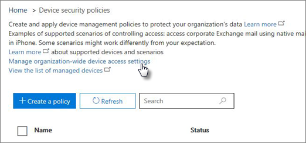

# Crear e implementar directivas de seguridad de dispositivosCreate and deploy device security policies

Puede usar Administración de dispositivos móviles para Office 365 para crear directivas de seguridad que ayudan a proteger la información de su organización en Office 365 obtenga acceso no autorizado. Puede aplicar directivas a cualquier dispositivo móvil en la organización, donde el usuario del dispositivo tiene una licencia de Office 365 aplicables y el dispositivo en MDM haya inscrito para Office 365.You can use Mobile Device Management for Office 365 to create security policies that help protect your organization's information on Office 365 from unauthorized access. You can apply policies to any mobile device in your organization where the user of the device has an applicable Office 365 license and has enrolled the device in MDM for Office 365.
  
## Antes de empezarBefore you begin

- Obtenga información sobre los dispositivos, aplicaciones de dispositivo móvil y configuración de seguridad que admite MDM para Office 365. Consulte [las capacidades de administración de dispositivos móviles para Office 365](capabilities-of-mobile-device-management.md).Learn about the devices, mobile device apps, and security settings that MDM for Office 365 supports. See [Capabilities of Mobile Device Management for Office 365](capabilities-of-mobile-device-management.md).
    
- Crear grupos de seguridad que se incluyen los usuarios de Office 365 que se desean implementar directivas para y para los usuarios que desea impedir que bloqueó el acceso a Office 365. Se recomienda que, antes de implementar una nueva directiva para la organización, se prueba la directiva mediante la implementación para un pequeño número de usuarios. Puede crear y utilizar un grupo de seguridad que incluye sólo usted o un pequeño número Office 365 a los usuarios que pueden comprobar la directiva. Para obtener más información acerca de los grupos de seguridad, vea [crear, editar o eliminar un grupo de seguridad](https://go.microsoft.com/fwlink/p/?LinkId=518555).Create security groups that include Office 365 users that you want to deploy policies to and for users that you might want to exclude from being blocked access to Office 365. We recommend that before you deploy a new policy to your organization, you test the policy by deploying it to a small number of users. You can create and use a security group that includes just yourself or a small number Office 365 users that can test the policy for you. To learn more about security groups, see [Create, edit, or delete a security group](https://go.microsoft.com/fwlink/p/?LinkId=518555).
    
- **Importante:** Antes de poder crear una directiva de dispositivo móvil, debe activar y configurar MDM para Office 365. Vea [información general de administración de dispositivos móviles para Office 365](overview-of-mdm.md).**Important:** Before you can create a mobile device policy, you must activate and set up MDM for Office 365. See [Overview of Mobile Device Management for Office 365](overview-of-mdm.md).
    
- Para crear e implementar directivas de administración de dispositivos móviles en Office 365, debe ser un administrador global de Office 365. Vea [permisos en la seguridad de Office 365 &amp; centro de cumplimiento](https://support.office.com/article/d10608af-7934-490a-818e-e68f17d0e9c1).To create and deploy mobile device management policies in Office 365, you need to be an Office 365 global admin. See [Permissions in the Office 365 Security &amp; Compliance Center](https://support.office.com/article/d10608af-7934-490a-818e-e68f17d0e9c1).
    
- Antes de implementar las directivas, que la organización sepan los impactos potenciales de inscripción de un dispositivo en MDM para Office 365. Dependiendo de cómo configurar las directivas, se pueden bloquear dispositivos no conformes tengan acceso a Office 365 y datos, incluidas las aplicaciones instaladas, fotos e información personal en un dispositivo inscrito, se pueden eliminar.Before you deploy policies, let your organization know the potential impacts of enrolling a device in MDM for Office 365. Depending on how you set up the policies, noncompliant devices can be blocked from accessing Office 365 and data, including installed applications, photos, and personal information on an enrolled device, can be deleted.
    
> [!NOTE]
> Directivas y reglas de acceso creadas en MDM para Office 365 invalidará las directivas de buzón de correo de dispositivos móviles de Exchange ActiveSync y las reglas de acceso de dispositivo creado en el centro de administración de Exchange. Después de que un dispositivo está inscrito en MDM para Office 365, cualquier directiva de buzón de Exchange ActiveSync dispositivo móvil o se omitirá la regla de acceso de dispositivo aplicado para el dispositivo. Para obtener más información acerca de Exchange ActiveSync, consulte [Exchange ActiveSync en Exchange Online](https://go.microsoft.com/fwlink/p/?LinkId=524380).Policies and access rules created in MDM for Office 365 will override Exchange ActiveSync mobile device mailbox policies and device access rules created in the Exchange admin center. After a device is enrolled in MDM for Office 365, any Exchange ActiveSync mobile device mailbox policy or device access rule applied to the device will be ignored. To learn more about Exchange ActiveSync, see [Exchange ActiveSync in Exchange Online](https://go.microsoft.com/fwlink/p/?LinkId=524380). 
  
## Paso 1: Crear una directiva de seguridad e implementar en un grupo de pruebasStep 1: Create a security policy and deploy to a test group

Antes de empezar, asegúrese de que ha activado y configurado MDM para Office 365. Para obtener instrucciones, vea [Información general de administración de dispositivos móviles para Office 365](overview-of-mdm.md) .Before you can start, make sure you have activated and set up MDM for Office 365. See [Overview of Mobile Device Management for Office 365](overview-of-mdm.md) for instructions. 
  
1. En Office 365, en la seguridad &amp; centro de cumplimiento, vaya a la **prevención de pérdida de datos** \> **las directivas de seguridad de dispositivo**.In Office 365, in the Security &amp; Compliance Center, go to **Data loss prevention** \> **Device security policies**.
    
    > [!NOTE]
    > Las **directivas de seguridad de dispositivo** aparecerá en el menú sólo después de que ha activado la administración de dispositivos móviles.The **Device security policies** will appear in the menu only after you have activated Mobile device management. 
  
2. Elija **+ crear una directiva**.Choose **+ Create a policy**.
    
    
  
3. Especifique un **nombre** y una **Descripción** para la nueva directiva y, a continuación, elija **siguiente**.Specify a **Name** and **Description** for the new policy, and then choose **Next**.
    
    
  
4. En la **¿Qué requisitos desea tener en dispositivos?** de página, especificar los requisitos que desea aplicar a los dispositivos móviles en su organización y, a continuación, elija **siguiente**.On the **What requirements do you want to have on devices?** page, specify the requirements you want applied to mobile devices in your organization, and then choose **Next**.
    
    
  
5. En la **¿Qué desea configurar?** de página, especifique cualquier requisito adicional que desea aplicar a los dispositivos móviles en su organización y, a continuación, elija **siguiente**.On the **What do you want to configure?** page, specify any additional requirements you want applied to mobile devices in your organization, and then choose **Next**.
    
6. En el **¿desea aplicar ahora esta directiva?** de página, elija **Sí**y, a continuación, elija **+ Agregar**.On the **Do you want to apply this policy now?** page, choose **Yes**, and then choose **+ Add**. 
    
    
  
7. Seleccione los grupos que va a probar la directiva antes de implementarlo en su organización y, a continuación, elija **Agregar**.Select the group(s) who will test the policy before you deploy it to your organization, and then choose **Add**.
    
8. Elija **Siguiente**.Choose **Next**.
    
9. Revise y confirme los detalles de la nueva directiva de dispositivo y, a continuación, elija **crear esta directiva**.Review and confirm the details of the new device policy, and then choose **Create this policy**.
    
    
  
10. Haga clic en **Cerrar**.Click **Close**.
    
Cada usuario que se aplica la directiva tendrá la directiva que se envían a sus dispositivos la próxima vez que inicie sesión en Office 365 con su dispositivo móvil. Si los usuarios no han tenido una directiva aplicada a su dispositivo móvil antes, a continuación, después de implementar la directiva, recibirá una notificación en su dispositivo que incluye los [pasos para inscribirse y activar MDM para Office 365](https://go.microsoft.com/fwlink/?LinkId=615272). Hasta que se complete inscripción, se restringen el acceso a correo electrónico, OneDrive y otros servicios. Después de completar la inscripción mediante la aplicación de Portal de empresa Intune, podrá usar los servicios y la directiva se aplicará a su dispositivo.Each user that the policy applies to will have the policy pushed to their device the next time they sign in to Office 365 using their mobile device. If users haven't had a policy applied to their mobile device before, then after you deploy the policy, they'll get a notification on their device that includes the [steps to enroll and activate MDM for Office 365](https://go.microsoft.com/fwlink/?LinkId=615272). Until they complete enrollment, access to email, OneDrive, and other services will be restricted. After they complete enrollment using the Intune Company Portal app, they'll be able to use the services and the policy will be applied to their device.
  
## Paso 2: Comprobar el funcionamiento de la directivaStep 2: Verify your policy works

Después de haber creado una directiva de seguridad, debe comprobar que la directiva funciona según lo previsto antes de implementarlo en su organización.After you've created a security policy, you should check that the policy works as you expect before you deploy it to your organization.
  
1. En Office 365, vaya a **seguridad &amp; centro de cumplimiento** \> **prevención de pérdida de datos** \> **administración de dispositivos**.In Office 365, go to **Security &amp; Compliance Center** \> **Data loss prevention** \> **Device management**.
    
2. En la página **Administración de dispositivos móviles para Office 365** , compruebe el estado de los dispositivos de usuario que tienen aplicada la directiva. Puede filtrar u ordenar por **todos los** para ver todos los dispositivos o **bloqueado** para ver los dispositivos bloqueados.On the **Mobile Device Management for Office 365** page, Check the status of user devices that have the policy applied. You can filter or sort by **All** to view all devices, or **Blocked** to view blocked devices. 
    
    
  
3. También puede hacer una limpieza completa o selectiva en el dispositivo. Para obtener instrucciones, consulte [Borrar un dispositivo móvil en Office 365](wipe-a-mobile-device.md).You can also do a full or selective wipe on the device. For instructions, see [Wipe a mobile device in Office 365](wipe-a-mobile-device.md).
    
## Paso 3: Implementar una directiva para su organizaciónStep 3: Deploy a policy to your organization

Una vez que haya creado una directiva de dispositivo móvil y verificado que funciona según lo previsto, implementarlo en su organización.After you've created a mobile device policy and verified that it works as expected, deploy it to your organization.
  
1. En Office 365, vaya a **seguridad &amp; centro de cumplimiento** \> **prevención de pérdida de datos** \> **las directivas de seguridad de dispositivo**.In Office 365, go to **Security &amp; Compliance Center** \> **Data loss prevention**\> **Device security policies**.
    
2. Seleccione la directiva que desea implementar y seleccione **Editar directiva** en el \< _nombre de la directiva_ \> panel.  Select the policy you want to deploy, and choose **Edit policy** in the \<  _policy name_\> panel.
    
3. Seleccione la pestaña **Implementación**.Select the **Deployment** tab. 
    
4. En la ficha **implementación** , elija **Sí** por encima de **seleccionar uno o más grupos de seguridad que contienen las personas a las que desea aplicar esta directiva a** y, a continuación, **Agregar**.In the **Deployment** tab, choose **Yes** above **Select one or more security groups that contain the people you want to apply this policy to** and then **Add**.
    
  - En el panel **Seleccionar un grupo** , puede buscar un grupo agregar, puede filtrar por alias o por nombre para mostrar. También puede agregar un grupo existente de la lista de **grupos** .On the **Select Group** panel, you can search for a group to add, you can filter either by alias or by display name. You can also add an existing group from the **Groups** list. 
    
    Puede agregar varios grupos para aplicar la directiva.You can add multiple groups to apply the policy to.
    
    Seleccione **Agregar** en la parte inferior del panel.Choose **Add** on the bottom of the panel. 
    
5. En la ficha **implementación** , elija **Guardar** .Choose **Save** on the **Deployment** tab. 
    
    
  
Cada usuario que se aplica la directiva tendrá la directiva que se envían a sus dispositivos la próxima vez que inician sesión en Office 365 desde su dispositivo móvil. Si los usuarios no han tenido una directiva aplicada a su dispositivo móvil, podrá [obtener una notificación en su dispositivo](https://go.microsoft.com/fwlink/?LinkId=615272) con pasos para inscribirse y activarlo para MDM para Office 365. Una vez que han terminado la inscripción, la directiva se aplicará a su dispositivo.Each user that the policy applies to will have the policy pushed to their device the next time they sign in to Office 365 from their mobile device. If users haven't had a policy applied to their mobile device, they'll [get a notification on their device](https://go.microsoft.com/fwlink/?LinkId=615272) with steps to enroll and activate it for MDM for Office 365. After they've completed the enrollment, the policy will be applied to their device. 
  
## Paso 4: Bloquear correo electrónico el acceso a dispositivos no compatiblesStep 4: Block email access for unsupported devices

Para ayudar a proteger la información de su organización, debe bloquear el acceso de aplicación para correo electrónico de Office 365 para dispositivos móviles que no son compatibles con MDM para Office 365. Vea [las capacidades de administración de dispositivos móviles integrada para Office 365](capabilities-of-mobile-device-management.md) para obtener una lista de los dispositivos que son compatibles. Para hacer esto:To help secure your organization's information, you should block app access to Office 365 email for mobile devices that are not supported by MDM for Office 365. See [Capabilities of built-in Mobile Device Management for Office 365](capabilities-of-mobile-device-management.md) for a list of devices that are supported. To do this: 
  
1. Vaya a seguridad &amp; centro de cumplimiento\> **prevención de pérdida de datos** \> **las directivas de seguridad de dispositivo**.Go to Security &amp; Compliance Center\> **Data loss prevention**\> **Device security policies**.
    
2. Seleccione **Administrar la configuración de acceso de dispositivo de toda la organización**.Select **Manage organization-wide device access settings**.
    
    
  
3. Para bloquear los dispositivos no compatibles, elija **Bloquear** en **Si un dispositivo no es compatible con MDM para Office 365, ¿desea permitir o bloquear desde con una cuenta de Exchange para obtener acceso a correo electrónico de la organización** \> **Guardar**.To block unsupported devices, choose **Block** under **If a device isn't supported by MDM for Office 365, do you want to allow or block it from using an Exchange account to access your organization's email** \> **Save**.
  
## Paso 5: Elija los grupos de seguridad que desea excluir de las comprobaciones de acceso condicionalStep 5: Choose security groups to be excluded from conditional access checks

Si desea excluir algunas personas de las comprobaciones de acceso condicional en sus dispositivos móviles y ha creado uno o más grupos de seguridad para estas personas, agregue los grupos de seguridad aquí. Los usuarios de estos grupos no tendrán ninguna directiva exigida para sus dispositivos móviles admitidos.If you want to exclude some people from conditional access checks on their mobile devices and you've created one or more security groups for those people, add the security groups here. The people in these groups will not have any policies enforced for their supported mobile devices.
  
1. Vaya a seguridad &amp; centro de cumplimiento\> **prevención de pérdida de datos** \> **las directivas de seguridad de dispositivo**.Go to Security &amp; Compliance Center\> **Data loss prevention**\> **Device security policies**.
    
2. Seleccione **Administrar la configuración de acceso de dispositivo de toda la organización**.Select **Manage organization-wide device access settings**.
    
    
  
3. Seleccione **Agregar** para agregar el grupo de seguridad que tiene usuarios que le gustaría usar para impedir que se ha bloqueado el acceso a Office 365. Cuando un usuario se ha agregado a esta lista, podrá tener acceso a correo electrónico de Office 365 cuando se usa un dispositivo no compatible.Select **Add** to add the security group that has users that you'd like to exclude from being blocked access to Office 365. When a user has been added to this list, they'll be able to access Office 365 email when using an unsupported device. 
    
4. Seleccione el grupo de seguridad que desea usar en el panel **Seleccione grupo** .Select the security group you want to use in the **Select group** panel. 
    
5. Seleccione el nombre y, a continuación, en **Agregar** \> **Guardar**.Select the name, and then **Add** \> **Save**.
    
6. En el panel **configuración de acceso de dispositivo de toda la organización** , elija **Guardar**.On the **Organization-wide device access settings** panel, choose **Save**.
  
## ¿Cuál es el impacto de las directivas de seguridad en distintos tipos de dispositivos?What is the impact of security policies on different device types?

Al aplicar una directiva a los dispositivos de usuario, el impacto en cada dispositivo varía ligeramente entre los distintos tipos de dispositivos. Consulte la siguiente tabla para obtener ejemplos del impacto de las directivas en diferentes dispositivos.When you apply a policy to user devices, the impact on each device varies somewhat between different device types. See the following table for examples of the impact of policies on different devices.
  

|**Directiva de seguridad****Security Policy**|**Windows Phone 8.1 +****Windows Phone 8.1+**|**Android 4+****Android 4+**|**Samsung Knox****Samsung Knox**|**IOS 6 +****IOS 6+**|**Notas****Notes**|
|:-----|:-----|:-----|:-----|:-----|:-----|
|Requerir copia de seguridad cifradaRequire encrypted backup    |✖✖    |✖✖    |✔✔    |✔✔    |Se requiere copia de seguridad cifrada de iOS.IOS encrypted backup required.    |
|Bloquear copia de seguridad de la nubeBlock cloud backup    |✖✖    |✔✔    |✔✔    |✔✔    |Bloquear copia de seguridad de Google en Android (atenuado), copia de seguridad de la nube en iOS.Block Google backup on Android (grayed out), cloud backup on iOS.    |
|Bloquear sincronización de documentosBlock document synchronization    |✖✖    |✖✖    |✖✖    |✔✔    |iOS: Bloquear documentos en la nube.iOS: Block documents in the cloud.    |
|Bloquear sincronización de fotosBlock photo synchronization    |✖✖    |✖✖    |✖✖    |✔✔    |iOS (nativo): Bloquear Photo Stream.iOS (native): Block Photo Stream.    |
|Bloquear captura de pantallaBlock screen capture    |✔✔    |XX    |✔✔    |✔✔    |Se bloquea cuando se intenta.Blocked when attempted.    |
|Bloquear videoconferenciaBlock video conference    |✖✖    |✖✖    |✖✖    |✔✔    |Se bloquea FaceTime en iOS, no Skype u otros.FaceTime blocked on iOS, not Skype or others.    |
|Bloquear el envío de datos de diagnósticoBlock sending diagnostic data    |✖✖    |XX    |✔✔    |✔✔    |Bloquear el envío de informes de bloqueo de Google en Android.Block sending Google crash report on Android.    |
|Bloquear el acceso a la tienda de aplicacionesBlock access to app store    |✔✔    |XX    |✔✔    |✔✔    |Falta el icono de la tienda de aplicaciones en la página principal de Android, está deshabilitado en Windows, falta en iOS.App store icon missing on Android home page, disabled on Windows, missing on iOS.    |
|Requerir contraseña para la tienda de aplicacionesRequire password for app store    |✖✖    |✖✖    |✖✖    |✔✔    |iOS: Contraseña necesaria para las compras de iTunes.iOS: Password required for iTunes purchases.    |
|Bloquear conexión a almacenamiento extraíbleBlock connection to removable storage    |✔✔    |XX    |✔✔    |N/DNA    |Android: La tarjeta SD aparecerá atenuada en la configuración, Windows notifica al usuario, las aplicaciones instaladas no están disponiblesAndroid: SD card will be grayed out in settings, Windows notifies user, apps installed there are not available    |
|Bloquear conexión BluetoothBlock Bluetooth connection    |✔✔    |\*\*\*    |\*\*\*    |✖✖    |\*\*\*No podemos deshabilitamos BlueTooth como una opción de configuración en Android. En su lugar, se deshabilitación todas las transacciones que requieren BlueTooth: distribución avanzada de Audio, Control remoto de Audio y vídeo, los dispositivos de manos libres, auriculares con micrófono, acceso de la libreta de direcciones y puerto serie. Cuando se usa alguno de estos, aparece un mensaje de notificación emergente pequeña en la parte inferior de la página.\*\*\*We can't disable BlueTooth as a setting on Android. Instead, we disable all the transactions that require BlueTooth: Advanced Audio Distribution, Audio/Video Remote Control, hands-free devices, headset, Phone Book Access, and Serial Port. A small toast message appears at the bottom of the page when any of these are used.    |
   
## ¿Qué ocurre al eliminar una directiva o quitar un usuario de la directiva?What happens when you delete a policy or remove a user from the policy?

Al eliminar una directiva o quitar un usuario de un grupo al que la directiva se implementó en, la configuración de directiva, perfiles de correo electrónico de Office 365 y mensajes de correo electrónico almacenados en caché pueden quitarse el dispositivo del usuario. Vea la siguiente tabla para ver los elementos que se quitaron para los distintos tipos de dispositivos:When you delete a policy or remove a user from a group to which the policy was deployed to, the policy settings, Office 365 email profile and cached emails may be removed from the user's device. See the following table to see what is removed for the different device types:
  
|**Lo que se quita****What's removed**|**Windows Phone 8.1 +****Windows Phone 8.1+**|**iOS 6 +****iOS 6+**|**Android 4 + (incluido a Samsung Knox)****Android 4+ (including Samsung Knox)**|
|:-----|:-----|:-----|:-----|
|Perfiles de correo electrónico administradas\*Managed email profiles\*    |✖✖    |✔✔    |✖✖    |
|Configuración de directivasPolicy settings    |✔✔              Excepto en el caso de **Bloquear el envío de datos de diagnóstico de dispositivos**.Except for **Block sending diagnostic data from device.**   |✔✔    |✖✖    |
   
> [!NOTE]
> \*Si la directiva se implementó con la opción de **perfil de correo electrónico se administra** seleccionado, a continuación, el perfil de correo electrónico administradas y almacena en caché los correos electrónicos en que se eliminará el perfil desde el dispositivo del usuario.\*If the policy was deployed with the option **Email profile is managed** selected, then the managed email profile and cached emails in that profile will be deleted from the user's device. 
  
Cada usuario que aplica la directiva se ha quitado tendrá la directiva que se ha quitado desde su dispositivo la próxima vez que se comprueba su dispositivo móvil con MDM para Office 365. Si implementa una nueva directiva que se aplica a dispositivos los usuarios en estos, se pedirá a volver a inscribirse en MDM para Office 365.Each user that the removed policy applied to will have the policy removed from their device the next time their mobile device checks in with MDM for Office 365 . If you deploy a new policy that applies to these users' devices, they'll be prompted to re-enroll in MDM for Office 365.
  
También puede [Borrar un dispositivo](wipe-a-mobile-device.md), ya sea completamente o selectivamente Barrido hacia la información de la organización desde el dispositivo.You can also [wipe a device](wipe-a-mobile-device.md), either completely, or selectively wipe organizational information from the device.
  
## Temas relacionadosRelated Topics

[Introducción a la administración de dispositivos móviles para Office 365Overview of Mobile Device Management for Office 365](overview-of-mdm.md)
  
[Funcionalidades de administración de dispositivos móviles para Office 365Capabilities of Mobile Device Management for Office 365](capabilities-of-mobile-device-management.md)
  

