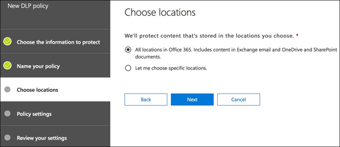
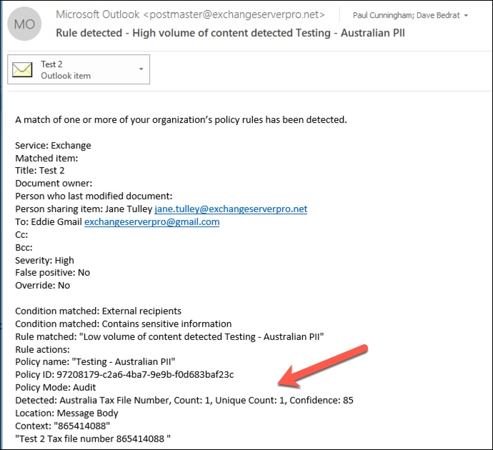

# Crear, probar y optimizar una directiva DLPCreate, test, and tune a DLP policy

**Autor principal****Principal author**  
Paul Cunningham, MVP de MicrosoftPaul Cunningham, Microsoft MVP  
[Práctico 365Practical 365](https://practical365.com/)  
[@Practical365@Practical365](https://twitter.com/practical365) 
__________________________________________________

La prevención de pérdida de datos es una característica de cumplimiento de Office 365 que está diseñada para ayudar a su organización a evitar la exposición intencionada o accidental de información confidencial a partes no deseadas.Data loss prevention is a compliance feature of Office 365 that is designed to help your organization prevent the intentional or accidental exposure of sensitive information to unwanted parties. DLP tiene sus raíces en Exchange Server y Exchange Online, y también es aplicable en SharePoint Online y OneDrive para la empresa.DLP has its roots in Exchange Server and Exchange Online, and is also applicable in SharePoint Online and OneDrive for Business.

DLP utiliza un motor de análisis de contenido para examinar el contenido de los mensajes de correo electrónico y los archivos, en busca de información confidencial, como los números de tarjetas de crédito y la información de identificación personal (PII).DLP uses a content analysis engine to examine the contents of email messages and files, looking for sensitive information such as credit card numbers and personally identifiable information (PII). La información confidencial no suele enviarse en el correo electrónico ni se puede incluir en documentos, sin necesidad de realizar pasos adicionales, como cifrar el mensaje o los archivos de correo electrónico.Sensitive information should typically not be sent in email, or included in documents, without taking additional steps such as encrypting the email message or files. Con DLP puede detectar información confidencial y emprender acciones como:Using DLP you can detect sensitive information, and take action such as:

- Registrar el evento con fines de auditoríaLog the event for auditing purposes
- Mostrar una advertencia al usuario final que está enviando el correo electrónico o compartiendo el archivoDisplay a warning to the end user who is sending the email or sharing the file
- Bloquear activamente el correo electrónico o el uso compartido de archivos sin tener lugarActively block the email or file sharing from taking place

A veces, los clientes descartan DLP porque no consideran que ellos mismos tienen el tipo de datos que necesitan protección.Sometimes customers dismiss DLP because they don't consider themselves to have the type of data that needs protecting. La suposición es que los datos confidenciales, como los registros médicos o la información financiera, solo existen para las industrias como la atención médica o para las empresas que ejecutan tiendas en línea.The assumption is that sensitive data, such as medical records or financial information, only exists for industries like health care or for companies that run online stores. Sin embargo, cualquier empresa puede manejar información confidencial de forma periódica, incluso si no la tiene en cuenta.But any business can handle sensitive information on a regular basis, even if they don't realize it. Una hoja de cálculo con los nombres y las fechas de los empleados es tan importante como una hoja de cálculo con los nombres de los clientes y los detalles de las tarjetas de crédito.A spreadsheet of employee names and dates of birth is just as sensitive as a spreadsheet of customer names and credit card details. Además, este tipo de información tiende a flotar más de lo que esperaba, ya que los empleados se centran en silencio en las tareas cotidianas, pensando en nada de exportar un archivo CSV de un sistema y enviarlo por correo electrónico a alguien.And this type of information tends to float around more than you might expect, as employees quietly go about their day to day tasks, thinking nothing of export a CSV file from a system and emailing it to someone. También podría sorprenderse con la frecuencia con la que los empleados envían correos electrónicos que contienen datos de tarjetas de crédito o banca sin tener en cuenta las consecuencias.You might also be surprised how often employees send emails containing credit card or banking details without considering the consequences.

## Cómo se detecta la información confidencial mediante DLPHow sensitive information is detected by DLP

La información confidencial se identifica mediante coincidencia de patrón de expresiones regulares (RegEx), en combinación con otros indicadores, como la proximidad de determinadas palabras clave a los patrones coincidentes.Sensitive information is identified by regular expression (RegEx) pattern matching, in combination with with other indicators such as the proximity of certain keywords to the matching patterns. Un ejemplo de esto son los números de tarjeta de crédito.An example of this is credit card numbers. Un número de tarjeta de crédito VISA tiene 16 dígitos.A VISA credit card number has 16 digits. Sin embargo, estos dígitos pueden escribirse de varias maneras, como 1111-1111-1111-1111, 1111 1111 1111 1111 o 1111111111111111.However, those digits can be written in different ways, such as 1111-1111-1111-1111, 1111 1111 1111 1111, or 1111111111111111.

Cualquier cadena de 16 dígitos no es necesariamente un número de tarjeta de crédito, puede ser un número de incidencia de un sistema de asistencia o un número de serie de un componente de hardware.Any 16 digit string is not necessarily a credit card number, it could be a ticket number from a help desk system, or a serial number of a piece of hardware. Para identificar la diferencia entre un número de tarjeta de crédito y una cadena de 16 dígitos inofensivo, se realiza un cálculo (suma de comprobación) para confirmar que los números coinciden con un patrón conocido de las diversas marcas de tarjeta de crédito.To tell the difference between a credit card number and a harmless 16-digit string, a calculation is performed (checksum) to confirm that the numbers match a known pattern from the various credit card brands.

Además, la proximidad de palabras clave como "VISA" o "AMEX", junto con los valores de proximidad a la fecha que pueden ser la fecha de expiración de la tarjeta de crédito, también se considera como una decisión sobre si los datos son un número de tarjeta de crédito o no.Furthermore, the proximity of keywords such as “VISA” or “AMEX”, along with the proximity to date values that might be the credit card expiry date, is also considered to make a decision about whether the data is a credit card number or not.

Es decir, DLP suele ser lo suficientemente inteligente como para reconocer la diferencia entre estos dos textos en un correo electrónico:In other words, DLP is usually smart enough to recognize the difference between these two texts in an email:

- "¿Puede solicitarme un nuevo portátil.“Can you order me a new laptop. Usar mi VISAdo número 1111-1111-1111-1111, expirar 11/22 y enviarme la fecha de entrega estimada cuando la tiene. "Use my VISA number 1111-1111-1111-1111, expiry 11/22, and send me the estimated delivery date when you have it.”
- "El número de serie del portátil es 2222-2222-2222-2222 y se compró en 11/2010.“My laptop serial number is 2222-2222-2222-2222 and it was purchased on 11/2010. Por cierto, ¿se aprobó todavía mi visado de viajes? "By the way, is my travel visa approved yet?”

Una buena referencia para conservar el marcador es este [tema sobre los tipos de información confidencial](what-the-sensitive-information-types-look-for.md) que explican cómo se detecta cada tipo de información.A good reference to keep bookmarked is this [topic on sensitive information types](what-the-sensitive-information-types-look-for.md) that explains how each information type is detected.

## Dónde comenzar con prevención de pérdida de datosWhere to start with data loss prevention

Cuando los riesgos de la filtración de datos no son totalmente obvios, es difícil averiguar dónde se debe empezar exactamente con la implementación de DLP.When the risks of data leakage aren't entirely obvious, it's difficult to work out where exactly you should start with implementing DLP. Afortunadamente, las directivas de DLP se pueden ejecutar en el "modo de prueba", lo que le permite evaluar su eficacia y precisión antes de activarlas.Fortunately, DLP policies can be run in “test mode”, allowing you to gauge their effectiveness and accuracy before you turn them on.

Las directivas de DLP para Exchange Online se pueden administrar a través del centro de administración de Exchange.DLP policies for Exchange Online can be managed through the Exchange admin center. Sin embargo, puede configurar directivas de DLP para todas las cargas de trabajo a través del centro de seguridad & cumplimiento, que voy a usar para las demostraciones de este artículo.But you can configure DLP policies for all workloads through the Security & Compliance Center, so that's what I'll use for demonstrations in this article. En el centro de seguridad & cumplimiento, encontrará directivas DLP en la \*\*\*\* > **Directiva**de prevención de pérdida de datos.In the Security & Compliance Center you'll find the DLP policies under **Data loss prevention** > **Policy**. Haga clic en **crear una directiva** para iniciar.Click on **Create a policy** to start.

Office 365 proporciona una amplia variedad de [plantillas de directivas de DLP](what-the-dlp-policy-templates-include.md) que puede usar para crear directivas de DLP.Office 365 provides a range of [DLP policy templates](what-the-dlp-policy-templates-include.md) you can use to create DLP policies. Supongamos que es un negocio australiano.Let's say that you're an Australian business. Puede filtrar las plantillas de directiva para mostrar solo las que son relevantes para Australia, que entran en las categorías generales de finanzas, médicos y salud y privacidad.You can filter the policy templates to display only those that are relevant to Australia, which fall into the general categories of Financial, Medical and Health, and Privacy.

Para esta demostración, elegiré datos de identificación personal (PII) de Australia, que incluye los tipos de información del número de archivo de impuestos de Australia (TFN) y el número de permiso de conducir.For this demonstration I'll choose Australian Personally Identifiable Information (PII) Data, which includes the information types of Australian Tax File Number (TFN) and Driver's License Number.

Asigne un nombre a la nueva Directiva de DLP.Give your new DLP policy a name. El nombre predeterminado coincidirá con la plantilla de directiva DLP, pero debe elegir un nombre más descriptivo, ya que se pueden crear varias directivas a partir de la misma plantilla.The default name will match the DLP policy template, but you should choose a more descriptive name of your own, because multiple policies can be created from the same template.

Elija las ubicaciones a las que se aplicará la Directiva.Choose the locations that the policy will apply to. Las directivas DLP se pueden aplicar a Exchange Online, SharePoint Online y OneDrive para la empresa.DLP policies can apply to Exchange Online, SharePoint Online, and OneDrive for Business. Voy a dejar esta directiva configurada para aplicarse a todas las ubicaciones.I am going to leave this policy configured to apply to all locations.

En el primer paso de configuración de la **Directiva** , basta con aceptar los valores predeterminados por el momento.At the first **Policy Settings** step just accept the defaults for now. Hay una gran cantidad de personalización que puede hacer en las directivas de DLP, pero los valores predeterminados son un punto muy bueno para empezar.There is quite a lot of customization you can do in DLP policies, but the defaults are a fine place to start.

Después de hacer clic en **siguiente** , se le mostrará una página de **configuración de directivas** adicional con más opciones de personalización.After clicking **Next** you'll be presented with an additional **Policy Settings** page with more customization options. Para una directiva que solo está probando, aquí es donde puede empezar a realizar algunos ajustes.For a policy that you are just testing, here's where you can start to make some adjustments.

- He desactivado las sugerencias de Directiva por ahora, que es un paso razonable que debe realizar si solo está probando cosas y no quiere mostrar nada a los usuarios todavía.I've turned off policy tips for now, which is a reasonable step to take if you're just testing things out and don't want to display anything to users yet. Las sugerencias de directiva muestran advertencias a los usuarios de que están a punto de infringir una directiva de DLP.Policy tips display warnings to users that they're about to violate a DLP policy. Por ejemplo, un usuario de Outlook verá una advertencia que indica que el archivo que ha adjuntado contiene números de tarjeta de crédito y que se rechazará el correo electrónico.For example, an Outlook user will see a warning that the file they've attached contains credit card numbers and will cause their email to be rejected. El objetivo de las sugerencias de directiva es detener el comportamiento no compatible antes de que ocurra.The goal of policy tips is to stop the non-compliant behaviour before it happens.
- También se ha reducido el número de instancias de 10 a 1, por lo que esta directiva detectará cualquier uso compartido de datos PII australianos, no solo el uso compartido de datos de forma masiva.I've also decreased the number of instances from 10 to 1, so that this policy will detect any sharing of Australian PII data, not just bulk sharing of the data.
- También he agregado otro destinatario al correo electrónico del informe de incidentes.I've also added another recipient to the incident report email.

Por último, he configurado esta directiva para que se ejecute inicialmente en modo de prueba.Finally, I've configured this policy to run in test mode initially. Observe que también hay una opción para deshabilitar las sugerencias de directiva en el modo de prueba.Notice there's also an option here to disable policy tips while in test mode. Esto le proporciona la flexibilidad necesaria para habilitar las sugerencias de directiva en la Directiva, pero después decidir si desea mostrarlas o suprimirlas durante las pruebas.This gives you the flexibility to have policy tips enabled in the policy, but then decide whether to show or suppress them during your testing.

En la pantalla finalización de la revisión, haga clic en **crear** para finalizar la creación de la Directiva.On the final review screen click **Create** to finish creating the policy.

## Probar una directiva DLPTest a DLP policy

La nueva Directiva de DLP empezará a surtir efecto en aproximadamente 1 hora.Your new DLP policy will begin to take effect within about 1 hour. Puede sentarse y esperar a que se active por una actividad de usuario normal o puede intentar activarla usted mismo.You can sit and wait for it to be triggered by normal user activity, or you can try to trigger it yourself. Anteriormente he vinculado a este [tema sobre los tipos de información confidencial](what-the-sensitive-information-types-look-for.md), que proporciona información sobre cómo desencadenar las coincidencias de DLP.Earlier I linked to this [topic on sensitive information types](what-the-sensitive-information-types-look-for.md), which provides you with information about how to trigger DLP matches.

Como ejemplo, la Directiva DLP que he creado para este artículo detectará los números de archivo de impuestos australianos (TFN).As an example, the DLP policy I created for this article will detect Australian tax file numbers (TFN). De acuerdo con la documentación, la coincidencia se basa en los siguientes criterios.According to the documentation, the match is based on the following criteria.

 
Para demostrar la detección de TFN de forma bastante predecible, un correo electrónico con las palabras "número de archivo de impuestos" y una cadena de 9 dígitos en proximidad se desplazará sin problemas.To demonstrate TFN detection in a rather blunt manner, an email with the words “Tax file number” and a 9 digit string in close proximity will sail through without any issues. La razón por la que no activa la Directiva DLP es que la cadena de 9 dígitos debe pasar la suma de comprobación que indica que es un TFN válido y no solo una cadena de números inocua.The reason it does not trigger the DLP policy is that the 9-digit string must pass the checksum that indicates it is a valid TFN and not just a harmless string of numbers.

En comparación, un correo electrónico con las palabras "número de archivo de impuestos" y un TFN válido que pase la suma de comprobación activará la Directiva.In comparison, an email with the words “Tax file number” and a valid TFN that passes the checksum will trigger the policy. Para el registro, el TFN que estoy usando se ha tomado de un sitio web que genera un TFNs válido, pero no genuino.For the record here, the TFN I'm using was taken from a website that generates valid, but not genuine, TFNs. Hay sitios similares que generan [números de tarjeta de crédito válidos pero falsos](http://www.fakecreditcardgenerator.net/).There are similar sites that generate [valid but fake credit card numbers](http://www.fakecreditcardgenerator.net/). Estos sitios son muy útiles porque uno de los errores más comunes al probar una directiva DLP es usar un número falso que no es válido y no pasa la suma de comprobación (y, por lo tanto, no desencadena la Directiva).Such sites are very useful because one of the most common mistakes when testing a DLP policy is using a fake number that's not valid and won't pass the checksum (and therefore won't trigger the policy).

El correo electrónico del informe de incidentes incluye el tipo de información confidencial que se ha detectado, el número de instancias que se han detectado y el nivel de confianza de la detección.The incident report email includes the type of sensitive information that was detected, how many instances were detected, and the confidence level of the detection.

Si deja la Directiva DLP en modo de prueba y analiza los correos electrónicos del informe de incidentes, puede empezar a familiarizarse con la precisión de la Directiva DLP y la eficacia que tendrá cuando se aplique.If you leave your DLP policy in test mode and analyze the incident report emails, you can start to get a feel for the accuracy of the DLP policy and how effective it will be when it is enforced. Además de los informes de incidentes, puede [usar los informes DLP](view-the-dlp-reports.md) para ver una vista agregada de las coincidencias de directivas en el espacio empresarial.In addition to the incident reports, you can [use the DLP reports](view-the-dlp-reports.md) to see an aggregated view of policy matches across your tenant.

## Ajustar una directiva DLPTune a DLP policy

Al analizar las visitas de la Directiva, es posible que desee realizar algunos ajustes en el comportamiento de las directivas.As you analyze your policy hits you might want to make some adjustments to how the policies behave. Como ejemplo sencillo, puede determinar que un TFN en el correo electrónico no es un problema (creo que sigue siendo, pero vamos a ir con él para la demostración), pero dos o más instancias son un problema.As a simple example, you might determine that one TFN in email is not a problem (I think it still is, but let's go with it for the sake of demonstration), but two or more instances is a problem. Varias instancias podrían ser un escenario arriesgado, como un empleado que envíe por correo electrónico una exportación de CSV desde la base de datos de recursos humanos a una parte externa, por ejemplo, un servicio de contabilidad externo.Multiple instances could be a risky scenario such as an employee emailing a CSV export from the HR database to an external party, for example an external accounting service. Definitivamente algo que preferiría detectar y bloquear.Definitely something you would prefer to detect and block.

En el centro de seguridad & cumplimiento, puede editar una directiva existente para ajustar el comportamiento.In the Security & Compliance Center you can edit an existing policy to adjust the behaviour.

 
Puede ajustar la configuración de ubicación para que la Directiva se aplique solo a cargas de trabajo específicas o a sitios y cuentas específicos.You can adjust the location settings so that the policy is applied only to specific workloads, or to specific sites and accounts.

También puede ajustar la configuración de la Directiva y editar las reglas para que se adapten mejor a sus necesidades.You can also adjust the policy settings and edit the rules to better suit your needs.

Al editar una regla en una directiva DLP que puede cambiar:When editing a rule within a DLP policy you can change:

- Las condiciones, incluido el tipo y el número de instancias de datos confidenciales que desencadenarán la regla.The conditions, including the type and number of instances of sensitive data that will trigger the rule.
- Las acciones que se realizan, como restringir el acceso al contenido.The actions that are taken, such as restricting access to the content.
- Notificaciones de usuario, que son sugerencias de directiva que se muestran al usuario en su cliente de correo electrónico o explorador Web.User notifications, which are policy tips that are displayed to the user in their email client or web browser.
- Invalidaciones de usuario, que determina si los usuarios pueden optar por continuar con el correo electrónico o el uso compartido de archivos de todos modos.User overrides, which determines whether users can choose to proceed with their email or file sharing anyway.
- Informes de incidentes, para notificar a los administradores.Incident reports, to notify administrators.

Para esta demostración, he agregado notificaciones de usuario a la Directiva (tenga cuidado de hacerlo sin el suficiente aprendizaje de reconocimiento de usuarios) y los usuarios pueden invalidar la Directiva con una justificación comercial o marcarla como falso positivo.For this demonstration I've added user notifications to the policy (be careful of doing this without adequate user awareness training), and allowed users to override the policy with a business justification or by flagging it as a false positive. Tenga en cuenta que también puede personalizar el correo electrónico y el texto de la sugerencia de Directiva si desea incluir información adicional sobre las directivas de la organización o solicitar a los usuarios que se pongan en contacto con el soporte técnico si tienen preguntas.Note that you can also customize the email and policy tip text if you want to include any additional information about your organization's policies, or prompt users to contact support if they have questions.

La Directiva contiene dos reglas para controlar el volumen alto y el volumen bajo, por lo que debe asegurarse de editar ambas con las acciones que desee.The policy contains two rules for handling of high volume and low volume, so be sure to edit both with the actions that you want. Esta es una oportunidad para tratar los casos de manera diferente en función de sus características.This is an opportunity to treat cases differently depending on their characteristics. Por ejemplo, puede permitir reemplazos para infracciones de volumen bajos, pero no permitir invalidaciones para infracciones de gran volumen.For example, you might allow overrides for low volume violations, but not allow overrides for high volume violations.

Además, si desea bloquear o restringir el acceso al contenido que infringe la Directiva, debe configurar una acción en la regla para hacerlo.Also, if you want to actually block or restrict access to content that is in violation of policy, you need to configure an action on the rule to do so.

Después de guardar los cambios en la configuración de la Directiva, también es necesario volver a la página de configuración principal de la Directiva y habilitar la opción de Mostrar sugerencias de directiva a los usuarios mientras la Directiva está en modo de prueba.After saving those changes to the policy settings, I also need to return to the main settings page for the policy and enable the option to show policy tips to users while the policy is in test mode. Esta es una forma eficaz de introducir directivas de DLP para los usuarios finales y realizar un entrenamiento del usuario, sin arriesgar demasiados falsos positivos que afecten a su productividad.This is an effective way to introduce DLP policies to your end users, and do user awareness training, without risking too many false positives that impact their productivity.

En el lado del servidor (o en la nube si lo prefiere), es posible que el cambio no surta efecto inmediatamente, debido a diferentes intervalos de procesamiento.On the server side (or cloud side if you prefer), the change may not take effect immediately, due to various processing intervals. Si realiza un cambio de la Directiva DLP que mostrará nuevas sugerencias de directiva a un usuario, es posible que el usuario no vea los cambios de forma inmediata en el cliente de Outlook, que comprueba los cambios de Directiva cada 24 horas.If you're making a DLP policy change that will display new policy tips to a user, the user may not see the changes take effect immediately in their Outlook client, which checks for policy changes every 24 hours. Si quiere aumentar la velocidad de las pruebas, puede usar esta corrección del registro para [borrar la marca de tiempo de la última descarga de la clave PolicyNudges](https://support.microsoft.com/en-au/help/2823261/changes-to-a-data-loss-prevention-policy-don-t-take-effect-in-outlook?__hstc=18650278.46377037dc0a82baa8a30f0ef07a7b2f.1538687978676.1538693509953.1540315763430.3&__hssc=18650278.1.1540315763430&__hsfp=3446956451).If you want to speed things up for testing, you can use this registry fix to [clear the last download time stamp from the PolicyNudges key](https://support.microsoft.com/en-au/help/2823261/changes-to-a-data-loss-prevention-policy-don-t-take-effect-in-outlook?__hstc=18650278.46377037dc0a82baa8a30f0ef07a7b2f.1538687978676.1538693509953.1540315763430.3&__hssc=18650278.1.1540315763430&__hsfp=3446956451). Outlook descargará la información más reciente de la Directiva la próxima vez que la reinicie y empiece a redactar un mensaje de correo electrónico.Outlook will download the latest policy information the next time you restart it and begin composing an email message.

Si tiene habilitadas las sugerencias de Directiva, el usuario empezará a ver sugerencias en Outlook y podrá informar de falsos positivos cuando se produzcan.If you have policy tips enabled, the user will begin to see the tips in Outlook, and can report false positives to you when they occur.

## Investigar positivos falsosInvestigate false positives

Las plantillas de directivas de DLP no son perfectas directamente en el cuadro.DLP policy templates are not perfect straight out of the box. Es probable que se produzcan falsos positivos en el entorno, por lo que es tan importante para facilitar la implementación de DLP y dedicar tiempo a probar y ajustar las directivas de forma adecuada.It's likely that you'll find some false positives occurring in your environment, which is why it's so important to ease your way into a DLP deployment, taking the time to adequately test and tune your policies.

Este es un ejemplo de un falso positivo.Here's an example of a false positive. Este correo electrónico es bastante inocuo.This email is quite harmless. El usuario proporciona su número de teléfono móvil a alguien e incluye su firma de correo electrónico.The user is providing their mobile phone number to someone, and including their email signature.

 
Pero el usuario ve una sugerencia de directiva que advierte que el correo electrónico contiene información confidencial, en concreto, un número de licencia de conductor australiano.But the user sees a policy tip warning them that the email contains sensitive information, specifically, an Australian driver's license number.

El usuario puede informar del falso positivo y el administrador puede comprobar por qué se ha producido.The user can report the false positive, and the administrator can look into why it has occurred. En el correo electrónico del informe de incidentes, el correo electrónico se marca como falso positivo.In the incident report email, the email is flagged as a false positive.

El caso de la licencia de conducir es un buen ejemplo para profundizar.This driver's license case is a good example to dig into. La razón por la que se ha producido este falso positivo es que el tipo "licencia de conductor australiano" se desencadenará por cualquier cadena de 9 dígitos (incluso la que forme parte de una cadena de 10 dígitos), dentro de 300 caracteres de proximidad a las palabras clave "Sydney NSW" (no distingue entre mayúsculas y minúsculas).The reason this false positive has occurred is that the “Australian Driver's License” type will be triggered by any 9-digit string (even one that is part of a 10-digit string), within 300 characters proximity to the keywords “sydney nsw” (not case sensitive). Por lo tanto, se desencadena por el número de teléfono y la firma de correo electrónico, solo porque el usuario se encuentra en Sydney.So it's triggered by the phone number and email signature, only because the user happens to be in Sydney.

Curiosamente, si "Sydney, NSW" tiene una coma, la Directiva DLP no se desencadena.Interestingly, if “Sydney, NSW” has a comma, the DLP policy is not triggered. No tengo la idea de por qué una coma tiene alguna diferencia, ni por qué otras ciudades y Estados de Australia no se incluyen en las palabras clave para el tipo de información de licencia de la conducción australiano, pero ahí va.I have no idea why a comma makes any difference here, nor why other cities and states in Australia aren't included in the keywords for the Australian driver's license information type, but there you go. Por lo tanto, ¿qué podemos hacer al respecto?So, what can we do about it? Hay un par de opciones.There's a couple of options.

Una opción es quitar el tipo de información de licencia de la conducción australiano de la Directiva.One option is to remove the Australian driver's license information type from the policy. Está ahí porque forma parte de la plantilla de directiva DLP, pero no se ve obligado a usarlo.It's in there because it's part of the DLP policy template, but we're not forced to use it. Si solo está interesado en los números de archivo de impuestos y no en las licencias de conducir, basta con quitarlos.If you're only interested in Tax File Numbers and not driver's licenses, you can just remove it. Por ejemplo, puede quitarla de la regla de volumen bajo de la Directiva, pero déjela en la regla de volumen alto para que se sigan detectando las listas de licencias de varios impulsores.For example, you can remove it from the low volume rule in the policy, but leave it in the high volume rule so that lists of multiple drivers licenses are still detected.

 
Otra opción es simplemente aumentar el recuento de instancias, de modo que un bajo volumen de licencias de conducir solo se detecta cuando hay varias instancias.Another option is to simply increase the instance count, so that a low volume of driver's licenses is only detected when there are multiple instances.

Además de cambiar el recuento de instancias, también puede ajustar la precisión de coincidencia (o nivel de confianza).In addition to changing the instance count, you can also adjust the match accuracy (or confidence level). Si el tipo de información confidencial tiene varios patrones, puede ajustar la precisión de la coincidencia en la regla para que la regla coincida solo con modelos específicos.If your sensitive information type has multiple patterns, you can adjust the match accuracy in your rule, so that your rule matches only specific patterns. Por ejemplo, para ayudar a reducir los falsos positivos, puede establecer la precisión de coincidencia de la regla para que coincida solo con el patrón con el nivel de confianza más alto.For example, to help reduce false positives, you can set the match accuracy of your rule so that it matches only the pattern with the highest confidence level. Comprender cómo se calcula el nivel de confianza es un poco complicado (y más allá del alcance de esta publicación), pero esta es una buena explicación de [Cómo usar el nivel de confianza para ajustar las reglas](https://docs.microsoft.com/en-us/office365/securitycompliance/data-loss-prevention-policies#match-accuracy).Understanding how confidence level is calculated is a bit tricky (and beyond the scope of this post), but here's a good explanation of [how to use confidence level to tune your rules](https://docs.microsoft.com/en-us/office365/securitycompliance/data-loss-prevention-policies#match-accuracy).

Por último, si desea que sea un poco más avanzada, puede personalizar cualquier tipo de información confidencial (por ejemplo, puede quitar "Sydney NSW" de la lista de palabras clave de la [licencia de conducción de Australia](https://docs.microsoft.com/en-us/office365/securitycompliance/what-the-sensitive-information-types-look-for#australia-drivers-license-number)) para eliminar el falso positivo que se ha activado.Finally, if you want to get even a bit more advanced, you can customize any sensitive information type -- for example, you can remove "Sydney NSW" from the list of keywords for [Australian Driver's License](https://docs.microsoft.com/en-us/office365/securitycompliance/what-the-sensitive-information-types-look-for#australia-drivers-license-number), to eliminate the false positive triggered above. Para obtener información sobre cómo hacerlo con XML y PowerShell, vea este tema sobre la [Personalización de un tipo de información confidencial integrado](customize-a-built-in-sensitive-information-type.md).To learn how to do this by using XML and PowerShell, see this topic on [customizing a built-in sensitive information type](customize-a-built-in-sensitive-information-type.md).

## Desactivar una directiva DLPTurn off a DLP policy

Cuando esté satisfecho de que su Directiva de DLP detecte de forma precisa y eficaz los tipos de información confidencial, y de que los usuarios finales estén preparados para tratar con las directivas que se encuentran en vigor, puede habilitar la Directiva.When you're happy that your DLP policy is accurately and effectively detecting sensitive information types, and that your end users are ready to deal with the policies being in place, then you can enable the policy.

 
Si está esperando para ver cuándo tendrá efecto la Directiva, conéctese [a PowerShell del centro de cumplimiento de seguridad &](https://docs.microsoft.com/en-us/powershell/exchange/office-365-scc/connect-to-scc-powershell/connect-to-scc-powershell?view=exchange-ps) y ejecute el [cmdlet Get-DlpCompliancePolicy](https://docs.microsoft.com/en-us/powershell/module/exchange/policy-and-compliance-dlp/get-dlpcompliancepolicy?view=exchange-ps) para ver el DistributionStatus.If you're waiting to see when the policy will take effect, [Connect to Security & Compliance Center PowerShell](https://docs.microsoft.com/en-us/powershell/exchange/office-365-scc/connect-to-scc-powershell/connect-to-scc-powershell?view=exchange-ps) and run the [Get-DlpCompliancePolicy cmdlet](https://docs.microsoft.com/en-us/powershell/module/exchange/policy-and-compliance-dlp/get-dlpcompliancepolicy?view=exchange-ps) to see the DistributionStatus.

Después de activar la Directiva DLP, debe ejecutar algunas pruebas finales de su propiedad para asegurarse de que se producen las acciones de directiva esperadas.After turning on the DLP policy, you should run some final tests of your own to make sure that the expected policy actions are occurring. Si intenta probar cosas como datos de tarjetas de crédito, hay sitios web en línea con información sobre cómo generar una tarjeta de crédito de ejemplo u otra información personal que pase las sumas de comprobación y active las directivas.If you're trying to test things like credit card data, there are websites online with information on how to generate sample credit card or other personal information that will pass checksums and trigger your policies.

Las directivas que permiten invalidaciones de usuario presentan esa opción al usuario como parte de la sugerencia de directiva.Policies that allow user overrides will present that option to the user as part of the policy tip.

Las directivas que restringen el contenido presentarán la advertencia al usuario como parte de la sugerencia de directiva e impedirán que envíen el correo electrónico.Policies that restrict content will present the warning to the user as part of the policy tip, and prevent them from sending the email.

## ResumenSummary

Las directivas de prevención de pérdida de datos son útiles para organizaciones de todos los tipos.Data loss prevention policies are useful for organizations of all types. La prueba de algunas directivas de DLP es un ejercicio de bajo riesgo debido al control que tiene sobre elementos como, por ejemplo, sugerencias de directivas, invalidaciones de usuarios finales e informes de incidentes.Testing some DLP policies is a low risk exercise due to the control you have over things like policy tips, end user overrides, and incident reports. Puede probar silenciosamente algunas directivas de DLP para ver qué tipo de infracciones ya se están produciendo en su organización y, a continuación, crear directivas con tasas de falsos positivos bajos, educar a los usuarios sobre lo que se permite y no y, a continuación, implementar sus directivas DLP en el Organization.You can quietly test some DLP policies to see what type of violations are already occurring in your organization, and then craft policies with low false positive rates, educate your users on what is allowed and not allowed, and then roll out your DLP policies to the organization.
