# Información general sobre prevención de pérdida de datos

> [!NOTE]
> Las capacidades de prevención de pérdida de datos se han agregado recientemente a los mensajes de chat y de canal de Microsoft Teams para los usuarios con licencia de Office 365 Advanced Compliance, que está disponible como opción independiente y se incluye en Office 365 E5 y el cumplimiento de Microsoft 365 E5. Para obtener más información sobre los requisitos de licencia, consulte la [Guía de licencias de servicios en el nivel de inquilino de 365 de Microsoft](https://docs.microsoft.com/office365/servicedescriptions/microsoft-365-service-descriptions/microsoft-365-tenantlevel-services-licensing-guidance).

Para cumplir con las normas empresariales y las regulaciones del sector, las organizaciones deben proteger la información confidencial e impedir su divulgación involuntaria. La información confidencial puede incluir datos financieros o información de identificación personal (PII), como números de tarjetas de crédito, números de seguridad social o registros de mantenimiento. Con una directiva de prevención de pérdida de datos (DLP) en el &amp; centro de seguridad y cumplimiento de Office 365, puede identificar, supervisar y proteger automáticamente la información confidencial en Office 365.
  
Con una directiva DLP, puede:
  
- **Identificar información confidencial en varias ubicaciones, como Exchange Online, SharePoint Online, OneDrive para la Empresa y Microsoft Teams.**
    
    Por ejemplo, puede identificar cualquier documento que contenga un número de tarjeta de crédito que esté almacenado en cualquier sitio de OneDrive para la empresa, o bien puede supervisar solo los sitios de OneDrive de personas específicas.
    
- **Evitar el uso compartido accidental de información confidencial**. 
    
    Por ejemplo, puede identificar cualquier documento o correo electrónico que contenga un registro de mantenimiento compartido con personas de fuera de la organización y, a continuación, bloquear automáticamente el acceso a ese documento o impedir que se envíe el correo electrónico.
    
- **Supervisar y proteger información confidencial en las versiones de escritorio de Excel, PowerPoint y Word.**
    
    Al igual que en Exchange Online, SharePoint Online y OneDrive para la empresa, estos programas de escritorio de Office incluyen las mismas capacidades para identificar información confidencial y aplicar directivas de DLP. DLP proporciona supervisión continua cuando las personas comparten contenido en estos programas de Office.
    
- **Ayudar a los usuarios a aprender a cumplir sin interrumpir el flujo de trabajo.**
    
    Puede educar a sus usuarios acerca de las directivas DLP y ayudar a que sigan manteniendo el cumplimiento normativo sin bloquear su trabajo. Por ejemplo, si un usuario intenta compartir un documento que contiene información confidencial, una directiva DLP puede enviarle una notificación por correo electrónico y mostrarle una sugerencia de directiva en el contexto de la biblioteca de documentos que le permite invalidar la directiva si tiene una justificación comercial. Las mismas sugerencias de directiva también aparecen en Outlook en la web, Outlook, Excel, PowerPoint y Word.
    
- **Ver informes de DLP con contenido que coincida con las directivas DLP de su organización.**
    
    Para evaluar si la organización está cumpliendo con una directiva DLP, puede ver cuántas coincidencias tienen la directiva y la regla a lo largo del tiempo. Si una directiva DLP permite a los usuarios invalidar una sugerencia de directiva e informar de un falso positivo, también puede ver qué han informado los usuarios.
    
Las directivas de DLP se crean y se administran en la página prevención de pérdida de &amp; datos del centro de seguridad y cumplimiento de Office 365.
  
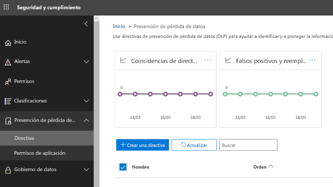
  
## Qué contiene una directiva DLP

Una directiva DLP contiene unas pocas cosas básicas:
  
- Dónde proteger el contenido: **ubicaciones** como Exchange Online, SharePoint Online y OneDrive para la empresa, así como mensajes de chat y canales de Microsoft Teams. 
    
- Cuándo y cómo proteger el contenido aplicando **reglas** compuestas de: 
    
  - **Condiciones** que debe cumplir el contenido antes de que se aplique la regla. Por ejemplo, una regla puede estar configurada para buscar únicamente contenido que incluya números de la seguridad social que se hayan compartido con personas fuera de la organización. 
    
  - **Acciones** que desea que realice la regla automáticamente cuando se encuentre contenido que coincida con las condiciones. Por ejemplo, una regla se puede configurar para bloquear el acceso a un documento y enviar una notificación por correo electrónico al usuario y al responsable de cumplimiento. 
    
Puede usar una regla para satisfacer un requisito de protección específico y después usar una directiva DLP para agrupar los requisitos de protección comunes, como todas las reglas necesarias para cumplir una normativa específica.
  
Por ejemplo, podría tener una directiva DLP que ayude a detectar la presencia de información sujeta a la Ley de transferencia y responsabilidad de seguros de salud (HIPAA). Esta directiva de DLP puede ayudarle a proteger los datos de HIPAA (el What) en todos los sitios de SharePoint Online y todos los sitios de OneDrive para la empresa (el Where) mediante la búsqueda de cualquier documento que contenga esta información confidencial que se comparte con personas de fuera de la organización (el condiciones) y, a continuación, bloquear el acceso al documento y enviar una notificación (las acciones). Estos requisitos se almacenan como reglas individuales y se agrupan juntos como una directiva DLP para simplificar la administración y los informes.
  
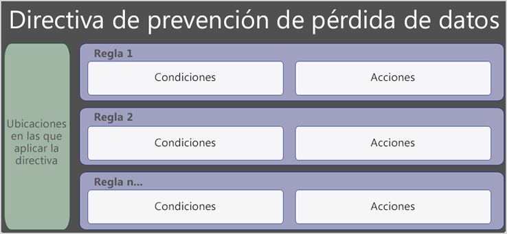
  
### Ubicaciones

Una directiva DLP puede encontrar y proteger información confidencial en Office 365, independientemente de si la información se encuentra en Exchange Online, SharePoint Online, OneDrive para la empresa o Microsoft Teams. Puede elegir proteger el contenido del correo electrónico de Exchange, los chats de Microsoft Teams y los mensajes de canal y todas las bibliotecas de SharePoint o de OneDrive, o seleccionar ubicaciones específicas para una directiva.
  
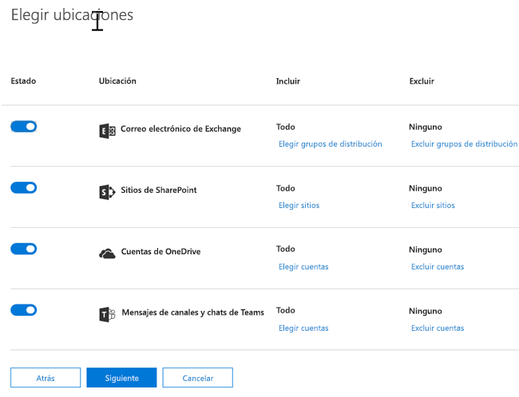
  
Si elige incluir o excluir sitios de SharePoint específicos o cuentas de OneDrive, una directiva DLP no puede contener más de 100 de inclusiones y exclusiones. Aunque este límite exista, puede superar este límite aplicando una directiva de toda la organización o una directiva que se aplique a ubicaciones completas.
  
### Reglas

Las reglas son el cumplimiento de los requisitos empresariales en el contenido de la organización. Una directiva contiene una o más reglas, y cada regla consta de las condiciones y acciones. Para cada regla, cuando se cumplen las condiciones, las acciones se realizan automáticamente. Las reglas se ejecutan secuencialmente, comenzando por la regla de mayor prioridad en cada Directiva.
  
Una regla también proporciona opciones para notificar a los usuarios (con sugerencias de directiva y notificaciones por correo electrónico) y a los administradores (con informes de incidentes de correo electrónico) que el contenido ha coincidido con la regla.
  
Estos son los componentes de una regla, que se explican a continuación.
  
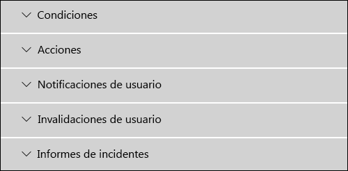
  
#### Condiciones

Las condiciones son importantes porque determinan los tipos de información que está buscando y cuándo realizar una acción. Por ejemplo, puede optar por omitir el contenido que contiene números de pasaporte, a menos que el contenido contenga más de 10 números y que se comparta con personas de fuera de la organización.
  
Las condiciones se centran en el **contenido**, por ejemplo, los tipos de información confidencial que está buscando y en el **contexto**, como con quién se comparte el documento. Puede usar condiciones para asignar distintas acciones a distintos niveles de riesgo. Por ejemplo, el contenido confidencial compartido internamente puede ser menor riesgo y requerir menos acciones que el contenido confidencial que se comparte con personas de fuera de la organización. 
  
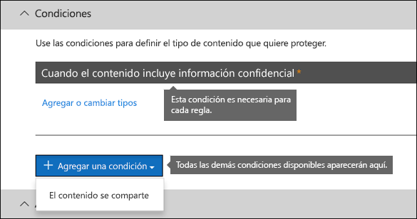
  
Las condiciones disponibles ahora pueden determinar si:
  
- El contenido contiene un tipo de información confidencial.
    
- El contenido contiene una etiqueta. Para obtener más información, vea la siguiente sección [uso de una etiqueta como condición en una directiva DLP](#using-a-label-as-a-condition-in-a-dlp-policy).
    
- El contenido se comparte con personas de fuera o dentro de la organización.
    
#### Tipos de información confidencial

Una directiva DLP puede ayudar a proteger información confidencial, que se define como un **tipo de información confidencial**. Office 365 incluye definiciones para muchos tipos comunes de información confidencial en muchas regiones diferentes que están listas para su uso, como números de tarjeta de crédito, números de cuentas bancarias, números de identificación nacionales y números de pasaporte. 
  
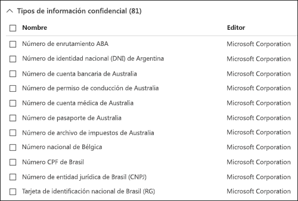
  
Cuando una directiva DLP busca un tipo de información confidencial, como un número de tarjeta de crédito, no simplemente busca un número de 16 dígitos. Cada tipo de información confidencial se define y se detecta mediante una combinación de:
  
- Palabras clave
    
- Funciones internas para validar las sumas de comprobación o composición
    
- Evaluación de expresiones regulares para buscar coincidencias de patrón
    
- Otros exámenes de contenido
    
Esto ayuda a que la detección de DLP alcance un alto grado de precisión y reduce el número de falsos positivos que pueden interrumpir el trabajo de las personas.
  
#### Acciones

Cuando el contenido coincide con una condición en una regla, puede aplicar acciones para proteger el contenido automáticamente.
  
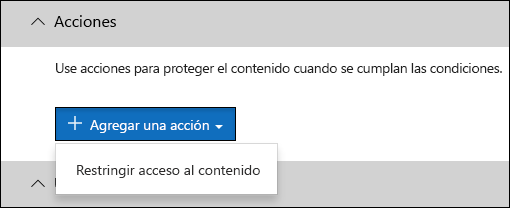
  
Con las acciones ahora disponibles, puede:
  
- **Restringir el acceso al contenido** Para el contenido del sitio, esto significa que los permisos para el documento están restringidos para todos los usuarios excepto el administrador de la colección de sitios primaria, el propietario del documento y la persona que modificó por última vez el documento. Estas personas pueden quitar la información confidencial del documento o realizar otras acciones correctivas. Cuando el documento está en cumplimiento, los permisos originales se restauran automáticamente. Cuando se bloquea el acceso a un documento, el documento aparece con un icono de sugerencia de directiva especial en la biblioteca del sitio. 
    
    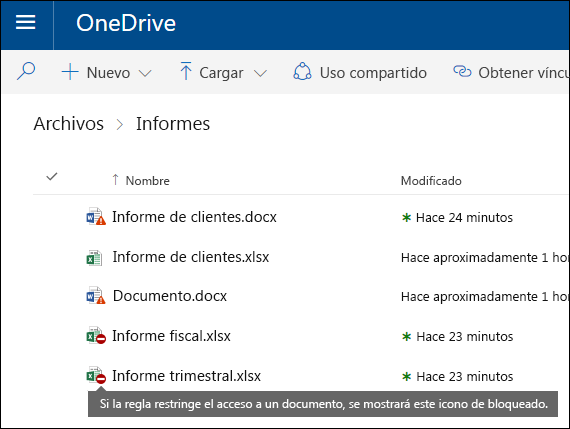
  
    En el caso del contenido de correo electrónico, esta acción impide que se envíe el mensaje. Según la configuración de la regla DLP, el remitente ve un NDR o (si la regla usa una notificación), una sugerencia de directiva o una notificación de correo electrónico.
    
    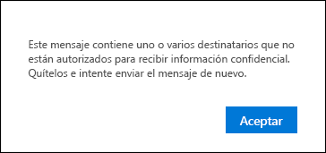
  
#### Notificaciones de usuario e invalidaciones de usuario

Puede usar notificaciones y reemplazos para educar a los usuarios sobre las directivas de DLP y ayudarles a que sigan siendo compatibles sin bloquear su trabajo. Por ejemplo, si un usuario intenta compartir un documento que contiene información confidencial, una directiva DLP puede enviarle una notificación por correo electrónico y mostrarle una sugerencia de directiva en el contexto de la biblioteca de documentos que le permite invalidar la directiva si tiene una justificación comercial.
  
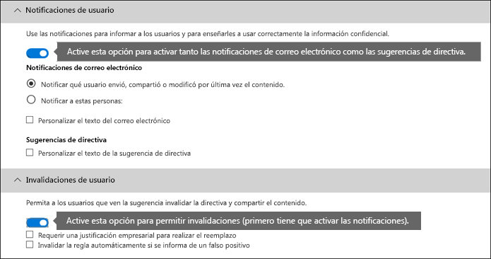
  
El correo electrónico puede notificar a la persona que envió, compartió o modificó por última vez el contenido y, para el contenido del sitio, el administrador de la colección de sitios primaria y el propietario del documento. Además, puede Agregar o quitar la que le haya elegido de la notificación de correo electrónico.
  
Además de enviar una notificación por correo electrónico, una notificación de usuario muestra una sugerencia de directiva:
  
- En Outlook y Outlook en la Web.
    
- Para el documento en un sitio de SharePoint Online o de OneDrive para la empresa.
    
- En Excel, PowerPoint y Word, cuando el documento se almacena en un sitio incluido en una directiva DLP.
    
La notificación de correo electrónico y la sugerencia de directiva explican por qué el contenido entra en conflicto con una directiva DLP. Si lo elige, la sugerencia de directiva y la notificación por correo electrónico pueden permitir que los usuarios invaliden una regla al informar de un falso positivo o proporcionar una justificación comercial. Esto puede ayudar a educar a los usuarios sobre las directivas DLP y aplicarlas sin impedir que los usuarios realicen su trabajo. La información sobre invalidaciones y falsos positivos también se registra para los informes (consulte a continuación sobre los informes de DLP) y se incluye en los informes de incidentes (sección siguiente), a fin de que el responsable de cumplimiento normativo pueda revisar periódicamente esta información.
  
Esto es lo que una sugerencia de directiva tiene como en una cuenta de OneDrive para la empresa.
  
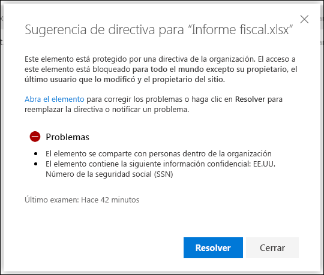
  
#### Informes de incidentes

Cuando se cumpla una regla, puede enviar un informe de incidentes al funcionario de cumplimiento (o a cualquier persona que elija) con los detalles del evento. Este informe incluye información sobre el elemento coincidente, el contenido real que coincide con la regla y el nombre de la persona que modificó por última vez el contenido. Para los mensajes de correo electrónico, el informe también incluye como datos adjuntos el mensaje original que coincide con una directiva de DLP.
  
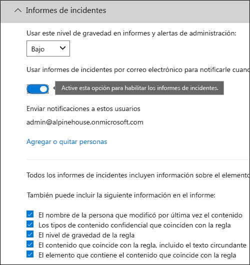
  
## Operadores lógicos y de agrupación

A menudo, la Directiva de DLP tiene un requisito sencillo, como para identificar todo el contenido que contiene un número de la seguridad social de Estados Unidos. Sin embargo, en otros escenarios, es posible que la Directiva DLP necesite identificar datos definidos de manera más flexible.
  
Por ejemplo, para identificar el contenido sujeto a la ley de seguros de salud de Estados Unidos (HIPAA), debe buscar:
  
- Contenido que contiene tipos específicos de información confidencial, como un número de la seguridad social de Estados Unidos o un número de agencia de imposición de drogas (DEA).
    
    Y
    
- Contenido que es más difícil de identificar, como las comunicaciones sobre la atención de un paciente o las descripciones de los servicios médicos proporcionados. La identificación de este contenido requiere palabras clave que coincidan con las listas de palabras clave muy grandes, como la clasificación internacional de enfermedades (ICD-9-CM o ICD-10-cm).
    
Puede identificar fácilmente los datos definidos de forma flexible mediante operadores lógicos y de agrupación (AND, OR). Al crear una directiva DLP, puede:
  
- Agrupe los tipos de información confidencial.
    
- Elija el operador lógico entre los tipos de información confidencial dentro de un grupo y entre los propios grupos.
    
### Elegir el operador dentro de un grupo

Dentro de un grupo, puede elegir si debe cumplirse alguna o todas las condiciones de ese grupo para que el contenido cumpla la regla.
  
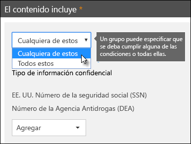
  
### Adición de un grupo

Puede agregar rápidamente un grupo, que puede tener sus propias condiciones y operador dentro de ese grupo.
  
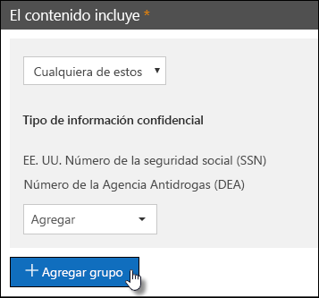
  
### Elegir el operador entre grupos

Entre grupos, puede elegir si se deben cumplir las condiciones en un solo grupo o en todos los grupos para que el contenido cumpla la regla.
  
Por ejemplo, la Directiva integrada de **HIPAA de Estados Unidos** tiene una regla que usa un operador **and** entre los grupos para identificar el contenido que contiene: 
  
- de los identificadores de **PII** de grupo (al menos un número de SSN **o** número de DEA) 
    
    **AND**
    
- de los **términos médicos** del grupo (al menos una palabra clave ICD-9-cm **o** una palabra clave ICD-10-cm) 
    
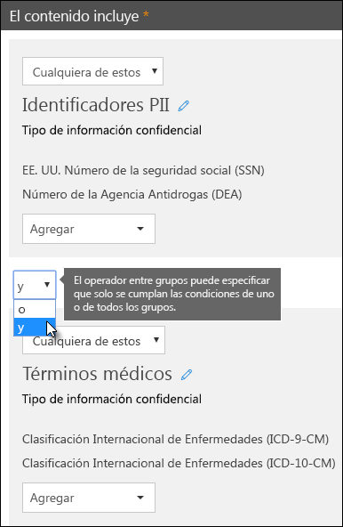
  
## La prioridad mediante la que se procesan las reglas

Cuando se crean reglas en una directiva, a cada regla se le asigna una prioridad en el orden en que se crea (es decir, la regla creada primero tiene la prioridad First, la segunda regla creada tiene la segunda prioridad, y así sucesivamente). 
  
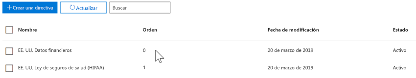
  
Una vez que haya configurado más de una directiva de DLP, puede cambiar la prioridad de una o varias directivas. Para ello, seleccione una directiva, elija **Editar Directiva**y use la lista **prioridad** para especificar su prioridad.

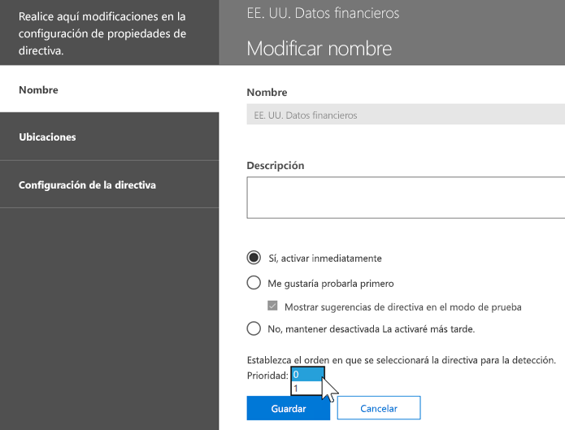

Cuando el contenido se evalúa según las reglas, las reglas se procesan en orden de prioridad. Si el contenido coincide con varias reglas, las reglas se procesan en orden de prioridad y se aplica la acción más restrictiva. Por ejemplo, si el contenido coincide con todas las reglas siguientes, se aplica la regla 3 porque es la regla más restrictiva y más restrictiva:
  
- Regla 1: solo notifica a los usuarios
    
- Regla 2: notifica a los usuarios, restringe el acceso y permite invalidaciones de usuario
    
- Regla 3: notifica a los usuarios, restringe el acceso y no permite invalidaciones de usuario
    
- Regla 4: solo notifica a los usuarios
    
- Regla 5: restringe el acceso
    
- Regla 6: notifica a los usuarios, restringe el acceso y no permite invalidaciones de usuario
    
En este ejemplo, tenga en cuenta que las coincidencias de todas las reglas se registran en los registros de auditoría y se muestran en los informes de DLP, aunque solo se aplica la regla más restrictiva.
  
En relación con las sugerencias de Directiva, tenga en cuenta que:
  
- Solo se mostrará la sugerencia de directiva de la regla más alta prioridad, que es la más restrictiva. Por ejemplo, una sugerencia de directiva de una regla que bloquea el acceso al contenido se mostrará por encima de una sugerencia de directiva de una regla que simplemente envía una notificación. Esto impide que las personas vean una cascada de sugerencias de directiva.
    
- Si las sugerencias de directiva en la regla más restrictiva permite que los usuarios invaliden la regla, la invalidación de esta regla invalida también otras reglas que coinciden con el contenido.
    
## Ajuste de reglas para que sea más fácil o más difícil hacer coincidir

Una vez que los usuarios crean y activan sus directivas de DLP, algunas veces se encontrarán en estos problemas:
  
- Demasiado contenido que **no es** información confidencial coincide con las reglas, es decir, hay demasiados falsos positivos. 
    
- Hay muy poco contenido que **es** información confidencial que coincide con las reglas. Es decir, las acciones de protección no se aplican a la información confidencial. 
    
Para solucionar estos problemas, puede ajustar las reglas ajustando el recuento de instancias y la precisión de coincidencia para que el contenido sea más difícil o más fácil de coincidir con las reglas. Cada tipo de información confidencial que se usa en una regla tiene un recuento de instancias y una precisión de coincidencia.
  
### Número de instancias

El recuento de instancias significa simplemente el número de repeticiones de un tipo específico de información confidencial que debe estar presente para que el contenido cumpla la regla. Por ejemplo, el contenido coincide con la regla que se muestra a continuación si se encuentra entre 1 y 9 únicos estadounidenses o Reino Unido. se identifican los números de pasaporte.
  
Tenga en cuenta que el recuento de instancias incluye solo coincidencias **únicas** para los tipos de información confidencial y palabras clave. Por ejemplo, si un correo electrónico contiene 10 ocurrencias del mismo número de tarjeta de crédito, los 10 repeticiones contarán como una única instancia de un número de tarjeta de crédito. 
  
Para usar el recuento de instancias para ajustar las reglas, las instrucciones son sencillas:
  
- Para que sea más fácil hacer coincidir la regla, reduzca el recuento **mínimo** y/o aumente el recuento **máximo** . También puede establecer **Max** en **any** mediante la eliminación del valor numérico. 
    
- Para hacer que la regla sea más difícil de encontrar, aumente el recuento **mínimo** . 
    
Normalmente, las acciones menos restrictivas, como el envío de notificaciones de usuario, se usan en una regla con un recuento de instancias menor (por ejemplo, 1-9). Y usted usa acciones más restrictivas, como restringir el acceso al contenido sin permitir invalidaciones de usuario, en una regla con un recuento de instancias superior (por ejemplo, 10-any).
  
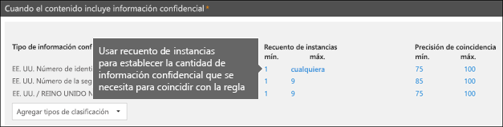
  
### Precisión de coincidencia

Como se ha descrito anteriormente, se define y se detecta un tipo de información confidencial mediante una combinación de distintos tipos de evidencias. Normalmente, un tipo de información confidencial se define mediante varias combinaciones de este tipo, denominadas patrones. Un patrón que requiere menos evidencia tiene una precisión inferior de coincidencia (o nivel de confianza), mientras que un patrón que requiere más evidencia tiene una precisión de coincidencia superior (o nivel de confianza). Para obtener más información acerca de los patrones reales y los niveles de confianza que se usan en cada tipo de información confidencial, vea [Qué buscan los tipos de información confidencial](what-the-sensitive-information-types-look-for.md).
  
Por ejemplo, el tipo de información confidencial denominado número de tarjeta de crédito se define mediante dos patrones:
  
- Un patrón con 65% de confianza que requiere:
    
  - Un número en el formato de un número de tarjeta de crédito.
    
  - Número que pasa la suma de comprobación.
    
- Un patrón con 85% de confianza que requiere:
    
  - Un número en el formato de un número de tarjeta de crédito.
    
  - Número que pasa la suma de comprobación.
    
  - Una palabra clave o una fecha de expiración en el formato correcto.
    
Puede usar estos niveles de confianza (o precisión de coincidencia) en las reglas. Normalmente, las acciones menos restrictivas, como el envío de notificaciones de usuario, se usan en una regla con precisión de coincidencia inferior. Y usted usa acciones más restrictivas, como restringir el acceso al contenido sin permitir invalidaciones de usuario, en una regla con precisión de coincidencia superior.
  
Es importante comprender que cuando se identifica un tipo específico de información confidencial, como un número de tarjeta de crédito, en el contenido, solo se devuelve un único nivel de confianza:
  
- Si todas las coincidencias son para un único patrón, se devuelve el nivel de confianza para ese patrón.
    
- Si hay coincidencias para más de un patrón (es decir, hay coincidencias con dos niveles de confianza diferentes), se devuelve un nivel de confianza superior a cualquiera de los patrones únicos. Esta es la parte difícil. Por ejemplo, en el caso de una tarjeta de crédito, si se cumplen los patrones de 65% y 85%, el nivel de confianza devuelto para ese tipo de información confidencial es superior al 90%, ya que hay más evidencia implica más confianza.
    
Por lo tanto, si desea crear dos reglas mutuamente excluyentes para tarjetas de crédito, una para la precisión de coincidencia del 65% y otra para la precisión del 85%, los rangos para la precisión de coincidencia tendrían el aspecto siguiente. La primera regla recoge solo las coincidencias del patrón 65%. La segunda regla recoge coincidencias con **al menos un** 85% de coincidencia y **posiblemente puede tener** otras coincidencias de menor confianza. 
  
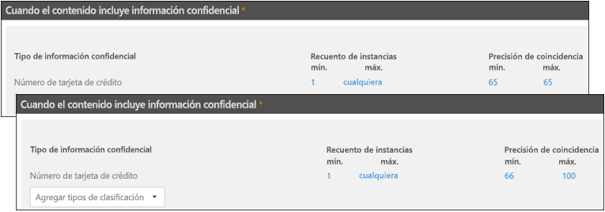
  
Por estos motivos, las instrucciones para crear reglas con diferentes precisiones de coincidencia son las siguientes:
  
- El nivel de confianza más bajo suele usar el mismo valor para **mín** y **máx** (no es un intervalo). 
    
- El nivel de confianza más alto suele ser un intervalo desde justo encima del nivel de confianza inferior a 100.
    
- Los niveles de confianza intermedios suelen ir desde justo encima del nivel de confianza inferior hasta justo por debajo del nivel de confianza más alto.
    
## Uso de una etiqueta como condición en una directiva DLP

Puede crear una etiqueta y, a continuación:
  
- **Publíquelo** para que los usuarios finales puedan ver y aplicar manualmente la etiqueta al contenido. 
    
- **Aplicarla automáticamente** al contenido que coincida con las condiciones que elija. 
    
Para obtener más información acerca de las etiquetas, vea [información general sobre las etiquetas de retención](labels.md).
  
Después de crear una etiqueta, puede usarla como condición en las directivas de DLP. Por ejemplo, es posible que desee hacer esto porque:
  
- Ha publicado una etiqueta denominada **confidencial**, de modo que las personas de su organización puedan aplicar manualmente la etiqueta al correo electrónico confidencial y a los documentos. Al usar esta etiqueta como una condición en la Directiva DLP, puede restringir el contenido de la etiqueta **confidencial** para que no pueda compartirse con personas de fuera de la organización. 
    
- Ha creado una etiqueta denominada **Alpine House** para un proyecto con ese nombre y, a continuación, ha aplicado esa etiqueta automáticamente al contenido que contiene las palabras clave "Alpine House". Al usar esta etiqueta como una condición en la Directiva DLP, puede mostrar una sugerencia de directiva a los usuarios finales cuando están a punto de compartir este contenido con alguien ajeno a su organización. 
    
- Publicó una etiqueta denominada " **registro de impuestos**" para que su administrador de registros pueda aplicar manualmente la etiqueta al contenido que debe clasificarse como un registro. Si usa esta etiqueta como condición en su Directiva DLP, puede buscar contenido con esta etiqueta junto con otros tipos de información confidencial, como ITINs o SSN; aplicar acciones de protección al registro de **impuestos**etiquetado de contenido; y obtenga informes detallados sobre la Directiva DLP de los informes de DLP y los datos del registro de auditoría. 
    
- Publicó una etiqueta denominada **Director Ejecutivo sensible al equipo** para los buzones de Exchange y las cuentas de OneDrive de un grupo de ejecutivos. Si usa esta etiqueta como condición en la Directiva DLP, puede aplicar acciones de retención y protección en el mismo subconjunto de contenido y usuarios. 
    
Mediante el uso de etiquetas como condición en las reglas de DLP, puede aplicar selectivamente acciones de protección en un conjunto específico de contenido, ubicaciones o usuarios.
  
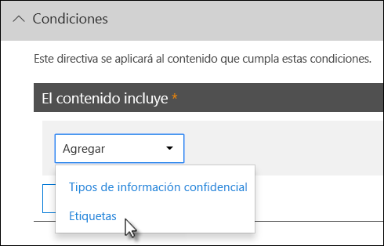

### La compatibilidad con las etiquetas de confidencialidad viene

Actualmente, puede usar solo una etiqueta de retención como condición, no como [etiqueta](sensitivity-labels.md)de confidencialidad. Actualmente estamos trabajando en soporte para usar una etiqueta de confidencialidad en esta condición.
  
### Cómo se relaciona esta característica con otras características

Se pueden aplicar varias características al contenido que contiene información confidencial:
  
- Una [etiqueta de retención](labels.md#applying-a-retention-label-automatically-based-on-conditions) y una [Directiva de retención](retention-policies.md) pueden aplicar acciones de **retención** en este contenido. 
    
- Una directiva DLP puede aplicar acciones de **protección** a este contenido. Y antes de aplicar estas acciones, una directiva DLP puede requerir que se cumplan otras condiciones además del contenido que contiene una etiqueta. 
    
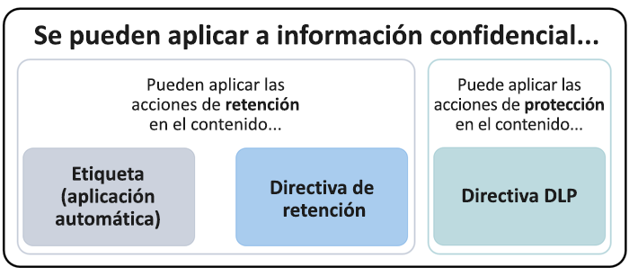
  
Tenga en cuenta que una directiva DLP tiene una capacidad de detección más completa que una directiva de retención o etiqueta aplicada a la información confidencial. Una directiva DLP puede imponer acciones de protección en el contenido que contiene información confidencial y, si se elimina la información confidencial del contenido, esas acciones de protección se deshacen la próxima vez que se examina el contenido. Pero si se aplica una directiva de retención o una etiqueta al contenido que contiene información confidencial, es una acción que no se deshará aunque se quite la información confidencial.
  
Mediante el uso de una etiqueta como condición en una directiva DLP, puede aplicar acciones de retención y protección en el contenido con esa etiqueta. Puede pensar que el contenido que contiene una etiqueta es exactamente igual al contenido que contiene información confidencial (tanto una etiqueta como un tipo de información confidencial) son las propiedades que se usan para clasificar el contenido, de modo que pueda aplicar acciones en ese contenido.
  
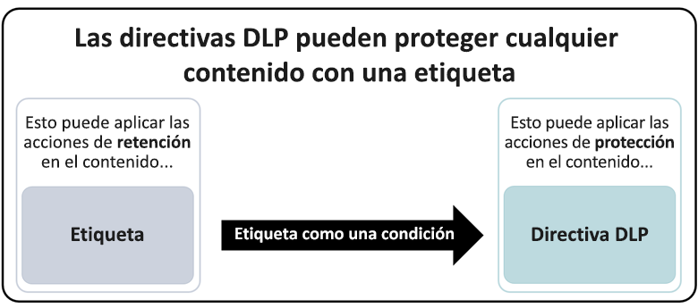
  
## Configuración sencilla frente a configuración avanzada

Al crear una directiva DLP, tendrá que elegir entre una configuración simple o avanzada:
  
- La **Configuración sencilla** facilita la creación del tipo más común de directiva de DLP sin usar el editor de reglas para crear o modificar reglas. 
    
- **Configuración avanzada** use el editor de reglas para proporcionar un control completo sobre cada configuración de la Directiva de DLP. 
    
No se preocupe, en las cubiertas, la configuración simple y la configuración avanzada funcionan exactamente de la misma manera, al aplicar las reglas que se componen de condiciones y acciones, solo con una configuración sencilla, no se ve el editor de reglas. Es una forma rápida de crear una directiva DLP.
  
### Configuración sencilla

El escenario de DLP más común es la creación de una directiva para ayudar a proteger el contenido que contiene información confidencial para que no se pueda compartir con personas de fuera de la organización y realizar una acción correctiva automática, como restringir quién puede tener acceso al contenido. enviar notificaciones de usuario final o de administrador, y auditar el evento para una investigación posterior. Los usuarios usan DLP para ayudar a evitar la divulgación inadvertida de información confidencial.
  
Para simplificar la consecución de este objetivo, al crear una directiva DLP, puede elegir **Usar configuración sencilla**. Esta configuración le proporciona todo lo que necesita para implementar la Directiva de DLP más común, sin tener que ir al editor de reglas.
  
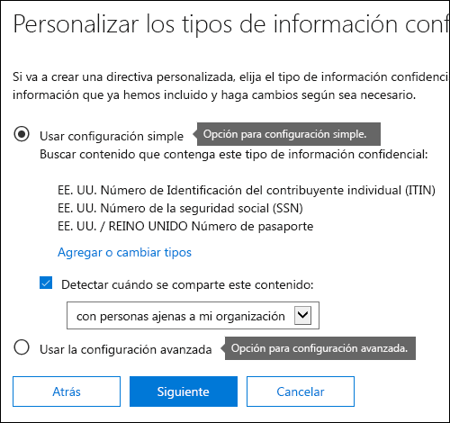
  
### Configuración avanzada

Si necesita crear directivas de DLP más personalizadas, puede elegir **Usar configuración avanzada**.
  
La configuración avanzada presenta el editor de reglas, donde tiene control total sobre cada opción posible, incluidos el recuento de instancias y la precisión de coincidencia (nivel de confianza) para cada regla.
  
Para saltar a una sección rápidamente, haga clic en un elemento en la navegación superior del editor de reglas para ir a la sección siguiente.
  
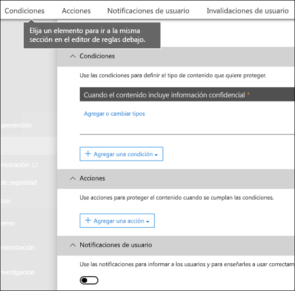
  
## Plantillas de directiva de DLP

El primer paso para crear una directiva de DLP es elegir la información que se va a proteger. Al empezar con una plantilla DLP, se guarda el trabajo de crear un nuevo conjunto de reglas desde el principio y se averigua qué tipos de información deben incluirse de forma predeterminada. A continuación, puede Agregar o modificar estos requisitos para ajustar la regla de acuerdo con los requisitos específicos de la organización.
  
Una plantilla de directiva DLP preconfigurada puede ayudarle a detectar determinados tipos de información confidencial, como datos de HIPAA, datos PCI-DSS, datos de Act de Gramm-Leach-Bliley o incluso información de identificación personal específica de la configuración regional (P.I.). Para facilitar la búsqueda y la protección de tipos comunes de información confidencial, las plantillas de directiva que se incluyen en Office 365 ya contienen los tipos más comunes de información confidencial necesarios para comenzar.
  
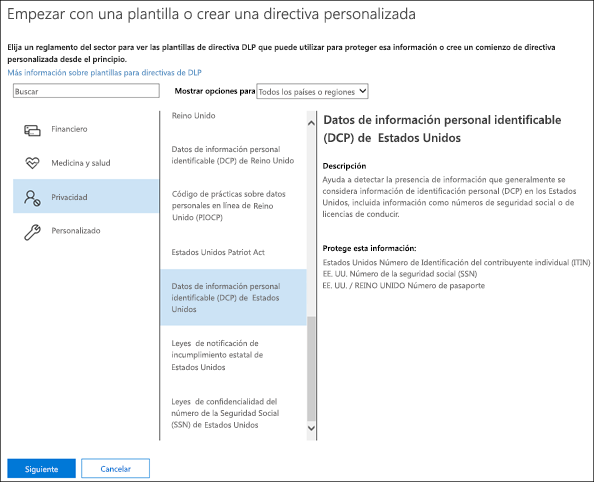
  
Su organización también puede tener sus propios requisitos específicos, en cuyo caso puede crear una directiva DLP desde cero eligiendo la opción **directiva personalizada** . Una directiva personalizada está vacía y no contiene reglas prehechas. 
  
## Implementar las directivas DLP gradualmente con el modo de prueba

Cuando crea directivas DLP, considere la posibilidad de implementarlas gradualmente para evaluar su impacto y probar su eficacia antes de aplicarlas completamente. Por ejemplo, no desea que una nueva Directiva de DLP bloquee involuntariamente el acceso a miles de documentos a los que los usuarios necesitan acceso para realizar su trabajo.
  
Si va a crear directivas de DLP con un gran impacto potencial, le recomendamos seguir esta secuencia:
  
1. **Inicie el modo de prueba sin sugerencias de directiva** y, a continuación, use los informes de DLP y los informes de incidentes para evaluar el impacto. Los informes DLP le sirven para ver el número, la ubicación, el tipo y la gravedad de las coincidencias de directivas. En función de los resultados, puede ajustar las reglas según sea necesario. En el modo de prueba, las directivas DLP no afectarán a la productividad de las personas que trabajan en su organización. 
    
2. **Cambie a modo de prueba con notificaciones y sugerencias de directivas** para que pueda comenzar a enseñar a los usuarios las directivas de cumplimiento y prepararlos para las reglas que se van a aplicar. En esta fase, también puede solicitar a los usuarios que informen de falsos positivos para que pueda perfeccionar las reglas de los usuarios. 
    
3. **Inicie la aplicación completa en las directivas** para que se apliquen las acciones de las reglas y el contenido esté protegido. Continúe supervisando los informes DLP y los informes de incidentes o las notificaciones para asegurarse de que los resultados sean los deseados. 
    
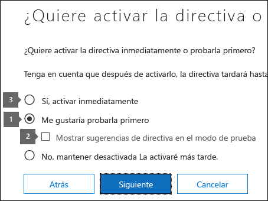
  
Una directiva DLP se puede desactivar en cualquier momento, lo que afecta a todas las reglas de la directiva. Sin embargo, cada regla también se puede desactivar individualmente si se activa o desactiva su estado en el editor de reglas.
  
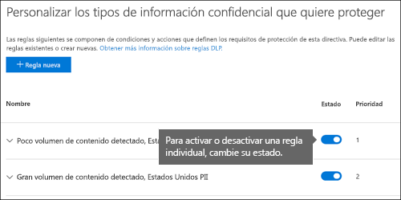

También puede cambiar la prioridad de varias reglas de una directiva. Para ello, abra una directiva para editarla. En una fila de una regla, elija los puntos suspensivos (**...**) y, a continuación, elija una opción, como **bajar** o **traer al final**.

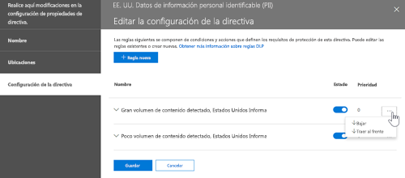
  
## Informes de DLP

Una vez que haya creado y activado las directivas de DLP, le conviene que compruebe que funcionan según lo previsto y le ayude a mantener la conformidad. Con los informes de DLP, puede ver rápidamente el número de directivas DLP y coincidencias de regla a lo largo del tiempo, así como el número de falsos positivos e invalidaciones. En cada informe, las coincidencias se pueden filtrar por ubicación, período de tiempo e incluso se puede especificar una directiva, una regla o una acción concretas.
  
Con los informes de DLP, puede obtener información de la empresa y:
  
- Centrarse en períodos de tiempo específicos y comprender las causas de los picos y las tendencias.
    
- Descubrir los procesos de negocio que infringen las directivas de cumplimiento de la organización.
    
- Comprender cualquier impacto de negocio de las directivas DLP.
    
Además, puede usar los informes de DLP para ajustar sus directivas DLP mientras las ejecuta.
  
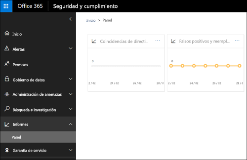
  
## Cómo funcionan las directivas DLP

DLP detecta información confidencial mediante un análisis profundo del contenido (no solo un análisis de texto simple). Este análisis profundo del contenido usa coincidencias de palabras clave, coincidencias de diccionario, la evaluación de expresiones regulares, funciones internas y otros métodos para detectar el contenido que coincide con las directivas DLP. Posiblemente solo un pequeño porcentaje de los datos se considera confidencial. Una directiva DLP puede identificar, supervisar y proteger automáticamente solo esos datos, sin obstaculizar o afectar a las personas que trabajan con el resto del contenido.
  
### Las directivas se sincronizan

Después de crear una directiva DLP en el centro &amp; de seguridad y cumplimiento, se almacena en un almacén central de directivas y, a continuación, se sincroniza con los distintos orígenes de contenido, entre los que se incluyen:
  
- Exchange Online y de ahí a Outlook en la web y Outlook
    
- Sitios de OneDrive para la Empresa
    
- Sitios de SharePoint Online
    
- Programas de escritorio de Office (Excel, PowerPoint y Word)

- Canales y mensajes de chat de Microsoft Teams
    
Una vez que la Directiva se ha sincronizado en las ubicaciones adecuadas, comienza a evaluar el contenido y a aplicar las acciones.
  
### Evaluación de la directiva en sitios de OneDrive para la Empresa y SharePoint Online

En todos los sitios de SharePoint Online y los sitios de OneDrive para la empresa, los documentos cambian constantemente, por lo que continuamente se crean, editan, comparten, etc. Esto significa que los documentos pueden entrar en conflicto o pasar a ser conformes con una directiva DLP en cualquier momento. Por ejemplo, una persona puede cargar un documento que no contenga información confidencial a su sitio de grupo, pero más adelante, puede editar el mismo documento y agregar información confidencial.
  
Por este motivo, las directivas DLP buscan frecuentemente y en segundo plano coincidencias de directivas en los documentos. Puede considerarlo como una evaluación asincrónica de directiva.
  
#### Cómo funciona
 
A medida que los usuarios agregan o cambian documentos en sus sitios, el motor de búsqueda analiza el contenido para que usted pueda encontrarlo más adelante. Mientras esto sucede, el contenido también se examina en busca de información confidencial y se comprueba si está compartido. Toda la información confidencial encontrada se almacena de forma segura en el índice de búsqueda, por lo que solo el equipo de cumplimiento puede tener acceso a ella, pero no a los usuarios típicos. Cada directiva DLP que haya activado se ejecuta en segundo plano (asincrónicamente), comprobando la búsqueda con frecuencia en busca de contenido que coincida con una directiva y aplicando acciones para protegerla de pérdidas accidentales.
  
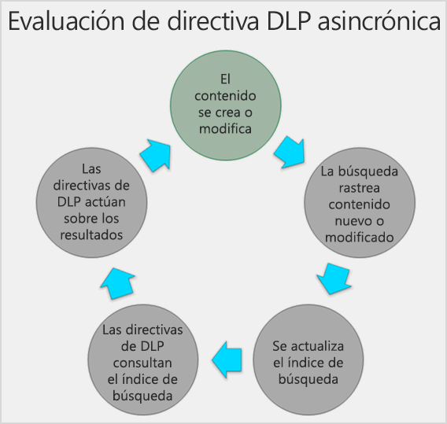
  
Por último, los documentos pueden entrar en conflicto con una directiva DLP, pero también pueden cumplir con una directiva DLP. Por ejemplo, si una persona agrega números de tarjeta de crédito a un documento, podría hacer que una directiva DLP bloquee el acceso al documento de forma automática. Pero si la persona elimina más adelante la información confidencial, la acción (en este caso, el bloqueo) se deshace automáticamente la próxima vez que se evalúa el documento con la directiva.
  
La DLP evalúa cualquier contenido que se pueda indexar. Para obtener más información sobre los tipos de archivo que se rastrean de forma predeterminada, vea [extensiones de nombre de archivo y tipos de archivos analizados predeterminados en SharePoint Server](https://docs.microsoft.com/SharePoint/technical-reference/default-crawled-file-name-extensions-and-parsed-file-types).
  
### Evaluación de la Directiva en Exchange Online, Outlook y Outlook en la web

Cuando se crea una directiva DLP que incluye Exchange online como ubicación, la Directiva se sincroniza desde el centro de seguridad &amp; y cumplimiento de Office 365 a Exchange Online y, a continuación, desde Exchange Online a Outlook en la web y Outlook.
  
Cuando se redacta un mensaje en Outlook, el usuario puede ver las sugerencias de directiva a medida que se evalúa el contenido que se está creando en las directivas de DLP. Y después de enviar un mensaje, se evalúa en las directivas DLP como una parte normal del flujo de correo, junto con las reglas de flujo de correo de Exchange (también conocidas como reglas de transporte) y las directivas de DLP creadas en el centro de administración de Exchange. Las directivas de DLP examinan el mensaje y los datos adjuntos.
  
### Evaluación de la Directiva en los programas de escritorio de Office

Excel, PowerPoint y Word incluyen la misma capacidad para identificar información confidencial y aplicar directivas de DLP como SharePoint Online y OneDrive para la empresa. Estos programas de Office sincronizan sus directivas de DLP directamente desde el almacén de directivas central y, a continuación, evalúan continuamente el contenido con las directivas DLP cuando trabajan con documentos abiertos desde un sitio que se incluye en una directiva DLP.
  
La evaluación de la Directiva DLP en Office está diseñada para no afectar al rendimiento de los programas o a la productividad de los usuarios que trabajan en el contenido. Si están trabajando en un documento de gran tamaño o el equipo del usuario está ocupado, la sugerencia de Directiva puede tardar unos segundos en aparecer.

### Evaluación de directivas en Microsoft Teams
 
Al crear una directiva DLP que incluya a Microsoft Teams como ubicación, la Directiva se sincroniza desde el centro de seguridad &amp; y cumplimiento de Office 365 a las cuentas de usuario y los canales y los mensajes de chat de Microsoft Teams. Según la configuración de las directivas de DLP, cuando alguien intente compartir información confidencial en un mensaje de chat o canal de Microsoft Teams, el mensaje se puede bloquear o revocar. Además, los documentos que contengan información confidencial y que se compartan con invitados (usuarios externos) no se abrirán para esos usuarios. Para obtener más información, consulte [prevención de pérdida de datos y Microsoft Teams](dlp-microsoft-teams.md).
 
## Permisos

Los miembros del equipo de cumplimiento que crearán directivas de DLP necesitan permisos para &amp; el centro de seguridad y cumplimiento. De forma predeterminada, el administrador de espacios empresariales tendrá acceso a esta ubicación y puede conceder a los responsables de cumplimiento y &amp; otras personas acceso al centro de seguridad y cumplimiento, sin concederles todos los permisos de un administrador de inquilinos. Para ello, se recomienda:
  
1. Crear un grupo en Office 365 y agregarle responsables de cumplimiento.
    
2. Cree un grupo de roles en la página de **permisos** del &amp; centro de seguridad y cumplimiento. 
    
3. Agregar el grupo de Office 365 al grupo de roles.
    
Para obtener más información, consulte [Give users access to the Office 365 Compliance Center](grant-access-to-the-security-and-compliance-center.md).
  
Estos permisos son necesarios solo para crear y aplicar una directiva de DLP. La aplicación de directivas no requiere acceso al contenido.
  
## Buscar los cmdlets de DLP

Para usar la mayoría de los cmdlets del centro &amp; de seguridad y cumplimiento, debe:
  
1. [Conectarse al Centro de seguridad y cumplimiento de Office 365 mediante PowerShell remoto](https://docs.microsoft.com/powershell/exchange/office-365-scc/connect-to-scc-powershell/connect-to-scc-powershell?view=exchange-ps)
    
2. Usar cualquiera de estos [cmdlets de directiva y-Compliance-DLP](https://docs.microsoft.com/powershell/module/exchange/policy-and-compliance-dlp/export-dlppolicycollection?view=exchange-ps)
    
Sin embargo, los informes DLP necesitan extraer datos de toda la oficina 365, incluido Exchange Online. Por este motivo, **los cmdlets para los informes DLP están disponibles en Exchange Online PowerShell, no en el PowerShell &amp; del centro de seguridad y cumplimiento**. Por lo tanto, para usar los cmdlets para los informes de DLP, debe:
  
1. [Conectarse a Exchange Online con el PowerShell remoto](https://docs.microsoft.com/powershell/exchange/exchange-online/connect-to-exchange-online-powershell/connect-to-exchange-online-powershell?view=exchange-ps)
    
2. Use cualquiera de estos cmdlets para los informes de DLP:
    
  - [Get-DlpDetectionsReport](https://docs.microsoft.com/powershell/module/exchange/policy-and-compliance-dlp/Get-DlpDetectionsReport?view=exchange-ps)
    
  - [Get-DlpDetailReport](https://docs.microsoft.com/powershell/module/exchange/policy-and-compliance-dlp/Get-DlpDetailReport?view=exchange-ps)
    
## Más información

- [Crear una directiva DLP a partir de una plantilla](create-a-dlp-policy-from-a-template.md)
    
- [Enviar notificaciones y mostrar sugerencias para directivas DLP](use-notifications-and-policy-tips.md)
    
- [Crear una directiva DLP para proteger documentos con FCI u otras propiedades](protect-documents-that-have-fci-or-other-properties.md)
    
- [Qué incluyen las plantillas de directiva DLP](what-the-dlp-policy-templates-include.md)
    
- [Qué buscan los tipos de información confidencial](what-the-sensitive-information-types-look-for.md)
    
- [Qué buscan las funciones de DLP](what-the-dlp-functions-look-for.md)
    
- [Crear un tipo personalizado de información confidencial](create-a-custom-sensitive-information-type.md)
    

