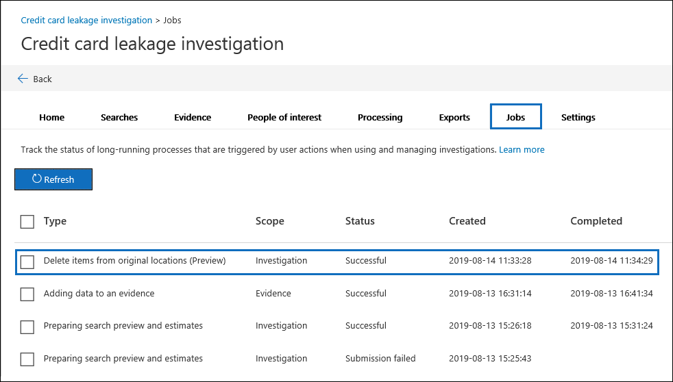

# Eliminar elementos de su ubicación original (versión preliminar)

La característica para eliminar elementos de su ubicación original está en versión preliminar.

Mediante el uso de investigaciones de datos, puede eliminar elementos de sus ubicaciones originales. Esto significa que puede eliminar elementos de los buzones de Exchange, los sitios de SharePoint y las cuentas de OneDrive en toda la organización. Como ha recopilado elementos como evidencia, tiene copias de los elementos retenidos en el conjunto de evidencias para una mayor investigación o mantener como referencia.

## Antes de empezar

- Para eliminar elementos, debe tener asignado el rol de **búsqueda y purga** en el centro de seguridad & cumplimiento. Este rol se asigna de forma predeterminada al grupo de roles de investigador de datos integrado. 

- El procedimiento de este tema presupone que ha ejecutado una búsqueda asociada a una investigación y ha agregado los resultados de la búsqueda a un conjunto de evidencias. Una vez que los resultados de la búsqueda estén en prueba, puede seleccionar uno o más elementos para eliminarlos. Para obtener más información, vea [buscar datos en una investigación](search-for-data.md).

- Es importante tener en cuenta que solo se eliminan los elementos de las ubicaciones de contenido originales (como los buzones de Exchange, los sitios de SharePoint y las cuentas de OneDrive). Estos elementos no se eliminan del conjunto de evidencias. Esto se debe a que los elementos de un conjunto de evidencias son copias del original. Estos elementos se copian cuando se agregan los resultados de una búsqueda a un conjunto de evidencias.

## Eliminar elementos

Realice los siguientes pasos para eliminar elementos de su ubicación original:

1. En la herramienta de **investigaciones de datos** , abra la investigación de datos que contiene los elementos que desea eliminar y, a continuación, haga clic en la pestaña **evidencia** .

2. Seleccione los elementos que desea eliminar. Puede seleccionar todos los elementos del conjunto de evidencias o seleccionar solo un subconjunto de elementos. 

   > [!NOTE]
   > Si selecciona los datos adjuntos de un correo electrónico o un archivo adjunto a un documento en SharePoint y OneDrive, el elemento primario también se seleccionará y se eliminará cuando se elimine el elemento de su ubicación original. De forma similar, si selecciona un elemento que tiene datos adjuntos, el elemento de elemento primario y todos los datos adjuntos se eliminan.
 
2. Haga clic en **acción** y, a continuación, en **eliminar elementos desde ubicaciones originales**.

   

3. En la página de flotante, compruebe el número de elementos y los documentos secundarios relacionados que se eliminarán y, a continuación, haga clic en **eliminar**.

   

   > [!NOTE]
   > En la captura de pantalla anterior, el número de elementos indica el número de elementos que se seleccionan para su eliminación. El número de documentos indica el número total de elementos, incluidos los archivos que están adjuntos a un elemento primario. Por ejemplo, si selecciona un mensaje de correo electrónico y ese mensaje tiene un documento de Word adjunto, el número de elementos y documentos que se muestra en **documentos seleccionados sólo** sería de **1 elemento (2 documentos)**.

Puede realizar un seguimiento del progreso del trabajo **eliminar elementos desde ubicaciones originales** en la pestaña **trabajos** . Haga clic en el trabajo para mostrar la página de flotante. 

Cuando se eliminan los elementos del trabajo, el estado del trabajo se establece en **correcto**. También se muestra la fecha y la hora del trabajo completado. 

> [!NOTE]
> Es posible que reciba un estado de **parcialmente correcto** para el trabajo **eliminar elementos de ubicaciones originales** . Hay una serie de situaciones que dan como resultado este estado de trabajo. Para obtener más información, vea la sección [eliminaciones parcialmente correctas](#partially-successful-deletions) en este artículo.

## Qué sucede cuando se eliminan elementos

En este momento, cuando se eliminan elementos de su ubicación de contenido original, los elementos se *eliminan temporalmente*. Esto significa que los elementos se mueven a una ubicación especial y se conservan hasta que expira el período de retención de elementos eliminados y un elemento se marca para su eliminación permanente de Office 365. La eliminación parcial de elementos significa que los usuarios pueden seguir recuperando estos elementos hasta que expire el período de retención. Estas son las descripciones sobre lo que sucede cuando se eliminan elementos de forma temporal de los buzones de Exchange y de los sitios de SharePoint y de OneDrive para la empresa, y lo que pueden hacer después de que los elementos se eliminen de sus ubicaciones originales.

- **Buzones de correo:** Cuando un elemento de buzón se elimina temporalmente, se mueve a la carpeta elementos recuperables del buzón de correo. Este comportamiento es similar cuando un usuario elimina un elemento de la carpeta elementos eliminados o elimina permanentemente un elemento presionando MAYÚS + SUPR. En este punto, el usuario puede recuperar el elemento hasta que expire el período de retención de elementos eliminados. En Office 365, el período de retención de elementos eliminados es de 14 días de manera predeterminada, pero un administrador puede aumentar el período de retención a 30 días. Una vez transcurrido el período de retención, el elemento se mueve a una carpeta oculta (denominada la carpeta *purga* ). El elemento se elimina permanentemente de Office 365 la próxima vez que se procesa el buzón de correo. Los buzones se procesan una vez cada siete días).

- **Sitios de SharePoint y OneDrive:** Cuando un archivo o un documento de un sitio se elimina temporalmente, se mueve a la papelera de reciclaje del sitio (también denominada Papelera de reciclaje de *primera etapa* ). El elemento permanece en la papelera de reciclaje durante 93 días (el período de retención de elementos eliminados para los sitios de Office 365). Durante el período de 93 días, los elementos eliminados todavía pueden ser recuperados por un administrador de la colección de sitios en SharePoint o por el usuario o el administrador en OneDrive. Los elementos también se pueden eliminar de la papelera de reciclaje de primera etapa. Cuando esto ocurre, los elementos se mueven a la papelera de reciclaje para la colección de sitios, que se denomina la papelera de reciclaje *de la segunda etapa* . El período de retención es de 93 días para las papeleras de reciclaje de primera etapa y de segunda etapa. Esto significa que la retención de la papelera de reciclaje de la segunda etapa se inicia cuando el elemento se elimina inicialmente. Esto significa que el tiempo de retención máximo total es de 93 días para ambas papeleras de reciclaje. Si un elemento se elimina de la papelera de reciclaje de la segunda etapa (manualmente un administrador o automáticamente cuando expira el período de retención), un administrador ya no puede tener acceso.

## ¿Qué sucede si una ubicación de contenido está en espera?

En Office 365, los buzones de correo y los sitios se pueden poner en retención o asignar a una directiva de retención. Esto significa que no se quita nada de forma permanente hasta que expira el período de retención de un elemento o hasta que se quite la retención. Incluso si elimina un elemento de su ubicación original, es posible que el elemento no se elimine de forma permanente de Office 365. Por ejemplo, si un buzón está en retención, los elementos eliminados temporalmente se moverán a depuraciones o subcarpetas de DiscoveryHold en la carpeta elementos recuperables y se conservarán hasta que expire la duración de retención o el período de retención. Para los sitios, una copia del elemento que se mueve a la papelera de reciclaje se copia en la biblioteca de conservación de la preservación que se crea cuando se coloca una directiva de retención o retención en un sitio.

## Eliminaciones parcialmente correctas

Una vez que haya finalizado la ejecución del trabajo **eliminar elementos de ubicaciones originales** , es posible que reciba un estado de trabajo **parcialmente correcto**. En general, este estado indica que el trabajo se ejecutó correctamente, pero no todos los elementos se eliminaron temporalmente. Esta es una lista de motivos por los que se eliminan correctamente los resultados:

- Un elemento de buzón ya estaba ubicado en la carpeta elementos recuperables del buzón de origen.

- Un elemento de buzón se purgó de la carpeta elementos recuperables en el buzón de origen.

- Ya se encontró un documento en la papelera de reciclaje de primera etapa de un sitio de SharePoint o de OneDrive.

- Se movió un documento a un sitio de SharePoint diferente después de agregarlo al conjunto de evidencias. En este caso, el documento no se mueve a la papelera de reciclaje en el sitio al que se movió.

- Un documento se eliminó permanentemente en SharePoint o OneDrive (se movió a la papelera de reciclaje de la segunda etapa) después de que se agregó al conjunto de evidencias.
