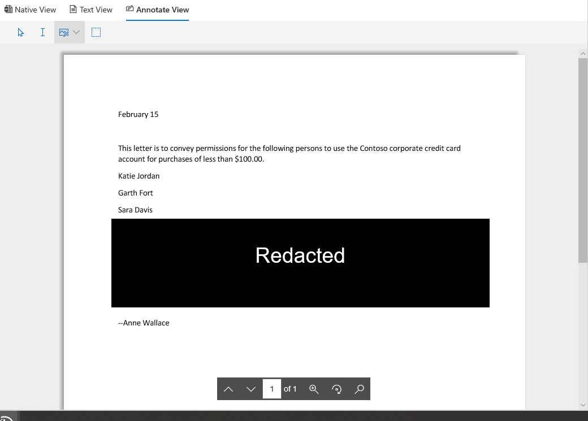

# Revisar los datos de pruebas

Los datos de un conjunto de evidencias en una investigación de datos son una instantánea de los resultados de búsqueda que se recopilaron y se agregaron al conjunto de evidencias. Cuando se agregan resultados de búsqueda a la evidencia, se desencadena un proceso para extraer los archivos, los metadatos y el texto de los elementos devueltos por la búsqueda. A continuación, la herramienta de investigación de datos (vista previa) crea un nuevo índice (por un proceso denominado " *indización avanzada*") de todos los datos y agrega a un conjunto de evidencias en la pestaña **evidencia** . 

Para las investigaciones sensibles al tiempo, esto permite incluir rápidamente el entorno al eliminar los datos reales derramados o malintencionados que se encuentran en el origen de datos original, a la vez que permite investigar la evidencia que se ha vuelto a crear en un entorno en cuarentena, que en este caso son los datos copiados al conjunto de evidencias. Una vez recopilada y agregada la evidencia al conjunto de evidencias, puede revisar documentos individuales en su formato nativo, formato de texto o un formato casi nativo que puede usar para anotar y censurar documentos. Además, puede ejecutar consultas para restringir el conjunto de datos por intervalo de tiempo, tipos de archivo, propietarios de datos y muchas otras propiedades y condiciones de búsqueda. Por ejemplo, mediante el uso de las condiciones de autor, remitente o destinatario, puede identificar rápidamente a las personas involucradas en el incidente y si los datos de la organización se han compartido con usuarios externos. Para obtener más información acerca de la búsqueda en datos en un conjunto de evidencias, vea [consultar los datos en evidencias](evidence-query.md).

Para agrupar documentos y obtener más ayuda para su revisión, seleccione un conjunto de evidencias en la pestaña **evidencia** y, a continuación, haga clic en **administrar evidencias**. En el mosaico **Analytics** , haga clic en recompilar **análisis para todo el conjunto**. De esta forma, se ejecutarán análisis avanzados, como la detección de duplicados, el procesamiento de correo electrónico y el análisis de temas. Posteriormente, puede ver los temas generales de los datos y también organizar los documentos por correo electrónico, casi duplicados y duplicados exactos para ayudarle en su investigación. Para obtener más información, vea [ejecutar análisis para investigar con mayor rapidez](run-analytics-to-investigate-faster.md).

## Ver documentos en prueba

Las investigaciones de datos (versión preliminar) le permiten mostrar contenido en varios visores distintos, con un propósito diferente para cada visor. Estos visores son los siguientes:

- Metadatos de archivo
- Vista nativa
- Vista de texto
- Vista de anotar

Para tener acceso a cualquiera de estos visores, seleccione un documento en un conjunto de evidencias.

## Metadatos de archivo

Esta vista muestra varias propiedades de metadatos asociadas con el documento seleccionado. Puede activar y desactivar esta vista haciendo clic en metadatos del **archivo**. Al revisar un documento, puede ver los metadatos del archivo y seguir cambiando entre los distintos visores.

A continuación, se muestra un ejemplo de los metadatos de archivo para un documento. Para obtener más información acerca de los campos de metadatos, vea [Document Metadata Fields in Data investigaciones (Preview)](document-metadata-fields.md).

## Vista nativa

El visor nativo muestra la vista más exacta de un documento en su formato nativo. La vista nativa es compatible con cientos de tipos de archivo y está destinada a mostrar documentos en la experiencia nativa más real posible. Para los archivos de Microsoft Office, el visor nativo usa Office online. Esto le permite ver contenido como comentarios en diferentes documentos de Office, fórmulas y filas o columnas ocultas en Excel y la vista de notas en PowerPoint.

## Vista de texto

El visor de texto proporciona una vista del texto extraído de un archivo. Omite las imágenes incrustadas y el formato, pero esta vista es muy útil si está intentando revisar y comprender rápidamente el contenido de un documento. La vista de texto también incluye estas características:

  - Un contador de línea que hace que sea más fácil hacer referencia a partes específicas de un documento.

  - Buscar el resaltado de referencias que resalta los términos en el documento y en la barra de desplazamiento

  - Una vista de diferencias proporciona una vista de comparación que resalta las diferencias de texto al ver los documentos mediante el panel de **duplicados Near** .

**Ejemplo de contador de línea y resaltado de búsqueda en el texto y en la barra de desplazamiento**

**Ejemplo de la vista diff**

## Vista de anotar

La vista anotar proporciona características que permiten aplicar marcado a un documento durante el proceso de revisión; Esto incluye estas herramientas:

  - **Redacciones de área** : puede dibujar un cuadro opaco en el documento que oculte el contenido confidencial.

  - **Lápiz** : puede liberar a mano un documento para atraer la atención a determinadas partes del contenido

  - **Seleccionar anotaciones** : puede seleccionar y eliminar anotaciones en un documento.

  - **Alternar transparencia de anotación** : puede alternar la transparencia de las anotaciones (entre opaco y semitransparente) para poder ver el contenido detrás de la anotación. Esto incluye alternar la transparencia de las anotaciones de lápiz y las redacciones.

La vista anotar también proporciona las siguientes funciones de navegación:

  - **Página anterior**, **página siguiente**y **vaya a** los controles de navegación de páginas que se van a usar para documentos de varias páginas.

  - **Zoom** : aumenta o disminuye el tamaño de los documentos en la vista anotar.

  - **Girar** : girar documentos en el sentido de las agujas del reloj.

  - **Buscar** : busca palabras clave en un documento y, a continuación, usa los controles anterior y siguiente para ver los aciertos (resaltados) en el documento.

**Ejemplo de la vista anotar**

> [!NOTE]
> Las anotaciones se aplican a una copia del documento que se agregó al conjunto de evidencias. No se han anotado los documentos originales en el servicio activo.
