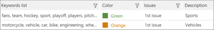

# Definir las palabras clave resaltadas y las opciones avanzadas en eDiscovery avanzado de Office 365

> [!NOTE]
> Exhibición de documentos electrónicos avanzada requiere un E3 de Office 365 con el complemento de cumplimiento avanzadas o una suscripción E5 para su organización. Si no tiene ese plan y desea probar avanzada exhibición de documentos electrónicos, puede [registrarse y obtener una versión de prueba de Office 365 Enterprise E5](https://go.microsoft.com/fwlink/p/?LinkID=698279). 
  
En Avanzadas exhibición de documentos electrónicos, es posible agregar palabras clave definidas por el usuario a la relevancia con el fin de ayudarle a identificar los archivos relevantes al etiquetado. Las palabras clave se mostrarán en los colores especificados en **relevancia \> etiqueta**. 
  
Tal y como se describe a continuación, se pueden agregar listas de palabras clave y los colores asignan a la lista de palabras clave y los problemas relacionados. Información sobre herramientas muestra la descripción de la palabra clave, si lo hay, indicada por un carácter de subrayado doble.
  
> [!IMPORTANT]
> Los resultados de aciertos de resaltado en la relevancia de visitas y visualización de palabra clave dentro de los documentos durante la relevancia de etiquetado no funciona para los conjuntos de caracteres de doble byte en japonés, chino y coreano. 
  
## Adición de palabras clave resaltadas

1. En el **la relevancia \> el programa de instalación de la relevancia** ficha, seleccione **las palabras clave de resaltado**.
    
2. Haga clic en el **+** icono para agregar palabras clave. Se muestra el cuadro de diálogo **Agregar nuevas palabras clave** . 
    
3. En **las palabras clave**, escriba la lista de palabras clave, separadas por comas. 
    
4. En la lista **Color** , seleccione el color para resaltar la lista de palabras clave especificada. 
    
5. En la lista **Seleccione el problema** , seleccione si desea aplicar la lista de palabras clave a "Todos los problemas" o a problemas de seleccionado. 
    
6. En **Descripción**, escriba la lista de palabras clave (opcional).
    
    
  
7. Haga clic en **Aceptar** cuando haya terminado. La lista creada se agrega a la tabla de la lista de palabras clave y se puede editar o eliminar. 
    
    
  
Se mostrarán las palabras clave definidas por el usuario, en los colores especificados en la relevancia \> etiqueta. 
  
## Si se especifica el programa de instalación de la relevancia configuración avanzada

Estas configuraciones afectan a los gráficos pista y Decide en la relevancia.
  
1. En el **la relevancia \> el programa de instalación de la relevancia** ficha, seleccione **Configuración avanzada**.
    
2. En el cuadro de diálogo **parámetros de costo** , realice las selecciones siguientes: 
    
1. En la lista de **costo revisión por hora ($)** , seleccione la cantidad en dólares o acepte el valor predeterminado. 
    
2. En la lista **número de archivos revisado por hora** , seleccione la cantidad o acepte el valor predeterminado. 
    
    
  
3. Haga clic en **Guardar**. Se guardan los valores seleccionados.
    
## Vea también

[eDiscovery avanzado de Office 365](office-365-advanced-ediscovery.md)
  
[Definición de problemas y la asignación de usuarios](define-issues-and-assign-users.md)
  
[Configuración de carga para agregar los archivos importados](set-up-loads-to-add-imported-files.md)

