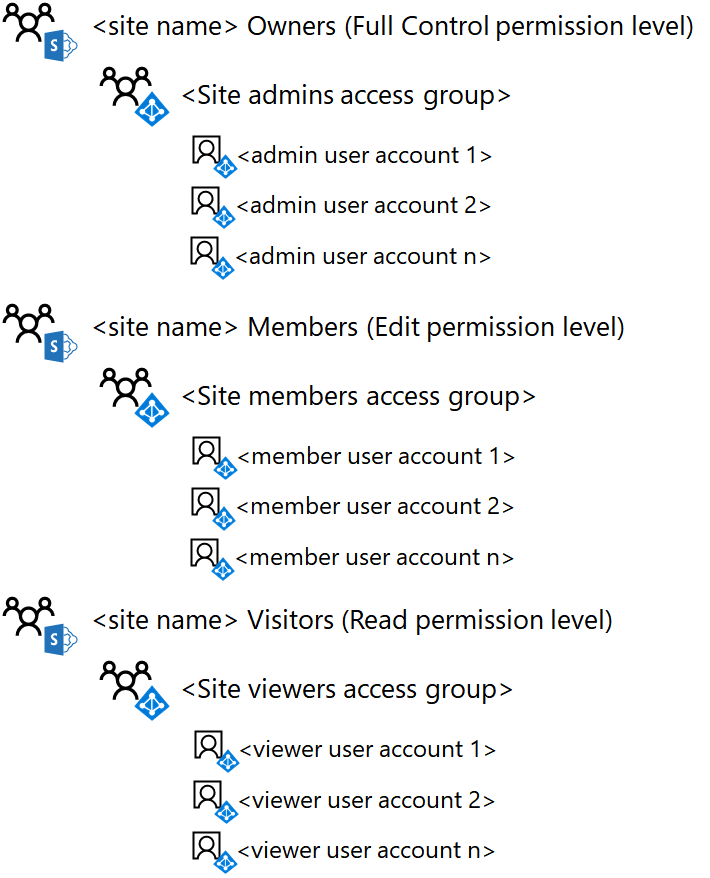

# <a name="deploy-an-isolated-sharepoint-online-team-site"></a>Implementar un sitio de grupo de SharePoint Online aislado

 **Resumen:** Implemente un nuevo sitio de grupo aislado de SharePoint Online con estas instrucciones paso a paso.
  
Este artículo es una guía paso a paso para la implementación de la creación y configuración de un sitio de grupo aislado de SharePoint Online en Microsoft Office 365. En estos pasos se presupone el uso de los tres grupos de SharePoint predeterminados y los niveles de permisos correspondientes, con un solo grupo de acceso basado en Azure Active Directory (AD) para cada nivel de acceso.
  
## <a name="phase-1-create-and-populate-the-team-site-access-groups"></a>Fase 1: crear y rellenar los grupos de acceso a sitios de grupo

En esta fase, se crean los tres grupos de acceso basados en Azure AD para los tres grupos de SharePoint predeterminados y se rellenan con las cuentas de usuario adecuadas.
  
> [!NOTE]
> En los pasos siguientes se supone que ya existen todas las cuentas de usuario necesarias y que se les asignan las licencias adecuadas. Si no es así, agréguelos y asigne licencias antes de continuar con el paso 1. 
  
### <a name="step-1-list-the-sharepoint-online-admins-for-the-site"></a>Paso 1: enumerar los administradores de SharePoint Online para el sitio

DeTermine el conjunto de cuentas de usuario correspondiente a los administradores de SharePoint Online para el sitio de grupo aislado.
  
Si administra cuentas de usuario y grupos a través de Office 365 y desea usar Windows PowerShell, cree una lista de sus nombres principales de usuario (UPN) (por ejemplo, UPN: belindan@contoso.com).
  
### <a name="step-2-list-the-members-for-the-site"></a>Paso 2: enumerar los miembros del sitio

DeTermine el conjunto de cuentas de usuario correspondiente a los miembros del sitio de grupo aislado, quienes colaboran en los recursos almacenados en el sitio.
  
Si administra cuentas de usuario y grupos a través de Office 365 y desea usar PowerShell, cree una lista de sus UPN. Si hay muchos miembros del sitio, puede almacenar la lista de UPN en un archivo de texto y agregarlos todos con un solo comando de PowerShell.
  
### <a name="step-3-list-the-viewers-for-the-site"></a>Paso 3: enumerar los visores del sitio

DeTermine el conjunto de cuentas de usuario correspondiente a los visores del sitio de grupo aislado, las personas que pueden ver los recursos almacenados en el sitio, pero no pueden modificarlos ni colaborar directamente en su contenido.
  
Si administra cuentas de usuario y grupos a través de Office 365 y desea usar PowerShell, cree una lista de sus UPN. Si hay muchos miembros del sitio, puede almacenar la lista de UPN en un archivo de texto y agregarlos todos con un solo comando de PowerShell.
  
Los visores del sitio pueden incluir la administración ejecutiva, los asesores legales o las partes interesadas entre departamentos.
  
### <a name="step-4-create-the-three-access-groups-for-the-site-in-azure-ad"></a>Paso 4: crear los tres grupos de acceso para el sitio en Azure AD

Debe crear los siguientes grupos de acceso en Azure AD:
  
- Administradores de sitios (que contendrán la lista del paso 1)
    
- Miembros del sitio (que contendrán la lista del paso 2)
    
- Visores del sitio (que contendrán la lista del paso 3)
    
1. En el explorador, vaya a Azure portal en [https://portal.azure.com](https://portal.azure.com) e inicie sesión con las credenciales de una cuenta que se haya asignado con el rol de administrador de administración de usuarios o administrador de la compañía.
    
2. En Azure Portal, haga clic en **Azure Active Directory > Grupos**.
    
3. En la hoja **Todos los grupos**, haga clic en **+ Nuevo grupo**.
    
4. En la hoja **Grupo**:
    
  - Seleccione **Office 365** en **Tipo de grupo**.
    
  - Escriba el nombre del grupo en **nombre**.
    
  - Escriba una descripción del grupo en **Descripción del grupo**.
    
  - Seleccione **Asignada** en **Tipo de pertenencia**.
    
5. Haga clic en **Crear** y, después, cierre la hoja **Grupo**.
    
6. Repita los pasos 3-5 para los grupos adicionales.
    
> [!NOTE]
> Debe usar el portal de Azure para crear los grupos para que tengan habilitadas las características de Office. Si un sitio aislado de SharePoint Online se configura más adelante como un sitio extremadamente confidencial con una etiqueta de Azure Information Protection (AIP) para cifrar archivos y asignar permisos a grupos específicos, los grupos permitidos deben haberse creado con las características de Office. preparado. No puede cambiar la configuración de las características de Office de un grupo de Azure AD una vez creado. 
  
Esta es la configuración resultante con los tres grupos de acceso al sitio.
  

  
### <a name="step-5-add-the-user-accounts-to-the-access-groups"></a>Paso 5. Agregar las cuentas de usuario a los grupos de acceso

En este paso, haga lo siguiente:
  
1. Agregar la lista de usuarios del paso 1 al grupo de acceso de administradores de sitios
    
2. Agregar la lista de usuarios del paso 2 al grupo de acceso de miembros del sitio
    
3. Agregar la lista de usuarios del paso 3 al grupo de acceso de visores del sitio
    
Si administra cuentas de usuario y grupos a través de Windows Server AD, agregue usuarios a los grupos de acceso adecuados mediante los procedimientos habituales de administración de usuarios y grupos de Windows Server AD y espere la sincronización con su suscripción de Office 365.
  
Si administra cuentas de usuario y grupos a través de Office 365, puede usar el centro de administración de Office o PowerShell. Si tiene nombres de grupo duplicados para cualquiera de los grupos de acceso, debe usar el centro de administración de Office.
  
En el centro de administración de Office, inicie sesión con una cuenta de usuario que tenga asignado el rol de administrador de la cuenta de usuario o de administrador de la compañía y use grupos para agregar las cuentas de usuario y los grupos adecuados a los grupos de acceso apropiados.
  
Para PowerShell, primero [Conéctese con el módulo de PowerShell Azure Active Directory V2](https://go.microsoft.com/fwlink/?linkid=842218).
  
A continuación, use el siguiente bloque de comandos para agregar una cuenta de usuario individual a un grupo de acceso:
  
```
$userUPN="<UPN of the user account>"
$grpName="<display name of the access group>"
Add-AzureADGroupMember -RefObjectId (Get-AzureADUser | Where { $_.UserPrincipalName -eq $userUPN }).ObjectID -ObjectId (Get-AzureADGroup | Where { $_.DisplayName -eq $grpName }).ObjectID
```

> [!TIP]
> Para obtener un archivo de texto que contenga todos los comandos de PowerShell y una hoja de cálculo de configuración de Excel que genere comandos de PowerShell en función de los nombres de cuenta de grupo y de usuario, descargue el kit de implementación de sitios de grupo de [SharePoint Online aislado](https://gallery.technet.microsoft.com/Isolated-SharePoint-Online-0b364907). 
  
Si ha guardado los UPN de cuentas de usuario para cualquiera de los grupos de acceso de un archivo de texto, puede usar el siguiente bloque de comandos de PowerShell para agregarlos todos a la vez:
  
```
$grpName="<display name of the access group>"
$fileName="<path and name of the file containing the list of account UPNs>"
$grpID=(Get-AzureADGroup | Where { $_.DisplayName -eq $grpName }).ObjectID
Get-Content $fileName | ForEach { $userUPN=$_; Add-AzureADGroupMember -RefObjectId (Get-AzureADUser | Where { $_.UserPrincipalName -eq $userUPN }).ObjectID -ObjectID $grpID }
```

Para PowerShell, use el siguiente bloque de comandos para agregar un grupo individual a un grupo de acceso:
  
```
$nestedGrpName="<display name of the group to add to the access group>"
$grpName="<display name of the access group>"
Add-AzureADGroupMember -RefObjectId (Get-AzureADGroup | Where { $_.DisplayName -eq $nestedGrpName }).ObjectID -ObjectID (Get-AzureADGroup | Where { $_.DisplayName -eq $grpName }).ObjectID

```

Los resultados deben ser los siguientes:
  
- El grupo de administradores de sitios de Azure AD contiene los grupos o cuentas de usuario de administrador del sitio
    
- El grupo de miembros del sitio de Azure AD contiene los grupos o cuentas de usuario de los miembros del sitio
    
- El grupo visores de sitio de Azure AD contiene las cuentas de usuario o los grupos que solo pueden ver el contenido del sitio
    
Validar la lista de miembros del grupo para cada grupo de acceso con el centro de administración de Office o con el siguiente bloque de comandos de PowerShell:
  
```
$grpName="<display name of the access group>"
Get-AzureADGroupMember -ObjectId (Get-AzureADGroup | Where { $_.DisplayName -eq $grpName }).ObjectID | Sort UserPrincipalName | Select UserPrincipalName,DisplayName,UserType
```

Esta es la configuración resultante con los tres grupos de acceso al sitio rellenados con cuentas de usuario o grupos.
  

  
## <a name="phase-2-create-and-configure-the-isolated-team-site"></a>Fase 2: crear y configurar el sitio de grupo aislado

En esta fase, se crea el sitio de SharePoint Online aislado y se configuran los permisos para los niveles de permisos predeterminados de SharePoint Online para usar los nuevos grupos de acceso basados en Azure AD.
  
En primer lugar, cree el sitio de grupo de SharePoint Online con estos pasos.
  
1. Inicie sesión en el centro de administración con una cuenta que también se usará para administrar el sitio de grupo de SharePoint Online (un administrador de SharePoint Online). Para obtener ayuda, vea [Where to sign in to Office 365](https://support.office.com/Article/Where-to-sign-in-to-Office-365-e9eb7d51-5430-4929-91ab-6157c5a050b4) (Dónde iniciar sesión en Office 365).
    
2. En la lista de iconos, haga clic en **SharePoint**.
    
3. En la nueva pestaña **SharePoint** del explorador, haga clic en **+ Crear sitio**.
    
4. En la página **Crear un sitio**, haga clic en **Sitio de grupo**.
    
5. En **nombre del sitio**, escriba un nombre para el sitio de grupo. 
    
6. En **Descripción del sitio de grupo,** escriba una descripción opcional del propósito del sitio.
    
7. En **Configuración de privacidad**, seleccione **Private - only members can access this site** (Privado: solo los miembros tienen acceso a este sitio) y haga clic en **Siguiente**.
    
8. En el panel **Who do you want to add?** (Usuarios que quiere agregar), haga clic en **Finalizar**.
    
Después, desde el nuevo sitio de grupo de SharePoint Online, configure los permisos.
  
1. En la barra de herramientas, haga clic en el icono de configuración y, luego, en **Permisos del sitio**.
    
2. En el panel **Permisos del sitio**, haga clic en **Advanced permissions settings** (Configuración de permisos avanzada).
    
3. En la nueva pestaña **Permisos** del explorador, haga clic en **Configuración de solicitud de acceso**.
    
4. En el cuadro de diálogo **configuración de solicitudes de acceso** , desactive **permitir a un miembro compartir el sitio y archivos y carpetas individuales** y **permitir solicitudes de acceso** (de modo que las tres casillas estén desactivadas) y, a continuación, haga clic en **Aceptar**.
    
5. En la pestaña **permisos** del explorador, haga clic ** \<en miembros del name> del sitio** de la lista.
    
6. En **Personas y grupos**, haga clic en **Nuevo**.
    
7. En el cuadro de diálogo **compartir** , escriba el nombre del grupo de acceso de los miembros del sitio, selecciónelo y, a continuación, haga clic en **compartir**.
    
8. Haga clic en el botón Atrás del explorador.
    
9. Haga ** \<** clic en propietarios de name> de sitio en la lista.
    
10. En **Personas y grupos**, haga clic en **Nuevo**.
    
11. En el cuadro de diálogo **compartir** , escriba el nombre del grupo de acceso de administradores del sitio, selecciónelo y, a continuación, haga clic en **compartir**.
    
12. Haga clic en el botón Atrás del explorador.
    
13. Haga clic ** \<en el sitio name> visitantes** de la lista.
    
14. En **Personas y grupos**, haga clic en **Nuevo**.
    
15. En el cuadro de diálogo **compartir** , escriba el nombre del grupo de acceso de visores del sitio, selecciónelo y, a continuación, haga clic en **compartir**.
    
16. Cierre la pestaña **Permisos** del explorador.
    
Los resultados de esta configuración de permisos son los siguientes:
  
- El ** \<** grupo de SharePoint propietarios de name> de sitios contiene el grupo de acceso de administradores del sitio, en el que todos los miembros tienen el nivel de permisos **control total** .
    
- El ** \<grupo de name> miembros del sitio** de SharePoint contiene el grupo de acceso de miembros del sitio, en el que todos los miembros tienen el nivel de permisos **Editar** .
    
- El ** \<** grupo de SharePoint name> visitantes del sitio contiene el grupo de acceso de visores del sitio, en el que todos los miembros tienen el nivel de permisos de **lectura** .
    
- La capacidad de los miembros para invitar a otros miembros o para que los usuarios no miembros soliciten el acceso está deshabilitada.
    
Esta es la configuración resultante con los tres grupos de SharePoint para el sitio configurado para usar los tres grupos de acceso, que se rellenan con cuentas de usuario o grupos de Azure AD.
  

  
Usted y los miembros del sitio, a través de la pertenencia a grupos en uno de los grupos de acceso, ahora pueden colaborar con los recursos del sitio.
  
## <a name="next-step"></a>Paso siguiente

Cuando necesite cambiar la pertenencia al grupo de acceso al sitio o crear una carpeta de documentos con permisos personalizados, vea [administrar un sitio de grupo de SharePoint Online aislado](manage-an-isolated-sharepoint-online-team-site.md).
  
## <a name="see-also"></a>Vea también

[Sitios de grupo de SharePoint Online aislados](isolated-sharepoint-online-team-sites.md)
  
[Diseñar un sitio de grupo de SharePoint Online aislado](design-an-isolated-sharepoint-online-team-site.md)
  
[Administrar un sitio de grupo de SharePoint Online aislado](manage-an-isolated-sharepoint-online-team-site.md)
  


