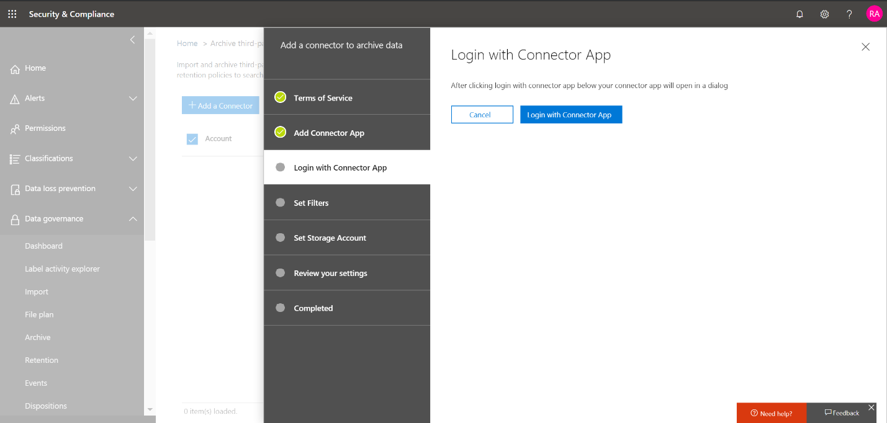

# Implementar un conector para archivar datos de Facebook en Office 365

Este artículo contiene el proceso paso a paso para implementar un conector que usa el servicio de importación de Office 365 para importar datos de las páginas empresariales de Facebook a Office 365. Para obtener una descripción general de este proceso y una lista de los requisitos previos necesarios para implementar un conector de Facebook, vea [usar un conector de ejemplo para archivar datos de Facebook en Office 365 (versión preliminar)](archive-facebook-data-with-sample-connector.md). 

## Paso 1: descargar el paquete

Descargue el paquete precompilado de la sección de versiones en el repositorio de <https://github.com/Microsoft/m365-sample-connector-csharp-aspnet/releases>GitHub en at. En la versión más reciente, descargue el archivo zip denominado **SampleConnector. zip**. Este archivo comprimido se cargará en Azure en el paso 4.

## Paso 2: crear una aplicación en Azure Active Directory

1. Vaya a <https://portal.azure.com> e inicie sesión con las credenciales de una cuenta de administrador global de Office 365.

    

2. En el panel de navegación izquierdo, haga clic en **Azure Active Directory**.

    

3. En el panel de navegación izquierdo, haga clic en **registros de aplicaciones (versión preliminar)** y, a continuación, haga clic en **nuevo registro**.

    

4. Registrar la aplicación. En URI de redireccionamiento, seleccione Web en la lista desplegable tipo de <https://portal.azure.com> aplicación y, a continuación, escriba en el cuadro del URI.

   

5. Copie el identificador de la **aplicación (cliente)** y el **directorio (inquilino)** y guárdelos en un archivo de texto u otra ubicación segura. Deberá usar estos identificadores en pasos posteriores.

   

6. Vaya a **certificados & secretos para la nueva aplicación.**

   

7. Haga clic en **nuevo secreto de cliente**

   

8. Cree un secreto nuevo. En el cuadro Descripción, escriba el secreto y, a continuación, elija un período de expiración. 

    

9. Copie el valor del secreto y guárdelo en un archivo de texto u otra ubicación de almacenamiento. Este es el secreto de la aplicación de AAD que usará en pasos posteriores.

   

10. Vaya al **manifiesto** y copie identifieruris a (que también se denomina el URI de la aplicación AAD), tal y como se resalta en la siguiente captura de pantalla. Copie el URI de la aplicación de AAD en un archivo de texto u otra ubicación de almacenamiento. Lo usará en el paso 6.

   

## Paso 3: crear una cuenta de almacenamiento de Azure

1. Vaya a la Página principal de Azure de su organización.

    

2. Haga clic en **crear un recurso** y escriba la **cuenta de almacenamiento** en el cuadro de búsqueda.

    

3. Haga clic en **almacenamiento**y, a continuación, en **cuenta de almacenamiento**.

    

4. En la página **crear cuenta de almacenamiento** , en el cuadro suscripción, seleccione **pay-as-go** o **Free Trial** en función del tipo de suscripción de Azure que tenga. A continuación, seleccione o cree un grupo de recursos.

    

5. Escriba un nombre para la cuenta de almacenamiento.

    

6. Revise y, a continuación, haga clic en **crear** para crear la cuenta de almacenamiento.

    

7. Tras unos minutos, haga clic en **Actualizar** y, a continuación, haga clic en **ir a recurso** para navegar a la cuenta de almacenamiento.

    

8. Haga clic en **teclas de acceso** en el panel de navegación izquierdo.

    

9. Copiar una **cadena de conexión** y guardarla en un archivo de texto u otra ubicación de almacenamiento. Para crear un recurso de aplicación Web, deberá usar esto.

    

## Paso 4: crear un nuevo recurso de aplicación web en Azure

1. En la página **principal** de Azure portal, haga clic en **crear una \> aplicación \> Web de todos los recursos**. En la página **aplicación web** , haga clic en **crear**. 

   

2. Rellene los detalles (como se muestra a continuación) y, a continuación, cree la aplicación Web. Tenga en cuenta que el nombre que escriba en el cuadro Nombre de la **aplicación** se usará para crear la dirección URL de Azure App Service; por ejemplo fbconnector.azurewebsites.net.

   

3. Vaya al recurso de la aplicación web que acaba de crear y haga clic en configuración de la **aplicación** en el panel de navegación izquierdo. En configuración de la aplicación, haga clic en Agregar nuevo valor y agregue las tres opciones siguientes. Use los valores (que copió en el archivo de texto de los pasos anteriores): 

    - **APISecretKey** : puede escribir cualquier valor como secreto. Se usará para acceder a la aplicación web del conector en el paso 7.

    - **StorageAccountConnectionString** : el URI de la cadena de conexión que copió después de crear la cuenta de almacenamiento de Azure en el paso 3.

    - **tenantId** : el identificador de inquilino de su organización de Office 365 que copió después de crear la aplicación de conector de Facebook en Azure Active Directory en el paso 2.

    

4. En **Configuración general**, haga clic **en** junto a **AlwaysOn**. Haga clic en **Guardar** en la parte superior de la página para guardar la configuración de la aplicación.

   

5. El último paso consiste en cargar el código fuente de la aplicación conector a Azure que ha descargado en el paso 1. En un explorador Web, vaya a https://<AzureAppResourceName>. scm.azurewebsites.net/ZipDeployUi. Por ejemplo, si el nombre del recurso de la aplicación de Azure (que se menciona en el paso 2 de esta sección) es **FBconnector**, entonces tendría https://fbconnector.scm.azurewebsites.net/ZipDeployUique hacerlo. 

6. Arrastre y coloque el SampleConnector. zip (descargado en el paso 1) en esta página. Una vez que se cargan los archivos y la implementación se realiza correctamente, la página será similar a la siguiente captura de pantalla.

   

## Paso 5: registrar la aplicación de Facebook

1. Vaya a <https://developers.facebook.com> , inicie sesión con las credenciales de la cuenta de las páginas de empresa de Facebook de su organización y, a continuación, haga clic en **Agregar nueva aplicación**.

   

2. Cree un nuevo identificador de aplicación.

   

3. En el panel de navegación izquierdo, haga clic en **Agregar productos** y, a continuación, haga clic en **configurar** en la ventana de **Inicio de sesión de Facebook** .

   

4. En la página integrar inicio de sesión de Facebook, haga clic en **Web**.

   

5. Agregue la dirección URL de Azure App Service; por ejemplo https://fbconnector.azurewebsites.net.

   

6. Complete la sección QuickStart de la configuración de inicio de sesión de Facebook.

   

7. En el panel de navegación izquierdo, en **Inicio de sesión de Facebook**, haga clic en **configuración**y agregue el URI de redireccionamiento de OAuth en el cuadro URI de redireccionamiento **válido de OAuth** ; Use el formato ** \<connectorserviceuri>/views/FacebookOAuth**, donde el valor de connectorserviceuri es la dirección URL de Azure App Service para su organización; por ejemplo https://fbconnector.azurewebsites.net.

   

8. En el panel de navegación izquierdo, haga clic en **Agregar productos** y, a continuación, en webhooks **.** En el menú desplegable **Página** , haga clic en **Página**. 

   

9. Agregue la dirección URL de devolución de llamada de webhook y agregue un token de comprobación. El formato de la dirección URL de devolución de llamada, use el formato ** <connectorserviceuri>/API/FbPageWebhook**, donde el valor de connectorserviceuri es la dirección URL de Azure App Service para su organización; por ejemplo https://fbconnector.azurewebsites.net. 

    El token de comprobación debe ser similar a una contraseña segura. Copie el token de comprobación en un archivo de texto u otra ubicación de almacenamiento.

     

10. Pruebe y suscríbase al extremo para la fuente.

    

11. Agregue una dirección URL de privacidad, un icono de aplicación y un uso empresarial. Además, copie el identificador de aplicación y el secreto de aplicación en un archivo de texto u otra ubicación de almacenamiento.

    

12. Hacer que la aplicación sea pública.

    

13. Agregue un usuario al rol de administrador o de evaluador.

    

14. Agregue el permiso de **acceso a contenido público** de la página.

    

15. Permiso agregar páginas de administración.

    

16. Obtenga la aplicación revisada por Facebook.

    

## Paso 6: configurar la aplicación web del conector

1. Vaya a https://\<AzureAppResourceName>. azurewebsites. net (donde AzureAppResourceName es el nombre del recurso de la aplicación de Azure que ha nombrado en el paso 4), por ejemplo, si el nombre es https://fbconnector.azurewebsites.net **FBconnector**, vaya a. La Página principal de la aplicación será similar a la siguiente captura de pantalla.

   

2. Haga clic en **configurar** para mostrar una página de inicio de sesión.
 
   

3. En el cuadro identificador de inquilino, escriba o pegue el identificador de inquilino (que obtuvo en el paso 2). En el cuadro contraseña, escriba o pegue el APISecretKey (que obtuvo en el paso 2) y, a continuación, haga clic en **establecer valores de configuración** para mostrar la página Detalles de la **configuración** .

    

4. En **detalles de configuración**, especifique las siguientes opciones de configuración 

   - **Identificador** de la aplicación de Facebook: el identificador de la aplicación de Facebook que obtuvo en el paso 5.
   - **Secreto** de la aplicación de Facebook: el secreto de la aplicación de Facebook que obtuvo en el paso 5.
   - **Token de comprobación** de webhooks de Facebook: el token de comprobación que ha creado en el paso 5.
   - **Identificador** de la aplicación de AAD: el identificador de aplicación de la aplicación de Azure Active Directory que creó en el paso 2.
   - **Secreto de la aplicación AAD** : el valor del secreto APISecretKey que creó en el paso 4.
   - **URI de la aplicación AAD** : el URI de la aplicación AAD obtenido en el paso 2; por ejemplo, https://microsoft.onmicrosoft.com/2688yu6n-12q3-23we-e3ee-121111123213.
   - **Clave de instrumentación de App Insights** : Deje este cuadro en blanco.

5. Haga clic en **Guardar** para guardar la configuración del conector.

## Paso 7: configurar un conector personalizado en el centro de seguridad & cumplimiento

1. Vaya a <https://protection.office.com> y, a continuación, haga clic en **datos de terceros de importación \> \> de gobierno de datos**.

   

2.  Haga clic en **Agregar un conector** y, a continuación, en **páginas de Facebook**.

    

3.  En la página **Agregar aplicación de conector** , escriba la siguiente información y, a continuación, haga clic en **validar conector**.

    - En el primer cuadro, escriba un nombre para el conector, como **Facebook**.
    - En el segundo cuadro, escriba o pegue el valor de APISecretKey que agregó en el paso 4.
    - En el tercer cuadro, escriba o pegue la dirección URL de Azure App Service; por ejemplo **https://fbconnector.azurewebsites.net**.
 
    Una vez validado correctamente el conector, haga clic en **siguiente**.
    
    

4.  Haga clic en **iniciar sesión con la aplicación conector**.

    

5. Escriba o pegue el APISecretKey de nuevo y, a continuación, haga clic en **iniciar sesión en el servicio de conector**.

   

6. Haga clic en **iniciar sesión con Facebook.**

   

7. En la página **iniciar sesión en Facebook** , inicie sesión con las credenciales de la cuenta de las páginas de empresa de Facebook de su organización. Asegúrese de que la cuenta de Facebook a la que ha iniciado sesión tenga asignado el rol de administrador de las páginas empresariales de Facebook de su organización.

   

8. Haga clic en **seleccionar páginas** para elegir las páginas de negocio de su organización que desea archivar en Office 365.

   

9. Se muestra una lista de las páginas de negocio administradas por la cuenta de Facebook en la que inició sesión. Seleccione la página que desea archivar y, a continuación, haga clic en **Guardar**.

    

10. Haga clic en **Finalizar** para salir de la instalación de la aplicación del servicio conector.

    

11. En la página **Establecer filtros** , puede aplicar un filtro para importar (y archivar) los elementos que tengan una antigüedad determinada. Haga clic en **Siguiente**.

    

12. En la página **establecer cuenta de almacenamiento** , seleccione el buzón de Office 365 en el que se importarán los elementos de las páginas de la empresa de Facebook que seleccionó anteriormente.

    

13. Revise la configuración y, a continuación, haga clic en **Finalizar** para completar la configuración del conector en el centro de seguridad & cumplimiento.

    

14. Vaya a la página **archivar datos de terceros** para ver el progreso del proceso de importación.

    
