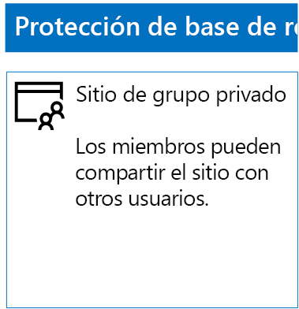
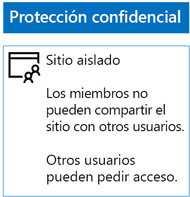
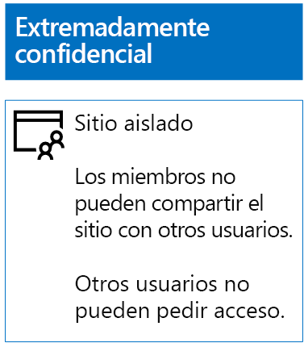

# Implementar sitios de SharePoint Online con tres niveles de protección

 **Resumen:** Cree y configure sitios de grupo de SharePoint Online con distintos niveles de protección de la información.
  
Siga los pasos de este artículo para diseñar e implementar sitios de grupo de base de referencia, confidenciales y extremadamente confidenciales de SharePoint Online. Para más información sobre estos tres niveles de protección, vea [Proteger sitios y archivos de SharePoint Online](secure-sharepoint-online-sites-and-files.md).
  
## Sitios de grupo de base de referencia de SharePoint Online

La protección de base de referencia incluye sitios de grupo públicos y privados. Todo el personal de la organización puede acceder a los sitios de grupo públicos. Solo los miembros del grupo de Office 365 asociado al sitio de grupo pueden detectar sitios privados y acceder a ellos. Ambos tipos de sitios de grupo permiten a los miembros compartir el sitio con otros usuarios.
  
### Público

Para crear un sitio de grupo de SharePoint Online de línea base con acceso y permisos públicos, haga lo siguiente:
  
1. Inicie sesión en el portal de Office 365 con una cuenta que también se vaya a usar para administrar el sitio de grupo de SharePoint Online (un administrador de SharePoint Online). Para obtener ayuda, vea [Where to sign in to Office 365](https://support.office.com/Article/Where-to-sign-in-to-Office-365-e9eb7d51-5430-4929-91ab-6157c5a050b4) (Dónde iniciar sesión en Office 365).
    
2. En la lista de iconos, haga clic en **SharePoint**.
    
3. En la nueva pestaña **SharePoint** del explorador, haga clic en **+ Crear sitio**.
    
4. En la página **Crear un sitio**, haga clic en **Sitio de grupo**.
    
5. En **Nombre del sitio**, escriba un nombre para el sitio de grupo público. 
    
6. En **Team site description** (Descripción del sitio de grupo), escriba una descripción de la finalidad del sitio.
    
7. En **Configuración de privacidad**, seleccione **Public – anyone in the organization can access this site** (Público: cualquier usuario de la organización tiene acceso a este sitio) y haga clic en **Siguiente**.
    
8. En el panel **Who do you want to add?** (Usuarios que quiere agregar), haga clic en **Finalizar**.
    
Esta es la configuración resultante.
  

  
### Privado

Para crear un sitio de grupo de SharePoint Online de línea base con acceso y permisos privados, haga lo siguiente:
  
1. Inicie sesión en el portal de Office 365 con una cuenta que también se vaya a usar para administrar el sitio de grupo de SharePoint Online (un administrador de SharePoint Online). Para obtener ayuda, vea [Where to sign in to Office 365](https://support.office.com/Article/Where-to-sign-in-to-Office-365-e9eb7d51-5430-4929-91ab-6157c5a050b4) (Dónde iniciar sesión en Office 365).
    
2. En la lista de iconos, haga clic en **SharePoint**.
    
3. En la nueva pestaña **SharePoint** del explorador, haga clic en **+ Crear sitio**.
    
4. En la página **Crear un sitio**, haga clic en **Sitio de grupo**.
    
5. En **Nombre del sitio**, escriba un nombre para el sitio de grupo privado. 
    
6. En **Team site description** (Descripción del sitio de grupo), escriba una descripción de la finalidad del sitio.
    
7. En **Configuración de privacidad**, seleccione **Private - only members can access this site** (Privado: solo los miembros tienen acceso a este sitio) y haga clic en **Siguiente**.
    
8. En el panel de **Who do you want to add?** (Usuarios que quiere agregar), en **Agregar miembros**, escriba los nombres de cuentas de usuario que tengan acceso a este sitio de grupo privado.
    
9. Cuando haya terminado de agregar el conjunto inicial de miembros al sitio, haga clic en **Finalizar**.
    
Esta es la configuración resultante.
  

  
## Sitios de grupo confidenciales de SharePoint Online

Un sitio de grupo de SharePoint Online confidencial es un sitio de grupo aislado, lo que significa que los permisos se controlan mediante la pertenencia a grupos de SharePoint en lugar de la pertenencia al grupo de Office 365 asociado al sitio de grupo.
  
Para crear un sitio de grupo aislado, siga estos dos pasos principales.
  
### Paso 1: Diseñar el sitio aislado

Para diseñar el sitio de grupo aislado, debe determinar:
  
- Los grupos y niveles de permisos de SharePoint.
    
- El conjunto de grupos de acceso que van a ser miembros de los grupos de SharePoint.
    
     El conjunto recomendado de grupos de acceso es uno para miembros del sitio, otro para lectores del sitio y el último para administradores del sitio.
    
- Si va a usar grupos anidados dentro de los grupos de acceso.
    
Por ejemplo, la estructura del grupo y los niveles de permisos recomendados tienen este aspecto:
  
|**Grupo de SharePoint**|**Nivel de permisos**|**Grupo de acceso (ejemplos)**|
|:-----|:-----|:-----|
|Miembros de [nombre del sitio]    |Editar    |Miembros de [nombre del sitio]    |
|Visitantes de [nombre del sitio]    |Lectura    |Lectores de [nombre del sitio]    |
|Propietarios de [nombre del sitio]    |Control total    |Administradores de [nombre del sitio]    |
   
Los niveles de permisos y los grupos de SharePoint se crean de forma predeterminada para un sitio de grupo. Debe determinar los nombres de los grupos de acceso.
  
Para obtener los detalles del proceso de diseño, vea [Diseñar un sitio de grupo SharePoint Online aislado](design-an-isolated-sharepoint-online-team-site.md).
  
### Paso 2: Implementar el sitio aislado

Para implementar el sitio aislado, primero debe:
  
- Determinar las cuentas de usuario y los grupos que va a agregar a cada uno de los grupos de acceso.
    
- Crear los grupos de acceso y agregar a miembros de grupos y usuarios.
    
Para obtener los pasos detallados, vea la **fase 1** de [Implementar un sitio de grupo aislado de SharePoint Online](deploy-an-isolated-sharepoint-online-team-site.md).
  
Luego cree el sitio de grupo de SharePoint Online con estos pasos.
  
1. Inicie sesión en el portal de Office 365 con una cuenta que también se vaya a usar para administrar el sitio de grupo de SharePoint Online (un administrador de SharePoint Online). Para obtener ayuda, vea [Where to sign in to Office 365](https://support.office.com/Article/Where-to-sign-in-to-Office-365-e9eb7d51-5430-4929-91ab-6157c5a050b4) (Dónde iniciar sesión en Office 365).
    
2. En la lista de iconos, haga clic en **SharePoint**.
    
3. En la nueva pestaña **SharePoint** del explorador, haga clic en **+ Crear sitio**.
    
4. En la página **Crear un sitio**, haga clic en **Sitio de grupo**.
    
5. En **Nombre del sitio**, escriba un nombre para el sitio de grupo privado.
    
6. En **Team site description** (Descripción del sitio de grupo), escriba una descripción opcional.
    
7. En **Configuración de privacidad**, seleccione **Private - only members can access this site** (Privado: solo los miembros tienen acceso a este sitio) y haga clic en **Siguiente**.
    
8. En el panel **Who do you want to add?** (Usuarios que quiere agregar), haga clic en **Finalizar**.
    
Después, desde el nuevo sitio de grupo de SharePoint Online, configure los permisos con estos pasos.
  
1. Determine el nombre principal de usuario (UPN) del administrador de TI o de otra persona que vaya a ser responsable de responder a las solicitudes de acceso al sitio y de dirigirlas (belindan@contoso.com es un ejemplo de UPN). Escriba ese UPN aquí: .
    
2. En la barra de herramientas, haga clic en el icono de configuración y, luego, en **Permisos del sitio**.
    
3. En el panel **Permisos del sitio**, haga clic en **Advanced permissions settings** (Configuración de permisos avanzada).
    
4. En la nueva pestaña **Permisos** del explorador, haga clic en **Configuración de solicitud de acceso**.
    
5. En el cuadro de diálogo **Configuración de solicitud de acceso**:
    
  - Desactive las casillas de verificación **Permitir que los miembros compartan el sitio y archivos y carpetas individuales** y **Permitir a los miembros invitar a otros al grupo de miembros del sitio**.
    
  - Escriba el UPN del administrador de TI del paso 1 en **Enviar todas las solicitudes de acceso**.
    
  - Haga clic en **Aceptar**.
    
6. En la pestaña **Permisos** del explorador, haga clic en **Miembros de [nombre del sitio]** en la lista.
    
7. En **Personas y grupos**, haga clic en **Nuevo**.
    
8. En el cuadro de diálogo **Compartir**, escriba el nombre del grupo de acceso de miembros de sitio para este sitio, selecciónelo y luego haga clic en **Compartir**.
    
9. Haga clic en el botón Atrás del explorador.
    
10. Haga clic en **Propietarios de [nombre del sitio]** en la lista.
    
11. En **Personas y grupos**, haga clic en **Nuevo**.
    
12. En el cuadro de diálogo **Compartir**, escriba el nombre del grupo de acceso de administradores de sitio para este sitio, selecciónelo y luego haga clic en **Compartir**.
    
13. Haga clic en el botón Atrás del explorador.
    
14. Haga clic en **Visitantes de [nombre del sitio]** en la lista.
    
15. En **Personas y grupos**, haga clic en **Nuevo**.
    
16. En el cuadro de diálogo **Compartir**, escriba el nombre del grupo de acceso de lectores de sitio para este sitio, selecciónelo y luego haga clic en **Compartir**.
    
17. Cierre la pestaña **Permisos** del explorador.
    
Los resultados de esta configuración de permisos son los siguientes:
  
- El grupo **Propietarios de [nombre del sitio]** de SharePoint contiene el grupo de acceso de administradores de sitio, en el que todos los miembros tienen el nivel de permisos **Control total**.
    
- El grupo de SharePoint **Miembros de [nombre del sitio]** contiene el grupo de acceso de miembros de sitio, en el que todos los miembros tienen el nivel de permisos **Editar**.
    
- El grupo de SharePoint **Visitantes de [nombre del sitio]** contiene el grupo de acceso de lectores de sitio, en el que todos los miembros tienen el nivel de permisos **Leer**.
    
- La capacidad de los miembros de invitar a otros miembros está deshabilitada.
    
- La capacidad de los no miembros de solicitar acceso está deshabilitada.
    
Esta es la configuración resultante.
  

  
Los miembros del sitio, a través de la pertenencia a grupos en uno de los grupos de acceso, ahora pueden colaborar de forma segura en los recursos del sitio.
  
## Sitios de grupo de SharePoint Online extremadamente confidenciales

Un sitio de grupo de SharePoint Online extremadamente confidencial es un sitio de grupo aislado, lo que significa que los permisos se controlan mediante la pertenencia a grupos de SharePoint en lugar de la pertenencia al grupo de Office 365 asociado al sitio de grupo.
  
Para crear un sitio de grupo aislado para información y colaboración extremadamente confidenciales, hay dos pasos principales.
  
### Paso 1: Diseñar el sitio aislado

Para diseñar el sitio de grupo aislado, debe determinar:
  
- Los grupos y niveles de permisos de SharePoint.
    
- El conjunto de grupos de acceso que van a ser miembros de los grupos de SharePoint.
    
     El conjunto recomendado de grupos de acceso es uno para miembros del sitio, otro para lectores del sitio y el último para administradores del sitio.
    
- Si va a usar grupos anidados dentro de los grupos de acceso.
    
Por ejemplo, la estructura del grupo y los niveles de permisos recomendados tienen este aspecto:
  
|**Grupo de SharePoint**|**Nivel de permisos**|**Grupo de acceso (ejemplos)**|
|:-----|:-----|:-----|
|Miembros de [nombre del sitio]    |Editar    |Miembros de [nombre del sitio]    |
|Visitantes de [nombre del sitio]    |Lectura    |Lectores de [nombre del sitio]    |
|Propietarios de [nombre del sitio]    |Control total    |Administradores de [nombre del sitio]    |
   
Los niveles de permisos y los grupos de SharePoint se crean de forma predeterminada para un sitio de grupo. Debe determinar los nombres de los grupos de acceso.
  
Para obtener los detalles del proceso de diseño, vea [Diseñar un sitio de grupo SharePoint Online aislado](design-an-isolated-sharepoint-online-team-site.md).
  
### Paso 2: Implementar el sitio aislado

Para implementar el sitio aislado, primero debe:
  
- Determinar los miembros de grupos y usuarios de cada uno de los grupos de acceso
    
- Crear los grupos de acceso y agregar los miembros de grupos y usuarios
    
- Crear un sitio de grupo aislado que use los grupos de acceso.
    
Para obtener los pasos detallados, vea [Implementar un sitio de grupo aislado de SharePoint Online](deploy-an-isolated-sharepoint-online-team-site.md).
  
Los resultados de la configuración de permisos son los siguientes:
  
- El grupo **Propietarios de [nombre del sitio]** de SharePoint contiene el grupo de acceso de administradores de sitio, en el que todos los miembros tienen el nivel de permisos **Control total**.
    
- El grupo de SharePoint **Miembros de [nombre del sitio]** contiene el grupo de acceso de miembros de sitio, en el que todos los miembros tienen el nivel de permisos **Editar**.
    
- El grupo de SharePoint **Visitantes de [nombre del sitio]** contiene el grupo de acceso de lectores de sitio, en el que todos los miembros tienen el nivel de permisos **Leer**.
    
- La capacidad de los miembros de invitar a otros miembros está deshabilitada.
    
- La capacidad de los no miembros de solicitar acceso está deshabilitada.
    
Esta es la configuración resultante.
  

  
Los miembros del sitio, a través de la pertenencia a grupos en uno de los grupos de acceso, ahora pueden colaborar de forma segura en los recursos del sitio.
  
## Paso siguiente

[Proteger archivos de SharePoint Online con Azure Information Protection](protect-sharepoint-online-files-with-azure-information-protection.md)

## Recursos adicionales

[Protección de archivos y sitios de SharePoint Online](secure-sharepoint-online-sites-and-files.md)
  
[Instrucciones de seguridad de Microsoft para campañas políticas, organizaciones sin ánimo de lucro y otras organizaciones ágiles](microsoft-security-guidance-for-political-campaigns-nonprofits-and-other-agile-o.md)
  
[Adopción de la nube y soluciones híbridas](https://docs.microsoft.com/office365/enterprise/cloud-adoption-and-hybrid-solutions)

