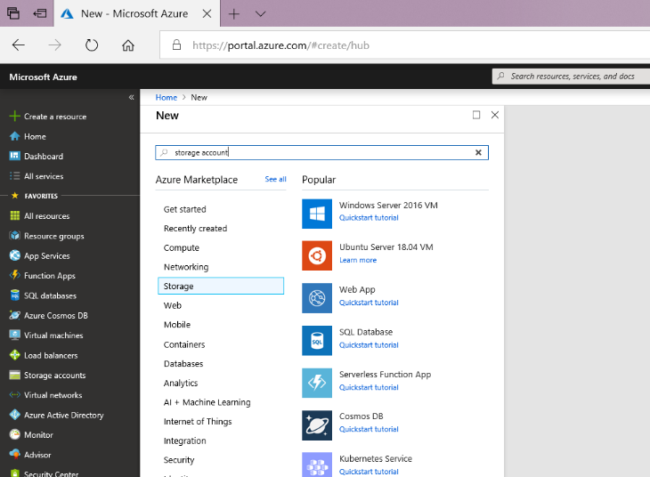
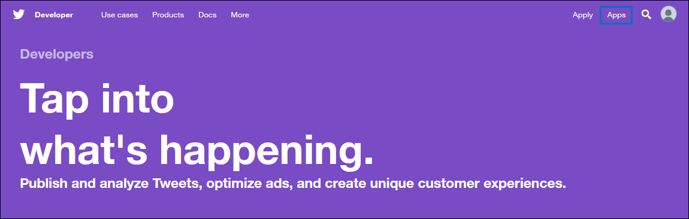
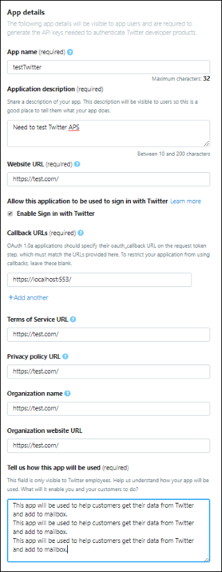
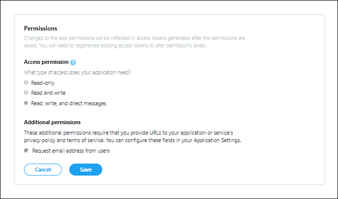
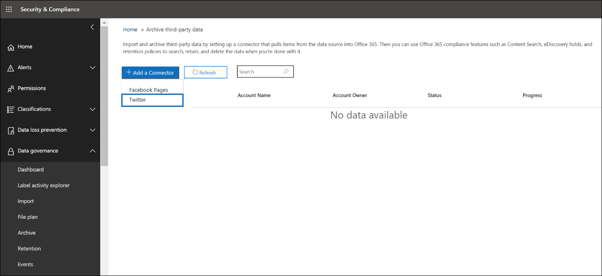
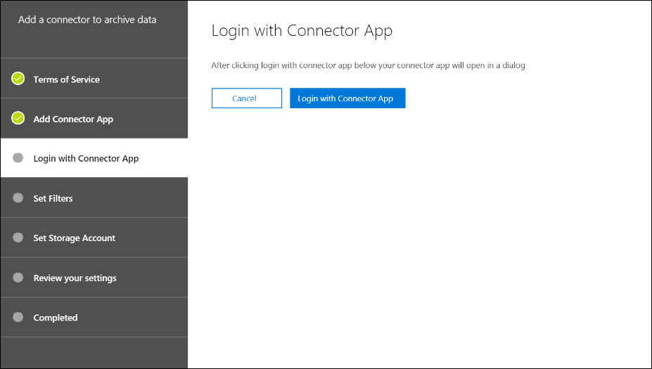

# Implementar un conector para archivar datos de Twitter en Office 365Deploy a connector to archive Twitter data in Office 365

Este artículo contiene el proceso paso a paso para implementar un conector que usa el servicio de importación de Office 365 para importar datos de la cuenta de Twitter de su organización a Office 365.This article contains the step-by-step process to deploy a connector that uses the Office 365 Import service to import data from your organization's Twitter account to Office 365. Para obtener información general de alto nivel de este proceso y una lista de los requisitos previos necesarios para implementar un conector de Twitter, vea [usar un conector de ejemplo para archivar datos de Twitter en Office 365 (versión preliminar)](archive-twitter-data-with-sample-connector.md).For a high-level overview of this process and a list of prerequisites required to deploy a Twitter connector, see [Use a sample connector to archive Twitter data in Office 365 (Preview)](archive-twitter-data-with-sample-connector.md). 

## Paso 1: descargar el paqueteStep 1: Download the package

Descargue el paquete precompilado de la sección de versiones en el repositorio [https://github.com/microsoft/m365-sample-twitter-connector-csharp-aspnet/releases](https://github.com/microsoft/m365-sample-twitter-connector-csharp-aspnet/releases)de github en.Download the prebuilt package from the Release section in the GitHub repository at [https://github.com/microsoft/m365-sample-twitter-connector-csharp-aspnet/releases](https://github.com/microsoft/m365-sample-twitter-connector-csharp-aspnet/releases). En la versión más reciente, descargue el archivo zip denominado **SampleConnector. zip**.Under the latest release, download the zip file named **SampleConnector.zip**. Este archivo comprimido se cargará en Azure en el paso 4.You will upload this zip file to Azure in Step 4.

## Paso 2: crear una aplicación en Azure Active DirectoryStep 2: Create an app in Azure Active Directory

1. Vaya a <https://portal.azure.com> e inicie sesión con las credenciales de una cuenta de administrador global de Office 365.Go to <https://portal.azure.com> and sign in using the credentials of an Office 365 global admin account.

   

2. En el panel de navegación izquierdo, haga clic en **Azure Active Directory**.In the left navigation pane, click **Azure Active Directory**.

   

3. En el panel de navegación izquierdo, haga clic en **registros de aplicaciones (versión preliminar)** y, a continuación, haga clic en **nuevo registro**.In the left navigation pane, click **App registrations (Preview)** and then click **New registration**.

   

4. Registrar la aplicación.Register the application. En **URI de redireccionamiento (opcional)**, seleccione Web en la lista desplegable tipo de <https://portal.azure.com> aplicación y, a continuación, escriba en el cuadro del URI.Under **Redirect URI (optional)**, select Web in the application type dropdown list and then type <https://portal.azure.com> in the box for the URI.

   

5. Copie el identificador de la **aplicación (cliente)** y el **directorio (inquilino)** y guárdelos en un archivo de texto u otra ubicación segura.Copy the **Application (client) ID** and **Directory (tenant) ID** and save them to a text file or other safe location. Deberá usar estos identificadores en pasos posteriores.You’ll use these IDs in later steps.

    

6. Vaya a **certificados & secretos para la nueva aplicación** y, en **secretos de cliente** , haga clic en **nuevo secreto de cliente**.Go to **Certificates & secrets for the new app** and under **Client secrets** click **New client secret**.

   

7. Cree un secreto nuevo.Create a new secret. En el cuadro Descripción, escriba el secreto y, a continuación, elija un período de expiración.In the description box, type the secret and then choose an expiration period. 

   

8. Copie el valor del secreto y guárdelo en un archivo de texto u otra ubicación de almacenamiento.Copy the value of the secret and save it to a text file or other storage location. Este es el secreto de la aplicación de AAD que usará en pasos posteriores.This is the AAD application secret that you will use in later steps.

   

9. Vaya al **manifiesto** y copie identifieruris a (que también se denomina el URI de la aplicación AAD), tal y como se resalta en la siguiente captura de pantalla.Go to **Manifest** and copy the identifierUris (which is also called the AAD application Uri) as highlighted in the following screenshot. Copie el URI de la aplicación de AAD en un archivo de texto u otra ubicación de almacenamiento.Copy the AAD application Uri to a text file or other storage location. Lo usará en el paso 6.You’ll use it in Step 6.

    

## Paso 3: crear una cuenta de almacenamiento de AzureStep 3: Create an Azure storage account

1.  Vaya a la Página principal de Azure de su organización.Go to the Azure home page for your organization.

    

2. Haga clic en **crear un recurso** y escriba la **cuenta de almacenamiento** en el cuadro de búsqueda.Click **Create a resource** and they type **storage account** in the search box.

   

3. Haga clic en **almacenamiento**y, a continuación, en **cuenta de almacenamiento**.Click **Storage**, and then click **Storage account**.

   

4. En la página **crear cuenta de almacenamiento** , en el cuadro suscripción, seleccione **pay-as-go** o **Free Trial** en función del tipo de suscripción de Azure que tenga.On the **Create storage account** page, in the Subscription box, select **Pay-As-You-Go** or **Free Trial** depending on which type of Azure subscription you have. 

   

5. Seleccione o cree un grupo de recursos.Select or create a resource group.

   

6. Escriba un nombre para la cuenta de almacenamiento.Type a name for the storage account.

   

7. Revise y, a continuación, haga clic en **crear** para crear la cuenta de almacenamiento.Review and then click **Create** to create the storage account.

   

8. Tras unos minutos, haga clic en **Actualizar** y, a continuación, haga clic en **ir a recurso** para navegar a la cuenta de almacenamiento.After a few moments, click **Refresh** and then click **Go to resource** to navigate to the storage account.

   

9. Haga clic en **teclas de acceso** en el panel de navegación izquierdo.Click **Access keys** in the left navigation pane.

   

10. Copiar una **cadena de conexión** y guardarla en un archivo de texto u otra ubicación de almacenamiento.Copy a **Connection string** and save it to a text file or other storage location. Esto se usa al crear un recurso de aplicación web en el paso 4.You’ll use this when creating a web app resource in Step 4.

    

## Paso 4: crear un nuevo recurso de aplicación web en AzureStep 4: Create a new web app resource in Azure

1. En la página **principal** de Azure portal, haga clic en **crear una \> aplicación \> Web de todos los recursos**.On the **Home** page in the Azure portal, click **Create a resource \> Everything \> Web app**. En la página **aplicación web** , haga clic en **crear**.On the **Web app** page, click **Create**.

   

2. Rellene los detalles (como se muestra a continuación) y, a continuación, cree la aplicación Web.Fill in the details (as shown below) and then create the Web app. Tenga en cuenta que el nombre que escriba en el cuadro Nombre de la **aplicación** se usará para crear la dirección URL de Azure App Service; por ejemplo twitterconnector.azurewebsites.net.Note that the name that you enter in the **App name** box will be used to create the Azure app service URL; for example twitterconnector.azurewebsites.net.

   

3. Vaya al recurso de la aplicación web que acaba de crear y haga clic en configuración de la **aplicación** en el panel de navegación izquierdo.Go to the newly created web app resource, click **Application Settings** in the left navigation pane. En **configuración**de la aplicación, haga clic en **Agregar nuevo valor** y agregue las tres opciones siguientes.Under **Application settings**, click **Add new setting** and add the following three settings. Use los valores (que copió en el archivo de texto de los pasos anteriores):Use the values (that you copied to the text file from the previous steps): 

    - **APISecretKey** : puede escribir cualquier valor como secreto.**APISecretKey** – You can type any value as the secret. Se usará para acceder a la aplicación web del conector en el paso 7.This will be used to access the connector web app in Step 7.

    - **StorageAccountConnectionString** : el URI de la cadena de conexión que copió después de crear la cuenta de almacenamiento de Azure en el paso 3.**StorageAccountConnectionString** – The connection string Uri that you copied after creating the Azure storage account in Step 3.

    - **tenantId** : el identificador de inquilino de su organización de Office 365 que copió después de crear la aplicación de conector de Twitter en Azure Active Directory en el paso 2.**tenantId** – The tenant ID of your Office 365 organization that you copied after creating the Twitter connector app in Azure Active Directory in Step 2.

    

4. En **Configuración general**, haga clic **en** junto a **AlwaysOn**.Under **General settings**, click **On** next to the **Always On**. Haga clic en **Guardar** en la parte superior de la página para guardar la configuración de la aplicación.Click **Save** at the top of the page to save the application settings.

   

5. El último paso consiste en cargar el código fuente de la aplicación conector a Azure que ha descargado en el paso 1.The final step is to upload the connector app source code to Azure that you downloaded in Step 1. En un explorador Web, vaya a https://<AzureAppResourceName>. scm.azurewebsites.net/ZipDeployUi.In a web browser, go to https://<AzureAppResourceName>.scm.azurewebsites.net/ZipDeployUi. Por ejemplo, si el nombre del recurso de la aplicación de Azure (que se menciona en el paso 2 de esta sección) es **twitterconnector**, entonces tendría https://twitterconnector.scm.azurewebsites.net/ZipDeployUique hacerlo.For example, if the name of your Azure app resource (which you named in step 2 in this section) is **twitterconnector**, then you would go to https://twitterconnector.scm.azurewebsites.net/ZipDeployUi.

6. Arrastre y coloque el SampleConnector. zip (descargado en el paso 1) en esta página.Drag and drop the SampleConnector.zip (that you downloaded in Step 1) to this page. Una vez que se cargan los archivos y la implementación se realiza correctamente, la página será similar a la siguiente captura de pantalla.After the files are uploaded and the deployment is successful, the page will look similar to the following screenshot.

   

## Paso 5: crear la aplicación de TwitterStep 5: Create the Twitter app

1. Vaya a https://developer.twitter.com, inicie sesión con las credenciales de la cuenta de desarrollador de su organización y, a continuación, haga clic en **aplicaciones**.Go to https://developer.twitter.com, log in using the credentials for the developer account for your organization, and then click **Apps**.

   
2. Haga clic en **crear una aplicación**.Click **Create an app**.
   
   

3. En **detalles**de la aplicación, agregue información sobre la aplicación.Under **App details**, add information about the application.

   

4. En el panel del programador de Twitter, seleccione la aplicación que acaba de crear y copie el identificador de aplicación que se muestra y guárdelo en un archivo de texto u otra ubicación de almacenamiento.On the Twitter developer dashboard, select the app that you just created and copy the App ID that's displayed  and save it to a text file or other storage location. A continuación, haga clic en **detalles**.Then click **Details**.
   
   

5. En la pestaña **claves y tokens** , en **claves** de la API de consumidor, copie la clave secreta de la API y guárdela en un archivo de texto u otra ubicación de almacenamiento.On the **Keys and tokens** tab, under **Consumer API keys** copy the API secret key and save it to a text file or other storage location. A continuación, haga clic en **crear** para generar un token de acceso y un secreto de token de acceso, y cópielos en un archivo de texto u otra ubicación de almacenamiento.Then click **Create** to generate an access token and an access token secret, and copy these to a text file or other storage location.
   
   

   A continuación, haga clic en **crear** para generar un token de acceso y un secreto de token de acceso, y cópielos en un archivo de texto u otra ubicación de almacenamiento.Then click **Create** to generate an access token and an access token secret, and copy these to a text file or other storage location.

6. Haga clic en la pestaña **permisos** y configure los permisos como se muestra en la siguiente captura de pantalla:Click the **Permissions** tab and configure the permissions as shown in the following screenshot:

   

7. Una vez que haya guardado la configuración de permisos, haga clic en la pestaña detalles de la **aplicación** y, a continuación, haga clic en **Editar > editar detalles**.After you save the permission settings, click the **App details** tab, and then click **Edit > Edit details**.

   

8. Realice las siguientes tareas:Do the following tasks:

   - Active la casilla para permitir que la aplicación conector inicie sesión en Twitter.Select the checkbox to allow the connector app to sign in to Twitter.
   
   - Agregue el URI de redireccionamiento de OAuth con el siguiente formato: \*\* \<connectorserviceuri>/views/TwitterOAuth\*\*, donde el valor de *connectorserviceuri* es la dirección URL de Azure App Service para su organización; por ejemplo https://twitterconnector.azurewebsites.net/Views/TwitterOAuth.Add the OAuth redirect Uri using the following format: **\<connectorserviceuri>/Views/TwitterOAuth**, where the value of *connectorserviceuri* is the Azure app service URL for your organization; for example https://twitterconnector.azurewebsites.net/Views/TwitterOAuth.

   

La aplicación de desarrollo de Twitter ya está lista para usarse.The Twitter developer app is now ready to use.

## Paso 6: configurar la aplicación web del conectorStep 6: Configure the connector web app 

1. Vaya a https://\<AzureAppResourceName>. azurewebsites. net (donde **AzureAppResourceName** es el nombre del recurso de la aplicación de Azure que ha nombrado en el paso 4), por ejemplo, si el nombre es https://twitterconnector.azurewebsites.net **twitterconnector**, vaya a.Go to https://\<AzureAppResourceName>.azurewebsites.net (where **AzureAppResourceName** is the name of your Azure app resource that you named in Step 4) For example, if the name is **twitterconnector**, go to https://twitterconnector.azurewebsites.net. La Página principal de la aplicación será similar a la siguiente captura de pantalla.The home page of the app will look like the following screenshot.

   

2. Haga clic en **configurar** para mostrar una página de inicio de sesión.Click **Configure** to display a sign in page.

   

3. En el cuadro identificador de inquilino, escriba o pegue el identificador de inquilino (que obtuvo en el paso 2).In the Tenant Id box, type or paste your tenant Id (that you obtained in Step 2). En el cuadro contraseña, escriba o pegue el APISecretKey (que obtuvo en el paso 2) y, a continuación, haga clic en **establecer valores de configuración** para mostrar la página Detalles de la **configuración** .In the password box, type or paste the APISecretKey (that you obtained in Step 2), and then click **Set Configuration Settings** to display the **Configuration Details** page.

   

4. En **detalles de configuración**, especifique las siguientes opciones de configuraciónUnder **Configuration Details**, enter the following configuration settings 

   - **Clave de API de Twitter** : el identificador de la aplicación de Twitter que creó en el paso 5.**Twitter Api Key** - The app ID for the Twitter application that you created in Step 5.
   - **Clave secreta** de la API de Twitter: clave secreta de la API para la aplicación de Twitter que creó en el paso 5.**Twitter Api Secret Key** - The API secret key for the Twitter application that you created in Step 5.
   - **Token de acceso de Twitter** : el token de acceso que creó en el paso 5.**Twitter Access Token** - The access token that you created in Step 5.
   - El **secreto de token de acceso de Twitter** es el secreto de token de acceso que creó en el paso 5.**Twitter Access Token Secret** - The access token secret that you created in Step 5.
   - **Identificador** de la aplicación de AAD: el identificador de aplicación de la aplicación de Azure Active Directory que creó en el paso 2.**AAD Application ID** - The application ID for the Azure Active Directory app that you created in Step 2
   - **Secreto de la aplicación AAD** : el valor del secreto APISecretKey que creó en el paso 4.**AAD Application Secret** - The value for the APISecretKey secret that you created in Step 4.
   - **URI de la aplicación AAD** : el URI de la aplicación AAD obtenido en el paso 2; por ejemplo, https://microsoft.onmicrosoft.com/2688yu6n-12q3-23we-e3ee-121111123213.**AAD Application Uri** - The AAD application Uri obtained in Step 2; for example, https://microsoft.onmicrosoft.com/2688yu6n-12q3-23we-e3ee-121111123213.
   - **Clave de instrumentación de App Insights** : Deje este cuadro en blanco.**App Insights Instrumentation Key** - Leave this box blank.

5. Haga clic en **Guardar** para guardar la configuración del conector.Click **Save** to save the connector settings.

## Paso 7: configurar un conector personalizado en el centro de seguridad y cumplimientoStep 7: Set up a custom connector in the security and compliance center

1.  Vaya a <https://protection.office.com> y, a continuación, haga clic en **datos de terceros de importación \> \> de gobierno de datos**.Go to <https://protection.office.com> and then click **Data governance \> Import \> Archive third-party data**.

    

2. Haga clic en **Agregar un conector** y, a continuación, en **Twitter**.Click **Add a connector** and then click **Twitter**.

   

3. En la página **Agregar aplicación de conector** , escriba la siguiente información y, a continuación, haga clic en **validar conector**.On the **Add Connector App** page, enter the following information and then click **Validate connector**.

    - En el primer cuadro, escriba un nombre para el conector, como **Twitter**.In the first box, type a name for the connector, such as **Twitter**.
    - En el segundo cuadro, escriba o pegue el valor de APISecretKey que agregó en el paso 4.In the second box, type or paste the value of the APISecretKey that you added in Step 4.
    - En el tercer cuadro, escriba o pegue la dirección URL de Azure App Service; por ejemplo **https://twitterconnector.azurewebsites.net**.In the third box, type or paste the Azure app service URL; for example **https://twitterconnector.azurewebsites.net**.

   Una vez validado correctamente el conector, haga clic en **siguiente**.After the connector is successfully validated, click **Next**.

   

4. Haga clic en **iniciar sesión con la aplicación conector**.Click **Login with Connector App**.

   

5. Escriba o pegue el APISecretKey de nuevo y, a continuación, haga clic en **iniciar sesión en el servicio de conector**.Type or paste the APISecretKey again and then click  **Login to Connector Service**.

   

6. Haga clic en **continuar con Twitter**.Click **Continue with Twitter**.

7. En la página inicio de sesión de Twitter, inicie sesión con las credenciales de la cuenta de Twitter de su organización.On the Twitter sign in page, sign in using the credentials for the account for your organization’s Twitter account.

   

   Después de iniciar sesión, la página de Twitter mostrará el siguiente mensaje de error "el trabajo del conector de Twitter se configuró correctamente".After you sign in, the Twitter page will display the following message, "Twitter Connector Job Successfully set up."

8. Haga clic en **Finalizar** para completar la configuración del conector de Twitter.Click **Finish** to complete setting up the Twitter connector.

9. En la página **Establecer filtros** , puede aplicar un filtro para importar (y archivar) los elementos que tengan una antigüedad determinada.On the **Set Filters** page, you can apply a filter to import (and archive) items that are a certain age. Haga clic en **Siguiente**.Click **Next**.

   

10. En la página **establecer cuenta de almacenamiento** , seleccione el buzón de correo de Office 365 al que se importarán los elementos de Twitter.On the **Set Storage Account** page, select the Office 365 mailbox that the Twitter items will be imported to.

    

11. Revise la configuración y, a continuación, haga clic en **Finalizar** para completar la configuración del conector en el centro de seguridad & cumplimiento.Review your settings and then click **Finish** to complete the connector setup in the Security & Compliance Center.

    

    

12. Vaya a la página **archivar datos de terceros** para ver el progreso del proceso de importación.Go to the **Archive third-party data** page to see the progress of the import process.

    
