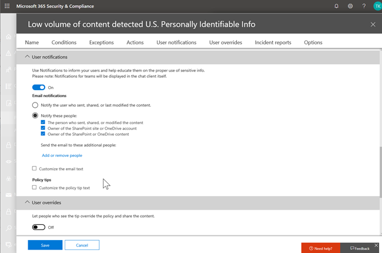

# Prevención de pérdida de datos y Microsoft TeamsData loss prevention and Microsoft Teams

> [!NOTE]
> Las funciones de prevención de pérdida de datos se han agregado recientemente a Microsoft Teams en Office 365 E5 y Office 365 Advanced Compliance.Data loss prevention capabilities were recently added to Microsoft Teams in Office 365 E5 and Office 365 Advanced Compliance. Para obtener más información acerca de la disponibilidad de características, consulte [office 365 service descriptions: office 365 Security & Compliance Center](https://docs.microsoft.com/office365/servicedescriptions/office-365-platform-service-description/office-365-securitycompliance-center).To learn more about feature availability, see [Office 365 Service Descriptions: Office 365 Security & Compliance Center](https://docs.microsoft.com/office365/servicedescriptions/office-365-platform-service-description/office-365-securitycompliance-center).

## Información general de DLP para Microsoft TeamsOverview of DLP for Microsoft Teams

Recientemente, se ampliaron las capacidades de [prevención de pérdida de datos](data-loss-prevention-policies.md) (DLP) para incluir Microsoft Teams.Recently, [data loss prevention](data-loss-prevention-policies.md) (DLP) capabilities were extended to include Microsoft Teams. Si su organización tiene DLP, ahora puede definir directivas que impiden que los usuarios compartan información confidencial en una sesión de chat o de canal de Microsoft Teams.If your organization has DLP, you can now define policies that prevent people from sharing sensitive information in a Microsoft Teams channel or chat session. A continuación, se muestran algunos ejemplos de cómo funciona esta protección:Here are some examples of how this protection works:

- **Ejemplo 1: proteger la información confidencial en los mensajes**.**Example 1: Protecting sensitive information in messages**. Suponga que alguien intenta compartir información confidencial en un canal o chat de Microsoft Teams con invitados (usuarios externos).Suppose that someone attempts to share sensitive information in a Teams chat or channel with guests (external users). Si tiene definida una directiva DLP para evitar esto, se eliminan los mensajes con información confidencial que se envían a los usuarios externos.If you have a DLP policy defined to prevent this, messages with sensitive information that are sent to external users are deleted. Esto sucede automáticamente y en segundos, según la configuración de la Directiva DLP.This happens automatically, and within seconds, according to how your DLP policy is configured.

    > [!NOTE]
    > DLP para Microsoft Teams bloquea contenido confidencial cuando se comparte con usuarios que tienen [acceso de invitado](https://docs.microsoft.com/MicrosoftTeams/guest-access) en equipos y canales, y con usuarios que tienen [acceso externo](https://docs.microsoft.com/MicrosoftTeams/manage-external-access) en reuniones y sesiones de chat.DLP for Microsoft Teams blocks sensitive content when shared with users who have [guest access](https://docs.microsoft.com/MicrosoftTeams/guest-access) in teams and channels, and with users who have [external access](https://docs.microsoft.com/MicrosoftTeams/manage-external-access) in meetings and chat sessions. Si está usando [Microsoft Teams junto con Skype empresarial](https://docs.microsoft.com/microsoftteams/migration-interop-guidance-for-teams-with-skype), tenga en cuenta que DLP para Teams no bloquea mensajes en sesiones de interoperabilidad o de chats federados.If you are using [Microsoft Teams together with Skype for Business](https://docs.microsoft.com/microsoftteams/migration-interop-guidance-for-teams-with-skype), keep in mind that DLP for Teams does not block messages in interop or federated chat sessions.

- **Ejemplo 2: protección de información confidencial en documentos**.**Example 2: Protecting sensitive information in documents**. Suponga que alguien intenta compartir un documento con invitados en un canal o chat de Microsoft Teams, y que el documento contiene información confidencial.Suppose that someone attempts to share a document with guests in a Microsoft Teams channel or chat, and the document contains sensitive information. Si tiene definida una directiva DLP para evitar esto, el documento no se abrirá para esos usuarios.If you have a DLP policy defined to prevent this, the document won't open for those users. Tenga en cuenta que, en este caso, la Directiva DLP debe incluir SharePoint y OneDrive para que la protección esté en su ubicación.Note that in this case, your DLP policy must include SharePoint and OneDrive in order for protection to be in place. (Este es un ejemplo de DLP para SharePoint que se muestra en Microsoft Teams).(This is an example of DLP for SharePoint that shows up in Microsoft Teams.)

## Las sugerencias de directivas ayudan a los usuariosPolicy tips help educate users

De forma similar a cómo funciona DLP en [Exchange, Outlook y Outlook en la web](data-loss-prevention-policies.md#policy-evaluation-in-exchange-online-outlook-and-outlook-on-the-web), [sitios de SharePoint y OneDrive para la empresa](data-loss-prevention-policies.md#policy-evaluation-in-onedrive-for-business-and-sharepoint-online-sites)y [clientes de escritorio de Office](data-loss-prevention-policies.md#policy-evaluation-in-the-office-desktop-programs), las sugerencias de directiva aparecen cuando una acción entra en conflicto con una directiva DLP.Similar to how DLP works in [Exchange, Outlook, and Outlook on the web](data-loss-prevention-policies.md#policy-evaluation-in-exchange-online-outlook-and-outlook-on-the-web), [SharePoint and OneDrive for Business sites](data-loss-prevention-policies.md#policy-evaluation-in-onedrive-for-business-and-sharepoint-online-sites), and [Office desktop clients](data-loss-prevention-policies.md#policy-evaluation-in-the-office-desktop-programs), policy tips appear when an action conflicts with a DLP policy. A continuación, se muestra un ejemplo de una sugerencia de directiva:Here's an example of a policy tip:

En este caso, el remitente ha intentado compartir un número de la seguridad social en un canal de Microsoft Teams.In this case, the sender attempted to share a social security number in a Microsoft Teams channel. El vínculo **¿Qué puedo hacer?** abre un cuadro de diálogo que proporciona opciones para que el remitente resuelva el problema.The **What can I do?** link opens a dialog box that provides options for the sender to resolve the issue. Observe que, en este caso, el remitente puede optar por invalidar la Directiva o notificar a un administrador que la revise y la resuelva.Notice that in this case, the sender can opt to override the policy, or notify an admin to review and resolve it.

En su organización, puede elegir si desea permitir que los usuarios invaliden una directiva DLP o no.In your organization, you can choose whether to allow users to override a DLP policy, or not. Y, cuando configure las directivas de DLP, puede usar las sugerencias de directiva predeterminadas o [personalizar las sugerencias de directiva](#to-customize-policy-tips) para su organización.And, when you configure your DLP policies, you can use the default policy tips, or [customize policy tips](#to-customize-policy-tips) for your organization. 

Volviendo a nuestro ejemplo, en el que un remitente compartió un número de la seguridad social en un canal de Teams, esto es lo que vio el destinatario:Returning to our example, where a sender shared a social security number in a Teams channel, here's what the recipient saw:

El vínculo **¿Qué es esto?** abre un [artículo](data-loss-prevention-policies.md) sobre las directivas de DLP, que ayuda a explicar por qué se bloqueó el mensaje.The **What's this?** link opens an [article](data-loss-prevention-policies.md) about DLP policies, which helps explain why the message was blocked.

### Para personalizar las sugerencias de DirectivaTo customize policy tips

Para realizar esta tarea, debe tener asignado un rol que tenga permisos para editar directivas de DLP.To perform this task, you must be assigned a role that has permissions to edit DLP policies. Para obtener más información vea [Permisos](data-loss-prevention-policies.md#permissions).To learn more, see [Permissions](data-loss-prevention-policies.md#permissions).

1. Vaya al centro de cumplimiento de & de seguridad de[https://protection.office.com](https://protection.office.com)Office 365 () e inicie sesión.Go to the Office 365 Security & Compliance Center ([https://protection.office.com](https://protection.office.com)) and sign in.

2. Elija \*\*\*\* > **Directiva**de prevención de pérdida de datos.Choose **Data loss prevention** > **Policy**. 

3. Seleccione una directiva y, junto a **configuración de directiva**, elija **Editar**.Select a policy, and next to **Policy settings**, choose **Edit**.

4. Puede crear una nueva regla o editar una regla existente para la Directiva.Either create a new rule, or edit an existing rule for the policy.  

5. En la pestaña notificaciones del **usuario** , seleccione **personalizar el texto del correo electrónico** o **personalizar las opciones de texto de la sugerencia de directiva** .On the **User notifications** tab, select **Customize the email text** and/or **Customize the policy tip text** options.    

6. Especifique el texto que desea usar para las notificaciones de correo electrónico o las sugerencias de directiva y, a continuación, elija **Guardar**.Specify the text you want to use for email notifications and/or policy tips, and then choose **Save**. 

7. En la pestaña **configuración de directiva** , elija **Guardar**.On the **Policy settings** tab, choose **Save**.

Espere aproximadamente una hora para que los cambios funcionen en el centro de datos y sincronicen las cuentas de usuario.Allow approximately one hour for your changes to work their way through your data center and sync to user accounts.
 
## Agregar Microsoft Teams como ubicación a las directivas de DLP existentesAdd Microsoft Teams as a location to existing DLP policies

Para realizar esta tarea, debe tener asignado un rol que tenga permisos para editar directivas de DLP.To perform this task, you must be assigned a role that has permissions to edit DLP policies. Para obtener más información vea [Permisos](data-loss-prevention-policies.md#permissions).To learn more, see [Permissions](data-loss-prevention-policies.md#permissions).

1. Vaya al centro de cumplimiento de & de seguridad de[https://protection.office.com](https://protection.office.com)Office 365 () e inicie sesión.Go to the Office 365 Security & Compliance Center ([https://protection.office.com](https://protection.office.com)) and sign in.

2. Elija \*\*\*\* > **Directiva**de prevención de pérdida de datos.Choose **Data loss prevention** > **Policy**. 

3. Seleccione una directiva y mire los valores en **ubicaciones**.Select a policy, and look at the values under **Locations**. Si ve **los mensajes de chat y de canal**de Microsoft Teams, ya está todo configurado.If you see **Teams chat and channel messages**, you're all set. Si no lo hace, haga clic en **Editar**.If you don't, click **Edit**.  

4. En la columna **Estado** , active la Directiva para **los mensajes de chat y de canal**de Microsoft Teams.In the **Status** column, turn the policy on for **Teams chat and channel messages**.  

5. Conserve la configuración predeterminada de todas las cuentas o especifique las cuentas que se van a incluir o excluir.Keep the default settings of all accounts, or specify which accounts to include or exclude.

6. Haga clic en \*\*Guardar \*\*.Click **Save**.

Espere aproximadamente una hora para que los cambios funcionen en el centro de datos y sincronicen las cuentas de usuario.Allow approximately one hour for your changes to work their way through your data center and sync to user accounts.

## Definir una nueva Directiva de DLP para Microsoft TeamsDefine a new DLP policy for Microsoft Teams

Para realizar esta tarea, debe tener asignado un rol que tenga permisos para editar directivas de DLP.To perform this task, you must be assigned a role that has permissions to edit DLP policies. Para obtener más información vea [Permisos](data-loss-prevention-policies.md#permissions).To learn more, see [Permissions](data-loss-prevention-policies.md#permissions).

1. Vaya al centro de cumplimiento de & de seguridad de[https://protection.office.com](https://protection.office.com)Office 365 () e inicie sesión.Go to the Office 365 Security & Compliance Center ([https://protection.office.com](https://protection.office.com)) and sign in.

2. Elegir \*\*\*\* > \*\*\*\* directiva > **de prevención de pérdida de datos + crear una directiva**.Choose **Data loss prevention** > **Policy** > **+ Create a policy**. 

3. Elija una [plantilla](data-loss-prevention-policies.md#dlp-policy-templates)y, a continuación, elija **siguiente**.Choose a [template](data-loss-prevention-policies.md#dlp-policy-templates), and then choose **Next**. En nuestro ejemplo, elegimos la plantilla de datos de información de identificación personal de Estados Unidos.In our example, we chose the U.S. Personally Identifiable Information Data template.  

4. En la pestaña Nombre de la **Directiva** , especifique un nombre y una descripción para la Directiva y, a continuación, elija **siguiente**.On the **Name your policy** tab, specify a name and description for the policy, and then choose **Next**. 

5. En la pestaña **elegir ubicaciones** , mantenga la configuración predeterminada de todas las ubicaciones o seleccione **permitirme elegir ubicaciones específicas**y, después, haga clic en **siguiente**.On the **Choose locations** tab, keep the default setting of all locations, or select **Let me choose specific locations**, and then choose **Next**. Si optó por elegir ubicaciones específicas, seleccione las ubicaciones de la Directiva DLP y, a continuación, elija **siguiente**.If you opted to choose specific locations, select the locations for your DLP policy, and then choose **Next**.  
    > [!NOTE]
    > Si desea asegurarse de que los documentos que contienen información confidencial no se compartan de manera inadecuada, asegúrese de que los **sitios de SharePoint** y **las cuentas de OneDrive** estén activados, junto con **los mensajes de chat y de canal**de Teams.If you want to make sure documents that contain sensitive information are not shared inappropriately, make sure **SharePoint sites** and **OneDrive accounts** are turned on, along with **Teams chat and channel messages**.
 

6. En la **pestaña Configuración de directiva** , en **personalizar el tipo de contenido que quiere proteger**, mantenga la configuración sencilla predeterminada o elija **Usar configuración avanzada**y, a continuación, elija **siguiente**.On the **Policy settings** tab, under **Customize the type of content you want to protect**, keep the default simple settings, or choose **Use advanced settings**, and then choose **Next**. Si elige la configuración avanzada, puede crear o editar reglas para la Directiva.If you choose advanced settings, you can create or edit rules for your policy. (Para obtener ayuda, consulte [Configuración sencilla frente a configuración avanzada](data-loss-prevention-policies.md#simple-settings-vs-advanced-settings)).(To get help with this, see [Simple settings vs. advanced settings](data-loss-prevention-policies.md#simple-settings-vs-advanced-settings).)

7.  En la pestaña **configuración de directiva** , en **¿qué desea hacer si se detecta información confidencial?**, revise la configuración.On the **Policy settings** tab, under **What do you want to do if we detect sensitive info?**, review the settings. (Aquí puede elegir mantener las [sugerencias de directiva y notificaciones de correo electrónico](use-notifications-and-policy-tips.md)predeterminadas o personalizarlas).(Here's where you can choose to keep default [policy tips and email notifications](use-notifications-and-policy-tips.md), or customize them.)  Cuando haya terminado de revisar o editar la configuración, elija **siguiente**.When you're finished reviewing or editing settings, choose **Next**.

8. En la **pestaña Configuración de directiva** , en **¿desea activar la Directiva o probar la primera?**, elija si desea activar la Directiva, [probarla primero](data-loss-prevention-policies.md#roll-out-dlp-policies-gradually-with-test-mode)o dejarla desactivada por ahora y, a continuación, elija **siguiente**.On the **Policy settings** tab, under **Do you want to turn on the policy or test things out first?**, choose whether to turn the policy on, [test it first](data-loss-prevention-policies.md#roll-out-dlp-policies-gradually-with-test-mode), or keep it turned off for now, and then choose **Next**.  

9. En la pestaña **revisar la configuración** , revise la configuración de la nueva Directiva.On the **Review your settings** tab, review the settings for your new policy. Elija **Editar** para realizar cambios.Choose **Edit** to make changes. Cuando haya terminado, elija **crear**.When you're finished, choose **Create**. 

Espere aproximadamente una hora para que la nueva Directiva funcione a través del centro de datos y sincronice las cuentas de usuario.Allow approximately one hour for your new policy to work its way through your data center and sync to user accounts.

## Artículos relacionadosRelated articles

[Crear, probar y optimizar una directiva DLPCreate, test, and tune a DLP policy](create-test-tune-dlp-policy.md)

[Enviar notificaciones de email y mostrar sugerencias para directivas DLPSend email notifications and show policy tips for DLP policies](use-notifications-and-policy-tips.md)
