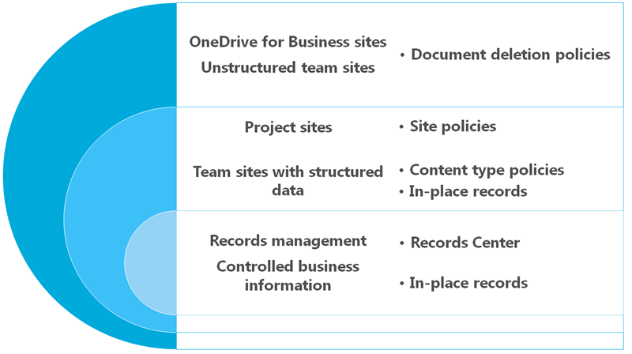

# Información general sobre las directivas de eliminación de documentos

> [!IMPORTANT]
> En el futuro, le recomendamos que use una directiva de retención o etiquetas creadas en el centro de cumplimiento de Microsoft 365, el centro de seguridad de &amp; Microsoft 365 o el centro de seguridad de Office 365 en lugar de una directiva de eliminación de documentos. Las directivas de eliminación de documentos seguirán funcionando en paralelo con las directivas de retención, pero si necesita conservar o eliminar contenido en cualquier lugar de Office 365, le recomendamos que use una directiva de retención. Para obtener más información, vea [usar una directiva de retención en lugar de estas características](retention-policies.md#use-a-retention-policy-instead-of-these-features).
  
Es posible que su organización tenga que conservar los documentos durante un período de tiempo debido a los requisitos de cumplimiento, legales u otros requisitos empresariales. Sin embargo, si la organización guarda documentos más tiempo del necesario, se crea un riesgo legal innecesario. Con una directiva de eliminación de documentos, puede reducir el riesgo de forma proactiva eliminando los documentos de un sitio después de un período de tiempo específico (por ejemplo, puede eliminar documentos de los sitios de OneDrive para la empresa de los usuarios cinco años después de que se crearon los documentos).
  
Las directivas de eliminación de documentos son potentes pero flexibles, por ejemplo, puede:
  
- Permitir a los propietarios de sitios elegir directivas que usted cree y administre de forma centralizada. También puede permitir que los propietarios de sitios anulen una directiva si deciden que no se aplica a su contenido.
    
- Aplicar una sola directiva obligatoria a todos los sitios de una colección, como todos los sitios de OneDrive para la Empresa, o aplicar una directiva a todas las colecciones de sitios creadas a partir de una plantilla de colección de sitios determinada, como la plantilla Sitio de grupo.
    
- Proporcionar una directiva predeterminada con una regla predeterminada que se aplicará automáticamente sin necesidad de que los propietarios de los sitios realicen ninguna acción.
    
- Crear una directiva que incluya varias reglas de eliminación entre las que podrá elegir el propietario de un sitio.
    
Puede crear y administrar directivas de eliminación de documentos mediante el centro de directivas de eliminación de documentos. Como alternativa, puede crear el centro de directivas manualmente [creando la colección de sitios](https://go.microsoft.com/fwlink/p/?LinkID=404342) y seleccionando **centro de directivas de cumplimiento** en la pestaña **empresa** . Cada inquilino solo puede tener un centro de directivas de eliminación de documentos. 
  

  
## Cuándo usar directivas de eliminación de documentos

Además de las directivas de eliminación de documentos, Office 365 proporciona estas directivas de retención para el contenido de los sitios:
  
- [Administración de registros](https://go.microsoft.com/fwlink/p/?LinkID=404250)
    
- [Directivas de administración de información para tipos de contenido, listas y bibliotecas](https://go.microsoft.com/fwlink/p/?LinkID=404239)
    
- [Directivas del sitio](https://go.microsoft.com/fwlink/p/?LinkID=404242)
    
Cada tipo de directiva funciona mejor para un tipo específico de datos o de sitio. Por ejemplo, su organización puede tener un sitio muy estructurado que usa tipos de contenido diferentes, como un sitio financiero para contratos o una knowledge base para artículos. En este caso, puede usar directivas de tipo de contenido. También es posible que su organización necesite conservar documentos legales, en cuyo caso puede usar tipos de contenido y un centro de registros para implementar un plan de archivos.
  
Las directivas de eliminación de documentos no sustituyen las directivas de administración de registros o de administración de información, que funcionan mejor con los datos estructurados y los tipos de contenido. En su lugar, debe usar las directivas de eliminación de documentos cuando necesite administrar de forma general la eliminación automática de datos no estructurados, como sitios de grupo y sitios de OneDrive para la Empresa.
  

  
Si aplica una directiva de eliminación de documentos a un sitio que ya usa directivas de tipo de contenido o directivas de administración de información para una lista o biblioteca, dichas directivas se ignorarán mientras la directiva de eliminación de documentos esté activa. Esto significa que debe planear que un sitio use solamente las directivas destinadas a contenido estructurado o no estructurado, pero no ambos. Para obtener más información sobre cómo las directivas de eliminación de documentos invalidan otras directivas, vea [Apply or remove a document deletion policy for a site](apply-or-remove-a-document-deletion-policy-for-a-site.md).
  
A diferencia de lo que ocurre con otras directivas, las directivas de eliminación de documentos solo funcionan en las bibliotecas de documentos, no en las listas.
  
## Reglas y directivas de eliminación

Una directiva de eliminación de documentos contiene una o varias reglas de eliminación que especifican:
  
- El período de tiempo hasta la eliminación.
    
- Si se va a calcular la fecha de eliminación desde que se creó el documento o desde que se modificó por última vez.
    
- Si se va a eliminar el documento de forma permanente o se va a enviar a la Papelera de reciclaje.
    
Si una directiva contiene más de una regla, los propietarios de los sitios pueden seleccionar la regla que mejor convenga a su contenido.
  

  
## Directivas y asignaciones

Después de crear una directiva de eliminación de documentos, puede asignarla a una plantilla de colección de sitios (por ejemplo, puede asignar una directiva a la plantilla de OneDrive para la empresa para que incluya el sitio de OneDrive de todos los usuarios). Cuando se asigna una directiva a una plantilla de colección de sitios, esto se aplica a todas las colecciones de sitios ya creadas a partir de esa plantilla, además de las colecciones de sitios creadas a partir de esa plantilla en el futuro.
  

  
También puede asignar una directiva a una colección de sitios determinada, lo que reemplaza a cualquier otra directiva que se haya asignado a la plantilla de esa colección de sitios. Por ejemplo, puede asignar directivas a la plantilla Sitio de grupo, pero luego debe anularlas mediante la aplicación de un conjunto de directivas diferente a una colección de sitios determinada creada a partir de esa plantilla.
  
### Una directiva obligatoria o varias directivas para elegir

Cuando asigna una directiva, puede elegir hacerla obligatoria. Si es así, solo se podrá asignar esa directiva y se aplicará a todos los sitios de la colección de sitios. Los propietarios de sitios no pueden anular una directiva obligatoria, lo que significa que los documentos del sitio estarán sujetos a la directiva de eliminación pase lo que pase.
  
En lugar de hacer una sola directiva obligatoria, también puede asignar varias directivas a una colección de sitios. Esto permite que cada propietario de un sitio elija qué directiva quiere aplicar a su sitio, o incluso anular todas. Por ejemplo, puede crear una directiva para documentos empresariales generales y otra directiva para documentos financieros que tengan una programación de retención diferente. El propietario de un sitio suele saber mejor que nadie el contenido incluido en su sitio y, por tanto, la directiva de eliminación de documentos que hay que aplicar. Cada sitio puede tener solamente una directiva aplicada.
  
### Una regla o varias reglas para elegir

A su vez, cada Directiva puede contener varias reglas; por ejemplo, una directiva de eliminación para documentos empresariales generales puede tener dos reglas:
  
- Los documentos que no necesiten retención según las obligaciones legales o las necesidades empresariales en curso no deben conservarse durante más de un año desde su creación.
    
- Los documentos necesarios para un uso empresarial activo y continuado que se necesiten durante más de un año no deben conservarse durante más de tres años desde su creación.
    
El propietario de un sitio puede determinar que su sitio contiene documentos empresariales generales, por lo que seleccionará esta directiva de eliminación y, a continuación, seleccionará la regla adecuada de la directiva. Solo se puede seleccionar una regla de la Directiva que se aplica actualmente al sitio (no desde cualquier directiva) y la regla se aplica a todas las bibliotecas de documentos del sitio.
  
## Relación entre colecciones de sitios, directivas y reglas

La relación básica es la siguiente:
  
una colección de sitios o una plantilla de colección de sitios puede tener una o varias directivas asignadas y cada una de esas directivas puede tener una o varias reglas. Sin embargo, solo puede haber una Directiva activa por sitio y solo puede haber una regla de eliminación activa en cualquier momento para las bibliotecas dentro del sitio.
  

  
## Las directivas de eliminación de documentos se heredan

Igual que los permisos, la navegación y muchas otras características del sitio, las directivas de eliminación de documentos se heredan. Los propietarios de un sitio pueden seleccionar una directiva de eliminación de documentos para su sitio; de esta forma, todos los subsitios heredan la directiva del sitio primario. Un propietario de un subsitio puede interrumpir la herencia si selecciona otra combinación de directiva y regla, y esa directiva se aplicará a todos los subsitios hasta que se interrumpa la herencia de nuevo.
  
## Asignar directivas de eliminación de documentos por primera vez

Es importante comprender que el período de tiempo especificado para una directiva de eliminación de documentos significa el tiempo desde que se creó o modificó el documento, no el tiempo desde que se asignó la Directiva. Por ejemplo, puede crear una directiva de eliminación de documentos que elimine permanentemente los documentos dos años después de su creación y, a continuación, asignar esa Directiva a una plantilla de colección de sitios desde la que se crearon varias colecciones de sitios hace cuatro o cinco años. En este caso, es probable que las colecciones de sitios existentes contengan muchos documentos que ya son más antiguos que los dos años especificados por la Directiva de eliminación, lo que significa que se eliminará mucho contenido después de asignar la Directiva de eliminación de documentos para el primer temporal.
  
Cuando se asigna la directiva por primera vez, se evalúan todos los documentos del sitio. Si cumplen los criterios, se eliminarán. Esto se aplica a todos los documentos existentes, no solo a los documentos nuevos creados desde que se asignó la directiva. Y recuerde que el período de tiempo corresponde a la antigüedad de cada documento, no al tiempo desde que se asignó la directiva por primera vez.
  
Por lo tanto, antes de asignar una directiva a un sitio por primera vez, primero debería considerar la antigüedad del contenido existente y cuál será el impacto de dicha directiva. También es recomendable comunicar la nueva directiva a los propietarios de sitios antes de asignarla, para darles tiempo a evaluar el posible impacto.
  
## Intervalo de tiempo en la propagación de directivas

Después de asignar directivas a una colección de sitios, los propietarios de los sitios usan el vínculo **Directivas de eliminación de documentos** de la página **Configuración del sitio** para ver y aplicar directivas disponibles para el sitio. 
  
El vínculo **directivas de eliminación de documentos** no aparecerá a menos que se hayan asignado directivas a la colección de sitios. Además, el vínculo no aparece inmediatamente después de que las directivas se hayan asignado al sitio: puede tardar hasta 24 horas desde el momento en que se asignan las directivas cuando aparece el vínculo **directivas de eliminación de documentos** . 
  
## Permisos

Los miembros de su equipo de cumplimiento normativo que vayan a usar el centro de directivas de eliminación de documentos necesitan permisos para el centro de directivas y para las colecciones de sitios en las que se aplicarán las directivas. Le recomendamos que haga lo siguiente:
  
1. Cree un grupo de seguridad que contenga todos los usuarios del centro de directivas de eliminación de documentos, probablemente el equipo de administración de directivas de cumplimiento. Consulte [Manage mail-Enabled Security Groups](https://go.microsoft.com/fwlink/p/?LinkID=404345) para obtener más información. 
    
2. En el Centro de directivas de eliminación de documentos, asigne permisos de propietario de colección de sitios al grupo de seguridad. Vea [permisos para administradores](https://go.microsoft.com/fwlink/p/?LinkID=404346) de la colección de sitios para obtener más información. 
    
3. En cada colección de sitios en que necesite asignar directivas de eliminación de documentos, asigne permisos de propietario de colección de sitios al grupo de seguridad.
    
## Funcionamiento de las directivas de eliminación de documentos con las directivas de retención

Una directiva de retención asegura que todo el contenido se mantenga durante un período de tiempo determinado, mientras que una directiva de eliminación de documentos asegura que todo el contenido se elimina después de un período de tiempo determinado.
  
Si necesita conservar documentos durante un período fijo de tiempo, puede usar una directiva de retención junto con una directiva de eliminación. Por ejemplo, puede retener documentos durante tres años después de modificarlos y, luego, configurar una directiva de eliminación para eliminarlos tres años después de su última modificación.
  
Tenga en cuenta que una directiva de eliminación no puede reemplazar a una retención. Si un sitio está en retención y una directiva de eliminación de documentos elimina un documento, el documento se conservará en la biblioteca de conservación de documentos de la misma forma que si el documento se hubiera eliminado de forma manual.
  
## Vea también

[Aplicar o quitar una directiva de eliminación de documentos de un sitio](apply-or-remove-a-document-deletion-policy-for-a-site.md)

[Crear una directiva de eliminación de documentos](create-a-document-deletion-policy.md)

