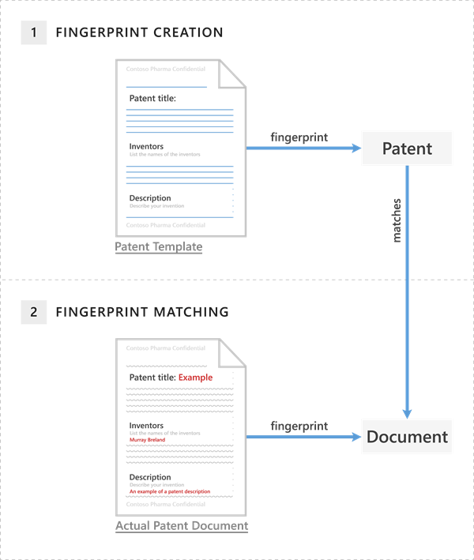

# <a name="document-fingerprinting"></a><span data-ttu-id="1f9c4-105">Creación de huella digital de documento</span><span class="sxs-lookup"><span data-stu-id="1f9c4-105">Document Fingerprinting</span></span>

<span data-ttu-id="1f9c4-106">Los trabajadores de la información en su organización tratan con diversos tipos de información confidencial durante un día normal.</span><span class="sxs-lookup"><span data-stu-id="1f9c4-106">Information workers in your organization handle many kinds of sensitive information during a typical day.</span></span> <span data-ttu-id="1f9c4-107">En el centro &amp; de seguridad y cumplimiento, la huella digital de documento facilita la protección de esta información mediante la identificación de formularios estándar que se usan en toda la organización.</span><span class="sxs-lookup"><span data-stu-id="1f9c4-107">In the Security &amp; Compliance Center, Document Fingerprinting makes it easier for you to protect this information by identifying standard forms that are used throughout your organization.</span></span> <span data-ttu-id="1f9c4-108">En este tema se describen los conceptos relacionados con la creación de huellas digitales de documentos y cómo crear una mediante PowerShell.</span><span class="sxs-lookup"><span data-stu-id="1f9c4-108">This topic describes the concepts behind Document Fingerprinting and how to create one by using PowerShell.</span></span>
  
## <a name="basic-scenario-for-document-fingerprinting"></a><span data-ttu-id="1f9c4-109">Escenario básico para la creación de huella digital de documento</span><span class="sxs-lookup"><span data-stu-id="1f9c4-109">Basic scenario for Document Fingerprinting</span></span>

<span data-ttu-id="1f9c4-110">La huella digital de documento es una característica de prevención de pérdida de datos (DLP) que convierte un formulario estándar en un tipo de información confidencial, que se puede usar en las reglas de las directivas de DLP.</span><span class="sxs-lookup"><span data-stu-id="1f9c4-110">Document Fingerprinting is a Data Loss Prevention (DLP) feature that converts a standard form into a sensitive information type, which you can use in the rules of your DLP policies.</span></span> <span data-ttu-id="1f9c4-111">Por ejemplo, puede crear una huella digital de documento con base en una plantilla de patente en blanco y después crear una directiva DLP que detecte y bloquee todas las plantillas de patente salientes que incluyan contenido confidencial.</span><span class="sxs-lookup"><span data-stu-id="1f9c4-111">For example, you can create a document fingerprint based on a blank patent template and then create a DLP policy that detects and blocks all outgoing patent templates with sensitive content filled in.</span></span> <span data-ttu-id="1f9c4-112">Opcionalmente, puede configurar sugerencias de [Directiva](use-notifications-and-policy-tips.md) para notificar a los remitentes que puedan enviar información confidencial y el remitente debe comprobar que los destinatarios están cualificados para recibir las patentes.</span><span class="sxs-lookup"><span data-stu-id="1f9c4-112">Optionally, you can set up [policy tips](use-notifications-and-policy-tips.md) to notify senders that they might be sending sensitive information, and the sender should verify that the recipients are qualified to receive the patents.</span></span> <span data-ttu-id="1f9c4-113">Este proceso funciona con cualquier formulario basado en texto que se use en la organización.</span><span class="sxs-lookup"><span data-stu-id="1f9c4-113">This process works with any text-based forms used in your organization.</span></span> <span data-ttu-id="1f9c4-114">Algunos ejemplos adicionales de formularios que puede cargar son:</span><span class="sxs-lookup"><span data-stu-id="1f9c4-114">Additional examples of forms that you can upload include:</span></span> 
  
- <span data-ttu-id="1f9c4-115">Formularios de gobierno</span><span class="sxs-lookup"><span data-stu-id="1f9c4-115">Government forms</span></span>
    
- <span data-ttu-id="1f9c4-116">Formularios de cumplimiento de Health Insurance Portability and Accountability Act (HIPAA)</span><span class="sxs-lookup"><span data-stu-id="1f9c4-116">Health Insurance Portability and Accountability Act (HIPAA) compliance forms</span></span>
    
- <span data-ttu-id="1f9c4-117">Formularios de información sobre empleados para los departamentos de recursos humanos</span><span class="sxs-lookup"><span data-stu-id="1f9c4-117">Employee information forms for Human Resources departments</span></span>
    
- <span data-ttu-id="1f9c4-118">Formularios personalizados creados específicamente para la organización</span><span class="sxs-lookup"><span data-stu-id="1f9c4-118">Custom forms created specifically for your organization</span></span>
    
<span data-ttu-id="1f9c4-119">Idealmente, la organización ya tiene una práctica de negocios establecida sobre el uso de determinados formularios para transmitir información confidencial.</span><span class="sxs-lookup"><span data-stu-id="1f9c4-119">Ideally, your organization already has an established business practice of using certain forms to transmit sensitive information.</span></span> <span data-ttu-id="1f9c4-120">Después de cargar un formulario vacío para convertirlo en una huella digital de documento y configurar una directiva correspondiente, DLP detecta los documentos en el correo saliente que coinciden con esa huella digital.</span><span class="sxs-lookup"><span data-stu-id="1f9c4-120">After you upload an empty form to be converted to a document fingerprint and set up a corresponding policy, the DLP detects any documents in outbound mail that match that fingerprint.</span></span>
  
## <a name="how-document-fingerprinting-works"></a><span data-ttu-id="1f9c4-121">Funcionamiento de la creación de huella digital de documento</span><span class="sxs-lookup"><span data-stu-id="1f9c4-121">How Document Fingerprinting works</span></span>

<span data-ttu-id="1f9c4-122">Probablemente ya adivinó que los documentos no tienen huellas digitales reales, pero el nombre ayuda a explicar la característica.</span><span class="sxs-lookup"><span data-stu-id="1f9c4-122">You've probably already guessed that documents don't have actual fingerprints, but the name helps explain the feature.</span></span> <span data-ttu-id="1f9c4-123">Del mismo modo que las huellas digitales de una persona tienen patrones únicos, los documentos tienen patrones de palabras únicos.</span><span class="sxs-lookup"><span data-stu-id="1f9c4-123">In the same way that a person's fingerprints have unique patterns, documents have unique word patterns.</span></span> <span data-ttu-id="1f9c4-124">Cuando se carga un archivo, DLP identifica el patrón de palabra único en el documento, crea una huella digital de documento basada en ese patrón y usa dicha huella digital de documento para detectar los documentos salientes que contengan el mismo patrón.</span><span class="sxs-lookup"><span data-stu-id="1f9c4-124">When you upload a file, DLP identifies the unique word pattern in the document, creates a document fingerprint based on that pattern, and uses that document fingerprint to detect outbound documents containing the same pattern.</span></span> <span data-ttu-id="1f9c4-125">Por ello, la carga de un formulario o plantilla crea el tipo más efectivo de huella digital de documento.</span><span class="sxs-lookup"><span data-stu-id="1f9c4-125">That's why uploading a form or template creates the most effective type of document fingerprint.</span></span> <span data-ttu-id="1f9c4-126">Todas las personas que rellenan un formulario usan el mismo conjunto de palabras original y después agregan sus propias palabras al documento.</span><span class="sxs-lookup"><span data-stu-id="1f9c4-126">Everyone who fills out a form uses the same original set of words and then adds his or her own words to the document.</span></span> <span data-ttu-id="1f9c4-127">Siempre que el documento de salida no esté protegido con contraseña y contenga todo el texto del formulario original, DLP puede determinar si el documento coincide con la huella digital de documento.</span><span class="sxs-lookup"><span data-stu-id="1f9c4-127">As long as the outbound document isn't password protected and contains all the text from the original form, DLP can determine if the document matches the document fingerprint.</span></span>
  
<span data-ttu-id="1f9c4-128">El siguiente ejemplo muestra qué sucede si crea una huella digital de documento con base en una plantilla de patente, pero puede usar cualquier formulario como base para crear una huella digital de documento.</span><span class="sxs-lookup"><span data-stu-id="1f9c4-128">The following example shows what happens if you create a document fingerprint based on a patent template, but you can use any form as a basis for creating a document fingerprint.</span></span>
  
<span data-ttu-id="1f9c4-129">**Ejemplo de documento de patente que coincide con una huella digital de documento de una plantilla de patente**</span><span class="sxs-lookup"><span data-stu-id="1f9c4-129">**Example of a patent document matching a document fingerprint of a patent template**</span></span>


  
<span data-ttu-id="1f9c4-131">La plantilla de patente contiene los campos en blanco "título de patente", "inventoras" y "Descripción" y descripciones para cada uno de esos campos, que es la palabra pattern.</span><span class="sxs-lookup"><span data-stu-id="1f9c4-131">The patent template contains the blank fields "Patent title," "Inventors," and "Description" and descriptions for each of those fields—that's the word pattern.</span></span> <span data-ttu-id="1f9c4-132">Al cargar la plantilla de patentes original, se encuentra en uno de los tipos de archivo admitidos y en texto sin formato.</span><span class="sxs-lookup"><span data-stu-id="1f9c4-132">When you upload the original patent template, it's in one of the supported file types and in plain text.</span></span> <span data-ttu-id="1f9c4-133">DLP convierte este patrón de palabras en una huella digital de documento, que es un pequeño archivo XML Unicode que contiene un valor de hash único que representa el texto original y la huella digital se guarda como una clasificación de datos en Active Directory.</span><span class="sxs-lookup"><span data-stu-id="1f9c4-133">DLP converts this word pattern into a document fingerprint, which is a small Unicode XML file containing a unique hash value representing the original text, and the fingerprint is saved as a data classification in Active Directory.</span></span> <span data-ttu-id="1f9c4-134">(Como medida de seguridad, el documento original no se almacena en el servicio; solo se almacena el valor hash y no se puede reconstruir el documento original a partir del valor hash). La huella digital de patente se convierte en un tipo de información confidencial que puede asociar con una directiva de DLP.</span><span class="sxs-lookup"><span data-stu-id="1f9c4-134">(As a security measure, the original document itself isn't stored on the service; only the hash value is stored, and the original document can't be reconstructed from the hash value.) The patent fingerprint then becomes a sensitive information type that you can associate with a DLP policy.</span></span> <span data-ttu-id="1f9c4-135">Después de asociar la huella digital con una directiva DLP, DLP detecta los mensajes de correo electrónico salientes que contienen documentos que coinciden con la huella digital de patente y se ocupan de ellos según la Directiva de la organización.</span><span class="sxs-lookup"><span data-stu-id="1f9c4-135">After you associate the fingerprint with a DLP policy, DLP detects any outbound emails containing documents that match the patent fingerprint and deals with them according to your organization's policy.</span></span> 

<span data-ttu-id="1f9c4-136">Por ejemplo, es posible que quiera configurar una directiva DLP que impida a los empleados normales enviar mensajes salientes que contengan patentes.</span><span class="sxs-lookup"><span data-stu-id="1f9c4-136">For example, you might want to set up a DLP policy that prevents regular employees from sending outgoing messages containing patents.</span></span> <span data-ttu-id="1f9c4-137">DLP usará la huella digital de patentes para detectar las patentes y bloquearlas.</span><span class="sxs-lookup"><span data-stu-id="1f9c4-137">DLP will use the patent fingerprint to detect patents and block those emails.</span></span> <span data-ttu-id="1f9c4-138">Como alternativa, es posible que desee que el departamento legal pueda enviar patentes a otras organizaciones porque tiene una necesidad empresarial de hacerlo.</span><span class="sxs-lookup"><span data-stu-id="1f9c4-138">Alternatively, you might want to let your legal department to be able to send patents to other organizations because it has a business need for doing so.</span></span> <span data-ttu-id="1f9c4-139">Puede permitir que departamentos específicos envíen información confidencial mediante la creación de excepciones para los departamentos de la Directiva DLP o puede permitirles invalidar una sugerencia de directiva con una justificación empresarial.</span><span class="sxs-lookup"><span data-stu-id="1f9c4-139">You can allow specific departments to send sensitive information by creating exceptions for those departments in your DLP policy, or you can allow them to override a policy tip with a business justification.</span></span>
  
### <a name="supported-file-types"></a><span data-ttu-id="1f9c4-140">Tipos de archivo compatibles</span><span class="sxs-lookup"><span data-stu-id="1f9c4-140">Supported file types</span></span>

<span data-ttu-id="1f9c4-141">La huella digital de documento admite los mismos tipos de archivo que son compatibles con las reglas de flujo de correo (también conocidas como reglas de transporte).</span><span class="sxs-lookup"><span data-stu-id="1f9c4-141">Document Fingerprinting supports the same file types that are supported in mail flow rules (also known as transport rules).</span></span> <span data-ttu-id="1f9c4-142">Para obtener una lista de los tipos de archivo admitidos, consulte [tipos de archivos admitidos para la inspección del contenido de reglas de flujo de correo](https://docs.microsoft.com/en-us/exchange/security-and-compliance/mail-flow-rules/inspect-message-attachments#supported-file-types-for-mail-flow-rule-content-inspection).</span><span class="sxs-lookup"><span data-stu-id="1f9c4-142">For a list of supported file types, see [Supported file types for mail flow rule content inspection](https://docs.microsoft.com/en-us/exchange/security-and-compliance/mail-flow-rules/inspect-message-attachments#supported-file-types-for-mail-flow-rule-content-inspection).</span></span> <span data-ttu-id="1f9c4-143">Una nota rápida sobre los tipos de archivo: ni las reglas de flujo de correo ni la huella digital de documento admiten el tipo de archivo. dotx, lo que puede resultar confuso porque es un archivo de plantilla en Word.</span><span class="sxs-lookup"><span data-stu-id="1f9c4-143">One quick note about file types: neither mail flow rules nor Document Fingerprinting supports the .dotx file type, which can be confusing because that's a template file in Word.</span></span> <span data-ttu-id="1f9c4-144">Cuando ve la palabra "plantilla" en este y otros temas de creación de huella digital de documento, se refiere a un documento que se ha establecido como formulario estándar, no al tipo de archivo de plantilla.</span><span class="sxs-lookup"><span data-stu-id="1f9c4-144">When you see the word "template" in this and other Document Fingerprinting topics, it refers to a document that you have established as a standard form, not the template file type.</span></span>
  
#### <a name="limitations-of-document-fingerprinting"></a><span data-ttu-id="1f9c4-145">Limitaciones de la creación de huella digital de documento</span><span class="sxs-lookup"><span data-stu-id="1f9c4-145">Limitations of document fingerprinting</span></span>

<span data-ttu-id="1f9c4-146">La huella digital de documento no detectará información confidencial en los siguientes casos:</span><span class="sxs-lookup"><span data-stu-id="1f9c4-146">Document Fingerprinting won't detect sensitive information in the following cases:</span></span>
  
- <span data-ttu-id="1f9c4-147">Archivos protegidos por contraseña</span><span class="sxs-lookup"><span data-stu-id="1f9c4-147">Password protected files</span></span>
    
- <span data-ttu-id="1f9c4-148">Archivos que solo contienen imágenes</span><span class="sxs-lookup"><span data-stu-id="1f9c4-148">Files that contain only images</span></span>
    
- <span data-ttu-id="1f9c4-149">Documentos que no contienen todo el texto del formulario original utilizado para crear la huella digital de documento</span><span class="sxs-lookup"><span data-stu-id="1f9c4-149">Documents that don't contain all the text from the original form used to create the document fingerprint</span></span>
    
## <a name="use-powershell-to-create-a-classification-rule-package-based-on-document-fingerprinting"></a><span data-ttu-id="1f9c4-150">Usar PowerShell para crear un paquete de reglas de clasificación basado en la creación de huellas digitales de documentos</span><span class="sxs-lookup"><span data-stu-id="1f9c4-150">Use PowerShell to create a classification rule package based on document fingerprinting</span></span>

<span data-ttu-id="1f9c4-151">Tenga en cuenta que actualmente puede crear una huella digital de documento solo con PowerShell en &amp; el centro de seguridad y cumplimiento.</span><span class="sxs-lookup"><span data-stu-id="1f9c4-151">Note that you can currently create a document fingerprint only by using PowerShell in the Security &amp; Compliance Center.</span></span> <span data-ttu-id="1f9c4-152">Para conectarse, vea [Connect to Security & Compliance Center PowerShell](https://docs.microsoft.com/en-us/powershell/exchange/office-365-scc/connect-to-scc-powershell/connect-to-scc-powershell).</span><span class="sxs-lookup"><span data-stu-id="1f9c4-152">To connect, see [Connect to Security & Compliance Center PowerShell](https://docs.microsoft.com/en-us/powershell/exchange/office-365-scc/connect-to-scc-powershell/connect-to-scc-powershell).</span></span>

<span data-ttu-id="1f9c4-153">DLP usa paquetes de reglas de clasificación para detectar contenido confidencial.</span><span class="sxs-lookup"><span data-stu-id="1f9c4-153">DLP uses classification rule packages to detect sensitive content.</span></span> <span data-ttu-id="1f9c4-154">Para crear un paquete de reglas de clasificación basado en una huella digital de documento, use los cmdlets **New-DlpFingerprint** y **New-DlpSensitiveInformationType** .</span><span class="sxs-lookup"><span data-stu-id="1f9c4-154">To create a classification rule package based on a document fingerprint, use the **New-DlpFingerprint** and **New-DlpSensitiveInformationType** cmdlets.</span></span> <span data-ttu-id="1f9c4-155">Debido a que los resultados de **New-DlpFingerprint** no se almacenan fuera de la regla de clasificación de datos, siempre se ejecuta **New-DlpFingerprint** y **New-DlpSensitiveInformationType** o **set-DlpSensitiveInformationType** en el mismo Sesión de PowerShell.</span><span class="sxs-lookup"><span data-stu-id="1f9c4-155">Because the results of **New-DlpFingerprint** aren't stored outside the data classification rule, you always run **New-DlpFingerprint** and **New-DlpSensitiveInformationType** or **Set-DlpSensitiveInformationType** in the same PowerShell session.</span></span> <span data-ttu-id="1f9c4-156">En el ejemplo siguiente se crea una huella digital de documento nueva a partir del archivo C:\My Documents\Contoso Employee Template.docx.</span><span class="sxs-lookup"><span data-stu-id="1f9c4-156">The following example creates a new document fingerprint based on the file C:\My Documents\Contoso Employee Template.docx.</span></span> <span data-ttu-id="1f9c4-157">La nueva huella digital se almacena como una variable para que se pueda usar con el cmdlet **New-DlpSensitiveInformationType** en la misma sesión de PowerShell.</span><span class="sxs-lookup"><span data-stu-id="1f9c4-157">You store the new fingerprint as a variable so you can use it with the **New-DlpSensitiveInformationType** cmdlet in the same PowerShell session.</span></span> 
  
```
$Employee_Template = Get-Content "C:\My Documents\Contoso Employee Template.docx" -Encoding byte -ReadCount 0
$Employee_Fingerprint = New-DlpFingerprint -FileData $Employee_Template -Description "Contoso Employee Template"
```

<span data-ttu-id="1f9c4-158">Ahora, crearemos una nueva regla de clasificación de datos llamada "Contoso Employee Confidential" que usa la huella digital de documento del archivo C:\My Documents\Contoso Customer Information Form.docx.</span><span class="sxs-lookup"><span data-stu-id="1f9c4-158">Now, let's create a new data classification rule named "Contoso Employee Confidential" that uses the document fingerprint of the file C:\My Documents\Contoso Customer Information Form.docx.</span></span>
  
```
$Customer_Form = Get-Content "C:\My Documents\Contoso Customer Information Form.docx" -Encoding byte -ReadCount 0
$Customer_Fingerprint = New-DlpFingerprint -FileData $Customer_Form -Description "Contoso Customer Information Form"
New-DlpSensitiveInformationType -Name "Contoso Customer Confidential" -Fingerprints $Customer_Fingerprint -Description "Message contains Contoso customer information." 
```

<span data-ttu-id="1f9c4-159">Ahora puede usar el cmdlet **Get-DlpSensitiveInformationType** para buscar todos los paquetes de reglas de clasificación de datos DLP y, en este ejemplo, "Contoso Customer Confidential" forma parte de la lista de paquetes de reglas de clasificación de datos.</span><span class="sxs-lookup"><span data-stu-id="1f9c4-159">You can now use the **Get-DlpSensitiveInformationType** cmdlet to find all DLP data classification rule packages, and in this example, "Contoso Customer Confidential" is part of the data classification rule packages list.</span></span> 
  
<span data-ttu-id="1f9c4-160">Por último, agregue el paquete de reglas de clasificación de datos "Contoso Customer Confidential" a una directiva &amp; DLP en el centro de seguridad y cumplimiento.</span><span class="sxs-lookup"><span data-stu-id="1f9c4-160">Finally, add the "Contoso Customer Confidential" data classification rule package to a DLP policy in the Security &amp; Compliance Center.</span></span> <span data-ttu-id="1f9c4-161">En este ejemplo se agrega una regla a una directiva DLP existente denominada "ConfidentialPolicy".</span><span class="sxs-lookup"><span data-stu-id="1f9c4-161">This example adds a rule to an existing DLP policy named "ConfidentialPolicy".</span></span>

```
New-DlpComplianceRule -Name "ContosoConfidentialRule" -Policy "ConfidentialPolicy" -ContentContainsSensitiveInformation @{Name="Contoso Customer Confidential"} -BlockAccess $True
```

<span data-ttu-id="1f9c4-162">También puede usar el paquete de reglas de clasificación de datos en reglas de flujo de correo en Exchange Online, tal como se muestra en el ejemplo siguiente.</span><span class="sxs-lookup"><span data-stu-id="1f9c4-162">You can also use the data classification rule package in mail flow rules in Exchange Online, as shown in the following example.</span></span> <span data-ttu-id="1f9c4-163">Para ejecutar este comando, primero debe [conectarse a Exchange Online PowerShell](https://docs.microsoft.com/en-us/powershell/exchange/exchange-online/connect-to-exchange-online-powershell/connect-to-exchange-online-powershell).</span><span class="sxs-lookup"><span data-stu-id="1f9c4-163">To run this command, you first need to [Connect to Exchange Online PowerShell](https://docs.microsoft.com/en-us/powershell/exchange/exchange-online/connect-to-exchange-online-powershell/connect-to-exchange-online-powershell).</span></span> <span data-ttu-id="1f9c4-164">Además, tenga en cuenta que el paquete de reglas tarda tiempo en sincronizarse &amp; desde el centro de seguridad y cumplimiento hasta el centro de administración de Exchange.</span><span class="sxs-lookup"><span data-stu-id="1f9c4-164">Also note that it takes time for the rule package to sync from the Security &amp; Compliance Center to the Exchange admin center.</span></span>
  
```
New-TransportRule -Name "Notify :External Recipient Contoso confidential" -NotifySender NotifyOnly -Mode Enforce -SentToScope NotInOrganization -MessageContainsDataClassification @{Name=" Contoso Customer Confidential"}

```

<span data-ttu-id="1f9c4-165">Ahora, DLP detecta los documentos que coinciden con el formulario de clientes de contoso. la huella digital de documento docx.</span><span class="sxs-lookup"><span data-stu-id="1f9c4-165">DLP now detects documents that match the Contoso Customer Form.docx document fingerprint.</span></span>
  
<span data-ttu-id="1f9c4-166">Para obtener información acerca de la sintaxis y los parámetros, consulte:</span><span class="sxs-lookup"><span data-stu-id="1f9c4-166">For syntax and parameter information, see:</span></span>

- [<span data-ttu-id="1f9c4-167">New-DlpFingerprint</span><span class="sxs-lookup"><span data-stu-id="1f9c4-167">New-DlpFingerprint</span></span>](https://docs.microsoft.com/powershell/module/exchange/policy-and-compliance-dlp/New-DlpFingerprint)
- [<span data-ttu-id="1f9c4-168">New-DlpSensitiveInformationType</span><span class="sxs-lookup"><span data-stu-id="1f9c4-168">New-DlpSensitiveInformationType</span></span>](https://docs.microsoft.com/powershell/module/exchange/policy-and-compliance-dlp/New-DlpSensitiveInformationType)
- [<span data-ttu-id="1f9c4-169">Remove-DlpSensitiveInformationType</span><span class="sxs-lookup"><span data-stu-id="1f9c4-169">Remove-DlpSensitiveInformationType</span></span>](https://docs.microsoft.com/powershell/module/exchange/policy-and-compliance-dlp/Remove-DlpSensitiveInformationType)
- [<span data-ttu-id="1f9c4-170">Set-DlpSensitiveInformationType</span><span class="sxs-lookup"><span data-stu-id="1f9c4-170">Set-DlpSensitiveInformationType</span></span>](https://docs.microsoft.com/powershell/module/exchange/policy-and-compliance-dlp/Set-DlpSensitiveInformationType)
- [<span data-ttu-id="1f9c4-171">Get-DlpSensitiveInformationType</span><span class="sxs-lookup"><span data-stu-id="1f9c4-171">Get-DlpSensitiveInformationType</span></span>](https://docs.microsoft.com/powershell/module/exchange/policy-and-compliance-dlp/Get-DlpSensitiveInformationType)
