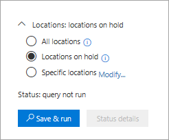
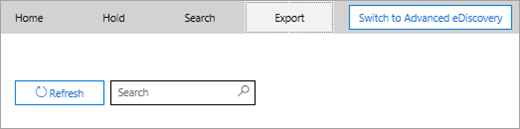

# <a name="ediscovery-cases-in-the-office-365-security-amp-compliance-center"></a>casos de exhibición de documentos electrónicos en la seguridad de Office 365 &amp; centro de cumplimiento

Puede usar los casos de exhibición de documentos electrónicos en la seguridad de Office 365 &amp; centro de cumplimiento para controlar quién puede crear, obtener acceso y administrar casos de exhibición de documentos electrónicos en su organización. Si su organización tiene una suscripción a Office 365 E5, también puede usar los casos de exhibición de documentos electrónicos para analizar los resultados de búsqueda mediante el uso de exhibición de documentos electrónicos avanzada de Office 365.
  
Un caso de exhibición de documentos electrónicos le permite agregar a miembros a un caso, controlar qué tipos de acciones que pueden realizar, colocar una suspensión en ubicaciones de contenido relevante para un caso legal y asociar varias búsquedas de contenido con un único caso miembros específicos de mayúsculas y minúsculas. También puede exportar los resultados de cualquier búsqueda de contenido que está asociada con un caso o preparar los resultados de búsqueda para el análisis de exhibición de documentos electrónicos avanzada. casos de exhibición de documentos electrónicos son una buena manera de limitar quién tiene acceso a las búsquedas de contenido y los resultados de búsqueda para un caso legal específico en su organización.
  
Use el siguiente flujo de trabajo para configurar y usar los casos de exhibición de documentos electrónicos en la seguridad &amp; centro de cumplimiento y opciones avanzadas de exhibición de documentos electrónicos.

[Paso 1: Asignar permisos de exhibición de documentos electrónicos a posibles miembros del caso](#step-1-assign-ediscovery-permissions-to-potential-case-members)

[Paso 2: Crear un nuevo caso](#step-2-create-a-new-case)

[Paso 3: Agregar a miembros a un caso](#step-3-add-members-to-a-case)

[Paso 4: Lugar ubicaciones de contenido en espera](#step-4-place-content-locations-on-hold)

[Paso 5: Crear y ejecutar una búsqueda de contenido asociados con un caso](#step-5-create-and-run-a-content-search-associated-with-a-case)

[Paso 6: Exportar los resultados de una búsqueda de contenido asociados con un caso](#step-6-export-the-results-of-a-content-search-associated-with-a-case)

[Paso 7: Preparar los resultados de la exhibición de documentos electrónicos avanzada de búsqueda](#step-7-prepare-search-results-for-advanced-ediscovery)

[Paso 8: Vaya al caso de exhibición de documentos electrónicos avanzada](#step-8-go-to-the-case-in-advanced-ediscovery)

[(Opcional) Paso 9: Cerrar un caso](#optional-step-9-close-a-case)

[(Opcional) Paso 10: Volver a abrir un caso cerrado](#optional-step-10-re-open-a-closed-case)

[Más información](#more-information)
  
## <a name="step-1-assign-ediscovery-permissions-to-potential-case-members"></a>Paso 1: Asignar permisos de exhibición de documentos electrónicos a posibles miembros del caso

El primer paso es asignar los permisos adecuados relacionados con la exhibición de documentos electrónicos a las personas para que pueda agregar a un caso de exhibición de documentos electrónicos en el paso 2. Tiene que ser un miembro del grupo de roles de administración de la organización (o tener asignado el rol de administración de funciones) en la seguridad de Office 365 &amp; centro de cumplimiento para asignar permisos de exhibición de documentos electrónicos. La siguiente lista describe los grupos de funciones relacionadas con la exhibición de documentos electrónicos en la seguridad &amp; centro de cumplimiento. 
  
- **Revisor** - este grupo de funciones tiene los permisos más restrictivos relacionadas con la exhibición de documentos electrónicos. Es el propósito principal de este grupo de funciones permitir que los miembros de la vista y acceso a datos en Office 365 avanzada exhibición de documentos electrónicos de casos. Los miembros de este grupo sólo pueden ver y abrir la lista de los casos en la página de **exhibición de documentos electrónicos** en la seguridad &amp; centro de cumplimiento que son miembros de. Después de que el usuario obtiene acceso a un caso en el centro de cumplimiento de seguridad &, pueden hacer clic en **conmutador de exhibición de documentos electrónicos avanzada** para tener acceso y analizar los datos de escenario de exhibición de documentos electrónicos avanzada. No pueden crear casos, agregar miembros a un caso, crear suspensiones, crear búsquedas, obtener una vista previa de los resultados de búsqueda, exportar los resultados de búsqueda o preparar los resultados de la exhibición de documentos electrónicos avanzadas. 
    
- **exhibición de documentos electrónicos Manager** - los miembros de este grupo de funciones puede crear y administrar casos de exhibición de documentos electrónicos. Puede agregar y quitar a miembros, colocar contenido ubicaciones en espera, crean y edición las búsquedas de contenido asociados con un caso, exportación los resultados de una búsqueda de contenido y preparar los resultados de búsqueda para el análisis de exhibición de documentos electrónicos avanzada. Existen dos subgrupos en este grupo de funciones. La diferencia entre estos subgrupos se basa en el ámbito.
    
  - **exhibición de documentos electrónicos Manager** - puede ver y administrar los casos de exhibición de documentos electrónicos que creen o están un miembro de. Si exhibición de documentos electrónicos otro administrador crea un caso, pero no agrega una segunda eDiscovery Manager como un miembro de ese caso, la segunda eDiscovery Manager no podrá ver o abrir el caso en la página de **exhibición de documentos electrónicos** en la seguridad &amp; centro de cumplimiento. exhibición de documentos electrónicos los administradores también puede tener acceso a sus casos de exhibición de documentos electrónicos avanzada para llevar a cabo tareas de análisis. 
    
  - **exhibición de documentos electrónicos administrador** - puede realizar todas las tareas de administración de casos que puede realizar un administrador de exhibición de documentos electrónicos. Además, un administrador de exhibición de documentos electrónicos puede:
    
    - Ver todos los casos que se enumeran en la página **Exhibición de documentos electrónicos**. 
    
    - Administrar cualquier caso de la organización después de agregarse ellos mismos como un miembro de las mayúsculas y minúsculas.
    
    - Acceso a datos de mayúsculas y minúsculas en Avanzadas exhibición de documentos electrónicos para cualquier caso en la organización.
    
    Consulte la sección [More information](#more-information) para saber por qué quizás quiera tener un administrador de exhibición de documentos electrónicos en su organización. 
    
> [!IMPORTANT]
> Si una persona no es un miembro de uno de estos grupos de funciones relacionadas con la exhibición de documentos electrónicos, o no es un miembro de un grupo de roles que ha asignado el rol de revisor, no puede agregarlos como un miembro de un caso de exhibición de documentos electrónicos. 

Para obtener más información acerca de los permisos de exhibición de documentos electrónicos, vea [asignar permisos de exhibición de documentos electrónicos en la seguridad de Office 365 &amp; centro de cumplimiento](assign-ediscovery-permissions.md).
  
 **Para asignar permisos de exhibición de documentos electrónicos:**
  
1. Vaya a [https://protection.office.com](https://protection.office.com).
    
2. Inicie sesión en Office 365 con su cuenta profesional o educativa.
    
3. En la seguridad &amp; centro de cumplimiento, haga clic en **permisos**y, a continuación, realice uno de los siguientes en función de la que desea asignar permisos de exhibición de documentos electrónicos.
    
    - Para asignar permisos de revisor, seleccione el grupo de roles de **revisor** y, a continuación, junto a **los miembros**, haga clic en **Editar**. Haga clic en **Seleccionar miembros**, haga clic en **Editar**, haga clic en  **Agregar**, seleccione el usuario que desea agregar al grupo de funciones de revisor y, a continuación, haga clic en **Agregar**.
    
    - Para asignar permisos de administrador de exhibición de documentos electrónicos, seleccione el grupo de roles de **Administrador de exhibición de documentos** y, a continuación, junto a la **exhibición de documentos electrónicos Manager**, haga clic en **Editar**. Haga clic en **Elegir exhibición de documentos electrónicos Manager**, haga clic en **Editar**, haga clic en  ** agregar **, seleccione el usuario que desea agregar como un administrador de exhibición de documentos electrónicos y, a continuación, haga clic en **Agregar**.
    
    - Para asignar permisos de administrador de exhibición de documentos electrónicos, seleccione el grupo de roles de **Administrador de exhibición de documentos** y, a continuación, junto a la **exhibición de documentos electrónicos administrador**, haga clic en **Editar**. Haga clic en **Elegir exhibición de documentos electrónicos administrador**, haga clic en **Editar**, haga clic en  **Agregar**, seleccione el usuario que desea agregar como un administrador de exhibición de documentos electrónicos y, a continuación, haga clic en **Agregar**.
    
4. Una vez que haya agregado todos los usuarios, haga clic en **Listo**, haga clic en **Guardar** para guardar los cambios en el grupo de roles y, a continuación, haga clic en **Cerrar**.

## <a name="step-2-create-a-new-case"></a>Paso 2: Crear un nuevo caso

El siguiente paso es crear un nuevo caso de exhibición de documentos electrónicos. Debe ser miembro del grupo de roles de administradores de exhibición de documentos electrónicos para crear casos de exhibición de documentos electrónicos. Como ya se explica, después de crear un nuevo caso de la seguridad &amp; centro de cumplimiento, usted (y otros miembros de mayúsculas y minúsculas) será capaz de acceso que el mismo caso de eDiscovery avanzada si es la organización tiene una suscripción a Office 365 E5.
  
1. Vaya a [https://protection.office.com](https://protection.office.com).
    
2. Inicie sesión en Office 365 con su cuenta profesional o educativa.
    
3. En la seguridad &amp; centro de cumplimiento, haga clic en **búsqueda &amp; investigación** \> **exhibición de documentos electrónicos**y, a continuación, haga clic en  **crear un caso**.
    
4. En la página **Nuevo caso** , asigne un nombre a las mayúsculas y minúsculas, escriba una descripción opcional y, a continuación, haga clic en **Guardar**. Tenga en cuenta que el nombre del caso debe ser único en la organización.
    
    
  
    El nuevo caso se muestra en la lista de los casos en la página de **exhibición de documentos electrónicos** . Tenga en cuenta que puede mover el cursor por encima de un nombre de mayúsculas y minúsculas para mostrar información sobre el caso, incluido el estado del caso ( **activo** o **cerrado**), la descripción del caso (que se creó en el paso anterior), y el caso de que se modificó por última vez y quién los ha cambiado.
    
    > [!TIP]
    > Después de crear un nuevo caso, puede cambiar en cualquier momento. Haga clic en el nombre del caso en la página de **exhibición de documentos electrónicos** . En la página de emergente **administrar este caso** , cambiar el nombre mostrado en el cuadro en **nombre**y, a continuación, guardar el cambio. 
  
## <a name="step-3-add-members-to-a-case"></a>Paso 3: Agregar a miembros a un caso

Después de crear un nuevo caso, el siguiente paso es agregar a miembros a las mayúsculas y minúsculas. Explica como anterior, sólo los usuarios que son miembros del revisor o grupos de roles de administrador de exhibición de documentos electrónicos se pueden agregar como miembros de las mayúsculas y minúsculas. Tenga en cuenta que el administrador que creó el caso de exhibición de documentos electrónicos se agrega automáticamente como un miembro.
  
1. En el Centro de seguridad y cumplimiento, haga clic en **Búsqueda e investigación** \> **eDiscovery** para mostrar la lista de casos en su organización. 
    
2. Haga clic en el nombre de la caja del que desea agregar a miembros a.
    
    Se muestra la página de la barra flotante de **administrar este caso** . 
    
    
  
3. En **miembros de administrar**, haga clic en  **Agregar** para agregar miembros a las mayúsculas y minúsculas. 
    
    También puede elegir agregar un grupo de roles a las mayúsculas y minúsculas. En **Administrar grupos de roles**, haga clic en  **Agregar**.
    
    > [!NOTE]
    > Control de grupos de funciones que puede asignar a miembros a un caso de exhibición de documentos electrónicos. Esto significa que sólo se pueden asignar a los grupos de funciones que son miembros de un caso.
    
4. En la lista de grupos de personas o rol que se pueden agregar como miembros de las mayúsculas y minúsculas, haga clic en la casilla de verificación junto a los nombres de los grupos de personas o rol que desea agregar.
    
    > [!TIP]
    > Si tiene una lista grande de personas que pueden agregadas como miembros, use el cuadro de **búsqueda** para buscar una persona específica en la lista. 
  
5. Después de seleccionar los grupos de personas o rol para agregar como miembros del grupo, haga clic en **Agregar**.
    
    En **este caso de administrar**, haga clic en **Guardar** para guardar la nueva lista de miembros de mayúsculas y minúsculas. 
    
6. Haga clic en **Guardar** para guardar la nueva lista de miembros de mayúsculas y minúsculas. 
  
## <a name="step-4-place-content-locations-on-hold"></a>Paso 4: Lugar ubicaciones de contenido en espera

Puede usar un caso de exhibición de documentos electrónicos para crear suspensiones para conservar el contenido que puede ser relevante para las mayúsculas y minúsculas. Puede colocar una suspensión en los buzones y OneDrive para sitios de profesionales de las personas que custodia en las mayúsculas y minúsculas. También puede colocar una suspensión en el buzón de correo de grupo, sitios de SharePoint y OneDrive para el sitio de negocio para un grupo de Office 365. De forma similar, puede colocar una suspensión en el sitio que están asociados con Microsoft Teams y buzón de correo. Al colocar las ubicaciones de contenido en espera, contenido se mantiene hasta que se quite la suspensión desde la ubicación del contenido o hasta que se elimine la suspensión.

> [!NOTE]
> Después de realizar una ubicación de contenido en espera, se tardan hasta 24 horas para la suspensión surta efecto. 
>   
Cuando se crea una suspensión, tiene las siguientes opciones para delimitar el contenido que se encuentra en las ubicaciones de contenido especificadas:
  
- Crear una suspensión infinita donde todo el contenido se pondrá en espera. Como alternativa, puede crear una suspensión basada en consultas donde sólo el contenido que coincide con una consulta de búsqueda se pondrá en espera.
    
- Puede especificar un intervalo de fechas para retener sólo el contenido que se ha enviado, recibido o crear dentro de ese intervalo de fechas. Como alternativa, puede contener todo el contenido, independientemente de cuando se ha enviado, recibido o creado.
    
> [!NOTE]
> Puede tener un máximo de 10.000 las directivas de retención a través de todos los casos de exhibición de documentos electrónicos en su organización. 
  
Para crear una suspensión para un caso de exhibición de documentos electrónicos:
  
1. En el Centro de seguridad y cumplimiento, haga clic en **Búsqueda e investigación** \> **eDiscovery** para mostrar la lista de casos en su organización. 
    
2. Junto al caso de que desee crear las suspensiones en, haga clic en **Abrir** . 
    
3. En la página **principal** para el caso, haga clic en la ficha de **suspensión** . 
    
    
  
4. En la página de **suspensión** , haga clic en  **crear**.
    
5. En la página **nombre de la suspensión** , asigne la suspensión un nombre. El nombre de la suspensión debe ser único en la organización. 
    
    
  
6. (Opcional) En el cuadro **Descripción** , agregue una descripción de la suspensión. 
    
7. Haga clic en **Siguiente**.
    
8. Elija las ubicaciones de contenido que desee poner en espera. Puede colocar los buzones de correo, sitios y las carpetas públicas en espera.
    
    
  
   r. **correo electrónico de Exchange** - haga clic en **Elegir usuarios, grupos o equipos** y, a continuación, haga clic en **Elegir usuarios, grupos o equipos de** nuevo. para especificar los buzones de correo para poner en espera. Use el cuadro de búsqueda para encontrar buzones de usuario y grupos de distribución (para colocar una suspensión en los buzones de correo de los miembros del grupo) a poner en espera. También puede colocar una suspensión en el buzón de correo asociado para un grupo de Office 365 o un Microsoft Team. Seleccione el usuario, el grupo, la casilla de verificación de equipo, haga clic en **Elegir**y, a continuación, haga clic en **Listo**.
    
    > [!NOTE]
    > Al hacer clic en **Elegir usuarios, grupos o equipos** para especificar los buzones de correo para poner en espera, el selector de buzón de correo que se muestra está vacío. Este comportamiento está diseñado para mejorar el rendimiento. Para agregar personas a esta lista, escriba un nombre (un mínimo de 3 caracteres) en el cuadro de búsqueda. 
  
   b. **Sitios de SharePoint** : haga clic en **Elegir sitios** y, a continuación, haga clic en **sitios de elija** nuevo para especificar SharePoint y OneDrive para sitios profesionales para poner en espera. Escriba la dirección URL para cada sitio que desee poner en espera. También puede agregar la dirección URL del sitio de SharePoint para un grupo de Office 365 o un Microsoft Team. Haga clic en **Elegir**y, a continuación, haga clic en **Listo**.
    
    Vea la sección [obtener más información](#more-information) para obtener sugerencias sobre la colocación de grupos de Office 365 y Microsoft Teams en espera. 
    
    > [!NOTE]
    > En el caso poco frecuente que se ha cambiado el nombre de entidad de seguridad de usuario (UPN) de una persona, también se cambiará la dirección URL de su cuenta de OneDrive para incorporar el UPN nuevo. En este caso, tendrá que modificar la suspensión mediante la adición OneDrive para la nueva dirección URL del usuario y eliminar la antigua. 
  
   c. **carpetas públicas de Exchange** , mueva el conmutador de alternancia  a la posición de **todos los** para colocar todas las carpetas públicas en la organización de Exchange Online en espera. Tenga en cuenta que no se puede elegir carpetas públicas específicas para poner espera. Deje el conmutador de alternancia establecido en **Ninguno** si no desea colocar una suspensión en las carpetas públicas.
    
9. Cuando haya terminado de agregar ubicaciones de contenido a la suspensión, haga clic en **siguiente**.
    
10. Para crear una suspensión basada en consultas con las condiciones, complete lo siguiente. De lo contrario, simplemente haga clic en **siguiente**
    
    
  
    
       r. en el cuadro **palabras clave**, tipo de una consulta de búsqueda en el cuadro de modo que sólo el contenido que cumpla los criterios de búsqueda se coloca en suspensión. Puede especificar las palabras clave, propiedades del mensaje o propiedades de documento, como los nombres de archivo. También puede utilizar las consultas más complejas que usan un operador booleano, como **AND**, **OR**o **no**. Si deja el cuadro de palabra clave vacía, a continuación, todo el contenido que se encuentra en las ubicaciones de contenido especificadas se pondrá en espera.
    
    b. Haga clic en  **condiciones de agregar** para agregar una o varias condiciones para restringir la consulta de búsqueda para la suspensión. Cada condición agrega una cláusula a la consulta de búsqueda de palabras clave que se crean y ejecutan cuando se crea la suspensión. Por ejemplo, se puede especificar un intervalo de fechas para que los documentos de correo electrónico o un sitio que se crearon en la fecha que se iban se colocan en espera. Una condición lógicamente está conectada a la consulta de palabras clave (especificada en el cuadro de palabra clave) por el operador **y** . Que significa que los elementos tienen para satisfacer la consulta de palabra clave y la condición que se va a colocar en suspensión.

    Para obtener más información sobre cómo crear una consulta de búsqueda y las condiciones de uso, vea [consultas de palabra clave y las condiciones de búsqueda para la búsqueda de contenido](keyword-queries-and-search-conditions.md).
    
11. Después de configurar basada en una consulta de suspensión, haga clic en **siguiente**.
    
12. Revise la configuración y, a continuación, haga clic en **crear esta suspensión**.
    
### <a name="hold-statistics"></a>Mantenga las estadísticas

Después de unos momentos, se muestra información acerca de la suspensión nuevo en el panel de detalles en la página **contiene** para la suspensión seleccionada. Esta información incluye el número de buzones de correo y sitios en mantenga y estadísticas sobre el contenido que se realizó en, como el número total y el tamaño de los elementos que se pondrá en espera y la última vez que la suspensión se calculaban estadísticas. Estos mantenga estadísticas le ayudarán a que identificar la cantidad de contenido que está relacionada con el caso de exhibición de documentos electrónicos se encuentra. 
  

  
Tenga en cuenta acerca de las estadísticas de espera lo siguiente:
  
- El número total de elementos en espera indica el número de elementos de todos los orígenes de contenido que se colocan en espera. Si ha creado una consulta retención basada en, esta estadística indica el número de elementos que coinciden con la consulta.
    
- El número de elementos en espera también incluye sin indizar los elementos que se encuentran en las ubicaciones de contenido. Tenga en cuenta que si crea una suspensión basada en consultas, todos los elementos no indizados en las ubicaciones de contenido se colocan en espera. Esto incluye elementos sin indizar que no coincidan con los criterios de búsqueda de una suspensión basada en consultas y no indizados que es posible que quedan fuera de una condición de intervalo de fecha. Esto es diferente de lo que sucede cuando se ejecuta una búsqueda de contenido, en la que sin indizar los elementos que no coinciden con la consulta de búsqueda o se excluyen por una condición de intervalo de fecha no se incluyen en los resultados de búsqueda. Para obtener más información acerca de los elementos sin indizar, consulte [parcialmente indizar los elementos de búsqueda de contenido en Office 365](partially-indexed-items-in-content-search.md).
    
- Puede obtener el último mantenga estadísticas haciendo clic en **Actualizar estadísticas** para volver a ejecutar una búsqueda estimación que calcula el número actual de elementos en suspensión. Si es necesario, haga clic en **Actualizar** en la barra de herramientas para actualizar las estadísticas de espera en el panel de detalles. 
    
- Es normal para el número de elementos en suspensión a aumentar con el tiempo debido a que los usuarios cuyos buzones de correo o el sitio se encuentra en suspensión normalmente se enviar o recibir nuevo mensaje de correo electrónico y creación de SharePoint nueva y OneDrive para documentos empresariales.
    
> [!NOTE]
> Si se mueve una cuenta de OneDrive o un sitio de SharePoint a una región diferente en un entorno de multi-ubican, las estadísticas de ese sitio no se incluirán en las estadísticas de espera. Sin embargo, el contenido del sitio aún estará en espera. Además, si un sitio se mueve a una región diferente no se actualizarán a la dirección URL que se muestra en la suspensión. Debe editar la suspensión y actualice la dirección URL. 
  
## <a name="step-5-create-and-run-a-content-search-associated-with-a-case"></a>Paso 5: Crear y ejecutar una búsqueda de contenido asociados con un caso

Después de crea un caso de exhibición de documentos electrónicos y cualquier custodia relacionadas con el caso se coloca en espera, puede crear y ejecutar una o varias búsquedas de contenido que están asociadas con las mayúsculas y minúsculas. Contenido de las búsquedas de asociarse a un caso no se enumeran en la página de **búsqueda** en la seguridad &amp; centro de cumplimiento. Esto significa que las búsquedas de contenido asociadas con un caso sólo se puede tener acceso por los miembros de mayúsculas y minúsculas que también son miembros del grupo de roles de administrador de exhibición de documentos electrónicos. 
  
1. En el Centro de seguridad y cumplimiento, haga clic en **Búsqueda e investigación** \> **eDiscovery** para mostrar la lista de casos en su organización. 
    
2. Junto al caso de que se desea crear una búsqueda de contenido en, haga clic en **Abrir** . 
    
3. En la página **principal** para el caso, haga clic en la ficha de **búsqueda** . 
    
    
  
4. En la página de **búsqueda** , haga clic en  **nueva búsqueda**. 
    
5. En la página **Nueva búsqueda**, puede agregar palabras clave y condiciones para crear la consulta de búsqueda. 
    
    
  
6. Puede especificar las palabras clave, mensaje propiedades, como enviado y recibido fechas, o las propiedades del documento, como los nombres de archivo o la fecha en que se modificó por última vez un documento. Puede utilizar las consultas más complejas que usan un operador booleano, como **AND**, **o**, **no**, **NEAR**o **ONEAR**. También puede buscar información confidencial (como números de la seguridad social) en los documentos o buscar documentos que se han compartido externamente. Si deja vacío el cuadro de palabra clave, todo el contenido que se encuentra en las ubicaciones de contenido especificadas se incluirán en los resultados de búsqueda. 
    
7. Puede hacer clic en la casilla de verificación **Mostrar la lista de palabras clave** y el tipo de una palabra clave en cada fila. Si lo hace, las palabras clave en cada fila están conectadas por el operador **o** en la consulta de búsqueda que se crea. 
    
    
  
    ¿Por qué usar la lista de palabras clave? Puede obtener estadísticas que muestran cuántos elementos coinciden con cada palabra clave. Esto puede ayudarle a identificar rápidamente las palabras clave son los más (y menos) eficaces. También puede usar una frase de palabras clave (entre paréntesis) en una fila. Para obtener más información acerca de las estadísticas de búsqueda, vea [Ver las estadísticas de palabra clave para los resultados de la búsqueda de contenido](view-keyword-statistics-for-content-search.md).
    
    Para obtener más información acerca del uso de la lista de palabras clave, vea [creación de una consulta de búsqueda](content-search.md#building-a-search-query).
    
8. En **condiciones**, agregar condiciones a una consulta de búsqueda para restringir una búsqueda y devolver un conjunto de resultados más refinado. Cada condición agrega una cláusula a la consulta de búsqueda de palabras clave que se crean y ejecutan cuando se inicia la búsqueda. Una condición lógicamente está conectada a la consulta de palabras clave (especificada en el cuadro de palabra clave) por el operador **y** . Esto significa que los elementos tengan que satisfacer la consulta de palabra clave y la condición que se deben incluir en los resultados. Se trata de cómo ayudar a condiciones para limitar los resultados. 
    
    Para obtener más información sobre cómo crear una consulta de búsqueda y el uso de las condiciones, consulte [Keyword queries for Content Search](keyword-queries-and-search-conditions.md).
    
9. Bajo **ubicaciones: las ubicaciones en espera**, elija las ubicaciones de contenido que se va a buscar. Puede buscar los buzones de correo, sitios y las carpetas públicas en la misma búsqueda.
    
    
  
    - **Todas las ubicaciones** : seleccione esta opción para buscar todas las ubicaciones de contenido en su organización. Cuando se selecciona esta opción, puede elegir buscar todos los buzones de Exchange (que incluye los buzones de correo para todos los grupos de Office 365 y Microsoft Teams), todos los SharePoint y OneDrive para sitios profesionales (que incluye los sitios para todos los grupos de Office 365 y Microsoft Los equipos) y todas las carpetas públicas.
    
    - **Que todas las ubicaciones de suspensión** - Seleccione esta opción para buscar todas las ubicaciones de contenido que se han colocado en suspensión en el caso. Si las mayúsculas y minúsculas contiene varias suspensiones, el contenido que se buscará en las ubicaciones de todas las suspensiones cuando se selecciona esta opción. Además, si se realizó una ubicación de contenido en una espera basada en consultas, se buscarán sólo los elementos que están en espera cuando se ejecuta la búsqueda de contenido que se está creando en este paso. Por ejemplo, si un usuario se coloca en suspensión de mayúsculas y minúsculas basada en consultas que conserva los elementos que se envían o se crearon antes de una fecha específica, se podrían buscar sólo los elementos mediante los criterios de búsqueda de la búsqueda de contenido. Esto se logra mediante la conexión de la consulta de suspensión de mayúsculas y minúsculas y la consulta de búsqueda de contenido mediante un operador **AND** . Vea la sección [obtener más información](ediscovery-cases.md#moreinfo_1) al final de este artículo para obtener más información acerca de la búsqueda de contenido de mayúsculas y minúsculas. 
    
    - **Ubicaciones específicas** : seleccione esta opción para seleccionar los buzones y los sitios que desea buscar. Cuando seleccione esta opción y haga clic en **Modificar**, aparece una lista de ubicaciones. Puede elegir buscar cualquier o todos los usuarios, grupos, equipos o ubicaciones de sitio.
    
      
  
      También puede elegir buscar todas las carpetas públicas en la organización, pero si selecciona esta opción y busca en cualquier ubicación del contenido que se encuentra en suspensión, cualquier consulta de una suspensión de mayúsculas y minúsculas basada en consultas no se aplicarán a la consulta de búsqueda. En otras palabras, se busca en todo el contenido en una ubicación, no sólo el contenido que se mantiene por una suspensión de mayúsculas y minúsculas basada en consultas.
    
      Puede quitar las ubicaciones de contenido mayúsculas rellenadas previamente o agregar otros nuevos. Si elige esta opción, también tiene flexibilidad para buscar todas las ubicaciones de contenido para un servicio específico (por ejemplo, para buscar todos los buzones de Exchange) o puede buscar las ubicaciones de contenido específicas para un servicio. También puede elegir si desea buscar en las carpetas públicas en la organización o no.
    
      Mantener estas cosas en cuenta al agregar ubicaciones de contenido para buscar:
    
      - Al hacer clic en **Elegir usuarios, grupos o equipos** para especificar los buzones de correo de búsqueda, el selector de buzón de correo que se muestra está vacío. Este comportamiento está diseñado para mejorar el rendimiento. Para agregar a destinatarios a esta lista, haga clic en **Elegir usuarios, grupos o equipos**, escriba un nombre (un mínimo de 3 caracteres) en el cuadro de búsqueda, active la casilla de verificación situada junto al nombre y, a continuación, haga clic en **Elegir**. 
    
      - Puede agregar buzones inactivos, grupos de Office 365, Microsoft Teams y grupos de distribución a la lista de buzones de correo a buscar. No se admiten grupos de distribución dinámica. Si agrega grupos de Office 365 o Teams de Microsoft, se busca en el buzón de grupo o equipo; no se buscan en los buzones de correo de los miembros del grupo.
    
      - Para agregar sitios haga clic en **Elija sitios**, haga clic en **Elija sitios** de nuevo y, a continuación, escriban la dirección URL para cada sitio que se va a buscar. También puede agregar la dirección URL del sitio de SharePoint para grupos de Office 365 y Microsoft Teams. 
    
10. Después de seleccionar las ubicaciones de contenido de búsqueda, haga clic en **Listo** y, a continuación, haga clic en **Guardar**.
    
11. En la página **nueva búsqueda** , haga clic en **Guardar** y, a continuación, escriba un nombre para la búsqueda. Búsquedas de contenido asociadas con un caso deben tener nombres que son únicos dentro de la organización de Office 365. 
    
12. Haga clic en **Guardar &amp; ejecutar** para guardar la configuración de búsqueda. 
    
13. Escriba un nombre único para la búsqueda y haga clic en **Guardar** para iniciar la búsqueda. 
    
    Comienza la búsqueda. Después de unos momentos, se muestra una estimación de los resultados de búsqueda en el panel de detalles. La estimación incluye el tamaño total y el número de elementos que coinciden con los criterios de búsqueda. La estimación de búsqueda también incluye el número de elementos sin indizar en las ubicaciones de contenido que se desea buscar. El número de elementos sin indizar que no cumplen con los criterios de búsqueda se incluirá en las estadísticas de búsqueda que se muestran en el panel de detalles. Si un elemento sin indizar las coincidencias de la búsqueda de consulta (debido a que otras propiedades de mensaje o el documento cumple con los criterios de búsqueda), no se incluirán en el número estimado de elementos sin indizar. Si se excluye un elemento sin indizar por los criterios de búsqueda, también no se incluirán en la estimación de los elementos sin indizar.
    
  Una vez finalizada la búsqueda, puede obtener una vista previa de los resultados de búsqueda. Si es necesario, haga clic en **Actualizar** para actualizar la información en el panel de detalles. 
    
## <a name="step-6-export-the-results-of-a-content-search-associated-with-a-case"></a>Paso 6: Exportar los resultados de una búsqueda de contenido asociados con un caso

Después de ejecuta correctamente una búsqueda, puede exportar los resultados de búsqueda. Al exportar los resultados de búsqueda, se descargan los elementos del buzón en los archivos PST o como los mensajes individuales. Al exportar contenido de SharePoint y OneDrive para sitios de negocio, se exportan copias de los documentos de Office nativos y otros documentos. También se exporta un archivo de manifiesto (en formato XML) que contiene información acerca de cada resultado de búsqueda.
  
Puede exportar los resultados de una [exportación de los resultados de una búsqueda único asociado con un caso](ediscovery-cases.md#singlesearch_1) o puede exportar los resultados de [exportar los resultados de varias búsquedas asociadas a un caso](ediscovery-cases.md#multiplesearches_1).
  
### <a name="export-the-results-of-a-single-search-associated-with-a-case"></a>Exportar los resultados de una búsqueda único asociado a un caso

1. En el Centro de seguridad y cumplimiento, haga clic en **Búsqueda e investigación** \> **eDiscovery** para mostrar la lista de casos en su organización. 
    
2. Junto al caso de que se va a exportar la búsqueda desde, haga clic en **Abrir** . 
    
3. En la página **principal** para el caso, haga clic en **Buscar**.
    
4. En la lista de búsquedas para las mayúsculas y minúsculas, haga clic en la búsqueda que desea exportar los resultados de búsqueda, haga clic en  **más**y, a continuación, seleccione **los resultados de la exportación** de la lista desplegable. 
    
    Se abrirá la página **exportar los resultados** . 
    
    
  
    El flujo de trabajo para exportar los resultados de una búsqueda de contenido asociados con un caso es la misma exportar los resultados de búsqueda para una búsqueda en la página de **búsqueda de contenido** . Para obtener instrucciones detalladas, consulte [de resultados de búsqueda de contenido de exportación de la seguridad de Office 365 &amp; centro de cumplimiento](export-search-results.md).
    
    > [!NOTE]
    > Al exportar los resultados de búsqueda, tiene la opción de habilitar la desduplicación para que se exporta sólo una copia de un mensaje de correo electrónico, aunque podrían haber encontrado varias instancias del mismo mensaje en los buzones de correo que se desea buscar. Para obtener más información acerca de la desduplicación y los elementos duplicados cómo se identifican, vea [la desduplicación en los resultados de búsqueda de exhibición de documentos electrónicos](de-duplication-in-ediscovery-search-results.md). 
  
5. Haga clic en la ficha **Exportar** para mostrar la lista de trabajos de exportación que existen para ese caso. 
    
    
  
    Es posible que deba haga clic en **Actualizar** para actualizar la lista de trabajos de exportación para que se muestre el trabajo de exportación que acaba de crear. Tenga en cuenta que los trabajos de exportación tienen el mismo nombre que el contenido correspondiente de búsqueda con **_Export** anexado al final del nombre de la búsqueda. 
    
6. Haga clic en el trabajo de exportación que acaba de crear para mostrar información de estado en el panel de detalles. Esta información incluye el porcentaje de los elementos que se han transferido a un área de almacenamiento de Azure en la nube de Microsoft.
    
    Una vez que se han transferido todos los elementos, haga clic en **descargar los resultados** para descargar los resultados de búsqueda en el equipo local. Para obtener más información, vea el paso 2 en [resultados de búsqueda de contenido de exportación de la seguridad de Office 365 &amp; centro de cumplimiento](export-search-results.md)
    
### <a name="export-the-results-of-multiple-searches-associated-with-a-case"></a>Exportar los resultados de varias búsquedas asociados con un caso

Como alternativa a la exportación de los resultados de una búsqueda de contenido único asociado a un caso, puede exportar los resultados de varias búsquedas desde el mismo caso en una sola exportación. Exportar los resultados de varias búsquedas es más rápido y fácil que la exportación de la búsqueda de uno de los resultados a la vez.
  
> [!NOTE]
> No se puede exportar los resultados de varias búsquedas si una de las búsquedas se configuró para buscar en todo el contenido de mayúsculas y minúsculas. exportar sólo los resultados de varias búsquedas para las búsquedas que están asociadas con un caso de exhibición de documentos electrónicos. No se puede exportar los resultados de varias búsquedas que aparecen en la página de **búsqueda de contenido** en la seguridad &amp; centro de cumplimiento. 
  
1. En el Centro de seguridad y cumplimiento, haga clic en **Búsqueda e investigación** \> **eDiscovery** para mostrar la lista de casos en su organización. 
    
2. Junto al caso de que se va a exportar los resultados de búsqueda, haga clic en **Abrir** . 
    
3. En la página **principal** para el caso, haga clic en **Buscar**.
    
4. En la lista de búsquedas para el caso de, seleccione dos o más las búsquedas en la que se va a exportar los resultados de búsqueda.
    
    > [!NOTE]
    > Para seleccionar varias búsquedas, presione la tecla Ctrl mientras hace clic en cada búsqueda. O bien, puede seleccionar varias búsquedas adyacentes al hacer clic en la primera búsqueda, mantenga presionada la tecla MAYÚS, y, a continuación, haciendo clic en la última búsqueda. 
  
5. Después de seleccionar las búsquedas, aparece la página **acciones masivas** . 
    
    
  
    
6. Haga clic en  **exportar los resultados**.

7. En la página **exportar los resultados** , dé un nombre único de la exportación, seleccione las opciones de salida y elija cómo se van a exportar el contenido. Haga clic en **Exportar**.
    
    El flujo de trabajo para exportar los resultados de varias búsquedas de contenido asociadas con un caso es el mismo que exportar los resultados de búsqueda para una sola búsqueda. Para obtener instrucciones detalladas, consulte [de resultados de búsqueda de contenido de exportación de la seguridad de Office 365 &amp; centro de cumplimiento](export-search-results.md).
    
    > [!NOTE]
    > Al exportar los resultados de búsqueda de varias búsquedas asociadas con un caso, también tiene la opción para habilitar la desduplicación para que se exporta sólo una copia de un mensaje de correo electrónico, aunque es posible que se han encontrado a varias instancias del mismo mensaje en la buzones de correo que se va a buscar en una o varias de las búsquedas. Para obtener más información acerca de la desduplicación y los elementos duplicados cómo se identifican, vea [la desduplicación en los resultados de búsqueda de exhibición de documentos electrónicos](de-duplication-in-ediscovery-search-results.md). 
  
8. Después de iniciar la exportación, haga clic en la ficha **Exportar** para mostrar la lista de trabajos de exportación para ese caso. 
    
    
  
    Es posible que deba haga clic en **Actualizar**  para actualizar la lista de trabajos de exportación para mostrar el trabajo de exportación que acaba de crear. Tenga en cuenta que las búsquedas que se incluyeron en el trabajo de exportación se enumeran en la columna de **búsquedas** . 
    
8. Haga clic en el trabajo de exportación que acaba de crear para mostrar información de estado en el panel de detalles. Esta información incluye el porcentaje de los elementos que se han transferido a un área de almacenamiento de Azure en la nube de Microsoft.
    
9. Una vez que se han transferido todos los elementos, haga clic en **descargar los resultados** para descargar los resultados de búsqueda en el equipo local. Para obtener más información, vea el paso 2 en [resultados de búsqueda de exportación de la seguridad de Office 365 &amp; centro de cumplimiento](export-search-results.md)
    
#### <a name="more-information-about-exporting-the-results-of-multiple-searches"></a>Para obtener más información acerca de cómo exportar los resultados de varias búsquedas

- Al exportar los resultados de búsquedas múltiples, las consultas de búsqueda de todas las búsquedas se combinan mediante operadores **o** y, a continuación, se inicia la búsqueda combinada. Los resultados de la búsqueda combinada estimados se muestran en el panel de detalles de la tarea de exportación seleccionado. Los resultados de búsqueda, a continuación, se transfieren al área de almacenamiento de Azure en la nube de Microsoft. El estado de la transferencia también se muestra en el panel de detalles. Como se señaló anteriormente, una vez que se han transferido todos los resultados de búsqueda, puede descargarlos en el equipo local. 
    
- El número máximo de palabras clave de las consultas de búsqueda para todas las búsquedas que se desean exportar es 500. (Esto es el mismo límite para una sola búsqueda de contenido). Esto es debido a que el trabajo de exportación combina todas las consultas de búsqueda mediante el operador **o** . Si se excede este límite, se devolverá un error. En este caso, tendrá que exportar los resultados de las búsquedas menos o simplificar las consultas de búsqueda de las búsquedas que se va a exportar. 
    
- Los resultados de búsqueda que se exportan se organizan por el elemento se encontró en el origen de contenido. Eso significa que un origen de contenido en los resultados de la exportación puede tener elementos devueltos por las búsquedas diferentes. Por ejemplo, si ha elegido exportar mensajes de correo electrónico en un archivo PST para cada buzón de correo, el archivo PST puede tener los resultados de varias búsquedas.
    
- Si se devuelve el mismo elemento de correo electrónico o un documento desde la misma ubicación de contenido por más de una de las búsquedas que exportar, se exportarán sólo una copia del elemento.
    
- No se puede editar una exportación de varias búsquedas después de crearla. Por ejemplo, no se puede agregar o quitar las búsquedas de la exportación. Tendrá que crear un nuevo trabajo de exportación para cambiar los resultados de la búsqueda se exportan. Una vez creado un trabajo de exportación, solo puede descargar los resultados en un equipo, reinicie la exportación o elimine el trabajo de exportación.
    
- Si reinicia la exportación, los cambios realizados en las consultas de las búsquedas que componen el trabajo de exportación no afectará a los resultados de búsqueda que se va a recuperar. Cuando se reinicia una exportación, las mismas funciones de consulta de búsqueda combinada que se ejecutan cuando se creó el trabajo de exportación volverá a ejecutar.
    
- Si reinicia una exportación desde la página de **las exportaciones** en un caso de exhibición de documentos electrónicos, los resultados de búsqueda que se transfieren al área de almacenamiento de Azure sobrescribirán los resultados anteriores; los resultados anteriores se han producido transfiere no estará disponible para ser descargado. 
    
- Preparación de los resultados de varias búsquedas para el análisis de exhibición de documentos electrónicos avanzada no está disponible. Sólo puede preparar los resultados de una búsqueda único para el análisis de exhibición de documentos electrónicos avanzada.

## <a name="step-7-prepare-search-results-for-advanced-ediscovery"></a>Paso 7: Preparar los resultados de la exhibición de documentos electrónicos avanzada de búsqueda

Si su organización tiene una suscripción a Office 365 E5, puede preparar los resultados de búsquedas de contenido asociado a un caso para el análisis de exhibición de documentos electrónicos avanzada. Después de preparar los resultados de búsqueda, puede ir a la exhibición de documentos electrónicos avanzada (vea [paso 8: vaya al caso de exhibición de documentos electrónicos avanzada](#step-8-go-to-the-case-in-advanced-ediscovery)) y procesar los datos de resultados de búsqueda para un análisis posterior en la exhibición de documentos electrónicos avanzada.
  
Al preparar los resultados de búsqueda para la exhibición de documentos electrónicos avanzada, funcionalidad de reconocimiento óptico de caracteres (OCR) extrae automáticamente el texto de las imágenes. Reconocimiento óptico de caracteres es compatible con archivos sueltos, datos adjuntos de correo electrónico e imágenes incrustadas. Esto permite aplicar las capacidades de texto analítico de eDiscovery avanzada (cerca de duplicados, subprocesos de correo electrónico, los temas y codificación predictivo) a cualquier texto en los archivos de imagen.
  
> [!NOTE]
> Para analizar los datos de un usuario mediante la exhibición de documentos electrónicos avanzada, el usuario (la custodia de los datos) debe estar asignado una licencia de Office 365 E5. Como alternativa, se pueden asignar una licencia independiente de exhibición de documentos electrónicos avanzada a los usuarios con una licencia de Office 365 E1 o E3. Los administradores y responsables del cumplimiento normativo que se asignan a los casos y utilizan eDiscovery avanzada para analizar datos no necesitan una licencia de E5. 
  
1. En el Centro de seguridad y cumplimiento, haga clic en **Búsqueda e investigación** \> **eDiscovery** para mostrar la lista de casos en su organización. 
    
2. Junto al caso de que se va a preparar los resultados de búsqueda para el análisis de exhibición de documentos electrónicos avanzada, haga clic en **Abrir** . 
    
3. En la página **principal** para el caso, haga clic en **Buscar**y, a continuación, seleccione la búsqueda.
    
4. En el panel de detalles, haga clic en  **más**y, a continuación, haga clic en **la preparación de exhibición de documentos electrónicos avanzada**.
    
    
  
5. En la página de **la preparación de exhibición de documentos electrónicos avanzada** , elija Preparar una de las siguientes: 
    
    - Todos los artículos, excepto aquellos con formato no reconocido, se cifran o no estaban indizados por otras razones.
    
    - Todos los elementos, los que no se ha reconoce el formato, incluidos se cifran o no estaban indizados por otras razones.
    
    - Sólo los elementos que tienen un formato no reconoce, se cifran o no estaban indizados por otras razones.
    
6. (Opcional) Haga clic en la casilla de verificación **incluir versiones de archivos de SharePoint** . 
    
7. Haga clic en **Preparar**.
    
    Los resultados de búsqueda estén preparados para análisis con avanzadas exhibición de documentos electrónicos.
    
8. Haga clic en **Cerrar** para cerrar el panel de detalles. 
    
## <a name="step-8-go-to-the-case-in-advanced-ediscovery"></a>Paso 8: Vaya al caso de exhibición de documentos electrónicos avanzada

Después de crear un caso de la seguridad &amp; centro de cumplimiento, puede ir al mismo caso de exhibición de documentos electrónicos avanzada.
  
Para ir a un caso en eDiscovery avanzado:
  
1. En el Centro de seguridad y cumplimiento, haga clic en **Búsqueda e investigación** \> **eDiscovery** para mostrar la lista de casos en su organización. 
    
2. Junto al caso de que se desea ir a en la exhibición de documentos electrónicos avanzada, haga clic en **Abrir** . 
    
3. En la página **principal** para el caso, haga clic en **cambiar para exhibición de documentos electrónicos avanzada**.
    
    
  
    Se muestra la barra de progreso **que se conectan a la exhibición de documentos electrónicos avanzada** . Cuando está conectado a la exhibición de documentos electrónicos avanzada, se muestra una lista de contenedores en la página. 
    
    
  
    Estos contenedores representan los resultados de búsqueda que ha preparado para el análisis de exhibición de documentos electrónicos avanzada en el paso 7. Tenga en cuenta que el nombre del contenedor tiene el mismo nombre que la búsqueda de contenido en el caso de la seguridad &amp; centro de cumplimiento. Los contenedores de la lista son los que ha preparado. Si un usuario diferente preparado los resultados de búsqueda de exhibición de documentos electrónicos avanzada, los contenedores correspondientes no se incluirán en la lista.
    
4. Para cargar los datos de resultados de búsqueda de un contenedor para el caso de exhibición de documentos electrónicos avanzada, seleccione un contenedor y haga clic en **proceso**.
    
    Para obtener información acerca de cómo los contenedores de proceso, vea [ejecuta el módulo de proceso y carga de datos en Office 365 avanzada exhibición de documentos electrónicos](run-the-process-module-and-load-data-in-advanced-ediscovery.md).
    
> [!TIP]
> Haga clic en **cambiar a la exhibición de documentos electrónicos** para volver a las mismas mayúsculas y minúsculas en la seguridad &amp; centro de cumplimiento. 
  
## <a name="optional-step-9-close-a-case"></a>(Opcional) Paso 9: Cerrar un caso

Cuando se complete el caso legal o investigación compatibles con un caso de exhibición de documentos electrónicos, puede cerrar el caso. Aquí es lo que sucede cuando se cierra un caso:
  
- Si las mayúsculas y minúsculas contiene las ubicaciones de contenido en espera, se desactivará dichas suspensiones. Esto puede provocar que se va a contenido permanentemente eliminado o purgados, ya sea por el usuario o por un proceso automatizado, por ejemplo, una directiva de eliminación.
    
- Cierre de un caso sólo desactiva las suspensiones que están asociadas con ese caso. Si otras retenciones son electrónicos en una ubicación de contenido (por ejemplo, un litigio suspensión. una directiva de conservación o una suspensión desde un caso de exhibición de documentos electrónicos diferentes) dichas suspensiones se mantendrá.
    
- El caso sigue apareciendo en la página de exhibición de documentos electrónicos en la seguridad &amp; centro de cumplimiento. Se conservan los detalles, suspensiones, las búsquedas y los miembros de un caso cerrado.
    
- Puede editar un caso después de que está cerrado. Por ejemplo, puede agregar o quitar miembros, crear búsquedas, exportar los resultados de búsqueda y preparar el resultado de búsqueda para el análisis de exhibición de documentos electrónicos avanzada. La diferencia principal entre los casos de activos y cerrados es que las suspensiones se establecen en desactivado cuando se cierra un caso.
    
Para cerrar un caso:
  
1. En el Centro de seguridad y cumplimiento, haga clic en **Búsqueda e investigación** \> **eDiscovery** para mostrar la lista de casos en su organización. 
    
2. Haga clic en el nombre de la caja del que se va a cerrar.
    
    Se muestra la página de la barra flotante de **administrar este caso** . 
    
3. En **estado del caso de administrar**, haga clic en  **Cerrar el caso**.
    
    Se muestra una advertencia que indica que se va a desactivar las suspensiones asociadas con el caso.
    
4. Haga clic en **Sí** para cerrar las mayúsculas y minúsculas. 
    
    El estado en la página de la barra flotante de **administrar este caso** se cambia de **activo** a **Cerrar**.
    
5. Cierre la página **administrar este caso** . 
    
6. En la página de **exhibición de documentos electrónicos** , haga clic en  **Actualizar** para actualizar el estado del caso cerrado. Pueden tardar hasta 60 minutos completar el proceso de cierre. 
    
    Una vez completado el proceso, se cambia el estado del caso a **cerrado** en la página de **exhibición de documentos electrónicos** . Haga clic en el nombre del caso de nuevo para mostrar la página emergente **administrar este caso** , que contiene información acerca de cuando se cerró el caso y quién la cerrado. 
     
## <a name="optional-step-10-re-open-a-closed-case"></a>(Opcional) Paso 10: Volver a abrir un caso cerrado

Cuando se vuelve a abrir un caso, cualquier suspensiones que tenía cuando se cerró el caso no se restablecerá automáticamente. Una vez que se vuelve a abrir el caso, tendrá que ir a la página de **retención** y activar las suspensiones anteriores. Para activar una suspensión, selecciónela y haga clic en **Activar** el panel de detalles. 
  
1. En el Centro de seguridad y cumplimiento, haga clic en **Búsqueda e investigación** \> **eDiscovery** para mostrar la lista de casos en su organización. 
    
2. Haga clic en el nombre de la caja del que desea volver a abrir.
    
    Se muestra la página de la barra flotante de **administrar este caso** . 
    
3. Haga clic en **administrar el estado del caso**, **vuelva a abrir el caso**.
    
    Se muestra una advertencia que indica que las suspensiones que se han asociado con el caso cuando se cerró no se activa automáticamente.
    
4. Haga clic en **Sí** para volver a abrir el caso. 
    
    El estado en la página de la barra flotante de **administrar este caso** se cambia de **cerrado** a **activo**.
    
5. Cierre la página **administrar este caso** . 
    
6. En la página de **exhibición de documentos electrónicos** , haga clic en  **Actualizar** para actualizar el estado del caso abiertos de nuevo. Pueden tardar hasta 60 minutos para que se complete el proceso al volver a abrir. 
    
    Una vez completado el proceso, se cambia el estado de las mayúsculas y minúsculas a **activo** en la página de **exhibición de documentos electrónicos** . 
  
## <a name="more-information"></a>Más información

- **Hay cualquier límites para casos de exhibición de documentos electrónicos o suspensiones asociadas con un caso de exhibición de documentos electrónicos?** En la siguiente tabla se enumera los límites de los casos de exhibición de documentos electrónicos y las suspensiones de mayúsculas y minúsculas.
    
  |**Descripción del límite**|**Límite**|
  |:-----|:-----|
  |Número máximo de casos para una organización  <br/> |Sin límite  <br/> |
  |Número máximo de caso contiene de una organización  <br/> |10,000  <br/> |
  |Número máximo de buzones de correo en un caso único retención  <br/> |1,000  <br/> |
  |Número máximo de SharePoint y OneDrive para sitios de negocio en un caso único retención  <br/> |100  <br/> |
   
- **¿Qué ocurre con los casos que se crearon en la página de administración de casos de exhibición de documentos electrónicos avanzada?** Puede obtener acceso a una lista de los casos de exhibición de documentos electrónicos avanzada anteriores haciendo clic en el vínculo en la parte inferior de la página de **exhibición de documentos electrónicos** en la seguridad &amp; centro de cumplimiento. Sin embargo, para realizar cualquier trabajo en el caso anterior, tendrá que ponerse en contacto con soporte técnico de Office 365 y solicitar que el caso se mueve a un nuevo caso de exhibición de documentos electrónicos en la seguridad &amp; centro de cumplimiento. 
    
- **¿Por qué crear un administrador de exhibición de documentos electrónicos?** Como ya se explica, una exhibición de documentos electrónicos administrador es miembro del grupo de roles de administrador de exhibición de documentos electrónicos que puede ver y obtener acceso a todos los casos de exhibición de documentos electrónicos en su organización. Esta capacidad para tener acceso a todos los casos de exhibición de documentos electrónicos tiene dos propósitos importantes:
    
  - Si una persona que es el único miembro de un caso de exhibición de documentos electrónicos abandona la organización, nadie (incluidos los miembros del grupo de roles de administración de la organización u otro miembro del grupo de roles de administrador de exhibición de documentos electrónicos) puede tener acceso a ese caso de exhibición de documentos electrónicos porque no son un miembro de un caso. En esta situación, no sería ninguna forma de obtener acceso a los datos en el caso. Pero debido a que un administrador de exhibición de documentos electrónicos puede obtener acceso a todos los casos de exhibición de documentos electrónicos en la organización, pueden ver el caso de la seguridad &amp; centro de cumplimiento y agregue a sí mismos u otro administrador de exhibición de documentos electrónicos como un miembro de las mayúsculas y minúsculas.
    
  - Debido a que un administrador de exhibición de documentos electrónicos puede ver y obtener acceso a todos los casos de exhibición de documentos electrónicos, pueden auditar y supervisar todos los casos y las búsquedas de contenido asociada. Esto puede ayudar a impedir que cualquier uso incorrecto de las búsquedas de contenido o los casos de exhibición de documentos electrónicos. Y exhibición de documentos electrónicos los administradores puede tener acceso a información confidencial en los resultados de una búsqueda de contenido, debe limitar el número de personas que son administradores de exhibición de documentos electrónicos.
    
    Por último, como anterior se explica, los administradores de exhibición de documentos electrónicos en la seguridad &amp; centro de cumplimiento se agregan automáticamente como administradores de exhibición de documentos electrónicos avanzada. Esto significa que una persona que es un administrador de exhibición de documentos electrónicos puede realizar tareas administrativas en la exhibición de documentos avanzada, como la configuración de usuarios, creación de casos y adición de datos a los casos.
    
- **¿Cuáles son los requisitos de licencia para colocar las ubicaciones de contenido en espera?** En general, las organizaciones requieren una suscripción a Office 365 E3 o superior para colocar las ubicaciones de contenido en espera. Para poner los buzones de correo en espera, una licencia de Exchange Online Plan 2 se requiere para el buzón de correo que desea poner en espera.
    
- **¿Qué más debe saber acerca de la búsqueda de todo el contenido de mayúsculas y minúsculas en el paso 5?** Como se explica anteriormente, puede buscar las ubicaciones de contenido que se han colocado en espera en el caso. En este caso, sólo el contenido que coincida con los criterios de retención es la búsqueda. Si no hay ningún criterio de suspensión, se busca en todo el contenido. Si se encuentran contenido en basada en consultas espera, sólo el contenido que coincide con ambas mantenga criterios (desde la suspensión realizadas en el paso 4) y los criterios de búsqueda (de la búsqueda en el paso 5) se devuelve con los resultados de búsqueda.
    
    A continuación presentamos algunos otros aspectos a tener en cuenta al buscar en todo el contenido de mayúsculas y minúsculas:
    
  - Si una ubicación de contenido de forma parte de varias suspensiones en el mismo caso, las consultas de suspensión se combinan por un operador **o** al buscar esa ubicación de contenido con la opción de contenido todos los caso. De forma similar, si una ubicación de contenido de forma parte de dos diferentes contiene, donde uno es basada en consultas y la otra es una espera infinita (donde todo el contenido se pondrá en espera), todo el contenido será búsqueda debido a la suspensión infinita. 
    
  - Si es una búsqueda de contenido para un caso y ha configurado para que busque todo el contenido de mayúsculas y minúsculas y, a continuación, se cambia una suspensión (mediante la adición o eliminación de una ubicación de contenido o cambiando la consulta de suspensión), la configuración de búsqueda se actualiza con los cambios. Sin embargo, se debe volver a ejecutar la búsqueda después de haber cambiado la suspensión para actualizar los resultados de búsqueda.
    
  - Si se aplican varias suspensiones de mayúsculas y minúsculas en una ubicación de contenido en un caso de exhibición de documentos electrónicos y seleccione para buscar el contenido de todos los caso, el número máximo de palabras clave para esa consulta de búsqueda es 500. Esto es debido a que la búsqueda de contenido combina las suspensiones basada en consultas mediante el operador **o** . Si hay que más de 500 palabras clave en la combinada mantienen las consultas y la consulta de búsqueda de contenido, a continuación, se busca en todo el contenido del buzón de correo, no sólo que el contenido que coincide con alguna de caso de consulta contiene. 
    
  - Si una suspensión case tiene un estado de **activación de**, podrá buscar las ubicaciones de contenido mayúsculas mientras se está activada la suspensión.
    
  - Como se mencionó anteriormente, si se configura una búsqueda para buscar en todo el contenido de mayúsculas y minúsculas, que la búsqueda no puede incluir si desea exportar los resultados de varias búsquedas. Si se configura una búsqueda para buscar el contenido de todos los caso, será necesaria que exportar los resultados de esa búsqueda único.
    
- **Si se mueve un buzón de correo, un sitio de SharePoint o una cuenta de OneDrive para la que se encuentra en suspensión a una región diferente en un entorno de multi-ubican, la suspensión seguirán aplicándose?** En todos los casos, aún se conservará el contenido de un buzón de correo, un sitio o una cuenta de OneDrive. Sin embargo, las estadísticas de espera ya no incluyen los elementos de una ubicación de contenido que se ha movido a una región diferente. Para incluir las estadísticas de espera de una ubicación de contenido que se han movido, tendrá que modificar la suspensión y actualizar la dirección URL (o la dirección SMTP de un buzón de correo) para que la ubicación del contenido una vez más se incluye en las estadísticas de espera. 
    
- **¿Qué hay de colocar una suspensión en grupos de Office 365 y Microsoft Teams?** Microsoft Teams se basan en grupos de Office 365. Por lo tanto, es muy similar colocándolas en espera en un caso de exhibición de documentos electrónicos. Tenga en cuenta lo siguiente al colocar grupos de Office 365 y Microsoft Teams en espera. 
    
  - Para colocar el contenido que se encuentra en los grupos de Office 365 y Microsoft Teams en espera, es necesario que especifique el buzón de correo y del sitio de SharePoint que asociado con un grupo o un equipo.
    
  - Ejecute el cmdlet **Get-UnifiedGroup** en Exchange Online para ver las propiedades de un grupo de Office 365 o Microsoft Team. Esto es una buena forma de obtener la dirección URL para el sitio que está asociado con un grupo de Office 365 o un Microsoft Team. Por ejemplo, el siguiente comando muestra las propiedades seleccionadas de un grupo de Office 365 con nombre de equipo directivo superior: 
    
     ```
    Get-UnifiedGroup "Senior Leadership Team" | FL DisplayName,Alias,PrimarySmtpAddress,SharePointSiteUrl

     DisplayName            : Senior Leadership Team
     Alias                  : seniorleadershipteam
     PrimarySmtpAddress     : seniorleadershipteam@contoso.onmicrosoft.com
     SharePointSiteUrl      : https://contoso.sharepoint.com/sites/seniorleadershipteam
    ```

    > [!NOTE]
    > Para ejecutar el cmdlet **Get-UnifiedGroup** , tiene que tener asignado el rol de los destinatarios con permiso de vista de Exchange Online o ser miembro de un grupo de roles ha asignado el rol de los destinatarios con permiso de vista. 
  
  - Cuando se busca en el buzón de un usuario, no busca cualquier grupo de Office 365 o Microsoft Team que el usuario es un miembro de. De forma similar, al colocar un grupo de Office 365 o mantenga Microsoft Team, sólo el buzón de correo de grupo y sitios de grupo se colocan en suspensión; los buzones y OneDrive para sitios de profesionales de los miembros del grupo no se pondrá en espera a menos que los agregue explícitamente a la suspensión. Por lo tanto, si se mantenga la necesidad de poner un grupo de Office 365 o Microsoft Team en motivos legales, para tener en cuenta adición de los buzones y OneDrive para sitios profesionales para los miembros del grupo y del equipo en el mismo la suspensión.
    
  - Para obtener una lista de los miembros de un grupo de Office 365 o Microsoft Team, puede ver las propiedades en el **principal \> grupos** página en el centro de administración de Office 365. Como alternativa, puede ejecutar el siguiente comando en Exchange Online PowerShell: 
    
      ```
      Get-UnifiedGroupLinks <group or team name> -LinkType Members | FL DisplayName,PrimarySmtpAddress 
      ```

    > [!NOTE]
    > Para ejecutar el cmdlet **Get-UnifiedGroupLinks** , tiene que tener asignado el rol de los destinatarios con permiso de vista de Exchange Online o ser miembro de un grupo de roles ha asignado el rol de los destinatarios con permiso de vista. 
  
  - Las conversaciones que forman parte de un canal de Microsoft Teams se almacenan en el buzón de correo que está asociado con el Team de Microsoft. De forma similar, los archivos que comparten los miembros del equipo en un canal se almacenan en el sitio de SharePoint del equipo. Por lo tanto, se debe colocar el buzón de correo de Microsoft Team y sitios de SharePoint en suspensión a conservar las conversaciones y archivos en un canal.
    
    Como alternativa, las conversaciones que forman parte de la lista de Chat en Microsoft Teams se almacenan en el buzón del usuario que participan en la conversación. Y los archivos que un usuario comparte en las conversaciones de Chat se almacenan en la OneDrive para el sitio de la empresa del usuario que comparte el archivo. Por lo tanto, se debe colocar los buzones de usuario individuales y OneDrive para los sitios de negocio de retención para conservar las conversaciones y archivos en la lista de Chat. Por eso es una buena idea colocar una suspensión en los buzones de correo de los miembros de un Team Microsoft además de colocar el buzón de equipo (y el sitio) en espera.
    
    > [!IMPORTANT]
    > Los usuarios que participan en las conversaciones que forman parte de la lista de Chat en Microsoft Teams deben tener un buzón de Exchange Online (basada en la nube) a fin de conservar las conversaciones de chat cuando se coloca el buzón de correo en una exhibición de documentos electrónicos. Eso es porque las conversaciones que forman parte de la lista de Chat se almacenan en los buzones de correo basados en la nube de los participantes de chat. Si un participante de chat no tiene un buzón de Exchange Online, no podrá conservar las conversaciones de chat. Por ejemplo, en una implementación híbrida de Exchange, los usuarios con un buzón de correo local podrían ser capaz de participar en conversaciones que forman parte de la lista de Chat en Microsoft Teams. En este caso, sin embargo el contenido de estos conversación no se puede conservar debido a que los usuarios no dispongan de buzones de correo basados en la nube. 
  
  - Todos los canales Microsoft Team o equipo contiene un sitio Wiki para colaboración y toma de notas. El contenido de Wiki se guarda automáticamente en un archivo con un formato .mht. Este archivo se almacena en la biblioteca de documentos de datos de Wiki de los equipos en el sitio de SharePoint del equipo. Puede colocar el contenido en el sitio Wiki en espera mediante la colocación de sitio de SharePoint del equipo en espera.
    
    > [!NOTE]
    > La capacidad de conservar el contenido de sitio Wiki para un canal de Microsoft Team o equipo (cuando el sitio de SharePoint del equipo se pone en espera) se lanzó en 22 de junio de 2017. Si un sitio de grupo se encuentra en espera, el sitio Wiki de contenido se conservarán iniciar en dicha fecha. Sin embargo, si un sitio de grupo se encuentra en suspensión y el contenido de Wiki se eliminó antes del 22 de junio de 2017, no se conserva el contenido del sitio Wiki. 
  
- **¿Cómo encontrar la dirección URL para OneDrive para sitios de profesionales?** Para recopilar una lista de las direcciones URL para el OneDrive para sitios de profesionales de la organización para que pueda agregarlos a una suspensión o de búsqueda asociada con un caso de exhibición de documentos electrónicos, vea [crear una lista de todas las ubicaciones de OneDrive en la organización](https://support.office.com/article/8e200cb2-c768-49cb-88ec-53493e8ad80a). Esta secuencia de comandos en este artículo, crea un archivo de texto que contiene una lista de todos los sitios de OneDrive. Para ejecutar este script, debe instalar y usar el Shell de administración de SharePoint Online. Asegúrese de que se anexará la dirección URL de dominio de Mi sitio de la organización para cada sitio de OneDrive para la que desea buscar. Éste es el dominio que contiene su de OneDrive; Por ejemplo, `https://contoso-my.sharepoint.com`. Este es un ejemplo de una dirección URL para el sitio de un usuario OneDrive: `https://contoso-my.sharepoint.com/personal/sarad_contoso_onmicrosoft.com`.
