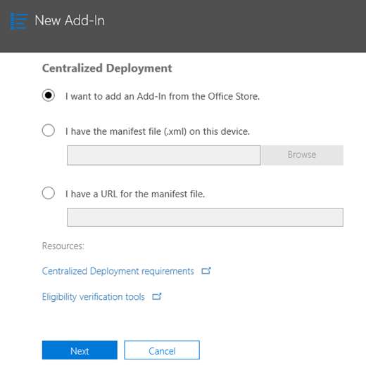

# Habilitar el complemento de mensajes de informe

> [!NOTE]
> El complemento de mensajes de informe para Outlook y Outlook en la web no es exactamente lo mismo que el [filtro de correo electrónico no deseado de Outlook](https://support.office.com/article/Overview-of-the-Junk-Email-Filter-5ae3ea8e-cf41-4fa0-b02a-3b96e21de089), aunque ambos pueden usarse para marcar el correo electrónico como correo no deseado, no deseado o como un intento de suplantación de identidad. La diferencia es que el complemento de mensajes de informe para Outlook y Outlook en la web notifica a Microsoft sobre el correo electrónico no clasificado, mientras que el filtro de correo electrónico no deseado de Outlook se usa para organizar los mensajes de correo electrónico en el buzón de un usuario. 

## Información general

El complemento de mensajes de informe para Outlook y Outlook en la web permite a los usuarios informar fácilmente de correo no clasificado, ya sea seguro o malintencionado, a Microsoft y a sus filiales para su análisis. Microsoft usa estos envíos para mejorar la eficacia de las tecnologías de protección de correo electrónico. Además, si su organización usa [Office 365 Advanced Threat Protection Plan 1](office-365-atp.md) o [plan 2](office-365-ti.md), el complemento de mensajes de informe proporciona al equipo de seguridad de su organización información útil que puede usar para revisar y actualizar las directivas de seguridad. 

Por ejemplo, supongamos que las personas están notificando una gran cantidad de mensajes como suplantación de identidad. Esta información se Surfaces en el [Panel de seguridad](security-dashboard.md) y otros informes. El equipo de seguridad de su organización puede usar esta información como indicación de que es posible que sea necesario actualizar las directivas antiphishing. O bien, si los usuarios notifican un gran número de mensajes que se marcaron como correo no deseado mediante el complemento de mensajes de informe, es posible que el equipo de seguridad de la organización deba ajustar [las directivas contra correo no deseado](configure-the-anti-spam-policies.md). 

El complemento de mensajes de informe funciona con su suscripción a Office 365 y los productos siguientes:
 - Outlook en la Web
 - Outlook 2013 SP1
 - Outlook 2016
 - Outlook 2016 para Mac
 - Outlook incluido con Office 365 ProPlus

El explorador Web existente debería ser suficiente para que funcione el complemento de mensajes de informe; sin embargo, si observa que el complemento no está disponible o no funciona como se esperaba, pruebe con otro explorador.
  
Si es un usuario individual, puede [Habilitar el complemento de mensajes de informe para usted mismo](#get-the-report-message-add-in-for-yourself). 
  
Si es un administrador global de Office 365 o un administrador de Exchange Online y Exchange está configurado para usar la autenticación OAuth, puede [Habilitar el complemento de mensajes de informe para su organización](#get-and-enable-the-report-message-add-in-for-your-organization). El complemento de mensajes de informe ahora está disponible a través de la [implementación centralizada](https://docs.microsoft.com/office365/admin/manage/centralized-deployment-of-add-ins).
    
## Obtener el complemento de mensajes de informe para usted mismo

1. En [Microsoft AppSource](https://appsource.microsoft.com/marketplace/apps), busque el [complemento de mensajes de informe](https://appsource.microsoft.com/product/office/wa104381180).
    
2. Elija **obtenerlo ahora**.   
    
3. Revise las condiciones de uso y la Directiva de privacidad. Después, elija **Continuar**. 
    
4. Inicie sesión en Office 365 con su cuenta profesional o educativa (para uso empresarial) o su cuenta Microsoft (para uso personal).
    
Una vez instalado y habilitado el complemento, verá los iconos siguientes: 

- En Outlook, el icono tiene el siguiente aspecto:    
- En Outlook en la web (anteriormente conocido como Outlook Web App), el icono tiene un aspecto similar a este:  

> [!TIP]
> Como paso siguiente, aprenda a [usar el complemento de mensajes de informe](https://support.office.com/article/b5caa9f1-cdf3-4443-af8c-ff724ea719d2).
  
## Obtener y habilitar el complemento de mensajes de informe para la organización

> [!IMPORTANT]
> Debe ser un administrador global de Office 365 o un administrador de Exchange Online para completar esta tarea. Además, Exchange debe estar configurado para usar la autenticación OAuth para obtener más información, consulte [requisitos de Exchange (Implementación centralizada de complementos)](https://docs.microsoft.com/office365/admin/manage/centralized-deployment-of-add-ins). 

1. Vaya a la [Página servicios & complementos](https://admin.microsoft.com/AdminPortal/Home#/Settings/ServicesAndAddIns) en el centro de administración de Microsoft 365.   
    
2. Elija **+ implementar complemento**.   
    
3. En la pantalla **nuevo complemento** , revise la información y, a continuación, elija **siguiente**.  
    
4. Seleccione **quiero agregar un complemento de la tienda Office**y, a continuación, elija **siguiente**.   
    
5. Buscar **mensaje de informe**y, en la lista de resultados, junto al complemento de **mensajes de informe**, elija **Agregar**.  
    
6. En la pantalla de **mensajes del informe** , revise la información y, a continuación, elija **siguiente**.  

7. Especifique la configuración predeterminada de usuario de Outlook y, a continuación, elija **siguiente**.  

8. Especifique quién recibe el complemento de mensajes de informe y, a continuación, elija **Guardar**.   

> [!TIP]
> Le recomendamos que configure [una regla para obtener una copia de los mensajes de correo electrónico que notifican los usuarios](#set-up-a-rule-to-get-a-copy-of-email-messages-reported-by-your-users).

En función de lo que haya seleccionado al configurar el complemento (los pasos del 7-8 anterior), los usuarios de la organización tendrán disponible el [complemento de mensajes de informe](https://support.office.com/article/b5caa9f1-cdf3-4443-af8c-ff724ea719d2) . Los usuarios de la organización verán los siguientes iconos: 

- En Outlook, el icono tiene el siguiente aspecto:    
- En Outlook en la web, el icono tiene el siguiente aspecto:  

> [!TIP]
> Cuando notifique a los usuarios sobre el complemento de mensajes de informe, incluya un vínculo para [usar el complemento de mensajes de informe](https://support.office.com/article/b5caa9f1-cdf3-4443-af8c-ff724ea719d2).

## Configurar una regla para obtener una copia de los mensajes de correo electrónico que notifican los usuarios

> [!IMPORTANT]
> Debe ser administrador de Exchange Online para realizar esta tarea.
  
Puede configurar una regla para obtener una copia de los mensajes de correo electrónico que notifican los usuarios de la organización. Hágalo después de haber descargado y habilitado el complemento de mensajes de informe para su organización.
  
1. En el centro de administración de Exchange, elija **reglas**de **flujo** \> de correo. 
    
2. Elija **+** \> **crear una nueva regla**. 
    
3. En el cuadro **nombre** , escriba un nombre, como envíos.
    
4. En la lista **aplicar esta regla si** , elija **la dirección del destinatario incluye...** 
    
5. En la pantalla **especificar palabras o frases** , agregue `junk@office365.microsoft.com` y `phish@office365.microsoft.com`, a continuación, elija **Aceptar**.  
  
6. En la lista **haga lo siguiente...** , elija **CCO el mensaje a...**. 
    
7. Agregue un administrador global, un administrador de seguridad o un lector de seguridad que debe recibir una copia de cada mensaje de correo electrónico que los usuarios informan a Microsoft y, a continuación, elija **Aceptar**.  
  
8. Seleccione **auditar esta regla con nivel de gravedad**y elija **media**. 
    
9. En **elegir un modo para esta regla**, elija **aplicar**.  
  
10. Elija **Guardar**. 
    
Una vez colocada esta regla, cada vez que un usuario de la organización notifique un mensaje de correo electrónico mediante el complemento de mensajes de informe, el administrador global, el administrador de seguridad o el lector de seguridad recibirá una copia del mensaje. Esta información puede permitirle configurar o ajustar directivas como, por ejemplo, las directivas de [vínculos seguros de Office 365 ATP](atp-safe-links.md) o su configuración [contra correo no deseado](anti-spam-protection.md) . 

## Obtener información sobre cómo usar el complemento de mensajes de informe

Consulte [usar el complemento de mensajes de informe](https://support.office.com/article/b5caa9f1-cdf3-4443-af8c-ff724ea719d2).

## Revisión o edición de la configuración del complemento de mensajes de informe

Puede revisar y editar la configuración predeterminada para el complemento de mensajes de informe en la [Página de servicios & complementos](https://admin.microsoft.com/AdminPortal/Home#/Settings/ServicesAndAddIns). 

> [!IMPORTANT]
> Debe ser un administrador global de Office 365 o un administrador de Exchange Online para completar esta tarea.
    
1. Vaya a la [Página servicios & complementos](https://admin.microsoft.com/AdminPortal/Home#/Settings/ServicesAndAddIns) en el centro de administración de Microsoft 365.  

2. Busque y seleccione el complemento de mensajes de informe.   
    
3. En la pantalla de mensaje de informe, revise y edite las opciones según corresponda para su organización.   

## Temas relacionados

[Usar el complemento de mensajes de informe](https://support.office.com/article/b5caa9f1-cdf3-4443-af8c-ff724ea719d2)
  
[Ver informes de seguridad de correo electrónico &amp; en el centro de seguridad y cumplimiento](view-email-security-reports.md)

[Ver informes para la protección contra amenazas avanzada de Office 365](view-reports-for-atp.md)

[Usar el explorador en el &amp; centro de seguridad y cumplimiento](use-explorer-in-security-and-compliance.md)
  

