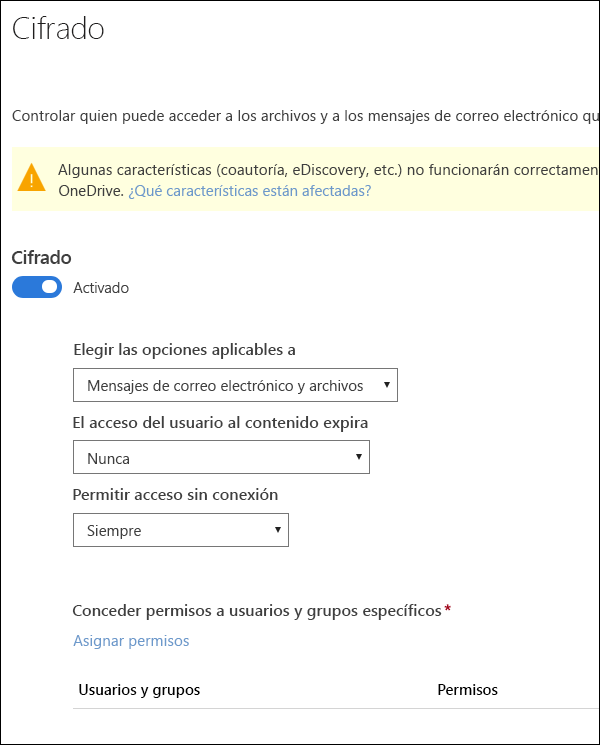
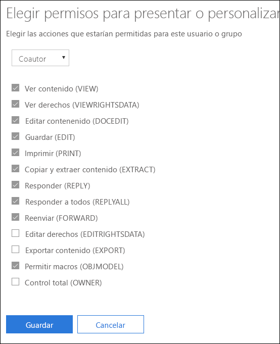
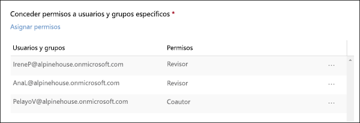

# Restringir el acceso al contenido mediante el cifrado en las etiquetas de confidencialidadRestrict access to content by using encryption in sensitivity labels

Al crear una etiqueta de confidencialidad, puede restringir el acceso al contenido al que se aplique la etiqueta. Por ejemplo, con las opciones de encriptación de una etiqueta de confidencialidad, se puede proteger el contenido para que:When you create a sensitivity label, you can restrict access to content that the label will be applied to. For example, with the encryption settings for a sensitivity label, you can protect content so that:

- Solo los usuarios de su organización puedan abrir un correo electrónico o documentos confidenciales.Only users within your organization can open a confidential document or email.
- Solo los usuarios del departamento de marketing puedan editar e imprimir documentos o correos electrónicos de anuncios de promociones, mientras que todos los demás usuarios de su organización solo puedan leerlos.Only users in the marketing department can edit and print the promotion announcement document or email, while all other users in your organization can only read it.
- Los usuarios no puedan reenviar un correo electrónico o copiar información que contenga noticias sobre una reorganización interna.Users cannot forward an email or copy information from it that contains news about an internal reorganization.
- La lista de precios actual que se envía a socios comerciales no pueda abrirse tras una fecha especificada.The current price list that is sent to business partners cannot be opened after a specified date.

Cuando se encripta un documento o correo electrónico, el acceso al contenido está restringido, por lo que:When a document or email is encrypted, access to the content is restricted, so that it:

- Se puede desencriptar solo por los usuarios autorizados por la configuración de encriptado de la etiqueta.Can be decrypted only by users authorized by the label’s encryption settings.
- Permanece encriptado independientemente de dónde resida, dentro o fuera de su organización, incluso si cambia el nombre del archivo.Remains encrypted no matter where it resides, inside or outside your organization, even if the file’s renamed.
- Se encripta tanto en reposo (por ejemplo, en una cuenta de OneDrive) como y en tránsito (por ejemplo, un correo electrónico enviado).Is encrypted both at rest (for example, in a OneDrive account) and in transit (for example, a sent email).

La configuración de encriptado está disponible en el Centro de seguridad y cumplimiento de Office 365 > página **Etiquetas** > pestaña **Confidencialidad** > **Crear una etiqueta**.The encryption settings are available in the Office 365 Security & Compliance Center > **Labels** page > **Sensitivity** tab > **Create a label**.

## Cómo funciona la encriptaciónHow encryption works

La encriptación usa Azure Rights Management (Azure RMS). Azure RMS usa directivas de identidad, cifrado y autorización. Para obtener más información, consulte [¿Qué es Azure Rights Management?](https://docs.microsoft.com/es-ES/azure/information-protection/what-is-azure-rms)Encryption uses Azure Rights Management (Azure RMS). Azure RMS uses encryption, identity, and authorization policies. To learn more, see [What is Azure Rights Management?](https://docs.microsoft.com/es-ES/azure/information-protection/what-is-azure-rms)

## Cómo activar la encriptación para una etiqueta de confidencialidadHow to turn on encryption for a sensitivity label

Para empezar, solo tiene que cambiar **Encriptación** a **Activado** y, después, use las siguientes opciones para controlar quién puede acceder al correo o documentos a los que se aplica esta etiqueta. Puede:To begin, simply toggle **Encryption** to **On**, and then use the options below to control who can access email or documents to which this label is applied. You can:

1. **Aplicar la encriptación a correo electrónico y documentos, o solo al correo.** Si elige solo correo, los mensajes con esta etiqueta se cifrarán en Outlook, pero los documentos con esta etiqueta no se cifrarán en otras aplicaciones, como Word o PowerPoint.**Apply encryption to both email and documents, or just email.** If you choose just email, messages with this label will be encrypted in Outlook, but documents with this label won't be encrypted in other apps, such as Word or PowerPoint. 
2. **Permitir que el acceso al contenido con la etiqueta expire**, ya sea en una fecha específica o tras un número determinado de días después de aplicar la etiqueta. Después de ese momento, los usuarios no podrán abrir el elemento con la etiqueta. Si especifica una fecha, se activará en la medianoche de esa fecha, en la zona horaria actual.**Allow access to labeled content to expire**, either on a specific date or after a specific number of days after the label is applied. After this time, users won’t be able to open the labeled item. If you specify a date, it is effective midnight on that date in your current time zone. 
3. **Permitir el acceso sin conexión** nunca, siempre o durante un número concreto de días después de aplicar la etiqueta. Si restringe el acceso sin conexión a nunca o a un número de días, cuando se alcance el umbral, los usuarios deberán volver a autenticarse y se registrará el acceso. Para obtener más información, vea la siguiente sección sobre la licencia de uso de administración de derechos.**Allow offline access** never, always, or for a specific number of days after the label is applied. If you restrict offline access to never or a number of days, when that threshold is reached, users must be reauthenticated and their access is logged. For more information, see the next section on the Rights Management use license.

### Licencia de uso de administración de derechos para el acceso sin conexiónRights Management use license for offline access

Cuando un usuario abre un documento o correo electrónico sin conexión que esté protegido por una etiqueta de confidencialidad, se concede una licencia de uso de Azure Rights Management para el usuario. Esta licencia es un certificado que contiene los derechos de uso del usuario para el documento o correo electrónico y la clave de cifrado que se usó para cifrar el contenido. La licencia de uso también contiene una fecha de vencimiento si se ha configurado y el tiempo durante el que la licencia es válida.When a user opens a document or email offline that’s been protected by a sensitivity label, an Azure Rights Management use license for that content is granted to the user. This use license is a certificate that contains the user's usage rights for the document or email, and the encryption key that was used to encrypt the content. The use license also contains an expiration date if this has been set, and how long the use license is valid.

Si no se ha establecido ninguna fecha de expiración, el período predeterminado de validez de licencia de uso para un espacio empresarial es 30 días. Durante la duración de la licencia de uso, el usuario no se vuelve a autenticar o autorizar para ver el contenido. Esto permite que el usuario pueda abrir el documento o correo electrónico protegido sin conexión a Internet. Cuando la validez de la licencia de uso expire, la próxima vez que el usuario acceda a un documento o correo electrónico protegido, el usuario debe ser autorizado y autenticarse de nuevo.If no expiration date has been set, the default use license validity period for a tenant is 30 days. For the duration of the use license, the user is not reauthenticated or reauthorized for the content. This lets the user continue to open the protected document or email without an Internet connection. When the use license validity period expires, the next time the user accesses the protected document or email, the user must be reauthenticated and reauthorized.

Además de volver a hacer la autenticación, se vuelven a evaluar la pertenencia a grupos de usuario y la directiva. Esto significa que los usuarios podrían experimentar resultados diferentes de acceso para el mismo documento si hay cambios en la directiva o pertenencia a grupos con respecto al último momento en que se accedió acceso al contenido.In addition to reauthentication, the policy and user group membership is reevaluated. This means that users could experience different access results for the same document or email if there are changes in the policy or group membership from when they last accessed the content.

Para obtener información sobre cómo cambiar la configuración de 30 días predeterminada, vea [Licencia de uso de administración de derechos](https://docs.microsoft.com/es-ES/azure/information-protection/configure-usage-rights#rights-management-use-license).To learn how to change the default 30-day setting, see [Rights Management use license](https://docs.microsoft.com/es-ES/azure/information-protection/configure-usage-rights#rights-management-use-license).

## Asignar permisos a usuarios o grupos específicosAssign permissions to specific users or groups

Puede conceder permisos a usuarios específicos para que solo pueden interactuar con el contenido con la etiqueta.You can grant permissions to specific people so that only they can interact with the labeled content.

Es un proceso de dos pasos sencillos:Doing so is a straightforward two-step process:

1. Primero agrega usuarios o grupos a los que se asignarán permisos para el contenido con la etiqueta.First you add users or groups that will be assigned permissions to the labeled content.
2. Después elige qué permisos obtienen los usuarios para el contenido con la etiqueta.Then you choose which permissions those users have for the labeled content.

### Agregar usuarios o gruposAdd users or groups

Al asignar permisos, puede elegir:When you assign permissions, you can choose:

- Todos los usuarios de su organización (todos los miembros del espacio empresarial). Esta configuración excluye cuentas de invitado.Everyone in your organization (all tenant members). This setting excludes guest accounts.
- Cualquier usuario específico o grupo de seguridad habilitado para correo electrónico, grupo de distribución, grupo de Office 365 o grupo de distribución dinámico.Any specific user or email-enabled security group, distribution group, Office 365 group, or dynamic distribution group. 
- Cualquier dirección de correo electrónico o dominio fuera de su organización, como gmail.com, outlook.com o hotmail.com.Any email address or domain outside your organization, such as gmail.com, hotmail.com, or outlook.com.

Cuando elige a todos los miembros del espacio empresarial o busca en el directorio, los usuarios o grupos deben tener una dirección de correo electrónico.When you choose all tenant members or browse the directory, the users or groups must have an email address.

Se recomienda usar grupos en lugar de usuarios. Esta estrategia mantiene la configuración más sencilla.As a best practice, use groups rather than users. This strategy keeps your configuration simpler.

### Elegir permisosChoose permissions

Al elegir qué permisos permitir para los usuarios o grupos, puede seleccionar entre:When you choose which permissions to allow for those users or groups, you can select either:

- Un [nivel de permiso predefinido](https://docs.microsoft.com/es-ES/azure/information-protection/configure-usage-rights#rights-included-in-permissions-levels) con un grupo de derechos preestablecido, como coautor o revisor.A [predefined permissions level](https://docs.microsoft.com/es-ES/azure/information-protection/configure-usage-rights#rights-included-in-permissions-levels) with a preset group of rights, such as Co-Author or Reviewer.
- Un grupo personalizado de derechos, donde elije los permisos que quiere.A Custom group of rights, where you choose whichever permissions you want.

Para obtener más información sobre cada permiso específico, consulte [Derechos y descripciones de uso](https://docs.microsoft.com/es-ES/azure/information-protection/configure-usage-rights#usage-rights-and-descriptions).For more information on each specific permission, see [Usage rights and descriptions](https://docs.microsoft.com/es-ES/azure/information-protection/configure-usage-rights#usage-rights-and-descriptions).  

Tenga en cuenta que la misma etiqueta puede conceder diferentes permisos a diferentes usuarios. Por ejemplo, una sola etiqueta puede asignar a algunos usuarios como revisor y a otros usuarios como coautor, como se muestra a continuación.Note that the same label can grant different permissions to different users. For example, a single label can assign some users as Reviewer and a different user as Co-author, as shown below.

Para ello, agregue usuarios o grupos, asigne sus permisos y guarde las opciones de configuración. Luego repita estos pasos, agregue usuarios y asigne permisos para guardar la configuración de nuevo. Puede hacerlo tantas veces como sea necesario para definir permisos diferentes para distintos usuarios.To do this, add users or groups, assign them permissions, and save those settings. Then repeat these steps, adding users and assigning them permissions, saving the settings each time. You can do this as often as necessary, to define different permissions for different users.

### El emisor de administración de derechos (el usuario que aplica la etiqueta de confidencialidad) siempre tiene control totalRights Management issuer (user applying the sensitivity label) always has Full Control

El cifrado para una etiqueta de confidencialidad utiliza Azure RMS. Cuando un usuario aplica una etiqueta de confidencialidad para proteger un documento o correo electrónico mediante Azure RMS, ese usuario pasa a ser el emisor de administración de derechos para ese contenido.Encryption for a sensitivity label uses Azure RMS. When a user applies a sensitivity label to protect a document or email by using Azure RMS, that user becomes the Rights Management issuers for that content.

El emisor de administración de derechos siempre obtiene permisos de control total para el documento o correo electrónico y además:The Rights Management issuer is always granted Full Control permissions for the document or email, and in addition:

- Si la configuración de protección incluye una fecha de expiración, el emisor de administración de derechos puede abrir y editar el documento o correo electrónico después de esa fecha.If the protection settings include an expiration date, the Rights Management issuer can still open and edit the document or email after that date.
- El emisor de administración de derechos siempre puede acceder al documento o correo electrónico sin conexión.The Rights Management issuer can always access the document or email offline.
- El emisor de administración de derechos puede seguir abriendo un documento después de que se revoque.The Rights Management issuer can still open a document after it is revoked.

Para obtener más información, vea [Emisor de administración de derechos y propietario de administración de derechos](https://docs.microsoft.com/es-ES/azure/information-protection/configure-usage-rights#rights-management-issuer-and-rights-management-owner).For more information, see [Rights Management issuer and Rights Management owner](https://docs.microsoft.com/es-ES/azure/information-protection/configure-usage-rights#rights-management-issuer-and-rights-management-owner).

## Almacenar contenido cifrado en OneDrive y SharePointStoring encrypted content in OneDrive and SharePoint

Tenga en cuenta que cuando se aplica el cifrado a los archivos almacenados en OneDrive y SharePoint, el servicio no puede procesar el contenido de estos archivos. Esto significa que algunas características como la coautoría, eDiscovery, la búsqueda, Delve y otras características colaborativas no funcionan. Además, las directivas de prevención de pérdida de datos (DLP) solo pueden trabajar con los metadatos (incluidas las etiquetas de Office 365), pero no con el contenido de archivos encriptados (como números de tarjeta de crédito incluidos en los archivos).Be aware that when encryption is applied to files stored in OneDrive and SharePoint, the service cannot process the contents of these files. This means that features such as co-authoring, eDiscovery, search, Delve, and other collaborative features do not work. Also, data loss prevention (DLP) policies can work only with the metadata (including Office 365 labels) but not the contents of encrypted files (such as credit card numbers within files).

Esto se aplica solo al contenido almacenado en OneDrive y SharePoint. En Exchange Online, las reglas de flujo de correo (también denominadas reglas de transporte) usan la [super cuenta de usuario](https://docs.microsoft.com/es-ES/azure/information-protection/configure-super-users) para poder examinar el contenido cifrado y aplicar directivas DLP.This applies only to content stored in OneDrive and SharePoint. In Exchange Online, mail flow rules (also known as transport rules) use the [super user account](https://docs.microsoft.com/es-ES/azure/information-protection/configure-super-users) so that they can scan encrypted content and enforce DLP policies.

## Requisitos previos importantesImportant prerequisites

Para poder usar el cifrado, es posible que deba realizar estas tareas.Before you can use encryption, you might need to perform these tasks.

### Activar Azure Rights ManagementActivating Azure Rights Management

Para usar el cifrado en etiquetas de confidencialidad, el servicio de Azure Rights Management debe activarse en el espacio empresarial. En los espacios empresariales más recientes, el servicio está activado de forma predeterminada, pero es posible que deba activar manualmente el servicio. Para obtener más información, vea [Activar Azure Rights Management](https://docs.microsoft.com/es-ES/azure/information-protection/activate-service).To use encryption in sensitivity labels, the Azure Rights Management service needs to be activated in your tenant. In newer tenants, the service is on by default, but you might need to manually activate the service. For more information, see [Activating Azure Rights Management](https://docs.microsoft.com/es-ES/azure/information-protection/activate-service).

### Configurar Exchange para Azure Information ProtectionConfigure Exchange for Azure Information Protection

Exchange no tiene que estar configurado para Azure Information Protection antes de que los usuarios puedan aplicar etiquetas en Outlook para proteger los mensajes. Sin embargo, hasta que Exchange no esté configurado para Azure Information Protection, no obtendrá toda la funcionalidad del uso de la protección de Azure Rights Management con Exchange.Exchange does not have to be configured for Azure Information Protection before users can apply labels in Outlook to protect their emails. However, until Exchange is configured for Azure Information Protection, you do not get the full functionality of using Azure Rights Management protection with Exchange.
 
Por ejemplo, los usuarios no pueden ver mensajes de correo electrónico protegidos en teléfonos móviles o con Outlook en la Web, no se puede indizar mensajes de correo electrónico protegidos para la búsqueda y no puede se configura Exchange Online DLP para la protección de administración de derechos.For example, users cannot view protected emails on mobile phones or with Outlook on the web, protected emails cannot be indexed for search, and you cannot configure Exchange Online DLP for Rights Management protection. 

Para asegurarse de que Exchange puede admitir estos escenarios adicionales, vea lo siguiente:To ensure that Exchange can support these additional scenarios, see the following:

- Para Exchange Online, consulte las instrucciones de [Exchange Online: configuración de IRM](https://docs.microsoft.com/es-ES/azure/information-protection/configure-office365#exchange-online-irm-configuration).For Exchange Online, see the instructions for [Exchange Online: IRM Configuration](https://docs.microsoft.com/es-ES/azure/information-protection/configure-office365#exchange-online-irm-configuration).
- Para Exchange local, debe implementar el [conector RMS y configurar los servidores de Exchange](https://docs.microsoft.com/es-ES/azure/information-protection/deploy-rms-connector).For Exchange on-premises, you must deploy the [RMS connector and configure your Exchange servers](https://docs.microsoft.com/es-ES/azure/information-protection/deploy-rms-connector). 
