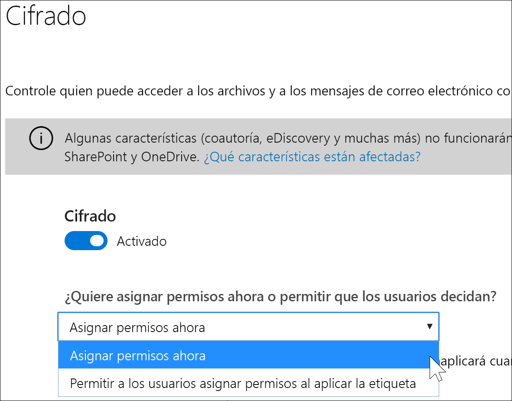
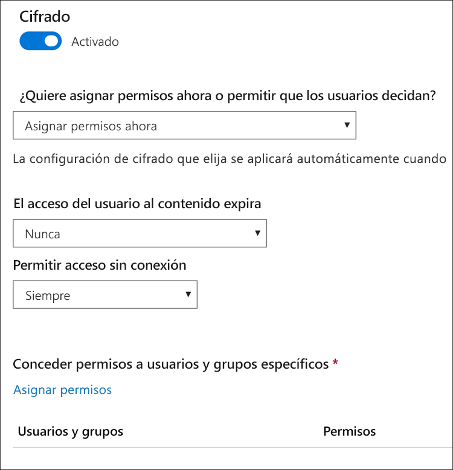
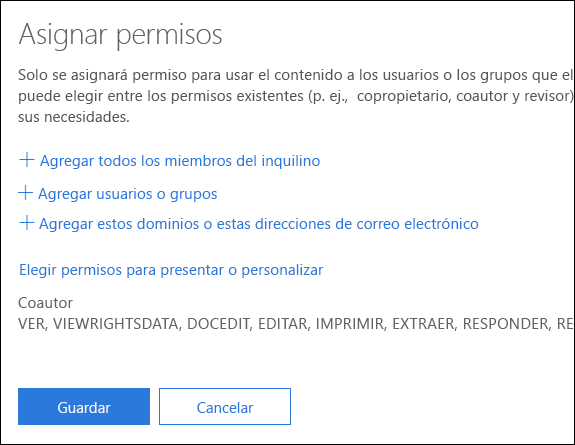
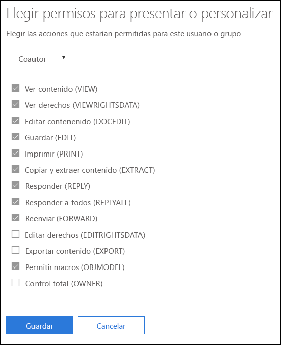
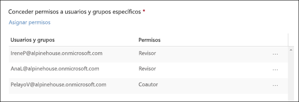
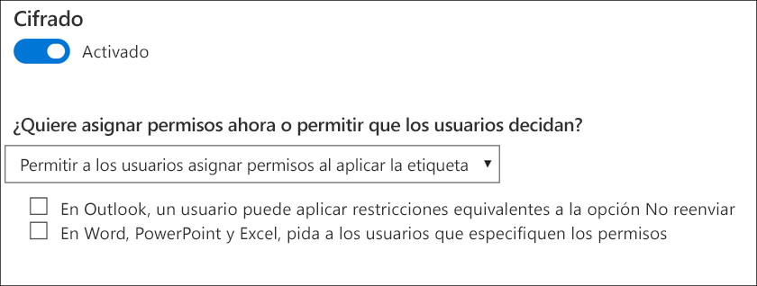
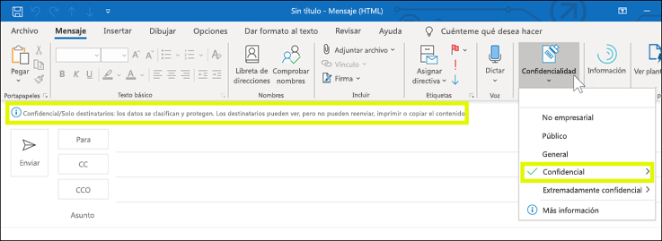
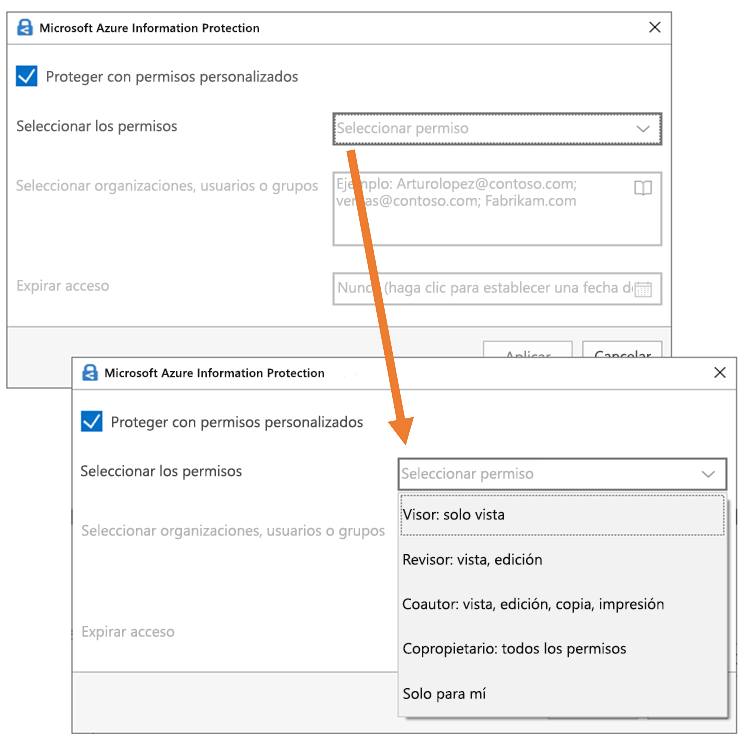

# Restringir el acceso al contenido mediante el cifrado en las etiquetas de confidencialidad

Al crear una etiqueta de confidencialidad, puede restringir el acceso al contenido al que se aplique la etiqueta. Por ejemplo, con las opciones de encriptación de una etiqueta de confidencialidad, se puede proteger el contenido para que:

- Solo los usuarios de su organización puedan abrir un correo electrónico o documentos confidenciales.
- Solo los usuarios del departamento de marketing puedan editar e imprimir documentos o correos electrónicos de anuncios de promociones, mientras que todos los demás usuarios de su organización solo puedan leerlos.
- Los usuarios no puedan reenviar un correo electrónico o copiar información que contenga noticias sobre una reorganización interna.
- La lista de precios actual que se envía a socios comerciales no pueda abrirse tras una fecha especificada.

Cuando se encripta un documento o correo electrónico, el acceso al contenido está restringido, por lo que:

- Se puede desencriptar solo por los usuarios autorizados por la configuración de encriptado de la etiqueta.
- Permanece encriptado independientemente de dónde resida, dentro o fuera de su organización, incluso si cambia el nombre del archivo.
- Se encripta tanto en reposo (por ejemplo, en una cuenta de OneDrive) como y en tránsito (por ejemplo, un correo electrónico enviado).

Por último, como administrador, al crear una etiqueta de confidencialidad, puede elegir entre:

- **Asignar permisos ahora** para que determine exactamente los permisos para el contenido con esa etiqueta y los usuarios que los obtendrán.
- **Permitir a los usuarios asignar permisos** al aplicar la etiqueta al contenido. De esta forma, puede permitir a los usuarios de su organización cierta flexibilidad que pueden necesitar para colaborar y llevar a cabo su trabajo.

La configuración de cifrado está disponible cuando se crea una etiqueta de confidencialidad en el Centro de cumplimiento de Microsoft 365, Centro de seguridad de Microsoft 365 o el Centro de seguridad y cumplimiento de Office 365. En el panel de navegación izquierdo, elija **Clasificación** > **Etiqueta de confidencialidad** > **Crear una etiqueta**.

## Cómo funciona la encriptación

La encriptación usa Azure Rights Management (Azure RMS). Azure RMS usa directivas de identidad, cifrado y autorización. Para obtener más información, consulte [¿Qué es Azure Rights Management?](https://docs.microsoft.com/es-ES/azure/information-protection/what-is-azure-rms)

## Cómo activar la encriptación para una etiqueta de confidencialidad

Para empezar, solo tiene que cambiar **Cifrado** a **Activado** y, después, elegir si quiere:

- **Asignar permisos ahora** para que pueda determinar exactamente los permisos para el contenido con esa etiqueta y los usuarios que los obtendrán. Para obtener más información, vea la sección siguiente [Asignar permisos ahora](#assign-permissions-now).
- **Permitir a los usuarios asignar permisos** al aplicar la etiqueta al contenido. De esta forma, puede permitir a los usuarios de su organización cierta flexibilidad que pueden necesitar para colaborar y llevar a cabo su trabajo. Para obtener más información, vea la sección siguiente [Permitir a los usuarios asignar permisos](#let-users-assign-permissions).

Por ejemplo, si tiene una etiqueta de confidencialidad denominada **Extremadamente confidencial** que se aplicará al contenido más confidencial, es posible que quiera decidir ahora quién obtendrá cierto tipo de permisos para ese contenido.

Por otra parte, si tiene una etiqueta de confidencialidad denominada **Contratos empresariales** y el flujo de trabajo de su organización requiere que sus usuarios colaboren en este contenido con diferentes personas según sea necesario, puede que quiera permitir a los usuarios decidir quién obtiene permisos cuando asignan la etiqueta. Esta flexibilidad aumenta la productividad de los usuarios y reduce las solicitudes de actualización y creación de nuevas etiquetas a los administradores para solucionar escenarios específicos.

## Asignar permisos ahora

Use las opciones siguientes para controlar quién puede tener acceso al correo electrónico o a los documentos a los que se aplica esta etiqueta. Puede:

1. **Aplicar la encriptación a correo electrónico y documentos, o solo al correo.** Si elige solo correo, los mensajes con esta etiqueta se cifrarán en Outlook, pero los documentos con esta etiqueta no se cifrarán en otras aplicaciones, como Word o PowerPoint. 
2. **Permitir que el acceso al contenido con la etiqueta expire**, ya sea en una fecha específica o tras un número determinado de días después de aplicar la etiqueta. Después de ese momento, los usuarios no podrán abrir el elemento con la etiqueta. Si especifica una fecha, se activará en la medianoche de esa fecha, en la zona horaria actual. (Tenga en cuenta que algunos clientes de correo electrónico pueden no aplicar la expiración y mostrar correos electrónicos una vez pasada dicha fecha, debido a otros mecanismos de almacenamiento en caché).
3. **Permitir el acceso sin conexión** nunca, siempre o durante un número concreto de días después de aplicar la etiqueta. Si restringe el acceso sin conexión a nunca o a un número de días, cuando se alcance el umbral, los usuarios deberán volver a autenticarse y se registrará el acceso. Para obtener más información, vea la siguiente sección sobre la licencia de uso de administración de derechos.

### Licencia de uso de administración de derechos para el acceso sin conexión

Cuando un usuario abre un documento o correo electrónico sin conexión que esté protegido por una etiqueta de confidencialidad, se concede una licencia de uso de Azure Rights Management para el usuario. Esta licencia es un certificado que contiene los derechos de uso del usuario para el documento o correo electrónico y la clave de cifrado que se usó para cifrar el contenido. La licencia de uso también contiene una fecha de vencimiento si se ha configurado y el tiempo durante el que la licencia es válida.

Si no se ha establecido ninguna fecha de expiración, el período predeterminado de validez de licencia de uso para un espacio empresarial es 30 días. Durante la duración de la licencia de uso, el usuario no se vuelve a autenticar o autorizar para ver el contenido. Esto permite que el usuario pueda abrir el documento o correo electrónico protegido sin conexión a Internet. Cuando la validez de la licencia de uso expire, la próxima vez que el usuario acceda a un documento o correo electrónico protegido, el usuario debe ser autorizado y autenticarse de nuevo.

Además de volver a hacer la autenticación, se vuelven a evaluar la pertenencia a grupos de usuario y la directiva. Esto significa que los usuarios podrían experimentar resultados diferentes de acceso para el mismo documento si hay cambios en la directiva o pertenencia a grupos con respecto al último momento en que se accedió acceso al contenido.

Para obtener información sobre cómo cambiar la configuración de 30 días predeterminada, vea [Licencia de uso de administración de derechos](https://docs.microsoft.com/es-ES/azure/information-protection/configure-usage-rights#rights-management-use-license).

### Asignar permisos a usuarios o grupos específicos

Puede conceder permisos a usuarios específicos para que solo pueden interactuar con el contenido con la etiqueta.

Es un proceso de dos pasos sencillos:

1. Primero agrega usuarios o grupos a los que se asignarán permisos para el contenido con la etiqueta.
2. Después elige qué permisos obtienen los usuarios para el contenido con la etiqueta.

#### Agregar usuarios o grupos

Al asignar permisos, puede elegir:

- Todos los usuarios de su organización (todos los miembros del espacio empresarial). Esta configuración excluye cuentas de invitado.
- Cualquier usuario específico o grupo de seguridad habilitado para correo electrónico, grupo de distribución, grupo de Office 365 o grupo de distribución dinámico. 
- Cualquier dirección de correo electrónico o dominio fuera de su organización, como gmail.com, outlook.com o hotmail.com.

Cuando elige a todos los miembros del espacio empresarial o busca en el directorio, los usuarios o grupos deben tener una dirección de correo electrónico.

Se recomienda usar grupos en lugar de usuarios. Esta estrategia mantiene la configuración más sencilla.

#### Elegir permisos

Al elegir qué permisos permitir para los usuarios o grupos, puede seleccionar entre:

- Un [nivel de permiso predefinido](https://docs.microsoft.com/es-ES/azure/information-protection/configure-usage-rights#rights-included-in-permissions-levels) con un grupo de derechos preestablecido, como coautor o revisor.
- Un grupo personalizado de derechos, donde elije los permisos que quiere.

Para obtener más información sobre cada permiso específico, consulte [Derechos y descripciones de uso](https://docs.microsoft.com/es-ES/azure/information-protection/configure-usage-rights#usage-rights-and-descriptions).  

Tenga en cuenta que la misma etiqueta puede conceder diferentes permisos a diferentes usuarios. Por ejemplo, una sola etiqueta puede asignar a algunos usuarios como revisor y a otros usuarios como coautor, como se muestra a continuación.

Para ello, agregue usuarios o grupos, asigne sus permisos y guarde las opciones de configuración. Luego repita estos pasos, agregue usuarios y asigne permisos para guardar la configuración de nuevo. Puede hacerlo tantas veces como sea necesario para definir permisos diferentes para distintos usuarios.

#### El emisor de administración de derechos (el usuario que aplica la etiqueta de confidencialidad) siempre tiene control total

El cifrado para una etiqueta de confidencialidad utiliza Azure RMS. Cuando un usuario aplica una etiqueta de confidencialidad para proteger un documento o correo electrónico mediante Azure RMS, ese usuario pasa a ser el emisor de administración de derechos para ese contenido.

El emisor de administración de derechos siempre obtiene permisos de control total para el documento o correo electrónico y además:

- Si la configuración de protección incluye una fecha de expiración, el emisor de administración de derechos puede abrir y editar el documento o correo electrónico después de esa fecha.
- El emisor de administración de derechos siempre puede acceder al documento o correo electrónico sin conexión.
- El emisor de administración de derechos puede seguir abriendo un documento después de que se revoque.

Para obtener más información, vea [Emisor de administración de derechos y propietario de administración de derechos](https://docs.microsoft.com/es-ES/azure/information-protection/configure-usage-rights#rights-management-issuer-and-rights-management-owner).

## Permitir a los usuarios asignar permisos

Puede usar estas opciones para que los usuarios puedan asignar permisos cuando aplican manualmente una etiqueta de confidencialidad al contenido:

- En Outlook, un usuario puede aplicar restricciones equivalentes a la opción **No reenviar**. Esta opción es compatible de forma nativa en Outlook de Windows y no requiere la instalación del cliente de etiquetado unificado de Azure Information Protection.
- En Word, PowerPoint y Excel, se pide al usuario que seleccione un nivel de permisos para organizaciones, usuarios o grupos específicos. Esta opción no es compatible de forma nativa en estas aplicaciones de Office, por lo que los usuarios tienen que instalar el cliente de etiquetado unificado de Azure Information Protection.

Estas opciones determinan las aplicaciones en las que se mostrará la etiqueta de confidencialidad:

- Si la etiqueta de confidencialidad solo tiene habilitada la opción Outlook, la etiqueta solo se mostrará a los usuarios de Outlook.
- Si la etiqueta de confidencialidad solo tiene habilitada la opción Word, PowerPoint y Excel, la etiqueta solo se mostrará a los usuarios en esas aplicaciones.
- Si la etiqueta de confidencialidad tiene habilitadas ambas opciones, esta se mostrará a los usuarios en todas las aplicaciones disponibles: Outlook, Word, PowerPoint y Excel.

Una etiqueta de confidencialidad que permite a los usuarios asignar permisos solo se puede aplicar al contenido manualmente. No se puede aplicar automáticamente o usar como etiqueta recomendada.

> [!NOTE]
> Permitir a los usuarios asignar permisos requiere una suscripción de Azure Information Protection. Para usar esta característica en Word, PowerPoint y Excel, debe descargar e instalar el [cliente de etiquetado unificado de Azure Information Protection](https://docs.microsoft.com/azure/information-protection/rms-client/install-unifiedlabelingclient-app). Estamos trabajando en la compatibilidad nativa de esta característica en estas aplicaciones de Office, para que no requieran el cliente de Azure Information Protection. Asimismo, el cliente solo se ejecuta en Windows, por lo que esta característica aún no se admite en Mac, iOS, Android u Office para la web.

### Restricciones de Outlook

En Outlook, cuando un usuario aplica una etiqueta de confidencialidad que les permite asignar permisos a un mensaje, las restricciones son las mismas que la opción No reenviar. El usuario verá el nombre y la descripción de la etiqueta en la parte superior del mensaje, lo que indica que se está protegiendo el contenido. A diferencia de Word, PowerPoint y Excel (vea la [siguiente sección](#word-powerpoint-and-excel-permissions)), no se pide a los usuarios que seleccionen permisos específicos.

Cuando la opción No reenviar se aplica a un correo electrónico, este se cifra y los destinatarios tienen que autenticarse. Luego, los destinatarios no podrán reenviarlo, imprimirlo ni copiarlo. Por ejemplo, en el cliente de Outlook, el botón Reenviar y las opciones de menú Guardar como e Imprimir no están disponibles, y no se pueden agregar o cambiar destinatarios en los cuadros Para, CC o CCO.

Los documentos de Office sin proteger asociados al correo electrónico heredan automáticamente las mismas restricciones. Los derechos de uso que se aplican a estos documentos son Editar contenido, Editar; Guardar; Ver, Abrir, Leer y Permitir macros. Si el usuario quiere derechos de uso distintos para los datos adjuntos o el archivo adjunto no es un documento de Office compatible con esta protección heredada, debe proteger el archivo antes de adjuntarlo al correo electrónico.

### Permisos de Word, PowerPoint y Excel

En Word, PowerPoint y Excel, cuando un usuario aplica una etiqueta de confidencialidad que le permite asignar permisos a un documento, se le pedirá que proteja el contenido, como se muestra a continuación.

El usuario puede hacer lo siguiente:

- Seleccionar un nivel de permisos, como Visor (que asigna el permiso de solo vista) o Co-autoría (que asigna los permisos de vista, edición, copia e impresión). 
- Seleccionar organizaciones, usuarios o grupos. Esto puede incluir usuarios dentro o fuera de su organización.
- Establecer una fecha de expiración, después de la que los usuarios seleccionados no pueden tener acceso al contenido. Para obtener más información, vea la sección anterior [Licencia de uso de Rights Management para el acceso sin conexión](#rights-management-use-license-for-offline-access).

## Qué sucede con el cifrado existente al aplicar una etiqueta

Antes de aplicar una etiqueta de confidencialidad al contenido, es posible que un usuario haya cifrado ya el contenido aplicando otra opción de configuración de protección. Por ejemplo, un usuario puede haber aplicado:

- La opción **no reenviar**.
- Protección personalizada mediante el uso del cliente de etiquetado unificado de Azure Information Protection.
- Una plantilla de servicio de Azure Rights Management (RMS) que cifra el contenido pero no está asociada con una etiqueta.

En esta tabla se describe lo que ocurre con el cifrado existente al aplicar una etiqueta de confidencialidad a ese contenido.
 
 

| |**El usuario aplica una etiqueta de confidencialidad con cifrado desactivado.**|**El usuario aplica una etiqueta de confidencialidad con cifrado activado.**|**El usuario aplica una etiqueta con Quitar la protección**1|
|:-----|:-----|:-----|:-----|
|**No reenviar**|Email: la protección de correo se quita. Documento: se conserva la protección del documento.|Se aplica la etiqueta de protección.|**No reenviar** se quita.|
|**Protección personalizada**1.|Se conserva la protección.|Se aplica la etiqueta de protección.|La protección personalizada se quita.|
|**Plantilla de Azure RMS**|Se conserva la protección.|Se aplica la etiqueta de protección.|La protección personalizada se quita.|

1 Esto es compatible únicamente con el cliente de etiquetado de Azure Information Protection.

## Almacenar contenido cifrado en OneDrive y SharePoint

Tenga en cuenta que cuando se aplica el cifrado a los archivos almacenados en OneDrive y SharePoint, el servicio no puede procesar el contenido de estos archivos. Esto significa que algunas características como la coautoría, eDiscovery, la búsqueda, Delve y otras características colaborativas no funcionan. Además, las directivas de prevención de pérdida de datos (DLP) solo pueden trabajar con los metadatos (incluidas las etiquetas de Office 365), pero no con el contenido de archivos encriptados (como números de tarjeta de crédito incluidos en los archivos).

Esto se aplica solo al contenido almacenado en OneDrive y SharePoint. En Exchange Online, las reglas de flujo de correo (también denominadas reglas de transporte) usan la [super cuenta de usuario](https://docs.microsoft.com/es-ES/azure/information-protection/configure-super-users) para poder examinar el contenido cifrado y aplicar directivas DLP.

## Requisitos previos importantes

Para poder usar el cifrado, es posible que deba realizar estas tareas.

### Activar Azure Rights Management

Para usar el cifrado en etiquetas de confidencialidad, el servicio de Azure Rights Management debe activarse en el espacio empresarial. En los espacios empresariales más recientes, el servicio está activado de forma predeterminada, pero es posible que deba activar manualmente el servicio. Para obtener más información, vea [Activar Azure Rights Management](https://docs.microsoft.com/es-ES/azure/information-protection/activate-service).

### Configurar Exchange para Azure Information Protection

Exchange no tiene que estar configurado para Azure Information Protection antes de que los usuarios puedan aplicar etiquetas en Outlook para proteger los mensajes. Sin embargo, hasta que Exchange no esté configurado para Azure Information Protection, no obtendrá toda la funcionalidad del uso de la protección de Azure Rights Management con Exchange.
 
Por ejemplo, los usuarios no pueden ver mensajes de correo electrónico protegidos en teléfonos móviles o con Outlook en la Web, no se puede indizar mensajes de correo electrónico protegidos para la búsqueda y no puede se configura Exchange Online DLP para la protección de administración de derechos. 

Para asegurarse de que Exchange puede admitir estos escenarios adicionales, vea lo siguiente:

- Para Exchange Online, consulte las instrucciones de [Exchange Online: configuración de IRM](https://docs.microsoft.com/es-ES/azure/information-protection/configure-office365#exchange-online-irm-configuration).
- Para Exchange local, debe implementar el [conector RMS y configurar los servidores de Exchange](https://docs.microsoft.com/es-ES/azure/information-protection/deploy-rms-connector). 
