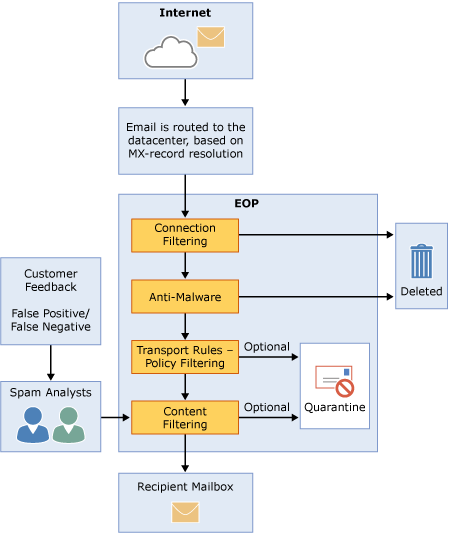

# Información general de Exchange Online Protection

Microsoft Exchange Online Protection (EOP) es un servicio de filtrado de correo basado en la nube que ayuda a proteger la organización frente al correo no deseado y el malware, e incluye características que protegen también frente al incumplimiento de las directivas de mensajería. EOP simplifica la administración del entorno de mensajes y puede aliviar muchas de las cargas asociadas al mantenimiento del software y el hardware local.
  
Estas son las principales formas en las que se puede usar EOP para la protección de mensajes:
  
- **En un escenario independiente** EOP ofrece protección de correo electrónico basada en la nube para su entorno de Microsoft Exchange Server 2013 local, versiones heredadas de Exchange Server, o cualquier otro local solución de correo electrónico SMTP. 
    
- **Como parte de Microsoft Exchange Online**: de manera predeterminada, EOP protege los buzones de Microsoft Exchange Online hospedados en la nube. 
    
- **En una implementación híbrida**: EOP se puede configurar para que proteja el entorno de mensajería y controle el enrutamiento del correo cuando se tiene una mezcla de buzones locales y en la nube. 
    
## Cómo funciona EOP

Para comprender el funcionamiento de EOP, es muy útil ver cómo se procesa el correo entrante:
  

  
Inicialmente, un mensaje entrante se pasa a través de filtrado de la conexión, que comprobaciones de reputación del remitente e inspecciona el mensaje de malware. La mayoría de correo no deseado es detenida en este momento y eliminar mediante la elevación de privilegios. Los mensajes se siguen a través del filtrado de directiva, donde se evalúan los mensajes con reglas de transporte personalizados que cree o aplicar a partir de una plantilla. Por ejemplo, puede tener una regla que envía una notificación a un administrador cuando llegue correo de un remitente específico. (Comprobaciones de prevención de pérdida de datos también se producen en este momento, si tiene que la característica; para obtener información acerca de la disponibilidad de la característica, vea la [Descripción del servicio Exchange Online Protection](https://go.microsoft.com/fwlink/p/?LinkId=320619).) A continuación, los mensajes pasan a través de filtrado de contenido, donde se comprueba contenido terminología o propiedades comunes a correo no deseado. Un mensaje determinado spam por el filtro de contenido se puede enviar a carpeta de correo electrónico no deseado de un usuario o a la cuarentena, entre otras opciones, en función de la configuración. Después de que un mensaje pase correctamente todas estas capas de protección, se entrega al destinatario.
  
### Centros de datos de EOP

EOP se ejecuta en una red mundial de centros de datos que están diseñados para proporcionar la mejor disponibilidad. Por ejemplo, si un centro de datos no está disponible, los mensajes de correo electrónico se enrutan automáticamente a otro centro de datos sin interrupciones del servicio. Los servidores de los centros de datos aceptan mensajes en nombre del usuario y disponen una capa de separación entre la organización e Internet, lo que permite reducir la carga en los servidores. Gracias a esta red de alta disponibilidad, Microsoft se asegura que el correo llegue a la organización de manera puntual. 
  
EOP realiza el equilibrio de carga entre los centros de datos, pero solo dentro de una región. Si está aprovisionado en una región, todos sus mensajes se procesarán usando el enrutamiento de correo de esa región. La siguiente lista muestra cómo funciona el enrutamiento regional de correo para los centros de datos de EOP:
  
- En el de los Estados Unidos, Exchange todos los Online buzones se encuentren en centros de datos de Estados Unidos, con la excepción de Sudamérica, donde se usan los centros de datos en Brasil y Chile y Canadá donde se usan los centros de datos en Canadá. Todos los mensajes de correo electrónico, incluidos los mensajes para los clientes de Sudamérica y Canadá, se enrutan a través de centros de datos de Estados Unidos para el filtrado de EOP; Sin embargo, correo electrónico de mensajes de correo puestos se almacena en el centro de datos donde se encuentra el inquilino..
    
- En Europa, Oriente Medio y África (EMEA), todos los buzones de Exchange Online están ubicados en centros de datos de EMEA, y todos los mensajes se enrutan a través de EMEA para el filtrado de EOP.
    
- En Asia Pacífico (APAC), todos los buzones de Exchange Online están ubicados en centros de datos de APAC, pero los mensajes se enrutan a través de centros de datos de EMEA para el filtrado de EOP. Está previsto que esto cambie en el cuarto trimestre de 2014, cuando los mensajes se enrutarán a través de centros de datos de APAC para el filtrado de EOP.
    
- Para la nube de la comunidad de organismos oficiales (GCC), todos los buzones de Exchange Online están ubicados en centros de datos de Estados Unidos y los mensajes se enrutan a través de centros de datos de Estados Unidos para el filtrado de EOP.
    
## Planes y características de EOP

A continuación se detallan los planes de suscripción de EOP disponibles:
  
- **EOP independiente**: EOP protege los buzones locales. 
    
- **Características de EOP en Exchange Online**: EOP protege los buzones de Exchange Online hospedados en la nube. 
    
- **Exchange Enterprise CAL con servicios** Donde EOP protege los buzones locales, tal como EOP independiente, e incluye prevención de pérdida de datos (DLP) e informes que usan servicios web. 
    
Para más información sobre los requisitos, límites importantes y disponibilidad de características en todos los planes de suscripción de EOP, vea la [Descripción de servicio Protección en línea de Exchange](https://go.microsoft.com/fwlink/p/?LinkId=320619).
  
## Configurar EOP

Configurar EOP puede ser fácil, especialmente en las compañías pequeñas con pocas reglas de cumplimiento. Sin embargo, si tiene una organización grande con muchos dominios, reglas de cumplimiento personalizadas o flujo de correo híbrido, la configuración puede llevar más tiempo e implicar más planeación.
  
Si ya ha comprado EOP, vea [Configurar un servicio de EOP](set-up-your-eop-service.md) para asegurarse de completar todos los pasos necesarios para configurar EOP de modo que proteja el entorno de mensajería. 
  
## Más información

[Características de EOP](eop-features.md)
  
[Vídeos de introducción a EOP](videos-for-getting-started-with-eop.md)
  
[Preguntas más frecuentes sobre EOP](eop-general-faq.md)
  
[Preguntas más frecuentes sobre mensajes devueltos, aplazados y en cola de EOP](eop-queued-deferred-and-bounced-messages-faq.md)
  
[Preguntas más frecuentes sobre administración delegada](delegated-administration-faq.md)
  
[Mover dominios y opciones de configuración de una organización de EOP a otra organización de EOP](move-domains-and-settings-from-one-eop-organization-to-another-eop-organization.md)
  

