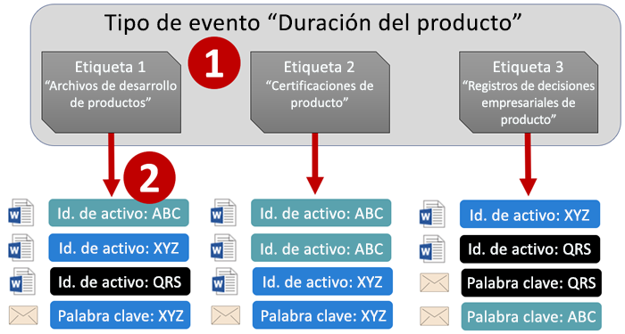
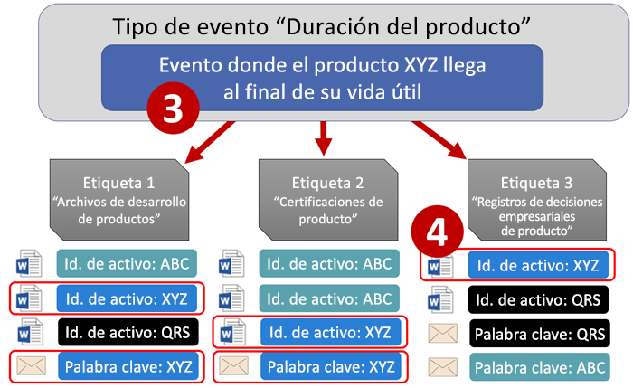
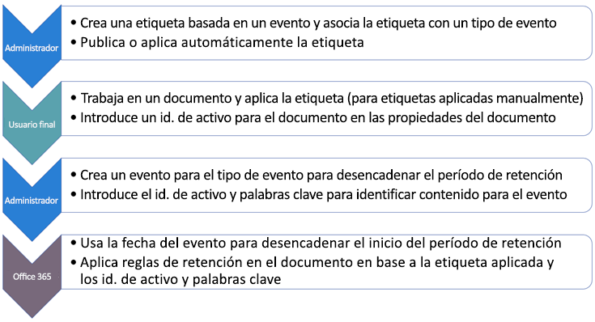
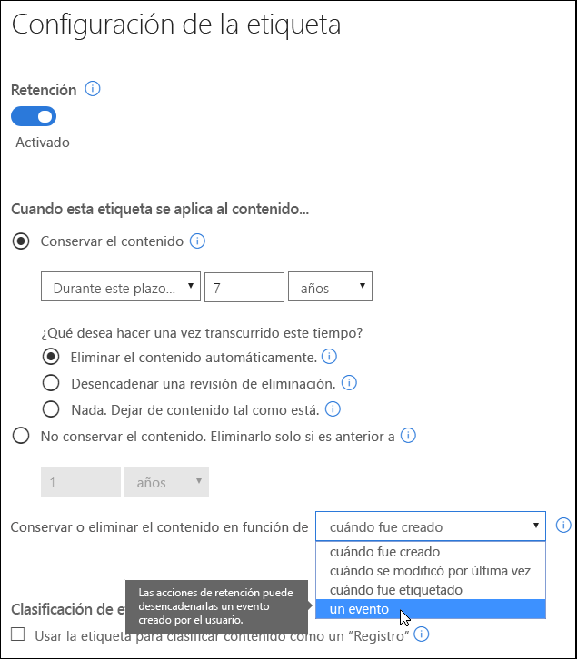
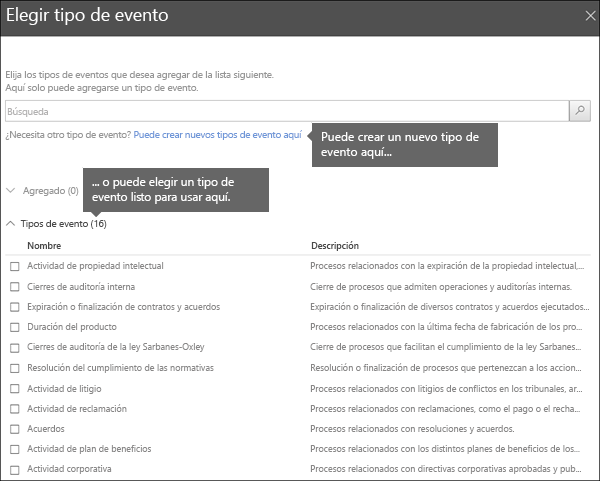
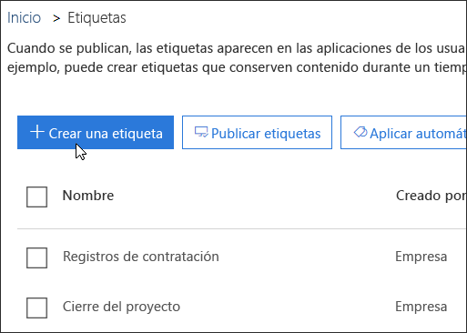
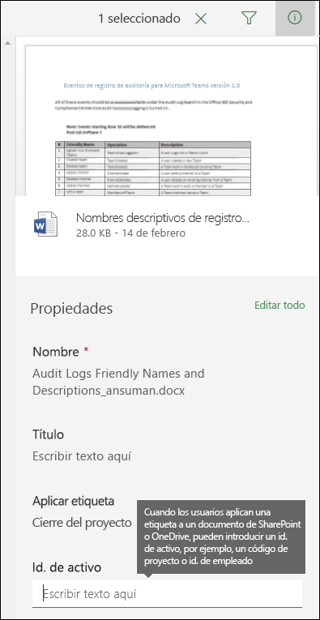
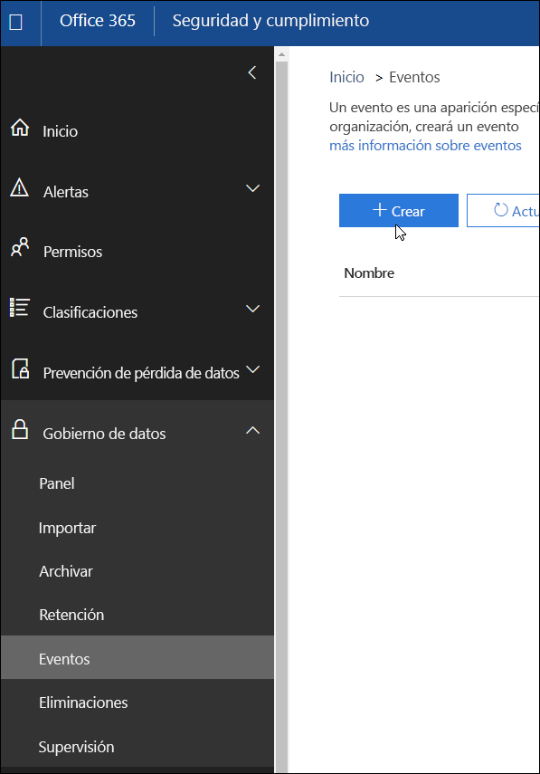
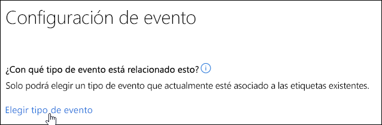
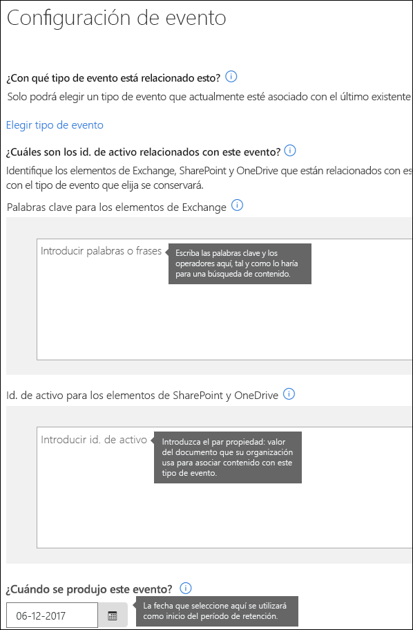

# Información general sobre la retención controlada por eventos

Al conservar contenido, el período de retención suele basarse en la antigüedad del contenido (por ejemplo, puede conservar documentos durante siete años después de su creación y eliminarlos cuando transcurra ese período). Pero, con las etiquetas en Office 365, también puede hacer que un período de retención se base en el momento en que se produzca un tipo específico de evento. El evento desencadena el inicio del período de retención y se exigirán las acciones de retención de etiqueta en todo el contenido que tenga aplicada una etiqueta para ese tipo de evento.
  
Por ejemplo, puede usar etiquetas con la retención controlada por eventos para:
  
- **Empleados que abandonen la organización** Imagine que necesita conservar los registros de los empleados durante 10 años desde el momento en que un empleado abandona la organización. Una vez transcurridos los 10 años, tendrán que eliminarse todos los documentos relacionados con la contratación, desempeño y terminación de ese empleado. El evento que desencadena el período de retención de 10 años es cuando el empleado abandona la organización. 
    
- **Expiración del contrato** Imagine que todos los registros relacionados con los contratos tienen que conservarse durante cinco años desde el momento en que expire el contrato. El evento que desencadena el período de retención de cinco años es la expiración del contrato. 
    
- **Vida útil del producto** Puede que su organización tenga requisitos de retención relacionados con la última fecha de fabricación de productos para contenido como especificaciones técnicas. En ese caso, la última fecha de fabricación es el evento que desencadena el período de retención. 
    
La retención controlada por eventos suele usarse como parte de un proceso de administración de registros. Esto quiere decir que:
  
- Las etiquetas basadas en eventos también suelen clasificar contenido como registros. Para obtener más información, vea [Usar Búsqueda de contenido para encontrar todo el contenido que tenga aplicada una etiqueta de retención específica](labels.md#using-content-search-to-find-all-content-with-a-specific-retention-label-applied-to-it).
    
- Un documento declarado como un registro, pero cuyo desencadenador de eventos aún no se produjo, se conserva de manera indefinida (los registros no se pueden eliminar de forma permanente), hasta que un evento desencadene el período de retención del documento.
    
- Las etiquetas basadas en eventos suelen desencadenar una revisión para eliminación al finalizar el período de retención, por lo que un administrador de registros puede revisar y eliminar el contenido de forma manual. Para obtener más información, vea [Información general sobre revisiones para eliminación](disposition-reviews.md).
    
Una etiqueta basada en un evento tiene las mismas funciones que cualquier etiqueta en Office 365. Para obtener más información, vea [Información general sobre las etiquetas](labels.md).
    
## Información sobre la relación entre tipos de evento, etiquetas, eventos e id. de activo

Para usar correctamente la retención controlada por eventos, es importante comprender la relación entre tipos de evento, etiquetas, eventos e id. de activo, como se muestra aquí. Encontrará una explicación después del diagrama.
  

  

  
1. Las etiquetas se crean para distintos tipos de contenido y, después, se asocian con un tipo de evento. Por ejemplo, las etiquetas para distintos tipos de registros y archivos de producto se asocian con un tipo de evento denominado “Vida útil del producto”, ya que esos registros tienen que conservarse durante 10 años desde el momento en que el producto alcanza el fin de vida.
    
2. Los usuarios (normalmente, administradores de registros) aplican esas etiquetas en el contenido y (para documentos de OneDrive y SharePoint), asignan un id. de activo a cada elemento. En este ejemplo, el id. de activo es un código o nombre de producto usado por la organización. Por lo tanto, se asigna una etiqueta a los registros de cada producto y, además, cada registro tiene una propiedad que contiene un id. de activo. El diagrama representa **todo el contenido** de todos los registros de productos de una organización, y cada elemento recibe el id. de activo del producto a cuyo registro pertenece. 
    
3. La vida útil del producto es el tipo de evento; un producto específico que llega al fin de vida es un evento. Cuando se produce este tipo de evento (en este caso, cuando un producto alcanza el fin de vida), creará un evento que especifique:
    
  - Un id. de activo (para documentos de OneDrive y SharePoint)
    
  - Palabras clave (para elementos de Exchange). En este ejemplo, la organización usa un código de producto en mensajes que contienen registros de productos, por lo que la palabra clave para los elementos de Exchange coincide con el id. de activo para documentos de OneDrive y SharePoint.
    
  - La fecha en que se produjo el evento. La fecha se usa como el inicio del período de retención. Esta fecha solo puede ser la fecha actual o una fecha futura, no una fecha pasada.
    
4. Después de crear un evento, esa fecha del evento se sincroniza con todo el contenido que tenga una etiqueta de ese tipo de evento y que contenga la palabra clave o el id. de activo especificado. Al igual que con cualquier etiqueta, puede tardar hasta siete días en sincronizarse. En el diagrama anterior, este evento desencadena el período de retención de todos los elementos rodeados con un círculo rojo (es decir, cuando este producto alcanza el fin de vida, el evento desencadena el período de retención de los registros del producto).
    
Es importante comprender que, si no especifica un id. de activo o palabras clave para un evento, el evento desencadenará el período de retención de **todo el contenido** con una etiqueta de ese tipo de evento. Esto quiere decir que, en el diagrama anterior, se empezaría a conservar todo el contenido. Es posible que esta no sea su intención. 
  
Por último, recuerde que cada etiqueta tiene su propia configuración de retención. En este ejemplo, todas especifican 10 años, pero puede que un evento desencadene etiquetas donde cada etiqueta tenga un período de retención distinto.
  
## Configurar la retención controlada por eventos

Este es el flujo de trabajo general para la retención controlada por eventos. Abajo, encontrará pasos más detallados.
  

  
### Paso 1: Crear una etiqueta cuyo período de retención se base en un evento

En el Centro de seguridad y cumplimiento, en el panel de navegación izquierdo, en **Clasificaciones**, seleccione **Etiquetas** \> **Crear una etiqueta**.
  
Al crear la etiqueta, active la retención y, después, seleccione la opción que se muestra abajo para conservar o eliminar el contenido basándose en un evento. Esto quiere decir que la configuración de retención no se aplicará hasta el paso 5, cuando cree un evento en la página **Eventos**. 
  
Tenga en cuenta que la retención controlada por eventos suele usarse para contenido clasificado como registro. Por este motivo, al crear etiquetas basándose en un evento, normalmente selecciona la opción **Usar etiqueta para clasificar contenido como un “registro”**.
  
Además, tenga en cuenta que la retención controlada por eventos necesita una configuración de retención que:
  
- Conserve el contenido.
    
- Elimine el contenido automáticamente o desencadene una revisión para eliminación al finalizar el período de retención.
    

  
### Paso 2: Seleccionar un tipo de evento para esa etiqueta

En la configuración de etiquetas, después de seleccionar la opción para basar la etiqueta en **un evento**, verá la opción para **Seleccionar un tipo de evento**. Un tipo de evento es simplemente una descripción general de un evento con el que quiera asociar una etiqueta.
  
Por ejemplo, si crea un tipo de evento denominado “Vida útil del producto”, creará etiquetas basadas en eventos con nombres que describan los tipos de contenido donde quiere que se apliquen las etiquetas, como “Archivos de desarrollo de productos” o “Registros de decisiones empresariales de producto”.
  
Tenga en cuenta que, después de seleccionar un tipo de evento y crear la etiqueta, el tipo de evento no se puede cambiar.
  

  
### Paso 3: Publicar o aplicar automáticamente una etiqueta

Al igual que cualquier etiqueta, necesita publicar o aplicar automáticamente una etiqueta basada en eventos para que se aplique en el contenido (de forma manual o automática). Para hacerlo, vaya a la página **Etiquetas**. Tenga en cuenta que las etiquetas que clasifican contenido como registro solo pueden publicarse y aplicarse de forma manual en el contenido; no se pueden aplicar automáticamente en el contenido. 
  

  
### Paso 4: Escribir un id. de activo

Después de aplicar una etiqueta controlada por eventos en contenido, puede especificar un id. de activo para cada elemento. Por ejemplo, su organización podría usar:
  
- Códigos de producto que puede usar para conservar contenido solo para un producto específico.
    
- Códigos de proyecto que puede usar para conservar contenido solo para un proyecto específico.
    
- Id. de empleado que puede usar para conservar contenido solo para una persona específica.
    
Tenga en cuenta que un id. de activo es simplemente otra propiedad de un documento en SharePoint y OneDrive para la Empresa. Es posible que su organización ya use otros id. y propiedades de documento para clasificar contenido. En ese caso, también puede usar esas propiedades y valores al crear un evento (vea el paso 6 abajo). El punto importante es que su organización tiene que usar una combinación de propiedad:valor en las propiedades del documento para asociar ese elemento con un tipo de evento.
  

  
### Paso 5: Crear un evento

Cuando se produzca una instancia específica de ese tipo de evento (por ejemplo, cuando un producto alcanza el fin de vida), vaya a la página Eventos del Centro de seguridad y cumplimiento, y cree un evento. Necesita crear el evento para desencadenarlo manualmente.
  

  
### Paso 6: Seleccionar el mismo tipo de evento usado por la etiqueta en el paso 2

Al crear el evento, seleccione el mismo tipo de evento usado por la etiqueta en el paso 2 (por ejemplo, “Vida útil del producto”). Solo se desencadenará el período de retención del contenido que tenga aplicadas etiquetas de ese tipo de evento.
  

  
### Paso 7: Escribir las palabras clave o un id. de activo

Ahora, para restringir el ámbito del contenido, especifique id. de activo para contenido de SharePoint y OneDrive, o bien palabras clave para contenido de Exchange. En el caso de los id. de activo, la retención solo se exigirá en contenido con el par especificado de propiedad:valor. Si no se especifica un id. de activo, se aplicará la misma fecha de retención en **todo el contenido** con etiquetas de ese tipo de evento. 
  
Tenga en cuenta que un id. de activo es simplemente otra propiedad de un documento en SharePoint y OneDrive para la Empresa. Si usa la propiedad “Id. de activo”, tendrá que especificar IdActivoCumplimiento:\<valor\> en el cuadro para los id. de activo que se muestran abajo.
  
Puede que su organización aplicara otras propiedades e id. en los documentos relacionados con ese tipo de evento. Por ejemplo, si necesita detectar los registros de un producto específico, el id. podría ser una combinación de la propiedad personalizada IdProducto y el valor “XYZ”. En este caso, escribiría IdProducto:XYZ en el cuadro “Id. de activo” que se muestra abajo.
  
En el caso de elementos de Exchange, puede incluir palabras clave. Puede restringir la consulta con operadores de búsqueda como AND, OR y NOT. Para obtener más información sobre los operadores, vea [Consultas de palabras clave y condiciones de búsqueda para Búsqueda de contenido](keyword-queries-and-search-conditions.md).
  
Por último, seleccione la fecha en que se produjo el evento; esta fecha se usará como el inicio del período de retención. Después de crear un evento, la fecha del evento se sincronizará con todo el contenido mediante una etiqueta de ese tipo de evento, id. de activo y palabras clave. Al igual que con cualquier etiqueta, puede tardar hasta siete días en sincronizarse.
  

  
## Usar Búsqueda de contenido para encontrar todo el contenido que tenga aplicada una etiqueta o id. de activo específicos

Después de asignar etiquetas a contenido (ya sea por los usuarios o aplicadas automáticamente), puede usar Búsqueda de contenido en el Centro de seguridad y cumplimiento para encontrar todo el contenido clasificado con un id. de activo específico.
  
Al crear una búsqueda de contenido:
  
- Para encontrar todo el contenido con una etiqueta específica, seleccione la condición **Etiqueta de cumplimiento** y, después, escriba el nombre de etiqueta completo o una parte del nombre de la etiqueta y use un comodín. 
    
- Para encontrar todo el contenido con un id. de activo específico, escriba la propiedad **IdActivoCumplimiento** y un valor (por ejemplo, IdActivoCumplimiento:\<valor\>). 
    
Para obtener más información, vea [Consultas de palabras clave y condiciones de búsqueda para Búsqueda de contenido](keyword-queries-and-search-conditions.md).
  
## Permisos

Para obtener acceso a la página **Eventos**, los revisores tienen que ser miembros de un grupo de roles con el rol **Administración de disposición** y rol **Registros de auditoría de solo vista**. Le recomendamos que cree un grupo de roles llamado Revisores de disposiciones, que agregue estos dos roles al grupo de roles y que, después, agregue miembros al grupo de roles. 
  
Para obtener más información, vea [Conceder acceso a los usuarios al Centro de seguridad y cumplimiento de Office 365](grant-access-to-the-security-and-compliance-center.md).
  
## Automatizar eventos con PowerShell

En el Centro de seguridad y cumplimiento de Office 365, solo se pueden crear eventos de forma manual (no se puede desencadenar automáticamente un evento cuando se produzca). Pero puede usar un script de PowerShell para automatizar la retención basada en eventos desde sus aplicaciones empresariales.
  
Actualmente, trabajamos con API para que pueda conectar sus aplicaciones empresariales (como aplicaciones financieras, de recursos humanos o CRM) a la retención controlada por eventos. Por ejemplo, podrá conectar su sistema de recursos humanos a la retención controlada por eventos de forma que, cuando un empleado abandone la organización, se desencadene automáticamente un evento de ese tipo de evento.
  
Hasta entonces, estos son los cmdlet de PowerShell disponibles para la retención controlada por eventos:
  
- [Get-ComplianceRetentionEventType](https://go.microsoft.com/fwlink/?linkid=873002)
    
- [New-ComplianceRetentionEventType](https://go.microsoft.com/fwlink/?linkid=873004)
    
- [Remove-ComplianceRetentionEventType](https://go.microsoft.com/fwlink/?linkid=873005)
    
- [Set-ComplianceRetentionEventType](https://go.microsoft.com/fwlink/?linkid=873006)
    
- [Get-ComplianceRetentionEvent](https://go.microsoft.com/fwlink/?linkid=873001)
    
- [New-ComplianceRetentionEvent](https://go.microsoft.com/fwlink/?linkid=873003)
    

