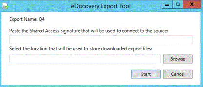

# Exportar resultados en Office 365 Advanced eDiscovery

> [!NOTE]
> Para usar eDiscovery avanzado, su organización necesita una suscripción de Office 365 E3 con el complemento Cumplimiento avanzado, o bien una suscripción de E5. Si no tiene ese plan y quiere probar eDiscovery avanzado, puede [registrarse para una prueba de Office 365 Enterprise E5](https://go.microsoft.com/fwlink/p/?LinkID=698279). 
  
En este tema se describen las opciones avanzadas de configuración de la exportación de exhibición de documentos electrónicos.
  
 **En este tema:**
  
- [Definición de lotes y sesiones de exportación](export-results-in-advanced-ediscovery.md#BK_Define)
    
- [Exportaciones incrementales y adicionales](export-results-in-advanced-ediscovery.md#BK_IncrementalReports)
    
- [Configurar parámetros de exportación de lote](export-results-in-advanced-ediscovery.md#BK_SetUpExport)
    
- [Exportar archivos de salida del informe](export-results-in-advanced-ediscovery.md#BK_ExportOutputFIles)
    
## Definición de lotes y sesiones de exportación

Un lote de exportación permite el procesamiento de exportación con un conjunto de parámetros definidos. La exhibición avanzada de documentos electrónicos permite definir los lotes para personalizar cada exportación.
  
Los parámetros se definen por lote de exportación. De forma predeterminada, se crea un lote denominado "Export batch 01" para el primer lote de un caso. También puede editar el nombre y la descripción del lote.
  
Una sesión de exportación es una ejecución de una exportación avanzada de eDiscovery dentro de un lote de exportación.
  
## Exportaciones incrementales y adicionales

Puede ejecutar varias sesiones de exportación en un lote de exportación para garantizar resultados coherentes en función de la misma plantilla y parámetros de exportación. Para cada sesión dentro de un lote, puede exportar análisis para los datos de casos recién procesados y procesar cada uno de ellos de manera incremental.
  
Para poder exportar con un conjunto de parámetros diferente, primero debe crear un nuevo lote. La primera sesión del nuevo lote producirá los resultados de los archivos procesados en el caso hasta el momento, de si estos archivos se importaron y procesaron en una o varias importaciones. Cada lote recalcula las tablas dinámicas, la similitud, los inclusivos, etc. Las sesiones usan los parámetros definidos para el lote y no recalculan las tablas dinámicas, similitudes, inclusivas, etc. para cada ejecución de sesión.
  
Por ejemplo, supongamos que se ha importado un caso y se han analizado sus datos. Para recuperar los resultados Near-duplicados y subprocesos de correo electrónico para los datos incrementales, haga clic en **crear sesión de exportación** en el mismo lote que se usó previamente para exportar datos. 
  
## Configurar parámetros de exportación de lote

La herramienta de exportación de exhibición de documentos electrónicos se usa para exportar los resultados de búsqueda de eDiscovery avanzado en el equipo local. Para aumentar el rendimiento de la transferencia de datos y acelerar el proceso de exportación, puede configurar una configuración del registro de Windows en el equipo que use para exportar los resultados de la búsqueda. Si quiere aumentar la velocidad de descarga, configure la configuración del registro antes de configurar los parámetros de exportación. Para obtener más información, consulte [aumentar la velocidad de descarga al exportar resultados de la búsqueda de exhibición de documentos electrónicos de Office 365](increase-download-speeds-when-exporting-ediscovery-results.md).
  
1. En eDiscovery avanzado, seleccione un caso y haga clic en **exportar** \> **configuración**.
    
    - En la lista **exportar lote** , seleccione el nombre del lote o exportar resultados al lote de exportación 01, (el lote predeterminado). 
    
    - Para exportar los resultados de los nuevos archivos que agregó a un caso existente, continúe con el lote actual. Para crear una sesión en el lote, seleccione el mismo número de lote y haga clic en **crear sesión de exportación** puede usar esta opción para exportar los mismos parámetros que el lote anterior, de forma incremental. 
    
    - Para exportar a un nuevo lote, haga **** icono Agregar y escriba un nuevo nombre en **nombre de lote** (o acepte el valor predeterminado) y una descripción en **Descripción del lote**. Haga clic en **Aceptar**.
    
    - Para editar un nombre de lote o una descripción, seleccione el nombre en **lote de exportación**, haga](media/3d613660-7602-4df2-bdb9-14e9ca2f9cf2.png)clic en **Editar** ![icono Editar y, a continuación, modifique los campos.
    
      > [!NOTE]
      > Después de ejecutar sesiones para un lote de exportación, no se pueden eliminar. Además, solo algunos parámetros pueden editarse una vez ejecutada la primera sesión. 
  
    - Para crear un lote de exportación duplicado ****  icono de exportación de lote duplicado y escriba un nombre y una descripción para el lote duplicado en el panel. 
    
    - Para eliminar un lote de exportación, elija **eliminar** .
    
    - Para ver el historial de un lote, seleccione icono de historial de vista de **historial por lotes** .
    
2. En **** rellenar, seleccione **incluir solo los archivos por encima de la puntuación de recorte de relevancia** o refinar el **lote de exportación** si desea ajustar la configuración del lote de exportación. 
    
3. Si selecciona **incluir sólo los archivos con una puntuación de recorte de relevancia superior**, el **problema** está habilitado. Si la puntuación de relevancia del archivo es superior a la puntuación de corte del problema seleccionado, el archivo se exportará a menos que el filtro "para revisión" lo excluya. 
  
    Si selecciona refinar **lote de exportación**, los botones de opción desduplicación y filtrar por ' para revisión ' están habilitados. **** Si elige la **** desduplicación, los archivos duplicados se filtrarán de acuerdo con la Directiva definida [tipo de caso (valor predeterminado): de cada conjunto de archivos duplicados en todo el caso, todos menos un archivo se desduplicarán. Nivel de custodio: desde cada conjunto de archivos duplicados del custodio, se desduplicarán todos los archivos menos uno.] La salida de exportación contiene un registro de todos los archivos duplicados. Si elige **filtrar por ' para revisión '** , seleccione **modificar en metadatos** para escribir la configuración del campo **' para revisión '** . Seleccione **incluir archivos de entrada** para incluir los archivos de origen en el contenido del paquete. Puede desactivar esta opción para acelerar el proceso de exportación. Tenga en cuenta que los archivos nativos se exportarán en cualquier caso. 
    
4. En **metadatos**, seleccione entre las siguientes opciones de la lista **exportar plantilla** (una vez por sesión). 
    
    - **Standard**: conjunto básico de elementos de datos, metadatos y propiedades. Use esta opción si ya se procesó la importación de datos en eDiscovery avanzado y los datos de exportación se cargan en un sistema que ya contiene los archivos. De forma predeterminada, las columnas de plantilla de exportación se crean y se rellenan.
    
    - **All**: conjunto completo de metadatos estándar, incluidos todos los datos de procesamiento, así como los resultados del análisis y la relevancia. Esta plantilla es necesaria cuando la exhibición avanzada de documentos electrónicos realiza el procesamiento y los datos de archivos se cargan en un sistema externo por primera vez.
    
    - **Problemas**: seleccione **todos los problemas** o seleccione un asunto concreto que haya creado. 
    
5. En **destino**:
    
    - **Descargar en el equipo local**
    
    - **Exportar a un BLOB de Azure definido por el usuario**: Si esta casilla está activada, puede especificar una dirección URL de contenedor y un token de SAS.
    
      > [!NOTE]
      > Una vez que un paquete de exportación se almacena en el BLOB de Azure definido por el usuario, los datos ya no se administran mediante la exhibición avanzada de documentos electrónicos; se administra mediante el BLOB de Azure. Esto significa que, al eliminar el caso, los archivos exportados seguirán en el BLOB de Azure. 
  
    - **Guardar token de SAS para sesión de exportación en el futuro**: si se activa, el token de SAS se cifrará en la base de datos interna de eDiscovery avanzado para su uso en el futuro.
    
      > [!NOTE]
      > Actualmente, el token de SAS expira después de un mes. Si intenta descargar después de más de un mes, deshaga la última sesión y, a continuación, vuelva a exportar. 
  
6. Haga clic en **modificar** para establecer la configuración del campo ' para revisión '. 
    
    
  
   - En **configuración del campo para revisión**, en la lista desplegable **seleccionar escenario** , seleccione el escenario y el ámbito de la revisión. La configuración se muestra en función de la selección.
    
      - **Revisar todos los** (valor predeterminado): todos los correos electrónicos, datos adjuntos y documentos están seleccionados de forma predeterminada. 
    
      - **Revise todo el contenido único de un conjunto**: inclusivas y copias inclusivas inclusivas, datos adjuntos únicos en el nivel del conjunto de correo electrónico, representativo de cada conjunto de duplicados exactos.
    
      - **Revisar todo el contenido único en un conjunto: sin copias inclusivas**: inclusivas, datos adjuntos únicos en el nivel del conjunto de correo electrónico, representativo de cada conjunto de duplicados exactos.
    
      - **Revise el contenido único y los archivos de la familia relacionados**: inclusivos, datos adjuntos únicos en el nivel del conjunto de correo electrónico, representativo de cada conjunto de duplicados exactos, expandir para incluir los archivos de la familia.
    
      - **Personalizado** (permite definir las opciones en el cuadro de diálogo): el valor predeterminado es mantener las selecciones actuales y habilitar todas las opciones de cuadro de diálogo, para permitir su selección. Si selecciona esta opción, puede personalizar la configuración de los correos electrónicos, documentos, datos adjuntos y varios.
    
    - En **correos electrónicos**, seleccione los correos electrónicos que desea exportar.
    
      - **Todos los mensajes de correo electrónico**: (valor predeterminado) todos los correos electrónicos están seleccionados.
    
      - **Inclusivas**: un correo electrónico inclusivo es el último correo electrónico de un hilo y contiene todos los demás mensajes del hilo.
    
      - **Inclusivas y copias inclusivas**inclusivas: copias inclusivas e inclusivas con el mismo asunto, cuerpo y datos adjuntos; las copias inclusivas exclusivas son copias únicas de estos correos electrónicos.
    
    - En **documentos**, seleccione los documentos que desea exportar. 
    
      - **Todos los documentos**: (valor predeterminado) se seleccionan todos los documentos.
    
      - **Pivotes**: un archivo elegido como representativo del conjunto Near-duplicados, que se usa normalmente como la línea base al revisar el conjunto.
    
      - **Representativo de cada conjunto de duplicados**exactos: archivos Near-duplicados únicos (incluido el pivote).
    
    - En **datos**adjuntos, seleccione los datos adjuntos que desea exportar. 
    
      - **Todos los datos**adjuntos: (valor predeterminado) se seleccionan todos los datos adjuntos.
    
      - **Datos adjuntos únicos en el nivel de caso**: archivos de datos adjuntos únicos en el caso especificado.
    
      - **Datos adjuntos únicos en el nivel del conjunto de correo electrónico**: archivos adjuntos únicos en el caso de correo electrónico especificado.
    
   - En**Micellaneous**, puede optar por **tratar los datos adjuntos como documentos**, **tratar los correos electrónicos como documentos**o **expandir para incluir archivos de la familia**. Si elige **expandir para incluir los archivos**de la familia, para cada archivo que se marque para revisión, todos los archivos de la misma familia también se marcarán.
    
7. Elija **Guardar** para guardar la configuración. 
    
8. Después de especificar los parámetros de exportación, para iniciar exportar lote, haga clic en **crear sesión de exportación**.
    
    Durante la exportación, el estado se muestra en estado de la **tarea**. Los resultados se muestran en el **Resumen de exportación**.
    
9. En la ventana **descargar archivos** , haga clic en **copiar al** portapapeles para copiar la clave de exportación. 
    
    
  
10. Haga clic en **Cerrar**. 
    
    Se ha iniciado la herramienta de exportación de exhibición de documentos electrónicos.
    
    
  
11. En la **herramienta de exportación de exhibición**de documentos electrónicos:
    
    -  En **pegar la firma de acceso compartido que se usará para conectarse al origen**, pegue la clave de exportación que youcopied en el Portapapeles del paso 7.
    
    - Haga clic en **examinar** para seleccionar la ubicación de destino para almacenar los archivos de exportación descargados en el equipo local. 
    
    - Haga clic en **iniciar**. Los archivos de exportación se descargan en el equipo local. Si eligió **exportar a Azure BLOB definido por el usuario** en el paso 4, la sesión se exportará a un destino de dirección URL de almacenamiento de blobs de su elección.
    
Para obtener una descripción completa de los campos en el informe de exportación, consulte [Export](export-report-fields-in-advanced-ediscovery.md)Report Fields.
  
## Exportar archivos de salida del informe

En la siguiente tabla se enumeran los archivos de salida que se generan al ejecutar un lote de exportación.
  
|**Nombre de archivo**|**Tipo de archivo**|**Descripción**|
|:-----|:-----|:-----|
|Resumen de exportación    |CSV    |Un archivo de registro generado por la herramienta de exportación de exhibición de documentos electrónicos.    |
|Seguimiento    |txt    |Un archivo de registro generado por la herramienta de exportación de exhibición de documentos electrónicos.    |
|Archivos de texto extraídos    |Carpeta de archivos    |Carpeta que contiene los archivos de texto extraídos de los archivos exportados.    |
|Archivos de entrada o nativos    |Carpeta de archivos    |Carpeta que contiene los archivos nativos y de entrada de los archivos exportados.    |
|Exportar lista    |xlsx    |Metadatos de archivos exportados en formato xlsx. Los campos de los archivos se encuentran en función de la plantilla que el usuario selecciona para exportar. Si es necesario, se crean varios archivos, cada uno de los cuales contiene 100 150K filas. Si un valor determinado contiene más caracteres de los que puede contener una celda de Excel (actualmente, el límite es de 32.767 caracteres), el valor se recortará hasta la longitud máxima permitida. Si se recorta un valor, el color de fondo de la celda es rojo para indicarlo al usuario. " Los participantes del correo electrónico "son un ejemplo de un campo que puede superar el límite de longitud, si el correo electrónico se envió a una distribución grande. Consulte [exportar campos de informe](export-report-fields-in-advanced-ediscovery.md) para obtener más información sobre los campos de salida.    |
|Cargar archivo    |CSV    |Metadatos de archivos exportados en formato CSV para cargar en una aplicación diferente. Los campos de los archivos se encuentran en función de la plantilla que el usuario selecciona para exportar.    |
|Indicador de operación correcta    |txt    |Solo se crea al exportar a un BLOB de Azure de terceros. Si la exportación se realizó completamente, se creará el archivo. En caso de error, o parcialmente correcta, no se creará el archivo. El archivo se creará en la carpeta raíz, lo que permite el seguimiento automatizado en diferentes Estados de sesiones y lotes de exportación. Se trata de un archivo vacío. Su nombre es: TenantId_CaseId_ExternalCaseId_CaseName_ExportBatchId_SessionId_DateTime. txt.    |
   
## Vea también

[eDiscovery avanzado de Office 365](office-365-advanced-ediscovery.md)
  
[Ver el historial del lote y exportar los resultados anteriores](view-batch-history-and-export-past-results.md)
  
[Configuración rápida de eDiscovery avanzado de Office 365](quick-setup-for-advanced-ediscovery.md)

[Exportar campos de informes](export-report-fields-in-advanced-ediscovery.md)
  
[Aumentar la velocidad de descarga al exportar resultados de búsqueda de exhibición de documentos electrónicos de Office 365](increase-download-speeds-when-exporting-ediscovery-results.md)

