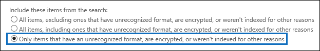

# <a name="export-content-search-results-from-the-office-365-security--compliance-center"></a><span data-ttu-id="c606e-105">Exportar los resultados de la búsqueda de contenido desde el centro de cumplimiento y seguridad de Office 365</span><span class="sxs-lookup"><span data-stu-id="c606e-105">Export Content Search results from the Office 365 Security & Compliance Center</span></span>

<span data-ttu-id="c606e-p102">Después de ejecutar correctamente una búsqueda de contenido, puede exportar los resultados de búsqueda a un equipo local. Al exportar los resultados de correo electrónico, se descargan en el equipo como archivos PST. Al exportar contenido de SharePoint y OneDrive para sitios de negocio, se exportan copias de los documentos de Office nativos. Hay otros documentos e informes que se incluyen con los resultados de búsqueda exportado.</span><span class="sxs-lookup"><span data-stu-id="c606e-p102">After a Content Search is successfully run, you can export the search results to a local computer. When you export email results, they're downloaded to your computer as PST files. When you export content from SharePoint and OneDrive for Business sites, copies of native Office documents are exported. There are additional documents and reports that are included with the exported search results.</span></span>
  
<span data-ttu-id="c606e-p103">Además, todos los mensajes de correo electrónico cifrados de RMS que se incluyen en los resultados de una búsqueda de contenido se descifrarán al exportar (como los mensajes individuales). Esta capacidad de descifrado está habilitada de forma predeterminada para los miembros del grupo de roles de administrador de exhibición de documentos electrónicos. Esto es debido a que la función de administración de RMS descifrar se asigna a este grupo de funciones. Al exportar los resultados de búsqueda, vea la sección [más información](#more-information) para obtener información detallada acerca de descifrado de RMS.</span><span class="sxs-lookup"><span data-stu-id="c606e-p103">Additionally, any RMS-encrypted email messages that are included in the results of a Content Search will be decrypted when you export them (as individual messages). This decryption capability is enabled by default for members of the eDiscovery Manager role group. This is because the RMS Decrypt management role is assigned to this role group. See the [More information](#more-information) section for details about RMS decryption when you export search results.</span></span> 
  
<span data-ttu-id="c606e-114">Exportar los resultados de una búsqueda de contenido implica la preparación de los resultados y, a continuación, los descarga en un equipo local.</span><span class="sxs-lookup"><span data-stu-id="c606e-114">Exporting the results of a Content Search involves preparing the results, and then downloading them to a local computer.</span></span>
  
## <a name="before-you-begin"></a><span data-ttu-id="c606e-115">Antes de empezar</span><span class="sxs-lookup"><span data-stu-id="c606e-115">Before you begin</span></span>

- <span data-ttu-id="c606e-p104">Para exportar los resultados de búsqueda, tiene que tener asignado el rol de administración de exportación de la seguridad de Office 365 &amp; centro de cumplimiento. Esta función se asigna al grupo de roles de administrador de exhibición de documentos electrónicos integrados. No se asigna de forma predeterminada al grupo de funciones de administración de la organización. Para obtener más información, vea [asignar permisos de exhibición de documentos electrónicos en la seguridad de Office 365 &amp; centro de cumplimiento](assign-ediscovery-permissions.md).</span><span class="sxs-lookup"><span data-stu-id="c606e-p104">To export search results, you have to be assigned the Export management role in the Office 365 Security &amp; Compliance Center. This role is assigned to the built-in eDiscovery Manager role group. It isn't assigned by default to the Organization Management role group. For more information, see [Assign eDiscovery permissions in the Office 365 Security &amp; Compliance Center](assign-ediscovery-permissions.md).</span></span>
    
- <span data-ttu-id="c606e-120">El equipo que use para exportar los resultados de búsqueda debe cumplir los siguientes requisitos del sistema:</span><span class="sxs-lookup"><span data-stu-id="c606e-120">The computer you use to export the search results has to meet the following system requirements:</span></span>
    
  - <span data-ttu-id="c606e-121">Versiones de 32 o 64 bits de Windows 7 y versiones posteriores</span><span class="sxs-lookup"><span data-stu-id="c606e-121">32- or 64-bit versions of Windows 7 and later versions</span></span>
    
  - <span data-ttu-id="c606e-122">Microsoft .NET Framework 4.7</span><span class="sxs-lookup"><span data-stu-id="c606e-122">Microsoft .NET Framework 4.7</span></span>
    
  - <span data-ttu-id="c606e-123">Un explorador compatible:</span><span class="sxs-lookup"><span data-stu-id="c606e-123">A supported browser:</span></span>
    
     - <span data-ttu-id="c606e-124">Microsoft Edge</span><span class="sxs-lookup"><span data-stu-id="c606e-124">Microsoft Edge</span></span>
    
        <span data-ttu-id="c606e-125">O BIEN</span><span class="sxs-lookup"><span data-stu-id="c606e-125">OR</span></span>
    
     - <span data-ttu-id="c606e-126">Microsoft Internet Explorer 10 y versiones posteriores</span><span class="sxs-lookup"><span data-stu-id="c606e-126">Microsoft Internet Explorer 10 and later versions</span></span>
    
    <span data-ttu-id="c606e-p105">**Nota:** Microsoft no fabrica las extensiones de terceros o complementos para las aplicaciones ClickOnce. No se admite la exportación de resultados de búsqueda mediante un explorador no compatible con las extensiones de terceros o los complementos.</span><span class="sxs-lookup"><span data-stu-id="c606e-p105">**Note:** Microsoft doesn't manufacture third-party extensions or add-ons for ClickOnce applications. Exporting search results using an unsupported browser with third-party extensions or add-ons isn't supported.</span></span> 
    
- <span data-ttu-id="c606e-p106">Al descargar los resultados de búsqueda (que se describe en el paso 2), puede aumentar la velocidad de descarga mediante la configuración de una configuración del registro de Windows en el equipo que utilice para exportar los resultados de búsqueda. Para obtener más información, vea [aumentar la velocidad de descarga al exportar los resultados de búsqueda de exhibición de documentos electrónicos de Office 365](increase-download-speeds-when-exporting-ediscovery-results.md).</span><span class="sxs-lookup"><span data-stu-id="c606e-p106">When you download search results (described in Step 2), you can increase the download speed by configuring a Windows Registry setting on the computer you use to export the search results. For more information, see [Increase the download speed when exporting eDiscovery search results from Office 365](increase-download-speeds-when-exporting-ediscovery-results.md).</span></span>
    
- <span data-ttu-id="c606e-p107">Al exportar los resultados de búsqueda, se almacenan temporalmente los datos en una ubicación de almacenamiento de Microsoft Azure única en la nube de Microsoft antes de se descarga en el equipo local. Asegúrese de que la organización puede conectarse al extremo en Azure, que es \*\* \*. blob.core.windows.net\*\* (el carácter comodín representa un identificador único para la exportación). Los datos de los resultados de la búsqueda se eliminan de la ubicación de almacenamiento de Azure dos semanas después de crearla.</span><span class="sxs-lookup"><span data-stu-id="c606e-p107">When you export search results, the data is temporarily stored in a unique Microsoft Azure storage location in the Microsoft cloud before it's downloaded to your local computer. Be sure your organization can connect to the endpoint in Azure, which is **\*.blob.core.windows.net** (the wildcard represents a unique identifier for your export). The search results data is deleted from the Azure storage location two weeks after it's created.</span></span> 
    
- <span data-ttu-id="c606e-p108">Si su organización usa un servidor proxy para comunicarse con Internet, debe definir la configuración del servidor proxy en el equipo que utilice para exportar los resultados de búsqueda (de manera que la herramienta de exportación se puede autenticar con el servidor proxy). Para ello, abra el archivo *machine.config* en la ubicación que coincida con su versión de Windows.</span><span class="sxs-lookup"><span data-stu-id="c606e-p108">If your organization uses a proxy server to communicate with the Internet, you need to define the proxy server settings on the computer that you use to export the search results (so the export tool can be authenticated by your proxy server). To do this, open the  *machine.config*  file in the location that matches your version of Windows.</span></span> 
    
  - <span data-ttu-id="c606e-136">**32-bit** - `%windir%\Microsoft.NET\Framework\[version]\Config\machine.config`</span><span class="sxs-lookup"><span data-stu-id="c606e-136">**32-bit** - `%windir%\Microsoft.NET\Framework\[version]\Config\machine.config`</span></span>
    
  - <span data-ttu-id="c606e-137">**64 bits** - `%windir%\Microsoft.NET\Framework64\[version]\Config\machine.config`</span><span class="sxs-lookup"><span data-stu-id="c606e-137">**64-bit** - `%windir%\Microsoft.NET\Framework64\[version]\Config\machine.config`</span></span>
    
    <span data-ttu-id="c606e-p109">Agregue las siguientes líneas al archivo *machine.config* en algún lugar entre la `<configuration>` y `</configuration>` etiquetas. Asegúrese de reemplazar `ProxyServer` y `Port` con los valores correctos para su organización; Por ejemplo, `proxy01.contoso.com:80` .</span><span class="sxs-lookup"><span data-stu-id="c606e-p109">Add the following lines to the  *machine.config*  file somewhere between the  `<configuration>` and  `</configuration>` tags. Be sure to replace  `ProxyServer` and  `Port` with the correct values for your organization; for example,  `proxy01.contoso.com:80` .</span></span> 
    
    ```
    <system.net>
       <defaultProxy enabled="true" useDefaultCredentials="true">
         <proxy proxyaddress="http://ProxyServer :Port " 
                usesystemdefault="False" 
                bypassonlocal="True" 
                autoDetect="False" />
       </defaultProxy>
    </system.net>
    ```

- <span data-ttu-id="c606e-140">Vea la sección para obtener una descripción de los límites para exportar los resultados de búsqueda.</span><span class="sxs-lookup"><span data-stu-id="c606e-140">See the  section for a description of the limits for exporting search results.</span></span> 
    
- <span data-ttu-id="c606e-p110">El tamaño máximo de un archivo PST que se puede exportar es 10 GB. Si desea cambiar este tamaño predeterminado, puede editar el registro de Windows en el equipo que utilice para exportar los resultados de búsqueda. Vea [cambiar el tamaño de los archivos PST al exportar los resultados de búsqueda de exhibición de documentos electrónicos](change-the-size-of-pst-files-when-exporting-results.md).</span><span class="sxs-lookup"><span data-stu-id="c606e-p110">The maximum size of a PST file that can be exported is 10 GB. If you want to change this default size, you can edit the Windows Registry on the computer that you use to export the search results. See [Change the size of PST files when exporting eDiscovery search results](change-the-size-of-pst-files-when-exporting-results.md).</span></span>
    
## <a name="step-1-prepare-search-results-for-export"></a><span data-ttu-id="c606e-144">Paso 1: Preparar los resultados de búsqueda para la exportación</span><span class="sxs-lookup"><span data-stu-id="c606e-144">Step 1: Prepare search results for export</span></span>

<span data-ttu-id="c606e-p111">El primer paso consiste en preparar los resultados de búsqueda para la exportación. Cuando se preparan los resultados, se cargan en una ubicación de almacenamiento de Azure en la nube de Microsoft. Tenga en cuenta que el contenido de los buzones de correo y los sitios se carga a una velocidad máxima de 2 GB por hora.</span><span class="sxs-lookup"><span data-stu-id="c606e-p111">The first step is to prepare the search results for exporting. When you prepare results, they are uploaded to an Azure storage location in the Microsoft cloud. Note that content from mailboxes and sites is uploaded at a maximum rate of 2 GB per hour.</span></span>
  
1. <span data-ttu-id="c606e-148">Vaya a [https://protection.office.com](https://protection.office.com).</span><span class="sxs-lookup"><span data-stu-id="c606e-148">Go to [https://protection.office.com](https://protection.office.com).</span></span>
    
2. <span data-ttu-id="c606e-149">Inicie sesión en Office 365 con su cuenta profesional o educativa.</span><span class="sxs-lookup"><span data-stu-id="c606e-149">Sign in to Office 365 using your work or school account.</span></span>
    
3. <span data-ttu-id="c606e-150">En el panel izquierdo del Centro de seguridad y cumplimiento, haga clic en **Búsqueda e investigación** \> **Búsqueda de contenido**.</span><span class="sxs-lookup"><span data-stu-id="c606e-150">In the left pane of the Security &amp; Compliance Center, click **Search &amp; investigation** \> **Content search**.</span></span>
    
4. <span data-ttu-id="c606e-151">En la página de **búsqueda de contenido** , seleccione una búsqueda.</span><span class="sxs-lookup"><span data-stu-id="c606e-151">On the **Content search** page, select a search.</span></span> 
    
5. <span data-ttu-id="c606e-152">En el panel de detalles, en **Exportar resultados a un equipo**, haga clic en **Iniciar la exportación**.</span><span class="sxs-lookup"><span data-stu-id="c606e-152">In the details pane, under **Export results to a computer**, click **Start export**.</span></span>
    
    > [!NOTE]
    > <span data-ttu-id="c606e-p112">Si los resultados de una búsqueda son de hace más de 7 días, se le solicitará que actualice los resultados de búsqueda. Si esto ocurre, cancele la exportación, haga clic en **Actualizar los resultados de búsqueda** en el panel de detalles para la búsqueda seleccionada y, a continuación, inicie la exportación de nuevo después de que se actualicen los resultados. </span><span class="sxs-lookup"><span data-stu-id="c606e-p112">If the results for a search are older than 7 days, you are prompted to update the search results. If this happens, cancel the export, click **Update search results** in the details pane for the selected search, and then start the export again after the results are updated.</span></span> 
  
6. <span data-ttu-id="c606e-155">En la página **exportar los resultados de búsqueda** , en **incluir estos elementos de la búsqueda**, elija una de las siguientes opciones:</span><span class="sxs-lookup"><span data-stu-id="c606e-155">On the **Export the search results** page, under **Include these items from the search**, choose one of the following options:</span></span>
    
    - <span data-ttu-id="c606e-156">Exportar solo los elementos indexados</span><span class="sxs-lookup"><span data-stu-id="c606e-156">Export only indexed items</span></span>
    
    - <span data-ttu-id="c606e-157">Exportar elementos indizados y parcialmente indizados</span><span class="sxs-lookup"><span data-stu-id="c606e-157">Export indexed and partially indexed items</span></span>
    
    - <span data-ttu-id="c606e-158">Exportar sólo los elementos indizados parcialmente</span><span class="sxs-lookup"><span data-stu-id="c606e-158">Export only partially indexed items</span></span>
    
    <span data-ttu-id="c606e-p113">Vea la sección [obtener más información](#more-information) para obtener una descripción acerca de los elementos indizados cómo parcialmente se exportan. Para obtener más información acerca de los elementos indizados parcialmente, vea [parcialmente indizar los elementos de búsqueda de contenido](partially-indexed-items-in-content-search.md).</span><span class="sxs-lookup"><span data-stu-id="c606e-p113">See the [More information](#more-information) section for a description about how partially indexed items are exported. For more information about partially indexed items, see [Partially indexed items in Content Search](partially-indexed-items-in-content-search.md).</span></span>
    
7. <span data-ttu-id="c606e-161">En el **contenido de Exchange exportar como**, elija una de las siguientes opciones:</span><span class="sxs-lookup"><span data-stu-id="c606e-161">Under **Export Exchange content as**, choose one of the following options:</span></span>
    
    - <span data-ttu-id="c606e-p114">**Archivo PST uno para cada buzón** - exporta un archivo PST para cada buzón de usuario que contiene los resultados de búsqueda. Los resultados de buzón de archivo del usuario se incluyen en el mismo archivo PST. Tenga en cuenta que esta opción reproduce la estructura de carpetas de buzón de correo del buzón de origen.</span><span class="sxs-lookup"><span data-stu-id="c606e-p114">**One PST file for each mailbox** - Exports one PST file for each user mailbox that contains search results. Any results from the user's archive mailbox are included in the same PST file. Note that this option reproduces the mailbox folder structure from the source mailbox.</span></span> 
    
    - <span data-ttu-id="c606e-p115">**Archivo PST uno que contiene todos los mensajes** - exporta un único archivo PST (denominado *Exchange.pst* ) que contiene los resultados de búsqueda de todos los buzones de origen que se incluyen en la búsqueda. Tenga en cuenta que esta opción reproduce la estructura de carpetas de buzón de correo para cada mensaje.</span><span class="sxs-lookup"><span data-stu-id="c606e-p115">**One PST file containing all messages** - Exports a single PST file (named  *Exchange.pst*  ) that contains the search results from all source mailboxes included in the search. Note that this option reproduces the mailbox folder structure for each message.</span></span> 
    
    - <span data-ttu-id="c606e-p116">**Todos los mensajes en una sola carpeta que contiene el archivo PST uno** - exporta los resultados de búsqueda a un archivo PST única donde todos los mensajes se encuentran en una carpeta de nivel superior, único. Esta opción permite a los revisores revise los elementos en orden cronológico (los elementos se ordenan por fecha de envío) sin tener que desplazarse por la estructura de carpeta de buzón de correo original para cada elemento.</span><span class="sxs-lookup"><span data-stu-id="c606e-p116">**One PST file containing all messages in a single folder** - Exports search results to a single PST file where all messages are located in a single, top-level folder. This option lets reviewers review items in chronological order (items are sorted by sent date) without having to navigate the original mailbox folder structure for each item.</span></span> 
    
    - <span data-ttu-id="c606e-p117">**Los mensajes individuales** : exporta los resultados de búsqueda como mensajes de correo electrónico individuales, con el formato .msg. Si selecciona esta opción, se exportan los resultados de búsqueda de correo electrónico a una carpeta en el sistema de archivos. La ruta de acceso de carpeta para los mensajes individuales es el mismo que el utilizado si exporta los resultados a los archivos PST.</span><span class="sxs-lookup"><span data-stu-id="c606e-p117">**Individual messages** - Exports search results as individual email messages, using the .msg format. If you select this option, email search results are exported to a folder in the file system. The folder path for individual messages is the same as the one used if you exported the results to PST files.</span></span> 
    
      > [!IMPORTANT]
      > <span data-ttu-id="c606e-p118">Para descifrar mensajes cifrados mediante RMS cuando se va a exportar, debe exportar los resultados de búsqueda de correo electrónico como los mensajes individuales. Los mensajes cifrados permanecerán cifrados si exportar los resultados de búsqueda como un archivo PST.</span><span class="sxs-lookup"><span data-stu-id="c606e-p118">To decrypt RMS-encrypted messages when they're exported, you must export email search results as individual messages. Encrypted messages will remain encrypted if you export the search results as a PST file.</span></span> 
  
8. <span data-ttu-id="c606e-p119">Haga clic en la casilla de verificación **Habilitar la desduplicación** para excluir los mensajes duplicados. Esta opción aparece únicamente si los orígenes de contenido de la búsqueda incluye los buzones de Exchange o carpetas públicas.</span><span class="sxs-lookup"><span data-stu-id="c606e-p119">Click the **Enable de-duplication** checkbox to exclude duplicate messages. This option appears only if the content sources of the search includes Exchange mailboxes or public folders.</span></span> 
    
    <span data-ttu-id="c606e-p120">Si selecciona esta opción, se exportarán sólo una copia de un mensaje, incluso si se encuentran varias copias del mismo mensaje en los buzones de correo que se desea buscar. El informe de los resultados de la exportación (Results.csv) contendrá una fila por cada copia de un mensaje duplicado para que pueda identificar los buzones (o las carpetas públicas) que contienen una copia del mensaje duplicado. Para obtener más información acerca de la desduplicación y los elementos duplicados cómo se identifican, vea [la desduplicación en los resultados de búsqueda de exhibición de documentos electrónicos](de-duplication-in-ediscovery-search-results.md).</span><span class="sxs-lookup"><span data-stu-id="c606e-p120">If you select this option, only one copy of a message will be exported even if multiple copies of the same message are found in the mailboxes that were searched. The export results report (Results.csv) will contain a row for every copy of a duplicate message so that you can identify the mailboxes (or public folders) that contain a copy of the duplicate message. For more information about de-duplication and how duplicate items are identified, see [De-duplication in eDiscovery search results](de-duplication-in-ediscovery-search-results.md).</span></span>
    
9. <span data-ttu-id="c606e-p121">Haga clic en la casilla de verificación **incluir versiones de documentos de SharePoint** para exportar todas las versiones de documentos de SharePoint. Esta opción aparece únicamente si los orígenes de contenido de la búsqueda incluye SharePoint o OneDrive para los sitios de negocio.</span><span class="sxs-lookup"><span data-stu-id="c606e-p121">Click the **Include versions for SharePoint documents** checkbox to export all versions of SharePoint documents. This option appears only if the content sources of the search includes SharePoint or OneDrive for Business sites.</span></span> 
    
10. <span data-ttu-id="c606e-p122">Haga clic en la casilla de verificación **exportar archivos en una carpeta comprimida (zip)** para exportar los resultados de búsqueda a las carpetas comprimidas. Esta opción está disponible sólo cuando se elige exportar elementos de Exchange como mensajes individuales y cuando los resultados de búsqueda incluyen documentos de SharePoint o OneDrive. Esta opción se usa principalmente para evitar el límite de 260 caracteres en los nombres de ruta de acceso de archivo de Windows cuando se exportan los elementos. Vea el "nombres de archivo de elementos exportados" en la sección [más información](#more-information) .</span><span class="sxs-lookup"><span data-stu-id="c606e-p122">Click the **Export files in a compressed (zipped) folder** checkbox to export search results to compressed folders. This option is available only when you choose to export Exchange items as individual messages and when the search results include SharePoint or OneDrive documents. This option is primarily used to work around the 260 character limit in Windows file path names when items are exported. See the "Filenames of exported items" in the [More information](#more-information) section.</span></span> 
    
11. <span data-ttu-id="c606e-185">Haga clic en **Iniciar la exportación**.</span><span class="sxs-lookup"><span data-stu-id="c606e-185">Click **Start export**.</span></span>
    
    <span data-ttu-id="c606e-p123">Los resultados de búsqueda estén preparados para descargar el archivo, lo que significa que está que se cargan a la ubicación de almacenamiento de Azure en la nube de Microsoft. Cuando estén listos para la descarga de los resultados de búsqueda, se muestra el vínculo de **descarga de exporta los resultados** en **exportar los resultados a un equipo** en el panel de detalles.</span><span class="sxs-lookup"><span data-stu-id="c606e-p123">The search results are prepared for downloading, which means they're being uploaded to the Azure storage location in the Microsoft cloud. When the search results are ready for download, the **Download exported results** link is displayed under **Export results to a computer** in the details pane.</span></span> 
  
## <a name="step-2-download-the-search-results"></a><span data-ttu-id="c606e-188">Paso 2: Descargar los resultados de búsqueda</span><span class="sxs-lookup"><span data-stu-id="c606e-188">Step 2: Download the search results</span></span>

<span data-ttu-id="c606e-189">El siguiente paso es descargar los resultados de búsqueda desde la ubicación de almacenamiento de Azure en su equipo local.</span><span class="sxs-lookup"><span data-stu-id="c606e-189">The next step is to download the search results from the Azure storage location to your local computer.</span></span>
  
<span data-ttu-id="c606e-p124">Como se explica anteriormente, puede aumentar la velocidad de descarga mediante la configuración de una configuración del registro de Windows en el equipo que utilice para exportar los resultados de búsqueda. Para obtener más información, vea [aumentar la velocidad de descarga al exportar los resultados de búsqueda de exhibición de documentos electrónicos de Office 365](increase-download-speeds-when-exporting-ediscovery-results.md).</span><span class="sxs-lookup"><span data-stu-id="c606e-p124">As previously explained, you can increase the download speed by configuring a Windows Registry setting on the computer you use to export the search results. For more information, see [Increase the download speed when exporting eDiscovery search results from Office 365](increase-download-speeds-when-exporting-ediscovery-results.md).</span></span>
  
1. <span data-ttu-id="c606e-192">En el panel de detalles de la búsqueda para la que inició la exportación, en **Exportar resultados a un equipo**, haga clic en **Descargar resultados exportados**.</span><span class="sxs-lookup"><span data-stu-id="c606e-192">In the details pane for the search that you started the export for, under **Export results to a computer**, click **Download exported results**.</span></span>
    
    <span data-ttu-id="c606e-193">La **descarga exporta los resultados de la** ventana se muestra y contiene la siguiente información acerca de los resultados de búsqueda que se descargarán en su equipo.</span><span class="sxs-lookup"><span data-stu-id="c606e-193">The **Download exported results** window is displayed and contains the following information about the search results that will be downloaded to your computer.</span></span> 
    
    - <span data-ttu-id="c606e-194">El número de elementos que se descargarán.</span><span class="sxs-lookup"><span data-stu-id="c606e-194">The number of items that will be downloaded.</span></span>
    
    - <span data-ttu-id="c606e-195">El tamaño total estimado de los elementos que se descargarán.</span><span class="sxs-lookup"><span data-stu-id="c606e-195">The estimated total size of the items that will be downloaded.</span></span>
    
    - <span data-ttu-id="c606e-p125">Si los elementos indexados o sin indexar se exportarán. Los elementos sin indexar son elementos que tienen un formato reconocido, están cifrados o no se indexaron por otros motivos. Para obtener más información, consulte [Unindexed items in Content Search](partially-indexed-items-in-content-search.md).</span><span class="sxs-lookup"><span data-stu-id="c606e-p125">Whether indexed or unindexed will be exported. Unindexed items are items that have an recognized format, are encrypted, or weren't indexed for other reasons. For more information, see [Unindexed items in Content Search](partially-indexed-items-in-content-search.md).</span></span>
    
    - <span data-ttu-id="c606e-199">Si las versiones de los documentos de SharePoint se descargarán o no.</span><span class="sxs-lookup"><span data-stu-id="c606e-199">Whether or not versions of SharePoint documents will be downloaded.</span></span>
    
    - <span data-ttu-id="c606e-p126">El estado del proceso de preparación de la exportación. Puede iniciar la descarga de los resultados de búsqueda incluso si la preparación de los datos no está completa.</span><span class="sxs-lookup"><span data-stu-id="c606e-p126">The status of the export preparation process. You can start downloading search results even if the preparation of the data isn't complete.</span></span>
    
2. <span data-ttu-id="c606e-p127">En **Clave de exportación**, haga clic en **Copiar al Portapapeles**. Esta clave se usará para descargar los resultados de la búsqueda en el paso 5.</span><span class="sxs-lookup"><span data-stu-id="c606e-p127">Under **Export key**, click **Copy to clipboard**. You will use this key in step 5 to download the search results.</span></span>
    
    > [!NOTE]
    > <span data-ttu-id="c606e-204">Dado que cualquier persona puede instalar e iniciar la herramienta de exportación de exhibición de documentos electrónicos y después usar esta clave para descargar los resultados de búsqueda, asegúrese de tomar precauciones para proteger esta clave como protegería las contraseñas u otra información relacionada con la seguridad. </span><span class="sxs-lookup"><span data-stu-id="c606e-204">Because anyone can install and start the eDiscovery Export tool, and then use this key to download the search results, be sure to take precautions to protect this key just like you would protect passwords or other security-related information.</span></span> 
  
3. <span data-ttu-id="c606e-205">Haga clic en **Descargar resultados**.</span><span class="sxs-lookup"><span data-stu-id="c606e-205">Click **Download results**.</span></span>
    
4. <span data-ttu-id="c606e-206">Si le pide para instalar la **exhibición de documentos de Microsoft Office 365 herramienta para exportar**, haga clic en **instalar**.</span><span class="sxs-lookup"><span data-stu-id="c606e-206">If you're prompted to install the **MicrosoftOffice 365 eDiscovery Export Tool**, click **Install**.</span></span>
    
5. <span data-ttu-id="c606e-207">En la **Herramienta de exportación de exhibición de documentos electrónicos**, pegue la clave de exportación que ha copiado en el paso 2 en el cuadro correspondiente.</span><span class="sxs-lookup"><span data-stu-id="c606e-207">In the **eDiscovery Export Tool**, paste the export key that you copied in step 2 in the appropriate box.</span></span>
    
6. <span data-ttu-id="c606e-208">Haga clic en **Examinar** para especificar la ubicación en la que desea descargar los archivos de los resultados de la búsqueda.</span><span class="sxs-lookup"><span data-stu-id="c606e-208">Click **Browse** to specify the location where you want to download the search result files.</span></span> 
    
    > [!NOTE]
    > <span data-ttu-id="c606e-209">Debido a la gran cantidad de actividad de disco (lecturas y escrituras), debe descargar los resultados de búsqueda a una unidad de disco local; No, se descargan en una unidad de red asignada u otra ubicación de red.</span><span class="sxs-lookup"><span data-stu-id="c606e-209">Due to the high amount of disk activity (reads and writes), you should download search results to a local disk drive; don't download them to a mapped network drive or other network location.</span></span> 
  
1. <span data-ttu-id="c606e-210">Haga clic en **Iniciar** para descargar los resultados de la búsqueda en el equipo.</span><span class="sxs-lookup"><span data-stu-id="c606e-210">Click **Start** to download the search results to your computer.</span></span> 
    
    <span data-ttu-id="c606e-p128">La **exhibición de documentos electrónicos herramienta para exportar** muestra información de estado sobre el proceso de exportación, así como una estimación del número (y tamaño) de los elementos restantes para ser descargado. Cuando se completa el proceso de exportación, puede tener acceso a los archivos en la ubicación donde se han descargado.</span><span class="sxs-lookup"><span data-stu-id="c606e-p128">The **eDiscovery Export Tool** displays status information about the export process, including an estimate of the number (and size) of the remaining items to be downloaded. When the export process is complete, you can access the files in the location where they were downloaded.</span></span> 
    

  
## <a name="more-information"></a><span data-ttu-id="c606e-213">Más información</span><span class="sxs-lookup"><span data-stu-id="c606e-213">More information</span></span>

<span data-ttu-id="c606e-214">Aquí es obtener más información acerca de cómo exportar los resultados de búsqueda.</span><span class="sxs-lookup"><span data-stu-id="c606e-214">Here's more information about exporting search results.</span></span>
  
[<span data-ttu-id="c606e-215">Límites de exportación</span><span class="sxs-lookup"><span data-stu-id="c606e-215">Export limits</span></span>](#export-limits)
  
[<span data-ttu-id="c606e-216">Exportación de informes</span><span class="sxs-lookup"><span data-stu-id="c606e-216">Export reports</span></span>](#export-reports)
  
[<span data-ttu-id="c606e-217">Exportación de los elementos indizados parcialmente</span><span class="sxs-lookup"><span data-stu-id="c606e-217">Exporting partially indexed items</span></span>](#exporting-partially-indexed-items)

[<span data-ttu-id="c606e-218">Exportación de los mensajes individuales o los archivos PST</span><span class="sxs-lookup"><span data-stu-id="c606e-218">Exporting individual messages or PST files</span></span>](#exporting-individual-messages-or-pst-files)
  
[<span data-ttu-id="c606e-219">Descifrar mensajes cifrados mediante RMS</span><span class="sxs-lookup"><span data-stu-id="c606e-219">Decrypting RMS-encrypted messages</span></span>](#decrypting-rms-encrypted-messages)

[<span data-ttu-id="c606e-220">Nombres de archivo de los elementos exportados</span><span class="sxs-lookup"><span data-stu-id="c606e-220">Filenames of exported items</span></span>](#filenames-of-exported-items)  
  
[<span data-ttu-id="c606e-221">Varios</span><span class="sxs-lookup"><span data-stu-id="c606e-221">Miscellaneous</span></span>](#miscellaneous)
  
 ### <a name="export-limits"></a><span data-ttu-id="c606e-222">Límites de exportación</span><span class="sxs-lookup"><span data-stu-id="c606e-222">Export limits</span></span>
  
- <span data-ttu-id="c606e-223">Exportar los resultados de búsqueda de la seguridad &amp; centro de cumplimiento tiene los siguientes límites:</span><span class="sxs-lookup"><span data-stu-id="c606e-223">Exporting search results from the Security &amp; Compliance Center has the following limits:</span></span>
    
  - <span data-ttu-id="c606e-p129">Puede exportar un máximo de 2 TB de datos desde una sola búsqueda de contenido. Si los resultados de búsqueda son mayores de 2 TB, considere el uso de intervalos de fecha u otros tipos de filtros para reducir el tamaño total de los resultados de búsqueda.</span><span class="sxs-lookup"><span data-stu-id="c606e-p129">You can export a maximum of 2 TB of data from a single Content Search. If the search results are larger than 2 TB, consider using date ranges or other types of filters to decrease the total size of the search results.</span></span>
    
  - <span data-ttu-id="c606e-226">Su organización puede exportar un máximo de 2 TB de datos durante un solo día.</span><span class="sxs-lookup"><span data-stu-id="c606e-226">Your organization can export a maximum of 2 TB of data during a single day.</span></span>
    
  - <span data-ttu-id="c606e-227">Puede tener un máximo de 10 exportaciones ejecutándose a la vez dentro de su organización.</span><span class="sxs-lookup"><span data-stu-id="c606e-227">You can have a maximum of 10 exports running at the same time within your organization.</span></span>
    
  - <span data-ttu-id="c606e-228">Un único usuario puede ejecutar un máximo de tres exportaciones al mismo tiempo.</span><span class="sxs-lookup"><span data-stu-id="c606e-228">A single user can run a maximum of three exports at the same time.</span></span>
    
  - <span data-ttu-id="c606e-229">Exportación de informes de búsqueda de contenido no cuenta con cualquiera de los límites de exportación.</span><span class="sxs-lookup"><span data-stu-id="c606e-229">Exporting Content Search reports doesn't count against any of the export limits.</span></span> 
    
- <span data-ttu-id="c606e-230">Como se mencionó anteriormente, los resultados de búsqueda de buzones de correo y los sitios se cargan en la ubicación de almacenamiento de Azure (tal como se describe en [paso 1: preparación de los resultados para la exportación de búsqueda](#step-1-prepare-search-results-for-export)) a una velocidad máxima de 2 GB por hora.</span><span class="sxs-lookup"><span data-stu-id="c606e-230">As previously stated, search results from mailboxes and sites are uploaded to the Azure storage location (as described in [Step 1: Prepare search results for export](#step-1-prepare-search-results-for-export)) at a maximum rate of 2 GB per hour.</span></span>
    
- <span data-ttu-id="c606e-p130">El tamaño máximo de un archivo PST que se puede exportar es 10 GB de forma predeterminada. Esto significa que si los resultados de búsqueda desde el buzón de un usuario son mayores de 10 GB, se exportará los resultados de búsqueda para el buzón de correo en los archivos PST independientes dos (o más). Además, si elige exportar todos los resultados de búsqueda en un único archivo PST, el archivo PST se se divide en archivos PST adicionales si el tamaño total de los resultados de búsqueda es mayor que 10 GB. Si desea cambiar este tamaño predeterminado, puede editar el registro de Windows en el equipo que utilice para exportar los resultados de búsqueda. Vea [cambiar el tamaño de los archivos PST al exportar los resultados de búsqueda de exhibición de documentos electrónicos](change-the-size-of-pst-files-when-exporting-results.md).</span><span class="sxs-lookup"><span data-stu-id="c606e-p130">The maximum size of a PST file that can be exported is 10 GB by default. That means if the search results from a user's mailbox are larger than 10 GB, the search results for the mailbox will be exported in two (or more) separate PST files. Additionally, if you choose to export all search results in a single PST file, the PST file will be spilt into additional PST files if the total size of the search results is larger than 10 GB. If you want to change this default size, you can edit the Windows Registry on the computer that you use to export the search results. See [Change the size of PST files when exporting eDiscovery search results](change-the-size-of-pst-files-when-exporting-results.md).</span></span>
    
    <span data-ttu-id="c606e-p131">Además, los resultados de búsqueda de un buzón específico no dividirse entre varios archivos PST a menos que el contenido de un solo buzón es más de 10 GB. Si opta por exportar los resultados de búsqueda en un PST archivo para contiene todos los mensajes en una sola carpeta y los resultados de búsqueda son mayores de 10 GB, los elementos aún están organizados en orden cronológico, por lo que se se divide en archivos PST adicionales en función de la d enviado ingerir.</span><span class="sxs-lookup"><span data-stu-id="c606e-p131">Additionally, the search results from a specific mailbox won't be divided among multiple PST files unless the content from a single mailbox is more than 10 GB. If you chose to export the search results in one PST file for that contains all messages in a single folder and the search results are larger than 10 GB, the items are still organized in chronological order, so they will be spilt into additional PST files based on the sent date.</span></span>
     
 ### <a name="export-reports"></a><span data-ttu-id="c606e-238">Exportación de informes</span><span class="sxs-lookup"><span data-stu-id="c606e-238">Export reports</span></span>
  
- <span data-ttu-id="c606e-239">Al exportar los resultados de búsqueda, los siguientes informes se incluyen además de los resultados de búsqueda.</span><span class="sxs-lookup"><span data-stu-id="c606e-239">When you export search results, the following reports are included in addition to the search results.</span></span>
    
  - <span data-ttu-id="c606e-p132">**Resumen de exportación** Un documento de Excel que contiene un resumen de la exportación. Esto incluye información como el número de orígenes de contenido que se han buscado, el tamaño estimado y descargado de los resultados de búsqueda y el número estimado y descargado de elementos que se han exportado.</span><span class="sxs-lookup"><span data-stu-id="c606e-p132">**Export Summary** An Excel document that contains a summary of the export. This includes information such as the number of content sources that were searched, the estimated and downloaded sizes of the search results, and the estimated and downloaded number of items that were exported.</span></span> 
    
  - <span data-ttu-id="c606e-242">**Manifiesto** Un archivo de manifiesto (en formato XML) que contiene información acerca de los artículos incluidos en los resultados de búsqueda.</span><span class="sxs-lookup"><span data-stu-id="c606e-242">**Manifest** A manifest file (in XML format) that contains information about each item included in the search results.</span></span> 
    
  - <span data-ttu-id="c606e-p133">**Resultados** Un documento de Excel que contiene información acerca de cada elemento que se descarga como un resultado de búsqueda. Para el correo electrónico, el registro de resultados contiene información acerca de cada mensaje, incluidos:</span><span class="sxs-lookup"><span data-stu-id="c606e-p133">**Results** An Excel document that contains information about each item that is download as a search result. For email, the result log contains information about each message, including:</span></span> 
    
      - <span data-ttu-id="c606e-245">La ubicación del mensaje en el buzón de origen (incluido si el mensaje se encuentra en el buzón de archivo o en el principal).</span><span class="sxs-lookup"><span data-stu-id="c606e-245">The location of the message in the source mailbox (including whether the message is in the primary or archive mailbox).</span></span>
        
      - <span data-ttu-id="c606e-246">La fecha en que se envió o se recibió el mensaje.</span><span class="sxs-lookup"><span data-stu-id="c606e-246">The date the message was sent or received.</span></span>
        
      - <span data-ttu-id="c606e-247">La línea Asunto del mensaje.</span><span class="sxs-lookup"><span data-stu-id="c606e-247">The Subject line from the message.</span></span>
        
      - <span data-ttu-id="c606e-248">El remitente y los destinatarios del mensaje.</span><span class="sxs-lookup"><span data-stu-id="c606e-248">The sender and recipients of the message.</span></span>
        
      - <span data-ttu-id="c606e-p134">Si el mensaje es un mensaje duplicado si se habilita la opción de desduplicación al exportar los resultados de búsqueda. Mensajes duplicados tendrán un valor en la columna **duplicada para el elemento** que identifica el mensaje como un duplicado. El valor de la columna **duplicada para el elemento** contiene la identidad del elemento del mensaje que se ha exportado. Para obtener más información, vea [la desduplicación en los resultados de búsqueda de exhibición de documentos electrónicos](de-duplication-in-ediscovery-search-results.md).</span><span class="sxs-lookup"><span data-stu-id="c606e-p134">Whether the message is a duplicate message if you enabled the de-duplication option when exporting the search results. Duplicate messages will have a value in the **Duplicate to Item** column that identifies the message as a duplicate. The value in the **Duplicate to Item** column contains the item identity of the message that was exported. For more information, see [De-duplication in eDiscovery search results](de-duplication-in-ediscovery-search-results.md).</span></span>
        
      <span data-ttu-id="c606e-253">Para los documentos de SharePoint y OneDrive para sitios de profesionales, el registro de resultados contiene información acerca de cada documento, incluidos:</span><span class="sxs-lookup"><span data-stu-id="c606e-253">For documents from SharePoint and OneDrive for Business sites, the result log contains information about each document, including:</span></span>
        
      - <span data-ttu-id="c606e-254">La dirección URL del documento.</span><span class="sxs-lookup"><span data-stu-id="c606e-254">The URL for the document.</span></span>
        
      - <span data-ttu-id="c606e-255">La dirección URL de la colección de sitio donde se ubica el documento.</span><span class="sxs-lookup"><span data-stu-id="c606e-255">The URL for the site collection where the document is located.</span></span>
        
      - <span data-ttu-id="c606e-256">La fecha en la que el documento se modificó por última vez.</span><span class="sxs-lookup"><span data-stu-id="c606e-256">The date that the document was last modified.</span></span>
        
      - <span data-ttu-id="c606e-257">El nombre del documento (que está ubicado en la columna Asunto del registro de resultados).</span><span class="sxs-lookup"><span data-stu-id="c606e-257">The name of the document (which is located in the Subject column in the result log).</span></span>
    
  - <span data-ttu-id="c606e-p135">**Elementos sin indizar** Un documento de Excel que contiene información acerca de los elementos indizados parcialmente que se incluirán en los resultados de búsqueda. Si no incluye los elementos indizados parcialmente al generar el informe de resultados de búsqueda, se descargará este informe, pero estará vacía.</span><span class="sxs-lookup"><span data-stu-id="c606e-p135">**Unindexed Items** An Excel document that contains information about any partially indexed items that would be included in the search results. If you don't include partially indexed items when you generate the search results report, this report will still be downloaded, but will be empty.</span></span> 
    
  - <span data-ttu-id="c606e-p136">**Errores y advertencias** Contiene errores y advertencias para los archivos que se encontraron durante la exportación. Vea la columna de detalles del Error para obtener información específica de cada error individual o una advertencia.</span><span class="sxs-lookup"><span data-stu-id="c606e-p136">**Errors and Warnings** Contains errors and warnings for files encountered during export. See the Error Details column for information specific to each individual error or warning.</span></span> 
    
  - <span data-ttu-id="c606e-p137">**Elementos omitidos** Al exportar los resultados de búsqueda de SharePoint y OneDrive para sitios de profesionales, la exportación incluirá normalmente un informe de elementos omitidos (SkippedItems.csv). Los elementos citados en este informe suelen ser los elementos que no se descargarán, como una carpeta o un documento establecer. No exportar este tipos de elementos es por diseño. Para otros elementos que se pasan por alto, el 'Error tipo' y el campo de detalles del Error en el informe de elementos omitidos mostrar el motivo por el elemento se omitió y no estaba descarga con los otros resultados de búsqueda.</span><span class="sxs-lookup"><span data-stu-id="c606e-p137">**Skipped Items** When you export search results from SharePoint and OneDrive for Business sites, the export will usually include a skipped items report (SkippedItems.csv). The items cited in this report are typically items that won't be downloaded, such as a folder or a document set. Not exporting this types of items is by design. For other items that were skipped, the 'Error Type' and 'Error Details' field in the skipped items report show the reason the item was skipped and wasn't download with the other search results.</span></span> 
    
  - <span data-ttu-id="c606e-266">**El registro de seguimiento** Contiene información de registro detallada sobre el proceso de exportación y pueden ayudar a descubrir problemas durante la exportación.</span><span class="sxs-lookup"><span data-stu-id="c606e-266">**Trace Log** Contains detailed logging information about the export process and can help uncover issues during export.</span></span> 
    
    > [!NOTE]
    > <span data-ttu-id="c606e-p138">Sólo puede exportar estos documentos sin tener que volver a exportar los resultados de búsqueda reales. Consulte [exportar un informe de búsqueda de contenido](export-a-content-search-report.md).</span><span class="sxs-lookup"><span data-stu-id="c606e-p138">You can just export these documents without having to export the actual search results. See [Export a Content Search report](export-a-content-search-report.md).</span></span> 
  
 ### <a name="exporting-partially-indexed-items"></a><span data-ttu-id="c606e-269">Exportación de los elementos indizados parcialmente</span><span class="sxs-lookup"><span data-stu-id="c606e-269">Exporting partially indexed items</span></span>
  
- <span data-ttu-id="c606e-p139">Si va a exportar los elementos del buzón desde una búsqueda de contenido que devuelve todos los elementos del buzón de correo en los resultados de búsqueda (debido a que no hay palabras clave donde se incluyen en la consulta de búsqueda), no se copiarán los elementos indizados parcialmente al archivo PST que contiene los elementos sin indizar. Esto es debido a que todos los elementos, incluidos los elementos indizados parcialmente, se incluyen automáticamente en los resultados de búsqueda normal. Esto significa que los elementos indizados parcialmente se incluirán en un archivo PST (o como los mensajes individuales) que contiene los elementos de otros, indizados.</span><span class="sxs-lookup"><span data-stu-id="c606e-p139">If you're exporting mailbox items from a content search that returns all mailbox items in the search results (because no keywords where included in the search query), partially indexed items won't be copied to the PST file that contains the unindexed items. This is because all items, including any partially indexed items, are automatically included in the regular search results. This means that partially indexed items will be included in a PST file (or as individual messages) that contains the other, indexed items.</span></span>
    
    <span data-ttu-id="c606e-p140">Además, si exporta los elementos indizados y parcialmente indizados o si exporta sólo los elementos indizados de una búsqueda de contenido que devuelve todos los elementos, se descargará el mismo número de elementos. Esto sucede aunque los resultados de búsqueda estimada para la búsqueda de contenido (que se muestra en las estadísticas de búsqueda en la seguridad &amp; centro de cumplimiento) aún incluirá una estimación independiente para el número de elementos indizados parcialmente. Por ejemplo, supongamos que se muestra la estimación para una búsqueda que incluye todos los elementos (no hay palabras clave en la consulta de búsqueda) que se han encontrado 1.000 elementos y que también se han encontrado elementos indizados parcialmente 200. En este caso, los elementos de 1.000 incluyen los elementos indizados parcialmente debido a que la búsqueda devuelve todos los elementos. En otras palabras, hay 1.000 elementos totales devueltos por la búsqueda y no 1.200 elementos (como es de esperar). Si exportar los resultados de esta búsqueda y elija Exportar indizados y parcialmente indiza elementos (o elementos indizados acaba), a continuación, se descargará 1.000 elementos. Una vez más, que es debido a que los elementos indizados parcialmente se incluyen con los resultados (indizados) regulares cuando se usa una consulta de búsqueda en blanco para devolver todos los elementos. En este mismo ejemplo, si se decide exportar sólo los elementos indizados parcialmente, a continuación, sólo los elementos sin indizar 200 podrían descargarse.</span><span class="sxs-lookup"><span data-stu-id="c606e-p140">Additionally, if you export both the indexed and partially indexed items or if you export only the indexed items from a content search that returns all items, the same number of items will be downloaded. This happens even though the estimated search results for the content search (displayed in the search statistics in the Security &amp; Compliance Center) will still include a separate estimate for the number of partially indexed items. For example, let's say that the estimate for a search that includes all items (no keywords in the search query) shows that 1,000 items were found and that 200 partially indexed items were also found. In this case, the 1,000 items include the partially indexed items because the search returns all items. In other words, there are 1,000 total items returned by the search, and not 1,200 items (as you might expect). If you export the results of this search and choose to export indexed and partially indexed items (or just indexed items), then 1,000 items will be downloaded. Again, that's because partially indexed items are included with the regular (indexed) results when you use a blank search query to return all items. In this same example, if you choose to export only partially indexed items, then only the 200 unindexed items would be downloaded.</span></span>
    
    <span data-ttu-id="c606e-281">Tenga en cuenta también que en el ejemplo anterior (al exportar elementos indizados y parcialmente indizados o exportar sólo los elementos indizados), el informe de **Resumen de exportación** incluido en los resultados de búsqueda exportado sería elementos de lista 1.000 elementos estimado y 1.000 descargado elementos por las mismas razones como se describió anteriormente.</span><span class="sxs-lookup"><span data-stu-id="c606e-281">Also note that in the previous example (when you export indexed and partially indexed items or you export only indexed items) , the **Export Summary** report included with the exported search results would list 1,000 items estimated items and 1,000 downloaded items for the same reasons as previously described.</span></span> 
    
- <span data-ttu-id="c606e-p141">Si la búsqueda que se va a exportar los resultados de era una búsqueda de ubicaciones de contenido específicas o todas las ubicaciones de contenido en su organización, se exportarán sólo los parcialmente elementos desde ubicaciones de contenido que contienen elementos que coinciden con los criterios de búsqueda. En otras palabras, si no hay resultados de búsqueda se encuentran en un buzón o un sitio, a continuación, cualquiera parcialmente elementos indizados en ese buzón o no se exportará el sitio. El motivo es que exportar elementos indizados parcialmente de una gran cantidad de ubicaciones en la organización puede aumentar la probabilidad de errores de exportación y aumentan el tiempo que se tarda en exportar y descargar los resultados de búsqueda.</span><span class="sxs-lookup"><span data-stu-id="c606e-p141">If the search that you're exporting results from was a search of specific content locations or all content locations in your organization, only the partially items from content locations that contain items that match the search criteria will be exported. In other words, if no search results are found in a mailbox or site, then any partially indexed items in that mailbox or site won't be exported. The reason for this is that exporting partially indexed items from lots of locations in the organization might increase the likelihood of export errors and increase the time it takes to export and download the search results.</span></span>
    
    <span data-ttu-id="c606e-285">Para exportar elementos indizados parcialmente de todas las ubicaciones de contenido para una búsqueda, configurar la búsqueda para devolver todos los elementos (mediante la eliminación de todas las palabras clave de la consulta de búsqueda) y, a continuación, exportar sólo los elementos indizados parcialmente al exportar los resultados de búsqueda.</span><span class="sxs-lookup"><span data-stu-id="c606e-285">To export partially indexed items from all content locations for a search, configure the search to return all items (by removing any keywords from the search query) and then export only partially indexed items when you export the search results.</span></span>
    
    
  
- <span data-ttu-id="c606e-p142">Para exportar los resultados de búsqueda de SharePoint o OneDrive para sitios de negocio, la capacidad para exportar elementos sin indizar depende también de la opción de exportación que seleccione y de si un sitio que se realizó la búsqueda contiene un elemento indizado que coincide con los criterios de búsqueda. Por ejemplo, si busca específicas de SharePoint o OneDrive para los sitios de negocio y se encuentra ningún resultado de búsqueda, a continuación, no hay elementos sin indizar de dichos sitios se exportará si elige la segunda opción de exportación para exportar elementos indizados y no indizados. Si un elemento indizado de un sitio coincide con los criterios de búsqueda, a continuación, todos los elementos sin indizar desde ese sitio se exportará al exportar elementos indizados y no indizados. En la ilustración siguiente se describe las opciones de exportación en función de si un sitio contiene un elemento indizado que coincide con los criterios de búsqueda.</span><span class="sxs-lookup"><span data-stu-id="c606e-p142">When exporting search results from SharePoint or OneDrive for Business sites, the ability to export unindexed items also depends on the export option that you select and whether a site that was searched contains an indexed item that matches the search criteria. For example, if you search specific SharePoint or OneDrive for Business sites and no search results are found, then no unindexed items from those sites will be exported if you choose the second export option to export both indexed and unindexed items. If an indexed item from a site does match the search criteria, then all unindexed items from that site will be exported when exporting both indexed and unindexed items. The following illustration describes the export options based on whether or not a site contains an indexed item that matches the search criteria.</span></span>
    
    

    
    <span data-ttu-id="c606e-p143">A - se exportan sólo los elementos indizados que coincide con los criterios de búsqueda. No hay elementos indizados parcialmente se exportan.</span><span class="sxs-lookup"><span data-stu-id="c606e-p143">A - Only indexed items that matches the search criteria are exported. No partially indexed items are exported.</span></span>
    
    <span data-ttu-id="c606e-p144">B - si no hay elementos indizados desde un sitio coincide con los criterios de búsqueda, no se exportan los elementos parcialmente indizados desde ese mismo sitio. Si se devuelven los elementos indizados desde un sitio en los resultados de búsqueda, se exportan los elementos indizados parcialmente de ese sitio. En otras palabras, se exportan sólo los elementos indizados parcialmente de los sitios que contienen los elementos que coinciden con los criterios de búsqueda.</span><span class="sxs-lookup"><span data-stu-id="c606e-p144">B - If no indexed items from a site match the search criteria, then partially indexed items from that same site aren't exported. If indexed items from a site are returned in the search results, then the partially indexed items from that site are exported. In other words, only the partially indexed items from sites that contain items that match the search criteria are exported.</span></span>
    
    <span data-ttu-id="c606e-297">C - todos los elementos indizados parcialmente desde todos los sitios de la búsqueda se exportan, independientemente de si un sitio contiene elementos que coinciden con los criterios de búsqueda.</span><span class="sxs-lookup"><span data-stu-id="c606e-297">C - All partially indexed items from all sites in the search are exported, regardless of whether a site contains items that match the search criteria.</span></span>
    
    <span data-ttu-id="c606e-298">Si decide exportar elementos indizados parcialmente, se exportan los elementos del buzón parcialmente indizados en un archivo PST independiente independientemente de la opción que elija en **Exchange exportar contenido como**.</span><span class="sxs-lookup"><span data-stu-id="c606e-298">If you choose to export partially indexed items, partially indexed mailbox items are exported in a separate PST file regardless of the option that you choose under **Export Exchange content as**.</span></span>

- <span data-ttu-id="c606e-p145">Si se devuelven los elementos indizados parcialmente en la búsqueda de resultados (debido a que otras propiedades de elementos indizados parcialmente coincide con los criterios de búsqueda), a continuación, se exporta esos parcialmente indizada con los resultados de búsqueda normal. Por lo tanto, si se decide exportar los elementos indizados y los elementos indizados parcialmente (seleccionando la opción de exportación de **todos los elementos, los que tienen formato no reconocido, incluidos se cifran, o no estaban indizados por otras razones** ), los elementos indizados parcialmente exportan con los resultados regulares se mostrarán en el informe de Results.csv. No se enumerarán en el informe de items.csv no indizados.</span><span class="sxs-lookup"><span data-stu-id="c606e-p145">If partially indexed items are returned in the search results (because other properties of an partially indexed items matched the search criteria), then those partially indexed are exported with the regular search results. So, if you choose to export both indexed items and partially indexed items (by selecting the **All items, including ones that have unrecognized format, are encrypted, or weren't indexed for other reasons** export option), the partially indexed items exported with the regular results will be listed in the Results.csv report. They will not be listed in the Unindexed items.csv report.</span></span>
    
 ### <a name="exporting-individual-messages-or-pst-files"></a><span data-ttu-id="c606e-302">Exportación de los mensajes individuales o los archivos PST</span><span class="sxs-lookup"><span data-stu-id="c606e-302">Exporting individual messages or PST files</span></span>
  
- <span data-ttu-id="c606e-p146">Si el nombre de ruta de acceso de archivo de un mensaje supera el límite máximo de caracteres para Windows, el nombre de ruta de acceso de archivo se trunca. Pero el nombre de ruta de acceso del archivo original se mostrarán en el manifiesto y ResultsLog.</span><span class="sxs-lookup"><span data-stu-id="c606e-p146">If the file path name of a message exceeds the maximum character limit for Windows, the file path name is truncated. But the original file path name will be listed in the Manifest and ResultsLog.</span></span>
    
- <span data-ttu-id="c606e-p147">Como se explica anteriormente, correo electrónico los resultados se exportan a una carpeta en el sistema de archivos de búsqueda. La ruta de acceso de carpeta para los mensajes individuales replica la ruta de acceso de carpeta en el buzón del usuario. Por ejemplo, para una búsqueda denominada "ContosoCase101" los mensajes en la Bandeja de entrada de un usuario debería encontrarse en la ruta de acceso de la carpeta `~ContosoCase101\\<date of export\Exchange\user@contoso.com (Primary)\Top of Information Store\Inbox`.</span><span class="sxs-lookup"><span data-stu-id="c606e-p147">As previously explained, email search results are exported to a folder in the file system. The folder path for individual messages would replicate the folder path in the user's mailbox. For example, for a search named "ContosoCase101" messages in a user's inbox would be located in the folder path  `~ContosoCase101\\<date of export\Exchange\user@contoso.com (Primary)\Top of Information Store\Inbox`.</span></span> 
    
- <span data-ttu-id="c606e-p148">Si decide exportar mensajes de correo electrónico en un archivo PST que contiene todos los mensajes en una sola carpeta, una carpeta de **Elementos eliminados** y una carpeta de **Las carpetas de búsqueda** se incluyen en el nivel superior de la carpeta PST. Estas carpetas estarán vacías.</span><span class="sxs-lookup"><span data-stu-id="c606e-p148">If you choose to export email messages in one PST file containing all messages in a single folder, a **Deleted Items** folder and a **Search Folders** folder are included in the top level of the PST folder. These folders will be empty.</span></span> 
  
 ### <a name="decrypting-rms-encrypted-messages"></a><span data-ttu-id="c606e-310">Descifrar mensajes cifrados mediante RMS</span><span class="sxs-lookup"><span data-stu-id="c606e-310">Decrypting RMS-encrypted messages</span></span>
  
- <span data-ttu-id="c606e-p149">Como se explica anteriormente, para descifrar mensajes cifrados mediante RMS cuando exportarlos, debe exportar los resultados de búsqueda como los mensajes individuales. Si exporta los resultados de búsqueda a un archivo PST, mensajes cifrados mediante RMS permanecerá cifrados.</span><span class="sxs-lookup"><span data-stu-id="c606e-p149">As previously explained, to decrypt RMS-encrypted messages when you export them, you have to export the search results as individual messages. If you export search results to a PST file, RMS-encrypted messages will remain encrypted.</span></span>
    
- <span data-ttu-id="c606e-p150">La característica de descifrado de RMS en búsqueda de contenido no descifrar mensajes cifrados con Office 365 Message Encryption (OME) al exportar los resultados de búsqueda. Sin embargo, si se envía un mensaje cifrado con OME por un usuario en la organización, la copia del mensaje en la carpeta del usuario enviados no se cifra y se podrá ver después de que se exportó. Sin embargo, si se reciben mensajes cifrados con OME por los usuarios de la organización, no descifrar después de que se va a exportar. Para obtener más información sobre OME, consulte [Cifrado de mensajes de Office 365](https://go.microsoft.com/fwlink/p/?linkid=844966).</span><span class="sxs-lookup"><span data-stu-id="c606e-p150">The RMS decryption feature in Content Search doesn't decrypt messages encrypted with Office 365 Message Encryption (OME) when you export search results. However, if a message encrypted with OME is sent by a user in your organization, the copy of the message in the user's Sent folder isn't encrypted and will be viewable after it's exported. However, if messages encrypted with OME are received by users in your organization, they won't be decrypted after they're exported. For more information about OME, see [Office 365 Message Encryption](https://go.microsoft.com/fwlink/p/?linkid=844966).</span></span>
    
- <span data-ttu-id="c606e-p151">Los mensajes que estén descifrados son identificados en el informe de **ResultsLog** . Este informe contiene una columna denominada **Estado descodificar**y un valor de **descodificación** en esta columna identifica los mensajes de la se han descifrar.</span><span class="sxs-lookup"><span data-stu-id="c606e-p151">Messages that are decrypted are identified in the **ResultsLog** report. This report contains a column named **Decode Status**, and a value of **Decoded** in this column identifies the messages the were decrypted.</span></span> 
    
- <span data-ttu-id="c606e-p152">Actualmente, esta capacidad de descifrado no incluye contenido cifrado de SharePoint y OneDrive para sitios de negocio. Solo los mensajes de correo electrónico cifrados de RMS se descifrarán al exportar a ellos.</span><span class="sxs-lookup"><span data-stu-id="c606e-p152">Currently, this decryption capability doesn't include encrypted content from SharePoint and OneDrive for Business sites. Only RMS-encrypted email messages will be decrypted when you export them.</span></span>
    
- <span data-ttu-id="c606e-321">Si un mensaje de correo electrónico cifrados RMS tiene datos adjuntos (como un documento o en otro mensaje de correo electrónico) también se cifran, se descifrarán sólo el mensaje de correo electrónico de nivel superior.</span><span class="sxs-lookup"><span data-stu-id="c606e-321">If an RMS-encrypted email message has an attachment (such as a document or another email message) that's also encrypted, only the top-level email message will be decrypted.</span></span>
    
- <span data-ttu-id="c606e-p153">No se puede obtener una vista previa de un mensaje de correo electrónico cifrados de RMS. Para ver un mensaje cifrado, debe exportarlo.</span><span class="sxs-lookup"><span data-stu-id="c606e-p153">You can't preview an RMS-encrypted email message. To view an encrypted message, you have to export it.</span></span>
    
- <span data-ttu-id="c606e-p154">Si necesita impedir que alguien descifrar mensajes cifrados mediante RMS, tendrá que crear un grupo de roles personalizados (copiando el grupo de roles de administrador de exhibición de documentos integrado) y, a continuación, quite el rol de administración de RMS descifrar el grupo de roles personalizados. A continuación, agregue a la persona que no desea descifrar mensajes como un miembro del grupo de roles personalizados.</span><span class="sxs-lookup"><span data-stu-id="c606e-p154">If you need to prevent someone from decrypting RMS-encrypted messages, you'll have to create a custom role group (by copying the built-in eDiscovery Manager role group) and then remove the RMS Decrypt management role from the custom role group. Then add the person who you don't want to decrypt messages as a member of the custom role group.</span></span>
  
 ### <a name="filenames-of-exported-items"></a><span data-ttu-id="c606e-326">Nombres de archivo de los elementos exportados</span><span class="sxs-lookup"><span data-stu-id="c606e-326">Filenames of exported items</span></span>
  
- <span data-ttu-id="c606e-p155">Hay un límite de 260 caracteres (impuesto por el sistema operativo) para el nombre de ruta de acceso completa de los mensajes de correo electrónico y documentos del sitio exportados al equipo local. El nombre de ruta de acceso completa para elementos exportados incluye la ubicación del elemento original y la ubicación de la carpeta en el equipo local donde se descargan los resultados de búsqueda en. Por ejemplo, si se especifica para descargar los resultados de búsqueda para `C:\Users\Admin\Desktop\SearchResults` en la herramienta de exportación de exhibición de documentos electrónicos, a continuación, en la ruta de acceso completa de un elemento de correo electrónico descargado sería `C:\Users\Admin\Desktop\SearchResults\ContentSearch1\03.15.2017-1242PM\Exchange\sarad@contoso.com (Primary)\Top of Information Store\Inbox\Insider trading investigation.msg`.</span><span class="sxs-lookup"><span data-stu-id="c606e-p155">There is a 260-character limit (imposed by the operating system) for the full path name for email messages and site documents exported to your local computer. The full path name for exported items includes the item's original location and the folder location on the local computer where the search results are downloaded to. For example, if you specify to download the search results to  `C:\Users\Admin\Desktop\SearchResults` in the eDiscovery Export tool, then the full pathname for a downloaded email item would be  `C:\Users\Admin\Desktop\SearchResults\ContentSearch1\03.15.2017-1242PM\Exchange\sarad@contoso.com (Primary)\Top of Information Store\Inbox\Insider trading investigation.msg`.</span></span>
    
    <span data-ttu-id="c606e-330">Si se supera el límite de 260 caracteres, se truncarán el nombre de ruta de acceso completa para un elemento.</span><span class="sxs-lookup"><span data-stu-id="c606e-330">If the 260-character limit is exceeded, the full path name for an item will be truncated.</span></span>
    
  - <span data-ttu-id="c606e-331">Si el nombre de ruta de acceso completa es más de 260 caracteres, el nombre de archivo se truncará para obtener por debajo del límite; Tenga en cuenta que el nombre de archivo truncado (excluyendo la extensión de archivo) no sea menor que 8 caracteres.</span><span class="sxs-lookup"><span data-stu-id="c606e-331">If the full path name is longer than 260 characters, the file name will be shortened to get under the limit; note that the truncated filename (excluding the file extension) won't be less than 8 characters.</span></span>
    
  - <span data-ttu-id="c606e-p156">Si el nombre de ruta de acceso completa aún es demasiado largo después acortar el nombre de archivo, el elemento se mueve desde su ubicación actual a la carpeta principal. Si la ruta de acceso aún es demasiado largo, a continuación, el proceso se repite: acortar el nombre de archivo, y si es necesario volver a mover a la carpeta principal. Este proceso se repite hasta que la ruta de acceso completa está bajo el límite de 260 caracteres.</span><span class="sxs-lookup"><span data-stu-id="c606e-p156">If the full path name is still too long after shortening the file name, the item is moved from its current location to the parent folder. If the pathname is still too long, then the process is repeated: shorten the filename, and if necessary move again to the parent folder. This process is repeated until the full pathname is under the 260-character limit.</span></span>
    
  - <span data-ttu-id="c606e-335">Si ya existe un nombre de ruta de acceso completa truncadas, un número de versión se agregará al final del nombre de archivo; Por ejemplo, `statusmessage(2).msg`.</span><span class="sxs-lookup"><span data-stu-id="c606e-335">If a truncated full path name already exists, a version number will be added to the end of the filename; for example,  `statusmessage(2).msg`.</span></span>
    
    <span data-ttu-id="c606e-336">Para ayudar a mitigar este problema, considere la posibilidad de descargar los resultados de búsqueda a una ubicación con un nombre de ruta de acceso corta; Por ejemplo, descargar los resultados de búsqueda en una carpeta denominada `C:\Results` agregaría menos caracteres a los nombres de ruta de acceso de los elementos exportados que descargarlas a una carpeta denominada `C:\Users\Admin\Desktop\Results`.</span><span class="sxs-lookup"><span data-stu-id="c606e-336">To help mitigate this issue, consider downloading search results to a location with a short path name; for example, downloading search results to a folder named  `C:\Results` would add fewer characters to the path names of exported items than downloading them to a folder named  `C:\Users\Admin\Desktop\Results`.</span></span>
    
- <span data-ttu-id="c606e-p157">Al exportar documentos del sitio, también es posible que se van a modificar el nombre de archivo original de un documento. Esto sucede específicamente para los documentos que se han eliminado de un SharePoint o OneDrive para el sitio de negocio que se han colocado en suspensión. Después de que se elimina un documento que se encuentra en un sitio que se encuentra en suspensión, documento eliminado se mueve automáticamente a la biblioteca de conservación suspensión para el sitio (que se creó cuando el sitio se pondrá en espera). Cuando el documento eliminado se mueve a la biblioteca de conservación suspensión, un identificador único y genera de forma aleatoria se anexa al nombre del archivo original del documento. Por ejemplo, si el nombre de archivo para un documento es `FY2017Budget.xlsx` y ese documento más adelante se elimina y se mueve a la biblioteca mantenga presionada la conservación, se modifica el nombre de archivo del documento que se mueve a la biblioteca de conservación suspensión a algo parecido a `FY2017Budget_DEAF727D-0478-4A7F-87DE-5487F033C81A2000-07-05T10-37-55.xlsx`. Si un documento en la biblioteca de conservación mantenga coincide con la consulta de búsqueda de contenido y exportar los resultados de la búsqueda, el archivo exportado tendrá el nombre de archivo modificado; en este ejemplo, el nombre de archivo del documento exportado sería `FY2017Budget_DEAF727D-0478-4A7F-87DE-5487F033C81A2000-07-05T10-37-55.xlsx`.</span><span class="sxs-lookup"><span data-stu-id="c606e-p157">When you export site documents, it's also possible that the original file name of a document will be modified. This happens specifically for documents that have been deleted from a SharePoint or OneDrive for Business site that's been placed on hold. After a document that's located on a site that's on hold is deleted, the deleted document is automatically moved to the Preservation Hold library for the site (which was created when the site was placed on hold). When the deleted document is moved to the Preservation Hold library, a randomly-generated and unique ID is appended to the original filename of the document. For example, if the filename for a document is  `FY2017Budget.xlsx` and that document is later deleted and moved to the Preservation Hold library, the filename of the document that is moved to the Preservation Hold library is modified to something like  `FY2017Budget_DEAF727D-0478-4A7F-87DE-5487F033C81A2000-07-05T10-37-55.xlsx`. If a document in the Preservation Hold library matches the query of a Content Search and you export the results of that search, the exported file will have the modified filename; in this example, the filename of the exported document would be  `FY2017Budget_DEAF727D-0478-4A7F-87DE-5487F033C81A2000-07-05T10-37-55.xlsx`.</span></span>
    
    <span data-ttu-id="c606e-p158">Además, cuando se modifica un documento ubicado en un sitio que se encuentra en suspensión (y se ha habilitado el control de versiones para la biblioteca de documentos en el sitio), automáticamente se crea una copia del archivo en la biblioteca de conservación suspensión. En este caso, un identificador único y genera de forma aleatoria también se anexa al nombre de archivo del documento que se copia a la biblioteca de conservación suspensión.</span><span class="sxs-lookup"><span data-stu-id="c606e-p158">Additionally, when a document located on a site that's on hold is modified (and versioning for the document library in the site has been enabled), a copy of the file is automatically created in the Preservation Hold library. In this case, a randomly-generated and unique ID is also appended to the filename of the document that's copied to the Preservation Hold library.</span></span>
    
    <span data-ttu-id="c606e-p159">La razón por qué nombres de archivo de documentos que se mueven o se copian a la biblioteca de conservación mantenga es para evitar que los nombres de archivo en conflicto. Para obtener más información acerca de la colocación de una suspensión en sitios y la biblioteca de conservación suspensión, consulte [Overview of en contexto se mantenga en SharePoint Server 2016](https://support.office.com/article/5e400d68-cd51-444a-8fe6-e4df1d20aa95).</span><span class="sxs-lookup"><span data-stu-id="c606e-p159">The reason why filenames of documents that are moved or copied to the Preservation Hold library is to prevent conflicting filenames. For more information about placing a hold on sites and the Preservation Hold library, see [Overview of in-place hold in SharePoint Server 2016](https://support.office.com/article/5e400d68-cd51-444a-8fe6-e4df1d20aa95).</span></span>
    
 ### <a name="miscellaneous"></a><span data-ttu-id="c606e-347">Varios</span><span class="sxs-lookup"><span data-stu-id="c606e-347">Miscellaneous</span></span>
  
- <span data-ttu-id="c606e-p160">Todos los resultados de la búsqueda y los informes de exportación se incluyen en una carpeta que tiene el mismo nombre que la búsqueda de contenido. Los mensajes de correo electrónico que se han exportado se encuentran en una carpeta denominada **Exchange**. Documentos se encuentran en una carpeta denominada **SharePoint**.</span><span class="sxs-lookup"><span data-stu-id="c606e-p160">All search results and the export reports are included in a folder that has the same name as the Content Search. The email messages that were exported are located in a folder named **Exchange**. Documents are located in a folder named **SharePoint**.</span></span> 
    
- <span data-ttu-id="c606e-p161">Los metadatos del sistema de archivos de documentos en SharePoint y OneDrive para sitios de profesionales se mantienen cuando se exportan documentos en el equipo local. Que significa que las propiedades de documento, como se creó y modificó por última vez las fechas, no se cambian cuando se exportan documentos.</span><span class="sxs-lookup"><span data-stu-id="c606e-p161">The file system metadata for documents on SharePoint and OneDrive for Business sites is maintained when documents are exported to your local computer. That means document properties, such as created and last modified dates, aren't changed when documents are exported.</span></span>