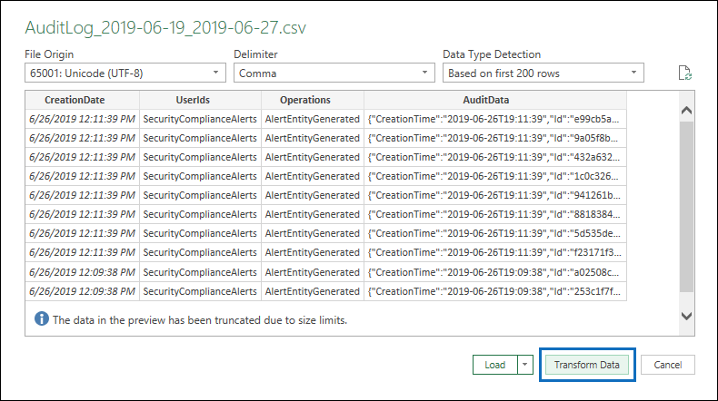

# <a name="export-configure-and-view-audit-log-records"></a>Exportar, configurar y ver registros de registro de auditoría

Una vez que haya buscado en el registro de auditoría de Office 365 y descargando los resultados de la búsqueda en un archivo CSV, el archivo contendrá una columna denominada **AuditData**, que contiene información adicional acerca de cada evento. Los datos de esta columna tienen el formato de un objeto JSON, que contiene varias propiedades que se configuran como pares *Property: Value* separados por comas. Puede usar la característica transformación de JSON en el editor de Power Query en Excel para dividir cada propiedad en el objeto JSON de la columna **AuditData** en varias columnas para que cada propiedad tenga su propia columna. Esto le permite ordenar y filtrar por una o varias de estas propiedades, lo que puede ayudarle a encontrar rápidamente los datos de auditoría específicos que está buscando.

## <a name="step-1-export-audit-log-search-results"></a>Paso 1: exportar los resultados de la búsqueda de registros de auditoría

El primer paso consiste en buscar en el registro de auditoría y, a continuación, exportar los resultados en un archivo de valores separados por comas (CSV) al equipo local.
  
1. Ejecute una [búsqueda de registro de auditoría](search-the-audit-log-in-security-and-compliance.md#search-the-audit-log) y revise los criterios de búsqueda si es necesario hasta que tenga los resultados deseados.
    
2. Haga clic en **exportar resultados** y seleccione **descargar todos los resultados**. 
    
   

   Esta opción permite exportar todos los registros de auditoría de la búsqueda de registros de auditoría que ejecutó en el paso 1 y descarga los datos sin procesar del registro de auditoría a un archivo CSV. 

   Se muestra un mensaje en la parte inferior de la ventana que le pide que abra o guarde el archivo CSV. 

3. Haga clic en **guardar > guardar como** y guarde el archivo CSV en el equipo local. Se tarda un rato en descargar muchos resultados de búsqueda. Este suele ser el caso cuando se busca en todas las actividades o en un intervalo de fechas amplio. Se muestra un mensaje en la parte inferior de la ventana cuando se termina de descargar el archivo CSV.
 
   

> [!NOTE]
  > Puede descargar un máximo de 50.000 entradas en un archivo CSV desde una sola búsqueda de registro de auditoría. Si se descargan 50.000 entradas en el archivo CSV, probablemente se da por hecho que hay más de 50.000 eventos que cumplen los criterios de búsqueda. Para exportar más de este límite, pruebe a usar un intervalo de fechas para reducir el número de registros de auditoría. Es posible que deba ejecutar varias búsquedas con intervalos de fecha más pequeños para exportar más de 50.000 entradas.

## <a name="step-2-format-the-exported-audit-log-using-the-power-query-editor"></a>Paso 2: dar formato al registro de auditoría exportado con el editor de Power Query

El paso siguiente es usar la característica transformación de JSON en el editor de Power Query en Excel para dividir cada propiedad en el objeto JSON de la columna **AuditData** en su propia columna. A continuación, filtre las columnas para ver los registros en función de los valores de propiedades específicas. Esto puede ayudarle a encontrar rápidamente los datos de auditoría específicos que está buscando.

1. Abra un libro en blanco en Excel para Office 365, Excel 2019 o Excel 2016.
    
2.  En la pestaña **datos** , en el grupo de cinta **obtener & transformar datos** , haga clic en **desde texto/CSV**.

    

3. Abra el archivo CSV que ha descargado en el paso 1.
    
4. En la ventana que se muestra, haga clic en **transformar datos**.

   

El archivo CSV se abre en el **Editor de consultas**. Hay cuatro columnas: **CreationDate**, **userid**, Operations **** y **AuditData**. La columna **AuditData** es un objeto JSON que contiene varias propiedades. El paso siguiente es crear una columna para cada propiedad en el objeto JSON.
    
5. Haga clic con el botón secundario en el título de la columna **AuditData** , haga clic en **transformar**y, a continuación, en **JSON**. 
 
   

6. En la esquina superior derecha de la columna **AuditData** , haga clic en el icono de expandir.
    
   

   Se muestra una lista parcial de las propiedades de los objetos JSON en la columna **AuditData** .

7. Haga clic en **cargar más** para mostrar todas las propiedades de los objetos JSON en la columna **AuditData** .

   

   Puede anular la selección de la casilla de verificación situada junto a cualquier propiedad que no desee incluir. Eliminar columnas que no son útiles para la investigación es una buena forma de reducir la cantidad de datos que se muestran en el registro de auditoría. 

   > [!NOTE]
   > Las propiedades JSON que se muestran en la captura de pantalla anterior (después de hacer clic en **cargar más**) se basan en las propiedades que se encuentran en la columna **AuditData** de las primeras 1.000 filas del archivo CSV. Si hay distintas propiedades JSON en los registros después de las primeras 1.000 filas, estas propiedades (y una columna correspondiente) no se incluirán cuando la columna **AuditData** se divida en varias columnas. Para ayudar a evitar esto, considere la posibilidad de volver a ejecutar la búsqueda de registros de auditoría y restringir los criterios de búsqueda para que se devuelvan menos registros. Otra solución consiste en filtrar elementos en la columna **operaciones** para reducir el número de filas (antes de realizar el paso 5 anterior) antes de transformar el objeto JSON en la columna **AuditData** .

8. Realice una de las siguientes acciones para dar formato al título de las columnas que se agregan para cada propiedad JSON seleccionada.

    - Anule la selección de la casilla **usar el nombre de columna original como prefijo** para usar el nombre de la propiedad JSON como los nombres de columna; por ejemplo, **RecordType** o **SourceFileName**.
    
   - Deje seleccionada la casilla **Usar nombre de columna original como prefijo** para agregar el prefijo AuditData a los nombres de columna; por ejemplo, **AuditData. RecordType** o **AuditData. SourceFileName**.

9. Haga clic en **Aceptar**.
    
    La columna **AuditData** se divide en varias columnas. Cada columna nueva corresponde a una propiedad del objeto JSON AuditData. Cada fila de la columna contiene el valor de la propiedad. Si la propiedad no contiene ningún valor, se muestra el valor *null* . En Excel, las celdas con valores NULL están vacías.
  
10. En la pestaña **Inicio** , haga clic en **cerrar & carga** para cerrar el editor de Power Query y abrir el archivo CSV transformado en un libro de Excel. 

## <a name="tips-for-exporting-and-viewing-the-audit-log"></a>Sugerencias para exportar y ver el registro de auditoría

A continuación, se muestran algunas sugerencias y ejemplos de cómo exportar y ver el registro de auditoría antes y después de usar la característica transformación JSON para dividir la columna **AuditData** en varias columnas.

- Filtre la columna **RecordType** para mostrar solo los registros de un área funcional o un servicio de Office 365 específico. Por ejemplo, para Mostrar eventos relacionados con el uso compartido de SharePoint, debe seleccionar **14** (el valor de enumeración para los registros desencadenados por las actividades de uso compartido de SharePoint). Para obtener una lista de los servicios de Office 365 que corresponden a los valores de enumeración mostrados en la columna **RecordType** , vea [detalles Properties en el registro de auditoría de Office 365](detailed-properties-in-the-office-365-audit-log.md).

- Filtrar la columna **operaciones** para mostrar los registros de actividades específicas. Para obtener una lista de la mayoría de las operaciones que corresponden a una actividad que permite realizar búsquedas en la herramienta de búsqueda de registros de auditoría del centro de seguridad & cumplimiento, consulte la sección "actividades auditadas" en [Buscar el registro de auditoría en el centro de seguridad & cumplimiento](search-the-audit-log-in-security-and-compliance.md#audited-activities).

- En lugar de usar la herramienta de búsqueda de registros de auditoría en el centro de seguridad & cumplimiento, puede usar el cmdlet [Search-UnifiedAuditLog](https://docs.microsoft.com/powershell/module/exchange/policy-and-compliance-audit/search-unifiedauditlog) en Exchange Online PowerShell para exportar los resultados de una búsqueda de registro de auditoría de Office 365 a un archivo CSV. A continuación, puede seguir el mismo procedimiento descrito en el paso 2 para dar formato al registro de auditoría con el editor de Power Query. Una de las ventajas de usar el cmdlet de PowerShell es que puede buscar eventos de un servicio de Office 365 específico mediante el parámetro *RecordType* . Estos son algunos ejemplos de cómo usar PowerShell para exportar registros de auditoría a un archivo CSV para que pueda usar el editor de Power Query para transformar el objeto JSON en la columna **AuditData** como se describe en el paso 2.

   En este ejemplo, ejecute los siguientes comandos para devolver todos los registros relacionados con las operaciones de uso compartido de SharePoint. 
   
   ```
   $auditlog = Search-UnifiedAuditLog -StartDate 06/01/2019 -EndDate 06/30/2019 -RecordType SharePointSharingOperation
   ```

   ```
   $auditlog | Select-Object -Property CreationDate,UserIds,RecordType,AuditData | Export-Csv -Path c:\AuditLogs\PowerShellAuditlog.csv -NoTypeInformation
   ```

   - Los resultados de la búsqueda se exportan a un archivo CSV denominado *PowerShellAuditlog* que contiene cuatro columnas: CreationDate, userid, RecordType, AuditData).

   - Puede usar el nombre o el valor de enumeración para el tipo de registro como el valor para el parámetro *RecordType* . Para obtener una lista de los nombres de tipo de registro y sus valores de enumeración correspondientes, vea la tabla *AuditLogRecordType* en el esquema de la [API de actividad de administración 365 de Office](https://docs.microsoft.com/office/office-365-management-api/office-365-management-activity-api-schema#enum-auditlogrecordtype---type-edmint32).
   
   - Solo puede incluir un valor único para este parámetro. Para buscar registros de auditoría para otros tipos de registros, debe volver a ejecutar los dos comandos anteriores para especificar un tipo de registro diferente y anexar los resultados al archivo CSV original. Por ejemplo, ejecutaría estos dos comandos para agregar actividades de archivo de SharePoint desde el mismo intervalo de fechas al archivo PowerShellAuditlog. csv.

       ```
      $auditlog = Search-UnifiedAuditLog -StartDate 06/01/2019 -EndDate 06/30/2019 -RecordType SharePointFileOperation
      ```

      ```
      $auditlog | Select-Object -Property CreationDate,UserIds,RecordType,AuditData | Export-Csv -Append -Path c:\AuditLogs\PowerShellAuditlog.csv -NoTypeInformation
      ```
