# Información general sobre el administrador del plan de archivosOverview of file plan manager

El administrador del plan de archivos proporciona funciones avanzadas de administración para las directivas de retención y proporciona una forma integrada para recorrer las etiquetas y la actividad de etiquetas de contenido para todo su ciclo de vida: incluyendo la creación, colaboración, declaración de registro, retención y por último disposición.File plan manager provides advanced management capabilities for retention labels and policies, and provides an integrated way to traverse label and label-to-content activity for your entire content lifecycle – from creation, through collaboration, record declaration, retention, and finally disposition.

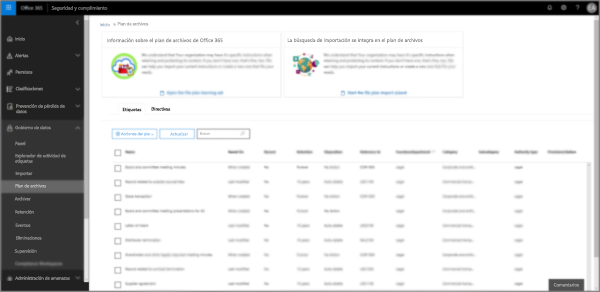

## Acceder al administrador del plan de archivosAccessing file plan manager

Hay dos requisitos para obtener acceso al administrador del plan de archivos, son:There are two requirements to access file plan manager, they are:
- Una suscripción de Office 365 Enterprise E5An Office 365 Enterprise E5 subscription.
- El usuario tiene asignado uno de los siguientes roles del Centro de seguridad y cumplimiento:The user has been in assigned one of the following roles of the Security &amp; Compliance Center:
    - Administrador de retenciónRetention Manager
    - Administrador de retención con permiso de vistaView-only Retention Manager

## Etiquetas de retención predeterminadas y directiva de etiquetasDefault retention labels and label policy

Si no hay etiquetas de retención en el Centro de seguridad y cumplimiento, la primera vez que elija **Plan de archivos** en la parte izquierda, se creará una directiva de etiquetas denominada **Directiva de publicación predeterminada de gobierno de datos**.If there are no retention labels in the Security & Compliance Center, the first time you choose **File plan** in the left nav, this creates a label policy called **Default Data Governance Publishing Policy**. 

Esta directiva de etiqueta contiene tres etiquetas de retención:This label policy contains three retention labels:

- **Procedimientos operativos****Operational procedure**
- **General comercial****Business general**
- **Acuerdo de contrato****Contract agreement**

Estas etiquetas de retención se configuran solo para retener el contenido, no eliminarlo.These retention labels are configured only to retain content, not delete content. Esta directiva de etiquetas se publicará en toda la organización y puede deshabilitarse o quitarse.This label policy will be published to the entire organization and can be disabled or removed. 

Puede determinar quién ha abierto el administrador del plan de archivos y desencadenado la experiencia de primera ejecución. Para ello, revise el registro de auditoría de las actividades **Directiva de retención creada** y **Configuración de retención para una directiva de retención creada**.You can determine who opened file plan manager and kicked off the first-run experience by reviewing the audit log for the activities **Created retention policy** and **Created retention configuration for a retention policy**.

> [!NOTE]
> Debido a los comentarios de los clientes, hemos eliminado la característica que crea las etiquetas de retención predeterminadas y la directiva de etiquetas mencionadas anteriormente.Due to customer feedback, we have removed this feature that creates the default retention labels and label policy mentioned above. Solo verá esta directiva y estas etiquetas si usó el administrador del plan de archivos antes del 11 de abril de 2019.You will only see this policy and labels if you used file plan manager before April 11, 2019.

## Navegar por el plan de archivosNavigating your file plan

El administrador del plan de archivos facilita ver y revisar la configuración de todas las directivas y etiquetas de retención en una vista.File plan manager makes it easier see into and across the settings of all your retention labels and policies from one view.

Tenga en cuenta que las etiquetas de retención creadas fuera del plan de archivos estarán disponibles en el plan de archivos y viceversa.Note that retention labels created outside of the file plan will be available in the file plan and vice versa.

En la pestaña **Etiquetas del plan de archivos**, están disponibles la siguiente información adicional y funciones:On the **file plan labels** tab, the following additional information and capabilities are available:

### Columnas de configuración de etiquetaLabel settings columns

- **En base a** identifica el tipo de desencadenador que iniciará el período de retención. Los valores válidos son:**Based on** identifies the type of trigger that will start the retention period. Valid values are:
    - EventoEvent
    - Fecha de creaciónWhen created
    - Fecha de última modificaciónWhen last modified
    - Fecha de etiquetadoWhen labeled
- **Registro** identifica si el elemento se convertirá en un registro declarado cuando se aplique la etiqueta. Los valores válidos son:**Record** identifies if the item will become a declared record when the label is applied. Valid values are:
    - NoNo
    - SíYes
    - Sí (Normativa)Yes(Regulatory)
- **Retención** identifica el tipo de retención. Los valores válidos son:**Retention** identifies the retention type. Valid values are:
    - ConservarKeep
    - Conservar y eliminarKeep and delete
    - EliminarDelete
- **Disposición** identifica qué ocurrirá con el contenido al final del período de retención. Los valores válidos son:**Disposition** identifies what will happen to the content at the end of the retention period. Valid values are:
    - nullnull
    - Ninguna acciónNo action
    - Eliminación automáticaAuto-delete
    - Revisión necesaria (también conocido como revisión de disposición)Review required (aka Disposition review)

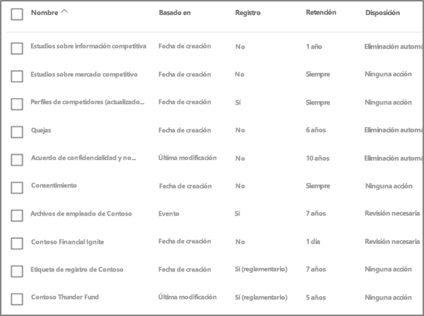

### Columnas de descriptores del plan de archivos de las etiquetasLabel file plan descriptors columns

Ahora puede incluir más información en la configuración de las etiquetas de retención. Insertar descriptores del plan de archivos en las etiquetas mejorará la administración y la organización de su plan de archivos.You can now include more information in the configuration of your retention labels. Inserting file plan descriptors into labels will improve the manageability and organization of your file plan.

Para comenzar, el administrador del plan de archivos proporciona algunos valores de fábrica para: función o departamento, categoría, tipo de autoridad y aprovisionamiento o cita. Puede agregar nuevos archivos valores descriptores del plan de archivos al crear o editar una etiqueta de retención.To get you started, file plan manager provides some out-of-box values for: Function/department, Category, Authority type and Provision/citation. You can add new file plan descriptor values when creating or editing a retention label.

Esta es una vista del paso de descriptores del plan de archivos al crear o editar una etiqueta de retención.Here's a view of the file plan descriptors step when creating or editing a retention label.

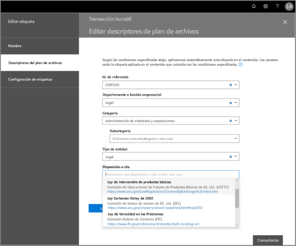

Esta es una vista de las columnas de descriptores del plan de archivos en la pestaña de etiquetas del administrador del plan de archivos.Here's a view of the file plan descriptors columns on the labels tab of file plan manager.

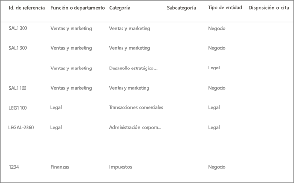

## Exportar etiquetas del plan de archivosExport labels out of your file plan

Desde el administrador del plan de archivos, puede exportar los detalles de todas las etiquetas de retención a un archivo .csv para facilitar el revisiones de cumplimiento periódicas con partes interesadas del gobierno de datos de su organización.From file plan manager, you can export the details of all retention labels into a .csv file to assist you in facilitating periodic compliance reviews with data governance stakeholders in your organization.

Para exportar todas las etiquetas de retención, vaya al **Administrador del plan de archivos** \> **Acciones del plan de archivos** \> **Exportar etiquetas**.To export all retention labels, go to **file plan manager** \> **file plan actions** \> **export labels**.

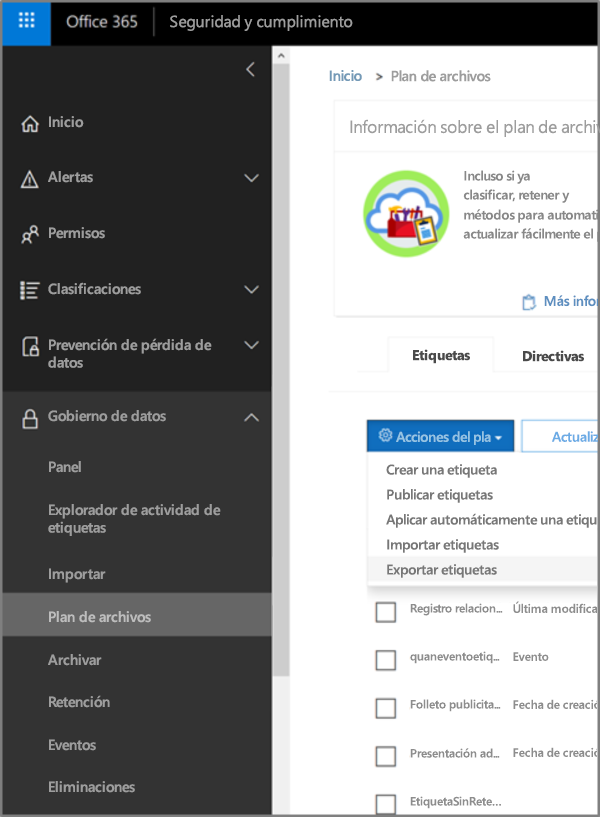

Se abrirá un archivo \*.csv que contiene todas las etiquetas de retención existentes.A \*.csv file containing all existing retention labels will open.

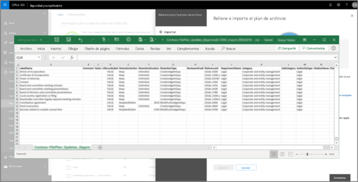

## Importar etiquetas en el plan de archivosImport labels into your file plan

Desde el administrador del plan de archivos, puede importar en masa nuevas etiquetas así como modificar las etiquetas de retención existentes.From file plan manager, you can bulk import new labels as well as modify existing retention labels.

Para importar nuevas etiquetas de retención y realizar actualizaciones en etiquetas de retención existentes, vaya a **Administrador del plan de archivos** \> **Acciones del plan de archivos** \> **Importar etiquetas**.To import new retention labels and make updates existing retention labels, go to **file plan manager** \> **file plan actions** \> **import labels**.

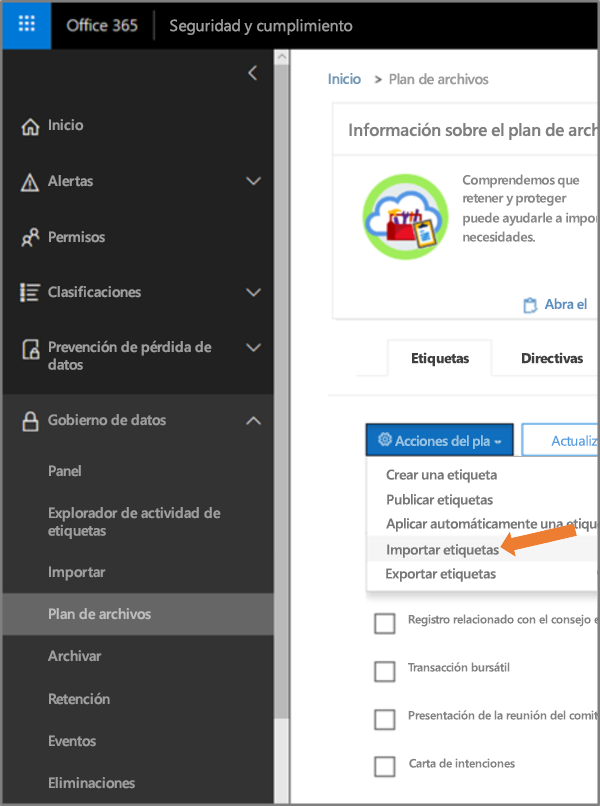

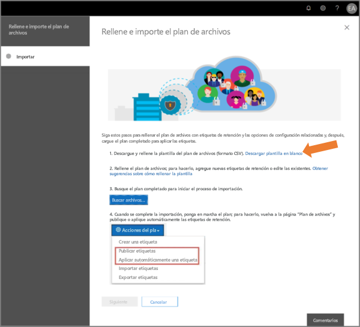

Descargue una plantilla en blanco (o empiece desde una exportación de su plan actual del archivo).Download a blank template (or start from an export of your current file plan).

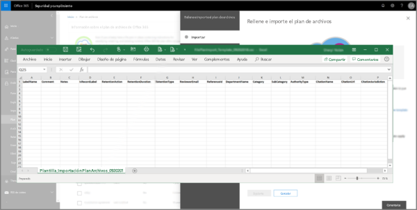

Rellene la plantilla (próximamente publicaremos la información de referencia acerca de los valores válidos para las entradas).Fill-out the template (coming soon is reference information about valid values for entries).

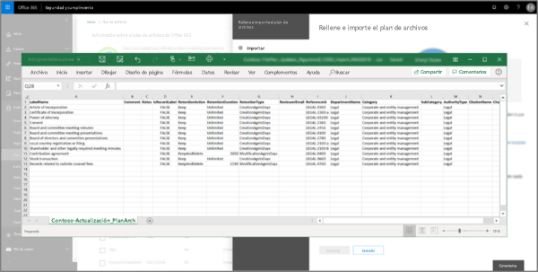

Cargue la plantilla rellenada y el administrador del plan de archivos validará las entradas y mostrará las estadísticas de importación.Upload the filled-out template, and file plan manager will validate the entries and display import statistics.

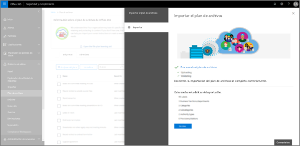

Una vez completada la importación, vuelva al administrador del plan de archivos para asignar nuevas etiquetas a las directivas nuevas o existentes.When the import is complete, return to file plan manager to assign new labels to new or existing policies.

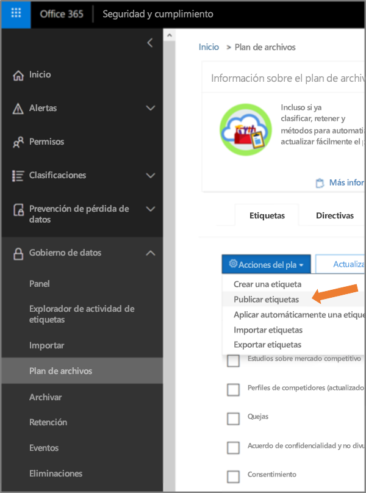

