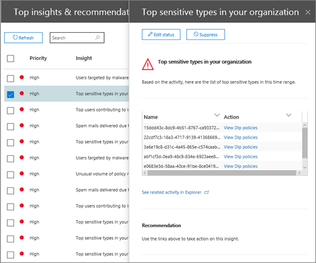
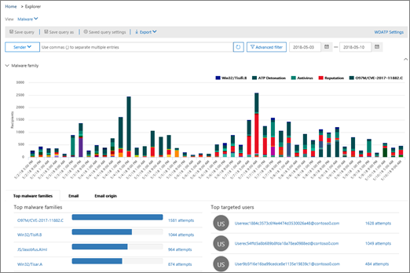

# Tutorial: desde un reporte a un informe detallado

Si no está familiarizado con [los informes y la información del centro de seguridad &amp; y cumplimiento de Office 365](reports-and-insights-in-security-and-compliance.md), es posible que le resulte útil ver cómo puede navegar fácilmente desde una perspectiva a un informe detallado. 
  
Este es uno de los diversos tutoriales del [Centro &amp; de seguridad y cumplimiento](https://protection.office.com). Para ver Tutoriales adicionales, consulte la sección [temas relacionados](#related-topics) . 
  
## Desde una perspectiva a un informe detallado

Vamos a examinar el flujo del panel para obtener información sobre un informe detallado sobre la exploración de datos. (Este es un breve ejemplo de [prevención de pérdida de datos](data-loss-prevention-policies.md) ). 
  
1. Comenzaremos con un panel en el [Centro &amp; de seguridad y cumplimiento](https://protection.office.com). (Vaya a **** \> **Panel**de informes). 
  
2. En la esquina superior izquierda del panel, junto a ** &amp; recomendaciones principales de información**, tenemos un vínculo. (Haga clic en **ver todo**).  Esto nos lleva a una lista de información de nuestra organización. 
  
3. Al seleccionar un elemento de la lista, se abre un panel en el que se pueden ver más detalles sobre el elemento. (Haga clic en un elemento).  Vemos las acciones recomendadas que debemos tener en cuenta, como la revisión de las directivas. ([Obtenga más información sobre las directivas de prevención de pérdida de datos](data-loss-prevention-policies.md)).
    
4. También tenemos un vínculo para ver más detalles. (Haga clic en **ver actividad relacionada en el explorador**). Esto nos lleva a un tipo de informe denominado [Explorador de amenazas (y detecciones en tiempo real)](threat-explorer.md), donde podemos aplicar filtros y profundizar en detalles específicos. 
  
De esta forma, podemos desplazarse fácilmente de una perspectiva a sus detalles subyacentes y tomar decisiones más informadas sobre prevención de pérdida de datos para una organización.
  
## Temas relacionados

[Tutorial: desde un informe detallado a un conocimiento](from-a-detailed-report-to-an-insight.md)
  
[Tutorial: desde un panel a un conocimiento](from-a-dashboard-to-an-insight.md)
  

