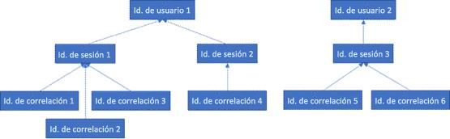

# RGPD para Office Web Apps Server y Office Online Server

Los datos de telemetría de Office Online Server y Office Web Apps Server se almacenan en un formulario de registros ULS. Puede usar el [Visor de ULS](https://www.microsoft.com/en-us/download/details.aspx?id=44020) para ver los registros ULS de su inquilino local.

Cada línea de registro contiene un CorrelationID. Las líneas de registros relacionadas comparten el mismo CorrelationID. Cada CorrelationID está vinculado a un SessionID único y un SessionID puede estar relacionado con muchos CorrelationID. Cada SessionID puede estar relacionado con un único UserID, aunque algunas sesiones pueden ser anónimas y, por tanto, no tiene un UserID asociado. Para determinar qué datos están asociados a un usuario determinado, es posible asignar desde un UserID único para los SessionID asociados a ese usuario, de los SessionID a los CorrelationID, y de esos CorrelationID a todos los registros en las correlaciones. Consulte el siguiente diagrama para obtener información sobre la relación entre los distintos identificadores.

## Registros de recopilación

Para recopilar todos los registros asociados con el UserID 1, por ejemplo, el primer paso sería recopilar todas las sesiones asociadas con el UserID 1 (es decir, SessionID 1 y SessionID 2). El siguiente paso sería recopilar todas las correlaciones asociadas con SessionID 1 (es decir, CorrelationID 1, 2 y 3) y SessionID 2 (es decir, CorrelationID 4). Por último, recopile todos los registros asociados con cada una de las correlaciones en la lista.

1.  Iniciar UlsViewer

2.  Abra el registro de ULS correspondiente al periodo de tiempo previsto; los registros ULS se almacenan en %PROGRAMDATA%\\Microsoft\\OfficeWebApps\\Data\\Logs\\ULS

3.  Editar o modificar filtros

4.  Aplique un filtro que sea:

    -   EventID es igual a apr3y o

    -   EventID es igual a bp2d6

5.  Los UserId con hash estarán en el mensaje de uno de estos dos eventos

6.  Para apr3y, el mensaje contiene un valor de UserID y un valor PUID

7.  Para bp2d6, el mensaje contiene gran cantidad de información. El campo de valor LoggableUserId es el UserID con hash.

8.  Una vez que se obtiene el UserId con hash de cualquiera de estas dos etiquetas, el valor WacSessionId de dicha fila en ULSViewer contendrá el WacSessionId asociado a ese usuario

9.  Recopilar todos los valores de WacSessionId asociados al usuario en cuestión

10. Filtre todos los EventId iguales a "xmnv", el mensaje es igual a "UserSessionId=\<WacSessionId\>" para el primer WacSessionId en la lista (reemplace la parte \<WacSessionId\> del filtro con su WacSessionId)

11. Recopilar todos los valores de correlación que coinciden con ese WacSessionId

12. Repita los pasos 10-11 para todos los valores de WacSessionId en la lista del usuario en cuestión

13. Filtrar todas las correlaciones es igual a la primera correlación en la lista

14. Recopilar todos los registros coincidentes con esa correlación

15. Repita los pasos 13-14 para todos los valores de correlación en la lista del usuario en cuestión

## Tipos de datos

Los registros de Office Online contienen una gran variedad de diferentes tipos de datos. Estos son algunos ejemplos de los datos que pueden contener los registros ULS:

-   Códigos de error para problemas detectados durante el uso del producto

-   Clics de botones y otros fragmentos de datos sobre el uso de la aplicación

-   Datos de rendimiento de la aplicación y determinadas características en ella

-   Información de ubicación general sobre dónde está el equipo del usuario (por ejemplo, país o región, provincia y ciudad, derivados de la dirección IP), pero no la geolocalización precisa

-   Metadatos básicos sobre el explorador, por ejemplo, el nombre del explorador y la versión, y el equipo, por ejemplo, el tipo de sistema operativo y la versión

-   Mensajes de error del host del documento (por ejemplo, OneDrive, SharePoint, Exchange)

-   Información sobre los procesos internos de la aplicación, que no está relacionada con las medidas que ha realizado el usuario
