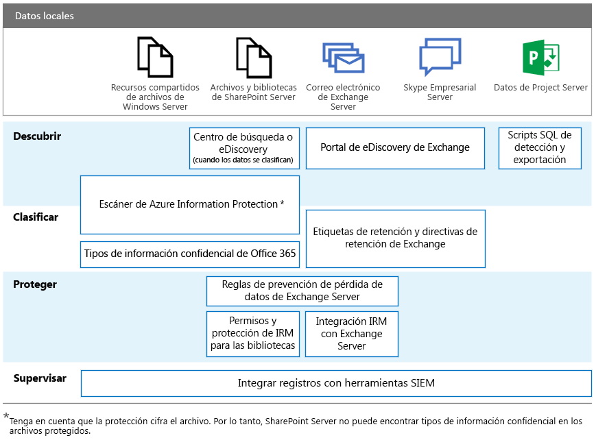

# RGPD para servidores locales de Office

El Reglamento general de protección de datos (RGPD) presenta requisitos para que las organizaciones protejan los datos personales y respondan correctamente a las solicitudes de datos personales. Esta serie de artículos proporciona enfoques recomendados para cargas de trabajo locales:

-   [SharePoint Server](gdpr-for-sharepoint-server.md)

-   [Exchange Server](gdpr-for-exchange-server.md)

-   [Skype Empresarial Server](gdpr-for-skype-for-business-server.md)

-   [Project Server](gdpr-for-project-server.md)

-   [Office Web Apps Server y Office Online Server](gdpr-for-office-online-server.md)

-   [Uso compartido de archivos locales](gdpr-for-on-premises-file-shares.md)

Para obtener más información sobre el RGPD y cómo puede ayudarle Microsoft, consulte el [Centro de confianza de Microsoft](https://www.microsoft.com/es-ES/TrustCenter/Privacy/gdpr/default.aspx).

Antes de realizar cualquier trabajo con los datos locales, consulte con sus equipos legales y de cumplimiento para buscar orientación y obtener información sobre los métodos de clasificación existentes para trabajar con datos personales y esquemas. Microsoft ofrece recomendaciones para desarrollar y ampliar esquemas de clasificación en el Kit de herramientas de detección de datos de RGPD de Microsoft en [http://aka.ms/gdprpartners](<http://aka.ms/gdprpartners>). Este kit de herramientas también describe métodos para mover datos locales a la nube donde puede usar funciones de gobierno de datos más complejas, si así lo desea. Los artículos de esta sección proporcionan recomendaciones para datos que se pretende que permanezcan en un entorno local.

La siguiente ilustración enumera las capacidades recomendadas que se deben usar en cada una de estas cargas de trabajo para descubrir, clasificar, proteger y vigilar los datos personales. Consulte los artículos de esta sección para obtener más información.

## Descripción de la ilustración

Por motivos de accesibilidad, en la tabla siguiente se incluyen los mismos ejemplos que en la ilustración.

|             |Recursos compartidos de archivos de Windows Server|SharePoint Server|Exchange Server|Skype Empresarial|Project Server|
|:------------|:-------------------------|:----------------|:--------------|:-----------------|:-------------|
|Descubrir|Escáner de Azure Information Protection*|Centro de búsqueda o eDiscovery (cuando los datos estén clasificados); escáner de Azure Information Protection*|Portal de eDiscovery de Exchange|Portal de eDiscovery de Exchange|Scripts SQL de detección y exportación|
|Clasificar|Escáner de Azure Information Protection*; Tipos de información confidencial de Office 365|Escáner de Azure Information Protection*; Tipos de información confidencial de Office 365|Etiquetas de retención y directivas de retención de Exchange|Etiquetas de retención y directivas de retención de Exchange||
|Proteger||Reglas de prevención de pérdida de datos de Exchange Server; protección IRM para las bibliotecas|Reglas de prevención de pérdida de datos de Exchange Server; integración IRM con Exchange Server|||
|Supervisar|Integrar registros con herramientas SIEM|Integrar registros con herramientas SIEM|Integrar registros con herramientas SIEM|Integrar registros con herramientas SIEM|Integrar registros con herramientas SIEM|

* Tenga en cuenta que con la protección se cifra el archivo. Por lo tanto, SharePoint Server no puede encontrar tipos de información confidencial en los archivos protegidos.
