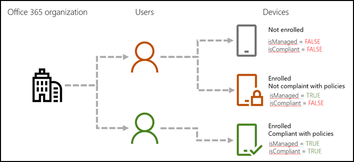

# <a name="get-details-about-devices-managed-by-mobile-device-management-mdm-for-office-365"></a><span data-ttu-id="9f93f-103">Obtener detalles acerca de los dispositivos administrados por Mobile Device Management (MDM) para Office 365</span><span class="sxs-lookup"><span data-stu-id="9f93f-103">Get details about devices managed by Mobile Device Management (MDM) for Office 365</span></span>

<span data-ttu-id="9f93f-104">En este artículo se muestra cómo usar Windows PowerShell para obtener detalles sobre los dispositivos de la organización que ha configurado para la administración de dispositivos móviles para Office 365.</span><span class="sxs-lookup"><span data-stu-id="9f93f-104">This article shows you how to use Windows PowerShell to get details about the devices in your organization that you set up for Mobile Device Management for Office 365.</span></span> 
  
## <a name="what-device-details-can-i-get"></a><span data-ttu-id="9f93f-105">¿Qué detalles del dispositivo se debe obtener?</span><span class="sxs-lookup"><span data-stu-id="9f93f-105">What device details can I get?</span></span>

<span data-ttu-id="9f93f-106">Éste es un desglose.</span><span class="sxs-lookup"><span data-stu-id="9f93f-106">Here's a breakdown.</span></span>
  
|<span data-ttu-id="9f93f-107">**Detalle**</span><span class="sxs-lookup"><span data-stu-id="9f93f-107">**Detail**</span></span>|<span data-ttu-id="9f93f-108">**Qué buscar en PowerShell**</span><span class="sxs-lookup"><span data-stu-id="9f93f-108">**What to look for in PowerShell**</span></span>|
|:-----|:-----|
|<span data-ttu-id="9f93f-109">Dispositivo está [inscrito en MDM para Office 365](enroll-your-mobile-device.md)</span><span class="sxs-lookup"><span data-stu-id="9f93f-109">Device is [enrolled in MDM for Office 365](enroll-your-mobile-device.md)</span></span> <br/> |<span data-ttu-id="9f93f-110">El valor del parámetro *isManaged* es:</span><span class="sxs-lookup"><span data-stu-id="9f93f-110">The value of the  *isManaged*  parameter is:</span></span>  <br/> <span data-ttu-id="9f93f-111">**True** = dispositivo está inscrito.</span><span class="sxs-lookup"><span data-stu-id="9f93f-111">**True** = device is enrolled.</span></span>  <br/> <span data-ttu-id="9f93f-112">**False** = no está inscrito el dispositivo.</span><span class="sxs-lookup"><span data-stu-id="9f93f-112">**False** = device is not enrolled.</span></span>  <br/> |
|<span data-ttu-id="9f93f-113">Dispositivo es compatible con las [directivas de seguridad de dispositivo](https://go.microsoft.com/fwlink/?linkid=615144)</span><span class="sxs-lookup"><span data-stu-id="9f93f-113">Device is compliant with your [device security policies](https://go.microsoft.com/fwlink/?linkid=615144)</span></span> <br/> |<span data-ttu-id="9f93f-114">El valor del parámetro *isCompliant* es:</span><span class="sxs-lookup"><span data-stu-id="9f93f-114">The value of the  *isCompliant*  parameter is:</span></span>  <br/> <span data-ttu-id="9f93f-115">**True** = es compatible con las directivas de dispositivo.</span><span class="sxs-lookup"><span data-stu-id="9f93f-115">**True** = device is compliant with policies.</span></span>  <br/> <span data-ttu-id="9f93f-116">**False** = no es compatible con las directivas de dispositivo.</span><span class="sxs-lookup"><span data-stu-id="9f93f-116">**False** = device is not compliant with policies.</span></span>  <br/> |
   

  
> [!NOTE]
> <span data-ttu-id="9f93f-118">Los comandos y las secuencias de comandos en este artículo también devolverá obtener información detallada sobre todos los dispositivos que son administrados por [Microsoft Intune](https://www.microsoft.com/en-us/cloud-platform/microsoft-intune).</span><span class="sxs-lookup"><span data-stu-id="9f93f-118">The commands and scripts in this article will also return details about any devices that are managed by [Microsoft Intune](https://www.microsoft.com/en-us/cloud-platform/microsoft-intune).</span></span> 
  
## <a name="before-you-begin"></a><span data-ttu-id="9f93f-119">Antes de empezar</span><span class="sxs-lookup"><span data-stu-id="9f93f-119">Before you begin</span></span>

<span data-ttu-id="9f93f-120">Hay algunas cosas que necesitará para configurado para ejecutar los comandos y las secuencias de comandos que se describen en este artículo.</span><span class="sxs-lookup"><span data-stu-id="9f93f-120">There are a few things you'll need to set up to run the commands and scripts described in this article.</span></span>
  
### <a name="step-1-download-and-install-the-azure-active-directory-module-for-windows-powershell"></a><span data-ttu-id="9f93f-121">Paso 1: Descargar e instalar Azure Active Directory módulo para Windows PowerShell</span><span class="sxs-lookup"><span data-stu-id="9f93f-121">Step 1: Download and install the Azure Active Directory Module for Windows PowerShell</span></span>

<span data-ttu-id="9f93f-122">Para obtener más información sobre estos pasos, vea [Connect to Office 365 PowerShell](https://docs.microsoft.com/Office365/enterprise/powershell/connect-to-office-365-powershell).</span><span class="sxs-lookup"><span data-stu-id="9f93f-122">For more info on these steps, see [Connect to Office 365 PowerShell](https://docs.microsoft.com/Office365/enterprise/powershell/connect-to-office-365-powershell).</span></span>
  
1. <span data-ttu-id="9f93f-123">Vaya a [Microsoft Asistente en línea de servicios de inicio de sesión para RTWl de profesionales de TI](https://www.microsoft.com/en-us/download/details.aspx?id=41950) y haga clic en **Descargar** para Ayudante para el inicio de sesión de Microsoft Online Services.</span><span class="sxs-lookup"><span data-stu-id="9f93f-123">Go to [Microsoft Online Services Sign-In Assistant for IT Professionals RTWl](https://www.microsoft.com/en-us/download/details.aspx?id=41950) and click **Download** for Microsoft Online Services Sign-in Assistant.</span></span> 
    
2. <span data-ttu-id="9f93f-124">Instale el Módulo Microsoft Azure Active Directory para Windows PowerShell siguiendo estos pasos:</span><span class="sxs-lookup"><span data-stu-id="9f93f-124">Install the Microsoft Azure Active Directory Module for Windows PowerShell with these steps:</span></span>
    
    1. <span data-ttu-id="9f93f-125">Abra un símbolo del sistema de PowerShell con permisos de administrador.</span><span class="sxs-lookup"><span data-stu-id="9f93f-125">Open an administrator-level PowerShell command prompt.</span></span>
        
    2. <span data-ttu-id="9f93f-126">Ejecute el `Install-Module MSOnline` comando.</span><span class="sxs-lookup"><span data-stu-id="9f93f-126">Run the `Install-Module MSOnline` command.</span></span>
        
    3. <span data-ttu-id="9f93f-127">Si se le pida instalar el proveedor de NuGet, escriba `Y` y presione ENTRAR.</span><span class="sxs-lookup"><span data-stu-id="9f93f-127">If prompted to install the NuGet provider, type `Y` and press ENTER.</span></span>
        
    4. <span data-ttu-id="9f93f-128">Si se le pida instalar el módulo de PSGallery, escriba `Y` y presione ENTRAR.</span><span class="sxs-lookup"><span data-stu-id="9f93f-128">If prompted to install the module from PSGallery, type `Y` and press ENTER.</span></span>
        
    5. <span data-ttu-id="9f93f-129">Después de la instalación, cierre la ventana de comandos de PowerShell.</span><span class="sxs-lookup"><span data-stu-id="9f93f-129">After installation, close the PowerShell command window.</span></span>
    
### <a name="step-2-connect-to-your-office-365-subscription"></a><span data-ttu-id="9f93f-130">Paso 2: Conectarse a la suscripción de Office 365</span><span class="sxs-lookup"><span data-stu-id="9f93f-130">Step 2: Connect to your Office 365 subscription</span></span>

1. <span data-ttu-id="9f93f-131">En el Windows Azure Active Directory módulo para Windows PowerShell, ejecute el siguiente comando.</span><span class="sxs-lookup"><span data-stu-id="9f93f-131">In the Windows Azure Active Directory Module for Windows PowerShell, run the following command.</span></span><br/>  
  `$UserCredential = Get-Credential`

2. <span data-ttu-id="9f93f-132">En el cuadro de diálogo **Solicitud de credenciales de Windows PowerShell** , escriba el nombre de usuario y la contraseña de su cuenta de administrador global de Office 365 y, a continuación, haga clic en **Aceptar**.</span><span class="sxs-lookup"><span data-stu-id="9f93f-132">In the **Windows PowerShell Credential Request** dialog box, type the user name and password for your Office 365 global admin account, and then click **OK**.</span></span>
    
3. <span data-ttu-id="9f93f-133">Ejecute el siguiente comando.</span><span class="sxs-lookup"><span data-stu-id="9f93f-133">Run the following command.</span></span><br/>
    `
  Connect-MsolService -Credential $UserCredential
  `

### <a name="step-3-make-sure-youre-able-to-run-powershell-scripts"></a><span data-ttu-id="9f93f-134">Paso 3: Compruebe que se encuentra capaz de ejecutar scripts de PowerShell</span><span class="sxs-lookup"><span data-stu-id="9f93f-134">Step 3: Make sure you're able to run PowerShell scripts</span></span>

> [!NOTE]
> <span data-ttu-id="9f93f-135">Puede omitir este paso si ya está configurado para ejecutar scripts de PowerShell.</span><span class="sxs-lookup"><span data-stu-id="9f93f-135">You can skip this step if you're already set up to run PowerShell scripts.</span></span> 
  
<span data-ttu-id="9f93f-136">Para ejecutar la secuencia de comandos **Get-MsolUserDeviceComplianceStatus.ps1** , debe habilitar la ejecución de scripts de PowerShell.</span><span class="sxs-lookup"><span data-stu-id="9f93f-136">To run the **Get-MsolUserDeviceComplianceStatus.ps1** script, you need to enable the running of PowerShell scripts.</span></span> 
  
1. <span data-ttu-id="9f93f-p101">Desde el escritorio de Windows, haga clic en **Inicio**y, a continuación, escriba Windows PowerShell. Haga clic con el botón secundario del mouse en **Windows PowerShell**y, a continuación, haga clic en **Ejecutar como administrador**.</span><span class="sxs-lookup"><span data-stu-id="9f93f-p101">From your Windows Desktop, click **Start**, and then type Windows PowerShell. Right click **Windows PowerShell**, and then click **Run as administrator**.</span></span>
    
2. <span data-ttu-id="9f93f-139">Ejecute el siguiente comando.</span><span class="sxs-lookup"><span data-stu-id="9f93f-139">Run the following command.</span></span><br/>
  `Set-ExecutionPolicy RemoteSigned`

3. <span data-ttu-id="9f93f-140">Cuando se le solicite, escriba `Y` y, a continuación, presione ENTRAR.</span><span class="sxs-lookup"><span data-stu-id="9f93f-140">When prompted, type `Y` and then press Enter.</span></span> 
    
## <a name="run-the-get-msoldevice-cmdlet-to-display-details-for-all-devices-in-your-organization"></a><span data-ttu-id="9f93f-141">Ejecute el cmdlet Get-MsolDevice para mostrar detalles para todos los dispositivos de la organización</span><span class="sxs-lookup"><span data-stu-id="9f93f-141">Run the Get-MsolDevice cmdlet to display details for all devices in your organization</span></span>

1. <span data-ttu-id="9f93f-142">Abra el Módulo Microsoft Azure Active Directory para Windows PowerShell.</span><span class="sxs-lookup"><span data-stu-id="9f93f-142">Open the Microsoft Azure Active Directory Module for Windows PowerShell.</span></span>
    
2. <span data-ttu-id="9f93f-143">Ejecute el siguiente comando.</span><span class="sxs-lookup"><span data-stu-id="9f93f-143">Run the following command.</span></span><br/>
  ```
  Get-MsolDevice -All -ReturnRegisteredOwners | Where-Object {$_.RegisteredOwners.Count -gt 0}
  ```

<span data-ttu-id="9f93f-144">Para obtener más ejemplos, vea [Get-MsolDevice](https://go.microsoft.com/fwlink/?linkid=841721).</span><span class="sxs-lookup"><span data-stu-id="9f93f-144">For more examples, see [Get-MsolDevice](https://go.microsoft.com/fwlink/?linkid=841721).</span></span>
  
## <a name="run-a-script-to-get-device-details"></a><span data-ttu-id="9f93f-145">Ejecutar un script para obtener detalles del dispositivo</span><span class="sxs-lookup"><span data-stu-id="9f93f-145">Run a script to get device details</span></span>

### <a name="first-save-the-script-to-your-computer"></a><span data-ttu-id="9f93f-146">En primer lugar, guarde la secuencia de comandos en el equipo</span><span class="sxs-lookup"><span data-stu-id="9f93f-146">First, save the script to your computer</span></span>

1. <span data-ttu-id="9f93f-147">Copie y pegue el siguiente texto en el Bloc de notas.</span><span class="sxs-lookup"><span data-stu-id="9f93f-147">Copy and paste the following text into Notepad.</span></span><br/> 
  ```
  param (
      [PSObject[]]$users = @(),
      [Switch]$export,
      [String]$exportFileName = "UserDeviceComplianceStatus_" + (Get-Date -Format "yyMMdd_HHMMss") + ".csv",
      [String]$exportPath = [Environment]::GetFolderPath("Desktop")
   )
  [System.Collections.IDictionary]$script:schema = @{
      
      DeviceId = ''
      DeviceOSType = ''
      DeviceOSVersion = ''
      DeviceTrustLevel = ''
      DisplayName = ''
      IsCompliant = ''
      IsManaged = ''
      ApproximateLastLogonTimestamp = ''
      DeviceObjectId = ''    
      RegisteredOwnerUpn = ''
      RegisteredOwnerObjectId = ''
      RegisteredOwnerDisplayName = ''
  }
  function createResultObject
  {
      [PSObject]$resultObject = New-Object -TypeName PSObject -Property $script:schema
      return $resultObject
  }
  If ($users.Count -eq 0)
  {
      $users = Get-MsolUser
  }
  [PSObject[]]$result = foreach ($u in $users)
  {
      
      [PSObject]$devices = get-msoldevice -RegisteredOwnerUpn $u.UserPrincipalName
      foreach ($d in $devices)
      {
          [PSObject]$deviceResult = createResultObject
          $deviceResult.DeviceId = $d.DeviceId 
          $deviceResult.DeviceOSType = $d.DeviceOSType 
          $deviceResult.DeviceOSVersion = $d.DeviceOSVersion 
          $deviceResult.DeviceTrustLevel = $d.DeviceTrustLevel
          $deviceResult.DisplayName = $d.DisplayName
          $deviceResult.IsCompliant = $d.GraphDeviceObject.IsCompliant
          $deviceResult.IsManaged = $d.GraphDeviceObject.IsManaged
          $deviceResult.DeviceObjectId = $d.ObjectId
          $deviceResult.RegisteredOwnerUpn = $u.UserPrincipalName
          $deviceResult.RegisteredOwnerObjectId = $u.ObjectId
          $deviceResult.RegisteredOwnerDisplayName = $u.DisplayName
          $deviceResult.ApproximateLastLogonTimestamp = $d.ApproximateLastLogonTimestamp
          $deviceResult
      }
  }
  If ($export)
  {
      $result | Export-Csv -path ($exportPath + "\" + $exportFileName) -NoTypeInformation
  }
  Else
  {
      $result
  }
  
  ```

2. <span data-ttu-id="9f93f-148">Guardar como un archivo de secuencia de comandos de Windows PowerShell mediante el uso de la extensión de archivo **. ps1**.</span><span class="sxs-lookup"><span data-stu-id="9f93f-148">Save it as a Windows PowerShell script file by using the file extension **.ps1**.</span></span> <br/><span data-ttu-id="9f93f-149">Ejemplo:</span><span class="sxs-lookup"><span data-stu-id="9f93f-149">Example:</span></span><br/> <span data-ttu-id="9f93f-150">`Get-MsolUserDeviceComplianceStatus.ps1`.</span><span class="sxs-lookup"><span data-stu-id="9f93f-150"></span></span>
    
### <a name="run-the-script-to-get-device-information-for-a-single-user-account"></a><span data-ttu-id="9f93f-151">Ejecute el script para obtener información del dispositivo para una única cuenta de usuario</span><span class="sxs-lookup"><span data-stu-id="9f93f-151">Run the script to get device information for a single user account</span></span>

1. <span data-ttu-id="9f93f-152">Abra el Módulo Microsoft Azure Active Directory para Windows PowerShell.</span><span class="sxs-lookup"><span data-stu-id="9f93f-152">Open the Microsoft Azure Active Directory Module for Windows PowerShell.</span></span>
    
2. <span data-ttu-id="9f93f-p102">Navegue a la carpeta donde guardó la secuencia de comandos. Por ejemplo, si guardó a C:\PS-Scripts, ejecutaría el comando siguiente.</span><span class="sxs-lookup"><span data-stu-id="9f93f-p102">Navigate to the folder where you saved the script. For example, if you saved it to C:\PS-Scripts, you'd run the following command.</span></span><br/>
    `cd C:\PS-Scripts`

3. <span data-ttu-id="9f93f-p103">Ejecute el siguiente comando para identificar al usuario que desea obtener detalles del dispositivo. En este ejemplo se obtienen los detalles para bar@example.com.</span><span class="sxs-lookup"><span data-stu-id="9f93f-p103">Run the following command to identify the user you want to get device details for. This example gets details for bar@example.com.</span></span><br/>
  ```
  $u = Get-MsolUser -UserPrincipalName bar@example.com
  ```

4. <span data-ttu-id="9f93f-157">Ejecute el siguiente comando para iniciar la secuencia de comandos.</span><span class="sxs-lookup"><span data-stu-id="9f93f-157">Run the following command to initiate the script.</span></span><br/>
  ```
  .\Get-MsolUserDeviceComplianceStatus.ps1 -User $u -Export
  ```

<span data-ttu-id="9f93f-p104">En el escritorio de Windows, se exporta la información como un archivo CSV. Puede usar los parámetros adicionales para especificar el nombre de archivo y ruta de acceso de la CSV.</span><span class="sxs-lookup"><span data-stu-id="9f93f-p104">The information is exported to your Windows Desktop as a CSV file. You can use additional parameters to specify the file name and path of the CSV.</span></span>
  
### <a name="run-the-script-to-get-device-information-for-a-group-of-users"></a><span data-ttu-id="9f93f-160">Ejecute el script para obtener información del dispositivo para un grupo de usuarios</span><span class="sxs-lookup"><span data-stu-id="9f93f-160">Run the script to get device information for a group of users</span></span>

1. <span data-ttu-id="9f93f-161">Abra el Módulo Microsoft Azure Active Directory para Windows PowerShell.</span><span class="sxs-lookup"><span data-stu-id="9f93f-161">Open the Microsoft Azure Active Directory Module for Windows PowerShell.</span></span>
    
2. <span data-ttu-id="9f93f-p105">Navegue a la carpeta donde guardó la secuencia de comandos. Por ejemplo, si guardó a C:\PS-Scripts, ejecutaría el comando siguiente.</span><span class="sxs-lookup"><span data-stu-id="9f93f-p105">Navigate to the folder where you saved the script. For example, if you saved it to C:\PS-Scripts, you'd run the following command.</span></span><br/>
  `cd C:\PS-Scripts`

3. <span data-ttu-id="9f93f-p106">Ejecute el comando siguiente para identificar el grupo que desea obtener detalles del dispositivo. En este ejemplo se obtienen los detalles para los usuarios del grupo FinanceStaff.</span><span class="sxs-lookup"><span data-stu-id="9f93f-p106">Run the following command to identify the group you want to get device details for. This example gets details for users in the FinanceStaff group.</span></span><br/>
  ```
  $u = Get-MsolGroupMember -SearchString "FinanceStaff" | % { Get-MsolUser -ObjectId $_.ObjectId }
  ```

4. <span data-ttu-id="9f93f-166">Ejecute el siguiente comando para iniciar la secuencia de comandos.</span><span class="sxs-lookup"><span data-stu-id="9f93f-166">Run the following command to initiate the script.</span></span><br/>
  ```
  .\Get-MsolUserDeviceComplianceStatus.ps1 -User $u -Export
  ```

<span data-ttu-id="9f93f-p107">En el escritorio de Windows, se exporta la información como un archivo CSV. Puede usar los parámetros adicionales para especificar el nombre de archivo y ruta de acceso de la CSV.</span><span class="sxs-lookup"><span data-stu-id="9f93f-p107">The information is exported to your Windows Desktop as a CSV file. You can use additional parameters to specify the file name and path of the CSV.</span></span>
  
## <a name="more-info"></a><span data-ttu-id="9f93f-169">Más información</span><span class="sxs-lookup"><span data-stu-id="9f93f-169">More info</span></span>

[<span data-ttu-id="9f93f-170">Información general de MDM para Office 365</span><span class="sxs-lookup"><span data-stu-id="9f93f-170">Overview of MDM for Office 365</span></span>](overview-of-mdm.md)
  
[<span data-ttu-id="9f93f-171">Get-MsolDevice</span><span class="sxs-lookup"><span data-stu-id="9f93f-171">Get-MsolDevice</span></span>](https://go.microsoft.com/fwlink/?linkid=841721)
  

