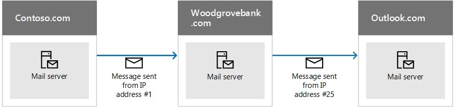

# <a name="how-office-365-uses-sender-policy-framework-spf-to-prevent-spoofing"></a>Cómo Office 365 usa el marco de directivas de remitente (SPF) para evitar la suplantación de identidad

 **Resumen:** Este artículo describe cómo Office 365 usa el registro TXT para el marco de directivas de remitente (SPF) en DNS para asegurarse de que los sistemas de correo electrónico de destino confían en los mensajes enviados desde su dominio personalizado. Esto se aplica al correo saliente enviado desde Office 365. Los mensajes enviados desde Office 365 a un destinatario dentro de Office 365 siempre pasarán SPF. 
  
Un registro TXT SPF es un registro DNS que ayuda a evitar la suplantación de IP y la suplantación de identidad mediante la comprobación del nombre del dominio desde el que se envían los mensajes de correo electrónico. Para validar el origen de los mensajes de correo electrónico, SPF contrasta la dirección IP del remitente con el supuesto propietario del dominio de envío. 
  
> [!NOTE]
> El Grupo de trabajo de ingeniería de Internet (IETF) consideró en desuso los tipos de registro SPF en 2014. En su lugar, asegúrese de que usa registros TXT en DNS para publicar la información SPF. El resto del artículo usa el término registro TXT SPF para mayor claridad. 
  
Los administradores de dominio publican información SPF en registros TXT de DNS. La información SPF identifica los servidores autorizados de correo electrónico saliente. Los sistemas de correo electrónico de destino comprueban que los mensajes proceden de servidores de correo electrónico saliente autorizados. Si ya está familiarizado con SPF, o dispone de una implementación simple y solo necesita saber qué incluir en el registro TXT de SPF de DNS para Office 365, puede ir a [Set up SPF in Office 365 to help prevent spoofing](set-up-spf-in-office-365-to-help-prevent-spoofing.md). Si no dispone de una implementación que esté completamente hospedada en Office 365, o si quiere más información sobre cómo funciona SPF o cómo puede solucionar problemas de SPF para Office 365, siga leyendo.
  
> [!NOTE]
> Antes, debía agregar un registro SPF TXT diferente a su dominio personalizado si también utilizaba SharePoint Online. Esto ya no es necesario. Este cambio debería reducir el riesgo de que los mensajes de notificación de SharePoint Online acaben en la carpeta de Correo no deseado. No es necesario realizar cambios inmediatamente, pero si recibe el error "demasiadas búsquedas", modifique el registro SPF TXT como se describe en [Set up SPF in Office 365 to help prevent spoofing](set-up-spf-in-office-365-to-help-prevent-spoofing.md). 
     
## <a name="how-spf-works-to-prevent-spoofing-and-phishing-in-office-365"></a>Cómo funciona SPF para evitar la suplantación de IP y la suplantación de identidad en Office 365
<a name="HowSPFWorks"> </a>

SPF determina si permite o no que un destinatario envíe en nombre de un dominio. Si el remitente no tiene permiso para hacerlo, es decir, si el correo electrónico no supera la comprobación SPF en el servidor de recepción, la directiva contra el correo no deseado configurada en ese servidor determina qué hacer con el mensaje.
  
Cada registro TXT SPF contiene tres partes: la declaración de que se trata de un registro TXT SPF, las direcciones IP que pueden enviar correo desde su dominio y los dominios externos que pueden enviar en nombre de su dominio, y una regla de cumplimiento. Un registro TXT SPF válido debe constar de esas tres partes. Este artículo describe cómo puede formar el registro TXT SPF y proporciona los procedimientos recomendados para trabajar con los servicios de Office 365. También se proporcionan los vínculos a las instrucciones sobre cómo trabajar con el registrador de dominios para publicar el registro en DNS.
  
### <a name="spf-basics-ip-addresses-allowed-to-send-from-your-custom-domain"></a>Conceptos básicos de SPF: Direcciones IP que pueden enviar desde su dominio personalizado
<a name="SPFBasicsIPaddresses"> </a>

Observe la sintaxis básica de una regla SPF:
  
v=spf1 \<IP\> \<enforcement rule\>
  
Por ejemplo, supongamos que existe la siguiente regla SPF para contoso.com:
  
v=spf1 \<IP address #1\> \<IP address #2\> \<IP address #3\> \<enforcement rule\>
  
En este ejemplo, la regla SPF indica al servidor de correo electrónico de recepción que solo debe aceptar correo de estas direcciones IP para el dominio contoso.com:
  
- IP address #1
    
- IP address #2
    
- IP address #3
    
Esta regla SPF indica al servidor de correo electrónico de recepción que si un mensaje proviene de contoso.com, pero no de una de estas tres direcciones IP, el servidor de recepción debe aplicar la regla de cumplimiento en el mensaje. Normalmente, la regla de cumplimiento es una de estas opciones:
  
- **Error grave.** Marca el mensaje con "error grave" en el sobre del mensaje y, después, sigue la política de correo no deseado configurada en el servidor de recepción para este tipo de mensaje. 
    
- **Error leve.** Marca el mensaje con "error leve" en el sobre del mensaje. Normalmente, los servidores de correo electrónico están configurados para enviar estos mensajes de todos modos. La mayoría de los usuarios finales no ve esta marca. 
    
- **Neutro.** No hace nada, es decir, no marca el sobre del mensaje. Esto se reserva normalmente para fines de prueba y rara vez se usa. 
    
Los ejemplos siguientes muestran cómo funciona SPF en diferentes situaciones. En estos ejemplos, contoso.com es el remitente y woodgrovebank.com es el receptor.
  
### <a name="example-1-email-authentication-of-a-message-sent-directly-from-sender-to-receiver"></a>Ejemplo 1: Autenticación de correo electrónico de un mensaje enviado directamente del remitente al receptor
<a name="spfExample1"> </a>

SPF funciona mejor cuando la ruta de acceso del remitente al receptor es directa, por ejemplo:
  

  
Cuando woodgrovebank.com recibe el mensaje, si la dirección IP #1 está en el registro TXT SPF para contoso.com, el mensaje supera la comprobación SPF y se autentica.
  
### <a name="example-2-spoofed-sender-address-fails-the-spf-check"></a>Ejemplo 2: La dirección falsificada del remitente no supera la comprobación SPF
<a name="spfExample2"> </a>

Supongamos que un suplantador de identidad busca una forma de suplantar contoso.com:
  

  
Como la dirección IP #12 no está en el registro TXT SPF de contoso.com, el mensaje no supera la comprobación SPF y el receptor puede marcarlo como correo no deseado.
  
### <a name="example-3-spf-and-forwarded-messages"></a>Ejemplo 3: SPF y los mensajes reenviados
<a name="spfExample3"> </a>

Un inconveniente de SPF es que no funciona cuando se ha reenviado un correo electrónico. Por ejemplo, supongamos que el usuario de woodgrovebank.com ha configurado una regla de reenvío para enviar todo el correo electrónico a una cuenta de outlook.com:
  

  
En un principio, el mensaje supera la comprobación SPF en woodgrovebank.com pero no supera la comprobación SPF en outlook.com, ya que la dirección IP #25 no se encuentra en el registro TXT SPF de contoso.com. Outlook.com puede marcar entonces el mensaje como correo no deseado. Para solucionar este problema, use SPF junto con otros métodos de autenticación de correo electrónico como DKIM y DMARC.
  
### <a name="spf-basics-including-third-party-domains-that-can-send-mail-on-behalf-of-your-domain"></a>Conceptos básicos de SPF: Incluir dominios de terceros que pueden enviar correo en nombre del dominio
<a name="SPFBasicsIncludes"> </a>

Además de las direcciones IP, también puede configurar el registro TXT SPF para incluir dominios como remitentes. Estos se agregan al registro TXT SPF como instrucciones "Include". Por ejemplo, contoso.com quiere incluir todas las direcciones IP de los servidores de correo de contoso.net y contoso.org que también le pertenece. Para ello, contoso.com publica un registro TXT SPF que tiene este aspecto:
  
```
IN TXT "v=spf1 include:contoso.net include:contoso.org -all"
```

Cuando el servidor de recepción ve este registro en DNS, también realiza una búsqueda DNS en el registro TXT SPF para contoso.net y, después, para contoso.org. Si encuentra una instrucción Include adicional dentro de los registros para contoso.net o contoso.org, también los seguirá. Con el fin de ayudar a evitar los ataques por denegación de servicio, el número máximo de búsquedas DNS para un único mensaje de correo electrónico es 10. Cada instrucción Include representa una búsqueda DNS adicional. Si un mensaje supera el límite de 10, el mensaje tiene errores SPF. Cada vez que un mensaje alcanza este límite, dependiendo de cómo está configurado el servidor de recepción, el remitente puede recibir un mensaje que indica que el mensaje generó "demasiadas búsquedas" o que "se ha superado el recuento máximo de saltos para el mensaje". Para obtener sugerencias sobre cómo evitar esto, consulte [Solución de problemas: Procedimientos recomendados para SPF en Office 365](how-office-365-uses-spf-to-prevent-spoofing.md#SPFTroubleshoot).
  
## <a name="requirements-for-your-spf-txt-record-and-office-365"></a>Requisitos para el registro TXT SPF y Office 365
<a name="SPFReqsinO365"> </a>

Si configuró el correo cuando configuró Office 365, ya creó un registro TXT SPF que identifica los servidores de mensajería de Microsoft como un origen legítimo de correo para el dominio. Probablemente, este registro tenga un aspecto similar al siguiente:
  
```
v=spf1 include:spf.protection.outlook.com -all
```

Si es un cliente de Office 365 completamente hospedado (es decir, no tiene servidores de correo locales que envíen correo saliente), este es el único registro TXT SPF que debe publicar en Office 365.
  
Si tiene una implementación híbrida (es decir, dispone de algunos buzones de correo locales y otros hospedados en Office 365), o si es un cliente independiente de Exchange Online Protection (EOP) (es decir, que su organización usa EOP para proteger los buzones locales), debería agregar la dirección IP de salida para cada uno de los servidores locales de correo perimetral en el registro TXT SPF de DNS.
  
## <a name="form-your-spf-txt-record-for-office-365"></a>Formar el registro TXT de SPF para Office 365
<a name="FormYourSPF"> </a>

Use la información de sintaxis de este artículo para formar el registro TXT de SPF para su dominio personalizado. Aunque existan otras opciones de sintaxis que no se mencionan aquí, estas son las opciones más usadas. Una vez que haya formado el registro, debe actualizarlo en el registrador de dominios.
  
Para obtener información sobre los dominios que necesitará incluir en Office 365, consulte [Registros externos del Sistema de nombres de dominio para Office 365](https://support.office.com/article/External-Domain-Name-System-records-for-Office-365-c0531a6f-9e25-4f2d-ad0e-a70bfef09ac0?ui=en-US&amp;rs=en-US&amp;ad=US). Use las [instrucciones paso a paso](https://office.microsoft.com/en-us/office365-suite-help/create-dns-records-for-office-365-HA102851099.aspx?CTT=5&amp;origin=HA102818404) para actualizar registros SPF (TXT) para el registrador de dominios. Si su registrador no aparece enumerado, necesitará ponerse en contacto con ellos por separado para obtener información sobre cómo actualizar el registro. 
  
### <a name="spf-txt-record-syntax-for-office-365"></a>Sintaxis del registro TXT SPF para Office 365
<a name="SPFSyntaxO365"> </a>

Un registro TXT SPF típico para Office 365 tiene la siguiente sintaxis:
  
```
v=spf1 [<ip4>|<ip6>:<IP address>] [include:<domain name>] <enforcement rule>
```

Por ejemplo:
  
```
v=spf1 ip4:192.168.0.1 ip4:192.168.0.2 include:spf.protection.outlook.com -all
```

donde:
  
- Se requiere **v=spf1**. Esto define el registro TXT como un registro TXT SPF. 
    
- **ip4** indica que está usando direcciones IP de la versión 4. **ip6** indica que está usando direcciones IP de la versión 6. Si usa direcciones IPv6 IP, reemplace **ip4** por **ip6** en los ejemplos de este artículo. También puede especificar los intervalos de direcciones IP mediante la notación CIDR, por ejemplo **ip4:192.168.0.1/26**.
    
-  _IP address_ es la dirección IP que quiere agregar al registro TXT SPF. Normalmente, esta es la dirección IP del servidor de correo saliente de su organización. Puede enumerar varios servidores de correo saliente. Para obtener más información, consulte [Ejemplo: Registro TXT SPF para varios servidores locales de correo saliente y Office 365](how-office-365-uses-spf-to-prevent-spoofing.md#ExampleSPFMultipleMailServerO365).
    
-  _domain name_ es el dominio que quiere agregar como un remitente legítimo. Para obtener una lista de nombres de dominio que debería incluir en Office 365, consulte [External DNS records required for SPF (Registros DNS externos requeridos para SPF)](https://support.office.com/article/External-Domain-Name-System-records-for-Office-365-c0531a6f-9e25-4f2d-ad0e-a70bfef09ac0?ui=en-US&amp;rs=en-US&amp;ad=US).
    
- Normalmente, la regla de cumplimiento es una de las siguientes:
    
  - -all
    
    Indica un error grave. Si conoce todas las direcciones IP autorizadas para el dominio, debe enumerarlas en el registro TXT SPF y usar el calificador -all (error grave). Además, si solo usa SPF, es decir, no está usando DMARC o DKIM, debe usar el calificador -all. Se recomienda que siempre use este calificador.
    
  - ~all
    
    Indica los errores leves. Si no está seguro de tener la lista completa de direcciones IP, entonces debería usar el calificador ~all (error leve). Además, si usa DMARC con p=quarantine o p=reject, entonces puede usar ~all. De lo contrario, use -all.
    
  - ?all
    
    Indica neutro. Se usa al probar SPF. No es recomendable usar este calificador en la implementación activa.
    
### <a name="example-spf-txt-record-to-use-when-all-of-your-mail-is-sent-by-office-365"></a>Ejemplo: El registro TXT SPF se usa cuando todo el correo se envía mediante Office 365
<a name="ExampleSPFNoSP"> </a>

Si todo el correo electrónico se envía mediante Office 365, utilice en su registro SPF TXT:
  
```
v=spf1 include:spf.protection.outlook.com -all
```

### <a name="example-spf-txt-record-for-a-hybrid-scenario-with-one-on-premises-exchange-server-and-office-365"></a>Ejemplo: Registro TXT SPF para un escenario híbrido con un servidor Exchange Server local y Office 365
<a name="ExampleSPFHybridOneExchangeServer"> </a>

En un entorno híbrido, si la dirección IP del servidor Exchange Server local es 192.168.0.1, para establecer la regla de cumplimiento SPF en error grave, forme el registro TXT SPF de la manera siguiente:
  
```
v=spf1 ip4:192.168.0.1 include:spf.protection.outlook.com -all
```

### <a name="example-spf-txt-record-for-multiple-outbound-on-premises-mail-servers-and-office-365"></a>Ejemplo: Registro TXT SPF para varios servidores locales de correo saliente y Office 365
<a name="ExampleSPFMultipleMailServerO365"> </a>

Si dispone de varios servidores de correo saliente, incluya la dirección IP de cada servidor de correo en el registro SPF TXT separando cada dirección con un espacio seguido de "ip4": instrucción. Por ejemplo:
  
```
v=spf1 ip4:192.168.0.1 ip4:192.168.0.2 ip4:192.168.0.3 include:spf.protection.outlook.com -all
```

## <a name="next-steps-set-up-spf-for-office-365"></a>Pasos siguientes: Configurar SPF para Office 365
<a name="SPFNextSteps"> </a>

Una vez que haya creado el registro SPF TXT, siga los pasos de [Set up SPF in Office 365 to help prevent spoofing](set-up-spf-in-office-365-to-help-prevent-spoofing.md) para agregarlo a su dominio. 
  
Aunque SPF está diseñado para ayudar a evitar la suplantación de identidad, existen técnicas de suplantación de identidad contra las que SPF no puede ofrecer protección. Para obtener protección contra estas, una vez que haya configurado SPF, también debe configurar DKIM y DMARC para Office 365. Vea [Usar DKIM para validar el correo electrónico saliente enviado desde su dominio personalizado en Office 365](use-dkim-to-validate-outbound-email.md) para comenzar. A continuación, vea [Usar DMARC para validar el correo electrónico en Office 365](use-dmarc-to-validate-email.md).
  
## <a name="troubleshooting-best-practices-for-spf-in-office-365"></a>Solución de problemas: Procedimientos recomendados para SPF en Office 365
<a name="SPFTroubleshoot"> </a>

Solo puede crear un registro TXT SPF para su dominio personalizado. La creación de varios registros provoca una situación de round robin y SPF producirá un error. Para evitar esto, puede crear registros independientes para cada subdominio. Por ejemplo, cree un registro para contoso.com y otro registro para bulkmail.contoso.com.
  
Si un mensaje de correo electrónico provoca más de 10 búsquedas DNS antes de que se envíe, el servidor de correo de recepción responderá con un error permanente, también denominado un  _permerror_, y provocará que el mensaje no supere la comprobación SPF. El servidor de recepción también puede responder con un informe de no entrega (NDR) que contiene un error similar a los siguientes:
  
- El mensaje ha superado el recuento de saltos.
    
- El mensaje ha necesitado demasiadas búsquedas.
    
## <a name="avoiding-the-too-many-lookups-error-when-you-use-third-party-domains-with-office-365"></a>Evitar el error "demasiadas búsquedas" cuando usa dominios de terceros con Office 365
<a name="SPFTroubleshoot"> </a>

Algunos registros TXT SPF para dominios de terceros ordenan al servidor de recepción que realicen un gran número de búsquedas DNS. Por ejemplo, en el momento de escribir este artículo, Salesforce.com contiene 5 instrucciones Include en el registro:
  
```
v=spf1 include:_spf.google.com
include:_spfblock.salesforce.com
include:_qa.salesforce.com
include:_spfblock1.salesforce.com
include:spf.mandrillapp.com mx ~all
```

Para evitar el error, puede implementar una directiva donde cualquier usuario pueda enviar correo masivo, por ejemplo, tiene que usar específicamente un subdominio para este propósito. Después, defina un registro TXT SPF diferente para el subdominio que incluye el correo masivo.
  
 En algunos casos, como en el ejemplo de salesforce.com, tiene que usar el dominio en el registro TXT SPF, pero en otros casos, puede que el tercero ya haya creado un subdominio para que lo use para este propósito. Por ejemplo, exacttarget.com ha creado un subdominio que debe usar para el registro TXT SPF: 
  
```
cust-spf.exacttarget.com
```

Al incluir dominios de terceros en el registro TXT SPF, debe confirmar con el tercero qué dominio o subdominio usar para evitar verse afectado por el límite de 10 búsquedas.
  
## <a name="how-to-view-your-current-spf-txt-record-and-determine-the-number-of-lookups-that-it-requires"></a>Cómo ver el registro TXT SPF actual y determinar el número de búsquedas que requiere
<a name="SPFTroubleshoot"> </a>

Puede usar nslookup para ver los registros DNS, incluido el registro TXT SPF. O bien, si lo prefiere, hay varias herramientas disponibles, gratuitas y en línea que puede usar para ver el contenido del registro TXT SPF. Puede determinar cuántas búsquedas DNS requiere el registro al observar el registro TXT SPF y seguir la cadena de instrucciones Include y redireccionamientos. Algunas herramientas en línea incluso harán un recuento y le mostrarán estas búsquedas. Realizar un seguimiento de este número le ayudará a evitar que los mensajes enviados desde su organización desencadenen un error permanente, denominado un permerror, desde el servidor de recepción.
  
## <a name="for-more-information"></a>Más información
<a name="SPFTroubleshoot"> </a>

¿Necesita ayuda para agregar el registro TXT SPF? Hay [instrucciones paso a paso](https://office.microsoft.com/en-us/office365-suite-help/create-dns-records-for-office-365-HA102851099.aspx?CTT=5&amp;origin=HA102818404) para actualizar registros SPF (TXT) en varios registradores de dominios conocidos. Los [Encabezados de mensajes de correo no deseado](anti-spam-message-headers.md) incluyen la sintaxis y los campos de encabezado que usa Office 365 para efectuar comprobaciones de SPF. 
  

