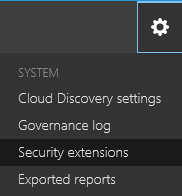

# <a name="integrate-your-siem-server-with-office-365-cloud-app-security"></a>Integrar el servidor SIEM con Office 365 Cloud App Security
  
|Evaluación **\>**|Planeación de **\>**|Implementación **\>**|Utilización de ***|
|:-----|:-----|:-----|:-----|
|[Empezar a evaluar](office-365-cas-overview.md) <br/> |[Comenzar a planear](get-ready-for-office-365-cas.md) <br/> |¡Están aquí!  <br/> [Siguiente paso](utilization-activities-for-ocas.md) <br/> |[Iniciar utilizando](utilization-activities-for-ocas.md) <br/> |
   
También puede integrar la [Seguridad de la aplicación de Office 365 en la nube](get-ready-for-office-365-cas.md) con el servidor de administración (SIEM) de eventos e información de seguridad para habilitar la supervisión centralizada de alertas. Esto es especialmente beneficioso para las organizaciones que usan servicios de nube locales y en aplicaciones de servidor. Integración con un servidor SIEM permite a su equipo de seguridad proteger mejor las aplicaciones de Office 365 que se mantiene el flujo de trabajo de seguridad habituales, al automatizar determinados procedimientos de seguridad y correlacionar entre basados en la nube y locales eventos.  
  
Al integrar en primer lugar el servidor SIEM con seguridad de la aplicación de nube de Office 365, las alertas de los últimos dos días se transfieren en el servidor SIEM, así como todas las alertas desde, a continuación, en (basado en los filtros que seleccione). Además, si se deshabilita esta característica durante un período prolongado, cuando se vuelve a habilitar, reenviará los últimos dos días de alertas y, a continuación, todas las alertas de, a continuación, en.
 
## <a name="siem-integration-architecture"></a>Arquitectura de integración de SIEM

Un agente SIEM está configurado en la red de su organización. Cuando se ha implementado y configurado, el agente de SIEM extrae los tipos de datos que se configuraron (alertas) mediante la API de REST de la seguridad de aplicaciones de Office 365 en la nube. A continuación, se envía el tráfico a través de un canal HTTPS cifrado en el puerto 443.
  
Cuando un agente de SIEM recupera datos de seguridad de la aplicación de nube de Office 365, envía los mensajes de registro del sistema en el servidor local de SIEM con las configuraciones de red que se proporcionan durante la instalación (TCP o UDP con un puerto personalizado).


## <a name="supported-siem-servers"></a>Servidores SIEM compatibles

Seguridad de la aplicación de Office 365 en la nube actualmente es compatible con los servidores SIEM siguientes:
- ArcSight Micro Focus
- CEF genérica

## <a name="prerequisites"></a>Requisitos previos

- Debe ser un administrador global o administrador de seguridad para llevar a cabo las tareas descritas en este artículo. Vea [permisos en la seguridad de Office 365 &amp; centro de cumplimiento](permissions-in-the-security-and-compliance-center.md)

- Debe tener [habilitada la seguridad de la aplicación de Office 365 en la nube](turn-on-office-365-cas.md) para su organización.

- [Registro de auditoría](turn-audit-log-search-on-or-off.md) debe estar activada para Office 365

- Debe tener un servidor estándar que cumple los siguientes requisitos para poder configurar la integración del servidor SIEM:
    - SO: Windows o Linux (puede ser una máquina virtual)
    - CPU: 2
    - Espacio en disco: 20 GB
    - RAM: 2 GB
    - [Oracle Java 8](http://www.oracle.com/technetwork/java/javase/downloads/index.html) instalado
    - Firewall configurado como se describe en [los requisitos de red](https://docs.microsoft.com/cloud-app-security/network-requirements)

- Debe disponer de obtener información detallada sobre el **host remoto de registro del sistema** y el **número de puerto de Syslot**. Un administrador de red o un administrador de seguridad debe ser capaz de ayudarle a encontrar esa información. 

- Debe aceptar [los términos de licencia de software](https://go.microsoft.com/fwlink/?linkid=862491) descargar el [fichero JAR](https://go.microsoft.com/fwlink/?linkid=838596) que necesitará para integrar su servidor SIEM.
 
## <a name="integrate-office-365-cloud-app-security"></a>Integrar la seguridad de la aplicación de Office 365 en la nube
    
### <a name="step-1-set-it-up-in-the-office-365-cloud-app-security-portal"></a>Paso 1: Configurado en el portal de seguridad de la aplicación de nube de Office 365

1. Vaya a [https://protection.office.com](https://protection.office.com) e iniciar sesión con su cuenta de trabajo o escuela para Office 365. (Esto le llevará a la seguridad &amp; centro de cumplimiento.) 
    
2. Vaya a **las alertas de** \> **avanzada de administrar las alertas**.
    
3. Elija **Ir a la seguridad de la aplicación de Office 365 en la nube**.<br/>
    
  
4. Haga clic en **configuración de** \> **extensiones de seguridad**.<br/>


5. Elija **Agregar SIEM agente**.<br/>
    
6. Elija **iniciar el Asistente**.<br/> 
    
7. En el paso **General** , especifique un nombre y **Seleccione el formato SIEM** y establecer cualquier **Configuración avanzada** que son relevantes para ese formato. A continuación, elija **siguiente**.<br/>
    
8. En el paso **Remoto de registro del sistema** , especifique la dirección IP o el nombre de host del **host remoto de registro del sistema** y el **número de puerto del registro del sistema**. Seleccione TCP o UDP como protocolo remoto registro del sistema. (Puede trabajar con el Administrador de seguridad o administrador de red para obtener estos detalles si no dispone de ellos). A continuación, elija **siguiente**.<br/>
  
9. En el paso de **Tipos de datos** , siga uno de los siguientes procedimientos y, a continuación, haga clic en **siguiente**:
    - Conserve la configuración predeterminada de **Todas las alertas**<br/>OR
    - Haga clic en **todas las alertas**y, a continuación, elija **filtros específicos**. Definir filtros para seleccionar los tipos de alertas que desea enviar a su servidor SIEM.<br/>
  
10. En la pantalla Enhorabuena, copie el token y guardar para usarlo más adelante.<br/> 

> [!IMPORTANT]
> En este punto, ha configurado un agente de SIEM en seguridad de la aplicación de Office 365 en la nube, pero aún no se han finalizado la integración del servidor de SIEM. Continúe con el paso siguiente para continuar la integración del servidor de SIEM.

Una vez que haga clic en Cerrar y salir del asistente, en la pantalla de extensiones de seguridad, puede ver al agente de SIEM que agregó en la tabla. Se mostrará un estado **creado** hasta que se conecta más adelante.


    
### <a name="step-2-download-the-jar-file-and-run-it-on-your-server"></a>Paso 2: Descargar el archivo JAR y ejecutar en el servidor

1. Descargue el [Agente de SIEM de seguridad de aplicación de Microsoft en la nube](https://go.microsoft.com/fwlink/?linkid=838596) y descomprima la carpeta. (Debe aceptar los términos de [licencia](https://go.microsoft.com/fwlink/?linkid=862491) de software para poder continuar). 
    
2. Extraiga el archivo .jar desde la carpeta zip y ejecutar en el servidor.
    
3. Después de ejecutar el archivo, ejecute lo siguiente: comando:<br/>
  ```
  java -jar mcas-siemagent-0.87.20-signed.jar [--logsDirectory DIRNAME] [--proxy ADDRESS[:PORT]] --token TOKEN
  ```
#### <a name="important-notes"></a>Notas importantes

- El nombre de archivo puede diferir dependiendo de la versión del agente SIEM. 

- Se recomienda ejecutar el relleno JAR en el servidor durante la instalación del servidor.
    - **Windows**: ejecute como una tarea programada, asegurándose de que se configure la tarea para **ejecutar si el usuario inició sesión como si no** y desactive la opción **Detener la tarea si se ejecuta más de** .

    - **Linux**: agregar el comando ejecutar con un **&** a la `rc.local` archivo. <br/>Ejemplo:<br/> 
    ```
    java -jar mcas-siemagent-0.87.20-signed.jar [--logsDirectory DIRNAME] [--proxy ADDRESS[:PORT]] --token TOKEN &
    ```

- Parámetros entre corchetes [] son opcionales y deben usarse sólo si es relevante. Use las siguientes variables:
    - **DIRNAME** es la ruta de acceso al directorio que desea usar para los registros de depuración de agente local.
    - **Dirección [: puerto]** es la dirección del servidor proxy y el puerto que utiliza el servidor para conectarse a Internet.
    - **Símbolo (token)** es el símbolo (token) de agente SIEM que se copió en el primer procedimiento.
    - Para obtener ayuda, escriba `-h`. 
  
### <a name="step-3-validate-that-the-siem-agent-is-working"></a>Paso 3: Validar que el agente de SIEM está funcionando

1. Asegúrese de que el estado del agente SIEM en el portal de seguridad de la aplicación de nube de Office 365 no se muestra como **error de conexión** o **desconectado** y que no hay ninguna notificación de agente.<br/>Por ejemplo, aquí podemos ver que está conectado el servidor SIEM:<br/><br/>Y, a continuación, podemos ver que el servidor SIEM está desconectado:<br/> 
  
2. En el servidor de registro del sistema/SIEM, asegúrese de que vea que han llegado las alertas de seguridad de la aplicación de nube de Office 365.
  
## <a name="regenerating-your-token"></a>Volver a generar el símbolo (token)

Si se pierde su token, puede regenerar siempre. En la tabla, busque la fila para el agente de SIEM. Haga clic en los puntos suspensivos y elija, a continuación, **vuelva a generar el símbolo (token)**.


  
## <a name="editing-your-siem-agent"></a>El agente SIEM de edición

Para editar a su agente SIEM, en la tabla, busque la fila para el agente de SIEM. Haga clic en los puntos suspensivos y, a continuación, elija **Editar**. Si edita al agente de SIEM, no es necesario volver a ejecutar el archivo .jar; actualiza automáticamente.


  
## <a name="deleting-your-siem-agent"></a>Eliminar al agente SIEM

Para eliminar al agente SIEM, en la tabla, busque la fila para el agente de SIEM. Haga clic en los puntos suspensivos y, a continuación, elija **Eliminar**.


## <a name="sample-logfiles"></a>Archivos de registro de ejemplo

Este es un ejemplo de archivo de registro de alertas que es posible que se envíen a un servidor SIEM:

```
2017-07-15T20:42:30.531Z CEF:0|MCAS|SIEM_Agent|0.102.17|ALERT_CABINET_EVENT_MATCH_AUDIT|myPolicy|3|externalId=596a7e360c204203a335a3fb start=1500151350531 end=1500151350531 msg=Activity policy ''myPolicy'' was triggered by ''admin@box-contoso.com'' suser=admin@box-contoso.com destinationServiceName=Box cn1Label=riskScore cn1= cs1Label=portalURL cs1=https://cloud-app-security.com/#/alerts/596a7e360c204203a335a3fb cs2Label=uniqueServiceAppIds cs2=APPID_BOX cs3Label=relatedAudits cs3=1500151288183_acc891bf-33e1-424b-a021-0d4370789660 cs4Label=policyIDs cs4=59f0ab82f797fa0681e9b1c7

2017-07-16T09:36:26.550Z CEF:0|MCAS|SIEM_Agent|0.102.17|ALERT_CABINET_EVENT_MATCH_AUDIT|test-activity-policy|3|externalId=596b339b0c204203a33a51ae start=1500197786550 end=1500197786550 msg=Activity policy ''test-activity-policy'' was triggered by ''user@contoso.com'' suser=user@contoso.com destinationServiceName=Salesforce cn1Label=riskScore cn1= cs1Label=portalURL cs1=https://cloud-app-security.com/#/alerts/596b339b0c204203a33a51ae cs2Label=uniqueServiceAppIds cs2=APPID_SALESFORCE cs3Label=relatedAudits cs3=1500197720691_b7f6317c-b8de-476a-bc8f-dfa570e00349 cs4Label=policyIDs cs4=

2017-07-16T09:17:03.361Z CEF:0|MCAS|SIEM_Agent|0.102.17|ALERT_CABINET_EVENT_MATCH_AUDIT|test-activity-policy3|3|externalId=596b2fd70c204203a33a3eeb start=1500196623361 end=1500196623361 msg=Activity policy ''test-activity-policy3'' was triggered by ''admin@contoso.com'' suser=admin@contoso.com destinationServiceName=Office 365 cn1Label=riskScore cn1= cs1Label=portalURL cs1=https://cloud-app-security.com/#/alerts/596b2fd70c204203a33a3eeb cs2Label=uniqueServiceAppIds cs2=APPID_O365 cs3Label=relatedAudits cs3=1500196549157_a0e01f8a-e29a-43ae-8599-783c1c11597d cs4Label=policyIDs cs4=

2017-07-16T09:17:15.426Z CEF:0|MCAS|SIEM_Agent|0.102.17|ALERT_CABINET_EVENT_MATCH_AUDIT|test-activity-policy|3|externalId=596b2fd70c204203a33a3eec start=1500196635426 end=1500196635426 msg=Activity policy ''test-activity-policy'' was triggered by ''admin@contoso.com'' suser=admin@contoso.com destinationServiceName=Microsoft Office 365 admin center cn1Label=riskScore cn1= cs1Label=portalURL cs1=https://cloud-app-security.com/#/alerts/596b2fd70c204203a33a3eec cs2Label=uniqueServiceAppIds cs2=APPID_O365_PORTAL cs3Label=relatedAudits cs3=1500196557398_3e102b20-d9fa-4f66-b550-8c7a403bb4d8 cs4Label=policyIDs cs4=59f0ab35f797fa9811e9b1c7

2017-07-16T09:17:46.290Z CEF:0|MCAS|SIEM_Agent|0.102.17|ALERT_CABINET_EVENT_MATCH_AUDIT|test-activity-policy4|3|externalId=596b30200c204203a33a4765 start=1500196666290 end=1500196666290 msg=Activity policy ''test-activity-policy4'' was triggered by ''admin@contoso.com'' suser=admin@contoso.com destinationServiceName=Microsoft Exchange Online cn1Label=riskScore cn1= cs1Label=portalURL cs1=https://cloud-app-security.com/#/alerts/596b30200c204203a33a4765 cs2Label=uniqueServiceAppIds cs2=APPID_OUTLOOK cs3Label=relatedAudits cs3=1500196587034_a8673602-7e95-46d6-a1fe-c156c4709c5d cs4Label=policyIDs cs4=

2017-07-16T09:41:04.369Z CEF:0|MCAS|SIEM_Agent|0.102.17|ALERT_CABINET_EVENT_MATCH_AUDIT|test-activity-policy2|3|externalId=596b34b10c204203a33a5240 start=1500198064369 end=1500198064369 msg=Activity policy ''test-activity-policy2'' was triggered by ''user2@test15-adallom.com'' suser=user2@test15-adallom.com destinationServiceName=Google cn1Label=riskScore cn1= cs1Label=portalURL cs1=https://cloud-app-security.com/#/alerts/596b34b10c204203a33a5240 cs2Label=uniqueServiceAppIds cs2=APPID_33626 cs3Label=relatedAudits cs3=1500197996117_fd71f265-1e46-4f04-b372-2e32ec874cd3 cs4Label=policyIDs cs4=
```

Y aquí es un ejemplo de en formato CEF


|Nombre del campo CEF  | Descripción  |
|---------|---------|
|Inicio     | marca de tiempo de alerta        |
|end     | marca de tiempo de alerta        |
|RT     | marca de tiempo de alerta        |
|msg     | Descripción de la alerta tal como se muestra en el portal de seguridad de la aplicación de nube de Office 365        |
|suser se     | usuario de asunto de alerta        |
|destinationServiceName     | alerta de que se originan aplicación, como Office 365, SharePoint o OneDrive        |
|csLabel     | Varía (etiquetas tengan diferentes significados). Normalmente, las etiquetas son explican por sí solos, al igual que targetObjects.        |
|cs     | Información correspondiente a una etiqueta (por ejemplo, el usuario de destino de una alerta de acuerdo con el ejemplo de etiqueta)        |
  
## <a name="next-steps"></a>Pasos siguientes

- [Actividades de uso después de implementar Office 365 Cloud App Security](utilization-activities-for-ocas.md)
    
- [Revisar y realizar acciones en las alertas](review-office-365-cas-alerts.md)
    
- [Las direcciones IP para simplificar la administración de grupo](group-your-ip-addresses-in-ocas.md)
    

