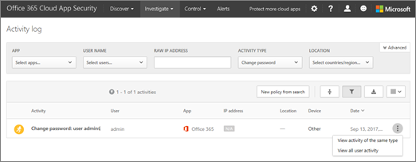

# Investigar la actividad en Office 365 Cloud App Security
  
|Evaluación **\>**|Planeación de **\>**|Implementación **\>**|Utilización de ***|
|:-----|:-----|:-----|:-----|
|[Empezar a evaluar](office-365-cas-overview.md)   |[Comenzar a planear](get-ready-for-office-365-cas.md)   |[Iniciar la implementación](turn-on-office-365-cas.md)   |¡Están aquí!    [Pasos siguientes](#next-steps)   |
   
Office 365 funciona la seguridad de la aplicación en la nube con el [registro de auditoría de Office 365](detailed-properties-in-the-office-365-audit-log.md). Con la seguridad de la aplicación de nube de Office 365, como un administrador global o administrador de seguridad, puede usar la página de registro de actividad para ver posibles problemas en el modo en que su organización usa Office 365.
  
## Cómo llegar a la página de registro de actividad

1. Vaya al portal de seguridad de la aplicación en la nube ([https://portal.cloudappsecurity.com](https://portal.cloudappsecurity.com)) e iniciar sesión.
  
2. En la barra de navegación a través de la parte superior de la pantalla, elija **investigar** \> **registro de actividad**. 
  
## Revise e investigar las actividades

En la página de registro de actividad, puede ver una lista de diversas actividades que se están produciendo dentro de la organización con Office 365. Puede usar filtros en la parte superior de la pantalla para centrarse en un tipo específico de la actividad o un usuario específico. Por ejemplo, en la siguiente imagen se muestra información acerca del cambio de contraseña de la cuenta de administración de Office 365 de la organización:
  

  
En lo que respecta a cada elemento en el registro de actividad, puede hacer clic en los puntos suspensivos para buscar otras actividades relacionadas. Por ejemplo, puede ver otras actividades del mismo tipo, desde la misma dirección IP, o desde el mismo país o región.
  
Puede ver información acerca de muchos otros tipos de actividades, demasiado. Por ejemplo, aquí son algunas de las actividades que se puede ver en el registro de actividades:
  
- Agregar o quitar de grupos de miembros
    
- Cambios en las licencias de usuario
    
- Los archivos o carpetas compartidas interna o externamente
    
- Creado o eliminados sitios o colecciones de sitios
    
- Las reglas de transferencia de correo electrónico
    
Use la página de registro de actividad de familiarizarse con cómo las personas de su organización están usando Office 365 y qué problemas es posible que tenga a lo largo de la forma.
  
## Pasos siguientes

- [Revisar y realizar acciones sobre alertas en Office 365 Cloud App Security](review-office-365-cas-alerts.md)
    
- Revise las [actividades de uso para la seguridad de la aplicación de nube de Office 365](utilization-activities-for-ocas.md)
    

